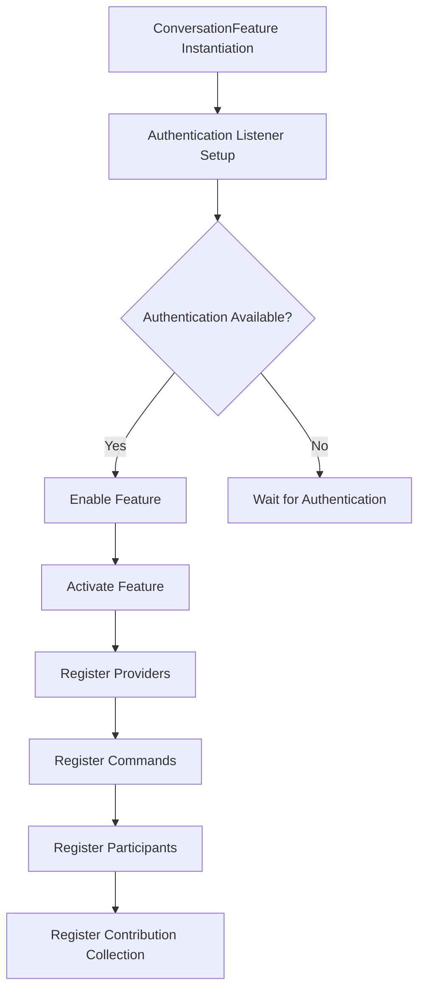
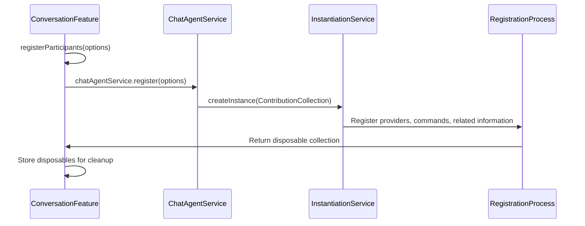
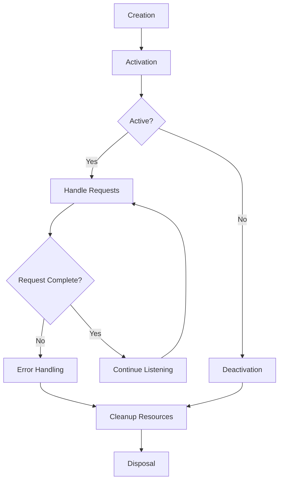
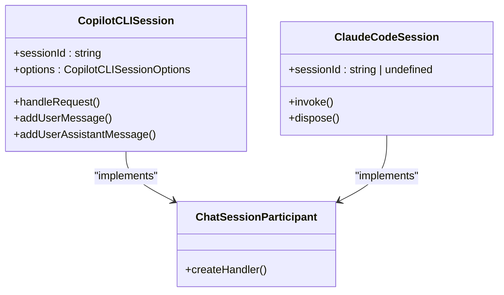

# Chat Participants

<cite>
**Referenced Files in This Document**   
- [conversationFeature.ts](file://src/extension/conversation/vscode-node/conversationFeature.ts)
- [chatSessions.ts](file://src/extension/chatSessions/vscode-node/chatSessions.ts)
- [claudeCodeAgent.ts](file://src/extension/agents/claude/node/claudeCodeAgent.ts)
- [copilotCli.ts](file://src/extension/agents/copilotcli/node/copilotCli.ts)
- [claudeChatSessionParticipant.ts](file://src/extension/chatSessions/vscode-node/claudeChatSessionParticipant.ts)
- [copilotCLIChatSessionsContribution.ts](file://src/extension/chatSessions/vscode-node/copilotCLIChatSessionsContribution.ts)
- [chatAgents.ts](file://src/platform/chat/common/chatAgents.ts)
</cite>

## Table of Contents
1. [Introduction](#introduction)
2. [Chat Participant Registration](#chat-participant-registration)
3. [Initialization and Activation](#initialization-and-activation)
4. [Lifecycle Management](#lifecycle-management)
5. [Participant Types](#participant-types)
6. [Interaction with Conversation System](#interaction-with-conversation-system)
7. [Best Practices](#best-practices)
8. [Conclusion](#conclusion)

## Introduction
The vscode-copilot-chat extension implements a sophisticated chat participant system that enables various AI agents to interact with users through VS Code's chat interface. This documentation details how chat participants are registered, initialized, and managed throughout their lifecycle. The system supports multiple participant types including Copilot CLI, Claude code agent, and GitHub MCP, each with specific capabilities and integration patterns. The architecture follows a service-oriented design where participants are registered through the ConversationFeature contribution and integrated with VS Code's chat system via proper lifecycle management.

## Chat Participant Registration

The registration of chat participants in vscode-copilot-chat follows a structured process centered around the `ConversationFeature` class, which serves as the main entry point for enabling and managing chat functionality. The registration process begins when the `ConversationFeature` is instantiated and listens for authentication changes that determine whether chat capabilities should be enabled.



**Diagram sources**
- [conversationFeature.ts](file://src/extension/conversation/vscode-node/conversationFeature.ts#L67-L146)

The key method in this process is `registerParticipants(options: IConversationOptions)` which delegates to the `IChatAgentService` to register all available chat agents. This service-oriented approach allows for extensibility and proper dependency injection. The chat participants are identified by unique names that are prefixed with 'github.copilot.' as defined in the `CHAT_PARTICIPANT_ID_PREFIX` constant.

When a participant is registered, it becomes available in the VS Code chat interface and can be invoked by users. The registration process also sets up context values that control the visibility of UI elements, such as the sidebar icon, based on whether the feature is enabled.

**Section sources**
- [conversationFeature.ts](file://src/extension/conversation/vscode-node/conversationFeature.ts#L156-L158)
- [chatAgents.ts](file://src/platform/chat/common/chatAgents.ts#L29-L36)

## Initialization and Activation

The initialization and activation of chat participants follows a well-defined sequence that ensures proper setup before the participants become operational. The activation process is triggered when the `activated` property of `ConversationFeature` is set to true, which occurs when authentication is available and chat capabilities are enabled.



**Diagram sources**
- [conversationFeature.ts](file://src/extension/conversation/vscode-node/conversationFeature.ts#L138-L144)
- [chatSessions.ts](file://src/extension/chatSessions/vscode-node/chatSessions.ts#L73-L130)

The activation process involves several key steps:
1. **Provider Registration**: Various providers are registered to handle different aspects of the chat functionality
2. **Command Registration**: Commands are registered to enable user interactions with the chat system
3. **Related Information Providers**: Providers for related information are set up to enhance the chat experience
4. **Contribution Collection**: Additional contributions are instantiated and registered

For specific participants like the Claude code agent and Copilot CLI, initialization involves creating specialized session services and managers. The `ClaudeAgentManager` is responsible for managing Claude Code agent interactions and language model server lifecycle, while the `CopilotCLISessionService` handles session management for the Copilot CLI agent.

**Section sources**
- [conversationFeature.ts](file://src/extension/conversation/vscode-node/conversationFeature.ts#L138-L144)
- [claudeCodeAgent.ts](file://src/extension/agents/claude/node/claudeCodeAgent.ts#L31-L49)

## Lifecycle Management

The lifecycle of chat participants in vscode-copilot-chat is carefully managed through a combination of disposable patterns and event-driven architecture. Each participant follows a standard lifecycle from creation to disposal, with proper resource cleanup at each stage.



**Diagram sources**
- [claudeCodeAgent.ts](file://src/extension/agents/claude/node/claudeCodeAgent.ts#L150-L181)
- [copilotCLIChatSessionsContribution.ts](file://src/extension/chatSessions/vscode-node/copilotCLIChatSessionsContribution.ts#L406-L525)

The lifecycle management is implemented through several key mechanisms:

1. **Disposable Pattern**: All participants implement the `Disposable` interface, ensuring that resources are properly cleaned up when the participant is no longer needed. The `dispose()` method is called to release resources and clean up event listeners.

2. **Session Management**: For participants that maintain state across multiple interactions, session management is crucial. The `ClaudeCodeSession` class, for example, maintains a queue of requests and processes them sequentially, ensuring that resources are properly managed throughout the session.

3. **Error Handling**: The lifecycle includes comprehensive error handling to ensure that failures in one request do not affect subsequent requests. When an error occurs, the session continues to process subsequent requests while logging the error for diagnostic purposes.

4. **Cancellation Support**: The lifecycle supports request cancellation through the use of cancellation tokens, allowing users to abort long-running operations.

The `ConversationFeature` class itself implements lifecycle management through its `dispose()` method, which cleans up all activated disposables and ensures that the feature can be properly deactivated when needed.

**Section sources**
- [claudeCodeAgent.ts](file://src/extension/agents/claude/node/claudeCodeAgent.ts#L174-L181)
- [conversationFeature.ts](file://src/extension/conversation/vscode-node/conversationFeature.ts#L148-L152)

## Participant Types

The vscode-copilot-chat extension supports multiple types of chat participants, each with specific capabilities and use cases. The main participant types include Copilot CLI, Claude code agent, and GitHub MCP, each implemented with specialized classes and services.

### Copilot CLI Participant

The Copilot CLI participant enables users to run the Copilot CLI tool within VS Code's chat interface. This participant is implemented through several key components:

- `CopilotCLISession`: Represents a CLI session and handles communication with the Copilot CLI SDK
- `CopilotCLISessionService`: Manages the lifecycle of CLI sessions
- `CopilotCLIChatSessionParticipant`: Handles chat requests and integrates with the chat system

The Copilot CLI participant supports features such as isolation through worktrees, model selection, and agent configuration. It also provides integration with Git through worktree management, allowing users to work in isolated environments.

### Claude Code Agent

The Claude code agent participant enables integration with Anthropic's Claude model for code-related tasks. Key components include:

- `ClaudeAgentManager`: Manages Claude Code agent interactions and language model server lifecycle
- `ClaudeCodeSession`: Represents a Claude session and handles request processing
- `ClaudeChatSessionParticipant`: Integrates the Claude agent with VS Code's chat system

The Claude agent supports advanced features such as tool use (editing, bash commands, etc.), with proper permission handling and user confirmation. It also maintains session state across multiple interactions, allowing for complex multi-step workflows.

### GitHub MCP Participant

While the specific implementation details for the GitHub MCP participant are not fully visible in the provided code, the architecture suggests it would follow similar patterns to the other participants. It would likely include:

- A session service for managing MCP sessions
- A participant class that handles chat requests
- Integration with GitHub services for pull request and repository operations

The MCP participant would enable users to delegate tasks to GitHub's cloud agents, with proper handling of authentication and repository operations.



**Diagram sources**
- [copilotCli.ts](file://src/extension/agents/copilotcli/node/copilotCli.ts#L31-L92)
- [claudeCodeAgent.ts](file://src/extension/agents/claude/node/claudeCodeAgent.ts#L150-L181)

**Section sources**
- [copilotCli.ts](file://src/extension/agents/copilotcli/node/copilotCli.ts#L31-L92)
- [claudeCodeAgent.ts](file://src/extension/agents/claude/node/claudeCodeAgent.ts#L31-L49)

## Interaction with Conversation System

Chat participants interact with VS Code's conversation system through a well-defined API that enables seamless integration with the chat interface. The interaction follows a request-response pattern where participants handle user queries and provide responses through the chat response stream.

```mermaid
sequenceDiagram
participant User
participant VSCode as VS Code Chat
participant Participant
participant Stream as ChatResponseStream
User->>VSCode : Send message
VSCode->>Participant : handleRequest(request, context, stream, token)
Participant->>Stream : markdown()
Participant->>Stream : progress()
Participant->>Stream : button()
Participant->>Stream : warning()
Stream->>VSCode : Update chat UI
VSCode->>User : Display response
```

**Diagram sources**
- [claudeChatSessionParticipant.ts](file://src/extension/chatSessions/vscode-node/claudeChatSessionParticipant.ts#L23-L58)
- [copilotCLIChatSessionsContribution.ts](file://src/extension/chatSessions/vscode-node/copilotCLIChatSessionsContribution.ts#L438-L525)

The interaction process involves several key components:

1. **Request Handling**: Participants implement the `handleRequest` method which receives the user's request, context, response stream, and cancellation token. This method processes the request and sends responses back through the stream.

2. **Response Streaming**: Participants can send various types of responses through the `ChatResponseStream`, including:
   - Markdown content using `stream.markdown()`
   - Progress updates using `stream.progress()`
   - Interactive buttons using `stream.button()`
   - Warnings using `stream.warning()`

3. **Context Awareness**: Participants have access to the chat context, which includes information about the current session, history, and any referenced resources. This allows participants to provide context-aware responses.

4. **Session Management**: For participants that maintain state, the chat session context provides information about whether the session is new (untitled) or existing, allowing for appropriate initialization.

The `ClaudeChatSessionParticipant` and `CopilotCLIChatSessionParticipant` classes demonstrate different approaches to handling chat requests. The Claude participant creates or reuses sessions based on the chat context, while the Copilot CLI participant handles both new and existing sessions with proper state management.

**Section sources**
- [claudeChatSessionParticipant.ts](file://src/extension/chatSessions/vscode-node/claudeChatSessionParticipant.ts#L23-L58)
- [copilotCLIChatSessionsContribution.ts](file://src/extension/chatSessions/vscode-node/copilotCLIChatSessionsContribution.ts#L438-L525)

## Best Practices

When creating new chat participants for vscode-copilot-chat, several best practices should be followed to ensure proper integration and user experience:

### State Management
- Use the disposable pattern to ensure proper resource cleanup
- Store session state in appropriate services rather than in the participant itself
- Use memento storage for persistent state that should survive across sessions
- Implement proper error handling to prevent one failed request from affecting subsequent requests

### User Experience
- Provide clear progress updates for long-running operations
- Use appropriate response types (markdown, progress, buttons) to enhance interactivity
- Handle cancellation gracefully to allow users to abort operations
- Provide meaningful error messages that help users understand what went wrong

### Performance
- Minimize initialization time by deferring expensive operations until needed
- Use asynchronous operations to prevent blocking the UI
- Cache expensive computations when appropriate
- Optimize resource usage, especially for participants that maintain long-lived sessions

### Security
- Validate all inputs and references to prevent injection attacks
- Handle authentication and authorization properly
- Sanitize any user-provided content before displaying it
- Follow the principle of least privilege when requesting permissions

### Testing
- Implement comprehensive unit tests for core functionality
- Use mock services to test integration with the chat system
- Test edge cases such as cancellation, errors, and network failures
- Verify proper disposal and resource cleanup

These best practices ensure that new chat participants integrate seamlessly with the existing system and provide a high-quality user experience.

**Section sources**
- [claudeCodeAgent.ts](file://src/extension/agents/claude/node/claudeCodeAgent.ts)
- [copilotCli.ts](file://src/extension/agents/copilotcli/node/copilotCli.ts)

## Conclusion
The chat participant system in vscode-copilot-chat provides a robust framework for integrating AI agents with VS Code's chat interface. Through a well-defined registration process, proper initialization and activation, and comprehensive lifecycle management, the system supports multiple participant types including Copilot CLI, Claude code agent, and GitHub MCP. The architecture follows best practices for state management, user experience, performance, security, and testing, ensuring that participants provide a high-quality experience for users. By following the patterns and practices documented here, developers can create new chat participants that integrate seamlessly with the existing system and extend the capabilities of the vscode-copilot-chat extension.