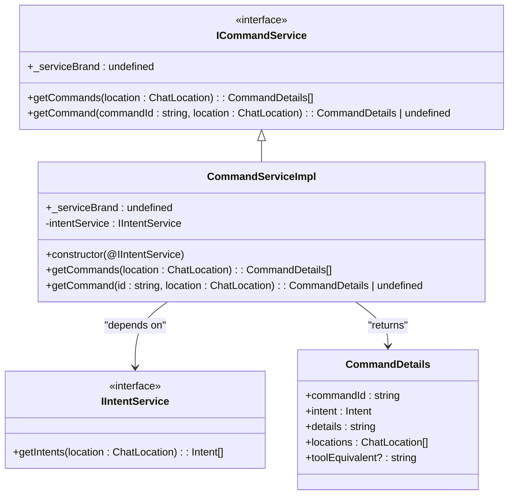
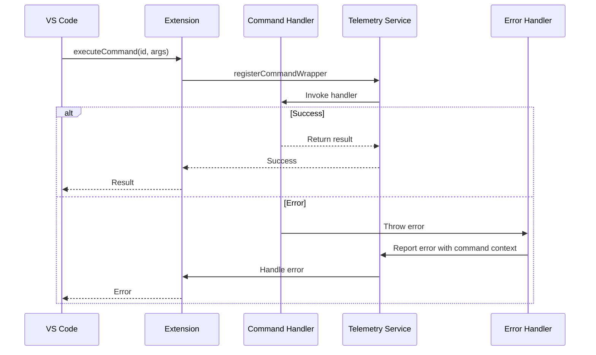
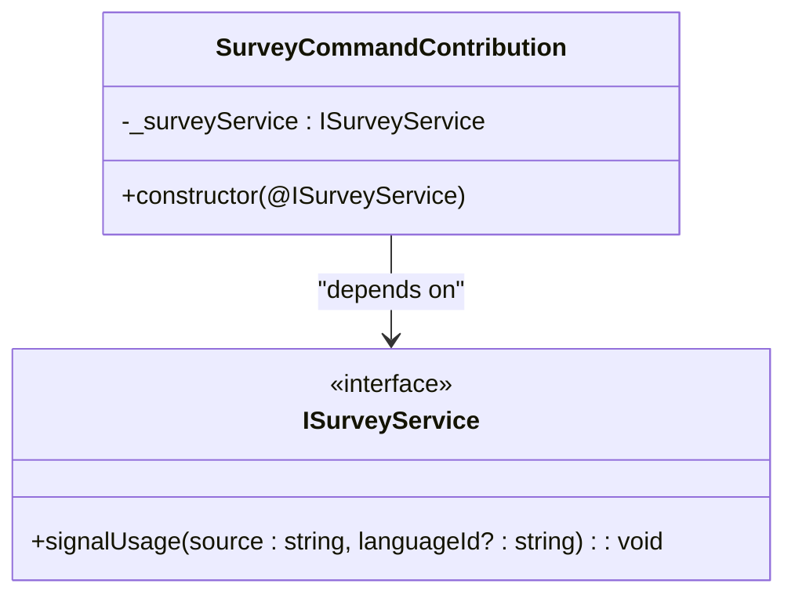
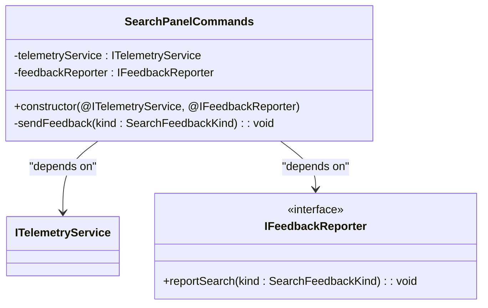
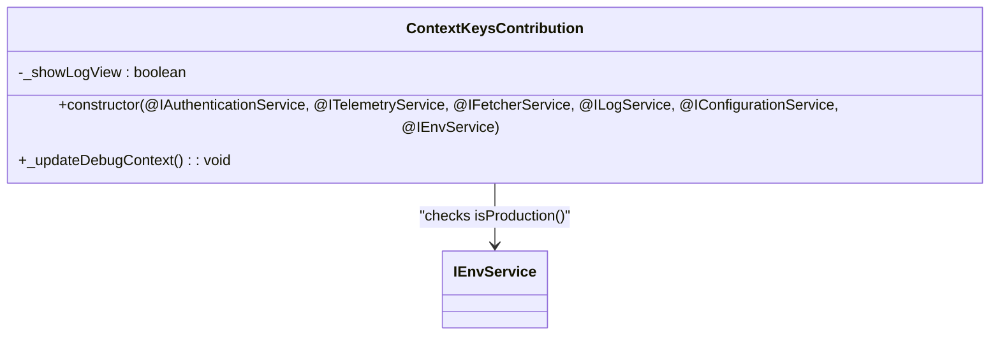
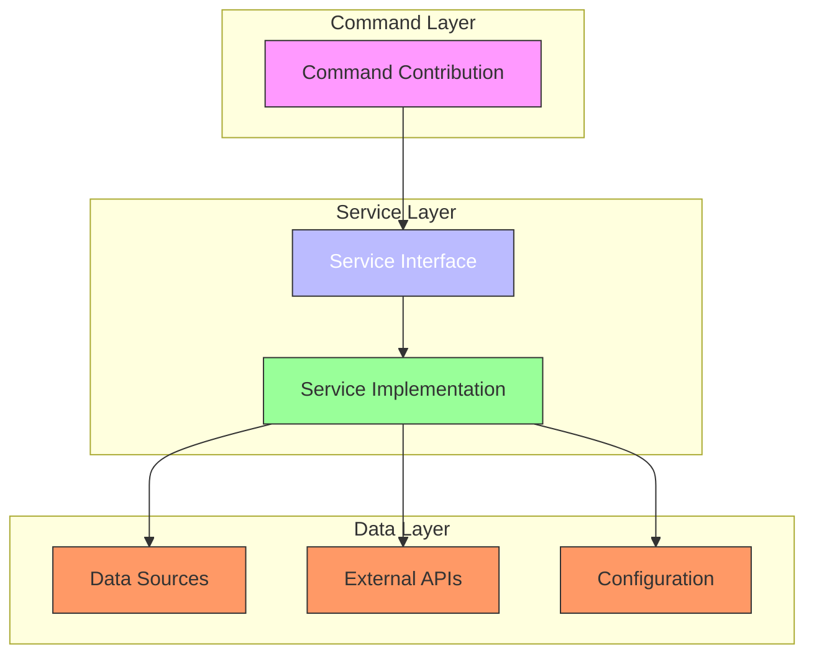
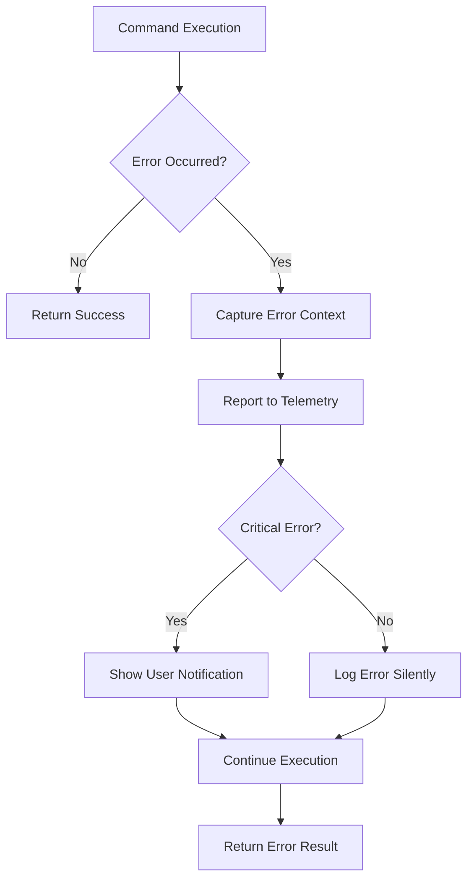

# Command Contributions

<cite>
**Referenced Files in This Document**   
- [contributions.ts](file://src/extension/common/contributions.ts)
- [commandService.ts](file://src/extension/commands/node/commandService.ts)
- [surveyCommands.ts](file://src/extension/survey/vscode-node/surveyCommands.ts)
- [searchCommands.ts](file://src/extension/search/vscode-node/commands.ts)
- [mcpCommands.ts](file://src/extension/mcp/vscode-node/commands.ts)
- [authentication.contribution.ts](file://src/extension/authentication/vscode-node/authentication.contribution.ts)
- [contextKeys.contribution.ts](file://src/extension/contextKeys/vscode-node/contextKeys.contribution.ts)
- [runCommandExecutionServiceImpl.ts](file://src/platform/commands/vscode/runCommandExecutionServiceImpl.ts)
- [telemetry.ts](file://src/extension/completions-core/vscode-node/extension/src/telemetry.ts)
</cite>

## Table of Contents
1. [Introduction](#introduction)
2. [Command Registration System](#command-registration-system)
3. [asContributionFactory Pattern](#ascontributionfactory-pattern)
4. [CommandService Implementation](#commandservice-implementation)
5. [Command Execution Flow](#command-execution-flow)
6. [Command Registration and Disposal](#command-registration-and-disposal)
7. [Common Command Patterns](#common-command-patterns)
8. [Relationship Between Commands and Services](#relationship-between-commands-and-services)
9. [Best Practices for Command Creation](#best-practices-for-command-creation)
10. [Command Error Handling](#command-error-handling)
11. [Conclusion](#conclusion)

## Introduction

The vscode-copilot-chat extension implements a sophisticated command contribution system that enables modular, extensible functionality through the `asContributionFactory` pattern. This documentation details the architecture and implementation of command contributions, focusing on how commands are registered, executed, and managed throughout the extension lifecycle. The system leverages dependency injection and service-oriented design to create a robust framework for command handling that supports various use cases including debug commands, survey commands, and feedback mechanisms.

**Section sources**
- [contributions.ts](file://src/extension/common/contributions.ts)
- [commandService.ts](file://src/extension/commands/node/commandService.ts)

## Command Registration System

The command registration system in vscode-copilot-chat is built around the concept of contributions that are instantiated and managed through a dependency injection framework. The core of this system is the `ContributionCollection` class, which processes an array of `IExtensionContributionFactory` instances and creates the corresponding contribution objects.

The registration process follows these key steps:
1. Each contribution factory is invoked to create its contribution instance
2. Disposable contributions are automatically registered for cleanup
3. Activation blockers are tracked to coordinate extension startup
4. Error handling ensures that failures in one contribution don't affect others

This approach allows for lazy initialization of command handlers while maintaining proper lifecycle management. The system is designed to be fault-tolerant, logging errors but continuing to initialize other contributions even if one fails.

```mermaid
flowchart TD
A[Extension Activation] --> B[Create ContributionCollection]
B --> C[Process Each Contribution Factory]
C --> D[Invoke create() Method]
D --> E[Create Instance via InstantiationService]
E --> F{Is Disposable?}
F --> |Yes| G[Register for Cleanup]
F --> |No| H[Continue]
G --> I[Track Activation Blockers]
H --> I
I --> J[Handle Errors]
J --> K[Complete Initialization]
```

**Diagram sources**
- [contributions.ts](file://src/extension/common/contributions.ts)

**Section sources**
- [contributions.ts](file://src/extension/common/contributions.ts)

## asContributionFactory Pattern

The `asContributionFactory` function is a crucial utility that bridges the gap between class constructors and the contribution system. It takes a class constructor and returns an `IExtensionContributionFactory` that can be used to instantiate the class through the dependency injection system.

```typescript
export function asContributionFactory(ctor: { new(...args: any): any }): IExtensionContributionFactory {
    return {
        create(accessor: ServicesAccessor): IExtensionContribution {
            const instantiationService = accessor.get(IInstantiationService);
            return instantiationService.createInstance(ctor);
        }
    };
}
```

This pattern enables several important capabilities:
- **Dependency Injection**: Classes can declare dependencies using decorators (e.g., `@IIntentService`)
- **Lifecycle Management**: Contributions can implement `dispose()` for cleanup
- **Activation Coordination**: Contributions can provide `activationBlocker` promises
- **Type Safety**: The factory pattern maintains type information throughout instantiation

The pattern is typically used when registering contributions in the extension's activation path, allowing the framework to manage the instantiation and lifecycle of command handlers.

```mermaid
classDiagram
class IExtensionContribution {
+id? : string
+dispose?() : void
+activationBlocker? : Promise<void>
}
class IExtensionContributionFactory {
+create(accessor : ServicesAccessor) : IExtensionContribution | void
}
class ContributionCollection {
-allActivationBlockers : Promise<void>[]
+constructor(contribs : IExtensionContributionFactory[], @ILogService, @IInstantiationService)
+waitForActivationBlockers() : Promise<void>
}
class asContributionFactory {
+ctor : { new(...args : any) : any }
+create(accessor : ServicesAccessor) : IExtensionContribution
}
IExtensionContributionFactory <|-- asContributionFactory
ContributionCollection --> IExtensionContributionFactory : "uses"
asContributionFactory --> IInstantiationService : "creates instances"
```

**Diagram sources**
- [contributions.ts](file://src/extension/common/contributions.ts)

**Section sources**
- [contributions.ts](file://src/extension/common/contributions.ts)

## CommandService Implementation

The `CommandService` is responsible for managing and providing access to available commands within the vscode-copilot-chat extension. Implemented as `CommandServiceImpl`, this service acts as a central registry for commands and their metadata.

The service interface defines two primary methods:
- `getCommands(location: ChatLocation)`: Returns all available commands for a given chat location
- `getCommand(commandId: string, location: ChatLocation)`: Retrieves a specific command by ID

The implementation leverages the `IIntentService` to retrieve intents and convert them into command details, filtering out commands that are hidden from users. This design allows for dynamic command availability based on context and user permissions.



**Diagram sources**
- [commandService.ts](file://src/extension/commands/node/commandService.ts)

**Section sources**
- [commandService.ts](file://src/extension/commands/node/commandService.ts)

## Command Execution Flow

The command execution flow in vscode-copilot-chat follows a well-defined pattern that ensures proper error handling, telemetry, and lifecycle management. When a command is invoked, it passes through several layers of the system before reaching the actual implementation.

The execution flow begins with VS Code's command registry and proceeds through the extension's telemetry and error handling layers:

1. Command invocation via `vscode.commands.executeCommand`
2. Routing through the contribution system
3. Error handling and telemetry instrumentation
4. Execution of the command handler
5. Result propagation or error reporting

The system uses wrapper functions like `registerCommandWrapper` to ensure consistent error handling across all commands, capturing exceptions and reporting them through the appropriate channels.



**Diagram sources**
- [telemetry.ts](file://src/extension/completions-core/vscode-node/extension/src/telemetry.ts)
- [commandService.ts](file://src/extension/commands/node/commandService.ts)

**Section sources**
- [telemetry.ts](file://src/extension/completions-core/vscode-node/extension/src/telemetry.ts)

## Command Registration and Disposal

Command registration and disposal in vscode-copilot-chat follows a structured pattern that ensures proper resource management and cleanup. Commands are typically registered within contribution classes that implement the `Disposable` interface, allowing for automatic cleanup when the extension is deactivated.

The registration process involves:
1. Creating a contribution class that extends `Disposable`
2. Using dependency injection to access required services
3. Registering commands in the constructor using `vscode.commands.registerCommand`
4. Registering the command disposables with `_register()` for automatic cleanup

This pattern ensures that all command registrations are properly disposed of when the extension is deactivated, preventing memory leaks and ensuring clean shutdown.

```mermaid
flowchart TD
A[Create Contribution Class] --> B[Extend Disposable]
B --> C[Inject Required Services]
C --> D[Register Commands in Constructor]
D --> E[Use _register() for Cleanup]
E --> F[Commands Automatically Disposed]
F --> G[Extension Deactivation]
```

**Section sources**
- [surveyCommands.ts](file://src/extension/survey/vscode-node/surveyCommands.ts)
- [searchCommands.ts](file://src/extension/search/vscode-node/commands.ts)
- [contextKeys.contribution.ts](file://src/extension/contextKeys/vscode-node/contextKeys.contribution.ts)

## Common Command Patterns

The vscode-copilot-chat extension implements several common command patterns that serve different purposes within the application. These patterns follow consistent design principles while addressing specific use cases.

### Survey Commands

Survey commands are used to collect user feedback and telemetry data. The `SurveyCommandContribution` class demonstrates this pattern:



### Feedback Commands

Feedback commands allow users to provide input on the quality of responses. The `SearchPanelCommands` class implements this pattern:



### Debug Commands

Debug commands provide diagnostic capabilities and are often conditional based on environment settings. The `ContextKeysContribution` class includes debug-related commands:



**Diagram sources**
- [surveyCommands.ts](file://src/extension/survey/vscode-node/surveyCommands.ts)
- [searchCommands.ts](file://src/extension/search/vscode-node/commands.ts)
- [contextKeys.contribution.ts](file://src/extension/contextKeys/vscode-node/contextKeys.contribution.ts)

**Section sources**
- [surveyCommands.ts](file://src/extension/survey/vscode-node/surveyCommands.ts)
- [searchCommands.ts](file://src/extension/search/vscode-node/commands.ts)
- [contextKeys.contribution.ts](file://src/extension/contextKeys/vscode-node/contextKeys.contribution.ts)

## Relationship Between Commands and Services

The relationship between commands and services in vscode-copilot-chat follows a clear dependency injection pattern where commands depend on services for their functionality. This separation of concerns allows for better testability, maintainability, and flexibility.

Key aspects of this relationship include:

1. **Service Dependencies**: Commands declare their service dependencies using parameter decorators
2. **Loose Coupling**: Commands interact with services through interfaces rather than concrete implementations
3. **Lifecycle Management**: Services are managed by the dependency injection container
4. **Testability**: Services can be mocked for unit testing command behavior

The architecture ensures that commands remain focused on their specific functionality while delegating complex operations to specialized services.



**Section sources**
- [mcpCommands.ts](file://src/extension/mcp/vscode-node/commands.ts)
- [authentication.contribution.ts](file://src/extension/authentication/vscode-node/authentication.contribution.ts)
- [contextKeys.contribution.ts](file://src/extension/contextKeys/vscode-node/contextKeys.contribution.ts)

## Best Practices for Command Creation

When creating new commands in the vscode-copilot-chat extension, several best practices should be followed to ensure consistency, reliability, and maintainability:

### Use Contribution Pattern
Always implement commands as contribution classes that extend `Disposable` to ensure proper cleanup:

```typescript
export class MyCommandContribution extends Disposable {
    constructor(@IService service: IService) {
        super();
        this._register(vscode.commands.registerCommand('my.command', () => {
            // command implementation
        }));
    }
}
```

### Leverage Dependency Injection
Use parameter decorators to declare service dependencies rather than importing them directly:

```typescript
constructor(
    @IIntentService private readonly intentService: IIntentService,
    @ITelemetryService private readonly telemetryService: ITelemetryService
)
```

### Handle Errors Gracefully
Wrap command execution in try-catch blocks and report errors through the appropriate channels:

```typescript
try {
    // command logic
} catch (error) {
    this.telemetryService.sendErrorTelemetry('command.failed', { error });
    throw error;
}
```

### Consider Activation Impact
Use `activationBlocker` judiciously as it can delay extension startup:

```typescript
get activationBlocker(): Promise<void> {
    return this.initializeAsync(); // only if critical
}
```

### Follow Naming Conventions
Use consistent naming for commands following the pattern `github.copilot.[feature].[action]`:

- `github.copilot.survey.signalUsage`
- `github.copilot.search.markHelpful`
- `github.copilot.chat.triggerPermissiveSignIn`

These practices ensure that new commands integrate seamlessly with the existing codebase and follow established patterns.

**Section sources**
- [contributions.ts](file://src/extension/common/contributions.ts)
- [telemetry.ts](file://src/extension/completions-core/vscode-node/extension/src/telemetry.ts)
- [mcpCommands.ts](file://src/extension/mcp/vscode-node/commands.ts)

## Command Error Handling

Command error handling in vscode-copilot-chat is implemented through a comprehensive system that captures, reports, and manages errors consistently across all commands. The system uses several layers of protection to ensure that command failures don't crash the extension while still providing valuable diagnostic information.

Key components of the error handling system include:

1. **Wrapper Functions**: The `registerCommandWrapper` function provides a consistent error handling layer
2. **Telemetry Integration**: Errors are reported through the telemetry service with context
3. **User Feedback**: Critical errors are presented to users through appropriate UI elements
4. **Silent Recovery**: Non-critical errors are logged but don't interrupt user workflow

The error handling approach prioritizes user experience by preventing extension crashes while still capturing diagnostic information for debugging. Errors are categorized and handled appropriately based on their severity and impact.



**Diagram sources**
- [telemetry.ts](file://src/extension/completions-core/vscode-node/extension/src/telemetry.ts)

**Section sources**
- [telemetry.ts](file://src/extension/completions-core/vscode-node/extension/src/telemetry.ts)

## Conclusion

The command contribution system in vscode-copilot-chat provides a robust, extensible framework for implementing and managing commands through the `asContributionFactory` pattern. This architecture enables modular design, proper lifecycle management, and consistent error handling across the extension.

Key takeaways include:
- The `asContributionFactory` pattern enables dependency injection and lifecycle management
- The `CommandService` provides a centralized registry for command discovery
- Commands are properly disposed of through the `Disposable` pattern
- Error handling is consistent and comprehensive across all commands
- Best practices ensure maintainability and consistency

This system allows for the creation of various command types including survey commands, feedback commands, and debug commands while maintaining a clean, organized codebase. The separation of commands and services through dependency injection promotes testability and flexibility in the overall architecture.

**Section sources**
- [contributions.ts](file://src/extension/common/contributions.ts)
- [commandService.ts](file://src/extension/commands/node/commandService.ts)
- [telemetry.ts](file://src/extension/completions-core/vscode-node/extension/src/telemetry.ts)