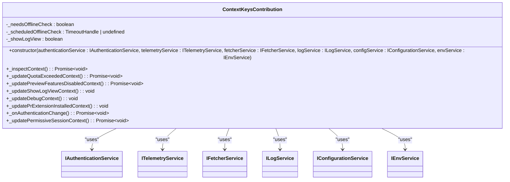
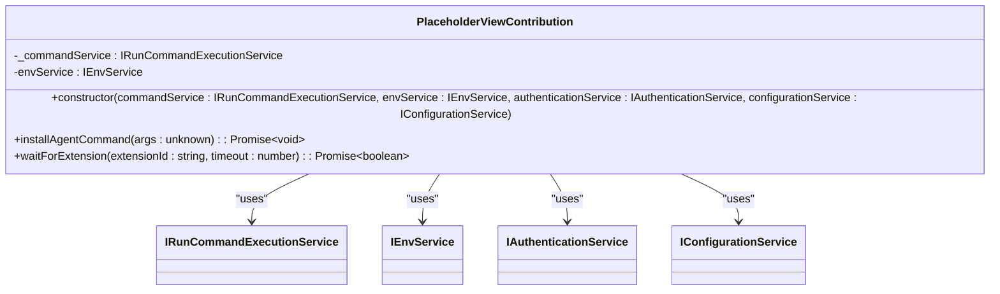
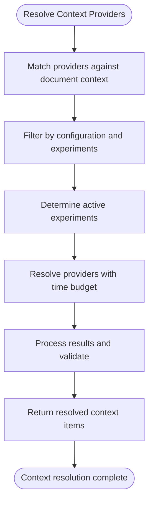

# Context Management

<cite>
**Referenced Files in This Document**   
- [contextKeys.contribution.ts](file://src/extension/contextKeys/vscode-node/contextKeys.contribution.ts)
- [placeholderView.contribution.ts](file://src/extension/contextKeys/vscode-node/placeholderView.contribution.ts)
- [contextProviderRegistry.ts](file://src/extension/completions-core/vscode-node/lib/src/prompt/contextProviderRegistry.ts)
- [contextItemSchemas.ts](file://src/extension/completions-core/vscode-node/lib/src/prompt/contextProviders/contextItemSchemas.ts)
- [contextProviderRegistryCSharp.ts](file://src/extension/completions-core/vscode-node/lib/src/prompt/contextProviderRegistryCSharp.ts)
- [contextProviderRegistryMultiLanguage.ts](file://src/extension/completions-core/vscode-node/lib/src/prompt/contextProviderRegistryMultiLanguage.ts)
- [contextProviderRegistryTs.ts](file://src/extension/completions-core/vscode-node/lib/src/prompt/contextProviderRegistryTs.ts)
</cite>

## Table of Contents
1. [Introduction](#introduction)
2. [Context Keys and Context Providers](#context-keys-and-context-providers)
3. [ContextKeysContribution Implementation](#contextkeyscontribution-implementation)
4. [PlaceholderViewContribution Implementation](#placeholderviewcontribution-implementation)
5. [Context Provider Registry and Resolution](#context-provider-registry-and-resolution)
6. [Context Usage in Conditional Rendering](#context-usage-in-conditional-rendering)
7. [Relationship with Extension State](#relationship-with-extension-state)
8. [Best Practices for Context Management](#best-practices-for-context-management)

## Introduction
The vscode-copilot-chat extension implements a sophisticated context management system that enables dynamic UI behavior and feature activation based on the current state of the extension, user authentication, and environment conditions. This documentation details how context keys and context providers are registered through the contribution system, how context information is made available to the UI and other components, and best practices for creating new context providers and managing context lifecycle.

The context management system serves as the backbone for conditional rendering, feature activation, and state management throughout the extension. It consists of two primary components: context keys that represent boolean states for UI conditional rendering, and context providers that supply rich data context for AI completions and other features.

**Section sources**
- [contextKeys.contribution.ts](file://src/extension/contextKeys/vscode-node/contextKeys.contribution.ts)
- [placeholderView.contribution.ts](file://src/extension/contextKeys/vscode-node/placeholderView.contribution.ts)

## Context Keys and Context Providers
The vscode-copilot-chat extension distinguishes between two types of context systems: context keys for UI state management and context providers for data context in AI completions.

Context keys are boolean values registered with VS Code's context system using the `setContext` command. These keys are used in `when` clauses in the package.json to conditionally show or hide UI elements such as menu items, toolbar buttons, and views. The keys follow a naming convention of `github.copilot.*` and represent various states of the extension including authentication status, feature availability, and environment conditions.

Context providers, on the other hand, are components that supply data context for AI completions and other features. These providers are registered with the context provider registry and are responsible for resolving context items based on the current document context, language, and other factors. The context provider system supports multiple languages and can be extended with custom providers for specific use cases.

The two systems work together to create a dynamic and responsive user experience. Context keys control the visibility and availability of UI elements, while context providers supply the rich data context needed for AI-powered features to function effectively.

**Section sources**
- [contextKeys.contribution.ts](file://src/extension/contextKeys/vscode-node/contextKeys.contribution.ts)
- [contextProviderRegistry.ts](file://src/extension/completions-core/vscode-node/lib/src/prompt/contextProviderRegistry.ts)

## ContextKeysContribution Implementation
The ContextKeysContribution class is responsible for managing the lifecycle of context keys and updating their values based on various events and conditions within the extension. This class extends the Disposable class and is instantiated as part of the extension's contribution system.

The implementation uses dependency injection to access various services including authentication, telemetry, networking, logging, configuration, and environment services. These dependencies are used to determine the state of various context keys and update them accordingly.

Key context keys managed by this contribution include:
- Authentication and activation states (e.g., `github.copilot-chat.activated`, `github.copilot.interactiveSession.individual.disabled`)
- Feature availability (e.g., `github.copilot.chat.quotaExceeded`, `github.copilot.previewFeaturesDisabled`)
- Environment and debugging states (e.g., `github.copilot.chat.debug`, `github.copilot.chat.showLogView`)
- Extension integration states (e.g., `github.copilot.prExtensionInstalled`)

The class listens to various events to update context keys, including authentication changes, window state changes, and extension changes. It also implements a scheduling mechanism for offline checks that updates the `github.copilot.offline` context key when network connectivity issues are detected.

**Diagram sources **
- [contextKeys.contribution.ts](file://src/extension/contextKeys/vscode-node/contextKeys.contribution.ts)

**Section sources**
- [contextKeys.contribution.ts](file://src/extension/contextKeys/vscode-node/contextKeys.contribution.ts)

## PlaceholderViewContribution Implementation
The PlaceholderViewContribution class manages the context key for showing a placeholder view when the Codex agent is enabled but not installed. This contribution is responsible for determining when to show the placeholder view and providing the functionality to install the agent.

The implementation listens to changes in extensions and authentication state to determine whether the placeholder should be shown. The logic checks if the user has the Codex agent enabled (either through the copilot token or configuration) and whether the OpenAI ChatGPT extension is installed. If the agent is enabled but the extension is not installed, the `github.copilot.chat.codex.showPlaceholder` context key is set to true.

The class also registers a command `github.copilot.chat.installAgent` that handles the installation of the agent. When executed, this command installs the appropriate extension (currently only OpenAI ChatGPT is supported) and, if successful, opens the new Codex panel.

**Diagram sources **
- [placeholderView.contribution.ts](file://src/extension/contextKeys/vscode-node/placeholderView.contribution.ts)

**Section sources**
- [placeholderView.contribution.ts](file://src/extension/contextKeys/vscode-node/placeholderView.contribution.ts)

## Context Provider Registry and Resolution
The context provider system in vscode-copilot-chat is built around a registry pattern that allows for dynamic registration and resolution of context providers. The core component is the `ICompletionsContextProviderRegistryService` interface, which defines methods for registering, unregistering, and resolving context providers.

The registry implementation uses a multi-layered approach with different registry classes serving specific purposes:
- `CoreContextProviderRegistry`: The base implementation that delegates to the language context provider service
- `MutableContextProviderRegistry`: Extends the core registry with the ability to register and unregister providers
- `CachedContextProviderRegistry`: Adds caching capabilities to improve performance

Context providers are resolved through a multi-step process:
1. Providers are matched against the current document context using a match function
2. Matched providers are filtered based on configuration and experiment settings
3. Active experiments are determined for the matched providers
4. Providers are resolved with a time budget and cancellation token
5. Results are processed, validated, and returned

The system supports language-specific context providers through specialized registry files for C#, C++, TypeScript, and multi-language scenarios. These files contain logic for determining active experiments and configuring provider parameters based on the current language and telemetry data.

**Diagram sources **
- [contextProviderRegistry.ts](file://src/extension/completions-core/vscode-node/lib/src/prompt/contextProviderRegistry.ts)
- [contextProviderRegistryCSharp.ts](file://src/extension/completions-core/vscode-node/lib/src/prompt/contextProviderRegistryCSharp.ts)
- [contextProviderRegistryMultiLanguage.ts](file://src/extension/completions-core/vscode-node/lib/src/prompt/contextProviderRegistryMultiLanguage.ts)
- [contextProviderRegistryTs.ts](file://src/extension/completions-core/vscode-node/lib/src/prompt/contextProviderRegistryTs.ts)

**Section sources**
- [contextProviderRegistry.ts](file://src/extension/completions-core/vscode-node/lib/src/prompt/contextProviderRegistry.ts)
- [contextProviderRegistryCSharp.ts](file://src/extension/completions-core/vscode-node/lib/src/prompt/contextProviderRegistryCSharp.ts)
- [contextProviderRegistryMultiLanguage.ts](file://src/extension/completions-core/vscode-node/lib/src/prompt/contextProviderRegistryMultiLanguage.ts)
- [contextProviderRegistryTs.ts](file://src/extension/completions-core/vscode-node/lib/src/prompt/contextProviderRegistryTs.ts)

## Context Usage in Conditional Rendering
Context keys are extensively used throughout the vscode-copilot-chat extension for conditional rendering of UI elements. The keys are referenced in the package.json file within `when` clauses to control the visibility and availability of commands, menus, and views.

For example, the `github.copilot-chat.activated` context key is used to determine whether the main Copilot Chat view should be visible. Similarly, the `github.copilot.chat.quotaExceeded` key controls whether quota-related messages and actions are shown to the user.

The context system also supports more complex conditional logic through the combination of multiple context keys. For instance, the debug view might only be shown when both `github.copilot.chat.debug` is true and the user is in a non-production environment.

Context providers supply data context that is used in AI completions and other features. The resolved context items are filtered and validated against supported schemas before being used. The system ensures that only valid context items are passed to the AI models, maintaining data integrity and security.

The context provider registry also tracks usage statistics and telemetry for each provider, allowing for performance monitoring and optimization. This data is used to improve the relevance and efficiency of context retrieval over time.

**Section sources**
- [contextKeys.contribution.ts](file://src/extension/contextKeys/vscode-node/contextKeys.contribution.ts)
- [contextProviderRegistry.ts](file://src/extension/completions-core/vscode-node/lib/src/prompt/contextProviderRegistry.ts)
- [contextItemSchemas.ts](file://src/extension/completions-core/vscode-node/lib/src/prompt/contextProviders/contextItemSchemas.ts)

## Relationship with Extension State
The context management system is deeply integrated with the overall extension state, serving as a bridge between the internal state of the extension and the external UI components. Context keys reflect the current state of various extension components, including authentication status, feature availability, and environment conditions.

The system maintains consistency between the extension state and the UI by listening to state changes and updating context keys accordingly. For example, when the authentication state changes, the ContextKeysContribution class updates multiple context keys to reflect the new state, which in turn triggers UI updates through VS Code's `when` clause evaluation.

The context provider system also maintains state through its statistics and caching mechanisms. The `ICompletionsContextProviderService` tracks usage statistics for each provider, which can influence future context resolution decisions. The cached registry maintains a short-term cache of resolved context items to improve performance for repeated requests.

The extension state is also influenced by user configuration and experiment settings, which are factored into both context key evaluation and context provider resolution. This creates a dynamic system where the UI and features adapt to the user's preferences, environment, and experimental feature flags.

**Section sources**
- [contextKeys.contribution.ts](file://src/extension/contextKeys/vscode-node/contextKeys.contribution.ts)
- [contextProviderRegistry.ts](file://src/extension/completions-core/vscode-node/lib/src/prompt/contextProviderRegistry.ts)

## Best Practices for Context Management
When creating new context providers and managing context lifecycle in the vscode-copilot-chat extension, several best practices should be followed:

1. **Use descriptive and consistent naming**: Context keys should follow the `github.copilot.*` naming convention and be descriptive of their purpose. Provider IDs should be unique and meaningful.

2. **Implement proper error handling**: Context providers should handle errors gracefully and provide meaningful fallbacks when possible. The system should never fail completely due to a single provider error.

3. **Respect time budgets**: Providers should be designed to complete within the allocated time budget. Long-running operations should be broken down or implemented with timeout handling.

4. **Validate context items**: All context items should be validated against the appropriate schema before being returned. Invalid items should be logged and filtered out.

5. **Manage dependencies carefully**: Providers should declare their dependencies clearly and avoid circular dependencies. The use of dependency injection helps maintain loose coupling.

6. **Consider performance implications**: Providers that perform expensive operations should implement caching or throttling mechanisms to avoid performance degradation.

7. **Document provider behavior**: Each provider should be well-documented, including its purpose, inputs, outputs, and any side effects.

8. **Test thoroughly**: Providers should be tested with various input scenarios, including edge cases and error conditions.

9. **Monitor usage and performance**: Providers should include appropriate telemetry to monitor usage patterns and performance characteristics.

10. **Follow the disposable pattern**: Components that manage resources should implement the Disposable pattern to ensure proper cleanup and prevent memory leaks.

By following these best practices, developers can create robust and maintainable context providers that enhance the functionality of the vscode-copilot-chat extension while maintaining performance and reliability.

**Section sources**
- [contextKeys.contribution.ts](file://src/extension/contextKeys/vscode-node/contextKeys.contribution.ts)
- [contextProviderRegistry.ts](file://src/extension/completions-core/vscode-node/lib/src/prompt/contextProviderRegistry.ts)
- [contextItemSchemas.ts](file://src/extension/completions-core/vscode-node/lib/src/prompt/contextProviders/contextItemSchemas.ts)