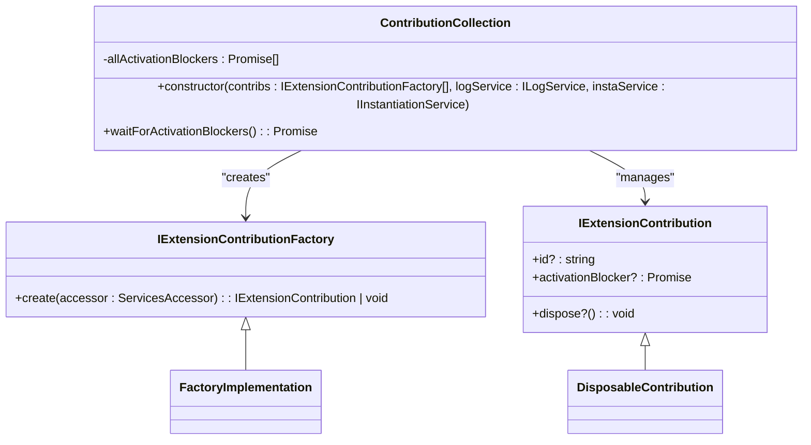
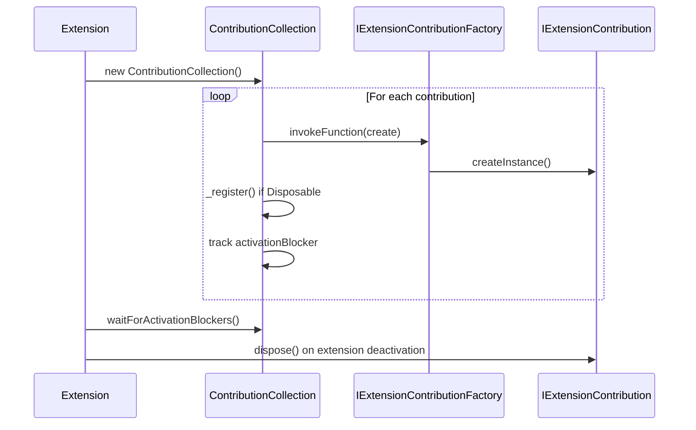
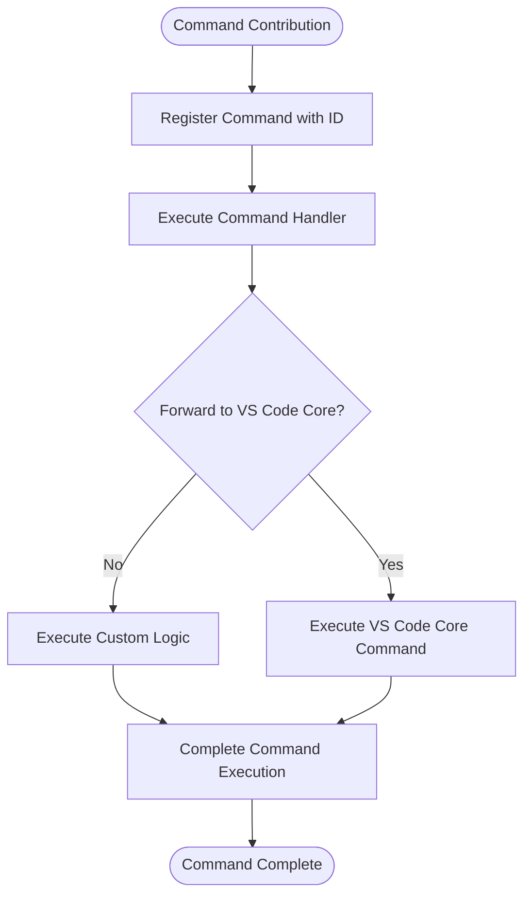
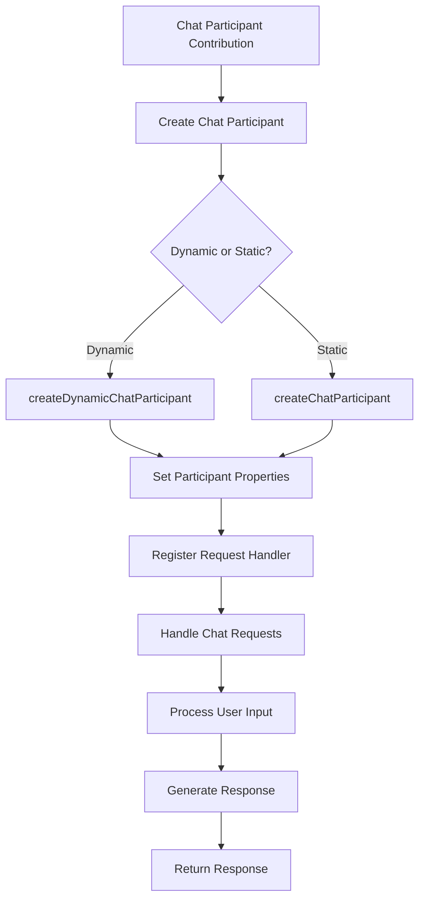
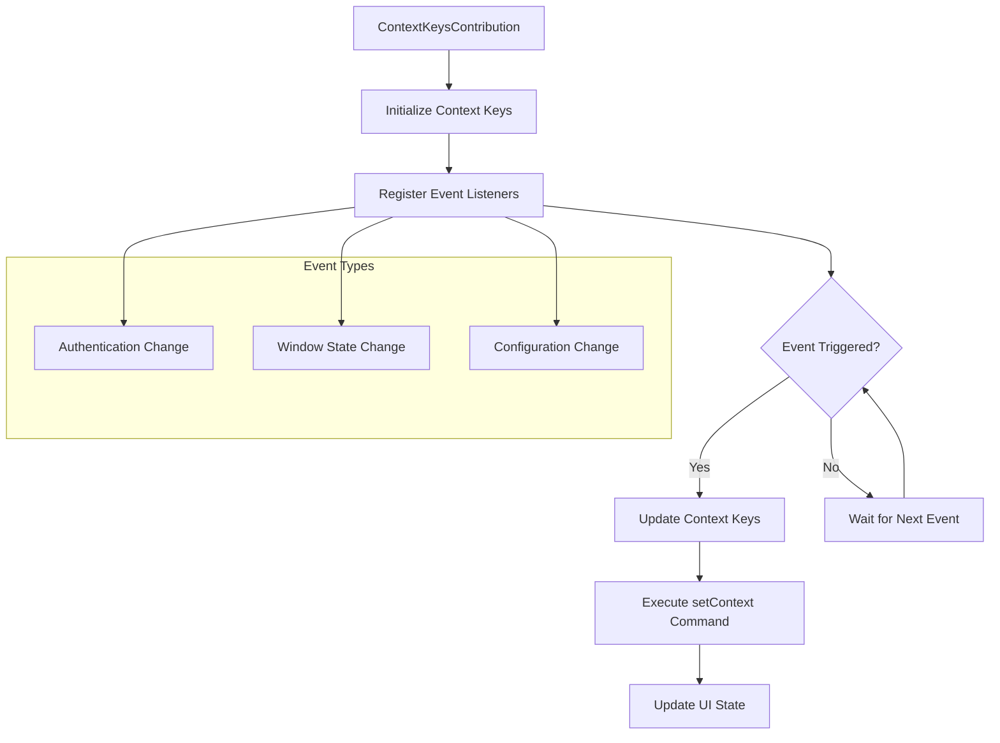
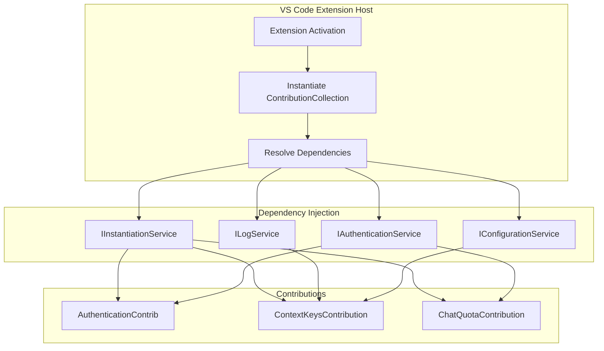
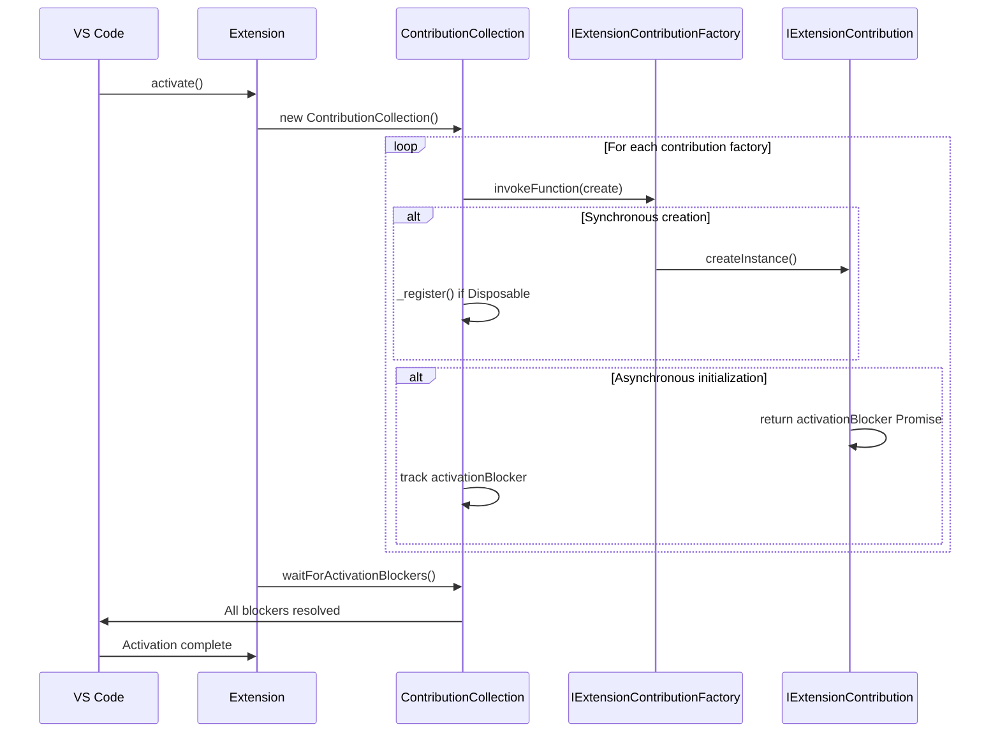

# Contribution System

<cite>
**Referenced Files in This Document**   
- [contributions.ts](file://src/extension/common/contributions.ts)
- [authentication.contribution.ts](file://src/extension/authentication/vscode-node/authentication.contribution.ts)
- [contextKeys.contribution.ts](file://src/extension/contextKeys/vscode-node/contextKeys.contribution.ts)
- [chatQuota.contribution.ts](file://src/extension/chat/vscode-node/chatQuota.contribution.ts)
- [context.contribution.ts](file://src/extension/context/vscode/context.contribution.ts)
- [commands.ts](file://src/extension/getting-started/vscode-node/commands.ts)
- [jointInlineCompletionProvider.ts](file://src/extension/inlineEdits/vscode-node/jointInlineCompletionProvider.ts)
- [vscode-node/contributions.ts](file://src/extension/extension/vscode-node/contributions.ts)
- [vscode/contributions.ts](file://src/extension/extension/vscode/contributions.ts)
- [chatAgents.ts](file://src/platform/chat/common/chatAgents.ts)
- [vscode.proposed.chatSessionsProvider.d.ts](file://src/extension/vscode.proposed.chatSessionsProvider.d.ts)
- [vscode.proposed.chatParticipantAdditions.d.ts](file://src/extension/vscode.proposed.chatParticipantAdditions.d.ts)
</cite>

## Table of Contents
1. [Introduction](#introduction)
2. [Core Contribution Architecture](#core-contribution-architecture)
3. [Contribution Lifecycle Management](#contribution-lifecycle-management)
4. [Common Contribution Patterns](#common-contribution-patterns)
5. [Service Relationships and Dependency Injection](#service-relationships-and-dependency-injection)
6. [Extension Activation Process](#extension-activation-process)
7. [Best Practices for Contribution Development](#best-practices-for-contribution-development)
8. [Conclusion](#conclusion)

## Introduction

The contribution system in vscode-copilot-chat provides a structured framework for extending VS Code functionality through modular components. This system enables the registration of commands, chat participants, context keys, and other extension points in a consistent and maintainable manner. Contributions are implemented as classes that adhere to specific interfaces and are instantiated during the extension activation process. The architecture supports both web and node.js extension hosts, with contributions organized based on their compatibility requirements.

**Section sources**
- [contributions.ts](file://src/extension/common/contributions.ts#L11-L25)
- [vscode-node/contributions.ts](file://src/extension/extension/vscode-node/contributions.ts#L63-L123)

## Core Contribution Architecture

The contribution system is built around the `IExtensionContribution` interface, which defines the contract for all contribution components. This interface includes optional properties for identification, disposal, and activation blocking. The `IExtensionContributionFactory` interface serves as a factory pattern for creating contribution instances, allowing for dependency injection through the `ServicesAccessor`.

The `ContributionCollection` class is responsible for managing the lifecycle of all contributions. It processes an array of contribution factories, instantiates each contribution, and handles their registration and disposal. Contributions that implement the `Disposable` interface are automatically registered with the collection, ensuring proper cleanup when the extension is deactivated.

**Diagram sources **
- [contributions.ts](file://src/extension/common/contributions.ts#L11-L76)

**Section sources**
- [contributions.ts](file://src/extension/common/contributions.ts#L11-L76)

## Contribution Lifecycle Management

Contributions are managed throughout their lifecycle from activation to disposal. The `ContributionCollection` class handles instantiation during extension activation and ensures proper disposal when the extension is deactivated. Contributions that need to perform asynchronous initialization can use the `activationBlocker` property to signal when they are ready, which delays the completion of the extension's activate method.

The disposal mechanism is critical for preventing memory leaks. Contributions that implement the `Disposable` interface are automatically tracked by the `ContributionCollection` and disposed of when the collection itself is disposed. This ensures that event listeners, timers, and other resources are properly cleaned up.

**Diagram sources **
- [contributions.ts](file://src/extension/common/contributions.ts#L41-L76)

**Section sources**
- [contributions.ts](file://src/extension/common/contributions.ts#L41-L76)

## Common Contribution Patterns

### Command Registration

Command contributions register VS Code commands that can be invoked by users or other extension components. These contributions typically extend the `Disposable` class and register commands in their constructor using `commands.registerCommand`. The commands often serve as entry points to core functionality or as wrappers for existing VS Code commands.

**Diagram sources **
- [context.contribution.ts](file://src/extension/context/vscode/context.contribution.ts#L10-L31)
- [commands.ts](file://src/extension/getting-started/vscode-node/commands.ts#L8-L31)

### Chat Participant Setup

Chat participant contributions register chat functionality with VS Code's chat system. These contributions use the `chat.createChatParticipant` API to register participants with specific IDs and handlers. The participant ID follows the convention `github.copilot.{name}` as defined in the `chatAgents.ts` file.

**Diagram sources **
- [chatAgents.ts](file://src/platform/chat/common/chatAgents.ts#L10-L36)
- [vscode.proposed.chatParticipantAdditions.d.ts](file://src/extension/vscode.proposed.chatParticipantAdditions.d.ts#L221-L256)

### Context Key Management

Context key contributions manage VS Code context keys that control UI visibility and command availability. These contributions listen to various events (authentication changes, window state changes, etc.) and update context keys accordingly using `commands.executeCommand('setContext')`. This pattern enables dynamic UI updates based on the extension's state.

**Diagram sources **
- [contextKeys.contribution.ts](file://src/extension/contextKeys/vscode-node/contextKeys.contribution.ts#L42-L230)

**Section sources**
- [contextKeys.contribution.ts](file://src/extension/contextKeys/vscode-node/contextKeys.contribution.ts#L42-L230)

## Service Relationships and Dependency Injection

The contribution system leverages dependency injection through the `@IInstantiationService` decorator and the `ServicesAccessor` interface. Contributions declare their dependencies in their constructor parameters, which are then resolved by the instantiation service. This pattern promotes loose coupling and makes contributions easier to test and maintain.

The architecture separates contributions based on their execution environment. The `vscode-node/contributions.ts` file contains contributions that run only in the node.js extension host, while `vscode/contributions.ts` contains contributions that can run in both web and node.js environments. This separation ensures compatibility across different VS Code execution contexts.

**Diagram sources **
- [vscode-node/contributions.ts](file://src/extension/extension/vscode-node/contributions.ts#L63-L123)
- [authentication.contribution.ts](file://src/extension/authentication/vscode-node/authentication.contribution.ts#L17-L112)

**Section sources**
- [vscode-node/contributions.ts](file://src/extension/extension/vscode-node/contributions.ts#L63-L123)
- [authentication.contribution.ts](file://src/extension/authentication/vscode-node/authentication.contribution.ts#L17-L112)

## Extension Activation Process

The extension activation process begins with the registration of contribution factories in the `vscode-node/contributions.ts` and `vscode/contributions.ts` files. During activation, the `ContributionCollection` is instantiated with these factories, along with the necessary services. The collection then iterates through each factory, creates the contribution instances, and manages their lifecycle.

The activation process supports both immediate and deferred initialization through the `activationBlocker` property. Contributions that need to perform asynchronous setup can return a promise that resolves when initialization is complete. The extension waits for all activation blockers to resolve before completing the activation process, ensuring that all contributions are ready before the extension becomes fully operational.

**Diagram sources **
- [vscode-node/contributions.ts](file://src/extension/extension/vscode-node/contributions.ts#L63-L123)
- [contributions.ts](file://src/extension/common/contributions.ts#L41-L76)

**Section sources**
- [vscode-node/contributions.ts](file://src/extension/extension/vscode-node/contributions.ts#L63-L123)
- [contributions.ts](file://src/extension/common/contributions.ts#L41-L76)

## Best Practices for Contribution Development

When creating new contributions, follow these best practices to ensure maintainability and prevent memory leaks:

1. **Implement Disposable interface**: Always implement the `Disposable` interface for contributions that register event listeners, timers, or other resources that need cleanup.

2. **Use activationBlocker judiciously**: Only use the `activationBlocker` property for essential initialization that must complete before the extension is considered active. Avoid blocking startup unnecessarily.

3. **Follow environment compatibility**: Place contributions in the appropriate file (`vscode/contributions.ts` for web-compatible contributions, `vscode-node/contributions.ts` for node.js-only contributions).

4. **Use descriptive IDs**: Provide meaningful IDs for contributions to aid in debugging and performance monitoring.

5. **Minimize dependencies**: Only inject the services that are actually needed by the contribution to reduce coupling and improve testability.

6. **Handle errors gracefully**: Wrap contribution creation in try-catch blocks and log errors appropriately to prevent extension activation failures.

7. **Follow naming conventions**: Use consistent naming patterns for contribution classes (e.g., `*Contribution`) and command IDs.

8. **Document side effects**: Clearly document any side effects of contribution activation, such as UI changes or network requests.

**Section sources**
- [contributions.ts](file://src/extension/common/contributions.ts#L11-L76)
- [vscode-node/contributions.ts](file://src/extension/extension/vscode-node/contributions.ts#L63-L123)

## Conclusion

The contribution system in vscode-copilot-chat provides a robust and scalable architecture for extending VS Code functionality. By following the patterns and best practices outlined in this documentation, developers can create maintainable, efficient, and reliable contributions that integrate seamlessly with the VS Code ecosystem. The system's emphasis on proper lifecycle management, dependency injection, and environment compatibility ensures that contributions work reliably across different execution contexts while minimizing the risk of memory leaks and performance issues.