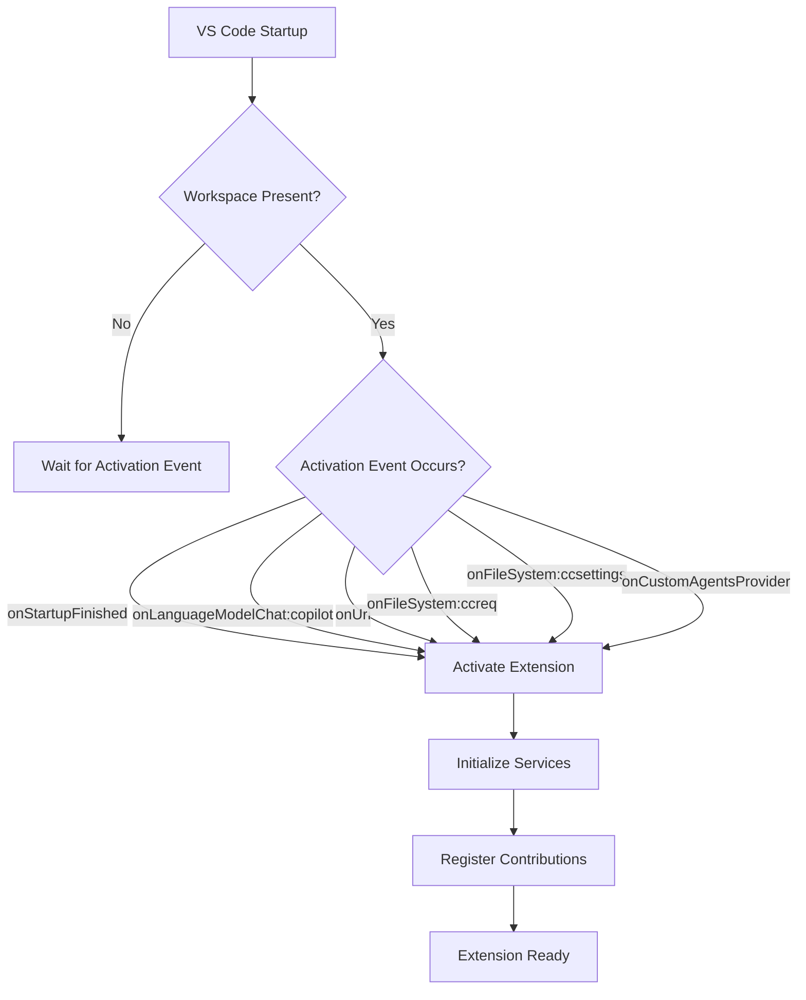
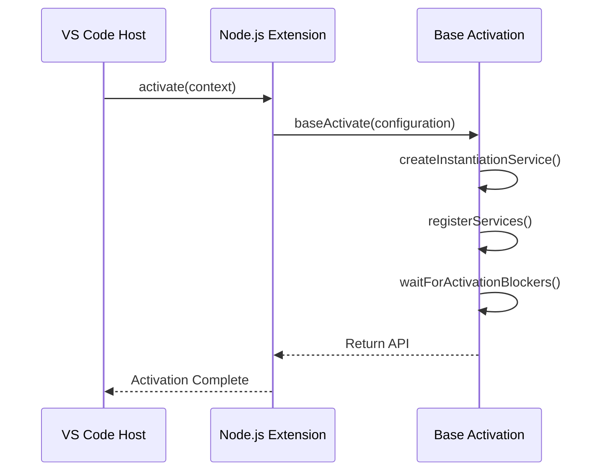
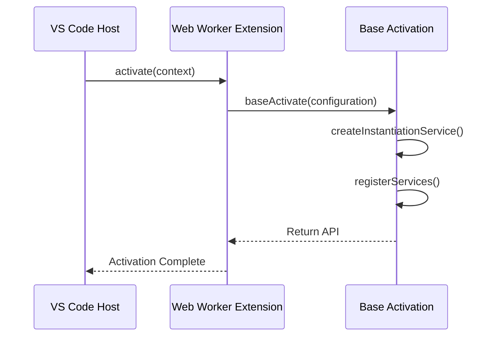
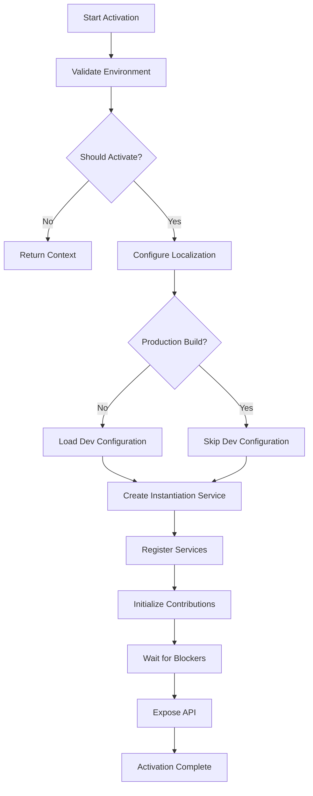
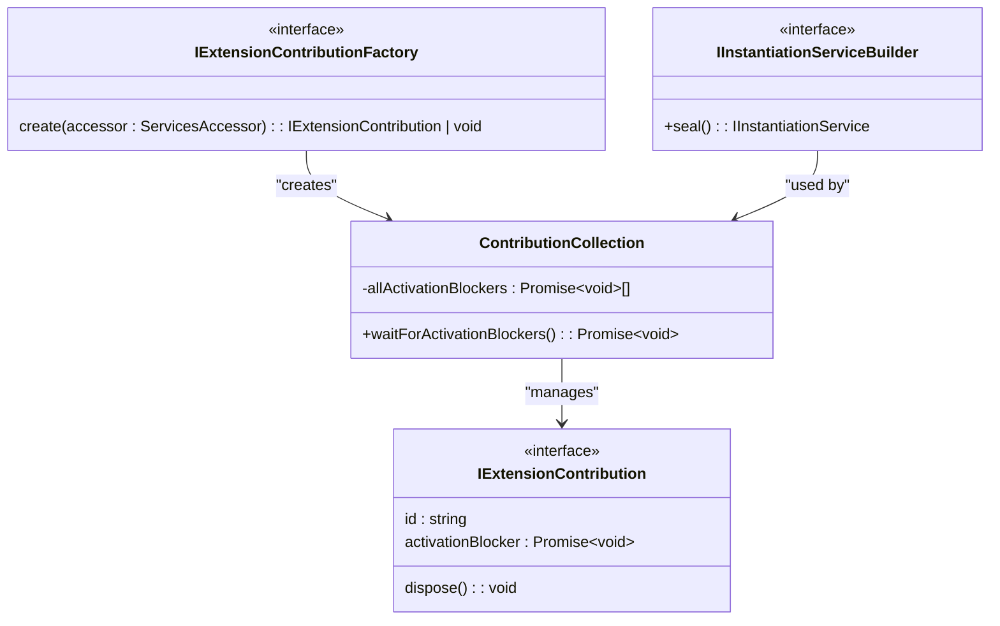
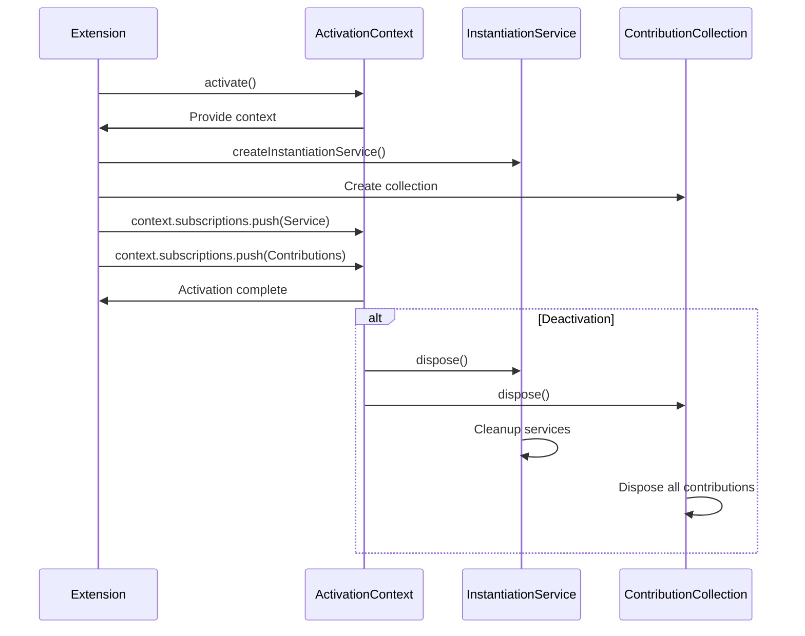
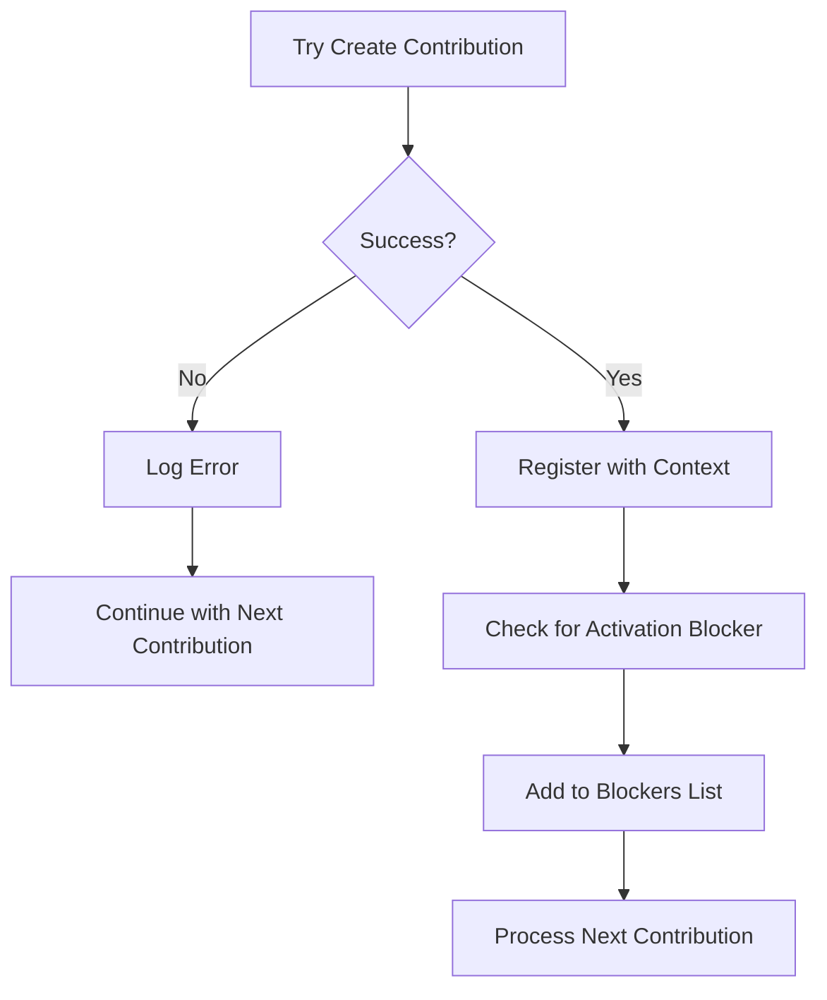
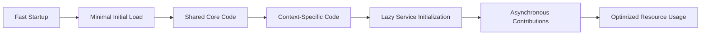

# Extension Activation

<cite>
**Referenced Files in This Document**   
- [package.json](file://package.json)
- [src/extension/extension/vscode/extension.ts](file://src/extension/extension/vscode/extension.ts)
- [src/extension/extension/vscode-node/extension.ts](file://src/extension/extension/vscode-node/extension.ts)
- [src/extension/extension/vscode-worker/extension.ts](file://src/extension/extension/vscode-worker/extension.ts)
- [src/extension/common/contributions.ts](file://src/extension/common/contributions.ts)
- [src/extension/extension/vscode-node/contributions.ts](file://src/extension/extension/vscode-node/contributions.ts)
- [src/extension/extension/vscode/contributions.ts](file://src/extension/extension/vscode/contributions.ts)
- [src/extension/extension/vscode-worker/contributions.ts](file://src/extension/extension/vscode-worker/contributions.ts)
</cite>

## Table of Contents
1. [Introduction](#introduction)
2. [Activation Events and Conditions](#activation-events-and-conditions)
3. [Activation Contexts](#activation-contexts)
4. [Initialization Sequence](#initialization-sequence)
5. [Service Setup and Contribution Registration](#service-setup-and-contribution-registration)
6. [Resource Management and Disposal](#resource-management-and-disposal)
7. [Error Handling Patterns](#error-handling-patterns)
8. [Performance Considerations](#performance-considerations)
9. [Common Activation Issues](#common-activation-issues)
10. [Conclusion](#conclusion)

## Introduction

The vscode-copilot-chat extension implements a sophisticated activation mechanism that supports multiple execution contexts within Visual Studio Code. The extension is designed to run in three distinct environments: the VS Code extension host (Node.js), web worker context, and standard extension host. This documentation provides a comprehensive analysis of the extension's activation process, detailing how the `activate` function orchestrates initialization across these different contexts.

The activation architecture follows a layered approach with shared code in the `vscode` directory that can run across all environments, while specific implementations are provided for Node.js (`vscode-node`) and web worker (`vscode-worker`) contexts. This design enables code reuse while allowing platform-specific optimizations and feature implementations.

**Section sources**
- [src/extension/extension/vscode/extension.ts](file://src/extension/extension/vscode/extension.ts#L1-L108)
- [src/extension/extension/vscode-node/extension.ts](file://src/extension/extension/vscode-node/extension.ts#L1-L44)
- [src/extension/extension/vscode-worker/extension.ts](file://src/extension/extension/vscode-worker/extension.ts#L1-L27)

## Activation Events and Conditions

The extension's activation is triggered by specific events defined in the package.json file. These activation events determine when the extension should be loaded and initialized by the VS Code host environment. The primary activation events include:

- `onStartupFinished`: Activates when VS Code has completed its startup sequence
- `onLanguageModelChat:copilot`: Triggers when a language model chat session is initiated with the copilot participant
- `onUri`: Activates when a URI handler is invoked
- `onFileSystem:ccreq` and `onFileSystem:ccsettings`: Activate when specific custom file system schemes are accessed
- `onCustomAgentsProvider`: Triggers when custom agents are requested

These events ensure the extension is activated at appropriate times, balancing startup performance with functionality availability. The extension does not activate on simple workspace presence but rather on specific user interactions or system events that require its functionality.

The activation strategy prioritizes performance by deferring initialization until necessary, rather than loading immediately when VS Code starts. This approach minimizes the impact on editor startup time while ensuring the extension is available when needed for chat, code completion, or other AI-assisted features.

**Diagram sources**
- [package.json](file://package.json#L81-L88)
- [src/extension/extension/vscode/extension.ts](file://src/extension/extension/vscode/extension.ts#L33-L90)

## Activation Contexts

The vscode-copilot-chat extension supports three distinct execution contexts, each with its own activation pathway while sharing common initialization logic. This multi-context architecture allows the extension to operate efficiently across different VS Code environments.

### VS Code Extension Host (Node.js)

In the Node.js extension host context, the extension leverages the full Node.js runtime capabilities. The activation process begins with the `activate` function in `src/extension/extension/vscode-node/extension.ts`, which calls the shared `baseActivate` function with Node.js-specific configurations. This context has access to the complete Node.js standard library, file system operations, and external package dependencies.

**Diagram sources**
- [src/extension/extension/vscode-node/extension.ts](file://src/extension/extension/vscode-node/extension.ts#L35-L43)
- [src/extension/extension/vscode/extension.ts](file://src/extension/extension/vscode/extension.ts#L33-L90)

### Web Worker Context

For the web worker context, the extension uses a specialized activation pathway that accounts for the limitations of the browser environment. The `activate` function in `src/extension/extension/vscode-worker/extension.ts` follows the same pattern as the Node.js version but with web-specific services and contributions. This context is optimized for performance-critical operations that benefit from running in a separate thread.

The web worker activation is streamlined to minimize overhead, focusing on essential services needed for the worker's specific responsibilities. It shares the same base activation logic but registers only the contributions relevant to the web environment.

**Diagram sources**
- [src/extension/extension/vscode-worker/extension.ts](file://src/extension/extension/vscode-worker/extension.ts#L19-L26)
- [src/extension/extension/vscode/extension.ts](file://src/extension/extension/vscode/extension.ts#L33-L90)

### Shared Activation Architecture

The extension employs a shared activation architecture through the `baseActivate` function in `src/extension/extension/vscode/extension.ts`. This function serves as the common entry point for all activation contexts, ensuring consistent initialization patterns regardless of the execution environment.

The shared architecture includes:
- Common service registration
- Unified contribution management
- Standardized error handling
- Consistent resource disposal
- Uniform API exposure

This design allows the extension to maintain feature parity across different contexts while accommodating platform-specific requirements.

**Section sources**
- [src/extension/extension/vscode/extension.ts](file://src/extension/extension/vscode/extension.ts#L33-L107)
- [src/extension/extension/vscode-node/extension.ts](file://src/extension/extension/vscode-node/extension.ts#L35-L43)
- [src/extension/extension/vscode-worker/extension.ts](file://src/extension/extension/vscode-worker/extension.ts#L19-L26)

## Initialization Sequence

The extension activation follows a well-defined initialization sequence that ensures proper setup of services, contributions, and dependencies. The sequence begins with environment validation and progresses through service instantiation, contribution registration, and final API exposure.

### Environment Validation

The initialization process starts with environment validation to ensure the extension should proceed with activation. This includes:

1. Checking the extension mode (normal vs. test)
2. Verifying VS Code version compatibility
3. Validating pre-release channel requirements
4. Setting appropriate context keys

The validation logic prevents activation in test environments unless explicitly forced, and ensures compatibility with the host VS Code version.

### Service Instantiation

After environment validation, the extension creates an instantiation service that manages the lifecycle of all services. The `createInstantiationService` function sets up dependency injection and service registration, allowing for proper dependency management throughout the extension.

**Diagram sources**
- [src/extension/extension/vscode/extension.ts](file://src/extension/extension/vscode/extension.ts#L33-L107)

### Contribution Initialization

The contribution system is initialized after services are registered. The `ContributionCollection` class manages all extension contributions, handling their creation and lifecycle. Contributions can provide activation blockers that delay the completion of the activation process until specific conditions are met.

The initialization sequence ensures that critical contributions are fully set up before the extension is considered active, preventing race conditions and ensuring a stable runtime environment.

**Section sources**
- [src/extension/extension/vscode/extension.ts](file://src/extension/extension/vscode/extension.ts#L63-L75)
- [src/extension/common/contributions.ts](file://src/extension/common/contributions.ts#L41-L78)

## Service Setup and Contribution Registration

The service setup and contribution registration process is central to the extension's functionality. This system enables modular architecture with decoupled components that can be independently developed and maintained.

### Service Registration

Services are registered through the `registerServices` function passed to the `baseActivate` configuration. This function receives an `IInstantiationServiceBuilder` and the extension context, allowing for the registration of services with proper dependency injection.

The service registration pattern follows the inversion of control principle, where services declare their dependencies rather than creating them directly. This promotes testability, flexibility, and loose coupling between components.

### Contribution System

The contribution system is implemented through the `IExtensionContribution` and `IExtensionContributionFactory` interfaces. Contributions are responsible for adding specific functionality to the extension, such as:

- Command registration
- Event listeners
- UI components
- API endpoints
- Configuration handlers

Each contribution can optionally provide an `activationBlocker` promise that delays the completion of the activation process. This mechanism ensures that critical setup tasks complete before the extension becomes fully operational.

**Diagram sources**
- [src/extension/common/contributions.ts](file://src/extension/common/contributions.ts#L11-L78)
- [src/extension/extension/vscode-node/contributions.ts](file://src/extension/extension/vscode-node/contributions.ts#L63-L96)

### Contribution Registration Patterns

The extension uses several patterns for contribution registration:

1. **Direct instantiation**: Using `asContributionFactory` to wrap classes that implement `IExtensionContribution`
2. **Module exports**: Importing contribution modules directly
3. **Conditional registration**: Registering contributions based on configuration or environment

The `vscodeNodeContributions` array in `src/extension/extension/vscode-node/contributions.ts` demonstrates this pattern, combining shared contributions with Node.js-specific ones using the spread operator.

**Section sources**
- [src/extension/common/contributions.ts](file://src/extension/common/contributions.ts#L31-L38)
- [src/extension/extension/vscode-node/contributions.ts](file://src/extension/extension/vscode-node/contributions.ts#L63-L124)
- [src/extension/extension/vscode/contributions.ts](file://src/extension/extension/vscode/contributions.ts#L20-L27)

## Resource Management and Disposal

The extension implements comprehensive resource management to ensure proper cleanup and prevent memory leaks. The activation context is used to manage subscriptions and other disposable resources throughout the extension's lifecycle.

### Subscription Management

The extension context's `subscriptions` array is the primary mechanism for resource management. All disposable objects are added to this collection, ensuring they are automatically disposed when the extension is deactivated. This includes:

- Event listeners
- Command disposables
- Service instances
- Contribution collections

The pattern is consistently applied across all activation contexts, with the base activation function adding both the instantiation service and contribution collection to the subscriptions array.

### Disposal Patterns

The extension follows several disposal patterns:

1. **Automatic disposal**: Using the context subscriptions array for automatic cleanup
2. **Explicit disposal**: Implementing the `dispose` method on contributions that need custom cleanup logic
3. **Service-level disposal**: Relying on the instantiation service to manage service lifecycles

The `ContributionCollection` class extends `Disposable` and automatically registers itself with the extension context, ensuring all managed contributions are properly disposed.

**Diagram sources**
- [src/extension/extension/vscode/extension.ts](file://src/extension/extension/vscode/extension.ts#L98-L99)
- [src/extension/common/contributions.ts](file://src/extension/common/contributions.ts#L41-L78)

### Lifecycle Management

The extension carefully manages its lifecycle to ensure resources are allocated and released appropriately. During activation, resources are acquired and registered with the context. During deactivation, the context automatically disposes of all registered disposables.

This pattern prevents resource leaks and ensures the extension can be cleanly reloaded or disabled without affecting the host environment.

**Section sources**
- [src/extension/extension/vscode/extension.ts](file://src/extension/extension/vscode/extension.ts#L98-L99)
- [src/extension/common/contributions.ts](file://src/extension/common/contributions.ts#L41-L78)

## Error Handling Patterns

The extension implements robust error handling patterns to ensure stability and provide meaningful feedback during the activation process.

### Activation Error Handling

During activation, the extension uses try-catch blocks around contribution creation to prevent individual contribution failures from blocking the entire activation process. When a contribution fails to initialize, the error is logged but activation continues with other contributions.

**Diagram sources**
- [src/extension/common/contributions.ts](file://src/extension/common/contributions.ts#L53-L69)

### Context Validation

The extension performs thorough context validation before proceeding with activation. This includes checking for test mode, pre-release channel compatibility, and required environment conditions. When conditions are not met, the extension gracefully exits activation rather than proceeding with potentially incompatible configurations.

### Logging and Telemetry

Comprehensive logging is implemented throughout the activation process. The `ILogService` is used to record activation progress, including the duration of activation blockers. This telemetry helps identify performance bottlenecks and diagnose activation issues.

The extension also uses VS Code's context management to communicate activation state to the UI, such as setting context keys to indicate pre-release channel requirements.

**Section sources**
- [src/extension/common/contributions.ts](file://src/extension/common/contributions.ts#L67-L69)
- [src/extension/extension/vscode/extension.ts](file://src/extension/extension/vscode/extension.ts#L41-L50)

## Performance Considerations

The extension activation process incorporates several performance optimizations to ensure fast startup and responsive behavior.

### Lazy Initialization

The extension uses lazy initialization patterns to defer expensive operations until they are actually needed. This includes:

- Delaying service initialization until first use
- Using activation blockers only for critical paths
- Loading configuration only when necessary

The `activationBlocker` pattern allows non-essential contributions to initialize asynchronously, preventing them from blocking the main activation flow.

### Code Splitting

The multi-context architecture enables code splitting, where only the necessary code is loaded for each execution context. The shared `vscode` code is loaded in all contexts, while platform-specific code is only loaded when needed.

This reduces memory usage and improves startup time by avoiding loading unnecessary code.

### Caching and Optimization

The extension implements caching strategies for expensive operations, such as experimentation service initialization. The base activation function awaits the experimentation service's `hasTreatments` method to ensure fresh cache data, but this is done efficiently to minimize startup impact.

**Diagram sources**
- [src/extension/extension/vscode/extension.ts](file://src/extension/extension/vscode/extension.ts#L63-L68)

### Startup Optimization

Several startup optimizations are implemented:

1. **Conditional activation**: Only activating in test mode when explicitly forced
2. **Environment-specific loading**: Loading only the necessary code for the current context
3. **Parallel initialization**: Allowing non-blocking contributions to initialize concurrently
4. **Efficient service registration**: Using the instantiation service builder pattern for optimal dependency resolution

These optimizations ensure the extension activates quickly while maintaining full functionality.

**Section sources**
- [src/extension/extension/vscode/extension.ts](file://src/extension/extension/vscode/extension.ts#L35-L39)
- [src/extension/extension/vscode/extension.ts](file://src/extension/extension/vscode/extension.ts#L63-L68)

## Common Activation Issues

Several common activation issues may occur with the vscode-copilot-chat extension, primarily related to environment compatibility and configuration.

### Pre-release Channel Conflicts

When the extension is running in a pre-release version of VS Code, activation may be prevented if the extension itself is marked as pre-release. This is controlled by the logic that checks `context.extension.packageJSON.isPreRelease` and `env.appName`.

### Test Environment Activation

In test environments, the extension may not activate by default unless `forceActivation` is specified. This prevents test suites from inadvertently loading the full extension code.

### Missing Dependencies

In Node.js contexts, missing dependencies like `source-map-support` or `dotenv` can cause activation failures. The extension includes error handling for these cases, but they may still prevent full functionality.

### Contribution Initialization Failures

Individual contributions may fail to initialize due to configuration issues or dependency problems. The extension logs these errors but continues activation, which may result in partial functionality.

**Section sources**
- [src/extension/extension/vscode/extension.ts](file://src/extension/extension/vscode/extension.ts#L35-L50)
- [src/extension/extension/vscode-node/extension.ts](file://src/extension/extension/vscode-node/extension.ts#L23-L31)
- [src/extension/common/contributions.ts](file://src/extension/common/contributions.ts#L67-L69)

## Conclusion

The vscode-copilot-chat extension implements a sophisticated activation system that balances functionality, performance, and reliability across multiple execution contexts. The architecture centers around a shared `baseActivate` function that provides consistent initialization logic, while allowing platform-specific implementations for Node.js and web worker contexts.

Key aspects of the activation process include:
- Multiple activation events that trigger initialization at appropriate times
- A layered architecture with shared and context-specific code
- Comprehensive service and contribution management
- Robust resource disposal through the activation context
- Performance optimizations for fast startup
- Error handling patterns that ensure stability

The extension's design prioritizes user experience by minimizing startup impact while ensuring full functionality is available when needed. The modular contribution system allows for flexible feature development and maintenance, while the shared core ensures consistency across different environments.

This activation architecture serves as a model for complex VS Code extensions that need to operate efficiently across different execution contexts while maintaining a rich feature set and high reliability.