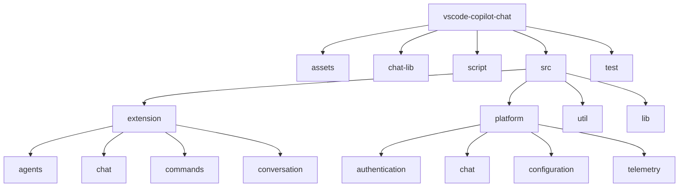
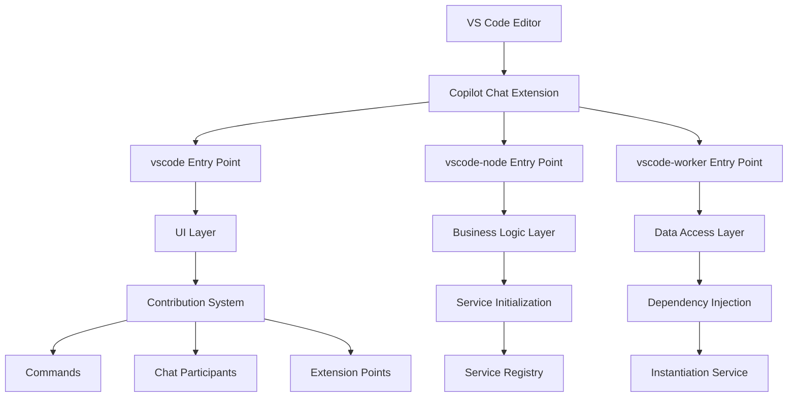
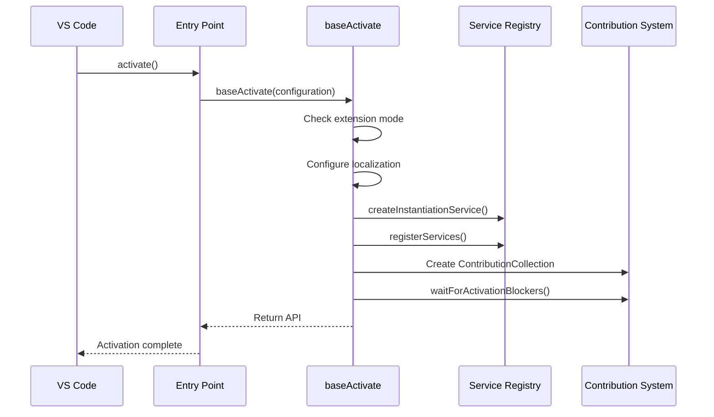
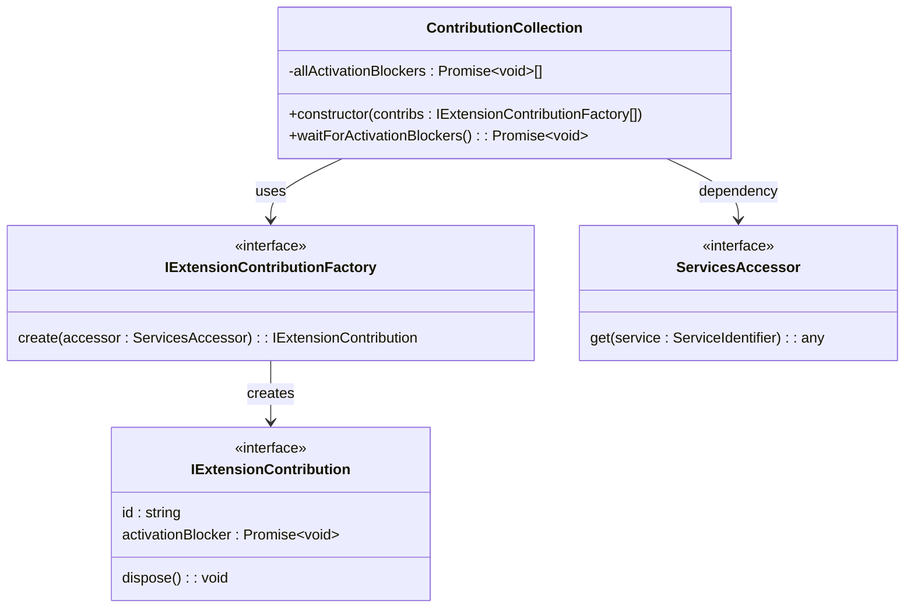
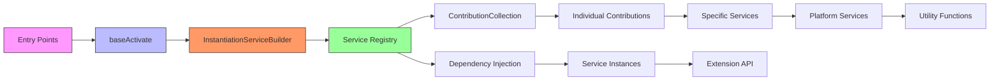

# Extension Architecture

<cite>
**Referenced Files in This Document**   
- [package.json](file://package.json)
- [README.md](file://README.md)
- [src/extension/extension/vscode/extension.ts](file://src/extension/extension/vscode/extension.ts)
- [src/extension/extension/vscode-node/extension.ts](file://src/extension/extension/vscode-node/extension.ts)
- [src/extension/extension/vscode-worker/extension.ts](file://src/extension/extension/vscode-worker/extension.ts)
- [src/extension/common/contributions.ts](file://src/extension/common/contributions.ts)
- [src/platform/extContext/common/extensionContext.ts](file://src/platform/extContext/common/extensionContext.ts)
- [src/lib/node/chatLibMain.ts](file://src/lib/node/chatLibMain.ts)
</cite>

## Table of Contents
1. [Introduction](#introduction)
2. [Project Structure](#project-structure)
3. [Core Components](#core-components)
4. [Architecture Overview](#architecture-overview)
5. [Detailed Component Analysis](#detailed-component-analysis)
6. [Dependency Analysis](#dependency-analysis)
7. [Performance Considerations](#performance-considerations)
8. [Troubleshooting Guide](#troubleshooting-guide)
9. [Conclusion](#conclusion)

## Introduction
The GitHub Copilot Chat extension is an AI-powered programming assistant that integrates with Visual Studio Code to provide conversational AI assistance, inline suggestions, and code generation capabilities. This document describes the high-level architecture of the extension, focusing on its modular structure, separation of concerns, and the three distinct extension entry points that support different execution environments within VS Code. The architecture is designed to provide a seamless AI-assisted coding experience while maintaining separation between UI, business logic, and data access layers.

**Section sources**
- [README.md](file://README.md#L1-L84)

## Project Structure
The vscode-copilot-chat extension follows a well-organized directory structure that separates concerns and facilitates maintainability. The project is divided into several key directories:

- **assets/**: Contains static assets such as agent definitions and prompts
- **chat-lib/**: Houses shared library code for chat functionality
- **script/**: Contains build and utility scripts
- **src/**: The main source code directory with the extension implementation
- **test/**: Contains test files and fixtures

The src directory is further organized into:
- **extension/**: Core extension functionality including agents, chat features, and contributions
- **platform/**: Platform-specific services and utilities
- **util/**: General utility functions and services
- **lib/**: Shared library code

This structure enables clear separation between different aspects of the extension, making it easier to maintain and extend.



**Diagram sources**
- [src/extension](file://src/extension)
- [src/platform](file://src/platform)

**Section sources**
- [src](file://src)

## Core Components
The extension architecture is built around several core components that work together to provide AI-powered coding assistance. The system is designed with a clear separation between UI, business logic, and data access layers. The core components include the extension entry points, contribution system, service initialization mechanism, and dependency injection framework. These components work together to provide a modular and extensible architecture that supports the various AI features of the extension.

The extension leverages a service-oriented architecture with dependency injection to manage component dependencies and lifecycle. This approach enables loose coupling between components, making the system more maintainable and testable. The architecture also supports cross-cutting concerns such as error handling, logging, and resource disposal through dedicated services and utilities.

**Section sources**
- [src/extension/extension/vscode/extension.ts](file://src/extension/extension/vscode/extension.ts#L1-L108)
- [src/lib/node/chatLibMain.ts](file://src/lib/node/chatLibMain.ts#L1-L800)

## Architecture Overview
The GitHub Copilot Chat extension employs a multi-runtime architecture with three distinct entry points that target different execution environments within VS Code: the main extension host, node.js environment, and web worker context. This architecture enables the extension to provide optimal performance and functionality across different VS Code deployment scenarios, including desktop and web-based environments.

The architecture follows a layered approach with clear separation between presentation, business logic, and data access layers. The extension uses a contribution-based system to register commands, chat participants, and other VS Code extension points. A dependency injection mechanism based on the instantiation service manages component lifecycle and dependencies, promoting loose coupling and testability.



**Diagram sources**
- [src/extension/extension/vscode/extension.ts](file://src/extension/extension/vscode/extension.ts#L1-L108)
- [src/extension/extension/vscode-node/extension.ts](file://src/extension/extension/vscode-node/extension.ts#L1-L44)
- [src/extension/extension/vscode-worker/extension.ts](file://src/extension/extension/vscode-worker/extension.ts#L1-L27)

## Detailed Component Analysis

### Extension Entry Points
The extension implements three distinct entry points to support different execution environments within VS Code. Each entry point is responsible for initializing the extension in its specific context and delegating to shared activation logic.

The **vscode entry point** serves as the shared activation code for both web and node.js extension hosts. It contains the baseActivate function that performs common initialization tasks such as setting up localization, checking extension mode, and creating the instantiation service. This shared code approach ensures consistency across different runtime environments.

The **vscode-node entry point** targets the node.js extension host and is responsible for initializing services and contributions specific to the node.js environment. It imports the base activation logic from the vscode entry point and adds node-specific configuration such as source map support and environment variable loading.

The **vscode-worker entry point** targets the web worker extension host and is responsible for initializing services and contributions specific to the web environment. Like the node.js entry point, it delegates to the shared base activation logic while providing web-specific contributions and services.



**Diagram sources**
- [src/extension/extension/vscode/extension.ts](file://src/extension/extension/vscode/extension.ts#L1-L108)
- [src/extension/extension/vscode-node/extension.ts](file://src/extension/extension/vscode-node/extension.ts#L1-L44)
- [src/extension/extension/vscode-worker/extension.ts](file://src/extension/extension/vscode-worker/extension.ts#L1-L27)

**Section sources**
- [src/extension/extension/vscode/extension.ts](file://src/extension/extension/vscode/extension.ts#L1-L108)
- [src/extension/extension/vscode-node/extension.ts](file://src/extension/extension/vscode-node/extension.ts#L1-L44)
- [src/extension/extension/vscode-worker/extension.ts](file://src/extension/extension/vscode-worker/extension.ts#L1-L27)

### Contribution System
The extension uses a flexible contribution system to register commands, chat participants, and other VS Code extension points. The system is built around the IExtensionContribution interface and ContributionCollection class, which manage the lifecycle of extension contributions.

Contributions are defined as factories that create instances of specific functionality when the extension activates. This lazy initialization approach improves startup performance by only creating services when needed. The contribution system supports activation blockers, which allow certain contributions to delay extension activation until they are ready.

The system is designed to be extensible, allowing new features to be added by implementing the IExtensionContribution interface and registering them with the appropriate entry point. This modular approach enables the extension to support a wide range of AI-powered features while maintaining a clean and maintainable codebase.



**Diagram sources**
- [src/extension/common/contributions.ts](file://src/extension/common/contributions.ts#L1-L78)

**Section sources**
- [src/extension/common/contributions.ts](file://src/extension/common/contributions.ts#L1-L78)

### Service Initialization and Dependency Injection
The extension uses a sophisticated service initialization and dependency injection mechanism based on the instantiation service pattern. This system manages the lifecycle of services and their dependencies, promoting loose coupling and testability.

The InstantiationServiceBuilder is used to define services and their dependencies during extension activation. Services are registered with the builder using descriptors that specify how instances should be created. This approach enables the system to resolve dependencies automatically and manage service lifecycles.

The dependency injection system supports both synchronous and asynchronous service creation, allowing for flexible initialization patterns. Services can declare their dependencies through constructor parameters, and the instantiation service automatically resolves and injects them when creating instances.

This architecture enables the extension to maintain a clean separation of concerns while providing a robust mechanism for managing component dependencies and lifecycles.

```mermaid
flowchart TD
A[Extension Activation] --> B[Create InstantiationServiceBuilder]
B --> C[Register Services]
C --> D[Seal Instantiation Service]
D --> E[Create ContributionCollection]
E --> F[Resolve Dependencies]
F --> G[Create Service Instances]
G --> H[Initialize Contributions]
H --> I[Complete Activation]
subgraph Service Registration
C1[registerServices()]
C2[builder.define(IService, descriptor)]
C3[Repeat for all services]
end
subgraph Dependency Resolution
F1[Analyze constructor parameters]
F2[Find registered services]
F3[Inject dependencies]
end
C --> C1
C1 --> C2
C2 --> C3
F --> F1
F1 --> F2
F2 --> F3
```

**Diagram sources**
- [src/extension/extension/vscode/extension.ts](file://src/extension/extension/vscode/extension.ts#L92-L107)
- [src/lib/node/chatLibMain.ts](file://src/lib/node/chatLibMain.ts#L335-L369)

**Section sources**
- [src/extension/extension/vscode/extension.ts](file://src/extension/extension/vscode/extension.ts#L92-L107)
- [src/lib/node/chatLibMain.ts](file://src/lib/node/chatLibMain.ts#L335-L369)

## Dependency Analysis
The extension architecture demonstrates a well-structured dependency graph with clear separation between components. The dependency injection system ensures that components depend on abstractions rather than concrete implementations, promoting loose coupling and testability.

The core dependencies flow from the extension entry points through the activation process to the service registry and contribution system. Services declare their dependencies through constructor parameters, and the instantiation service resolves these dependencies automatically. This approach creates a directed acyclic graph of dependencies that can be easily understood and maintained.

The architecture also includes mechanisms for handling cross-cutting concerns such as error handling, logging, and resource disposal. These concerns are addressed through dedicated services that are injected into components as needed, ensuring consistent handling across the extension.



**Diagram sources**
- [src/extension/extension/vscode/extension.ts](file://src/extension/extension/vscode/extension.ts#L1-L108)
- [src/lib/node/chatLibMain.ts](file://src/lib/node/chatLibMain.ts#L335-L369)

**Section sources**
- [src/extension/extension/vscode/extension.ts](file://src/extension/extension/vscode/extension.ts#L1-L108)
- [src/lib/node/chatLibMain.ts](file://src/lib/node/chatLibMain.ts#L335-L369)

## Performance Considerations
The extension architecture incorporates several performance optimizations to ensure a responsive user experience. The lazy initialization of services through the contribution system helps reduce startup time by only creating components when needed. The use of activation blockers allows critical services to initialize before the extension becomes fully active, preventing race conditions and ensuring reliability.

The dependency injection system is designed for efficiency, with services being created once and reused throughout the extension's lifecycle. This singleton pattern reduces memory usage and improves performance by avoiding redundant object creation.

The separation of concerns between different execution environments (node.js and web worker) allows the extension to optimize performance for each context. For example, computationally intensive tasks can be offloaded to the node.js environment, while UI-related functionality can run in the web worker context.

## Troubleshooting Guide
When troubleshooting issues with the extension architecture, consider the following common scenarios:

1. **Extension fails to activate**: Check if the extension is running in test mode or if activation blockers are preventing completion. Verify that required services are properly registered.

2. **Service initialization failures**: Ensure that all dependencies are properly registered with the instantiation service. Check for circular dependencies that could prevent service creation.

3. **Contribution registration issues**: Verify that contribution factories are correctly implemented and registered with the appropriate entry point.

4. **Performance problems**: Monitor the activation sequence and identify any long-running activation blockers. Consider lazy-loading non-essential services.

5. **Cross-environment compatibility issues**: Ensure that shared code in the vscode entry point does not rely on environment-specific APIs.

**Section sources**
- [src/extension/extension/vscode/extension.ts](file://src/extension/extension/vscode/extension.ts#L33-L108)
- [src/extension/common/contributions.ts](file://src/extension/common/contributions.ts#L1-L78)

## Conclusion
The GitHub Copilot Chat extension architecture demonstrates a sophisticated and well-structured design that effectively addresses the challenges of building a complex AI-powered extension for Visual Studio Code. The multi-runtime architecture with three distinct entry points enables the extension to provide optimal performance and functionality across different deployment scenarios.

The clear separation of concerns between UI, business logic, and data access layers, combined with the contribution system and dependency injection mechanism, creates a maintainable and extensible codebase. This architecture allows the extension to support a wide range of AI-powered features while maintaining a clean and organized structure.

The design decisions reflected in this architecture prioritize performance, reliability, and developer experience, making it well-suited for delivering a seamless AI-assisted coding experience to users.