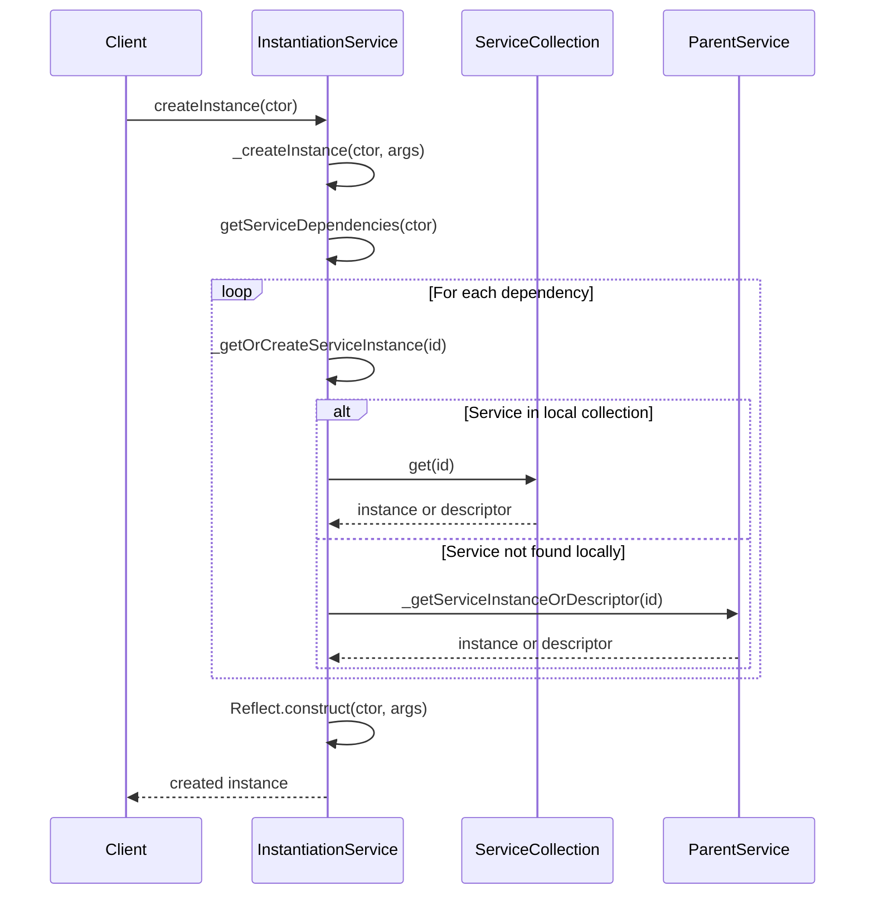
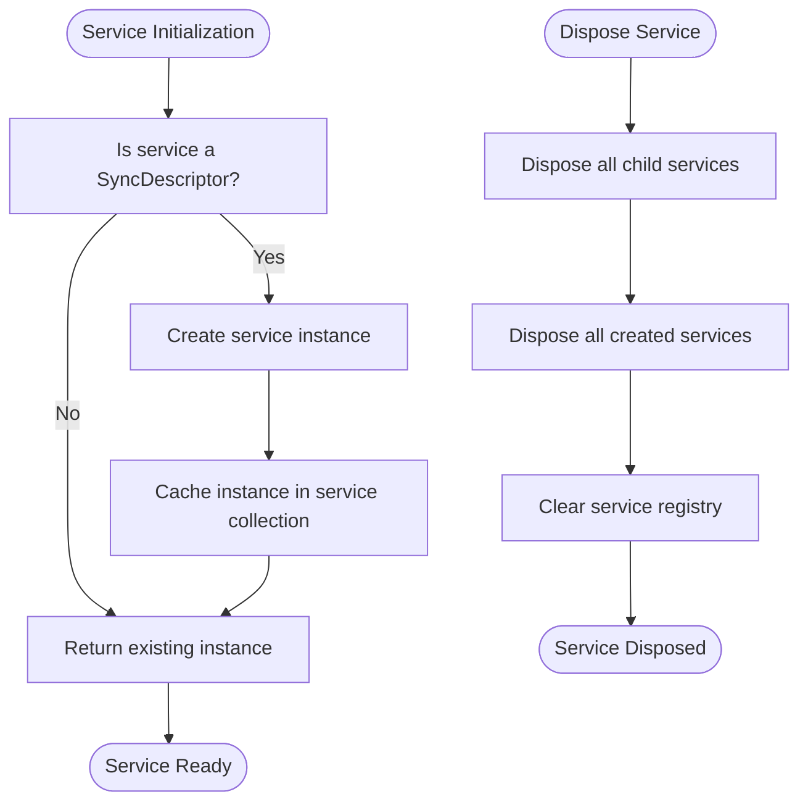
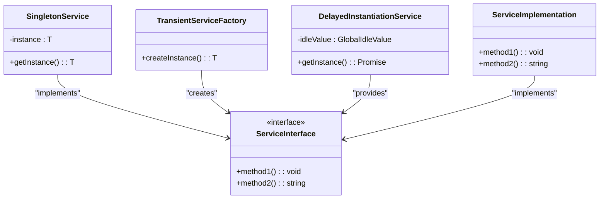
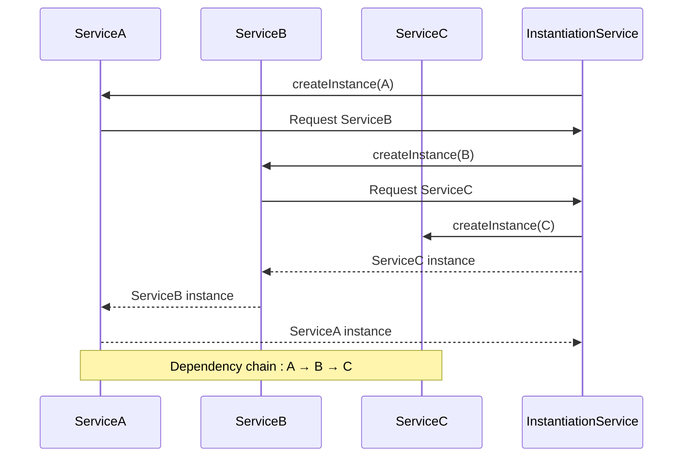
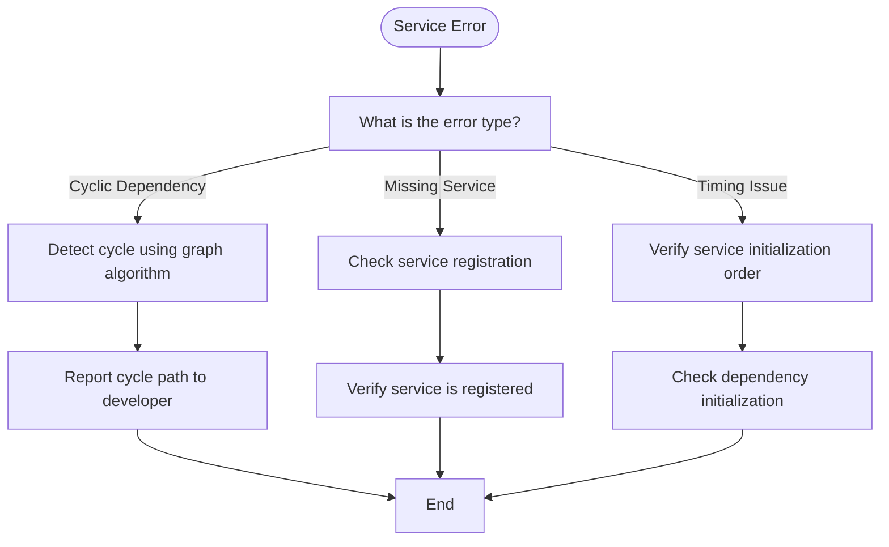

# Service Initialization

<cite>
**Referenced Files in This Document**   
- [instantiation.ts](file://src/util/vs/platform/instantiation/common/instantiation.ts)
- [instantiationService.ts](file://src/util/vs/platform/instantiation/common/instantiationService.ts)
- [serviceCollection.ts](file://src/util/vs/platform/instantiation/common/serviceCollection.ts)
- [descriptors.ts](file://src/util/vs/platform/instantiation/common/descriptors.ts)
- [services.ts](file://src/extension/extension/vscode/services.ts)
- [services.ts](file://src/extension/extension/vscode-node/services.ts)
- [services.ts](file://src/util/common/services.ts)
</cite>

## Table of Contents
1. [Introduction](#introduction)
2. [Core Components](#core-components)
3. [Service Registration and Resolution](#service-registration-and-resolution)
4. [Service Lifecycle Management](#service-lifecycle-management)
5. [Service Patterns and Implementation](#service-patterns-and-implementation)
6. [Service Dependencies and Injection](#service-dependencies-and-injection)
7. [Service Collections and Descriptors](#service-collections-and-descriptors)
8. [Common Issues and Troubleshooting](#common-issues-and-troubleshooting)
9. [Creating and Testing Services](#creating-and-testing-services)
10. [Architecture Overview](#architecture-overview)

## Introduction
The service initialization system in vscode-copilot-chat is built on a dependency injection framework that manages the creation, resolution, and lifecycle of services throughout the application. This system enables loose coupling between components, promotes testability, and provides a structured approach to managing application dependencies. The framework is based on an instantiation service that handles service creation and dependency resolution, with support for both singleton and transient service patterns across different execution contexts.

**Section sources**
- [instantiation.ts](file://src/util/vs/platform/instantiation/common/instantiation.ts#L1-L134)
- [instantiationService.ts](file://src/util/vs/platform/instantiation/common/instantiationService.ts#L1-L485)

## Core Components

The service initialization system consists of several core components that work together to manage services. The IInstantiationService interface provides the primary API for creating instances and invoking functions with service access. ServiceCollection acts as a registry for service instances and descriptors, while ServiceIdentifier provides a type-safe way to reference services. The SyncDescriptor class encapsulates service construction information, including the constructor, static arguments, and instantiation options.

```mermaid
classDiagram
class IInstantiationService {
+createInstance(descriptor : SyncDescriptor0<T>) : T
+createInstance(ctor : Ctor, ...args : GetLeadingNonServiceArgs<ConstructorParameters<Ctor>>) : R
+invokeFunction(fn : (accessor : ServicesAccessor, ...args : TS) => R, ...args : TS) : R
+createChild(services : ServiceCollection, store? : DisposableStore) : IInstantiationService
+dispose() : void
}
class ServiceCollection {
-_entries : Map<ServiceIdentifier<any>, any>
+set(id : ServiceIdentifier<T>, instanceOrDescriptor : T | SyncDescriptor<T>) : T | SyncDescriptor<T>
+has(id : ServiceIdentifier<any>) : boolean
+get(id : ServiceIdentifier<T>) : T | SyncDescriptor<T>
}
class ServiceIdentifier {
(...args : any[]) : void
type : T
}
class SyncDescriptor {
+ctor : any
+staticArguments : unknown[]
+supportsDelayedInstantiation : boolean
+constructor(ctor : new (...args : any[]) => T, staticArguments : unknown[], supportsDelayedInstantiation : boolean)
}
class ServicesAccessor {
+get<T>(id : ServiceIdentifier<T>) : T
+getIfExists<T>(id : ServiceIdentifier<T>) : T | undefined
}
IInstantiationService --> ServiceCollection : "uses"
IInstantiationService --> ServiceIdentifier : "references"
IInstantiationService --> SyncDescriptor : "creates"
IInstantiationService --> ServicesAccessor : "provides"
```

**Diagram sources **
- [instantiation.ts](file://src/util/vs/platform/instantiation/common/instantiation.ts#L55-L88)
- [serviceCollection.ts](file://src/util/vs/platform/instantiation/common/serviceCollection.ts#L11-L34)
- [descriptors.ts](file://src/util/vs/platform/instantiation/common/descriptors.ts#L8-L18)

**Section sources**
- [instantiation.ts](file://src/util/vs/platform/instantiation/common/instantiation.ts#L39-L133)
- [instantiationService.ts](file://src/util/vs/platform/instantiation/common/instantiationService.ts#L30-L485)
- [serviceCollection.ts](file://src/util/vs/platform/instantiation/common/serviceCollection.ts#L11-L34)
- [descriptors.ts](file://src/util/vs/platform/instantiation/common/descriptors.ts#L8-L24)

## Service Registration and Resolution

Service registration in vscode-copilot-chat is performed through the IInstantiationServiceBuilder interface, which provides a fluent API for defining services. Services can be registered as either instances or descriptors, with different scoping behaviors. The registration process uses ServiceIdentifier objects created with the createDecorator function, which ensures type safety and prevents identifier collisions.

When a service is requested, the instantiation service resolves it through a hierarchical lookup process. It first checks the local service collection, and if the service is not found, it delegates to the parent service. This creates a chain of responsibility that allows services to be inherited from parent contexts while enabling overrides in child contexts. The resolution process handles both immediate instances and lazy descriptors, creating instances only when needed.



**Diagram sources **
- [instantiationService.ts](file://src/util/vs/platform/instantiation/common/instantiationService.ts#L127-L172)
- [instantiation.ts](file://src/util/vs/platform/instantiation/common/instantiation.ts#L100-L107)

**Section sources**
- [instantiationService.ts](file://src/util/vs/platform/instantiation/common/instantiationService.ts#L125-L289)
- [instantiation.ts](file://src/util/vs/platform/instantiation/common/instantiation.ts#L109-L133)

## Service Lifecycle Management

The service lifecycle in vscode-copilot-chat is managed through a combination of eager and lazy instantiation strategies. Services can be configured for immediate creation or delayed instantiation based on their usage patterns and performance requirements. The instantiation service maintains a registry of created services and ensures proper disposal when the service container is disposed.

Service disposal follows a hierarchical pattern where child services are disposed before their parents. The system tracks disposable services and automatically disposes them when the instantiation service is disposed. Child services are also tracked and disposed when the parent service is disposed, creating a clean teardown process. Services created with the instantiation service are automatically managed, while externally created instances are not disposed by the framework.



**Diagram sources **
- [instantiationService.ts](file://src/util/vs/platform/instantiation/common/instantiationService.ts#L52-L67)
- [instantiationService.ts](file://src/util/vs/platform/instantiation/common/instantiationService.ts#L75-L88)

**Section sources**
- [instantiationService.ts](file://src/util/vs/platform/instantiation/common/instantiationService.ts#L52-L88)
- [instantiationService.ts](file://src/util/vs/platform/instantiation/common/instantiationService.ts#L209-L219)

## Service Patterns and Implementation

The service initialization system supports multiple service patterns to accommodate different use cases. Singleton services are the default pattern, where a single instance is created and shared across all consumers. Transient services can be implemented by creating new instances manually or through factory patterns. The system also supports delayed instantiation for services that are expensive to create or not always needed.

Services are implemented as classes that declare their dependencies through constructor parameters annotated with service identifiers. This dependency injection pattern promotes loose coupling and makes services easier to test. The framework handles the automatic resolution of dependencies, creating and injecting required services when a new instance is created. Service interfaces are defined as TypeScript interfaces, with implementations providing the concrete functionality.



**Diagram sources **
- [instantiationService.ts](file://src/util/vs/platform/instantiation/common/instantiationService.ts#L301-L343)
- [instantiation.ts](file://src/util/vs/platform/instantiation/common/instantiation.ts#L33-L37)

**Section sources**
- [instantiationService.ts](file://src/util/vs/platform/instantiation/common/instantiationService.ts#L301-L343)
- [instantiation.ts](file://src/util/vs/platform/instantiation/common/instantiation.ts#L33-L42)

## Service Dependencies and Injection

Service dependencies are declared through constructor parameters annotated with service identifiers. The framework uses TypeScript decorators and metadata to identify and resolve dependencies automatically. When a service is instantiated, the framework examines its constructor to determine the required dependencies, resolves them from the service collection, and injects them as parameters.

The dependency injection process handles both direct dependencies and transitive dependencies, ensuring that all required services are available before creating an instance. The system performs cycle detection to prevent circular dependencies, using a graph-based algorithm to detect and report dependency cycles. Dependencies are resolved in the order they appear in the constructor, with non-service parameters provided by the caller and service parameters injected by the framework.



**Diagram sources **
- [instantiationService.ts](file://src/util/vs/platform/instantiation/common/instantiationService.ts#L143-L154)
- [instantiationService.ts](file://src/util/vs/platform/instantiation/common/instantiationService.ts#L221-L289)

**Section sources**
- [instantiationService.ts](file://src/util/vs/platform/instantiation/common/instantiationService.ts#L143-L172)
- [instantiationService.ts](file://src/util/vs/platform/instantiation/common/instantiationService.ts#L221-L289)

## Service Collections and Descriptors

Service collections and descriptors are fundamental components of the service initialization system. A ServiceCollection is a registry that maps service identifiers to their instances or descriptors. It provides methods for adding, retrieving, and checking services, supporting both immediate instances and lazy descriptors. The collection is used by the instantiation service to resolve dependencies and manage service lifetimes.

SyncDescriptor objects encapsulate the information needed to create a service instance, including the constructor function, static arguments, and instantiation options. They enable lazy instantiation and support configuration of service creation behavior. Descriptors can specify whether a service should be instantiated immediately or delayed until first use, allowing for optimization of startup performance and memory usage.

```mermaid
classDiagram
class ServiceCollection {
-_entries : Map<ServiceIdentifier<any>, any>
+set(id : ServiceIdentifier<T>, instanceOrDescriptor : T | SyncDescriptor<T>) : T | SyncDescriptor<T>
+get(id : ServiceIdentifier<T>) : T | SyncDescriptor<T>
+has(id : ServiceIdentifier<any>) : boolean
}
class SyncDescriptor {
+ctor : any
+staticArguments : unknown[]
+supportsDelayedInstantiation : boolean
}
class ServiceIdentifier {
(...args : any[]) : void
type : T
}
ServiceCollection --> ServiceIdentifier : "keys"
ServiceCollection --> SyncDescriptor : "values"
ServiceCollection --> "Service Instance" : "values"
```

**Diagram sources **
- [serviceCollection.ts](file://src/util/vs/platform/instantiation/common/serviceCollection.ts#L11-L34)
- [descriptors.ts](file://src/util/vs/platform/instantiation/common/descriptors.ts#L8-L18)

**Section sources**
- [serviceCollection.ts](file://src/util/vs/platform/instantiation/common/serviceCollection.ts#L11-L34)
- [descriptors.ts](file://src/util/vs/platform/instantiation/common/descriptors.ts#L8-L24)

## Common Issues and Troubleshooting

Common issues in the service initialization system include circular dependencies, missing service registrations, and timing issues with service availability. Circular dependencies occur when services depend on each other directly or through a chain of dependencies. The framework detects these cycles using a graph-based algorithm and throws a CyclicDependencyError with information about the dependency loop.

Missing service registrations result in errors when the framework cannot resolve a requested service. This typically occurs when a service is used but not registered with the service collection. Timing issues can arise when services are accessed before they are fully initialized, particularly in asynchronous contexts. The framework provides strict mode checking to help identify these issues during development.



**Diagram sources **
- [instantiationService.ts](file://src/util/vs/platform/instantiation/common/instantiationService.ts#L221-L271)
- [instantiationService.ts](file://src/util/vs/platform/instantiation/common/instantiationService.ts#L248-L250)

**Section sources**
- [instantiationService.ts](file://src/util/vs/platform/instantiation/common/instantiationService.ts#L221-L271)
- [instantiationService.ts](file://src/util/vs/platform/instantiation/common/instantiationService.ts#L248-L250)

## Creating and Testing Services

Creating new services in vscode-copilot-chat involves defining a service interface, implementing the service class, and registering it with the service collection. Services should declare their dependencies through constructor parameters annotated with service identifiers. The implementation should follow the single responsibility principle and focus on a specific functionality.

Testing services is facilitated by the dependency injection framework, which allows for easy mocking of dependencies. Test cases can create isolated service instances with mock dependencies to verify behavior. The framework's support for child service containers enables testing in different contexts and configurations. Integration tests can verify the proper registration and resolution of services within the application context.

**Section sources**
- [services.ts](file://src/extension/extension/vscode/services.ts#L111-L176)
- [services.ts](file://src/extension/extension/vscode-node/services.ts#L119-L236)
- [services.ts](file://src/util/common/services.ts#L13-L43)

## Architecture Overview

The service initialization architecture in vscode-copilot-chat is based on a hierarchical dependency injection system that manages service creation, resolution, and lifecycle. The architecture consists of several layers, with the IInstantiationService at the core, providing the API for service creation and dependency resolution. Service collections act as registries for service instances and descriptors, while service identifiers provide type-safe references to services.

The architecture supports multiple execution contexts through service inheritance and overrides. Child service containers can inherit services from their parents while adding or overriding specific services. This enables context-specific configurations while maintaining a consistent service interface. The system handles both synchronous and asynchronous service creation, supporting immediate instances and lazy initialization for performance optimization.

```mermaid
graph TB
subgraph "Service Framework"
InstantiationService[IInstantiationService]
ServiceCollection[ServiceCollection]
ServiceIdentifier[ServiceIdentifier]
SyncDescriptor[SyncDescriptor]
end
subgraph "Service Contexts"
ParentService[Parent InstantiationService]
ChildService[Child InstantiationService]
GrandchildService[Grandchild InstantiationService]
end
InstantiationService --> ServiceCollection
InstantiationService --> ServiceIdentifier
InstantiationService --> SyncDescriptor
ParentService --> ChildService
ChildService --> GrandchildService
ChildService --> ParentService : "inherits"
GrandchildService --> ChildService : "inherits"
style InstantiationService fill:#f9f,stroke:#333
style ServiceCollection fill:#bbf,stroke:#333
style ServiceIdentifier fill:#f96,stroke:#333
style SyncDescriptor fill:#6f9,stroke:#333
```

**Diagram sources **
- [instantiation.ts](file://src/util/vs/platform/instantiation/common/instantiation.ts#L55-L88)
- [instantiationService.ts](file://src/util/vs/platform/instantiation/common/instantiationService.ts#L30-L485)
- [serviceCollection.ts](file://src/util/vs/platform/instantiation/common/serviceCollection.ts#L11-L34)

**Section sources**
- [instantiation.ts](file://src/util/vs/platform/instantiation/common/instantiation.ts#L1-L134)
- [instantiationService.ts](file://src/util/vs/platform/instantiation/common/instantiationService.ts#L1-L485)
- [services.ts](file://src/extension/extension/vscode/services.ts#L111-L176)
- [services.ts](file://src/extension/extension/vscode-node/services.ts#L119-L236)