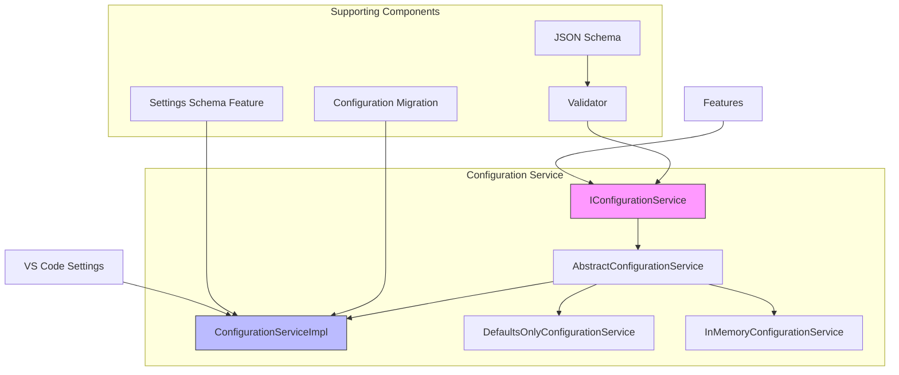
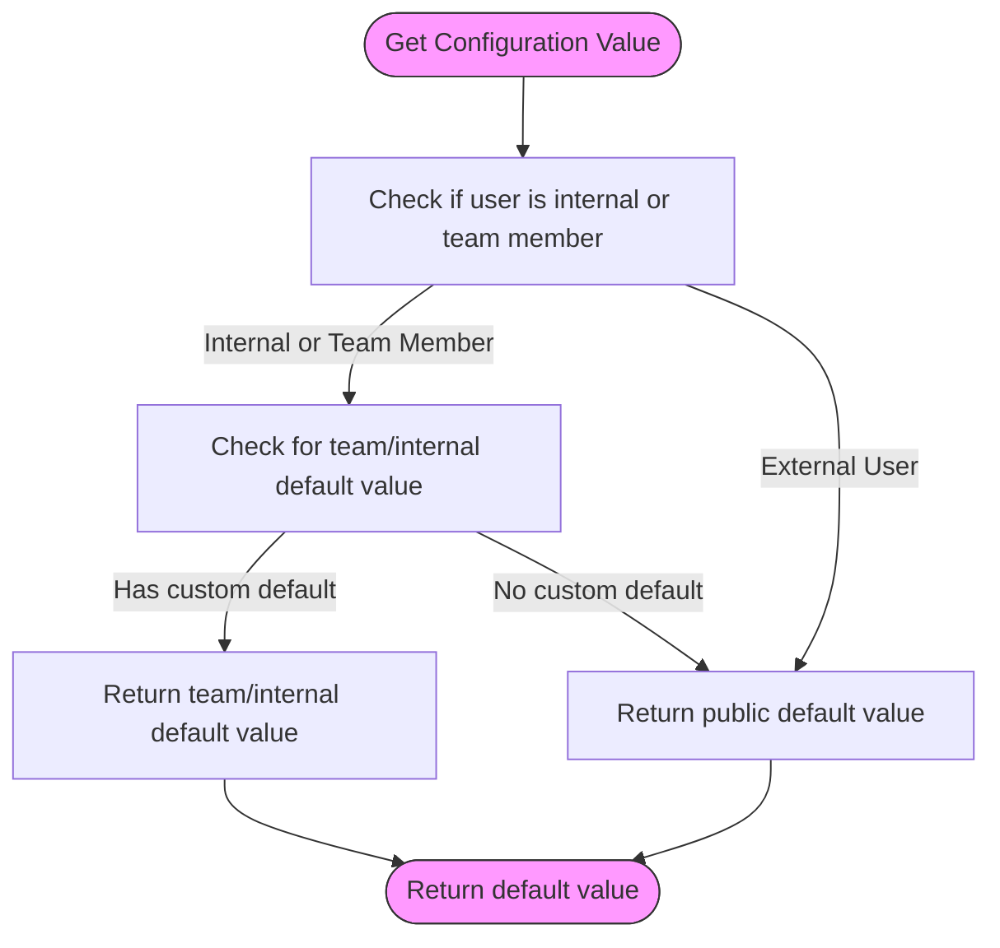
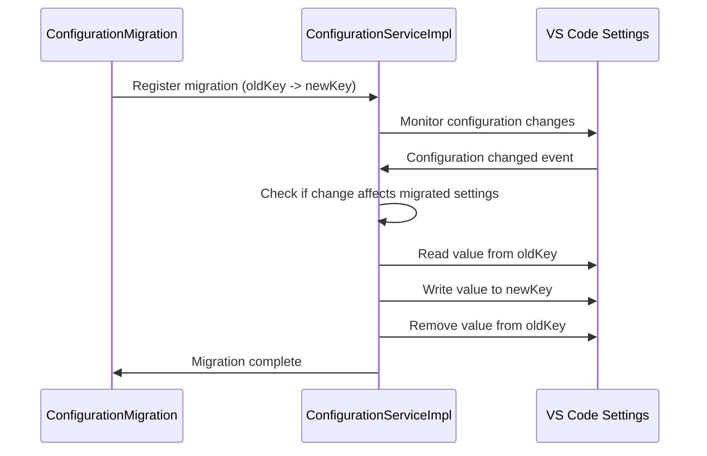
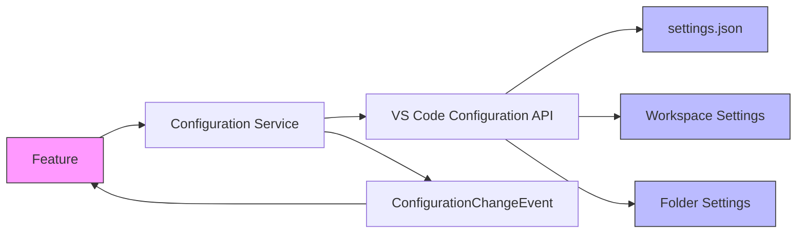
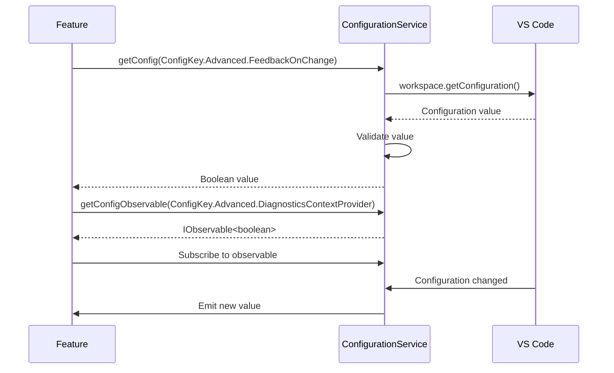

# Configuration Service

<cite>
**Referenced Files in This Document**   
- [configurationService.ts](file://src/platform/configuration/common/configurationService.ts)
- [configurationServiceImpl.ts](file://src/platform/configuration/vscode/configurationServiceImpl.ts)
- [validator.ts](file://src/platform/configuration/common/validator.ts)
- [jsonSchema.ts](file://src/platform/configuration/common/jsonSchema.ts)
- [configurationMigration.ts](file://src/extension/configuration/vscode-node/configurationMigration.ts)
- [settingsSchemaFeature.ts](file://src/extension/settingsSchema/vscode-node/settingsSchemaFeature.ts)
- [package.json](file://package.json)
</cite>

## Table of Contents
1. [Introduction](#introduction)
2. [Architecture Overview](#architecture-overview)
3. [Core Components](#core-components)
4. [Configuration Validation and Schema Handling](#configuration-validation-and-schema-handling)
5. [Default Value Management](#default-value-management)
6. [Configuration Migration System](#configuration-migration-system)
7. [Interaction with VS Code Settings](#interaction-with-vs-code-settings)
8. [Consuming Configuration Values](#consuming-configuration-values)
9. [Adding New Configuration Options](#adding-new-configuration-options)
10. [Best Practices](#best-practices)

## Introduction

The Configuration Service in the platform layer of vscode-copilot-chat provides a unified interface for accessing extension settings across different environments. This service abstracts the underlying VS Code configuration system, offering a consistent API for features to retrieve and update configuration values. The service supports both simple configuration values and experiment-based configurations that can be controlled through experimentation systems.

The configuration system is designed with several key principles in mind: type safety, validation, backward compatibility, and extensibility. It provides mechanisms for defining configuration schemas, validating values, managing default values with team-specific overrides, and migrating settings between different versions.

**Section sources**
- [configurationService.ts](file://src/platform/configuration/common/configurationService.ts#L25-L163)

## Architecture Overview

The Configuration Service follows a layered architecture with a clear separation between the interface, implementation, and supporting utilities. The core components work together to provide a robust configuration management system.



**Diagram sources **
- [configurationService.ts](file://src/platform/configuration/common/configurationService.ts#L79-L163)
- [configurationServiceImpl.ts](file://src/platform/configuration/vscode/configurationServiceImpl.ts#L22-L315)

## Core Components

The Configuration Service is built around several core components that work together to provide a comprehensive configuration management solution. The main interface `IConfigurationService` defines the contract for configuration access, while the `ConfigurationServiceImpl` provides the concrete implementation that interacts with VS Code's settings system.

The service supports two types of configurations: simple configurations and experiment-based configurations. Simple configurations represent standard settings that users can modify, while experiment-based configurations can be controlled through an experimentation service, allowing for A/B testing and gradual feature rollouts.

Key methods provided by the service include:
- `getConfig<T>(key)`: Retrieves a configuration value for a given key
- `getConfigObservable<T>(key)`: Returns an observable for a configuration value that emits when the value changes
- `setConfig<T>(key, value)`: Updates a configuration value
- `inspectConfig<T>(key)`: Retrieves detailed information about a configuration setting from all scopes
- `getExperimentBasedConfig<T>(key, experimentationService)`: Retrieves an experiment-based configuration value

The service also emits events when configuration values change, allowing features to react to configuration updates in real-time.

**Section sources**
- [configurationService.ts](file://src/platform/configuration/common/configurationService.ts#L79-L163)
- [configurationServiceImpl.ts](file://src/platform/configuration/vscode/configurationServiceImpl.ts#L22-L315)

## Configuration Validation and Schema Handling

The Configuration Service includes a comprehensive validation system that ensures configuration values conform to expected types and constraints. The validation system is built around the `IValidator<T>` interface, which defines a contract for validating configuration values and generating JSON schemas.

```mermaid
classDiagram
class IValidator~T~ {
<<interface>>
+validate(content : unknown) : { content : T; error : undefined } | { content : undefined; error : ValidationError }
+toSchema() : JsonSchema
+isRequired?() : boolean
}
class TypeofValidator~TKey~ {
-type : TKey
+validate(content : unknown) : { content : T; error : undefined } | { content : undefined; error : ValidationError }
+toSchema() : JsonSchema
}
IValidator <|-- TypeofValidator
IValidator <|-- vString
IValidator <|-- vNumber
IValidator <|-- vBoolean
IValidator <|-- vObj
IValidator <|-- vArray
IValidator <|-- vUnion
IValidator <|-- vEnum
class JsonSchema {
+$id? : string
+$schema? : string
+title? : string
+description? : string
+type? : string | string[]
+enum? : unknown[]
+format? : string
+properties? : { [name : string] : JsonSchema }
+required? : string[]
+items? : JsonSchema | JsonSchema[]
+oneOf? : JsonSchema[]
}
TypeofValidator --> JsonSchema : "generates"
vString --> JsonSchema : "generates"
vNumber --> JsonSchema : "generates"
vBoolean --> JsonSchema : "generates"
vObj --> JsonSchema : "generates"
vArray --> JsonSchema : "generates"
vUnion --> JsonSchema : "generates"
vEnum --> JsonSchema : "generates"
```

**Diagram sources **
- [validator.ts](file://src/platform/configuration/common/validator.ts#L8-L292)
- [jsonSchema.ts](file://src/platform/configuration/common/jsonSchema.ts#L6-L139)

The validation system provides several built-in validators for common types:
- `vString()`: Validates string values
- `vNumber()`: Validates numeric values
- `vBoolean()`: Validates boolean values
- `vObj()`: Validates object values with specified properties
- `vArray()`: Validates array values with specified element type
- `vUnion()`: Validates values that can be one of several types
- `vEnum()`: Validates values against a predefined set of options

When a configuration value is retrieved, it is automatically validated against its validator. If validation fails, the service logs an error and returns the default value instead. This ensures that features always receive valid configuration values, preventing runtime errors due to malformed settings.

The validation system also generates JSON schemas that can be used for IntelliSense and validation in settings.json files. This provides a seamless developer experience, with automatic validation and suggestions when editing configuration files.

## Default Value Management

The Configuration Service implements a sophisticated default value management system that supports different default values for internal users, team members, and external users. This allows the extension to provide enhanced functionality for team members while maintaining a consistent experience for external users.



**Diagram sources **
- [configurationService.ts](file://src/platform/configuration/common/configurationService.ts#L211-L223)
- [configurationService.ts](file://src/platform/configuration/common/configurationService.ts#L303-L314)

The system supports three types of default value configurations:
1. **Simple defaults**: A single default value for all users
2. **Team defaults**: Different default values for team members vs. other users
3. **Team and internal defaults**: Different default values for team members, internal users, and external users

This is implemented through the `DefaultValueWithTeamValue<T>` and `DefaultValueWithTeamAndInternalValue<T>` types, which allow configuration definitions to specify multiple default values. The service automatically selects the appropriate default based on the user's authentication status.

The default value management system also handles the case where a setting is public (defined in package.json) but has different default values for team members. In this case, the service ensures that the default value in package.json matches the default value for external users, maintaining consistency across the codebase.

## Configuration Migration System

The Configuration Service includes a robust migration system that allows for seamless transitions when configuration keys are renamed or restructured. This system ensures backward compatibility when settings are renamed or moved, preventing configuration loss during updates.



**Diagram sources **
- [configurationMigration.ts](file://src/extension/configuration/vscode-node/configurationMigration.ts#L12-L164)
- [configurationServiceImpl.ts](file://src/platform/configuration/vscode/configurationServiceImpl.ts#L22-L315)

The migration system is implemented through the `ConfigurationMigrationRegistry` and `ConfigurationMigrationContribution` classes. Migrations are defined as pairs of old and new configuration keys, with a migration function that transforms the value if necessary.

Key features of the migration system include:
- Automatic detection of configuration changes in all scopes (global, workspace, workspace folder)
- Support for migrating values between different configuration keys
- Preservation of configuration values during the migration process
- Logging of migration operations for debugging purposes

Migrations are typically registered using helper functions like `migrateSetting()` and `defineAndMigrateSetting()`, which simplify the process of defining common migration patterns. For example:

```typescript
migrateSetting('chat.advanced.debug.useElectronFetcher', 'chat.debug.useElectronFetcher');
```

This automatically creates a migration that moves the value from the old key to the new key, ensuring that users don't lose their configuration when the setting is renamed.

## Interaction with VS Code Settings

The Configuration Service provides a seamless integration with VS Code's settings system, abstracting the underlying API while preserving all functionality. The `ConfigurationServiceImpl` class is responsible for this integration, handling the translation between the service's interface and VS Code's configuration API.



**Diagram sources **
- [configurationServiceImpl.ts](file://src/platform/configuration/vscode/configurationServiceImpl.ts#L22-L315)

The service handles several complexities of VS Code's configuration system:
- **Advanced settings**: The service supports two styles for advanced settings:
  1. Flat style: `"github.copilot.advanced.debug.useElectronFetcher": false`
  2. Object style: `"github.copilot.advanced": { "debug.useElectronFetcher": false }`
  
  The service can read settings in both formats but writes them using the object style to ensure compatibility.

- **Configuration scopes**: The service properly handles configuration values from different scopes (global, workspace, workspace folder) and language-specific settings.

- **Event propagation**: The service listens for configuration changes and propagates them to subscribers, ensuring that features are notified of changes even when they occur outside the Copilot namespace.

- **Target determination**: When updating configuration values, the service intelligently determines the appropriate target scope based on where the setting was previously defined, following a "prefer-global" strategy.

The service also provides methods for accessing non-extension configuration values through `getNonExtensionConfig()`, allowing features to access VS Code settings outside the Copilot namespace.

## Consuming Configuration Values

Features consume configuration values through the `IConfigurationService` interface, which provides a type-safe and validated way to access settings. The service is typically injected as a dependency using the dependency injection system.



**Diagram sources **
- [configurationService.ts](file://src/platform/configuration/common/configurationService.ts#L89-L97)
- [configurationServiceImpl.ts](file://src/platform/configuration/vscode/configurationServiceImpl.ts#L49-L117)

Key patterns for consuming configuration values include:

1. **Direct access**: Using `getConfig()` to retrieve a configuration value
```typescript
const feedbackEnabled = configService.getConfig(ConfigKey.Advanced.FeedbackOnChange);
```

2. **Observable access**: Using `getConfigObservable()` to react to configuration changes
```typescript
const diagnosticsEnabled = configService.getConfigObservable(ConfigKey.Advanced.DiagnosticsContextProvider, expService);
diagnosticsEnabled.get().then(value => {
    // Handle current value
});
diagnosticsEnabled.subscribe(value => {
    // Handle changes
});
```

3. **Experiment-based access**: Using `getExperimentBasedConfig()` to retrieve values that can be controlled through experimentation
```typescript
const inlineEditsEnabled = configService.getExperimentBasedConfig(ConfigKey.Advanced.InlineEditsEnabled, experimentationService);
```

4. **Mixed defaults**: Using `getConfigMixedWithDefaults()` to combine user settings with default values for object properties
```typescript
const settings = configService.getConfigMixedWithDefaults(ConfigKey.Advanced.SomeObjectSetting);
```

The service also provides utility methods like `isConfigured()` to check if a setting has been explicitly configured by the user, and `inspectConfig()` to retrieve detailed information about a setting from all configuration scopes.

## Adding New Configuration Options

Adding new configuration options follows a well-defined pattern that ensures consistency and proper integration with the configuration system. The process involves defining the configuration key, specifying its properties, and registering it with the global configuration registry.

```mermaid
flowchart TD
A[Define Configuration Key] --> B[Choose Configuration Type]
B --> |Simple| C[Use defineSetting()]
B --> |Experiment-based| D[Use defineSetting() with ConfigType.ExperimentBased]
B --> |With migration| E[Use defineAndMigrateSetting()]
C --> F[Specify key, default value, validator, options]
D --> F
E --> G[Specify old and new keys]
F --> H[Register with globalConfigRegistry]
G --> H
H --> I[Add to package.json schema]
style A fill:#f9f,stroke:#333
style I fill:#bbf,stroke:#333
```

**Diagram sources **
- [configurationService.ts](file://src/platform/configuration/common/configurationService.ts#L494-L539)
- [package.json](file://package.json#L141-L800)

The process for adding a new configuration option involves the following steps:

1. **Define the configuration key** in the appropriate namespace (e.g., `ConfigKey.Advanced` or `ConfigKey.TeamInternal`)

2. **Choose the appropriate definition function** based on the configuration type:
   - `defineSetting()`: For standard configuration options
   - `defineSetting()` with `ConfigType.ExperimentBased`: For experiment-controlled options
   - `defineAndMigrateSetting()`: For options that replace existing settings
   - `defineTeamInternalSetting()`: For internal-only settings

3. **Specify the configuration properties**:
   - `key`: The configuration key (without the `github.copilot.` prefix)
   - `defaultValue`: The default value, which can include team-specific overrides
   - `validator`: Optional validator to ensure type safety and constraints
   - `options`: Additional options like migration settings

4. **Add the configuration to package.json** in the `contributes.configuration` section, including:
   - Title and description for user documentation
   - Type and default value
   - Any constraints or allowed values

5. **For migrated settings**, use `migrateSetting()` or `defineAndMigrateSetting()` to ensure backward compatibility.

Example of adding a new configuration option:
```typescript
export namespace Advanced {
    export const NewFeatureEnabled = defineSetting<boolean>(
        'chat.advanced.newFeature.enabled', 
        ConfigType.Simple, 
        false,
        vBoolean(),
        { valueIgnoredForExternals: true }
    );
}
```

## Best Practices

When working with the Configuration Service, several best practices should be followed to ensure consistency, maintainability, and a good user experience.

### Defining Configuration Schemas

1. **Use descriptive names**: Configuration keys should be clear and descriptive, following the pattern `namespace.subnamespace.settingName`.

2. **Provide meaningful descriptions**: All configuration options should have clear titles and descriptions in package.json to help users understand their purpose.

3. **Use appropriate types**: Choose the most specific type for your configuration value (boolean, string, number, enum) rather than using generic objects when possible.

4. **Validate input**: Use validators to ensure configuration values meet expected constraints and types.

5. **Consider user experience**: Group related settings together and use consistent naming patterns.

### Handling Configuration Updates

1. **Use observables for reactive updates**: When a feature needs to respond to configuration changes, use `getConfigObservable()` rather than polling for changes.

2. **Handle validation failures gracefully**: The configuration service automatically handles validation failures by returning default values, but features should still be designed to handle unexpected values.

3. **Minimize configuration writes**: Avoid writing configuration values unnecessarily, as this can trigger events and potentially overwrite user settings.

4. **Respect configuration scopes**: Be aware of the different configuration scopes (global, workspace, folder) and write values to the appropriate scope.

5. **Provide clear feedback**: When configuration changes affect feature behavior, provide clear feedback to the user about what has changed.

### Security and Privacy

1. **Restrict sensitive settings**: Use `valueIgnoredForExternals` option to restrict settings to internal users only.

2. **Avoid storing sensitive data**: Configuration values are stored in plain text in settings files, so avoid storing sensitive information.

3. **Use appropriate access controls**: For settings that control experimental or internal features, use the `TeamInternal` namespace.

4. **Document security implications**: Clearly document any security implications of configuration options in their descriptions.

By following these best practices, developers can ensure that new configuration options integrate seamlessly with the existing system and provide a consistent, secure, and user-friendly experience.

**Section sources**
- [configurationService.ts](file://src/platform/configuration/common/configurationService.ts#L494-L539)
- [package.json](file://package.json#L141-L800)
- [validator.ts](file://src/platform/configuration/common/validator.ts#L8-L292)