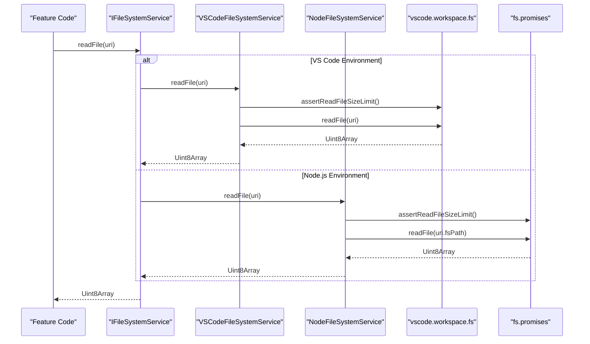
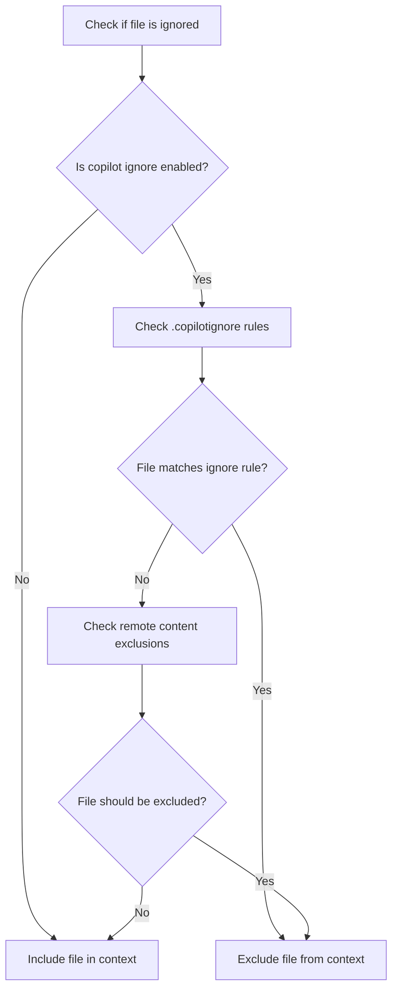

# Filesystem Service

<cite>
**Referenced Files in This Document**   
- [fileSystemService.ts](file://src/platform/filesystem/common/fileSystemService.ts)
- [fileTypes.ts](file://src/platform/filesystem/common/fileTypes.ts)
- [fileSystemServiceImpl.ts](file://src/platform/filesystem/vscode/fileSystemServiceImpl.ts)
- [fileSystemServiceImpl.ts](file://src/platform/filesystem/node/fileSystemServiceImpl.ts)
- [ignoreService.ts](file://src/platform/ignore/common/ignoreService.ts)
- [ignoreServiceImpl.ts](file://src/platform/ignore/node/ignoreServiceImpl.ts)
- [ignoreService.ts](file://src/platform/ignore/vscode-node/ignoreService.ts)
- [services.ts](file://src/extension/extension/vscode/services.ts)
- [promptWorkspaceLabels.ts](file://src/extension/context/node/resolvers/promptWorkspaceLabels.ts)
</cite>

## Table of Contents
1. [Introduction](#introduction)
2. [Architecture Overview](#architecture-overview)
3. [Core Components](#core-components)
4. [Implementation Details](#implementation-details)
5. [Integration with Ignore Service](#integration-with-ignore-service)
6. [Usage Examples](#usage-examples)
7. [Performance Considerations](#performance-considerations)
8. [Extending the Filesystem Service](#extending-the-filesystem-service)
9. [Conclusion](#conclusion)

## Introduction

The Filesystem Service in the platform layer of vscode-copilot-chat provides a unified abstraction for file operations across different execution environments. This service enables consistent file system interactions whether running in a Node.js environment or within the VS Code extension host. The service abstracts low-level file operations such as reading, writing, and traversing files, while also handling file system events and integrating with the ignore service for content exclusion rules.

The Filesystem Service is designed to support the various features of the Copilot chat extension by providing a reliable interface for accessing workspace files, configuration files, and other resources. It plays a critical role in enabling features that require file system access, such as code analysis, context gathering, and file manipulation operations.

**Section sources**
- [fileSystemService.ts](file://src/platform/filesystem/common/fileSystemService.ts#L1-L80)

## Architecture Overview

The Filesystem Service follows a modular architecture with a common interface and platform-specific implementations. This design allows the service to provide a consistent API while adapting to the capabilities and constraints of different execution environments.

```mermaid
classDiagram
class IFileSystemService {
<<interface>>
+stat(uri : Uri) : Promise~FileStat~
+readDirectory(uri : Uri) : Promise~[string, FileType][]~
+createDirectory(uri : Uri) : Promise~void~
+readFile(uri : Uri, disableLimit? : boolean) : Promise~Uint8Array~
+writeFile(uri : Uri, content : Uint8Array) : Promise~void~
+delete(uri : Uri, options? : { recursive? : boolean; useTrash? : boolean }) : Promise~void~
+rename(oldURI : Uri, newURI : Uri, options? : { overwrite? : boolean }) : Promise~void~
+copy(source : Uri, destination : Uri, options? : { overwrite? : boolean }) : Promise~void~
+isWritableFileSystem(scheme : string) : boolean | undefined
+createFileSystemWatcher(glob : string | RelativePattern) : FileSystemWatcher
}
class VSCodeFileSystemService {
-workspace : vscode.workspace
+stat(uri : URI) : Promise~vscode.FileStat~
+readDirectory(uri : URI) : Promise~[string, FileType][]~
+createDirectory(uri : URI) : Promise~void~
+readFile(uri : URI, disableLimit? : boolean) : Promise~Uint8Array~
+writeFile(uri : URI, content : Uint8Array) : Promise~void~
+delete(uri : URI, options? : { recursive? : boolean; useTrash? : boolean }) : Promise~void~
+rename(oldURI : URI, newURI : URI, options? : { overwrite? : boolean }) : Promise~void~
+copy(source : URI, destination : URI, options? : { overwrite? : boolean }) : Promise~void~
+isWritableFileSystem(scheme : string) : boolean
+createFileSystemWatcher(glob : string | vscode.RelativePattern) : vscode.FileSystemWatcher
}
class NodeFileSystemService {
-fs : fs
+stat(uri : URI) : Promise~FileStat~
+readDirectory(uri : URI) : Promise~[string, FileType][]~
+createDirectory(uri : URI) : Promise~void~
+readFile(uri : URI, disableLimit? : boolean) : Promise~Uint8Array~
+writeFile(uri : URI, content : Uint8Array) : Promise~void~
+delete(uri : URI, options? : { recursive? : boolean; useTrash? : boolean }) : Promise~void~
+rename(oldURI : URI, newURI : URI, options? : { overwrite? : boolean }) : Promise~void~
+copy(source : URI, destination : URI, options? : { overwrite? : boolean }) : Promise~void~
+isWritableFileSystem(scheme : string) : boolean | undefined
+createFileSystemWatcher(_glob : string | RelativePattern) : FileSystemWatcher
}
IFileSystemService <|.. VSCodeFileSystemService
IFileSystemService <|.. NodeFileSystemService
```

**Diagram sources**
- [fileSystemService.ts](file://src/platform/filesystem/common/fileSystemService.ts#L11-L33)
- [fileSystemServiceImpl.ts](file://src/platform/filesystem/vscode/fileSystemServiceImpl.ts#L11-L55)
- [fileSystemServiceImpl.ts](file://src/platform/filesystem/node/fileSystemServiceImpl.ts#L15-L97)

## Core Components

The Filesystem Service consists of several core components that work together to provide a comprehensive file system abstraction. The main components include the common interface definition, platform-specific implementations, and supporting utilities.

The service is built around the `IFileSystemService` interface which extends the VS Code `FileSystem` interface with additional methods and type definitions. This interface defines all the operations that can be performed on the file system, including reading, writing, creating, and deleting files and directories. It also includes methods for checking file system writability and creating file system watchers.

A key aspect of the service is the `FileType` enum which defines the different types of file system entities that can be encountered. This enum includes constants for unknown files, regular files, directories, and symbolic links, allowing the service to accurately represent the file system structure.

The service also includes utility functions for reading files as JSON with caching capabilities, which is particularly useful during simulations where the same files may be read multiple times. This caching mechanism is disabled in production but provides performance benefits during testing and simulation scenarios.

**Section sources**
- [fileSystemService.ts](file://src/platform/filesystem/common/fileSystemService.ts#L1-L80)
- [fileTypes.ts](file://src/platform/filesystem/common/fileTypes.ts#L1-L42)

## Implementation Details

The Filesystem Service provides two main implementations: one for the VS Code environment and another for Node.js environments. These implementations adapt the common interface to the specific capabilities of their respective platforms.

The VS Code implementation (`VSCodeFileSystemService`) leverages the VS Code API's `workspace.fs` object to perform file operations. This implementation directly delegates to the VS Code file system API, ensuring that file operations are consistent with the editor's behavior and respect user settings such as file encoding and line endings. The implementation also uses the VS Code `workspace.createFileSystemWatcher` method to create file system watchers that can monitor for file changes.

The Node.js implementation (`NodeFileSystemService`) uses the Node.js `fs` module to perform file operations. This implementation converts between the VS Code `Uri` type and Node.js file paths using the `fsPath` property of the URI. It also includes additional validation to ensure that only file URIs are processed, throwing an error for URIs with other schemes. The Node.js implementation provides a minimal file system watcher that returns a no-op watcher since full file system watching is not required in this context.

Both implementations include a file size limit check to prevent reading excessively large files that could impact performance or stability. The `FS_READ_MAX_FILE_SIZE` constant defines a 5MB limit, and attempts to read files larger than this limit will throw an error unless the `disableLimit` parameter is set to true. This safety mechanism helps prevent performance issues when processing large files.



**Diagram sources**
- [fileSystemServiceImpl.ts](file://src/platform/filesystem/vscode/fileSystemServiceImpl.ts#L27-L30)
- [fileSystemServiceImpl.ts](file://src/platform/filesystem/node/fileSystemServiceImpl.ts#L45-L49)
- [fileSystemService.ts](file://src/platform/filesystem/common/fileSystemService.ts#L68-L79)

## Integration with Ignore Service

The Filesystem Service integrates closely with the Ignore Service to handle content exclusion rules defined in `.gitignore`, `.ignore`, and `.copilotignore` files. This integration ensures that sensitive or irrelevant files are not included in the context provided to Copilot, maintaining privacy and improving response quality.

The Ignore Service uses the Filesystem Service to read and monitor ignore files in the workspace. When a `.copilotignore` file is detected, the service reads its contents and applies the exclusion rules when determining whether a file should be included in the context. The service also integrates with the authentication service to determine whether copilot ignore functionality is enabled for the current user.

The integration between the Filesystem Service and Ignore Service is demonstrated in the `promptWorkspaceLabels` component, which uses both services to gather context about the workspace. The component first checks if a file is ignored using the Ignore Service before attempting to read it with the Filesystem Service. This prevents unnecessary file operations on files that should be excluded from consideration.



**Diagram sources**
- [ignoreServiceImpl.ts](file://src/platform/ignore/node/ignoreServiceImpl.ts#L88-L95)
- [promptWorkspaceLabels.ts](file://src/extension/context/node/resolvers/promptWorkspaceLabels.ts#L128-L134)

## Usage Examples

The Filesystem Service is used throughout the vscode-copilot-chat extension to perform various file operations. One common usage pattern is in the `promptWorkspaceLabels` component, which analyzes workspace files to determine the programming languages and frameworks in use. This component uses the Filesystem Service to check for the existence of specific files like `package.json`, `tsconfig.json`, and `requirements.txt`, and reads their contents to extract additional context.

Another example is in the memory tool, which allows users to explore the file system within the chat interface. This tool uses the Filesystem Service to list directory contents, read file contents, and navigate the file system hierarchy. It demonstrates how the service can be used to build interactive features that require file system access.

The service is also used in testing and simulation scenarios, where mock implementations are provided to simulate file system operations without accessing the actual file system. The `MockFileSystemService` class allows tests to define expected file contents and behaviors, enabling comprehensive testing of features that depend on file system operations.

```mermaid
flowchart TD
A[Feature Request] --> B{Is file operation needed?}
B --> |Yes| C[Use IFileSystemService]
C --> D[Check file existence with stat()]
D --> E{File exists?}
E --> |No| F[Handle missing file]
E --> |Yes| G{Is directory?}
G --> |Yes| H[Read directory contents]
G --> |No| I[Read file content]
I --> J{Large file?}
J --> |Yes| K[Use disableLimit flag with caution]
J --> |No| L[Process file content]
H --> M[Filter ignored files]
M --> N[Process directory contents]
```

**Diagram sources**
- [promptWorkspaceLabels.ts](file://src/extension/context/node/resolvers/promptWorkspaceLabels.ts#L133-L138)
- [memoryTool.tsx](file://src/extension/tools/node/memoryTool.tsx#L143-L168)

## Performance Considerations

The Filesystem Service includes several performance optimizations and safeguards to ensure efficient operation, particularly when dealing with large files or high-frequency operations. The most significant performance consideration is the 5MB file size limit enforced by the `assertReadFileSizeLimit` function. This limit prevents the service from attempting to read extremely large files that could consume excessive memory or cause performance degradation.

For operations that need to read large files, the service provides the `disableLimit` parameter, but this should be used with caution as indicated by the warning in the documentation. When reading large files, alternative approaches such as streaming or partial reading should be considered to minimize memory usage.

The service also includes a JSON reading utility with caching capabilities that can improve performance during simulations where the same files are read multiple times. This caching mechanism is disabled in production but provides significant performance benefits during testing scenarios.

When implementing features that perform multiple file operations, it's recommended to batch operations where possible and use asynchronous methods to avoid blocking the main thread. The service's promise-based API facilitates this by allowing operations to be performed concurrently.

**Section sources**
- [fileSystemService.ts](file://src/platform/filesystem/common/fileSystemService.ts#L66-L79)
- [fileSystemServiceImpl.ts](file://src/platform/filesystem/node/fileSystemServiceImpl.ts#L109-L134)

## Extending the Filesystem Service

To implement new filesystem functionality following the established patterns, developers should adhere to the service's interface and implementation guidelines. When adding new features, it's important to consider both the VS Code and Node.js environments, ensuring that the functionality works correctly in both contexts.

For new file operations, the first step is to extend the `IFileSystemService` interface with the new method signature. Then, both the VS Code and Node.js implementations should be updated to provide the functionality. When implementing the methods, it's important to maintain consistency in error handling and follow the existing patterns for parameter validation and type checking.

When adding functionality that requires monitoring file system changes, developers should consider using the `createFileSystemWatcher` method, but be aware that the Node.js implementation currently provides a no-op watcher. For features that require actual file system watching in Node.js environments, alternative approaches may be necessary.

For testing new functionality, the `MockFileSystemService` class can be used to simulate file system operations and verify that the new methods behave as expected. Tests should cover both successful operations and error conditions to ensure robustness.

**Section sources**
- [fileSystemService.ts](file://src/platform/filesystem/common/fileSystemService.ts#L11-L33)
- [mockFileSystemService.ts](file://src/platform/filesystem/node/test/mockFileSystemService.ts#L11-L31)

## Conclusion

The Filesystem Service in vscode-copilot-chat provides a robust and flexible abstraction for file operations across different execution environments. By defining a common interface and providing platform-specific implementations, the service enables consistent file system interactions while adapting to the capabilities of each environment.

The service's integration with the Ignore Service ensures that content exclusion rules are respected, maintaining privacy and improving the quality of responses by excluding irrelevant files from consideration. The performance safeguards, such as the file size limit, help prevent issues that could arise from processing large files.

The service is used throughout the extension to support various features that require file system access, from context gathering to interactive file exploration. Its design allows for easy extension and testing, making it a solid foundation for building features that interact with the file system.

By following the established patterns and guidelines, developers can extend the Filesystem Service to support new functionality while maintaining consistency and reliability across the codebase.