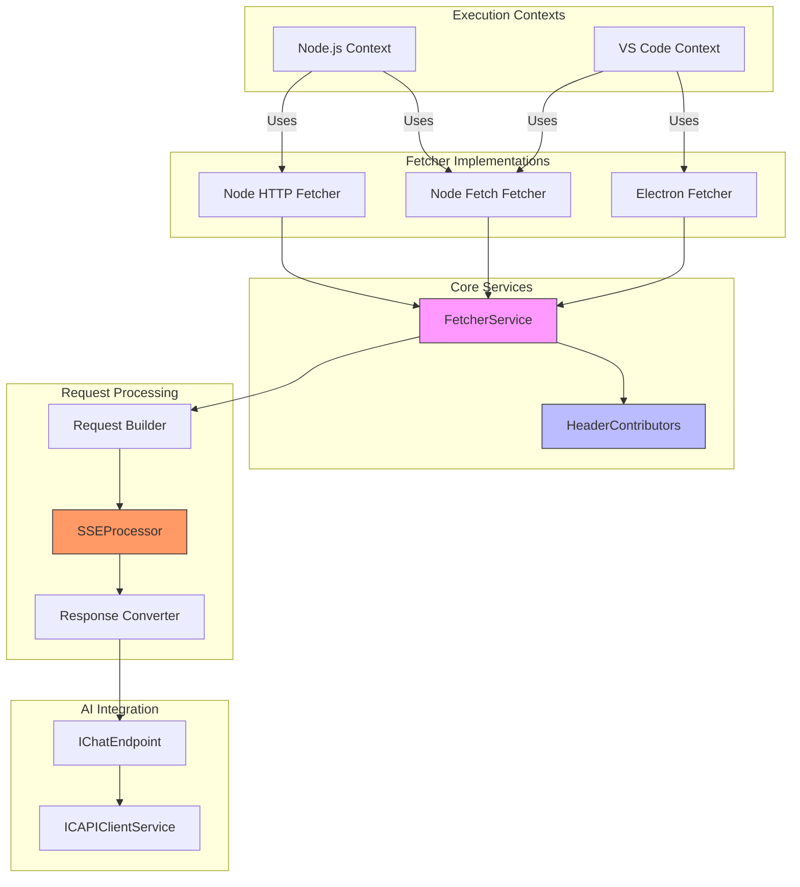
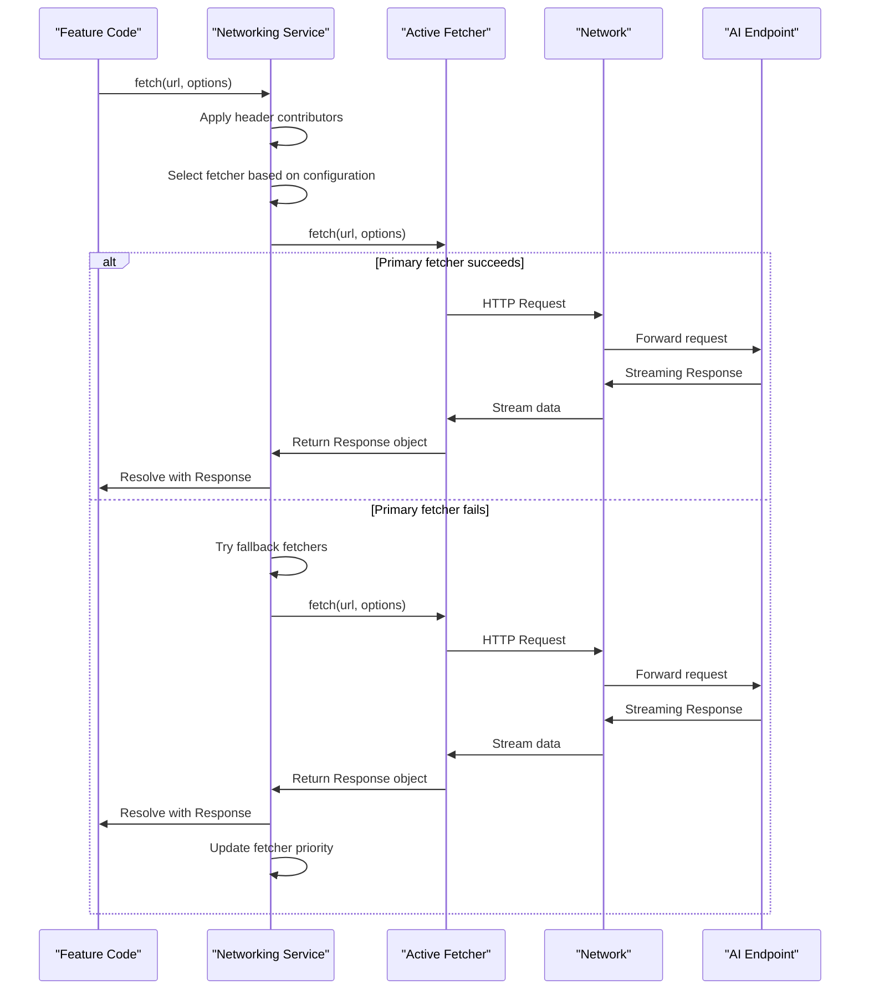
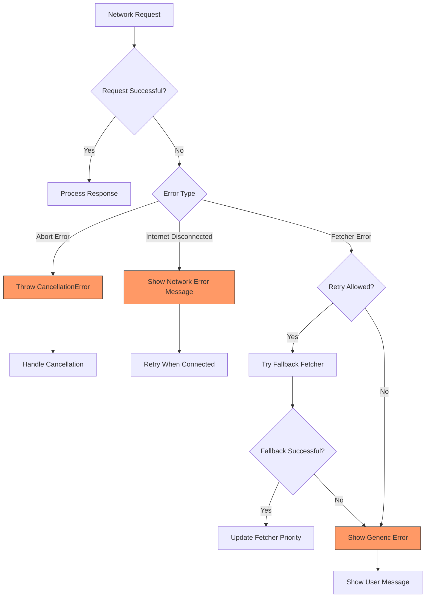
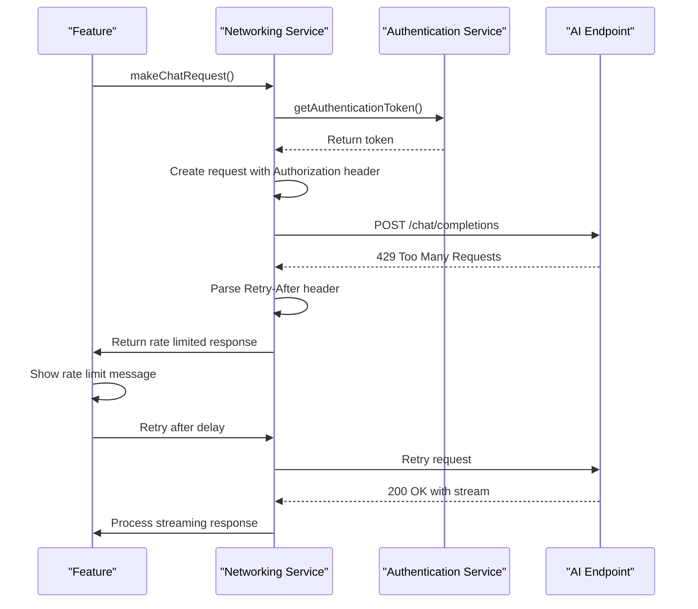
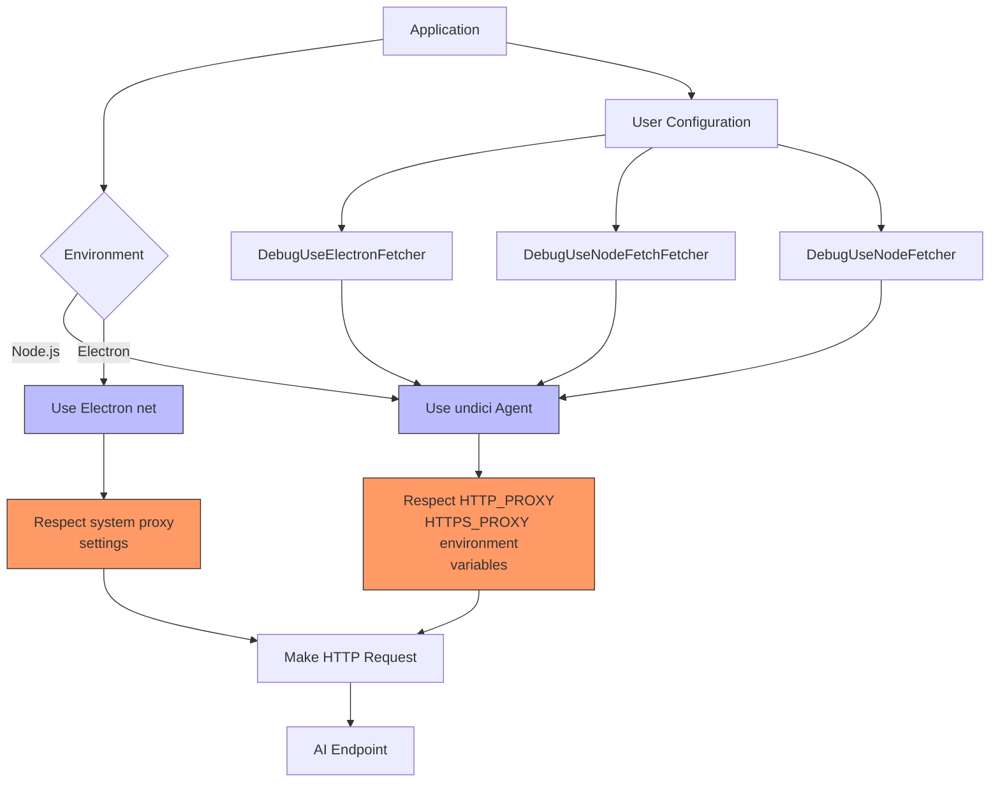

# Networking Service

<cite>
**Referenced Files in This Document**   
- [fetcherService.ts](file://src/platform/networking/common/fetcherService.ts)
- [fetch.ts](file://src/platform/networking/common/fetch.ts)
- [networking.ts](file://src/platform/networking/common/networking.ts)
- [nodeFetcher.ts](file://src/platform/networking/node/nodeFetcher.ts)
- [stream.ts](file://src/platform/networking/node/stream.ts)
- [baseFetchFetcher.ts](file://src/platform/networking/node/baseFetchFetcher.ts)
- [fetcherFallback.ts](file://src/platform/networking/node/fetcherFallback.ts)
- [fetcherServiceImpl.ts](file://src/platform/networking/vscode-node/fetcherServiceImpl.ts)
- [nodeFetchFetcher.ts](file://src/platform/networking/node/nodeFetchFetcher.ts)
- [electronFetcher.ts](file://src/platform/networking/vscode-node/electronFetcher.ts)
- [openai.ts](file://src/platform/networking/common/openai.ts)
- [responseConvert.ts](file://src/platform/networking/common/responseConvert.ts)
</cite>

## Table of Contents
1. [Introduction](#introduction)
2. [Architecture Overview](#architecture-overview)
3. [Core Components](#core-components)
4. [Request Fetching Mechanism](#request-fetching-mechanism)
5. [Stream Processing](#stream-processing)
6. [Error Handling](#error-handling)
7. [AI Endpoint Integration](#ai-endpoint-integration)
8. [Authentication and Rate Limiting](#authentication-and-rate-limiting)
9. [Proxy Support and Network Configuration](#proxy-support-and-network-configuration)
10. [Implementation Guidelines](#implementation-guidelines)

## Introduction

The Networking Service in the vscode-copilot-chat platform layer provides a unified interface for HTTP requests and streaming responses across different execution environments. This service abstracts the complexities of network communication, enabling consistent API interactions whether running in node or VS Code contexts. The architecture is designed to support both traditional HTTP requests and streaming responses from AI endpoints, with comprehensive error handling, retry mechanisms, and environment-specific optimizations.

The service implements a pluggable fetcher architecture that supports multiple underlying HTTP implementations, allowing the system to adapt to different runtime environments and network conditions. It provides a consistent API surface for features to make network requests while handling low-level concerns such as connection management, authentication, and response processing.

**Section sources**
- [fetcherService.ts](file://src/platform/networking/common/fetcherService.ts#L1-L99)
- [networking.ts](file://src/platform/networking/common/networking.ts#L1-L478)

## Architecture Overview

The Networking Service follows a layered architecture with clear separation of concerns. At its core is the `IFetcherService` interface which defines the contract for network operations, implemented by different fetcher strategies based on the execution environment.



**Diagram sources**
- [fetcherService.ts](file://src/platform/networking/common/fetcherService.ts#L8-L21)
- [networking.ts](file://src/platform/networking/common/networking.ts#L29-L39)
- [fetcherServiceImpl.ts](file://src/platform/networking/vscode-node/fetcherServiceImpl.ts#L18-L25)
- [stream.ts](file://src/platform/networking/node/stream.ts#L195-L235)

## Core Components

The Networking Service consists of several key components that work together to provide a robust network communication layer. The `IFetcherService` interface defines the core contract for network operations, including request fetching, pagination support, and lifecycle management. This interface is implemented by various fetcher classes that adapt to different execution environments.

The service supports multiple fetcher implementations, including Electron's net.fetch, node-fetch, and native Node.js HTTP modules. These implementations are managed through a fallback mechanism that automatically switches between fetchers based on reliability and performance. The `FetcherService` class orchestrates these implementations, providing a unified interface while handling environment-specific considerations.

Request processing is enhanced through the `HeaderContributors` system, which allows various components to contribute headers to outgoing requests. This enables features like authentication, telemetry, and feature identification to be added transparently to network requests without requiring changes to the calling code.

**Section sources**
- [fetcherService.ts](file://src/platform/networking/common/fetcherService.ts#L8-L21)
- [networking.ts](file://src/platform/networking/common/networking.ts#L41-L478)
- [fetcherServiceImpl.ts](file://src/platform/networking/vscode-node/fetcherServiceImpl.ts#L18-L152)

## Request Fetching Mechanism

The request fetching mechanism in the Networking Service is designed to be flexible and resilient across different environments. The core interface `IFetcher` defines the contract for HTTP operations, with implementations optimized for specific runtime contexts. The service supports both GET and POST requests with configurable timeouts, headers, and body content.



**Diagram sources**
- [fetcherService.ts](file://src/platform/networking/common/fetcherService.ts#L13-L14)
- [networking.ts](file://src/platform/networking/common/networking.ts#L30-L32)
- [fetcherFallback.ts](file://src/platform/networking/node/fetcherFallback.ts#L20-L85)
- [baseFetchFetcher.ts](file://src/platform/networking/node/baseFetchFetcher.ts#L24-L56)

The service implements a sophisticated fetcher selection strategy that considers user configuration, experimental flags, and runtime environment. When multiple fetchers are available, the service uses a fallback mechanism that automatically promotes more reliable fetchers to primary status. This ensures optimal performance while maintaining resilience in the face of network issues or implementation bugs.

Request options are standardized through the `FetchOptions` interface, which supports common HTTP parameters like headers, body content, timeout values, and signal-based cancellation. The service automatically adds essential headers like User-Agent and X-VSCode-User-Agent-Library-Version, while allowing additional headers to be contributed through the `HeaderContributor` system.

## Stream Processing

The Networking Service provides comprehensive support for streaming responses from AI endpoints through the `SSEProcessor` class. This component handles Server-Sent Events (SSE) streams from CAPI (Copilot API) endpoints, parsing the event stream and yielding completed responses as they become available.

```mermaid
flowchart TD
Start([Start SSE Processing]) --> Initialize["Initialize SSEProcessor<br>with response stream"]
Initialize --> ReadChunk["Read data chunk from stream"]
ReadChunk --> SplitData["Split chunk by newlines<br>Handle partial lines"]
SplitData --> ProcessLines["Process each complete line"]
ProcessLines --> CheckComment{"Line starts with ':'?"}
CheckComment --> |Yes| SkipLine["Skip comment line"]
CheckComment --> |No| ParseJSON["Parse JSON data"]
ParseJSON --> HandleDone{"Data is '[DONE]'?"}
HandleDone --> |Yes| FinishSolutions["Yield remaining solutions<br>with ClientDone reason"]
HandleDone --> |No| ProcessChoices["Process choices array"]
ProcessChoices --> UpdateSolution["Update solution text<br>and metadata"]
UpdateSolution --> CheckFinish{"Choice has finish_reason?"}
CheckFinish --> |Yes| YieldCompletion["Yield FinishedCompletion<br>with server reason"]
CheckFinish --> |No| CheckCallback{"Check finishedCb<br>for early termination"]
CheckCallback --> |Should finish| YieldCompletion
CheckCallback --> |Continue| ReadChunk
YieldCompletion --> CheckCancel["Check cancellation token"]
CheckCancel --> |Cancelled| End([End processing])
CheckCancel --> |Continue| ReadChunk
FinishSolutions --> End
SkipLine --> ReadChunk
End([End processing])
```

**Diagram sources**
- [stream.ts](file://src/platform/networking/node/stream.ts#L195-L308)
- [fetch.ts](file://src/platform/networking/common/fetch.ts#L121-L125)
- [openai.ts](file://src/platform/networking/common/openai.ts#L146-L162)

The stream processor handles the complexities of SSE parsing, including comment lines (which start with ':'), partial JSON objects, and the '[DONE]' termination marker. It maintains state for each completion choice, aggregating text chunks and metadata until a completion is finished. The processor supports early termination through the `finishedCb` callback, allowing consumers to stop processing when sufficient content has been received.

Response parts are structured using the `ResponsePart` union type, which includes various part kinds such as content deltas, tool calls, annotations, and errors. The `toResponseDelta` and `fromResponseDelta` functions provide conversion between these structured parts and the simpler `IResponseDelta` interface used by higher-level components.

## Error Handling

The Networking Service implements a comprehensive error handling strategy that distinguishes between different types of failures and provides appropriate recovery mechanisms. The service categorizes errors into abort errors, internet disconnected errors, and general fetcher errors, each with specific handling logic.



**Diagram sources**
- [fetcherService.ts](file://src/platform/networking/common/fetcherService.ts#L16-L18)
- [nodeFetcher.ts](file://src/platform/networking/node/nodeFetcher.ts#L125-L136)
- [electronFetcher.ts](file://src/platform/networking/vscode-node/electronFetcher.ts#L33-L38)
- [fetcherFallback.ts](file://src/platform/networking/node/fetcherFallback.ts#L20-L65)

The service uses a fallback mechanism for certain network errors, automatically retrying requests with alternative fetcher implementations when transient failures occur. Errors like 'ECONNRESET', 'ETIMEDOUT', and 'ERR_HTTP2_INVALID_SESSION' trigger a disconnect-all operation followed by a retry with the current fetcher. This helps recover from temporary network issues and connection state problems.

For user-facing errors, the service provides descriptive messages that guide users toward potential solutions. The `getUserMessageForFetcherError` method returns messages that suggest checking firewall rules and network connections, helping users troubleshoot common issues. The service also integrates with telemetry to report error patterns and fetcher reliability, enabling data-driven improvements to the networking layer.

## AI Endpoint Integration

The Networking Service provides specialized integration with AI endpoints for chat and completions through the `IChatEndpoint` interface. This interface extends the basic `IEndpoint` contract with methods specifically designed for conversational AI interactions, including streaming response processing and request creation.

```mermaid
classDiagram
class IEndpoint {
<<interface>>
+urlOrRequestMetadata : string | RequestMetadata
+modelMaxPromptTokens : number
+name : string
+version : string
+family : string
+tokenizer : TokenizerType
+acquireTokenizer() : ITokenizer
+getExtraHeaders?() : Record[string, string]
+getEndpointFetchOptions?() : IEndpointFetchOptions
+interceptBody?(body : IEndpointBody) : void
}
class IChatEndpoint {
<<interface>>
+maxOutputTokens : number
+model : string
+apiType? : string
+supportsThinkingContentInHistory? : boolean
+supportsToolCalls : boolean
+supportsVision : boolean
+supportsPrediction : boolean
+supportedEditTools? : readonly EndpointEditToolName[]
+showInModelPicker : boolean
+isPremium? : boolean
+degradationReason? : string
+multiplier? : number
+restrictedToSkus? : string[]
+isDefault : boolean
+isFallback : boolean
+customModel? : CustomModel
+isExtensionContributed? : boolean
+policy : 'enabled' | { terms : string }
+processResponseFromChatEndpoint(telemetryService, logService, response, expectedNumChoices, finishCallback, telemetryData, cancellationToken) : Promise<AsyncIterableObject<ChatCompletion>>
+acceptChatPolicy() : Promise<boolean>
+makeChatRequest(debugName, messages, finishedCb, token, location, source, requestOptions, userInitiatedRequest, telemetryProperties) : Promise<ChatResponse>
+makeChatRequest2(options, token) : Promise<ChatResponse>
+createRequestBody(options) : IEndpointBody
+cloneWithTokenOverride(modelMaxPromptTokens) : IChatEndpoint
}
class IEmbeddingsEndpoint {
<<interface>>
+maxBatchSize : number
}
IEndpoint <|-- IChatEndpoint
IEndpoint <|-- IEmbeddingsEndpoint
class IMakeChatRequestOptions {
+debugName : string
+messages : Raw.ChatMessage[]
+ignoreStatefulMarker? : boolean
+finishedCb : FinishedCallback | undefined
+location : ChatLocation
+source? : Source
+requestOptions? : Omit<OptionalChatRequestParams, 'n'>
+userInitiatedRequest? : boolean
+telemetryProperties? : IChatRequestTelemetryProperties
+enableRetryOnFilter? : boolean
+enableRetryOnError? : boolean
+useFetcher? : FetcherId
}
class ICreateEndpointBodyOptions {
+requestId : string
+postOptions : OptionalChatRequestParams
}
class IEndpointBody {
+tools? : (OpenAiFunctionTool | OpenAiResponsesFunctionTool | AnthropicMessagesTool)[]
+model? : string
+previous_response_id? : string
+max_tokens? : number
+max_output_tokens? : number
+max_completion_tokens? : number
+temperature? : number
+top_p? : number
+stream? : boolean
+prediction? : Prediction
+messages? : any[]
+n? : number
+reasoning? : { effort? : string; summary? : string }
+tool_choice? : OptionalChatRequestParams['tool_choice'] | { type : 'function'; name : string }
+top_logprobs? : number
+intent? : boolean
+intent_threshold? : number
+state? : 'enabled'
+snippy? : { enabled : boolean }
+stream_options? : { include_usage? : boolean }
+prompt? : string
+dimensions? : number
+embed? : boolean
+qos? : any
+content? : string
+path? : string
+local_hashes? : string[]
+language_id? : number
+query? : string
+scopingQuery? : string
+limit? : number
+similarity? : number
+scoping_query? : string
+input? : readonly any[]
+truncation? : 'auto' | 'disabled'
+include? : ['reasoning.encrypted_content']
+store? : boolean
+text? : { verbosity? : 'low' | 'medium' | 'high' }
+thinking? : { type : 'enabled' | 'disabled'; budget_tokens? : number }
+thinking_budget? : number
}
IChatEndpoint --> IMakeChatRequestOptions
IChatEndpoint --> ICreateEndpointBodyOptions
IChatEndpoint --> IEndpointBody
```

**Diagram sources**
- [networking.ts](file://src/platform/networking/common/networking.ts#L123-L269)
- [fetch.ts](file://src/platform/networking/common/fetch.ts#L304-L353)
- [openai.ts](file://src/platform/networking/common/openai.ts#L99-L171)

The integration supports various AI capabilities including tool calls, function calling, content filtering, and thinking processes. The `processResponseFromChatEndpoint` method handles the parsing of streaming responses, extracting completion text, tool calls, annotations, and other metadata. The service supports both the standard OpenAI-style chat completions API and specialized CAPI extensions for enhanced functionality.

Request creation is standardized through the `createCapiRequestBody` function, which converts raw chat messages into the format expected by the CAPI endpoint. This function handles message conversion, applies request options, and ensures proper formatting of the request body. The integration also supports advanced features like prediction, reasoning, and custom model configurations.

## Authentication and Rate Limiting

The Networking Service handles authentication for AI endpoints through bearer token authorization, with tokens provided via the `secretKey` parameter in request functions. The service integrates with the platform's authentication system to obtain valid tokens and includes them in the Authorization header of outgoing requests.



**Diagram sources**
- [networking.ts](file://src/platform/networking/common/networking.ts#L317-L324)
- [fetcherService.ts](file://src/platform/networking/common/fetcherService.ts#L53-L64)
- [openai.ts](file://src/platform/networking/common/openai.ts#L83-L87)

While the provided code does not explicitly implement rate limiting logic, the service is designed to handle rate limit responses from the server. When a 429 Too Many Requests response is received, the calling feature is responsible for implementing appropriate retry logic, potentially using the Retry-After header if provided. The service passes through HTTP status codes and headers, allowing higher-level components to implement rate limiting strategies based on server responses.

Authentication is integrated with the request lifecycle through the `postRequest` and `getRequest` functions, which automatically include the Authorization header with the provided secret key. The service also includes interaction type and request ID headers that help the server identify the source of requests and apply appropriate rate limits and quotas.

## Proxy Support and Network Configuration

The Networking Service supports proxy configurations through the underlying fetcher implementations and Node.js runtime settings. The service automatically respects system proxy settings and environment variables like HTTP_PROXY and HTTPS_PROXY when making network requests.



**Diagram sources**
- [nodeFetchFetcher.ts](file://src/platform/networking/node/nodeFetchFetcher.ts#L42-L44)
- [electronFetcher.ts](file://src/platform/networking/vscode-node/electronFetcher.ts#L41-L47)
- [networking.ts](file://src/platform/networking/common/networking.ts#L11-L15)

The service provides configuration options that allow users and developers to control which fetcher implementation is used. Settings like `DebugUseElectronFetcher`, `DebugUseNodeFetchFetcher`, and `DebugUseNodeFetcher` enable explicit selection of fetcher strategies, which can be useful for troubleshooting network issues or testing specific implementations.

Network configuration is managed through the `IConfigurationService` and experimentation system, allowing fetcher selection to be influenced by both user preferences and experimental flags. The `getShadowedConfig` function implements a priority system where experimentation settings can override user configuration, enabling controlled rollouts of new networking behaviors.

## Implementation Guidelines

When implementing new network requests in the vscode-copilot-chat platform, follow these best practices to ensure reliability, security, and consistency with the existing architecture:

1. **Use the IFetcherService interface**: Always use the `IFetcherService` rather than directly importing fetcher implementations. This ensures your code works across different execution contexts and benefits from the service's fallback and error handling mechanisms.

2. **Handle streaming responses properly**: For AI endpoints, use the streaming interfaces and provide appropriate `finishedCb` callbacks to handle incremental content. Process `ResponsePart` objects to handle different types of response content like tool calls, annotations, and errors.

3. **Implement proper error handling**: Catch and handle network errors appropriately, distinguishing between abort errors, connection issues, and server errors. Use the provided error classification methods to determine the appropriate recovery strategy.

4. **Respect cancellation tokens**: Always honor cancellation tokens passed to network operations, allowing users to cancel long-running requests. This is particularly important for streaming responses that may continue for extended periods.

5. **Follow security practices**: Never log sensitive information like authentication tokens or request bodies. Use the telemetry system's secure logging capabilities when reporting errors that may contain user data.

6. **Use appropriate fetcher selection**: In most cases, allow the service to select the optimal fetcher. Only specify a particular fetcher using the `useFetcher` option when necessary for debugging or specific requirements.

7. **Implement retry logic carefully**: For critical operations, implement retry logic with appropriate backoff strategies. However, avoid aggressive retries that could exacerbate server load or rate limiting issues.

8. **Monitor performance**: Use the telemetry system to track request performance and identify potential bottlenecks. Report metrics like request duration, response size, and error rates to help diagnose issues.

9. **Test across environments**: Verify that your network requests work correctly in both node and VS Code execution contexts, as the underlying fetcher implementations may behave differently.

10. **Follow pagination patterns**: For endpoints that support pagination, use the `fetchWithPagination` method rather than implementing custom pagination logic. This ensures consistent behavior and error handling across the codebase.

**Section sources**
- [fetcherService.ts](file://src/platform/networking/common/fetcherService.ts#L13-L20)
- [networking.ts](file://src/platform/networking/common/networking.ts#L384-L411)
- [stream.ts](file://src/platform/networking/node/stream.ts#L252-L283)
- [fetcherFallback.ts](file://src/platform/networking/node/fetcherFallback.ts#L20-L85)