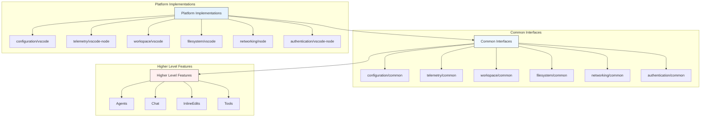
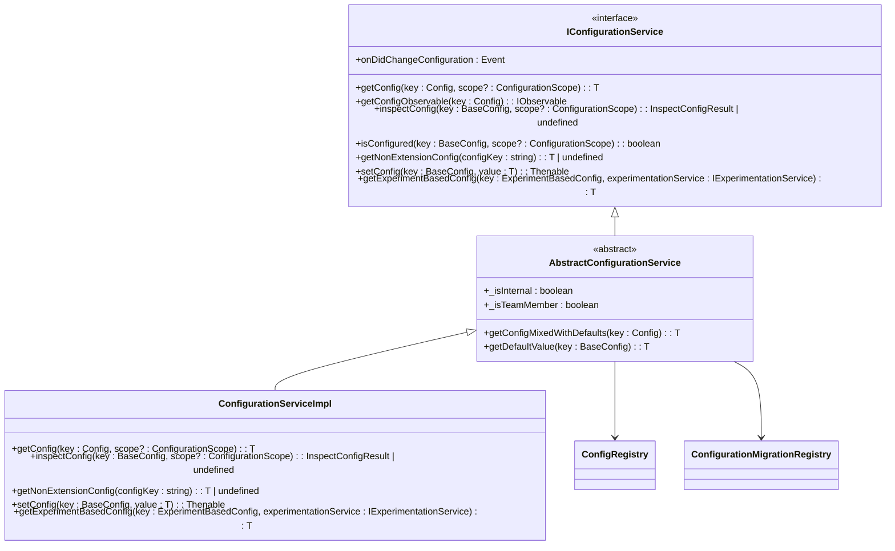
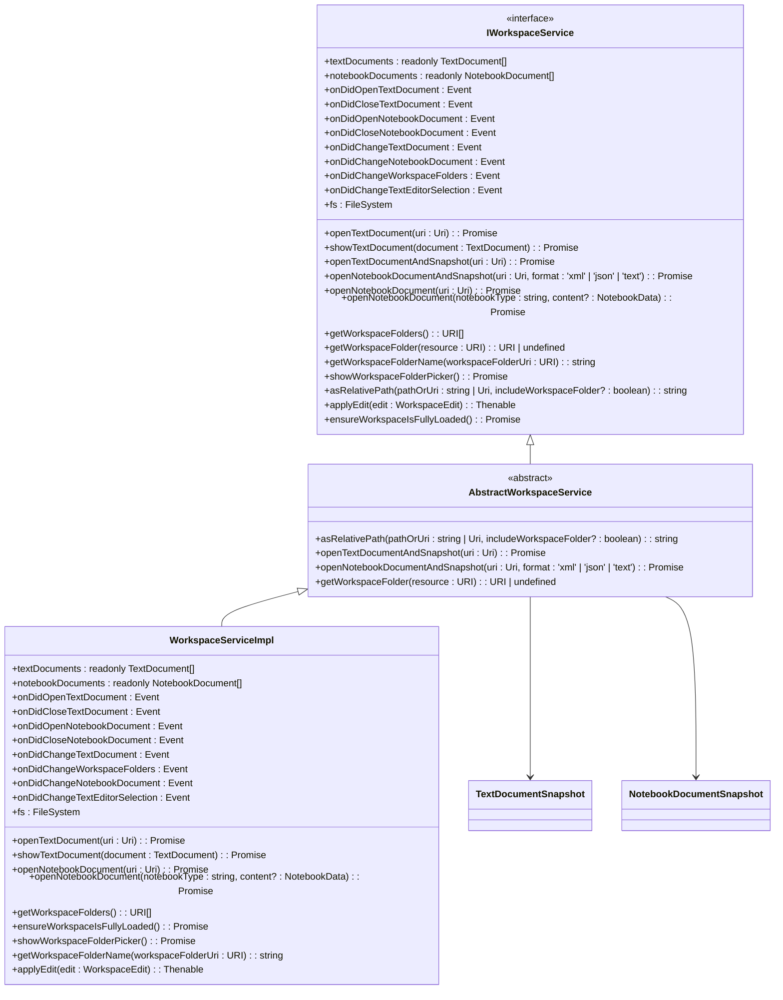
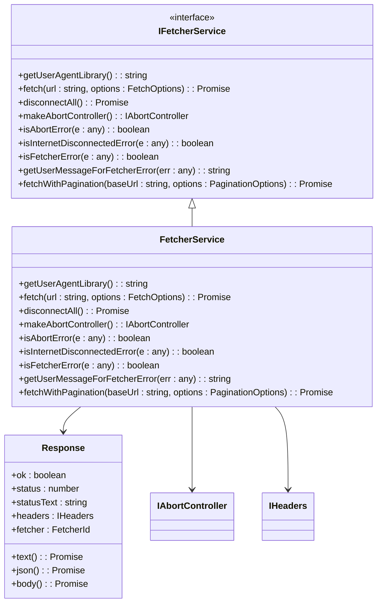
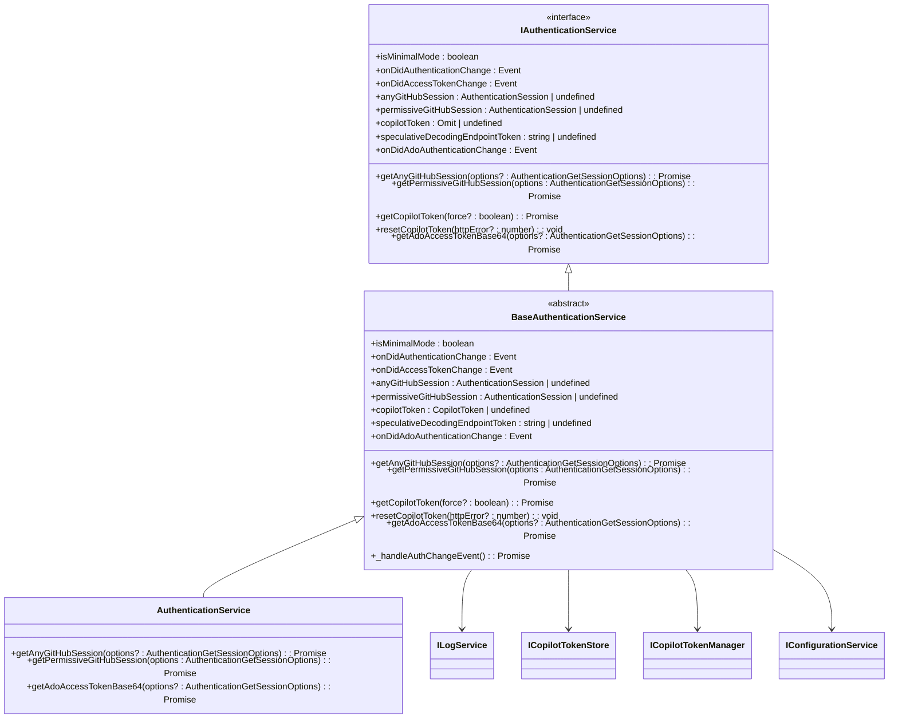

# Platform Layer

<cite>
**Referenced Files in This Document**   
- [configurationService.ts](file://src/platform/configuration/common/configurationService.ts)
- [ghTelemetryService.ts](file://src/platform/telemetry/common/ghTelemetryService.ts)
- [workspaceService.ts](file://src/platform/workspace/common/workspaceService.ts)
- [filesystemService.ts](file://src/platform/filesystem/common/filesystemService.ts)
- [fetcherService.ts](file://src/platform/networking/common/fetcherService.ts)
- [authentication.ts](file://src/platform/authentication/common/authentication.ts)
- [configurationServiceImpl.ts](file://src/platform/configuration/vscode/configurationServiceImpl.ts)
- [telemetryServiceImpl.ts](file://src/platform/telemetry/vscode-node/telemetryServiceImpl.ts)
</cite>

## Table of Contents
1. [Introduction](#introduction)
2. [Architecture Overview](#architecture-overview)
3. [Core Platform Services](#core-platform-services)
4. [Abstraction Patterns](#abstraction-patterns)
5. [Implementation Examples](#implementation-examples)
6. [Consuming Platform Services](#consuming-platform-services)
7. [Conclusion](#conclusion)

## Introduction

The platform layer in the vscode-copilot-chat extension serves as a critical abstraction boundary between the extension's core functionality and the underlying VS Code API and execution environments. This layer provides a unified interface for accessing platform-specific capabilities while abstracting away the differences between various execution contexts such as standard VS Code, VS Code for the Web, and other hosting environments.

The platform layer follows a deliberate architectural pattern of defining common interfaces in shared modules, with platform-specific implementations provided in dedicated directories. This approach enables the extension to maintain consistent behavior across different environments while allowing for optimized implementations that leverage the specific capabilities of each execution context.

This documentation details the architecture of key platform services including configuration, telemetry, workspace, filesystem, and networking, explaining how they abstract VS Code API interactions and provide cross-platform compatibility.

## Architecture Overview

The platform layer follows a clean separation of concerns with a well-defined directory structure that organizes services by functionality. Each service follows a consistent pattern of having common interfaces defined in shared modules, with platform-specific implementations provided for different execution environments.



**Diagram sources**
- [configurationService.ts](file://src/platform/configuration/common/configurationService.ts)
- [ghTelemetryService.ts](file://src/platform/telemetry/common/ghTelemetryService.ts)
- [workspaceService.ts](file://src/platform/workspace/common/workspaceService.ts)

## Core Platform Services

### Configuration Service

The configuration service provides a unified interface for accessing extension settings while abstracting the underlying VS Code configuration system. It defines a common interface `IConfigurationService` that exposes methods for getting, setting, and observing configuration values.

The service handles both simple configuration values and experiment-based configurations that can be controlled through feature flags. It also manages configuration migrations, allowing for seamless transitions when configuration keys are renamed or restructured.



**Diagram sources**
- [configurationService.ts](file://src/platform/configuration/common/configurationService.ts)
- [configurationServiceImpl.ts](file://src/platform/configuration/vscode/configurationServiceImpl.ts)

**Section sources**
- [configurationService.ts](file://src/platform/configuration/common/configurationService.ts)

### Telemetry Service

The telemetry service abstracts the collection and transmission of usage data and errors, providing a consistent interface regardless of the underlying telemetry infrastructure. It supports both standard and enhanced telemetry, with appropriate handling for user privacy preferences.

The service implements a dual-reporter pattern, allowing for separate handling of standard telemetry (which may be sent even when users have opted out of enhanced telemetry) and enhanced telemetry (which contains more detailed information and is only sent when users have explicitly opted in).

```mermaid
classDiagram
class IGHTelemetryService {
<<interface>>
+sendTelemetry(name : string, telemetryData? : TelemetryData) : Promise<void>
+sendErrorTelemetry(name : string, telemetryData? : TelemetryData) : Promise<void>
+sendEnhancedTelemetry(name : string, telemetryData? : TelemetryData) : Promise<void>
+sendEnhancedErrorTelemetry(name : string, telemetryData? : TelemetryData) : Promise<void>
+sendExpProblemTelemetry(telemetryProperties : { reason : string }) : Promise<void>
+sendExceptionTelemetry(maybeError : unknown, origin : string) : Promise<void>
+deactivate() : Promise<void>
}
class GHTelemetryService {
+sendTelemetry(name : string, telemetryData? : TelemetryData) : Promise<void>
+sendErrorTelemetry(name : string, telemetryData? : TelemetryData) : Promise<void>
+sendEnhancedTelemetry(name : string, telemetryData? : TelemetryData) : Promise<void>
+sendEnhancedErrorTelemetry(name : string, telemetryData? : TelemetryData) : Promise<void>
+sendExpProblemTelemetry(telemetryProperties : { reason : string }) : Promise<void>
+sendExceptionTelemetry(maybeError : unknown, origin : string) : Promise<void>
+deactivate() : Promise<void>
+setSecureReporter(reporterSecure : TelemetrySender | undefined) : void
+setReporter(reporter : TelemetrySender | undefined) : void
}
class TelemetryServiceImpl {
+activate(context : ExtensionContext) : Promise<void>
+deactivate() : Promise<void>
}
IGHTelemetryService <|-- GHTelemetryService
GHTelemetryService --> TelemetryReporters
GHTelemetryService --> TelemetryData
GHTelemetryService --> IConfigurationService
GHTelemetryService --> IEnvService
TelemetryServiceImpl --> GHTelemetryService
```

**Diagram sources**
- [ghTelemetryService.ts](file://src/platform/telemetry/common/ghTelemetryService.ts)
- [telemetryServiceImpl.ts](file://src/platform/telemetry/vscode-node/telemetryServiceImpl.ts)

**Section sources**
- [ghTelemetryService.ts](file://src/platform/telemetry/common/ghTelemetryService.ts)

### Workspace Service

The workspace service provides an abstraction layer for interacting with the user's workspace, including text documents, notebook documents, and workspace folders. It encapsulates the VS Code workspace API, providing a consistent interface for accessing workspace resources regardless of the execution environment.

The service handles both regular text documents and notebook documents, providing methods for opening, reading, and manipulating these resources. It also provides utilities for working with workspace-relative paths and managing workspace events.



**Section sources**
- [workspaceService.ts](file://src/platform/workspace/common/workspaceService.ts)

### Filesystem Service

The filesystem service provides a unified interface for file system operations, abstracting the underlying VS Code file system API. It defines the `IFileSystemService` interface that extends the VS Code `FileSystem` interface with additional methods and constraints.

The service includes safeguards such as file size limits to prevent excessive memory usage when reading large files. It also provides utility functions for JSON operations with caching capabilities, which is particularly useful in testing and simulation scenarios.

```mermaid
classDiagram
class IFileSystemService {
<<interface>>
+stat(uri : Uri) : Promise<FileStat>
+readDirectory(uri : Uri) : Promise<[string, FileType][]>
+createDirectory(uri : Uri) : Promise<void>
+readFile(uri : Uri, disableLimit? : boolean) : Promise<Uint8Array>
+writeFile(uri : Uri, content : Uint8Array) : Promise<void>
+delete(uri : Uri, options? : { recursive? : boolean; useTrash? : boolean }) : Promise<void>
+rename(oldURI : Uri, newURI : Uri, options? : { overwrite? : boolean }) : Promise<void>
+copy(source : Uri, destination : Uri, options? : { overwrite? : boolean }) : Promise<void>
+isWritableFileSystem(scheme : string) : boolean | undefined
+createFileSystemWatcher(glob : string | RelativePattern) : FileSystemWatcher
}
class FileSystemServiceImpl {
+stat(uri : Uri) : Promise<FileStat>
+readDirectory(uri : Uri) : Promise<[string, FileType][]>
+createDirectory(uri : Uri) : Promise<void>
+readFile(uri : Uri, disableLimit? : boolean) : Promise<Uint8Array>
+writeFile(uri : Uri, content : Uint8Array) : Promise<void>
+delete(uri : Uri, options? : { recursive? : boolean; useTrash? : boolean }) : Promise<void>
+rename(oldURI : Uri, newURI : Uri, options? : { overwrite? : boolean }) : Promise<void>
+copy(source : Uri, destination : Uri, options? : { overwrite? : boolean }) : Promise<void>
+isWritableFileSystem(scheme : string) : boolean | undefined
+createFileSystemWatcher(glob : string | RelativePattern) : FileSystemWatcher
}
class fileSystemServiceReadAsJSON {
+enable() : void
+readJSON<T>(fileSystemService : IFileSystemService, uri : Uri) : Promise<T>
}
IFileSystemService <|-- FileSystemServiceImpl
fileSystemServiceReadAsJSON --> LRUCache
fileSystemServiceReadAsJSON --> IFileSystemService
```

**Section sources**
- [filesystemService.ts](file://src/platform/filesystem/common/filesystemService.ts)

### Networking Service

The networking service abstracts HTTP requests and network operations, providing a consistent interface regardless of the underlying network implementation. It defines the `IFetcherService` interface that supports various fetch operations, including standard requests and paginated requests.

The service supports multiple fetcher implementations (such as node-fetch, electron-fetch, etc.) and provides utilities for handling common networking concerns like timeouts, retries, and error handling. It also includes support for abort controllers to enable cancellation of ongoing requests.



**Section sources**
- [fetcherService.ts](file://src/platform/networking/common/fetcherService.ts)

### Authentication Service

The authentication service manages the user's authentication state, handling both GitHub authentication for Copilot access and Azure DevOps authentication for enterprise scenarios. It provides a unified interface for accessing authentication sessions and tokens, abstracting the underlying VS Code authentication API.

The service supports multiple authentication modes, including minimal mode which restricts access to only essential scopes, and provides observables for tracking changes in authentication state. It also handles the minting and refreshing of Copilot tokens based on the user's GitHub authentication session.



**Section sources**
- [authentication.ts](file://src/platform/authentication/common/authentication.ts)

## Abstraction Patterns

### Common Interface with Platform-Specific Implementations

The platform layer follows a consistent pattern of defining common interfaces in shared modules (typically under `common` directories) and providing platform-specific implementations in dedicated directories. This pattern enables the extension to maintain a clean separation between interface and implementation, allowing for different behaviors in different execution environments.

The directory structure reflects this pattern, with each service having:
- A `common` directory containing the interface definition and abstract base classes
- Platform-specific directories (e.g., `vscode`, `vscode-node`, `node`) containing concrete implementations

This approach allows higher-level features to depend only on the common interfaces, making them agnostic to the specific execution environment. The dependency injection system then provides the appropriate implementation based on the current environment.

### Service Identifier Pattern

The platform layer uses a service identifier pattern to enable dependency injection and service location. Each service interface is associated with a unique service identifier created using the `createServiceIdentifier` function. This allows services to be registered and retrieved from a service container, enabling loose coupling between components.

The service identifier pattern also facilitates testing, as mock implementations can be registered for testing purposes without modifying the production code. This is particularly valuable for services that interact with external systems or have complex setup requirements.

### Abstract Base Classes

Many platform services use abstract base classes to provide common functionality while deferring platform-specific implementation details to concrete subclasses. These abstract classes typically:
- Implement shared logic that is consistent across all platforms
- Define abstract methods that must be implemented by platform-specific subclasses
- Provide utility methods and properties that simplify implementation

For example, the `AbstractConfigurationService` provides common configuration handling logic while deferring the actual configuration access to the concrete implementation. This reduces code duplication and ensures consistent behavior across different platforms.

### Observable Configuration

The configuration service provides both synchronous and observable access to configuration values. This dual approach allows consumers to choose the most appropriate access pattern for their use case:

- Synchronous access (`getConfig`) for one-time reads or initialization
- Observable access (`getConfigObservable`) for components that need to react to configuration changes

The observable pattern is particularly valuable for UI components that need to update their behavior based on configuration changes without requiring manual event handling.

## Implementation Examples

### Configuration Service Implementation

The configuration service implementation in VS Code demonstrates how platform-specific code interacts with the VS Code API while maintaining the common interface contract. The `ConfigurationServiceImpl` class implements the `IConfigurationService` interface by delegating to the VS Code workspace configuration API.

Key aspects of the implementation include:
- Using the VS Code `workspace.getConfiguration` method to access configuration values
- Handling configuration scope (global, workspace, folder) appropriately
- Supporting both simple and experiment-based configurations
- Managing configuration migrations for backward compatibility

The implementation also handles special cases such as team and internal configurations, providing different default values based on the user's account status.

### Telemetry Service Implementation

The telemetry service implementation demonstrates how to bridge between the extension's telemetry requirements and the VS Code telemetry infrastructure. The `TelemetryServiceImpl` class activates the telemetry system by registering with the VS Code extension context and setting up the appropriate telemetry senders.

Key aspects of the implementation include:
- Supporting both GitHub and Microsoft telemetry senders based on configuration
- Handling secure and insecure telemetry channels appropriately
- Managing telemetry reporter lifecycle (activation and deactivation)
- Providing utilities for redacting sensitive information from telemetry data

The implementation also handles the complexities of telemetry in different environments, such as web vs. desktop, ensuring that telemetry is collected and transmitted appropriately in each context.

### Authentication Service Implementation

The authentication service implementation shows how to integrate with the VS Code authentication API while providing a simplified interface for the rest of the extension. The `AuthenticationService` class implements the `IAuthenticationService` interface by leveraging the VS Code authentication providers.

Key aspects of the implementation include:
- Managing multiple authentication sessions (GitHub, Azure DevOps)
- Handling token minting and refreshing for Copilot access
- Supporting different authentication modes (default, minimal)
- Providing observables for authentication state changes

The implementation also handles the complexities of authentication in different environments, such as handling web authentication flows vs. desktop authentication flows.

## Consuming Platform Services

Higher-level features in the vscode-copilot-chat extension consume platform services through dependency injection, typically using the `@IServiceName` decorator pattern. This approach ensures that components receive the appropriate implementation of each service based on the current execution environment.

For example, a chat agent might consume the configuration service to access user preferences:

```typescript
class ChatAgent {
    constructor(
        @IConfigurationService private readonly configurationService: IConfigurationService,
        @IWorkspaceService private readonly workspaceService: IWorkspaceService,
        @IGHTelemetryService private readonly telemetryService: IGHTelemetryService
    ) {
        // Use the services to implement chat functionality
        const enableFeature = this.configurationService.getConfig(ConfigKey.Advanced.Enable);
        if (enableFeature) {
            // Implement feature
        }
    }
}
```

When implementing new platform services, developers should follow these patterns:
1. Define the service interface in the `common` directory
2. Create an abstract base class if appropriate to share common functionality
3. Implement platform-specific versions in the appropriate directories
4. Register the service with the appropriate service identifier
5. Ensure the implementation adheres to the interface contract

This approach ensures consistency across the platform layer and makes it easier for new developers to understand and extend the system.

## Conclusion

The platform layer in the vscode-copilot-chat extension provides a robust abstraction over VS Code API interactions and execution environment differences. By defining common interfaces with platform-specific implementations, the layer enables consistent behavior across different environments while allowing for optimized implementations that leverage the specific capabilities of each context.

The key platform services—configuration, telemetry, workspace, filesystem, networking, and authentication—follow consistent patterns that make them easy to understand, use, and extend. These services provide the foundation for higher-level features, allowing them to focus on functionality rather than platform-specific details.

The abstraction patterns used in the platform layer, including common interfaces with platform-specific implementations, service identifiers, and abstract base classes, demonstrate best practices for building extensible and maintainable software systems. These patterns enable the extension to support multiple execution environments while maintaining a clean architecture and consistent developer experience.