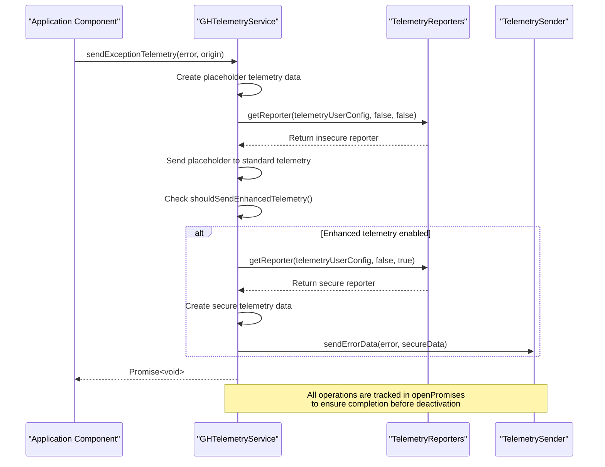
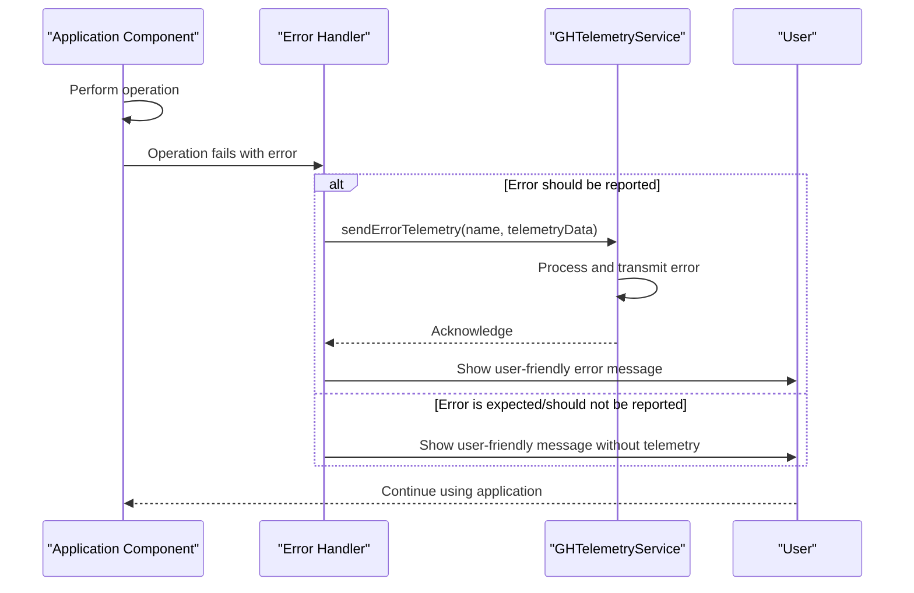

# Error Reporting

<cite>
**Referenced Files in This Document**   
- [failingTelemetryReporter.ts](file://src/platform/telemetry/common/failingTelemetryReporter.ts)
- [ghTelemetryService.ts](file://src/platform/telemetry/common/ghTelemetryService.ts)
- [telemetry.ts](file://src/platform/telemetry/common/telemetry.ts)
- [telemetryData.ts](file://src/platform/telemetry/common/telemetryData.ts)
- [errors.ts](file://src/util/vs/base/common/errors.ts)
- [pathRedaction.ts](file://src/util/common/pathRedaction.ts)
- [spyingTelemetryService.ts](file://src/platform/telemetry/node/spyingTelemetryService.ts)
- [nullTelemetryService.ts](file://src/platform/telemetry/common/nullTelemetryService.ts)
</cite>

## Table of Contents
1. [Introduction](#introduction)
2. [Error Reporting Architecture](#error-reporting-architecture)
3. [Error Data Structure](#error-data-structure)
4. [Error Transmission Mechanisms](#error-transmission-mechanisms)
5. [Error Categorization and Filtering](#error-categorization-and-filtering)
6. [Privacy Safeguards](#privacy-safeguards)
7. [Error Reporting from Components](#error-reporting-from-components)
8. [Custom Error Reporting](#custom-error-reporting)
9. [Best Practices](#best-practices)
10. [Conclusion](#conclusion)

## Introduction

The Error Reporting system in vscode-copilot-chat is designed to capture and report unhandled exceptions and critical errors while maintaining user privacy. The system uses a multi-layered approach with different telemetry reporters for various scenarios, including production, testing, and internal development. The core components include the `failingTelemetryReporter` for test environments, `ghTelemetrySender` for GitHub telemetry, and `msftTelemetrySender` for Microsoft internal telemetry. The system is built on top of VS Code's telemetry infrastructure but extends it with additional privacy safeguards and error handling mechanisms specific to the Copilot experience.

The error reporting system serves multiple purposes: diagnosing issues in production, monitoring system health, improving the user experience, and ensuring compliance with privacy regulations. It captures detailed error information including stack traces, context information, and environment details while implementing strict privacy controls to prevent sensitive data from being transmitted.

**Section sources**
- [ghTelemetryService.ts](file://src/platform/telemetry/common/ghTelemetryService.ts#L1-L56)
- [telemetry.ts](file://src/platform/telemetry/common/telemetry.ts#L1-L217)

## Error Reporting Architecture

The Error Reporting system in vscode-copilot-chat follows a layered architecture with multiple components working together to capture, process, and transmit error data. At the core is the `GHTelemetryService` which acts as the main entry point for all telemetry operations, including error reporting. This service coordinates between different telemetry senders and applies appropriate filtering and privacy rules based on the user's telemetry preferences.

The architecture consists of several key components:
- `GHTelemetryService`: The main telemetry service that routes events to appropriate senders
- `TelemetryReporters`: A container class that manages both secure and insecure reporters
- `FailingTelemetryReporter`: A special reporter used in test environments that captures errors without transmitting them
- `TelemetryData`: A class that encapsulates telemetry properties and measurements with privacy safeguards
- `ErrorNoTelemetry`: A special error type that prevents telemetry collection for expected errors

The system uses a dual-reporter model where standard telemetry events can be disabled through VS Code's telemetry settings, while enhanced telemetry events contain additional data such as user prompts and suggestions. Enhanced telemetry requires explicit user consent and can be managed through the Copilot settings page.

```mermaid
classDiagram
class GHTelemetryService {
+_isRunningTests : boolean
+_configService : IConfigurationService
+_envService : IEnvService
+_telemetryUserConfig : ITelemetryUserConfig
+reporters : TelemetryReporters
+openPromises : Set~Promise~void~~
+sendTelemetry(name : string, telemetryData? : TelemetryData)
+sendErrorTelemetry(name : string, telemetryData? : TelemetryData)
+sendEnhancedTelemetry(name : string, telemetryData? : TelemetryData)
+sendEnhancedErrorTelemetry(name : string, telemetryData? : TelemetryData)
+sendExceptionTelemetry(maybeError : unknown, origin : string)
+deactivate()
}
class TelemetryReporters {
-reporter : TelemetrySender | undefined
-reporterSecure : TelemetrySender | undefined
+getReporter(telemetryUserConfig : ITelemetryUserConfig, isTest : boolean, secure : boolean)
+setReporter(reporter : TelemetrySender | undefined)
+setSecureReporter(reporter : TelemetrySender | undefined)
+deactivate()
}
class FailingTelemetryReporter {
+sendEventData(eventName : string, data? : Record~string, any~ | undefined)
+sendErrorData(error : Error, data? : Record~string, any~ | undefined)
+flush() : Promise~void~
+dispose()
}
class TelemetryData {
+properties : { [key : string] : string }
+measurements : { [key : string] : number | undefined }
+createAndMarkAsIssued(properties : object, measurements : object)
+makeReadyForSending(configService : IConfigurationService, envService : IEnvService, telemetryUserConfig : ITelemetryUserConfig)
+maybeRemoveRepoInfoFromPropertiesHack(secure : boolean, properties : { [key : string] : string })
}
class ErrorNoTelemetry {
+name : string
+constructor(msg? : string)
+static fromError(err : Error) : ErrorNoTelemetry
+static isErrorNoTelemetry(err : Error) : boolean
}
GHTelemetryService --> TelemetryReporters : "uses"
GHTelemetryService --> TelemetryData : "creates"
TelemetryReporters --> FailingTelemetryReporter : "returns in test mode"
GHTelemetryService --> ErrorNoTelemetry : "checks for no telemetry"
```

**Diagram sources **
- [ghTelemetryService.ts](file://src/platform/telemetry/common/ghTelemetryService.ts#L58-L249)
- [failingTelemetryReporter.ts](file://src/platform/telemetry/common/failingTelemetryReporter.ts#L1-L50)
- [telemetryData.ts](file://src/platform/telemetry/common/telemetryData.ts#L1-L100)
- [errors.ts](file://src/util/vs/base/common/errors.ts#L305-L327)

**Section sources**
- [ghTelemetryService.ts](file://src/platform/telemetry/common/ghTelemetryService.ts#L1-L249)
- [telemetry.ts](file://src/platform/telemetry/common/telemetry.ts#L1-L217)
- [failingTelemetryReporter.ts](file://src/platform/telemetry/common/failingTelemetryReporter.ts#L1-L50)

## Error Data Structure

The error data structure in vscode-copilot-chat is designed to capture comprehensive information about errors while implementing privacy safeguards to prevent sensitive data from being transmitted. The core error data is encapsulated in the `TelemetryData` class, which contains properties and measurements that are sent with each telemetry event.

The error data structure includes several key components:

- **Properties**: String key-value pairs that provide context about the error, such as the origin, error type, and relevant feature flags
- **Measurements**: Numeric key-value pairs that provide quantitative data about the error, such as duration, size, or count
- **Stack traces**: Captured from the error object but processed to remove sensitive information
- **Environment details**: Information about the user's environment, including VS Code version, operating system, and extension version
- **Context information**: Additional context about the state of the application when the error occurred

The system uses the `transformErrorForSerialization` function to convert error objects into a serializable format that includes the error name, message, stack trace, and any associated code. This function also handles error causes (chained exceptions) by recursively transforming them. The `ErrorNoTelemetry` class is used to mark errors that should not be reported to telemetry, preventing expected or benign errors from being logged.

```mermaid
classDiagram
class TelemetryData {
+properties : { [key : string] : string }
+measurements : { [key : string] : number | undefined }
+createAndMarkAsIssued(properties : object, measurements : object)
+makeReadyForSending(configService : IConfigurationService, envService : IEnvService, telemetryUserConfig : ITelemetryUserConfig)
+maybeRemoveRepoInfoFromPropertiesHack(secure : boolean, properties : { [key : string] : string })
}
class SerializedError {
+$isError : true
+name : string
+message : string
+stack : string
+noTelemetry : boolean
+code? : string
+cause? : SerializedError
}
class ErrorNoTelemetry {
+name : string
+constructor(msg? : string)
+static fromError(err : Error) : ErrorNoTelemetry
+static isErrorNoTelemetry(err : Error) : boolean
}
class TelemetryEventProperties {
+[key : string] : string | TelemetryTrustedValue~string~ | undefined
}
class TelemetryEventMeasurements {
+[key : string] : number | undefined
}
TelemetryData --> TelemetryEventProperties : "contains"
TelemetryData --> TelemetryEventMeasurements : "contains"
TelemetryData --> SerializedError : "includes in properties"
SerializedError --> ErrorNoTelemetry : "extends"
SerializedError --> SerializedError : "cause (recursive)"
```

**Diagram sources **
- [telemetryData.ts](file://src/platform/telemetry/common/telemetryData.ts#L1-L100)
- [errors.ts](file://src/util/vs/base/common/errors.ts#L125-L178)
- [telemetry.ts](file://src/platform/telemetry/common/telemetry.ts#L13-L20)

**Section sources**
- [telemetryData.ts](file://src/platform/telemetry/common/telemetryData.ts#L1-L100)
- [errors.ts](file://src/util/vs/base/common/errors.ts#L125-L178)
- [telemetry.ts](file://src/platform/telemetry/common/telemetry.ts#L13-L20)

## Error Transmission Mechanisms

The error transmission mechanisms in vscode-copilot-chat are designed to reliably deliver error reports while handling network issues, rate limiting, and user privacy preferences. The system uses two primary transmission channels: GitHub telemetry for user-facing error reporting and Microsoft internal telemetry for development and debugging purposes.

The transmission process is managed by the `GHTelemetryService` which routes error events to the appropriate telemetry sender based on the security requirements and user configuration. For standard telemetry events, the system uses the insecure reporter which can be disabled through VS Code's telemetry settings. For enhanced telemetry events containing additional data such as user prompts and suggestions, the system uses the secure reporter which requires explicit user consent.

The system implements several reliability features:

- **Promise tracking**: The `openPromises` set in `GHTelemetryService` tracks all pending telemetry operations to ensure they complete before the service is deactivated
- **Flush mechanism**: The `flush` method on telemetry reporters ensures all pending events are sent before the reporter is disposed
- **Error handling**: The system gracefully handles network errors and other transmission failures without affecting the user experience
- **Retry logic**: While not explicitly shown in the code, the underlying VS Code telemetry infrastructure likely includes retry mechanisms for failed transmissions

The `sendExceptionTelemetry` method in `GHTelemetryService` implements a dual-reporting strategy where a placeholder event is sent to standard telemetry while the full error details are sent to enhanced telemetry. This ensures that basic error information is available even when enhanced telemetry is disabled, while preserving user privacy by only sending detailed error information with explicit consent.



**Diagram sources **
- [ghTelemetryService.ts](file://src/platform/telemetry/common/ghTelemetryService.ts#L119-L183)
- [ghTelemetryService.ts](file://src/platform/telemetry/common/ghTelemetryService.ts#L20-L56)
- [telemetry.ts](file://src/platform/telemetry/common/telemetry.ts#L139-L174)

**Section sources**
- [ghTelemetryService.ts](file://src/platform/telemetry/common/ghTelemetryService.ts#L119-L183)
- [ghTelemetryService.ts](file://src/platform/telemetry/common/ghTelemetryService.ts#L20-L56)

## Error Categorization and Filtering

The error categorization and filtering system in vscode-copilot-chat is designed to classify errors into meaningful categories and apply appropriate handling based on the error type. The system uses a combination of error types, properties, and context to determine how errors should be reported and processed.

The primary mechanism for error categorization is the use of different telemetry event types:

- **Standard telemetry events**: Basic usage and error events that can be disabled through VS Code's telemetry settings
- **Enhanced telemetry events**: Events containing additional data such as user prompts and suggestions, requiring explicit user consent
- **Exception telemetry**: Special handling for unhandled exceptions and critical errors
- **Experimentation telemetry**: Events related to A/B testing and feature experimentation

The system also implements filtering rules to prevent certain types of errors from being reported. The `ErrorNoTelemetry` class is used to mark errors that should not be reported to telemetry, typically for expected or benign errors that don't indicate a problem with the system. This prevents noise in the telemetry data and protects user privacy by not reporting errors that are part of normal operation.

The filtering system also includes content filtering for AI-generated responses, with categories such as:
- Copyright violations
- Sexual content
- Violence
- Hate speech
- Self-harm
- Prompt filtering by Responsible AI Service

These categories are used to classify filtered responses and provide appropriate feedback to users without transmitting sensitive information about the specific content that triggered the filter.

```mermaid
flowchart TD
Start([Error Occurs]) --> CheckErrorType["Check if error is ErrorNoTelemetry"]
CheckErrorType --> |Yes| DoNotReport["Do not report to telemetry"]
CheckErrorType --> |No| CheckEnhancedTelemetry["Check if enhanced telemetry is enabled"]
CheckEnhancedTelemetry --> |Yes| SendEnhanced["Send full error to enhanced telemetry"]
CheckEnhancedTelemetry --> |No| SendPlaceholder["Send placeholder to standard telemetry"]
SendEnhanced --> End([Error reported])
SendPlaceholder --> End
DoNotReport --> End
classDef decision fill:#f9f,stroke:#333,stroke-width:2px;
classDef process fill:#ff9,stroke:#333,stroke-width:2px;
classDef end fill:#f99,stroke:#333,stroke-width:2px;
class CheckErrorType,CheckEnhancedTelemetry decision
class SendEnhanced,SendPlaceholder,DoNotReport process
class End end
```

**Diagram sources **
- [errors.ts](file://src/util/vs/base/common/errors.ts#L305-L327)
- [ghTelemetryService.ts](file://src/platform/telemetry/common/ghTelemetryService.ts#L155-L183)
- [telemetry.ts](file://src/platform/telemetry/common/telemetry.ts#L143-L158)

**Section sources**
- [errors.ts](file://src/util/vs/base/common/errors.ts#L305-L327)
- [ghTelemetryService.ts](file://src/platform/telemetry/common/ghTelemetryService.ts#L155-L183)
- [telemetry.ts](file://src/platform/telemetry/common/telemetry.ts#L143-L158)

## Privacy Safeguards

The privacy safeguards in vscode-copilot-chat's error reporting system are comprehensive and designed to protect user data while still providing valuable diagnostic information. The system implements multiple layers of protection to ensure that sensitive information is not transmitted without explicit user consent.

Key privacy safeguards include:

- **Path redaction**: The `redactPaths` function is used to remove or obfuscate file paths and other potentially sensitive information from error reports. This prevents repository structure and file names from being exposed in telemetry data.
- **Enhanced telemetry opt-in**: Detailed error information, including user prompts and AI suggestions, is only transmitted when the user has explicitly enabled enhanced telemetry through the Copilot settings page.
- **ErrorNoTelemetry class**: This special error type prevents certain errors from being reported to telemetry at all, typically for expected or benign errors that don't indicate a system problem.
- **Property length limits**: The system enforces maximum lengths for telemetry properties to prevent excessively large data payloads and potential information leakage.
- **Data multiplexing**: Long property values are split into multiple properties with numbered suffixes to stay within size limits while preserving the information.

The system also implements a dual-reporting strategy for exceptions where a placeholder event with minimal information is sent to standard telemetry, while the full error details are sent only to enhanced telemetry with user consent. This ensures that basic error information is available for monitoring system health while protecting user privacy by not transmitting detailed error information without explicit permission.

Additionally, the system uses the `TelemetryTrustedValue` class to mark certain properties as exempt from cleaning, allowing specific data to be transmitted when necessary for debugging while ensuring that all other data is subject to privacy protections.

**Section sources**
- [pathRedaction.ts](file://src/util/common/pathRedaction.ts#L1-L50)
- [ghTelemetryService.ts](file://src/platform/telemetry/common/ghTelemetryService.ts#L164-L165)
- [telemetry.ts](file://src/platform/telemetry/common/telemetry.ts#L179-L184)
- [telemetry.ts](file://src/platform/telemetry/common/telemetry.ts#L189-L217)

## Error Reporting from Components

Error reporting from components in vscode-copilot-chat follows a consistent pattern across the codebase, with components using the telemetry service to report errors in a standardized way. Components typically report errors through the `GHTelemetryService` interface, which provides methods for sending different types of telemetry events.

The typical error reporting pattern from components involves:

1. **Catching errors**: Components wrap potentially error-prone operations in try-catch blocks or handle rejected promises
2. **Creating telemetry data**: Components create `TelemetryData` objects with relevant properties and measurements
3. **Reporting errors**: Components call the appropriate telemetry method based on the error severity and type
4. **Handling user feedback**: Components may also provide user-facing error messages while reporting the error internally

For example, when a network request fails, a component might catch the error, create telemetry data with information about the request and failure reason, and then call `sendErrorTelemetry` or `sendExceptionTelemetry` depending on the severity. The component would also typically show an appropriate error message to the user.

The system also supports reporting expected errors that should not be treated as bugs. Components can wrap such errors in the `ErrorNoTelemetry` class to prevent them from being reported to telemetry, reducing noise in the error reporting system.



**Diagram sources **
- [ghTelemetryService.ts](file://src/platform/telemetry/common/ghTelemetryService.ts#L103-L113)
- [telemetry.ts](file://src/platform/telemetry/common/telemetry.ts#L147-L152)

**Section sources**
- [ghTelemetryService.ts](file://src/platform/telemetry/common/ghTelemetryService.ts#L103-L113)
- [telemetry.ts](file://src/platform/telemetry/common/telemetry.ts#L147-L152)

## Custom Error Reporting

Custom error reporting in vscode-copilot-chat allows developers to add error reporting for new features while following the established patterns and privacy safeguards. To implement custom error reporting, developers should follow these guidelines:

1. **Use the telemetry service interface**: Always use the `GHTelemetryService` or `ITelemetryService` interface rather than directly accessing telemetry senders
2. **Categorize errors appropriately**: Use standard telemetry for basic usage and error events, enhanced telemetry for detailed diagnostic information (with user consent), and exception telemetry for unhandled exceptions
3. **Include relevant context**: Add properties that provide context about the error, such as feature name, operation type, and relevant state
4. **Respect privacy**: Use `ErrorNoTelemetry` for expected errors and ensure sensitive information is redacted
5. **Follow naming conventions**: Use consistent naming for telemetry events to make analysis easier

To add custom error reporting for a new feature, developers should:

1. Inject the `GHTelemetryService` or appropriate telemetry service interface into their component
2. Identify key error scenarios that should be reported
3. Implement error handling that captures the error and creates appropriate telemetry data
4. Call the appropriate telemetry method based on the error type and severity
5. Test the error reporting in different configurations (telemetry enabled/disabled, enhanced telemetry enabled/disabled)

For example, to add error reporting for a new code generation feature:

```typescript
// Example pattern (not actual code)
try {
    const result = await codeGenerator.generateCode(prompt);
    this.telemetryService.sendTelemetry('codeGeneration.success', {
        promptLength: prompt.length,
        resultLength: result.length
    });
    return result;
} catch (error) {
    if (error instanceof ExpectedGenerationError) {
        // This is an expected error, don't report to telemetry
        this.telemetryService.sendTelemetry('codeGeneration.rejected', {
            reason: error.reason
        });
        return null;
    }
    
    // This is an unexpected error, report it
    this.telemetryService.sendExceptionTelemetry(error, 'codeGeneration.generateCode');
    throw error;
}
```

**Section sources**
- [ghTelemetryService.ts](file://src/platform/telemetry/common/ghTelemetryService.ts#L99-L113)
- [telemetry.ts](file://src/platform/telemetry/common/telemetry.ts#L98-L109)
- [errors.ts](file://src/util/vs/base/common/errors.ts#L305-L327)

## Best Practices

When implementing error handling and reporting in vscode-copilot-chat, developers should follow these best practices to balance diagnostic value with user privacy:

1. **Distinguish between expected and unexpected errors**: Use `ErrorNoTelemetry` for expected errors that are part of normal operation, such as validation failures or user cancellations. Only report unexpected errors that may indicate bugs or system problems.

2. **Provide meaningful context**: When reporting errors, include properties that provide context about the error, such as the feature name, operation type, and relevant state. This helps diagnose issues without needing to reproduce them.

3. **Respect telemetry settings**: Always check whether telemetry is enabled before sending detailed information. Use standard telemetry for basic usage and error events, and enhanced telemetry only for detailed diagnostic information with user consent.

4. **Redact sensitive information**: Use the `redactPaths` function and other privacy safeguards to prevent sensitive information from being transmitted. Never include full file paths, repository names, or other potentially identifying information in telemetry.

5. **Use appropriate error categories**: Choose the right telemetry method based on the error type:
   - `sendTelemetry` for normal usage and success events
   - `sendErrorTelemetry` for expected errors and failures
   - `sendExceptionTelemetry` for unhandled exceptions and critical errors
   - `sendEnhancedTelemetry` for detailed diagnostic information (with user consent)

6. **Implement graceful degradation**: When telemetry is disabled, ensure that the application continues to function normally. Telemetry failures should never affect the user experience.

7. **Test error reporting**: Verify that error reporting works correctly in different configurations (telemetry enabled/disabled, enhanced telemetry enabled/disabled) and that privacy safeguards are effective.

8. **Monitor telemetry volume**: Avoid creating too many different telemetry events or sending excessively large payloads, as this can impact performance and increase storage costs.

9. **Document telemetry events**: Maintain documentation of all telemetry events, including their purpose, properties, and privacy considerations.

10. **Review regularly**: Periodically review the telemetry events being collected to ensure they are still relevant and not collecting unnecessary information.

**Section sources**
- [ghTelemetryService.ts](file://src/platform/telemetry/common/ghTelemetryService.ts#L1-L249)
- [telemetry.ts](file://src/platform/telemetry/common/telemetry.ts#L1-L217)
- [errors.ts](file://src/util/vs/base/common/errors.ts#L1-L344)
- [pathRedaction.ts](file://src/util/common/pathRedaction.ts#L1-L50)

## Conclusion

The Error Reporting system in vscode-copilot-chat provides a robust framework for capturing and analyzing errors while maintaining strict privacy controls. The system's architecture, with its dual-reporter model and comprehensive privacy safeguards, strikes a balance between obtaining valuable diagnostic information and respecting user privacy.

Key strengths of the system include its layered architecture, comprehensive error data structure, reliable transmission mechanisms, and sophisticated privacy protections. The use of `ErrorNoTelemetry` to filter out expected errors, path redaction to protect sensitive information, and the opt-in model for enhanced telemetry demonstrate a thoughtful approach to privacy.

The system provides clear patterns for error reporting from components and guidelines for adding custom error reporting for new features. By following the best practices outlined in this documentation, developers can effectively use the error reporting system to improve the reliability and quality of the Copilot experience while maintaining user trust.

Future improvements could include more detailed documentation of telemetry events, enhanced monitoring of telemetry volume and performance impact, and additional tools for analyzing and visualizing error data. However, the current system provides a solid foundation for diagnosing issues and improving the user experience in a privacy-conscious manner.