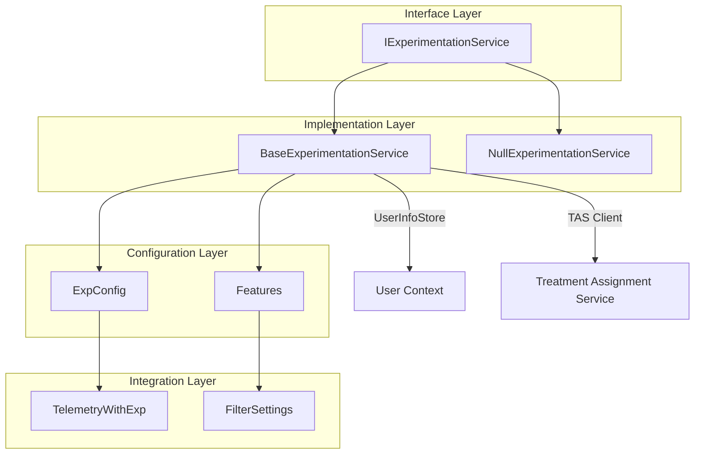
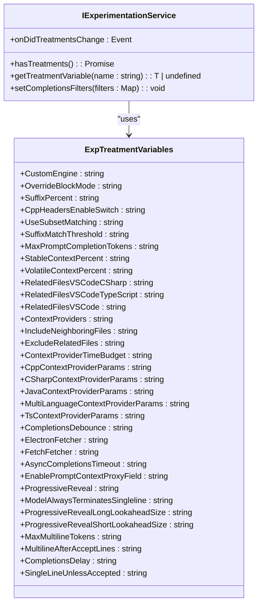
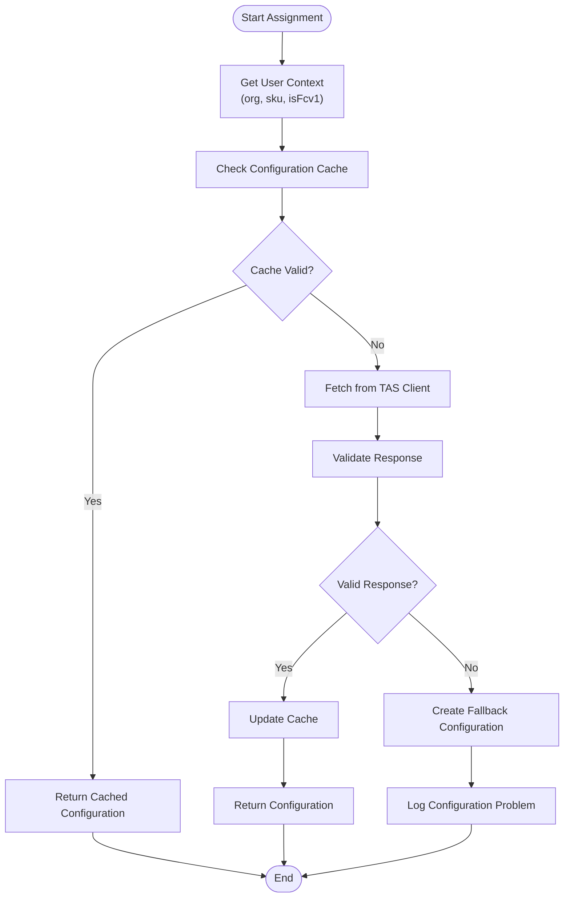
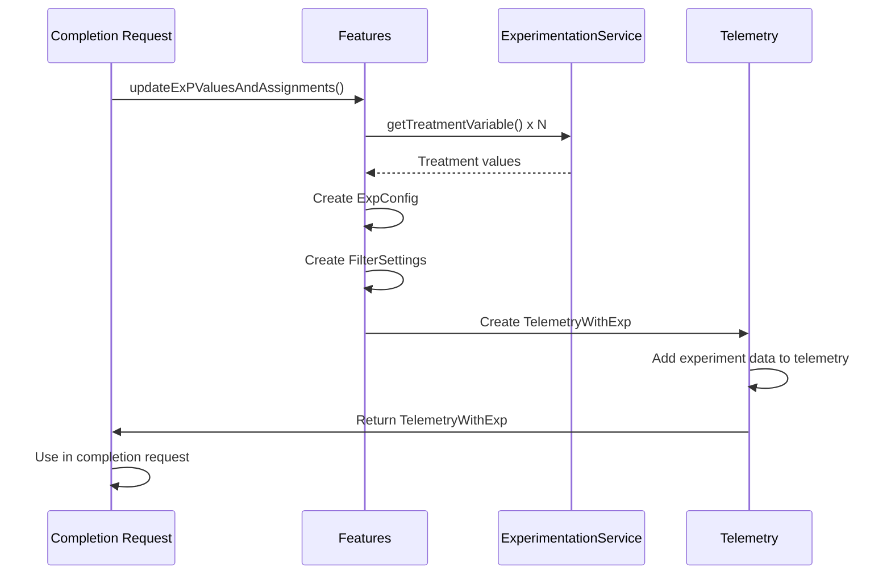
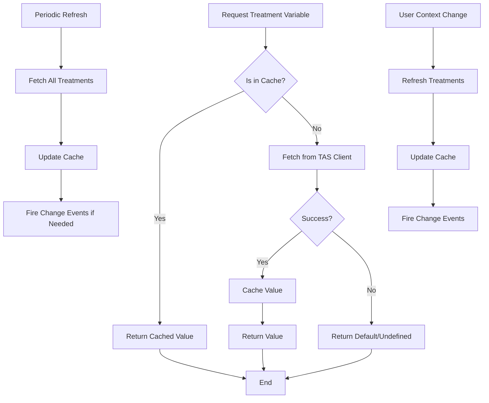

# Experimentation Service

<cite>
**Referenced Files in This Document**   
- [nullExperimentationService.ts](file://src/platform/telemetry/common/nullExperimentationService.ts)
- [baseExperimentationService.ts](file://src/platform/telemetry/node/baseExperimentationService.ts)
- [expConfig.ts](file://src/extension/completions-core/vscode-node/lib/src/experiments/expConfig.ts)
- [features.ts](file://src/extension/completions-core/vscode-node/lib/src/experiments/features.ts)
- [filters.ts](file://src/extension/completions-core/vscode-node/lib/src/experiments/filters.ts)
- [defaultExpFilters.ts](file://src/extension/completions-core/vscode-node/lib/src/experiments/defaultExpFilters.ts)
- [telemetryNames.ts](file://src/extension/completions-core/vscode-node/lib/src/experiments/telemetryNames.ts)
- [telemetry.ts](file://src/extension/completions-core/vscode-node/lib/src/telemetry.ts)
- [simpleExperimentationService.spec.ts](file://chat-lib/test/simpleExperimentationService.spec.ts)
- [experimentation.spec.ts](file://src/platform/telemetry/test/node/experimentation.spec.ts)
</cite>

## Table of Contents
1. [Introduction](#introduction)
2. [Experimentation Service Architecture](#experimentation-service-architecture)
3. [Core Components](#core-components)
4. [Feature Flag Management](#feature-flag-management)
5. [Experiment Configuration and Loading](#experiment-configuration-and-loading)
6. [Variant Assignment Algorithms](#variant-assignment-algorithms)
7. [Data Collection and Telemetry Integration](#data-collection-and-telemetry-integration)
8. [Experiment Lifecycle Management](#experiment-lifecycle-management)
9. [Caching Strategies and Fallback Mechanisms](#caching-strategies-and-fallback-mechanisms)
10. [Implementation Examples](#implementation-examples)
11. [Privacy and Data Retention](#privacy-and-data-retention)
12. [Conclusion](#conclusion)

## Introduction

The Experimentation Service in vscode-copilot-chat provides a comprehensive framework for A/B testing, feature flag management, and user cohort analysis. This service enables controlled experimentation of new features and functionality within the Copilot chat environment, allowing for data-driven decision making based on user behavior and engagement metrics.

The service architecture is designed to support dynamic feature toggling, experiment configuration loading, and variant assignment algorithms that determine which users receive specific experimental treatments. Experiment data is systematically collected and associated with telemetry events for comprehensive analysis, enabling product teams to evaluate the impact of changes and optimize the user experience.

This documentation details the implementation of the experimentation service interfaces, configuration loading mechanisms, variant assignment algorithms, and data collection processes. It also covers experiment lifecycle management, caching strategies, fallback mechanisms, and privacy considerations for experimentation data.

**Section sources**
- [nullExperimentationService.ts](file://src/platform/telemetry/common/nullExperimentationService.ts#L1-L74)
- [baseExperimentationService.ts](file://src/platform/telemetry/node/baseExperimentationService.ts#L1-L197)

## Experimentation Service Architecture

The Experimentation Service follows a layered architecture with clear separation of concerns between the interface definition, implementation, and integration with other components. The core architecture consists of an interface definition, base implementation, and specialized components for configuration management and telemetry integration.



**Diagram sources**
- [nullExperimentationService.ts](file://src/platform/telemetry/common/nullExperimentationService.ts#L25-L56)
- [baseExperimentationService.ts](file://src/platform/telemetry/node/baseExperimentationService.ts#L87-L197)
- [expConfig.ts](file://src/extension/completions-core/vscode-node/lib/src/experiments/expConfig.ts#L126-L154)
- [features.ts](file://src/extension/completions-core/vscode-node/lib/src/experiments/features.ts#L33-L415)

## Core Components

The Experimentation Service comprises several core components that work together to enable A/B testing and feature flag management. The primary components include the experimentation service interface, implementation classes, configuration management, and telemetry integration.

The `IExperimentationService` interface defines the contract for experimentation functionality, including methods for retrieving treatment variables and handling treatment changes. This interface is implemented by `BaseExperimentationService`, which provides the main functionality, and `NullExperimentationService`, which serves as a fallback implementation when experimentation is not available.

The `ExpConfig` class manages experiment configuration, storing treatment variables and feature flags. The `Features` class provides a higher-level API for accessing experiment values and integrating with the completion system. These components work together to provide a comprehensive experimentation framework.

**Section sources**
- [nullExperimentationService.ts](file://src/platform/telemetry/common/nullExperimentationService.ts#L25-L73)
- [baseExperimentationService.ts](file://src/platform/telemetry/node/baseExperimentationService.ts#L87-L197)
- [expConfig.ts](file://src/extension/completions-core/vscode-node/lib/src/experiments/expConfig.ts#L126-L154)
- [features.ts](file://src/extension/completions-core/vscode-node/lib/src/experiments/features.ts#L33-L415)

## Feature Flag Management

The Experimentation Service implements a robust feature flag management system that allows for dynamic control of feature availability. Feature flags are implemented as treatment variables that can be boolean, numeric, or string values, providing flexibility in how features are controlled.

Feature flags are defined in the `ExpTreatmentVariables` enum, which includes various flags for controlling different aspects of the Copilot experience. These include flags for enabling specific features, controlling behavior parameters, and managing experimental functionality. For example, the `ProgressiveReveal` flag controls whether progressive reveal of completions is enabled, while the `MaxMultilineTokens` flag sets the maximum token count for multiline completions.

The service provides methods for retrieving feature flag values through the `getTreatmentVariable` method. This method returns the current value of a treatment variable, or undefined if the variable is not set. Feature flags can be updated dynamically, and changes are propagated through the `onDidTreatmentsChange` event, allowing components to react to flag changes in real-time.



**Diagram sources**
- [nullExperimentationService.ts](file://src/platform/telemetry/common/nullExperimentationService.ts#L25-L56)
- [expConfig.ts](file://src/extension/completions-core/vscode-node/lib/src/experiments/expConfig.ts#L11-L122)

## Experiment Configuration and Loading

The Experimentation Service implements a sophisticated configuration loading system that manages experiment parameters and feature flags. The configuration is loaded from the Treatment Assignment Service (TAS) and cached for efficient access.

The `ExpConfig` class represents the experiment configuration, containing both treatment variables and feature identifiers. Treatment variables are stored as a partial record of `ExpTreatmentVariables` to `ExpTreatmentVariableValue`, allowing for flexible configuration of boolean, numeric, and string values. The features property contains a semicolon-separated list of active feature IDs.

Configuration loading occurs through the `BaseExperimentationService`, which delegates to the TAS client for fetching treatment variables. The service maintains a cache of previously read treatments in the `_previouslyReadTreatments` map, which is used to detect changes and fire the `onDidTreatmentsChange` event. Configuration is loaded asynchronously, with the `hasTreatments()` method returning a promise that resolves when the initial configuration is available.

The service also implements periodic refresh of experiment configuration, with a timer that refreshes treatments every hour. Additionally, configuration is refreshed when user information changes, such as when the user's organization or SKU changes. This ensures that users receive appropriate treatment assignments based on their current context.

**Section sources**
- [expConfig.ts](file://src/extension/completions-core/vscode-node/lib/src/experiments/expConfig.ts#L126-L154)
- [baseExperimentationService.ts](file://src/platform/telemetry/node/baseExperimentationService.ts#L124-L159)

## Variant Assignment Algorithms

The Experimentation Service employs sophisticated variant assignment algorithms to determine which experimental treatments users receive. These algorithms are designed to ensure consistent assignment while allowing for targeted experimentation based on user characteristics and context.

The primary variant assignment mechanism is implemented in the `BaseExperimentationService`, which uses the TAS client to retrieve treatment variables. The service maintains user context information, including organization and SKU, which is used as input to the assignment algorithm. This allows for targeted experiments based on user segments.

The assignment algorithm supports various granularity levels, including time-based buckets and checksum-based assignment, which can be controlled through specific treatment variables. For example, the `SuffixMatchThreshold` variable controls the threshold for matching new suffixes with old suffixs, enabling experiments with different matching criteria.

The service also implements a fallback mechanism for experiment configuration through the `createFallbackConfig` method in the `ExpConfig` class. This ensures that experiments can proceed even if the primary configuration source is unavailable, maintaining functionality while logging the issue for investigation.



**Diagram sources**
- [baseExperimentationService.ts](file://src/platform/telemetry/node/baseExperimentationService.ts#L124-L159)
- [expConfig.ts](file://src/extension/completions-core/vscode-node/lib/src/experiments/expConfig.ts#L138-L145)

## Data Collection and Telemetry Integration

The Experimentation Service integrates closely with the telemetry system to collect and report experiment data for analysis. This integration ensures that experiment assignments and feature flag usage are properly recorded and can be correlated with user behavior and engagement metrics.

The service uses the `TelemetryWithExp` class to extend telemetry events with experiment configuration and filter information. This class inherits from `TelemetryData` and adds the `filtersAndExp` property, which contains both the filter settings and experiment configuration. This ensures that all telemetry events used for scorecard generation include the correct experiment assignments.

Experiment data is added to telemetry events through the `addToTelemetry` method in the `ExpConfig` class, which adds the features property to the telemetry properties. Filter information is added through the `addToTelemetry` method in the `FilterSettings` class, which maps filter values to telemetry property names.

The integration also includes special handling for different telemetry stores, with repository information removed from standard telemetry but retained in enhanced telemetry. This ensures compliance with privacy requirements while still allowing for comprehensive analysis in enhanced telemetry scenarios.



**Diagram sources**
- [features.ts](file://src/extension/completions-core/vscode-node/lib/src/experiments/features.ts#L67-L83)
- [expConfig.ts](file://src/extension/completions-core/vscode-node/lib/src/experiments/expConfig.ts#L151-L153)
- [filters.ts](file://src/extension/completions-core/vscode-node/lib/src/experiments/filters.ts#L90-L98)
- [telemetry.ts](file://src/extension/completions-core/vscode-node/lib/src/telemetry.ts#L320-L331)

## Experiment Lifecycle Management

The Experimentation Service implements comprehensive lifecycle management for experiments, from initialization through to cleanup and disposal. The lifecycle is designed to ensure proper resource management and consistent behavior across different usage scenarios.

The service lifecycle begins with initialization in the `BaseExperimentationService` constructor, where the TAS client delegate is created and initial fetch operations are initiated. The service registers event listeners for user information changes and sets up a periodic refresh timer to ensure experiment configuration stays current.

The `hasTreatments()` method provides a way to wait for the initial configuration to be loaded, returning a promise that resolves when the initial fetch is complete. This allows components to synchronize with the availability of experiment data before proceeding with operations that depend on it.

The service also implements proper disposal through the `Disposable` base class, ensuring that event listeners and timers are cleaned up when the service is no longer needed. This prevents memory leaks and ensures that background operations are terminated appropriately.

Experiment lifecycle events are managed through the `onDidTreatmentsChange` event, which fires when treatment variables change. This event includes information about which variables were affected, allowing components to respond appropriately to configuration changes.

**Section sources**
- [baseExperimentationService.ts](file://src/platform/telemetry/node/baseExperimentationService.ts#L106-L128)
- [nullExperimentationService.ts](file://src/platform/telemetry/common/nullExperimentationService.ts#L66-L67)

## Caching Strategies and Fallback Mechanisms

The Experimentation Service employs several caching strategies and fallback mechanisms to ensure reliability and performance. These strategies are designed to minimize network requests, handle service unavailability, and maintain functionality in degraded conditions.

The primary caching mechanism is implemented in the `BaseExperimentationService` through the `_previouslyReadTreatments` map, which caches treatment variable values. This cache is used to detect changes in treatment variables and to avoid unnecessary event emissions when values haven't changed. The service also relies on the TAS client's internal caching, which stores treatment assignments and returns them quickly for subsequent requests with the same filters.

The service implements a periodic refresh mechanism, with a timer that refreshes treatments every hour. This ensures that experiment configuration stays current without requiring constant network requests. Additionally, the service refreshes treatments when user information changes, such as when the user's organization or SKU changes.

For fallback mechanisms, the service provides the `NullExperimentationService` class, which implements the `IExperimentationService` interface but returns default values. This allows components to function even when the primary experimentation service is unavailable. The `ExpConfig` class also includes a `createFallbackConfig` method that creates an empty configuration when the primary configuration cannot be loaded, ensuring that operations can continue while logging the issue for investigation.



**Diagram sources**
- [baseExperimentationService.ts](file://src/platform/telemetry/node/baseExperimentationService.ts#L130-L148)
- [expConfig.ts](file://src/extension/completions-core/vscode-node/lib/src/experiments/expConfig.ts#L138-L145)
- [nullExperimentationService.ts](file://src/platform/telemetry/common/nullExperimentationService.ts#L68-L70)

## Implementation Examples

The Experimentation Service provides several examples of how to define and use experiments, feature flags, and analyze experiment results. These examples demonstrate the practical application of the service's capabilities in real-world scenarios.

To define a new experiment, developers can add a new entry to the `ExpTreatmentVariables` enum and use it with the `getTreatmentVariable` method. For example, to implement a feature flag for a new completion engine:

```typescript
// Define the feature flag in ExpTreatmentVariables
CustomEngine = 'copilotcustomengine'

// Use the feature flag in code
const customEngine = features.customEngine(telemetryWithExp);
if (customEngine) {
    // Use the custom engine
}
```

For feature flag implementation, the service provides convenience methods in the `Features` class that handle type conversion and default values. For example, the `progressiveReveal` method returns a boolean indicating whether progressive reveal should be enabled:

```typescript
enableProgressiveReveal(telemetryWithExp: TelemetryWithExp): boolean {
    return (
        (telemetryWithExp.filtersAndExp.exp.variables[ExpTreatmentVariables.ProgressiveReveal] as boolean) ?? false
    );
}
```

To analyze experiment results, the telemetry integration ensures that experiment assignments are included in relevant telemetry events. This allows for post-hoc analysis of experiment impact by filtering telemetry data based on the experiment features property.

The service also provides testing utilities, such as the `SimpleExperimentationService` used in unit tests, which allows for deterministic testing of experiment behavior by directly setting treatment variables.

**Section sources**
- [expConfig.ts](file://src/extension/completions-core/vscode-node/lib/src/experiments/expConfig.ts#L11-L122)
- [features.ts](file://src/extension/completions-core/vscode-node/lib/src/experiments/features.ts#L33-L415)
- [simpleExperimentationService.spec.ts](file://chat-lib/test/simpleExperimentationService.spec.ts#L1-L199)

## Privacy and Data Retention

The Experimentation Service implements strict privacy controls and data retention policies to protect user information and comply with data protection regulations. These policies are designed to minimize the collection of personally identifiable information while still enabling meaningful experimentation.

The service follows a principle of minimal data collection, only storing experiment assignments and feature flag usage that are necessary for analysis. User identifiers are not stored with experiment data, and repository information is removed from standard telemetry events to protect user privacy.

Data retention is managed through the telemetry system, with experiment data retained for a limited period necessary for analysis and then securely deleted. The service also provides mechanisms for users to opt out of enhanced telemetry collection, which includes more detailed experiment data.

The service implements data anonymization through the use of hashed identifiers and aggregation of results at the cohort level rather than individual level. This ensures that analysis can be performed without compromising user privacy.

Additionally, the service includes logging and monitoring of configuration issues through the `telemetryExpProblem` function, which records issues with experiment configuration without including sensitive user information.

**Section sources**
- [telemetry.ts](file://src/extension/completions-core/vscode-node/lib/src/telemetry.ts#L176-L206)
- [baseExperimentationService.ts](file://src/platform/telemetry/node/baseExperimentationService.ts#L77-L79)

## Conclusion

The Experimentation Service in vscode-copilot-chat provides a comprehensive framework for A/B testing, feature flag management, and user cohort analysis. The service enables controlled experimentation of new features and functionality through a well-designed architecture that separates interface definition from implementation.

Key features of the service include dynamic feature flag management, sophisticated variant assignment algorithms, and tight integration with telemetry systems for comprehensive data collection and analysis. The service implements robust caching strategies and fallback mechanisms to ensure reliability and performance, while maintaining strict privacy controls and data retention policies.

The implementation demonstrates best practices in experimentation service design, with clear separation of concerns, comprehensive testing, and attention to privacy and security considerations. The service enables data-driven decision making by providing the infrastructure needed to evaluate the impact of changes and optimize the user experience.

By following the patterns and examples provided in this documentation, developers can effectively leverage the Experimentation Service to implement new features, conduct A/B tests, and gather valuable insights into user behavior and preferences.

[No sources needed since this section summarizes without analyzing specific files]