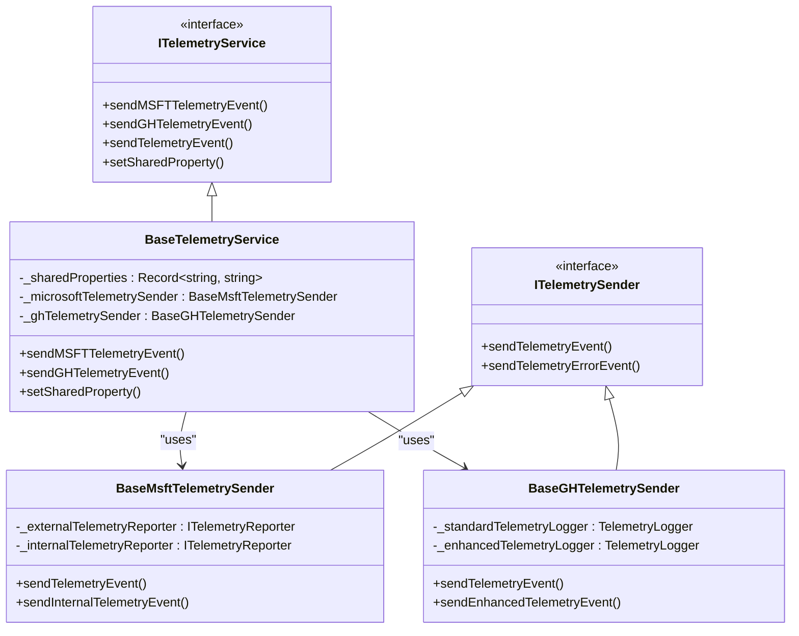
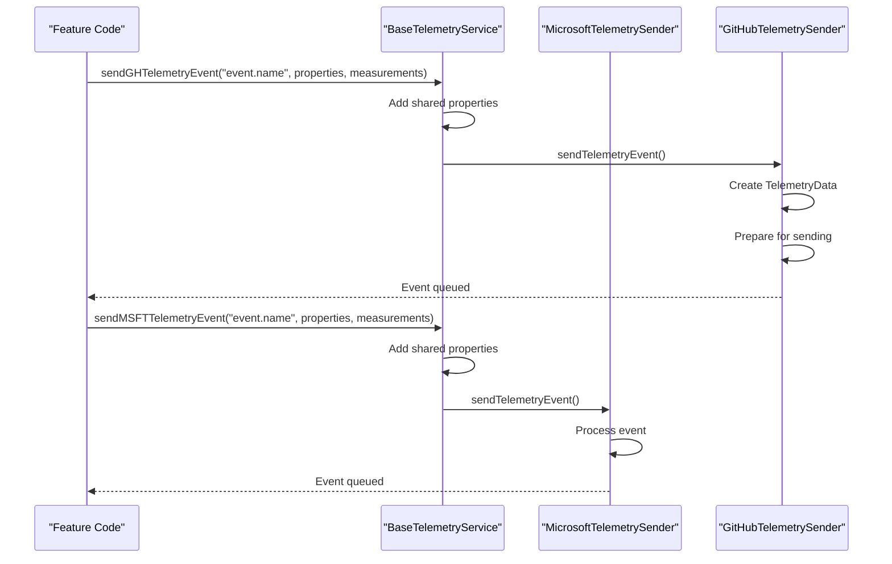
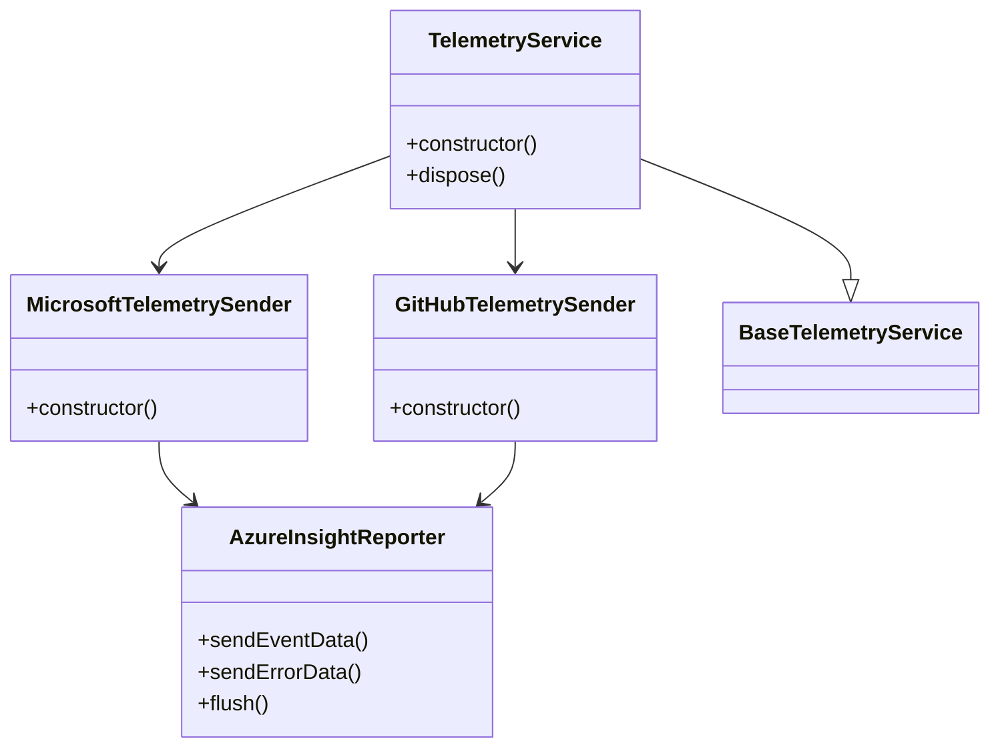
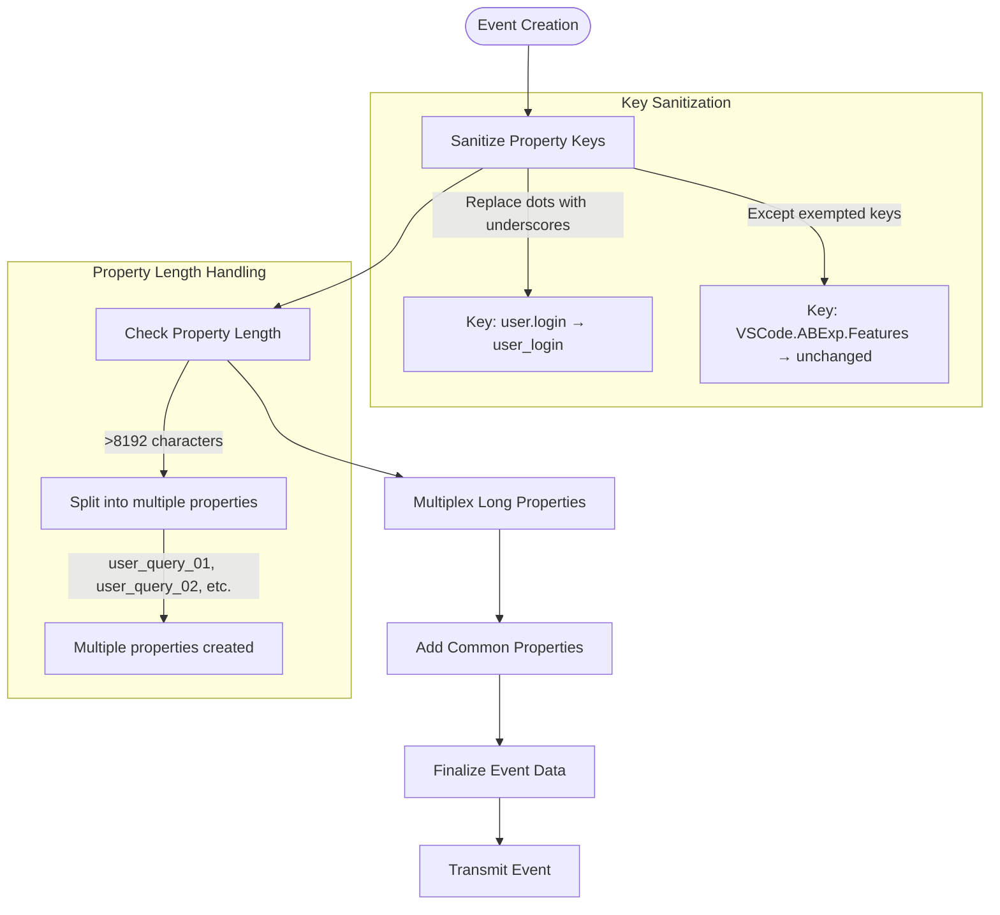
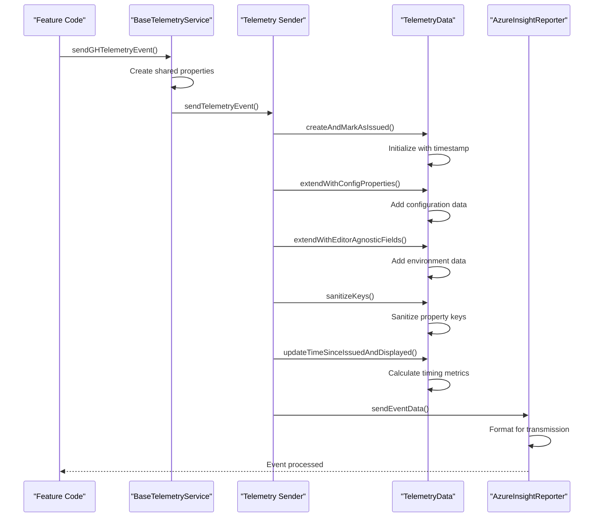
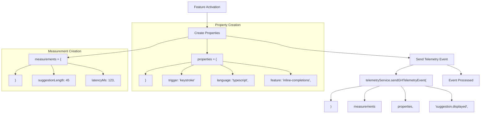
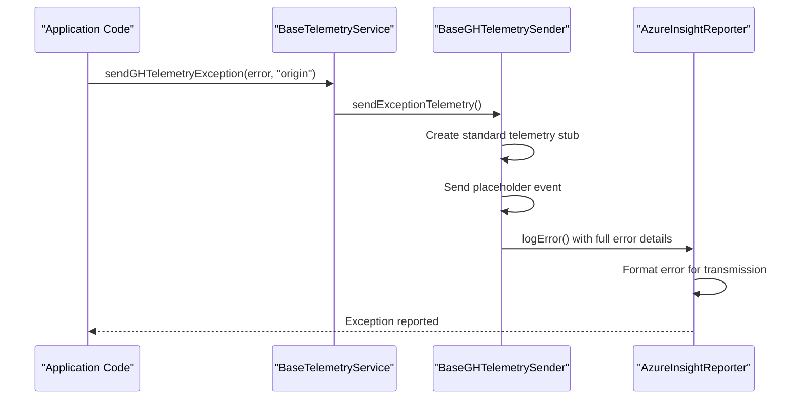

# Telemetry Implementation

<cite>
**Referenced Files in This Document**   
- [baseTelemetryService.ts](file://src/platform/telemetry/common/baseTelemetryService.ts)
- [telemetryServiceImpl.ts](file://src/platform/telemetry/vscode-node/telemetryServiceImpl.ts)
- [azureInsightsReporter.ts](file://src/platform/telemetry/node/azureInsightsReporter.ts)
- [telemetry.ts](file://src/platform/telemetry/common/telemetry.ts)
- [telemetryData.ts](file://src/platform/telemetry/common/telemetryData.ts)
- [msftTelemetrySender.ts](file://src/platform/telemetry/common/msftTelemetrySender.ts)
- [ghTelemetrySender.ts](file://src/platform/telemetry/common/ghTelemetrySender.ts)
- [microsoftTelemetrySender.ts](file://src/platform/telemetry/vscode-node/microsoftTelemetrySender.ts)
- [githubTelemetrySender.ts](file://src/platform/telemetry/vscode-node/githubTelemetrySender.ts)
- [lifecycleTelemetryContrib.ts](file://src/extension/telemetry/common/lifecycleTelemetryContrib.ts)
- [githubTelemetryForwardingContrib.ts](file://src/extension/telemetry/vscode/githubTelemetryForwardingContrib.ts)
</cite>

## Table of Contents
1. [Introduction](#introduction)
2. [Core Architecture](#core-architecture)
3. [Base Telemetry Service](#base-telemetry-service)
4. [Platform-Specific Implementations](#platform-specific-implementations)
5. [Event Schema and Validation](#event-schema-and-validation)
6. [Telemetry Event Lifecycle](#telemetry-event-lifecycle)
7. [Instrumentation Examples](#instrumentation-examples)
8. [Performance Considerations](#performance-considerations)
9. [Error Handling and Exception Reporting](#error-handling-and-exception-reporting)
10. [Configuration and User Settings](#configuration-and-user-settings)

## Introduction

The telemetry implementation in vscode-copilot-chat provides a comprehensive system for collecting, processing, and transmitting usage and performance data across different environments. This documentation details the architecture and functionality of the telemetry system, focusing on how it enables unified event tracking while maintaining flexibility for platform-specific requirements.

The system is designed to support multiple telemetry destinations, including Microsoft and GitHub endpoints, with different levels of data sensitivity and user consent requirements. It provides a consistent interface for feature instrumentation while handling the complexities of data transmission, batching, and retry mechanisms transparently.

**Section sources**
- [baseTelemetryService.ts](file://src/platform/telemetry/common/baseTelemetryService.ts#L1-L173)
- [telemetry.ts](file://src/platform/telemetry/common/telemetry.ts#L1-L217)

## Core Architecture

The telemetry system in vscode-copilot-chat follows a layered architecture with clear separation of concerns. At its core is the `BaseTelemetryService` class that provides a unified interface for event tracking, while delegating the actual transmission to specialized sender components.

**Diagram sources**
- [baseTelemetryService.ts](file://src/platform/telemetry/common/baseTelemetryService.ts#L12-L173)
- [telemetry.ts](file://src/platform/telemetry/common/telemetry.ts#L90-L112)
- [msftTelemetrySender.ts](file://src/platform/telemetry/common/msftTelemetrySender.ts#L17-L135)
- [ghTelemetrySender.ts](file://src/platform/telemetry/common/ghTelemetrySender.ts#L19-L133)

## Base Telemetry Service

The `BaseTelemetryService` serves as the central component for telemetry operations, providing a unified interface for sending events to different destinations. It manages shared properties that are automatically included with all telemetry events and handles the routing of events to appropriate senders based on destination requirements.

The service supports multiple telemetry destinations through the `TelemetryDestination` interface, which allows specifying whether events should be sent to GitHub, Microsoft, or both systems. It also maintains shared properties that are automatically appended to all events, such as experiment assignments and user configuration data.

Key features of the base service include:
- Unified event sending interface across platforms
- Automatic inclusion of shared properties
- Support for both standard and error telemetry events
- Management of telemetry senders and their lifecycle

**Diagram sources**
- [baseTelemetryService.ts](file://src/platform/telemetry/common/baseTelemetryService.ts#L58-L172)
- [telemetry.ts](file://src/platform/telemetry/common/telemetry.ts#L85-L88)

**Section sources**
- [baseTelemetryService.ts](file://src/platform/telemetry/common/baseTelemetryService.ts#L12-L173)

## Platform-Specific Implementations

The telemetry system includes platform-specific implementations that adapt the core functionality to different execution environments. The primary implementation for the VS Code environment is `TelemetryService`, which extends the base service with VS Code-specific initialization and configuration.

### VS Code Implementation

The `TelemetryService` implementation in `telemetryServiceImpl.ts` is specifically designed for the VS Code environment. It initializes both Microsoft and GitHub telemetry senders with the appropriate configuration and authentication tokens. The service integrates with VS Code's extension lifecycle, ensuring proper initialization and cleanup.

**Diagram sources**
- [telemetryServiceImpl.ts](file://src/platform/telemetry/vscode-node/telemetryServiceImpl.ts#L19-L68)
- [microsoftTelemetrySender.ts](file://src/platform/telemetry/vscode-node/microsoftTelemetrySender.ts#L10-L30)
- [githubTelemetrySender.ts](file://src/platform/telemetry/vscode-node/githubTelemetrySender.ts#L16-L37)

### Node.js Implementation

For Node.js environments, the system uses `AzureInsightsReporter` as the underlying implementation for sending telemetry data to Application Insights. This reporter handles the actual HTTP transmission of telemetry events, including batching, compression, and retry logic.

The `AzureInsightReporter` class implements the `TelemetrySender` interface and provides methods for sending both event and error data. It uses the Application Insights SDK to format and transmit data, with custom configuration to disable automatic collection of system data and to set appropriate endpoint URLs.

**Section sources**
- [telemetryServiceImpl.ts](file://src/platform/telemetry/vscode-node/telemetryServiceImpl.ts#L19-L68)
- [azureInsightsReporter.ts](file://src/platform/telemetry/node/azureInsightsReporter.ts#L28-L131)

## Event Schema and Validation

The telemetry system enforces a consistent schema for all events through the `TelemetryData` class, which defines the structure and validation rules for telemetry properties and measurements.

### Data Structure

Telemetry events consist of three main components:
- **Properties**: String key-value pairs containing descriptive information about the event
- **Measurements**: Numeric key-value pairs containing quantitative data
- **Timestamps**: Creation and display times for the event

The system applies several validation and transformation rules to ensure data quality and consistency:

**Diagram sources**
- [telemetryData.ts](file://src/platform/telemetry/common/telemetryData.ts#L12-L208)
- [telemetry.ts](file://src/platform/telemetry/common/telemetry.ts#L186-L217)

### Validation Rules

The system enforces the following validation rules:

1. **Key Sanitization**: All property keys are sanitized by replacing dots with underscores, except for specific exempted keys like `VSCode.ABExp.Features` and `abexp.assignmentcontext`.

2. **Property Length**: Properties longer than 8,192 characters are split into multiple properties with numbered suffixes (e.g., `user_query_01`, `user_query_02`).

3. **Required Properties**: Essential properties like `unique_id`, `common_extname`, and `common_extversion` are automatically added to all events.

4. **Type Validation**: Measurement values must be numeric; non-numeric values are filtered out.

**Section sources**
- [telemetryData.ts](file://src/platform/telemetry/common/telemetryData.ts#L139-L208)
- [telemetry.ts](file://src/platform/telemetry/common/telemetry.ts#L186-L217)

## Telemetry Event Lifecycle

The telemetry event lifecycle encompasses the complete journey of an event from creation to transmission, including batching, queuing, and retry mechanisms.

### Event Creation and Processing

When a telemetry event is created, it goes through the following stages:

**Diagram sources**
- [telemetryData.ts](file://src/platform/telemetry/common/telemetryData.ts#L34-L181)
- [ghTelemetrySender.ts](file://src/platform/telemetry/common/ghTelemetrySender.ts#L67-L121)

### Batching and Transmission

The system implements batching to improve network efficiency and reduce the number of HTTP requests. Events are queued and transmitted in batches, with configurable flush intervals and retry mechanisms.

Key aspects of the batching strategy include:
- Events are collected in memory before transmission
- Batches are compressed using gzip to reduce payload size
- Failed transmissions are retried with exponential backoff
- A flush mechanism ensures events are sent before shutdown

**Section sources**
- [telemetryData.ts](file://src/platform/telemetry/common/telemetryData.ts#L168-L181)
- [azureInsightsReporter.ts](file://src/platform/telemetry/node/azureInsightsReporter.ts#L53-L81)

## Instrumentation Examples

The telemetry system provides multiple methods for instrumenting features with telemetry events, ranging from simple event logging to complex scenario tracking.

### Basic Event Instrumentation

Features can send telemetry events using the various send methods provided by the telemetry service:

**Diagram sources**
- [lifecycleTelemetryContrib.ts](file://src/extension/telemetry/common/lifecycleTelemetryContrib.ts#L13-L17)
- [githubTelemetryForwardingContrib.ts](file://src/extension/telemetry/vscode/githubTelemetryForwardingContrib.ts#L25-L26)

### Advanced Instrumentation Patterns

The system supports advanced instrumentation patterns such as:

1. **Event Chaining**: Creating sequences of related events using the `extendedBy` method to inherit properties from previous events.

2. **Timing Measurements**: Using `markAsDisplayed()` and automatic timing calculations to measure user interaction latency.

3. **Conditional Telemetry**: Sending different event types based on user consent and configuration settings.

4. **Exception Handling**: Specialized methods for capturing and reporting errors with context.

**Section sources**
- [telemetryData.ts](file://src/platform/telemetry/common/telemetryData.ts#L59-L63)
- [baseTelemetryService.ts](file://src/platform/telemetry/common/baseTelemetryService.ts#L80-L82)

## Performance Considerations

The telemetry implementation includes several performance optimizations to minimize impact on the user experience while maintaining data collection reliability.

### Memory Usage

The system manages memory usage through:
- Event queuing with bounded memory consumption
- Automatic cleanup of completed transmissions
- Efficient data structures for property storage

### Network Efficiency

Network efficiency is optimized through:
- **Batching**: Multiple events are transmitted in a single HTTP request
- **Compression**: Payloads are gzip-compressed to reduce bandwidth usage
- **Connection Reuse**: HTTP connections are reused when possible
- **Asynchronous Transmission**: Events are sent without blocking the main thread

### Batching Strategies

The batching strategy balances data freshness with network efficiency:

- Events are batched in memory before transmission
- Batches are flushed periodically or when reaching size thresholds
- Critical events (errors) may be sent immediately
- A flush mechanism ensures all pending events are sent during shutdown

**Section sources**
- [azureInsightsReporter.ts](file://src/platform/telemetry/node/azureInsightsReporter.ts#L73-L81)
- [ghTelemetrySender.ts](file://src/platform/telemetry/common/ghTelemetrySender.ts#L67-L72)

## Error Handling and Exception Reporting

The telemetry system includes robust error handling mechanisms to ensure reliable data transmission and to capture system errors for diagnostic purposes.

### Transmission Error Handling

When telemetry transmission fails, the system:
- Logs the failure internally
- Implements retry logic with exponential backoff
- Preserves events for retry attempts
- Provides feedback on transmission status

### Exception Reporting

The system provides specialized methods for reporting exceptions and errors:

The exception reporting system sends a placeholder event to standard telemetry (when enabled) while transmitting the full error details to enhanced telemetry endpoints when user consent is granted.

**Diagram sources**
- [baseTelemetryService.ts](file://src/platform/telemetry/common/baseTelemetryService.ts#L80-L82)
- [ghTelemetrySender.ts](file://src/platform/telemetry/common/ghTelemetrySender.ts#L86-L110)

**Section sources**
- [baseTelemetryService.ts](file://src/platform/telemetry/common/baseTelemetryService.ts#L80-L82)
- [ghTelemetrySender.ts](file://src/platform/telemetry/common/ghTelemetrySender.ts#L86-L110)

## Configuration and User Settings

The telemetry system respects user privacy settings and organizational policies through a flexible configuration system.

### User Consent Management

The system checks user consent through the `ITelemetryUserConfig` interface, which provides:
- User tracking ID
- Organizations list
- Opt-in status for enhanced telemetry

Enhanced telemetry (containing potentially sensitive data like user prompts) is only sent when explicitly enabled by the user.

### Destination Routing

The system routes events to appropriate destinations based on:
- User consent settings
- Data sensitivity requirements
- Organizational policies
- Event type (standard vs. error vs. exception)

This ensures compliance with privacy regulations while still collecting valuable diagnostic and usage data.

**Section sources**
- [telemetry.ts](file://src/platform/telemetry/common/telemetry.ts#L38-L79)
- [ghTelemetrySender.ts](file://src/platform/telemetry/common/ghTelemetrySender.ts#L57-L64)