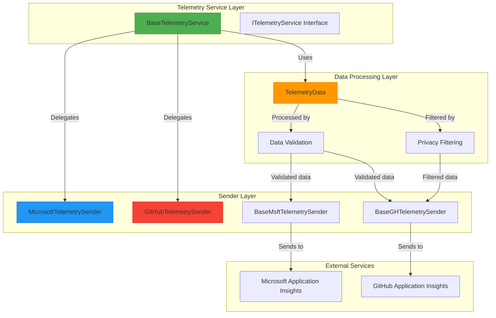
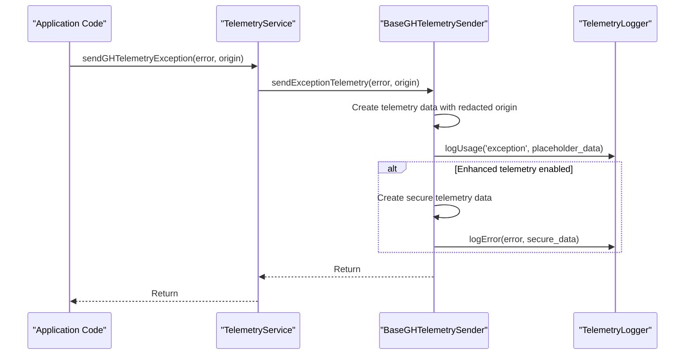
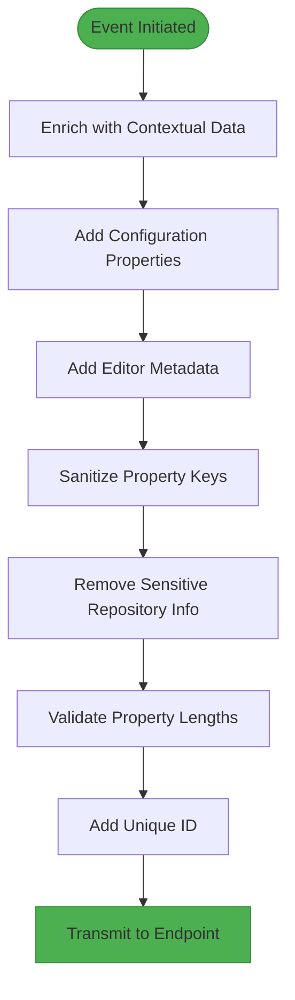
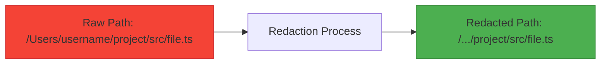
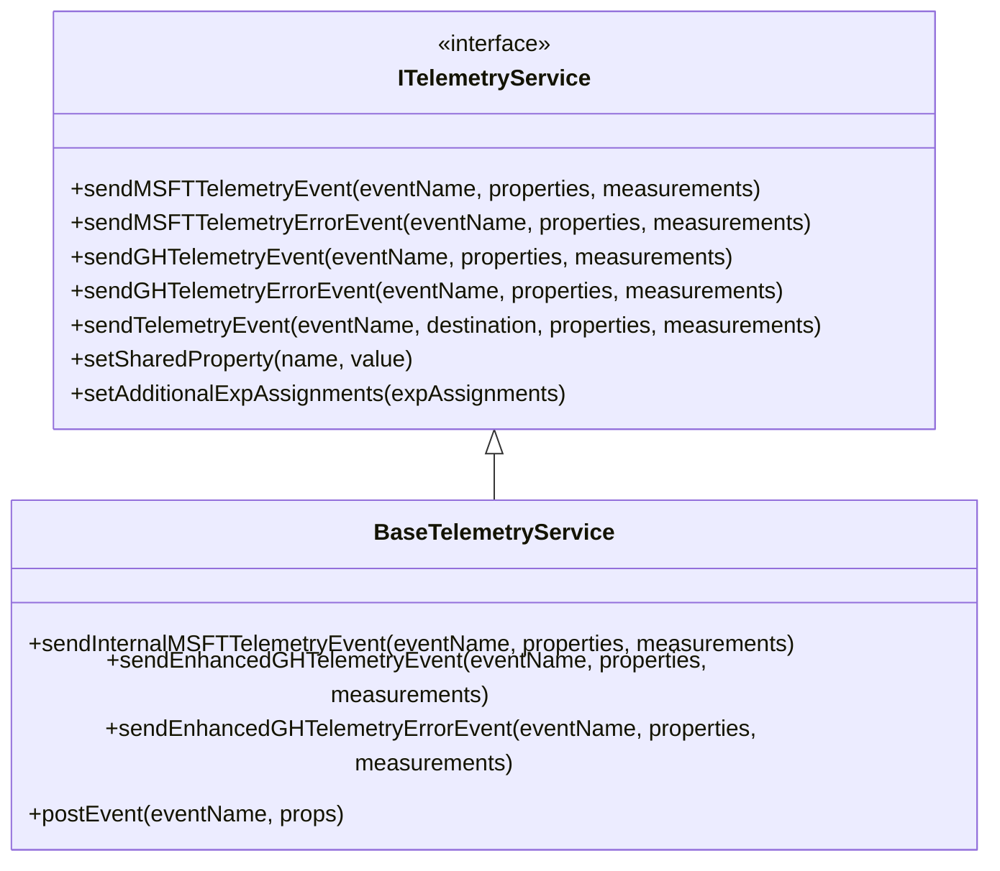

# Telemetry Service

<cite>
**Referenced Files in This Document**   
- [baseTelemetryService.ts](file://src/platform/telemetry/common/baseTelemetryService.ts)
- [ghTelemetrySender.ts](file://src/platform/telemetry/common/ghTelemetrySender.ts)
- [msftTelemetrySender.ts](file://src/platform/telemetry/common/msftTelemetrySender.ts)
- [telemetry.ts](file://src/platform/telemetry/common/telemetry.ts)
- [telemetryData.ts](file://src/platform/telemetry/common/telemetryData.ts)
- [baseExperimentationService.ts](file://src/platform/telemetry/node/baseExperimentationService.ts)
- [telemetryServiceImpl.ts](file://src/platform/telemetry/vscode-node/telemetryServiceImpl.ts)
- [githubTelemetrySender.ts](file://src/platform/telemetry/vscode-node/githubTelemetrySender.ts)
- [microsoftTelemetrySender.ts](file://src/platform/telemetry/vscode-node/microsoftTelemetrySender.ts)
</cite>

## Table of Contents
1. [Introduction](#introduction)
2. [Architecture Overview](#architecture-overview)
3. [Core Components](#core-components)
4. [Telemetry Senders](#telemetry-senders)
5. [Event Batching and Transmission](#event-batching-and-transmission)
6. [Error Handling and Exception Reporting](#error-handling-and-exception-reporting)
7. [Data Structure and Validation](#data-structure-and-validation)
8. [Privacy Considerations](#privacy-considerations)
9. [Instrumentation and Event Tracking](#instrumentation-and-event-tracking)
10. [Experimentation Service Integration](#experimentation-service-integration)
11. [Conclusion](#conclusion)

## Introduction

The Telemetry Service in the vscode-copilot-chat platform layer provides a unified interface for collecting, processing, and transmitting telemetry data across different platforms and environments. This service abstracts the complexities of telemetry reporting, enabling consistent event tracking and data collection while respecting user privacy and compliance requirements.

The telemetry system is designed to support multiple destinations, including GitHub and Microsoft endpoints, with different levels of data sensitivity and collection policies. It implements robust error handling, data validation, and privacy safeguards to ensure reliable and compliant telemetry operations.

**Section sources**
- [baseTelemetryService.ts](file://src/platform/telemetry/common/baseTelemetryService.ts#L1-L173)
- [telemetry.ts](file://src/platform/telemetry/common/telemetry.ts#L1-L217)

## Architecture Overview

The Telemetry Service architecture follows a layered design pattern with clear separation of concerns. At its core, the service provides a consistent API for event tracking while delegating the actual transmission to specialized sender components for different telemetry endpoints.



**Diagram sources**
- [baseTelemetryService.ts](file://src/platform/telemetry/common/baseTelemetryService.ts#L12-L173)
- [ghTelemetrySender.ts](file://src/platform/telemetry/common/ghTelemetrySender.ts#L19-L133)
- [msftTelemetrySender.ts](file://src/platform/telemetry/common/msftTelemetrySender.ts#L17-L135)
- [telemetryData.ts](file://src/platform/telemetry/common/telemetryData.ts#L12-L208)

## Core Components

The Telemetry Service consists of several core components that work together to provide a comprehensive telemetry solution. The `BaseTelemetryService` class serves as the primary entry point, implementing the `ITelemetryService` interface and coordinating between different telemetry senders.

The service supports multiple telemetry destinations through the `TelemetryDestination` type, which allows events to be sent to GitHub, Microsoft, or both endpoints. It also provides specialized methods for sending events to specific destinations, such as `sendMSFTTelemetryEvent` and `sendGHTelemetryEvent`.

The `BaseTelemetryService` maintains shared properties that are automatically included with all telemetry events, enabling consistent tracking of user context and experimentation assignments across the system.

**Section sources**
- [baseTelemetryService.ts](file://src/platform/telemetry/common/baseTelemetryService.ts#L12-L173)
- [telemetry.ts](file://src/platform/telemetry/common/telemetry.ts#L85-L112)

## Telemetry Senders

### GitHub Telemetry Sender

The GitHub Telemetry Sender implementation handles telemetry transmission to GitHub's Application Insights endpoints. It supports both standard and enhanced telemetry collection, with enhanced telemetry requiring explicit user consent.

```mermaid
classDiagram
class BaseGHTelemetrySender {
+_standardTelemetryLogger : TelemetryLogger
+_enhancedTelemetryLogger : TelemetryLogger
+_disposables : DisposableStore
+sendTelemetryEvent(eventName, properties, measurements)
+sendTelemetryErrorEvent(eventName, properties, measurements)
+sendEnhancedTelemetryEvent(eventName, properties, measurements)
+sendEnhancedTelemetryErrorEvent(eventName, properties, measurements)
+sendExceptionTelemetry(maybeError, origin)
+dispose()
}
class GitHubTelemetrySender {
+constructor(configService, envService, telemetryConfig, domainService, capiClientService, extensionName, standardTelemetryAIKey, enhancedTelemetryAIKey, tokenStore)
}
BaseGHTelemetrySender <|-- GitHubTelemetrySender
GitHubTelemetrySender --> AzureInsightReporter
GitHubTelemetrySender --> CapiClientService
GitHubTelemetrySender --> EnvService
note right of BaseGHTelemetrySender
Base class providing common functionality
for GitHub telemetry transmission
end note
note right of GitHubTelemetrySender
Platform-specific implementation
for VS Code environment
end note
```

**Diagram sources**
- [ghTelemetrySender.ts](file://src/platform/telemetry/common/ghTelemetrySender.ts#L19-L133)
- [githubTelemetrySender.ts](file://src/platform/telemetry/vscode-node/githubTelemetrySender.ts#L16-L37)

### Microsoft Telemetry Sender

The Microsoft Telemetry Sender handles transmission of telemetry data to Microsoft's Application Insights endpoints. It supports internal and external telemetry reporting with different data collection policies.

```mermaid
classDiagram
class BaseMsftTelemetrySender {
+_internalTelemetryReporter : ITelemetryReporter
+_internalLargeEventTelemetryReporter : ITelemetryReporter
+_externalTelemetryReporter : ITelemetryReporter
+_disposables : DisposableStore
+_username : string
+_vscodeTeamMember : boolean
+_sku : string
+_tid : string
+_isInternal : boolean
+sendInternalTelemetryEvent(eventName, properties, measurements)
+sendTelemetryEvent(eventName, properties, measurements)
+sendTelemetryErrorEvent(eventName, properties, measurements)
+postEvent(eventName, props)
+dispose()
-processToken(token)
}
class MicrosoftTelemetrySender {
+constructor(internalMSFTAIKey, internalLargeEventMSFTAIKey, externalMSFTAIKey, copilotTokenStore, createTelemetryReporter)
}
BaseMsftTelemetrySender <|-- MicrosoftTelemetrySender
MicrosoftTelemetrySender --> ITelemetryReporter
MicrosoftTelemetrySender --> CopilotTokenStore
note right of BaseMsftTelemetrySender
Base class providing common functionality
for Microsoft telemetry transmission
end note
note right of MicrosoftTelemetrySender
Platform-specific implementation
with AI key configuration
end note
```

**Diagram sources**
- [msftTelemetrySender.ts](file://src/platform/telemetry/common/msftTelemetrySender.ts#L17-L135)
- [microsoftTelemetrySender.ts](file://src/platform/telemetry/vscode-node/microsoftTelemetrySender.ts)

## Event Batching and Transmission

The Telemetry Service implements event batching to optimize network transmission and reduce overhead. Events are collected and sent in batches according to the underlying telemetry framework's implementation.

The service leverages VS Code's built-in telemetry infrastructure, which handles the actual batching and transmission mechanics. The `AzureInsightReporter` class, used by both GitHub and Microsoft senders, integrates with this infrastructure to ensure efficient data transmission.

When events are sent, they pass through a processing pipeline that includes:
1. Data enrichment with contextual information
2. Validation and sanitization
3. Privacy filtering
4. Batching by the underlying telemetry framework
5. Secure transmission to the appropriate endpoint

The service does not implement custom batching logic but relies on the robust batching mechanisms provided by the VS Code telemetry system and Application Insights SDK.

**Section sources**
- [ghTelemetrySender.ts](file://src/platform/telemetry/common/ghTelemetrySender.ts#L67-L133)
- [msftTelemetrySender.ts](file://src/platform/telemetry/common/msftTelemetrySender.ts#L81-L107)

## Error Handling and Exception Reporting

The Telemetry Service implements comprehensive error handling to ensure reliable operation and proper reporting of issues.

### Standard Error Reporting

For standard telemetry errors, the service uses the `sendTelemetryErrorEvent` method, which follows the same processing pipeline as regular events but with error-specific classification.

### Exception Handling

The service provides specialized exception reporting through the `sendGHTelemetryException` method:



**Diagram sources**
- [ghTelemetrySender.ts](file://src/platform/telemetry/common/ghTelemetrySender.ts#L86-L110)
- [baseTelemetryService.ts](file://src/platform/telemetry/common/baseTelemetryService.ts#L80-L82)

The exception reporting system implements a dual-path approach:
- A placeholder event is sent to standard telemetry with redacted information
- The full error details are sent to enhanced telemetry only if the user has explicitly enabled enhanced telemetry collection

This ensures that critical error information is captured while respecting user privacy preferences.

## Data Structure and Validation

### Telemetry Data Model

The telemetry system uses a structured data model to ensure consistency and proper processing of telemetry events.

```mermaid
classDiagram
class TelemetryData {
+properties : TelemetryProperties
+measurements : { [key : string] : number | undefined }
+issuedTime : number
+displayedTime? : number
+createAndMarkAsIssued(properties, measurements)
+extendedBy(properties, measurements)
+markAsDisplayed()
+extendWithEditorAgnosticFields(envService)
+extendWithConfigProperties(configService, envService, telemetryConfig)
+extendWithRequestId(requestId)
+sanitizeKeys()
+makeReadyForSending(configService, envService, telemetryConfig)
}
class TelemetryProperties {
<<interface>>
+[key : string] : string
}
class TelemetryEventProperties {
<<interface>>
+[key : string] : string | TelemetryTrustedValue<string> | undefined
}
class TelemetryEventMeasurements {
<<interface>>
+[key : string] : number | undefined
}
class TelemetryTrustedValue~T~ {
+isTrustedTelemetryValue : true
+value : T
}
TelemetryData --> TelemetryProperties
TelemetryData --> TelemetryEventProperties
TelemetryData --> TelemetryEventMeasurements
TelemetryEventProperties --> TelemetryTrustedValue
```

**Diagram sources**
- [telemetryData.ts](file://src/platform/telemetry/common/telemetryData.ts#L12-L208)
- [telemetry.ts](file://src/platform/telemetry/common/telemetry.ts#L13-L20)

### Data Validation and Processing

The telemetry data undergoes several validation and processing steps before transmission:



**Diagram sources**
- [telemetryData.ts](file://src/platform/telemetry/common/telemetryData.ts#L168-L180)

The `makeReadyForSending` method orchestrates this processing pipeline, ensuring that all telemetry events are properly formatted and validated before transmission. The system also implements property length validation, with long properties being split into multiple properties to comply with size limits.

## Privacy Considerations

The Telemetry Service implements several privacy safeguards to protect user data and comply with privacy regulations.

### Data Redaction

The service uses path redaction to protect sensitive file path information:



**Diagram sources**
- [ghTelemetrySender.ts](file://src/platform/telemetry/common/ghTelemetrySender.ts#L7)
- [telemetryData.ts](file://src/platform/telemetry/common/telemetryData.ts#L110-L137)

### Enhanced Telemetry Control

Enhanced telemetry, which may include more detailed information such as user prompts and suggestions, is subject to additional privacy controls:

- Requires explicit user consent through Copilot settings
- Can be disabled via VS Code telemetry settings
- Uses separate authentication keys for enhanced data collection
- Implements dual-path exception reporting to balance diagnostic needs with privacy

The service respects the `rt` token value from the Copilot authentication token, which indicates whether enhanced telemetry is enabled for the user.

**Section sources**
- [ghTelemetrySender.ts](file://src/platform/telemetry/common/ghTelemetrySender.ts#L57-L64)
- [telemetry.ts](file://src/platform/telemetry/common/telemetry.ts#L70-L76)

## Instrumentation and Event Tracking

### Event Tracking API

The Telemetry Service provides a comprehensive API for instrumenting features and tracking events:



**Diagram sources**
- [telemetry.ts](file://src/platform/telemetry/common/telemetry.ts#L90-L112)
- [baseTelemetryService.ts](file://src/platform/telemetry/common/baseTelemetryService.ts)

### Adding New Telemetry Events

When adding new telemetry events, follow these best practices:

1. **Choose the appropriate destination**:
   - Use `sendGHTelemetryEvent` for events primarily relevant to GitHub
   - Use `sendMSFTTelemetryEvent` for internal Microsoft telemetry
   - Use `sendTelemetryEvent` with specific destinations when needed

2. **Structure properties appropriately**:
   - Use descriptive property names with dot notation (e.g., "feature.enabled")
   - Keep property values concise and avoid personally identifiable information
   - Use measurements for numerical data and properties for categorical data

3. **Respect privacy**:
   - Avoid including sensitive data in telemetry events
   - Use enhanced telemetry only when necessary and with proper consent
   - Redact file paths and other potentially sensitive information

4. **Follow performance guidelines**:
   - Minimize the number of telemetry events in performance-critical paths
   - Batch related events when possible
   - Use appropriate event types (usage vs. error)

**Section sources**
- [baseTelemetryService.ts](file://src/platform/telemetry/common/baseTelemetryService.ts)
- [telemetry.ts](file://src/platform/telemetry/common/telemetry.ts)

## Experimentation Service Integration

The Telemetry Service integrates with the Experimentation Service to support A/B testing and feature flag management.

### Experimentation Architecture

```mermaid
classDiagram
class IExperimentationService {
<<interface>>
+getTreatmentVariable(name)
+onDidTreatmentsChange
}
class BaseExperimentationService {
+_delegate : ITASExperimentationService
+_userInfoStore : UserInfoStore
+_refreshTimer : IntervalTimer
+_previouslyReadTreatments : Map
+getTreatmentVariable(name)
+hasTreatments()
+setCompletionsFilters(filters)
}
class UserInfoStore {
+_internalOrg : string
+_sku : string
+_isFcv1 : boolean
+onDidChangeUserInfo
+updateUserInfo(internalOrg, sku, isFcv1)
}
IExperimentationService <|-- BaseExperimentationService
BaseExperimentationService --> UserInfoStore
BaseExperimentationService --> ITASExperimentationService
note right of BaseExperimentationService
Manages experimentation state and
integrates with telemetry system
end note
note right of UserInfoStore
Stores user information for
experimentation targeting
end note
```

**Diagram sources**
- [baseExperimentationService.ts](file://src/platform/telemetry/node/baseExperimentationService.ts)

### Integration with Telemetry

The Experimentation Service integrates with telemetry through shared properties and event correlation:

1. **AB Testing Context**: Experiment assignments are included in telemetry events via the `abexp.assignmentcontext` property
2. **Feature Flag Tracking**: Feature flag states are captured in telemetry to analyze feature usage and impact
3. **Treatment Change Detection**: The service monitors for changes in experiment treatments and updates telemetry context accordingly

The integration enables comprehensive analysis of A/B test results by correlating user behavior (captured in telemetry) with their experiment group assignments.

**Section sources**
- [baseTelemetryService.ts](file://src/platform/telemetry/common/baseTelemetryService.ts#L128-L146)
- [baseExperimentationService.ts](file://src/platform/telemetry/node/baseExperimentationService.ts)

## Conclusion

The Telemetry Service in vscode-copilot-chat provides a robust, privacy-conscious framework for collecting and analyzing usage data across multiple platforms. By abstracting the complexities of telemetry reporting, it enables consistent event tracking while respecting user privacy and compliance requirements.

Key features of the service include:
- Multi-platform support for GitHub and Microsoft telemetry endpoints
- Comprehensive error handling and exception reporting
- Robust data validation and privacy safeguards
- Seamless integration with experimentation and feature flag systems
- Flexible API for instrumenting features and tracking events

The service architecture balances the need for detailed usage insights with strong privacy protections, ensuring that telemetry collection enhances the user experience without compromising user trust.