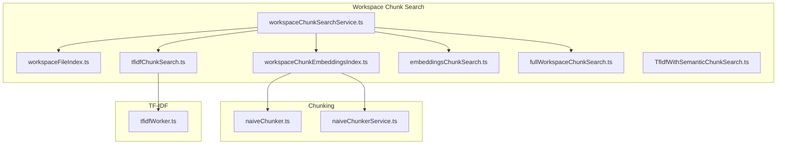
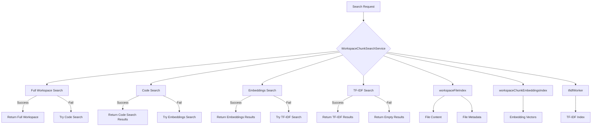
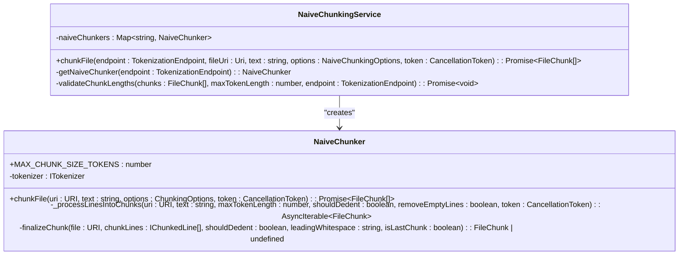
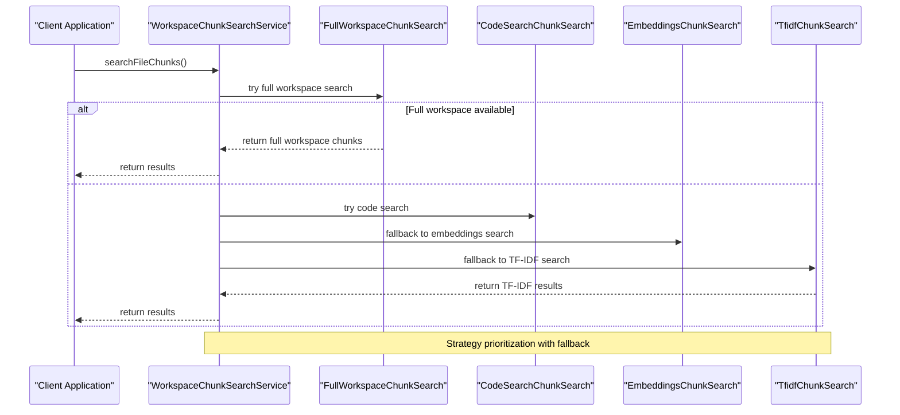
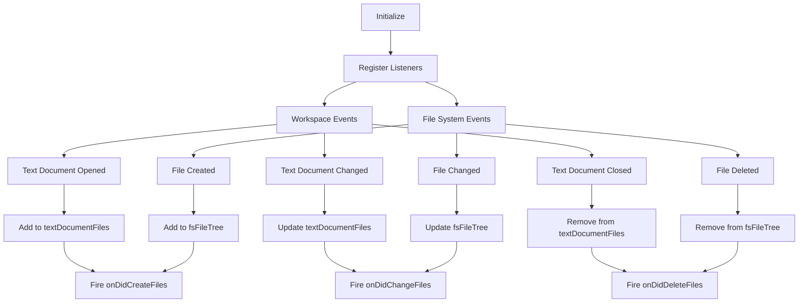
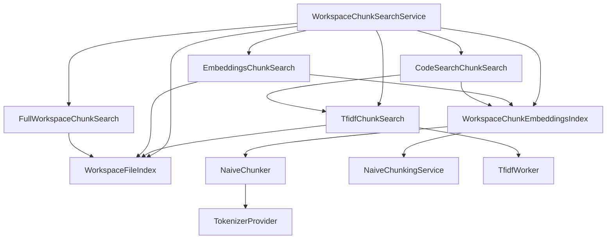

# Chunk Search

<cite>
**Referenced Files in This Document**   
- [workspaceChunkSearchService.ts](file://src/platform/workspaceChunkSearch/node/workspaceChunkSearchService.ts)
- [workspaceFileIndex.ts](file://src/platform/workspaceChunkSearch/node/workspaceFileIndex.ts)
- [naiveChunker.ts](file://src/platform/chunking/node/naiveChunker.ts)
- [naiveChunkerService.ts](file://src/platform/chunking/node/naiveChunkerService.ts)
- [tfidfChunkSearch.ts](file://src/platform/workspaceChunkSearch/node/tfidfChunkSearch.ts)
- [embeddingsChunkSearch.ts](file://src/platform/workspaceChunkSearch/node/embeddingsChunkSearch.ts)
- [fullWorkspaceChunkSearch.ts](file://src/platform/workspaceChunkSearch/node/fullWorkspaceChunkSearch.ts)
- [workspaceChunkSearch.ts](file://src/platform/workspaceChunkSearch/common/workspaceChunkSearch.ts)
- [workspaceChunkEmbeddingsIndex.ts](file://src/platform/workspaceChunkSearch/node/workspaceChunkEmbeddingsIndex.ts)
- [tfidfWorker.ts](file://src/platform/tfidf/node/tfidfWorker.ts)
</cite>

## Table of Contents
1. [Introduction](#introduction)
2. [Project Structure](#project-structure)
3. [Core Components](#core-components)
4. [Architecture Overview](#architecture-overview)
5. [Detailed Component Analysis](#detailed-component-analysis)
6. [Dependency Analysis](#dependency-analysis)
7. [Performance Considerations](#performance-considerations)
8. [Troubleshooting Guide](#troubleshooting-guide)
9. [Conclusion](#conclusion)

## Introduction
The Chunk Search functionality in the workspace service provides an advanced system for breaking down code into manageable chunks and enabling efficient searching and indexing. This system supports multiple search strategies including TF-IDF, embeddings, and semantic search to enhance code retrieval accuracy. The architecture is designed to handle file indexing, caching, and incremental updates through components like workspaceFileIndex and workspaceChunkSearchService. The integration of text-based search with vector-based embeddings improves context retrieval during AI conversations, making it particularly effective for large repositories. This documentation details the implementation, performance characteristics, and integration points of the chunk search system.

## Project Structure
The chunk search functionality is organized within the workspaceChunkSearch module, which contains implementations for various search strategies and indexing mechanisms. The core components are divided into common, node, and test directories, with additional support from the chunking and tfidf modules.

**Diagram sources**
- [workspaceChunkSearchService.ts](file://src/platform/workspaceChunkSearch/node/workspaceChunkSearchService.ts)
- [workspaceFileIndex.ts](file://src/platform/workspaceChunkSearch/node/workspaceFileIndex.ts)
- [naiveChunker.ts](file://src/platform/chunking/node/naiveChunker.ts)
- [naiveChunkerService.ts](file://src/platform/chunking/node/naiveChunkerService.ts)
- [tfidfChunkSearch.ts](file://src/platform/workspaceChunkSearch/node/tfidfChunkSearch.ts)
- [tfidfWorker.ts](file://src/platform/tfidf/node/tfidfWorker.ts)

**Section sources**
- [workspaceChunkSearchService.ts](file://src/platform/workspaceChunkSearch/node/workspaceChunkSearchService.ts)
- [workspaceFileIndex.ts](file://src/platform/workspaceChunkSearch/node/workspaceFileIndex.ts)

## Core Components
The core components of the Chunk Search system include the workspaceChunkSearchService, which orchestrates search operations across multiple strategies, and the workspaceFileIndex, which manages file indexing and content retrieval. The naive chunker implementation breaks code into chunks of approximately 250 tokens using a scrolling window approach, while various search strategies (TF-IDF, embeddings, semantic) provide different approaches to finding relevant code. The system integrates text-based search with vector-based embeddings to improve retrieval accuracy, with components like workspaceChunkEmbeddingsIndex managing the embedding vectors for efficient similarity calculations.

**Section sources**
- [workspaceChunkSearchService.ts](file://src/platform/workspaceChunkSearch/node/workspaceChunkSearchService.ts)
- [workspaceFileIndex.ts](file://src/platform/workspaceChunkSearch/node/workspaceFileIndex.ts)
- [naiveChunker.ts](file://src/platform/chunking/node/naiveChunker.ts)

## Architecture Overview
The Chunk Search architecture follows a strategy pattern where multiple search implementations can be used based on the context and requirements. The system prioritizes search strategies based on availability and performance characteristics, with a fallback mechanism to ensure results are returned even if primary strategies fail.

**Diagram sources**
- [workspaceChunkSearchService.ts](file://src/platform/workspaceChunkSearch/node/workspaceChunkSearchService.ts)
- [workspaceFileIndex.ts](file://src/platform/workspaceChunkSearch/node/workspaceFileIndex.ts)
- [workspaceChunkEmbeddingsIndex.ts](file://src/platform/workspaceChunkSearch/node/workspaceChunkEmbeddingsIndex.ts)
- [tfidfWorker.ts](file://src/platform/tfidf/node/tfidfWorker.ts)

## Detailed Component Analysis

### Chunking Implementation
The naive chunking approach breaks code files into manageable chunks for indexing and search. This implementation uses a scrolling window technique to create overlapping chunks that preserve context across boundaries.

**Diagram sources**
- [naiveChunker.ts](file://src/platform/chunking/node/naiveChunker.ts)
- [naiveChunkerService.ts](file://src/platform/chunking/node/naiveChunkerService.ts)

### Search Strategies
The system implements multiple search strategies that are tried in order of preference, with fallback mechanisms to ensure results are returned even if primary strategies fail or time out.

**Diagram sources**
- [workspaceChunkSearchService.ts](file://src/platform/workspaceChunkSearch/node/workspaceChunkSearchService.ts)
- [fullWorkspaceChunkSearch.ts](file://src/platform/workspaceChunkSearch/node/fullWorkspaceChunkSearch.ts)
- [embeddingsChunkSearch.ts](file://src/platform/workspaceChunkSearch/node/embeddingsChunkSearch.ts)
- [tfidfChunkSearch.ts](file://src/platform/workspaceChunkSearch/node/tfidfChunkSearch.ts)

### Indexing and Caching
The workspaceFileIndex component manages file indexing with support for both file system files and text document files, providing a unified interface for content retrieval.

**Diagram sources**
- [workspaceFileIndex.ts](file://src/platform/workspaceChunkSearch/node/workspaceFileIndex.ts)

## Dependency Analysis
The Chunk Search system has a well-defined dependency structure with clear separation of concerns between components. The main service orchestrates multiple search strategies, each with their own dependencies on indexing and chunking components.

**Diagram sources**
- [workspaceChunkSearchService.ts](file://src/platform/workspaceChunkSearch/node/workspaceChunkSearchService.ts)
- [workspaceFileIndex.ts](file://src/platform/workspaceChunkSearch/node/workspaceFileIndex.ts)
- [workspaceChunkEmbeddingsIndex.ts](file://src/platform/workspaceChunkSearch/node/workspaceChunkEmbeddingsIndex.ts)
- [tfidfChunkSearch.ts](file://src/platform/workspaceChunkSearch/node/tfidfChunkSearch.ts)
- [embeddingsChunkSearch.ts](file://src/platform/workspaceChunkSearch/node/embeddingsChunkSearch.ts)
- [fullWorkspaceChunkSearch.ts](file://src/platform/workspaceChunkSearch/node/fullWorkspaceChunkSearch.ts)
- [naiveChunker.ts](file://src/platform/chunking/node/naiveChunker.ts)
- [naiveChunkerService.ts](file://src/platform/chunking/node/naiveChunkerService.ts)

## Performance Considerations
The Chunk Search system is designed with performance in mind, particularly for large repositories. The implementation includes several optimizations to minimize memory usage and processing time:

1. **File Size Limits**: Files larger than 1.5MB are truncated or excluded from indexing to prevent excessive memory usage.
2. **File Type Exclusion**: Binary files, compressed archives, and common non-code files are excluded from indexing.
3. **Caching**: Results are cached at multiple levels, including file content and embedding vectors.
4. **Incremental Updates**: The system supports incremental updates to the index when files change, rather than rebuilding the entire index.
5. **Strategy Prioritization**: Search strategies are tried in order of expected performance, with faster strategies attempted first.
6. **Timeouts and Fallbacks**: Each search strategy has timeouts with fallback to alternative strategies to ensure responsiveness.
7. **Memory Management**: The system limits the number of files indexed locally based on workspace size and user preferences.

The TF-IDF implementation uses a worker thread to avoid blocking the main thread, while embeddings are computed asynchronously and cached for reuse. For very large repositories, the system can fall back to sparse indexing or text-based search when vector-based approaches are not feasible.

**Section sources**
- [workspaceFileIndex.ts](file://src/platform/workspaceChunkSearch/node/workspaceFileIndex.ts)
- [workspaceChunkSearchService.ts](file://src/platform/workspaceChunkSearch/node/workspaceChunkSearchService.ts)
- [tfidfChunkSearch.ts](file://src/platform/workspaceChunkSearch/node/tfidfChunkSearch.ts)
- [embeddingsChunkSearch.ts](file://src/platform/workspaceChunkSearch/node/embeddingsChunkSearch.ts)

## Troubleshooting Guide
Common issues with the Chunk Search functionality and their solutions:

1. **No Results Returned**: Check if the workspace is properly indexed by verifying the index state through `getIndexState()`. Ensure authentication is valid as some search strategies require authentication.

2. **Slow Performance**: For large repositories, check if the system is attempting to use embeddings search which may be disabled due to file count limits. The system will fall back to TF-IDF search in these cases.

3. **Missing Files in Results**: Verify that files are not excluded by the ignore service or file type filters. Files in excluded folders (node_modules, .git, etc.) or with excluded extensions are not indexed.

4. **Authentication Issues**: Some search strategies require authentication. Ensure the user is properly authenticated and has the necessary permissions for code search.

5. **Memory Usage**: The system limits indexing based on file count and size. For very large repositories, consider using glob patterns to limit the search scope.

6. **Indexing Failures**: Check the logs for errors during indexing. Common issues include file access permissions or network issues for remote indexing.

**Section sources**
- [workspaceChunkSearchService.ts](file://src/platform/workspaceChunkSearch/node/workspaceChunkSearchService.ts)
- [workspaceFileIndex.ts](file://src/platform/workspaceChunkSearch/node/workspaceFileIndex.ts)
- [embeddingsChunkSearch.ts](file://src/platform/workspaceChunkSearch/node/embeddingsChunkSearch.ts)

## Conclusion
The Chunk Search functionality provides a robust and flexible system for code retrieval in the workspace service. By combining multiple search strategies with intelligent fallback mechanisms, the system delivers relevant results across various repository sizes and types. The architecture effectively balances performance and accuracy, using TF-IDF for text-based relevance and embeddings for semantic similarity. The indexing system is optimized for both memory usage and responsiveness, making it suitable for large codebases. Future improvements could include enhanced chunking strategies that better preserve code context and more sophisticated ranking algorithms that combine multiple relevance signals.