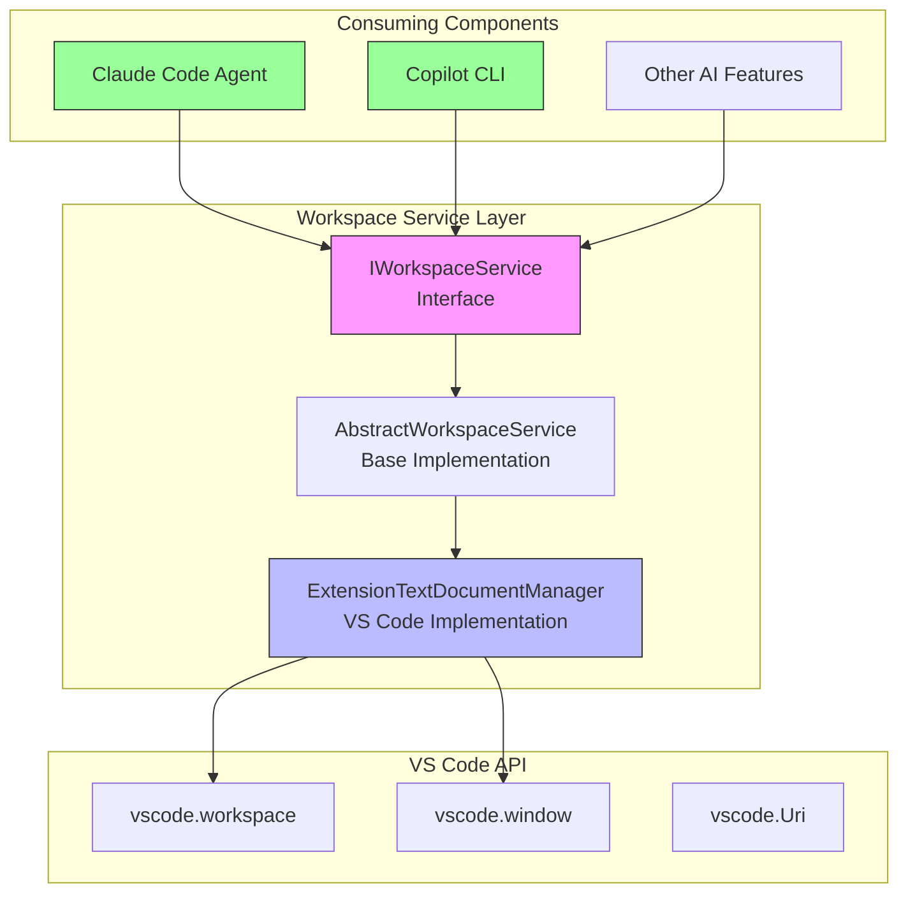
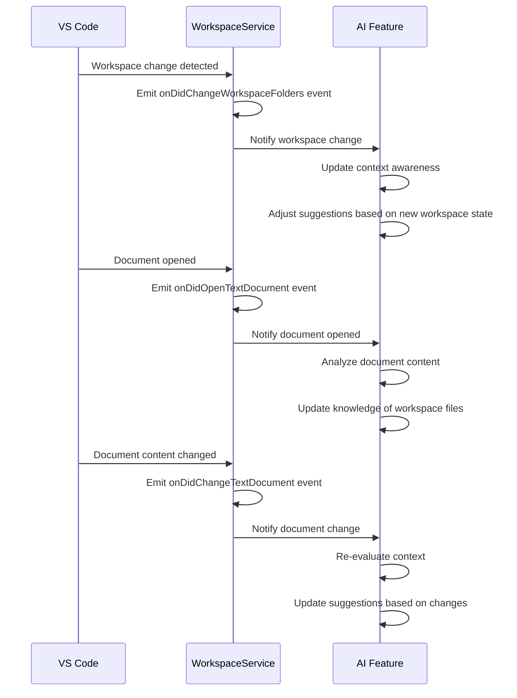
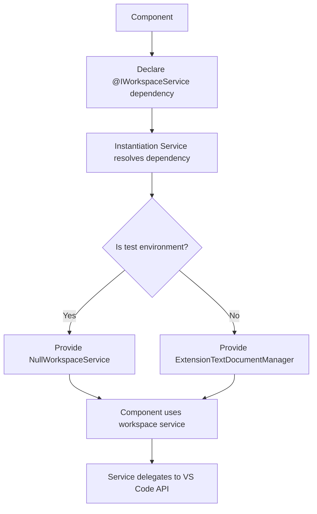

# Workspace Management

<cite>
**Referenced Files in This Document**   
- [workspaceService.ts](file://src/platform/workspace/common/workspaceService.ts)
- [workspaceServiceImpl.ts](file://src/platform/workspace/vscode/workspaceServiceImpl.ts)
- [services.ts](file://src/extension/extension/vscode/services.ts)
- [claudeCodeAgent.ts](file://src/extension/agents/claude/node/claudeCodeAgent.ts)
- [copilotCli.ts](file://src/extension/agents/copilotcli/node/copilotCli.ts)
</cite>

## Table of Contents
1. [Introduction](#introduction)
2. [Architecture Overview](#architecture-overview)
3. [Core Components](#core-components)
4. [Workspace Service Interface](#workspace-service-interface)
5. [Implementation Details](#implementation-details)
6. [Event Handling and Workspace Changes](#event-handling-and-workspace-changes)
7. [Multi-Root Workspace Support](#multi-root-workspace-support)
8. [Integration Patterns](#integration-patterns)
9. [Usage Examples](#usage-examples)
10. [Best Practices](#best-practices)

## Introduction
The Workspace Management component in vscode-copilot-chat provides a comprehensive service layer for accessing and managing workspace configuration, folder management, and file system operations through the VS Code API. This documentation details the implementation of the workspaceService and workspaceServiceImpl classes that form the foundation of workspace management in the platform layer. The service enables AI-powered features to understand and interact with the user's workspace context, providing essential functionality for code suggestions and context-aware AI responses. The architecture follows a service-oriented design pattern with clear separation between interface definition and implementation, allowing for flexible integration with various components across the extension.

## Architecture Overview

**Diagram sources**
- [workspaceService.ts](file://src/platform/workspace/common/workspaceService.ts)
- [workspaceServiceImpl.ts](file://src/platform/workspace/vscode/workspaceServiceImpl.ts)

## Core Components

The Workspace Management component consists of several key elements that work together to provide workspace functionality. The core is formed by the IWorkspaceService interface which defines the contract for workspace operations, and the ExtensionTextDocumentManager class which implements this interface using VS Code's native APIs. The architecture follows a service locator pattern where components depend on the interface rather than concrete implementations, enabling better testability and flexibility. The NullWorkspaceService class provides a fallback implementation for testing scenarios, while the actual production implementation leverages VS Code's workspace, window, and Uri APIs to interact with the user's workspace. This layered approach allows the service to abstract away the complexities of the underlying VS Code API while providing a clean, consistent interface for consumers.

**Section sources**
- [workspaceService.ts](file://src/platform/workspace/common/workspaceService.ts#L17-L227)
- [workspaceServiceImpl.ts](file://src/platform/workspace/vscode/workspaceServiceImpl.ts#L14-L113)

## Workspace Service Interface

The IWorkspaceService interface defines a comprehensive set of methods and properties for workspace management. It provides access to text and notebook documents through readonly properties, exposes events for document and workspace changes, and offers methods for opening and displaying documents. Key methods include getWorkspaceFolders() for retrieving workspace folder URIs, getWorkspaceFolder() for determining which workspace folder contains a specific resource, and asRelativePath() for converting absolute paths to workspace-relative paths. The service also provides file system access through the fs property, enabling file operations within the workspace. The ensureWorkspaceIsFullyLoaded() method is particularly important for virtual workspaces, ensuring that workspace contents are fully downloaded before use. This interface serves as the contract that all workspace service implementations must adhere to, ensuring consistency across different environments and use cases.

```mermaid
classDiagram
class IWorkspaceService {
+readonly textDocuments : TextDocument[]
+readonly notebookDocuments : NotebookDocument[]
+readonly onDidOpenTextDocument : Event<TextDocument>
+readonly onDidCloseTextDocument : Event<TextDocument>
+readonly onDidOpenNotebookDocument : Event<NotebookDocument>
+readonly onDidCloseNotebookDocument : Event<NotebookDocument>
+readonly onDidChangeTextDocument : Event<TextDocumentChangeEvent>
+readonly onDidChangeWorkspaceFolders : Event<WorkspaceFoldersChangeEvent>
+readonly onDidChangeNotebookDocument : Event<NotebookDocumentChangeEvent>
+readonly onDidChangeTextEditorSelection : Event<TextEditorSelectionChangeEvent>
+openTextDocument(uri : Uri) : Promise<TextDocument>
+fs : FileSystem
+showTextDocument(document : TextDocument) : Promise<void>
+openTextDocumentAndSnapshot(uri : Uri) : Promise<TextDocumentSnapshot>
+openNotebookDocumentAndSnapshot(uri : Uri, format : 'xml' | 'json' | 'text') : Promise<NotebookDocumentSnapshot>
+openNotebookDocument(uri : Uri) : Promise<NotebookDocument>
+openNotebookDocument(notebookType : string, content? : NotebookData) : Promise<NotebookDocument>
+getWorkspaceFolders() : URI[]
+getWorkspaceFolder(resource : URI) : URI | undefined
+getWorkspaceFolderName(workspaceFolderUri : URI) : string
+showWorkspaceFolderPicker() : Promise<WorkspaceFolder | undefined>
+asRelativePath(pathOrUri : string | Uri, includeWorkspaceFolder? : boolean) : string
+applyEdit(edit : WorkspaceEdit) : Thenable<boolean>
+ensureWorkspaceIsFullyLoaded() : Promise<void>
}
class AbstractWorkspaceService {
+readonly _serviceBrand : undefined
+textDocuments : readonly TextDocument[]
+notebookDocuments : readonly NotebookDocument[]
+readonly onDidOpenTextDocument : Event<TextDocument>
+readonly onDidCloseTextDocument : Event<TextDocument>
+readonly onDidOpenNotebookDocument : Event<NotebookDocument>
+readonly onDidCloseNotebookDocument : Event<NotebookDocument>
+readonly onDidChangeTextDocument : Event<TextDocumentChangeEvent>
+readonly onDidChangeWorkspaceFolders : Event<WorkspaceFoldersChangeEvent>
+readonly onDidChangeNotebookDocument : Event<NotebookDocumentChangeEvent>
+readonly onDidChangeTextEditorSelection : Event<TextEditorSelectionChangeEvent>
+openTextDocument(uri : Uri) : Promise<TextDocument>
+fs : FileSystem
+showTextDocument(document : TextDocument) : Promise<void>
+openNotebookDocument(uri : Uri) : Promise<NotebookDocument>
+openNotebookDocument(notebookType : string, content? : NotebookData) : Promise<NotebookDocument>
+getWorkspaceFolders() : URI[]
+ensureWorkspaceIsFullyLoaded() : Promise<void>
+showWorkspaceFolderPicker() : Promise<WorkspaceFolder | undefined>
+getWorkspaceFolderName(workspaceFolderUri : URI) : string
+applyEdit(edit : WorkspaceEdit) : Thenable<boolean>
+asRelativePath(pathOrUri : string | Uri, includeWorkspaceFolder? : boolean) : string
+openTextDocumentAndSnapshot(uri : Uri) : Promise<TextDocumentSnapshot>
+openNotebookDocumentAndSnapshot(uri : Uri, format : 'xml' | 'json' | 'text') : Promise<NotebookDocumentSnapshot>
+getWorkspaceFolder(resource : URI) : URI | undefined
}
IWorkspaceService <|-- AbstractWorkspaceService
AbstractWorkspaceService <|-- ExtensionTextDocumentManager
class ExtensionTextDocumentManager {
+get textDocuments() : readonly TextDocument[]
+readonly onDidOpenTextDocument : Event<TextDocument>
+readonly onDidChangeTextDocument : Event<TextDocumentChangeEvent>
+readonly onDidOpenNotebookDocument : Event<NotebookDocument>
+readonly onDidCloseNotebookDocument : Event<NotebookDocument>
+readonly onDidCloseTextDocument : Event<TextDocument>
+readonly onDidChangeWorkspaceFolders : Event<WorkspaceFoldersChangeEvent>
+readonly onDidChangeNotebookDocument : Event<NotebookDocumentChangeEvent>
+readonly onDidChangeTextEditorSelection : Event<TextEditorSelectionChangeEvent>
+openTextDocument(uri : Uri) : Promise<TextDocument>
+get fs() : FileSystem
+showTextDocument(document : TextDocument) : Promise<void>
+openNotebookDocument(uri : Uri) : Promise<NotebookDocument)
+openNotebookDocument(notebookType : string, content? : NotebookData) : Promise<NotebookDocument>
+get notebookDocuments() : readonly NotebookDocument[]
+getWorkspaceFolders() : URI[]
+getWorkspaceFolderName(workspaceFolderUri : URI) : string
+asRelativePath(pathOrUri : string | Uri, includeWorkspaceFolder? : boolean) : string
+applyEdit(edit : WorkspaceEdit) : Thenable<boolean>
+ensureWorkspaceIsFullyLoaded() : Promise<void>
+showWorkspaceFolderPicker() : Promise<WorkspaceFolder | undefined>
}
```

**Diagram sources**
- [workspaceService.ts](file://src/platform/workspace/common/workspaceService.ts#L19-L227)
- [workspaceServiceImpl.ts](file://src/platform/workspace/vscode/workspaceServiceImpl.ts#L14-L113)

## Implementation Details

The ExtensionTextDocumentManager class implements the IWorkspaceService interface by delegating to VS Code's native APIs. It exposes the workspace.textDocuments and workspace.notebookDocuments collections directly, providing real-time access to all open documents. Event subscriptions are implemented by forwarding the corresponding VS Code events, ensuring that consumers receive notifications about document and workspace changes as they occur. The implementation leverages workspace.fs for file system operations, window.showTextDocument for displaying documents, and workspace.openTextDocument for opening documents by URI. For notebook documents, the implementation includes special handling to check if a document is already open before attempting to open it, improving performance and avoiding unnecessary operations. The getWorkspaceFolders() method transforms VS Code's WorkspaceFolder array into an array of URIs, providing a simplified interface for consumers. The ensureWorkspaceIsFullyLoaded() method includes special handling for virtual workspaces, particularly GitHub repositories, by preloading workspace contents when necessary.

**Section sources**
- [workspaceServiceImpl.ts](file://src/platform/workspace/vscode/workspaceServiceImpl.ts#L14-L113)

## Event Handling and Workspace Changes

The workspace service provides comprehensive event handling for monitoring workspace changes. It exposes events for document lifecycle operations (onDidOpenTextDocument, onDidCloseTextDocument), document content changes (onDidChangeTextDocument), and workspace folder modifications (onDidChangeWorkspaceFolders). These events enable AI features to react to user actions in real-time, maintaining an accurate understanding of the workspace state. The service forwards these events directly from VS Code's API, ensuring low-latency notifications. For virtual workspaces, the implementation includes special handling in the ensureWorkspaceIsFullyLoaded() method, which preloads workspace contents when working with remote repositories like GitHub. This ensures that AI features have access to complete workspace information before generating responses. The event system follows VS Code's event pattern, using the Event<T> type to provide a consistent interface for event subscription across all components.

**Diagram sources**
- [workspaceService.ts](file://src/platform/workspace/common/workspaceService.ts#L23-L30)
- [workspaceServiceImpl.ts](file://src/platform/workspace/vscode/workspaceServiceImpl.ts#L28-L35)

## Multi-Root Workspace Support

The workspace service fully supports multi-root workspaces, a key feature of VS Code that allows users to work with multiple projects simultaneously. The getWorkspaceFolders() method returns all workspace folders, enabling AI features to understand the complete workspace structure. The getWorkspaceFolder() method determines which specific workspace folder contains a given resource, allowing for precise context awareness. The asRelativePath() method handles the complexity of relative path calculation in multi-root workspaces, automatically including the workspace folder name in the path when multiple folders are present. This ensures that file references are unambiguous and correctly scoped. The showWorkspaceFolderPicker() method provides a user interface for selecting a specific workspace folder when needed, such as when determining a default working directory. The implementation correctly handles edge cases like empty workspaces and single-folder workspaces, providing appropriate fallback behavior.

**Section sources**
- [workspaceService.ts](file://src/platform/workspace/common/workspaceService.ts#L38-L41)
- [workspaceServiceImpl.ts](file://src/platform/workspace/vscode/workspaceServiceImpl.ts#L66-L76)

## Integration Patterns

The workspace service is integrated throughout the vscode-copilot-chat extension using dependency injection. Components declare their dependency on IWorkspaceService using the @IWorkspaceService decorator, and the instantiation service resolves this dependency at runtime. This pattern enables loose coupling between components and makes testing easier, as services can be mocked or replaced in test environments. The NullWorkspaceService class provides a test implementation that can be used in unit tests, while the ExtensionTextDocumentManager provides the production implementation. The service registration occurs in the services.ts file, where the IWorkspaceService is bound to the ExtensionTextDocumentManager implementation. This centralized registration ensures consistent service behavior across the entire extension. The integration pattern follows VS Code's extension architecture, leveraging the platform's service container for dependency management.

**Diagram sources**
- [workspaceService.ts](file://src/platform/workspace/common/workspaceService.ts#L17)
- [workspaceServiceImpl.ts](file://src/platform/workspace/vscode/workspaceServiceImpl.ts#L14)
- [services.ts](file://src/extension/extension/vscode/services.ts#L153)

## Usage Examples

The workspace service is consumed by various components in the vscode-copilot-chat extension to provide context-aware AI capabilities. The Claude Code Agent uses the service to determine the current workspace's root directory, which is passed as the working directory (cwd) when invoking the Claude CLI. This ensures that AI-generated commands are executed in the correct context. The Copilot CLI component uses getWorkspaceFolders() to check if a workspace is open and showWorkspaceFolderPicker() to allow users to select a workspace folder when multiple are available. These usage patterns demonstrate how the workspace service enables AI features to understand and interact with the user's development environment. By providing access to workspace configuration and file system operations, the service allows AI components to generate more relevant and accurate responses that take into account the specific context of the user's project.

**Section sources**
- [claudeCodeAgent.ts](file://src/extension/agents/claude/node/claudeCodeAgent.ts#L244)
- [copilotCli.ts](file://src/extension/agents/copilotcli/node/copilotCli.ts#L322-L330)

## Best Practices

When working with the workspace service, several best practices should be followed to ensure optimal performance and reliability. Components should cache workspace folder information when possible, rather than repeatedly calling getWorkspaceFolders(), to minimize API overhead. Event listeners should be properly disposed to prevent memory leaks, especially in long-running sessions. For operations that require file system access, the fs property should be used instead of Node.js file system APIs to ensure compatibility with virtual workspaces. When working with URIs, the asRelativePath() method should be used to generate user-friendly paths that are properly scoped to the workspace. For multi-root workspaces, components should handle the case where no workspace folders are available, providing appropriate fallback behavior. Finally, when implementing new features that require workspace context, developers should consider whether their component needs real-time updates via events or if polling the current state is sufficient, as excessive event handling can impact performance.

**Section sources**
- [workspaceService.ts](file://src/platform/workspace/common/workspaceService.ts)
- [workspaceServiceImpl.ts](file://src/platform/workspace/vscode/workspaceServiceImpl.ts)