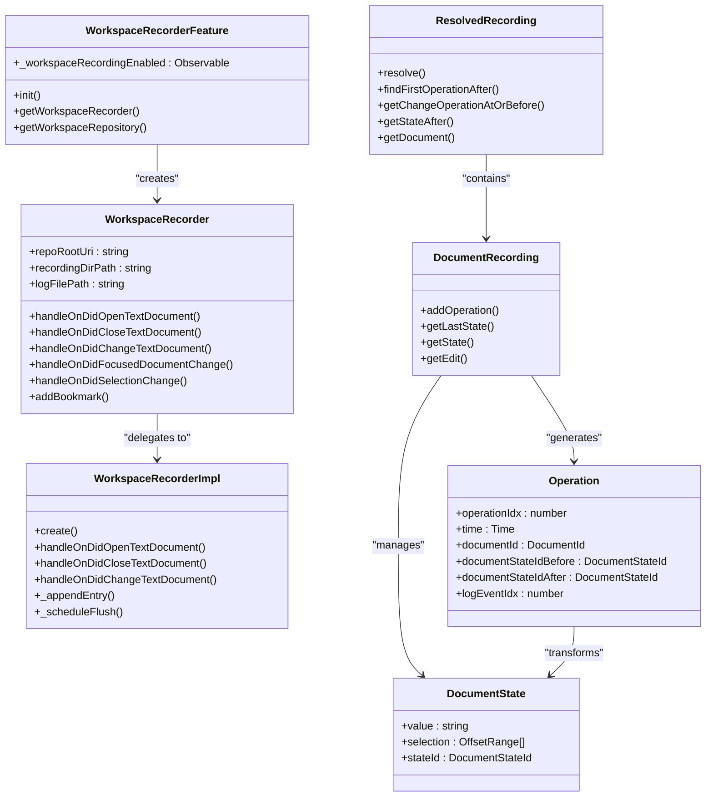
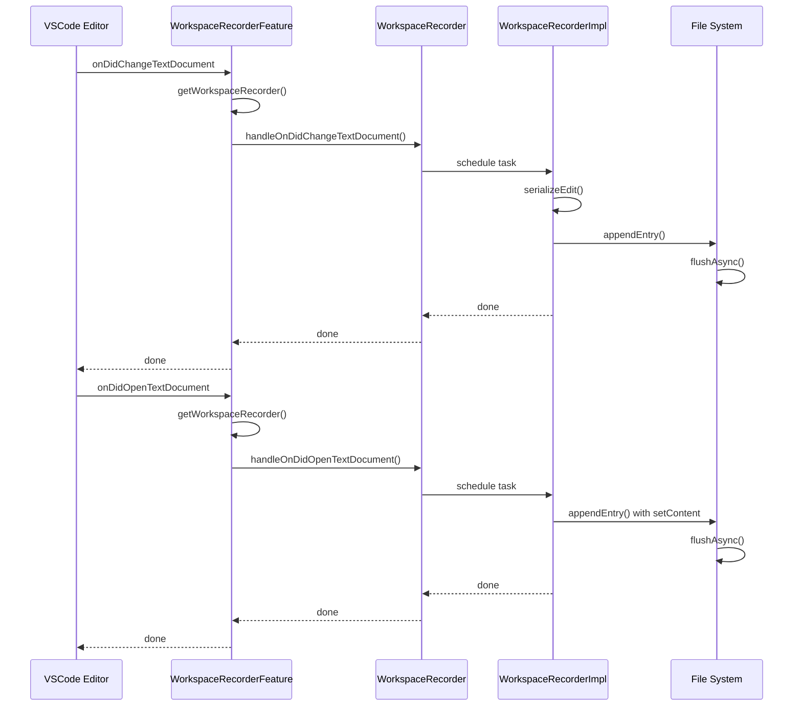
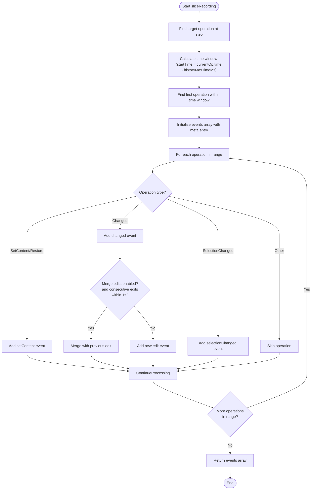

# Workspace Recording

<cite>
**Referenced Files in This Document**   
- [workspaceLog.ts](file://src/platform/workspaceRecorder/common/workspaceLog.ts)
- [resolvedRecording.ts](file://src/platform/workspaceRecorder/common/resolvedRecording/resolvedRecording.ts)
- [documentHistory.ts](file://src/platform/workspaceRecorder/common/resolvedRecording/documentHistory.ts)
- [operation.ts](file://src/platform/workspaceRecorder/common/resolvedRecording/operation.ts)
- [sliceRecording.ts](file://src/platform/workspaceRecorder/common/resolvedRecording/sliceRecording.ts)
- [workspaceRecorderFeature.ts](file://src/extension/workspaceRecorder/vscode-node/workspaceRecorderFeature.ts)
- [workspaceRecorder.ts](file://src/extension/workspaceRecorder/vscode-node/workspaceRecorder.ts)
- [safeFileWriteUtils.ts](file://src/extension/workspaceRecorder/vscode-node/safeFileWriteUtils.ts)
- [jsonlUtil.ts](file://src/extension/workspaceRecorder/common/jsonlUtil.ts)
</cite>

## Table of Contents
1. [Introduction](#introduction)
2. [Core Components](#core-components)
3. [Workspace Recording Architecture](#workspace-recording-architecture)
4. [Document History and Operation Tracking](#document-history-and-operation-tracking)
5. [Session Segmentation with sliceRecording](#session-segmentation-with-slicerecording)
6. [Data Storage and Serialization](#data-storage-and-serialization)
7. [Performance and Storage Management](#performance-and-storage-management)
8. [Data Privacy and Security](#data-privacy-and-security)
9. [Use Cases](#use-cases)
10. [Conclusion](#conclusion)

## Introduction

The Workspace Recording system in the VSCode Copilot Chat extension provides comprehensive tracking of user interactions, code changes, and editing sessions. This system captures detailed information about document modifications, user focus, selections, and other workspace events, enabling powerful features like session replay, debugging, and AI training. The recordings are stored locally and are not uploaded, ensuring user privacy while providing valuable data for improving the Copilot experience.

The system is designed to capture a complete history of workspace interactions in a structured format that can be efficiently stored, retrieved, and analyzed. It uses a combination of event logging, document state tracking, and operation resolution to maintain a coherent view of workspace state over time, even across long editing sessions.

**Section sources**
- [workspaceRecorderFeature.ts](file://src/extension/workspaceRecorder/vscode-node/workspaceRecorderFeature.ts#L32-L288)
- [workspaceLog.ts](file://src/platform/workspaceRecorder/common/workspaceLog.ts#L1-L128)

## Core Components

The Workspace Recording system consists of several key components that work together to capture, store, and process workspace interactions. At the core is the `workspaceLog` which defines the structure of recorded events, the `resolvedRecording` system which reconstructs document states from these events, and the `sliceRecording` functionality which segments long sessions for efficient processing.

The system captures various types of events including document content changes, document opening and closing, focus changes, selection changes, and custom bookmarks. Each event is timestamped and associated with a specific document, allowing for precise reconstruction of the editing timeline. The recording system also handles special cases like notebook documents and integrates with the VSCode extension API to capture relevant events.



**Diagram sources**
- [workspaceRecorder.ts](file://src/extension/workspaceRecorder/vscode-node/workspaceRecorder.ts#L24-L318)
- [workspaceRecorderFeature.ts](file://src/extension/workspaceRecorder/vscode-node/workspaceRecorderFeature.ts#L32-L288)
- [resolvedRecording.ts](file://src/platform/workspaceRecorder/common/resolvedRecording/resolvedRecording.ts#L13-L217)
- [documentHistory.ts](file://src/platform/workspaceRecorder/common/resolvedRecording/documentHistory.ts#L18-L246)
- [operation.ts](file://src/platform/workspaceRecorder/common/resolvedRecording/operation.ts#L10-L158)

**Section sources**
- [workspaceRecorder.ts](file://src/extension/workspaceRecorder/vscode-node/workspaceRecorder.ts#L24-L318)
- [workspaceRecorderFeature.ts](file://src/extension/workspaceRecorder/vscode-node/workspaceRecorderFeature.ts#L32-L288)
- [resolvedRecording.ts](file://src/platform/workspaceRecorder/common/resolvedRecording/resolvedRecording.ts#L13-L217)

## Workspace Recording Architecture

The Workspace Recording system follows a layered architecture that separates event capture, storage, and analysis. The system is initialized through the `WorkspaceRecorderFeature` which monitors workspace state and creates recording instances for each repository. When workspace recording is enabled, the feature listens to various VSCode events and routes them to the appropriate `WorkspaceRecorder` instance.

Each `WorkspaceRecorder` instance is responsible for a specific repository and handles events for documents within that repository. The recorder uses a task queue to ensure that events are processed in order and efficiently batched for storage. When an event occurs, such as a document change or selection update, the recorder schedules the event handling and appends the corresponding log entry to the recording file.

The architecture includes several key design patterns:
- **Event Delegation**: The `WorkspaceRecorderFeature` delegates event handling to specific `WorkspaceRecorder` instances based on the document's repository
- **Asynchronous Processing**: Events are processed through a task queue to prevent blocking the main thread
- **State Management**: Document state is tracked separately from the event log, allowing for efficient state reconstruction
- **Modular Design**: Different aspects of recording (capture, storage, analysis) are separated into distinct components



**Diagram sources**
- [workspaceRecorderFeature.ts](file://src/extension/workspaceRecorder/vscode-node/workspaceRecorderFeature.ts#L141-L181)
- [workspaceRecorder.ts](file://src/extension/workspaceRecorder/vscode-node/workspaceRecorder.ts#L38-L78)
- [workspaceRecorder.ts](file://src/extension/workspaceRecorder/vscode-node/workspaceRecorder.ts#L89-L318)

**Section sources**
- [workspaceRecorderFeature.ts](file://src/extension/workspaceRecorder/vscode-node/workspaceRecorderFeature.ts#L32-L288)
- [workspaceRecorder.ts](file://src/extension/workspaceRecorder/vscode-node/workspaceRecorder.ts#L24-L318)

## Document History and Operation Tracking

The document history system captures and reconstructs the evolution of documents over time through a series of operations. Each document change is recorded as an operation that transforms the document from one state to another. The system maintains a sequence of document states, with each state representing the document content and selection at a specific point in time.

The `DocumentRecording` class manages the history of a single document, tracking operations like content changes, selections, and focus events. Each operation has a before and after state ID, allowing the system to reconstruct the document state at any point in time. The operations are stored in a list ordered by their occurrence, with each operation incrementing the document state ID.

When a document change occurs, the system creates a `DocumentChangedOperation` containing the edit information. The edit is serialized as a list of replacements, each specifying a range to replace and the new text. This allows for efficient storage of changes and enables the reconstruction of intermediate states. The system also tracks document metadata like selection changes and focus events, which are stored as separate operation types.

The resolved recording system provides methods to navigate the operation sequence and retrieve document states. For example, `getStateAfter()` returns the document state following a specific operation, while `getChangeOperationAtOrBefore()` finds the most recent change operation preceding a given operation. This enables features like session replay and debugging by allowing the system to reconstruct the workspace state at any point in the recording.

```mermaid
classDiagram
class DocumentRecording {
+documentId : DocumentId
+documentRelativePath : string
+_docOperationsByStateIdBefore : DocumentChange[]
+_currentState : DocumentState
+_documentVersionAfterToOperation : Map<number, Operation>
+addOperation()
+getLastState()
+getState()
+getEdit()
+getStateIdAfterOp()
}
class DocumentState {
+value : string
+selection : OffsetRange[]
+stateId : DocumentStateId
}
class DocumentChange {
+opIdx : number
+applyTo(state) : DocumentState
}
class DocumentEdit {
+edit : StringEdit
+applyTo(state) : DocumentState
}
class SetValueEdit {
+value : string
+applyTo(state) : DocumentState
}
class SetSelectionEdit {
+selection : OffsetRange[]
+applyTo(state) : DocumentState
}
DocumentRecording --> DocumentState : "contains"
DocumentRecording --> DocumentChange : "contains"
DocumentChange <|-- DocumentEdit
DocumentChange <|-- SetValueEdit
DocumentChange <|-- SetSelectionEdit
DocumentEdit --> StringEdit
SetValueEdit --> string
SetSelectionEdit --> OffsetRange[]
```

**Diagram sources**
- [documentHistory.ts](file://src/platform/workspaceRecorder/common/resolvedRecording/documentHistory.ts#L18-L246)
- [operation.ts](file://src/platform/workspaceRecorder/common/resolvedRecording/operation.ts#L10-L158)

**Section sources**
- [documentHistory.ts](file://src/platform/workspaceRecorder/common/resolvedRecording/documentHistory.ts#L18-L246)
- [operation.ts](file://src/platform/workspaceRecorder/common/resolvedRecording/operation.ts#L10-L158)

## Session Segmentation with sliceRecording

The `sliceRecording` function provides a mechanism for segmenting long recording sessions into manageable chunks for analysis and processing. This is particularly important for performance reasons, as processing an entire recording session at once could be resource-intensive. The function extracts a time window from the recording, centered around a specific operation, and returns a subset of the log entries that capture the relevant context.

The segmentation process works by identifying a target operation and then finding all operations within a specified time window before it. This creates a "slice" of the recording that includes the immediate history leading up to the target operation. The function can be configured to include or exclude certain types of events, such as selection changes, and can merge consecutive edit operations to reduce noise.

The slicing functionality is designed to support various use cases, such as debugging and AI training, where only a relevant portion of the recording is needed. For example, when analyzing a specific code change, the system can extract the preceding few minutes of editing activity to understand the context in which the change was made. The function also supports merging consecutive edits that are close in time, which helps to reduce the granularity of the recording when fine details are not needed.

The implementation uses a caching mechanism to efficiently map document IDs between the original recording and the sliced output. It also handles the serialization of edit operations and ensures that the sliced recording maintains the necessary context to reconstruct document states. The resulting slice includes metadata about the origin of the slice, such as the UUID of the original recording and the range of operations included.



**Diagram sources**
- [sliceRecording.ts](file://src/platform/workspaceRecorder/common/resolvedRecording/sliceRecording.ts#L1-L133)

**Section sources**
- [sliceRecording.ts](file://src/platform/workspaceRecorder/common/resolvedRecording/sliceRecording.ts#L1-L133)

## Data Storage and Serialization

The Workspace Recording system uses a JSONL (JSON Lines) format for storing recording data, which provides several advantages for continuous logging and processing. Each log entry is stored as a separate JSON object on its own line, allowing for efficient appending of new entries and streaming processing of the recording file. This format enables the system to write entries incrementally without needing to parse or rewrite the entire file.

The storage implementation includes several key components for reliability and performance. The `FlushableSafeJSONLFile` class provides thread-safe appending of entries with periodic flushing to disk. It uses a task queue to batch writes and minimize I/O operations, while ensuring that data is not lost in case of application crashes. The class also includes locking mechanisms to prevent concurrent writes from corrupting the file.

For metadata storage, the system uses the `FlushableJSONFile` class, which stores structured data in a JSON format with atomic updates. This file is used to maintain the recording state, including document mappings and recording version information. The implementation uses a temporary file and atomic rename operations to ensure data integrity during updates.

The serialization process converts various data types into a compact JSON representation. Document changes are serialized as arrays of edit operations, with each operation specifying a range to replace and the new text. This format is both human-readable and machine-efficient, allowing for easy parsing and analysis. The system also includes utilities for parsing JSONL files and converting them back into JavaScript objects for processing.

```mermaid
classDiagram
class FlushableJSONFile {
+filePath : string
+_value : T
+_dirty : boolean
+setValue()
+flushAsync()
+flushSync()
}
class FlushableSafeJSONLFile {
+filePath : string
+_lock : boolean
+_newEntries : string[]
+appendEntry()
+flushAsync()
+flushSync()
}
class JSONL {
+parse()
+toString()
}
class WorkspaceRecordingState {
+version : number
+logCount : number
+documents : Record<string, {id : number, lastHash : string}>
}
FlushableJSONFile --> WorkspaceRecordingState : "stores"
FlushableSafeJSONLFile --> LogEntry : "stores"
JSONL --> string : "converts"
JSONL --> T[] : "converts"
```

**Diagram sources**
- [safeFileWriteUtils.ts](file://src/extension/workspaceRecorder/vscode-node/safeFileWriteUtils.ts#L11-L133)
- [jsonlUtil.ts](file://src/extension/workspaceRecorder/common/jsonlUtil.ts#L6-L29)

**Section sources**
- [safeFileWriteUtils.ts](file://src/extension/workspaceRecorder/vscode-node/safeFileWriteUtils.ts#L11-L133)
- [jsonlUtil.ts](file://src/extension/workspaceRecorder/common/jsonlUtil.ts#L6-L29)

## Performance and Storage Management

The Workspace Recording system implements several strategies to manage performance and storage efficiency. One key mechanism is log rotation, which prevents recording files from growing indefinitely. When a recording file exceeds a configured size limit (20MB), the system automatically creates a new file and archives the old one with a timestamp. This ensures that individual files remain manageable while preserving the complete recording history.

The system uses asynchronous processing and batching to minimize the impact on editor performance. All recording operations are scheduled through a task queue, which batches multiple operations together before writing them to disk. This reduces the number of I/O operations and prevents the recording system from blocking the main thread. The system also implements periodic flushing with a 10-second delay, allowing multiple operations to be written in a single batch.

To optimize storage, the system uses content hashing and deduplication. When a document is opened, its content is hashed using a short SHA, and this hash is stored with the document state. If the same content appears again (e.g., when restoring a document), the system can reference the existing hash instead of storing the content again. This reduces storage requirements, especially for large files that are opened and closed multiple times during a session.

The recording system also includes mechanisms to handle ignored files, preventing unnecessary recording of files that match gitignore patterns. This reduces both storage usage and processing overhead by excluding files that are typically not relevant for analysis or debugging. The system queries the git extension to determine which files should be ignored, ensuring consistency with the user's version control configuration.

**Section sources**
- [workspaceRecorder.ts](file://src/extension/workspaceRecorder/vscode-node/workspaceRecorder.ts#L116-L143)
- [workspaceRecorder.ts](file://src/extension/workspaceRecorder/vscode-node/workspaceRecorder.ts#L285-L287)
- [workspaceRecorderFeature.ts](file://src/extension/workspaceRecorder/vscode-node/workspaceRecorderFeature.ts#L249-L256)

## Data Privacy and Security

The Workspace Recording system prioritizes user privacy and data security through several design choices. All recordings are stored locally on the user's machine and are not uploaded to any remote servers. This ensures that sensitive code and editing patterns remain under the user's control. The system stores recordings in the extension's global storage directory, which is typically protected by the operating system's file permissions.

The recording system includes mechanisms to exclude sensitive files from being recorded. By integrating with the git extension, it automatically ignores files that match the repository's gitignore patterns. This prevents recording of build artifacts, configuration files with secrets, and other files that should not be tracked. Users can also disable workspace recording entirely through the extension's configuration settings.

Recordings are stored in a structured JSONL format that is human-readable, allowing users to inspect the contents of their recordings if desired. The system does not collect or transmit any personal information beyond what is necessary for the recording functionality, such as document paths and content changes. The UUID included in recordings is generated locally and does not contain any identifying information.

The implementation includes safeguards against data corruption, such as atomic file operations and periodic flushing with error handling. This ensures that recordings remain intact even if the application crashes unexpectedly. The system also uses temporary files and atomic renames when updating metadata, preventing partial writes from corrupting the recording state.

**Section sources**
- [workspaceRecorderFeature.ts](file://src/extension/workspaceRecorder/vscode-node/workspaceRecorderFeature.ts#L123-L125)
- [workspaceRecorder.ts](file://src/extension/workspaceRecorder/vscode-node/workspaceRecorder.ts#L242-L256)
- [workspaceLog.ts](file://src/platform/workspaceRecorder/common/workspaceLog.ts#L36-L44)

## Use Cases

The Workspace Recording system supports several important use cases that enhance the developer experience. One primary use case is session replay, which allows users and developers to review editing sessions and understand the sequence of changes that led to the current code state. This is particularly valuable for debugging complex issues or understanding how a particular solution was developed.

Another key use case is AI training, where the recorded interactions provide valuable data for improving Copilot's suggestions and completions. By analyzing patterns in how users edit code, accept suggestions, and navigate files, the AI models can be trained to better anticipate developer needs and provide more relevant assistance. The detailed operation tracking enables the system to understand not just what changes were made, but how and why they were made.

The recording system also supports debugging scenarios by providing a complete history of workspace interactions. When users encounter issues with Copilot suggestions or behavior, the recordings can be analyzed to identify the root cause. This is particularly useful for reproducing intermittent issues that are difficult to diagnose through traditional debugging methods.

Additional use cases include:
- **Code review assistance**: Providing context about how code evolved over time
- **Learning and onboarding**: Helping new team members understand the development process
- **Performance analysis**: Identifying patterns in editing behavior that could be optimized
- **Feature usage analysis**: Understanding how users interact with different Copilot features

The system's design supports these use cases by providing a comprehensive, structured record of workspace interactions that can be efficiently queried and analyzed.

**Section sources**
- [workspaceRecorderFeature.ts](file://src/extension/workspaceRecorder/vscode-node/workspaceRecorderFeature.ts#L88-L94)
- [workspaceRecorder.ts](file://src/extension/workspaceRecorder/vscode-node/workspaceRecorder.ts#L76-L78)
- [resolvedRecording.ts](file://src/platform/workspaceRecorder/common/resolvedRecording/resolvedRecording.ts#L110-L118)

## Conclusion

The Workspace Recording system in the VSCode Copilot Chat extension provides a robust foundation for tracking and analyzing user interactions with code. By capturing detailed information about document changes, selections, and other workspace events, the system enables powerful features like session replay, debugging, and AI training. The architecture balances comprehensive data collection with performance and privacy considerations, ensuring that recordings are both useful and unobtrusive.

The system's modular design separates concerns between event capture, storage, and analysis, making it maintainable and extensible. The use of JSONL format for storage enables efficient appending and streaming processing, while the operation-based model allows for precise reconstruction of document states over time. Features like log rotation and content deduplication help manage storage requirements, while integration with gitignore patterns respects user preferences for file privacy.

Looking forward, the Workspace Recording system could be extended to support additional use cases, such as collaborative editing analysis or more sophisticated AI training scenarios. The existing foundation provides a solid basis for these enhancements, with clear interfaces and well-defined data structures that can be built upon. As the system continues to evolve, it will play an increasingly important role in improving the Copilot experience and understanding developer workflows.