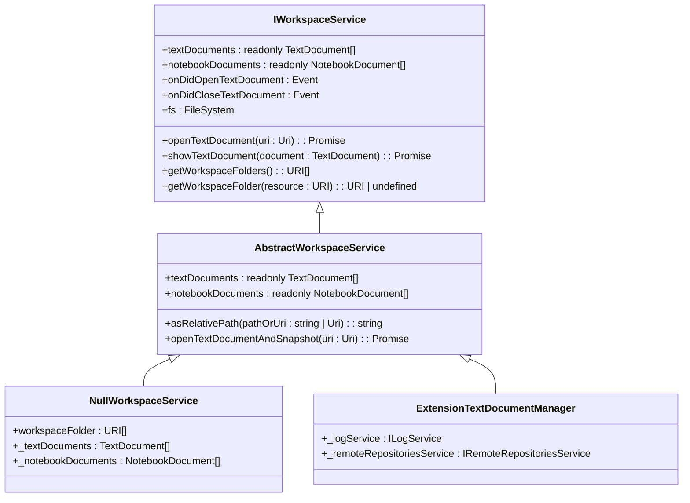
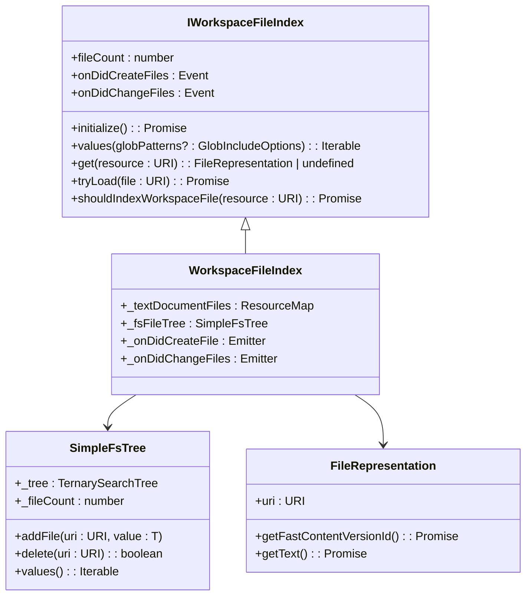
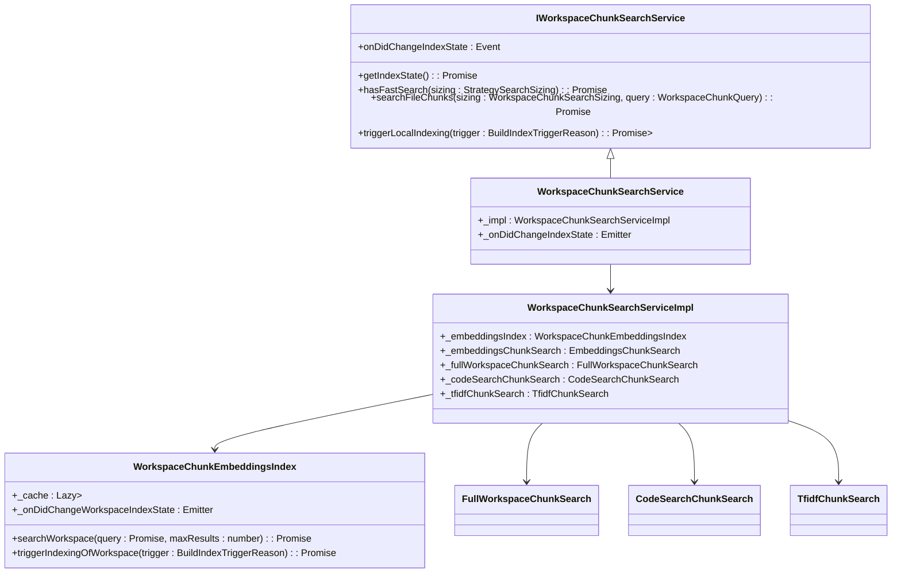
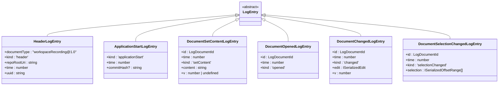
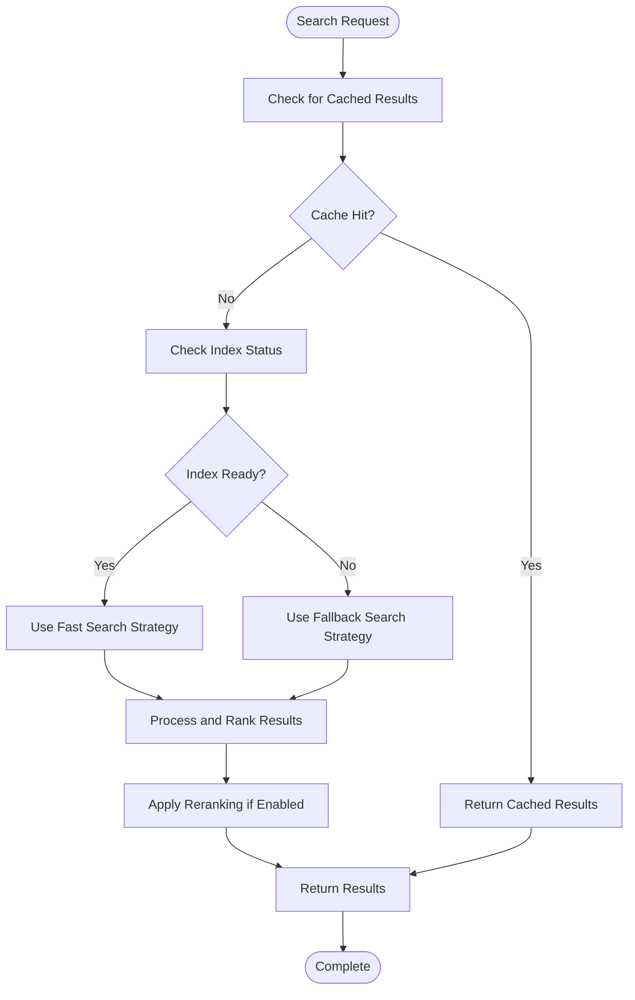

# Workspace Service

<cite>
**Referenced Files in This Document**   
- [workspaceService.ts](file://src/platform/workspace/common/workspaceService.ts)
- [workspaceServiceImpl.ts](file://src/platform/workspace/vscode/workspaceServiceImpl.ts)
- [workspaceChunkSearchService.ts](file://src/platform/workspaceChunkSearch/node/workspaceChunkSearchService.ts)
- [workspaceChunkEmbeddingsIndex.ts](file://src/platform/workspaceChunkSearch/node/workspaceChunkEmbeddingsIndex.ts)
- [workspaceFileIndex.ts](file://src/platform/workspaceChunkSearch/node/workspaceFileIndex.ts)
- [fullWorkspaceChunkSearch.ts](file://src/platform/workspaceChunkSearch/node/fullWorkspaceChunkSearch.ts)
- [tfidfChunkSearch.ts](file://src/platform/workspaceChunkSearch/node/tfidfChunkSearch.ts)
- [workspaceLog.ts](file://src/platform/workspaceRecorder/common/workspaceLog.ts)
</cite>

## Table of Contents
1. [Introduction](#introduction)
2. [Workspace Service Architecture](#workspace-service-architecture)
3. [Workspace Chunking and Indexing](#workspace-chunking-and-indexing)
4. [Semantic Search Implementation](#semantic-search-implementation)
5. [Workspace Recording System](#workspace-recording-system)
6. [Multi-Root Workspace Support](#multi-root-workspace-support)
7. [Performance Considerations](#performance-considerations)
8. [Custom Workspace Search Implementation](#custom-workspace-search-implementation)
9. [Conclusion](#conclusion)

## Introduction

The Workspace Service in the platform layer of vscode-copilot-chat provides comprehensive access to workspace information, file indexing, and code search capabilities. This service acts as the central hub for workspace-related operations, enabling AI-powered features to understand and interact with the user's codebase effectively. The service architecture is designed to handle various workspace scenarios, from small single-file projects to large multi-repository environments, while maintaining optimal performance and responsiveness.

The Workspace Service integrates with VS Code's workspace APIs to provide seamless access to workspace information, including file system operations, workspace folder management, and document tracking. It implements sophisticated indexing strategies to make workspace content searchable, using both traditional text-based search and advanced semantic search techniques. The service also includes workspace recording capabilities that capture user interactions and code changes for context-aware AI assistance.

**Section sources**
- [workspaceService.ts](file://src/platform/workspace/common/workspaceService.ts#L1-L227)
- [workspaceServiceImpl.ts](file://src/platform/workspace/vscode/workspaceServiceImpl.ts#L1-L113)

## Workspace Service Architecture

The Workspace Service architecture is built around a modular design that separates concerns between workspace access, indexing, and search functionality. At its core is the `IWorkspaceService` interface, which defines the contract for accessing workspace information and interacting with VS Code's workspace APIs. This interface provides methods for opening and managing text and notebook documents, accessing workspace folders, and handling file system operations.

The implementation follows a layered approach with the `ExtensionTextDocumentManager` class serving as the primary implementation that bridges the service with VS Code's native workspace APIs. This class delegates operations to VS Code's workspace and window objects, ensuring compatibility with the editor's built-in functionality. The service also includes a null implementation (`NullWorkspaceService`) for testing and edge cases where workspace access is not available.

**Diagram sources **
- [workspaceService.ts](file://src/platform/workspace/common/workspaceService.ts#L17-L52)
- [workspaceServiceImpl.ts](file://src/platform/workspace/vscode/workspaceServiceImpl.ts#L14-L113)

**Section sources**
- [workspaceService.ts](file://src/platform/workspace/common/workspaceService.ts#L1-L227)
- [workspaceServiceImpl.ts](file://src/platform/workspace/vscode/workspaceServiceImpl.ts#L1-L113)

## Workspace Chunking and Indexing

The workspace chunking and indexing system is a critical component of the Workspace Service, enabling efficient search and retrieval of code content. The system uses a multi-strategy approach to index workspace files, combining different techniques to balance performance, accuracy, and resource usage. The core of this system is the `IWorkspaceFileIndex` interface, which manages the collection of files in the workspace and provides access to their content.

The indexing process begins with the `WorkspaceFileIndex` class, which maintains an in-memory representation of workspace files using a ternary search tree for efficient lookups. This index tracks file metadata and content, implementing methods to handle file creation, modification, and deletion events. The index also enforces size limits and content validation to prevent excessive memory usage and ensure that only text-based files are indexed.

**Diagram sources **
- [workspaceFileIndex.ts](file://src/platform/workspaceChunkSearch/node/workspaceFileIndex.ts#L418-L917)
- [nullWorkspaceFileIndex.ts](file://src/platform/workspaceChunkSearch/node/nullWorkspaceFileIndex.ts#L1-L56)

**Section sources**
- [workspaceFileIndex.ts](file://src/platform/workspaceChunkSearch/node/workspaceFileIndex.ts#L1-L917)
- [nullWorkspaceFileIndex.ts](file://src/platform/workspaceChunkSearch/node/nullWorkspaceFileIndex.ts#L1-L56)

## Semantic Search Implementation

The semantic search implementation in the Workspace Service combines multiple search strategies to provide comprehensive code search capabilities. The core of this system is the `IWorkspaceChunkSearchService` interface, which coordinates different search strategies and selects the most appropriate one based on the current context and requirements. The service implements a fallback mechanism that tries different strategies in order of preference, ensuring that search results are returned even if the primary strategy fails.

The search system uses a tiered approach with several strategies:
1. **Full Workspace Search**: For small workspaces, this strategy includes the entire workspace content when possible, providing comprehensive context.
2. **Code Search**: Leverages remote indexing for large repositories, using pre-computed embeddings for fast search.
3. **Embeddings Search**: Uses locally computed embeddings for semantic similarity search.
4. **TF-IDF Search**: Implements traditional text-based search using term frequency-inverse document frequency algorithms.

**Diagram sources **
- [workspaceChunkSearchService.ts](file://src/platform/workspaceChunkSearch/node/workspaceChunkSearchService.ts#L74-L213)
- [workspaceChunkEmbeddingsIndex.ts](file://src/platform/workspaceChunkSearch/node/workspaceChunkEmbeddingsIndex.ts#L38-L456)

**Section sources**
- [workspaceChunkSearchService.ts](file://src/platform/workspaceChunkSearch/node/workspaceChunkSearchService.ts#L1-L868)
- [workspaceChunkEmbeddingsIndex.ts](file://src/platform/workspaceChunkSearch/node/workspaceChunkEmbeddingsIndex.ts#L1-L456)

## Workspace Recording System

The workspace recording system captures user interactions and code changes to provide context for AI-powered features. This system uses a structured log format defined in the `workspaceLog.ts` file, which records various events such as document changes, selections, and application state. The log entries are typed to ensure consistency and enable efficient processing of recorded data.

The recording system captures a comprehensive set of events, including:
- Document content changes (setContent, storeContent, restoreContent)
- Document lifecycle events (opened, closed)
- User interactions (focused, selectionChanged)
- Application state (applicationStart)
- Metadata and bookmarks

**Diagram sources **
- [workspaceLog.ts](file://src/platform/workspaceRecorder/common/workspaceLog.ts#L11-L74)

**Section sources**
- [workspaceLog.ts](file://src/platform/workspaceRecorder/common/workspaceLog.ts#L1-L128)

## Multi-Root Workspace Support

The Workspace Service provides comprehensive support for multi-root workspaces, allowing users to work with multiple projects simultaneously. The service handles workspace folder management through the `getWorkspaceFolders()` method, which returns an array of URIs representing the root folders in the current workspace. Each folder is treated as an independent unit, with its own file indexing and search context.

The multi-root support is implemented through the workspace service's integration with VS Code's workspace APIs, specifically the `workspace.workspaceFolders` property. When a multi-root workspace is detected, the service processes each folder independently, maintaining separate indexes and search contexts. This approach ensures that search results are scoped appropriately to each project while still allowing cross-project searches when needed.

The service also handles workspace folder changes through the `onDidChangeWorkspaceFolders` event, which triggers re-indexing and context updates when folders are added, removed, or modified. This ensures that the workspace state remains consistent with the actual workspace configuration.

**Section sources**
- [workspaceService.ts](file://src/platform/workspace/common/workspaceService.ts#L38-L41)
- [workspaceServiceImpl.ts](file://src/platform/workspace/vscode/workspaceServiceImpl.ts#L66-L68)

## Performance Considerations

The Workspace Service implements several performance optimizations to handle large repositories efficiently. The system uses incremental indexing strategies that update the index only for changed files, reducing the computational overhead of maintaining the workspace index. When a file is modified, the service updates only the affected portions of the index rather than reprocessing the entire workspace.

For large repositories, the service employs a tiered search strategy that prioritizes fast search methods. The system first attempts to use pre-computed indices or cached results before falling back to more expensive search methods. This approach minimizes latency and ensures responsive search performance even in large codebases.

The service also implements resource management features to prevent excessive memory usage. The workspace index has a maximum size limit, and files are evicted from the index when this limit is reached. Additionally, the service uses lazy loading for file content, loading text only when needed for search or display.

**Diagram sources **
- [workspaceChunkSearchService.ts](file://src/platform/workspaceChunkSearch/node/workspaceChunkSearchService.ts#L341-L466)
- [fullWorkspaceChunkSearch.ts](file://src/platform/workspaceChunkSearch/node/fullWorkspaceChunkSearch.ts#L77-L194)

**Section sources**
- [workspaceChunkSearchService.ts](file://src/platform/workspaceChunkSearch/node/workspaceChunkSearchService.ts#L1-L868)
- [fullWorkspaceChunkSearch.ts](file://src/platform/workspaceChunkSearch/node/fullWorkspaceChunkSearch.ts#L1-L194)

## Custom Workspace Search Implementation

Implementing custom workspace search functionality involves extending the existing search infrastructure with new strategies or modifying the behavior of existing ones. Developers can create custom search strategies by implementing the `IWorkspaceChunkSearchStrategy` interface and registering them with the workspace search service. This allows for specialized search logic tailored to specific use cases or domain requirements.

To implement a custom search strategy, developers should:
1. Create a class that implements `IWorkspaceChunkSearchStrategy`
2. Implement the `searchWorkspace` method with custom search logic
3. Set a unique `id` for the strategy
4. Register the strategy with the workspace search service

The workspace search service provides hooks for preprocessing queries and handling search results, allowing custom strategies to integrate seamlessly with the existing system. Developers can also leverage the workspace indexing infrastructure to access pre-processed file content and metadata, reducing the overhead of implementing custom search functionality.

**Section sources**
- [workspaceChunkSearch.ts](file://src/platform/workspaceChunkSearch/common/workspaceChunkSearch.ts#L87-L115)
- [workspaceChunkSearchService.ts](file://src/platform/workspaceChunkSearch/node/workspaceChunkSearchService.ts#L341-L466)

## Conclusion

The Workspace Service in vscode-copilot-chat provides a robust foundation for AI-powered code assistance by offering comprehensive access to workspace information, sophisticated indexing capabilities, and advanced search functionality. The service's modular architecture allows for flexible extension and customization, while its performance optimizations ensure responsive operation even in large codebases.

Key features of the Workspace Service include:
- Seamless integration with VS Code's workspace APIs
- Multi-strategy search with fallback mechanisms
- Incremental indexing for large repositories
- Support for multi-root workspaces
- Workspace recording for context-aware AI assistance

The service's design prioritizes both functionality and performance, making it well-suited for enhancing developer productivity through intelligent code suggestions and search capabilities. By leveraging this service, developers can create powerful AI-powered features that deeply understand and interact with the user's codebase.