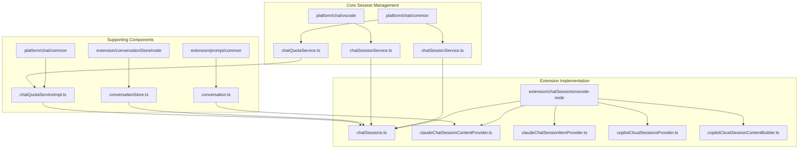
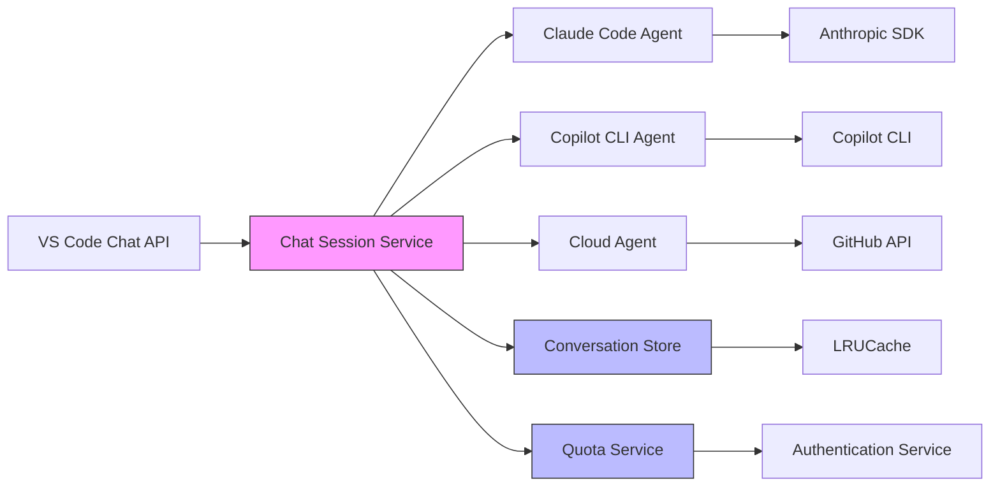
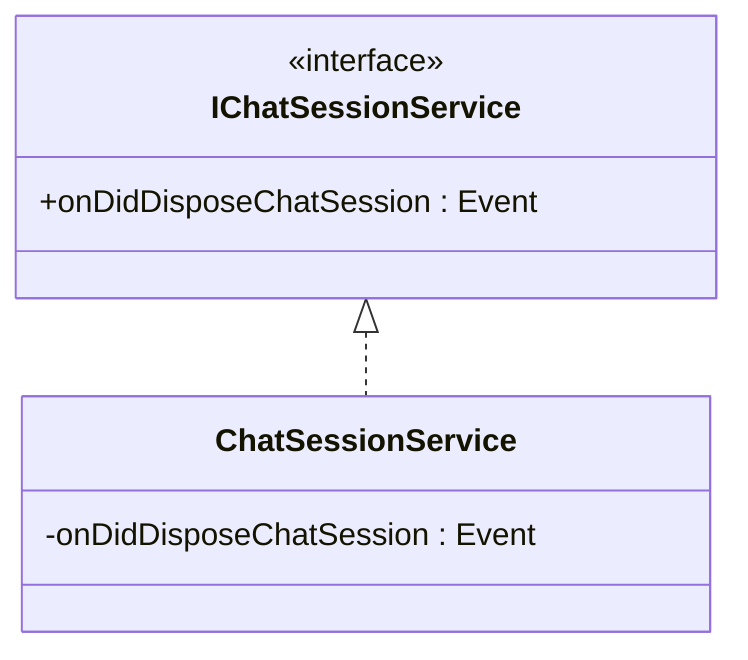
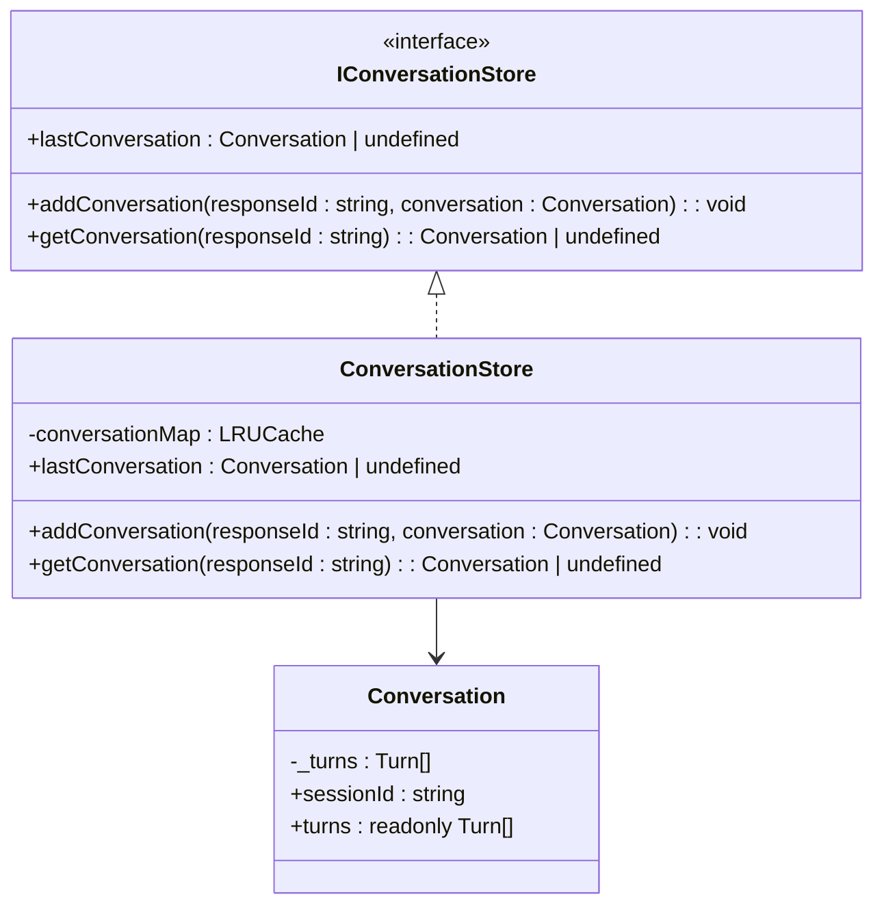
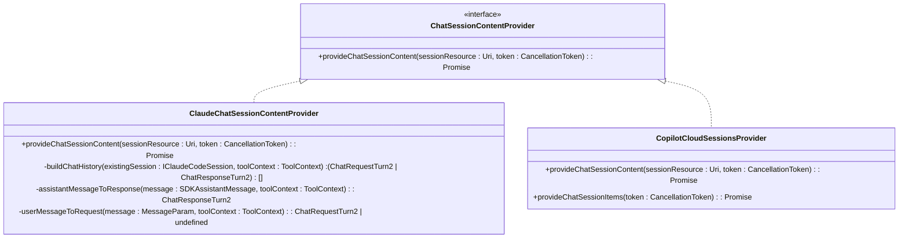
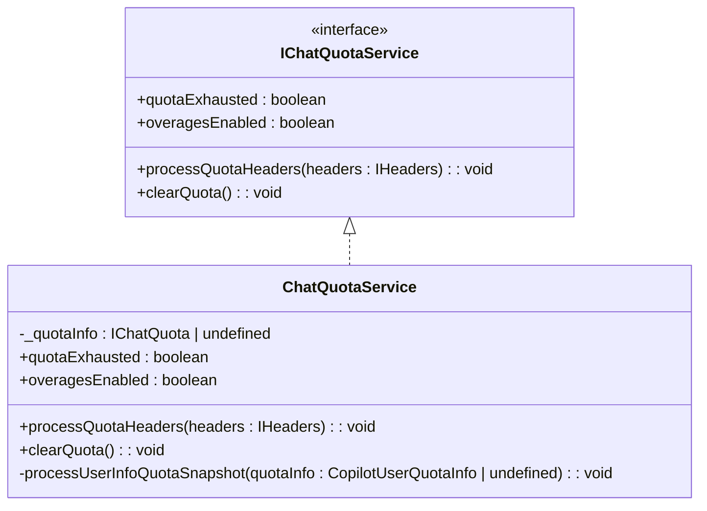

# Chat Session Service

<cite>
**Referenced Files in This Document**   
- [conversationStore.ts](file://src/extension/conversationStore/node/conversationStore.ts)
- [chatSessionService.ts](file://src/platform/chat/common/chatSessionService.ts)
- [chatSessionService.ts](file://src/platform/chat/vscode/chatSessionService.ts)
- [chatSessions.ts](file://src/extension/chatSessions/vscode-node/chatSessions.ts)
- [claudeChatSessionContentProvider.ts](file://src/extension/chatSessions/vscode-node/claudeChatSessionContentProvider.ts)
- [claudeChatSessionItemProvider.ts](file://src/extension/chatSessions/vscode-node/claudeChatSessionItemProvider.ts)
- [copilotCloudSessionsProvider.ts](file://src/extension/chatSessions/vscode-node/copilotCloudSessionsProvider.ts)
- [copilotCloudSessionContentBuilder.ts](file://src/extension/chatSessions/vscode-node/copilotCloudSessionContentBuilder.ts)
- [conversation.ts](file://src/extension/prompt/common/conversation.ts)
- [chatParticipantRequestHandler.ts](file://src/extension/prompt/node/chatParticipantRequestHandler.ts)
- [remoteAgents.ts](file://src/extension/conversation/vscode-node/remoteAgents.ts)
- [chatQuotaService.ts](file://src/platform/chat/common/chatQuotaService.ts)
- [chatQuotaServiceImpl.ts](file://src/platform/chat/common/chatQuotaServiceImpl.ts)
- [copilotcliSessionService.ts](file://src/extension/agents/copilotcli/node/copilotcliSessionService.ts)
</cite>

## Table of Contents
1. [Introduction](#introduction)
2. [Project Structure](#project-structure)
3. [Core Components](#core-components)
4. [Architecture Overview](#architecture-overview)
5. [Detailed Component Analysis](#detailed-component-analysis)
6. [Session Lifecycle Management](#session-lifecycle-management)
7. [Message History and Conversation State](#message-history-and-conversation-state)
8. [Cloud Integration and Synchronization](#cloud-integration-and-synchronization)
9. [Quota Management](#quota-management)
10. [Error Handling and Network Resilience](#error-handling-and-network-resilience)
11. [Performance Considerations](#performance-considerations)
12. [Troubleshooting Guide](#troubleshooting-guide)
13. [Conclusion](#conclusion)

## Introduction
The Chat Session Service in the vscode-copilot-chat extension provides a comprehensive system for managing chat interactions between users and AI assistants. This service handles the complete lifecycle of chat sessions, from creation and persistence to synchronization across devices and eventual disposal. The implementation supports multiple concurrent sessions, integrates with cloud storage for persistent conversation history, and maintains conversation context across different interaction modes. The service is designed to handle various types of chat participants including Claude Code, Copilot CLI, and cloud-based agents, providing a unified interface for session management regardless of the underlying AI model or service.

## Project Structure
The chat session service is organized across multiple directories within the vscode-copilot-chat extension, following a modular architecture that separates concerns between platform-level services, extension-specific implementations, and participant-specific logic. The core session management functionality is distributed across the platform/chat and extension/chatSessions directories, with additional components in related areas such as conversation management and quota enforcement.



**Diagram sources**
- [chatSessionService.ts](file://src/platform/chat/common/chatSessionService.ts)
- [chatSessions.ts](file://src/extension/chatSessions/vscode-node/chatSessions.ts)
- [conversationStore.ts](file://src/extension/conversationStore/node/conversationStore.ts)

## Core Components
The Chat Session Service comprises several core components that work together to provide a seamless chat experience. The service implements a layered architecture with platform-level abstractions and extension-specific implementations. Key components include the IChatSessionService interface that defines the contract for session management, the ConversationStore that maintains in-memory conversation state, and various content providers that handle specific chat participants. The service also includes quota management functionality to track usage limits and prevent overages. The implementation leverages the VS Code extension API for chat session content providers and item providers, allowing integration with the editor's chat interface while maintaining separation between the service logic and UI presentation.

**Section sources**
- [chatSessionService.ts](file://src/platform/chat/common/chatSessionService.ts)
- [conversationStore.ts](file://src/extension/conversationStore/node/conversationStore.ts)
- [chatQuotaService.ts](file://src/platform/chat/common/chatQuotaService.ts)

## Architecture Overview
The Chat Session Service follows a service-oriented architecture with clear separation between interface definitions, platform implementations, and extension-specific functionality. The architecture is designed around the VS Code extension API's chat capabilities, extending them with additional features for session persistence, cloud synchronization, and quota management. The service acts as a bridge between the VS Code chat API and various AI backend services, normalizing their interactions through a common interface. This allows the extension to support multiple chat participants (Claude Code, Copilot CLI, cloud agents) while providing a consistent user experience. The architecture incorporates dependency injection through the instantiation service, enabling flexible composition of components and easy testing.



**Diagram sources**
- [chatSessionService.ts](file://src/platform/chat/common/chatSessionService.ts)
- [chatSessions.ts](file://src/extension/chatSessions/vscode-node/chatSessions.ts)
- [conversationStore.ts](file://src/extension/conversationStore/node/conversationStore.ts)

## Detailed Component Analysis

### Chat Session Service Interface
The IChatSessionService interface defines the contract for chat session management across the application. It provides a minimal API focused on session lifecycle events, specifically exposing an event that fires when a chat session is disposed. This interface is implemented differently on various platforms, with the VS Code implementation delegating to the VS Code chat API's onDidDisposeChatSession event. This abstraction allows the service to be platform-agnostic while still providing access to platform-specific session management capabilities.



**Diagram sources**
- [chatSessionService.ts](file://src/platform/chat/common/chatSessionService.ts)
- [chatSessionService.ts](file://src/platform/chat/vscode/chatSessionService.ts)

### Conversation Store Implementation
The ConversationStore component provides in-memory storage for chat conversations using an LRU (Least Recently Used) cache with a capacity of 1,000 conversations. This implementation ensures that frequently accessed conversations remain readily available while automatically evicting older, less-used conversations to manage memory usage. The store maintains a mapping between response IDs and Conversation objects, allowing for efficient retrieval of conversation history. The Conversation class itself encapsulates a series of chat turns, each representing a user request and assistant response pair, providing a structured representation of the conversation flow.



**Diagram sources**
- [conversationStore.ts](file://src/extension/conversationStore/node/conversationStore.ts)
- [conversation.ts](file://src/extension/prompt/common/conversation.ts)

### Chat Session Content Providers
The chat session service implements content providers for different chat participants, with specialized classes for Claude Code and cloud-based agents. These providers implement the VS Code ChatSessionContentProvider interface, responsible for providing chat session content and handling chat requests. The ClaudeChatSessionContentProvider retrieves session data from the Claude Code session service and converts it to the VS Code chat format, processing both user messages and assistant responses including tool invocations. The provider handles the conversion of Anthropic SDK message formats to VS Code chat parts, managing tool call results and maintaining conversation context.



**Diagram sources**
- [claudeChatSessionContentProvider.ts](file://src/extension/chatSessions/vscode-node/claudeChatSessionContentProvider.ts)
- [copilotCloudSessionsProvider.ts](file://src/extension/chatSessions/vscode-node/copilotCloudSessionsProvider.ts)

### Session Item Providers
Session item providers are responsible for enumerating available chat sessions and providing metadata about them. The ClaudeChatSessionItemProvider reads sessions from the local file system (~/.claude/projects/<folder-slug>/), where each file represents a session with its filename as the session ID. The provider implements the VS Code ChatSessionItemProvider interface, returning a list of ChatSessionItem objects that include the session resource URI, label, tooltip, start time, and icon. This allows the VS Code UI to display a list of available sessions that users can select from. The provider also supports refreshing the session list and handling session commits.

```mermaid
classDiagram
class ChatSessionItemProvider {
<<interface>>
+onDidChangeChatSessionItems : Event<void>
+onDidCommitChatSessionItem : Event<{ original : ChatSessionItem; modified : ChatSessionItem }>
+provideChatSessionItems(token : CancellationToken) : Promise<ChatSessionItem[]>
}
class ClaudeChatSessionItemProvider {
+onDidChangeChatSessionItems : Event<void>
+onDidCommitChatSessionItem : Event<{ original : ChatSessionItem; modified : ChatSessionItem }>
+provideChatSessionItems(token : CancellationToken) : Promise<ChatSessionItem[]>
+refresh() : void
+swap(original : ChatSessionItem, modified : ChatSessionItem) : void
}
ChatSessionItemProvider <|.. ClaudeChatSessionItemProvider
```

**Diagram sources**
- [claudeChatSessionItemProvider.ts](file://src/extension/chatSessions/vscode-node/claudeChatSessionItemProvider.ts)

## Session Lifecycle Management
The chat session service manages the complete lifecycle of chat sessions from creation through disposal. Sessions are created when users initiate a new chat interaction, either through the UI or programmatically. The service assigns a unique session ID to each session, which is used to track the conversation across interactions. Session state is maintained in memory using the ConversationStore, with conversations stored in an LRU cache to balance performance and memory usage. When a session is no longer needed, it is disposed of, triggering the onDidDisposeChatSession event that other components can listen for to perform cleanup operations. The service also handles session persistence by saving session state to the workspace memento, allowing sessions to be restored across editor restarts. For cloud-based sessions, the service synchronizes state with remote storage, ensuring consistency across devices.

**Section sources**
- [chatSessions.ts](file://src/extension/chatSessions/vscode-node/chatSessions.ts)
- [copilotcliSessionService.ts](file://src/extension/agents/copilotcli/node/copilotcliSessionService.ts)
- [chatSessionService.ts](file://src/platform/chat/common/chatSessionService.ts)

## Message History and Conversation State
The chat session service maintains conversation state through a structured model of chat turns, where each turn consists of a user request and assistant response pair. The Conversation class encapsulates this model, storing an ordered array of turns that represent the complete conversation history. The service normalizes message history from various sources, converting between different formats used by the VS Code chat API and internal representation. When restoring a conversation from history, the service processes each entry, pairing request turns with their corresponding response turns to reconstruct the conversation flow. Message ordering is preserved through the sequential nature of the turns array, ensuring that the conversation maintains its chronological integrity. The service also handles special cases such as tool invocations and results, preserving the relationship between tool calls and their outcomes in the conversation history.

**Section sources**
- [conversation.ts](file://src/extension/prompt/common/conversation.ts)
- [chatParticipantRequestHandler.ts](file://src/extension/prompt/node/chatParticipantRequestHandler.ts)
- [remoteAgents.ts](file://src/extension/conversation/vscode-node/remoteAgents.ts)

## Cloud Integration and Synchronization
The chat session service integrates with cloud storage through the CopilotCloudSessionsProvider, which enables synchronization of chat sessions across devices. This provider implements both ChatSessionContentProvider and ChatSessionItemProvider interfaces, allowing it to provide content for cloud-based sessions and enumerate available sessions. The service retrieves session data from remote storage and builds the conversation history by parsing session logs and combining them with pull request information. For pull request-related sessions, the provider creates a PR card that displays pull request details alongside the conversation. The service also handles cloud-specific operations such as opening sessions in a web browser, viewing changes, and closing pull requests. Session state is synchronized by periodically refreshing the session list and updating local state based on remote changes.

**Section sources**
- [copilotCloudSessionsProvider.ts](file://src/extension/chatSessions/vscode-node/copilotCloudSessionsProvider.ts)
- [copilotCloudSessionContentBuilder.ts](file://src/extension/chatSessions/vscode-node/copilotCloudSessionContentBuilder.ts)

## Quota Management
The chat session service includes comprehensive quota management functionality to track and enforce usage limits. The IChatQuotaService interface defines methods for processing quota headers from API responses and determining whether the quota has been exhausted. The ChatQuotaService implementation parses quota information from HTTP headers, extracting details such as entitlement, used amount, overage status, and reset date. The service listens for authentication changes to update quota information when users sign in or out. Quota data is used to prevent users from exceeding their usage limits, with the service providing properties to check if the quota is exhausted or if overages are enabled. This ensures fair usage of the AI services while providing a clear indication of usage status to users.



**Diagram sources**
- [chatQuotaService.ts](file://src/platform/chat/common/chatQuotaService.ts)
- [chatQuotaServiceImpl.ts](file://src/platform/chat/common/chatQuotaServiceImpl.ts)

## Error Handling and Network Resilience
The chat session service implements robust error handling and network resilience mechanisms to ensure reliable operation in various conditions. When processing session logs or API responses, the service includes comprehensive error handling with try-catch blocks to prevent crashes from malformed data. Network interruptions are handled by implementing retry logic and providing appropriate feedback to users when requests fail. The service also includes mechanisms for handling authentication errors and quota limitations, guiding users through the necessary steps to resolve these issues. For cloud-based sessions, the service provides fallback behavior when remote data cannot be retrieved, such as displaying placeholder responses or cached content. The implementation also includes logging of errors and warnings to aid in troubleshooting and debugging.

**Section sources**
- [copilotCloudSessionContentBuilder.ts](file://src/extension/chatSessions/vscode-node/copilotCloudSessionContentBuilder.ts)
- [chatQuotaServiceImpl.ts](file://src/platform/chat/common/chatQuotaServiceImpl.ts)
- [copilotcliSessionService.ts](file://src/extension/agents/copilotcli/node/copilotcliSessionService.ts)

## Performance Considerations
The chat session service is designed with performance in mind, implementing several optimizations to ensure responsive operation. The use of an LRU cache for conversation storage balances memory usage with quick access to frequently used conversations. The service processes session data efficiently by using concurrent operations where possible, such as when building session history from multiple sessions. Message parsing and formatting are optimized to minimize processing time, with regular expressions and string operations carefully designed for performance. The service also implements lazy loading of session data, retrieving content only when needed rather than pre-loading all sessions. For large conversations, the service handles message chunking to prevent memory issues and ensure smooth scrolling in the UI.

## Troubleshooting Guide
When encountering issues with the chat session service, consider the following common problems and solutions:

1. **Missing chat sessions**: Ensure that the session files exist in the expected location (~/.claude/projects/<folder-slug>/ for Claude Code sessions). Try refreshing the session list using the refresh command.

2. **Authentication errors**: Verify that you are properly signed in to the Copilot service. Check your network connection and firewall settings that might block authentication requests.

3. **Quota limitations**: If you receive quota exceeded errors, check your usage in the Copilot dashboard. Consider upgrading your plan if you frequently hit usage limits.

4. **Network interruptions**: For cloud-based sessions, ensure a stable internet connection. The service will automatically retry failed requests, but persistent network issues may require troubleshooting your connection.

5. **Malformed session data**: If sessions appear corrupted or fail to load, try clearing the conversation store cache or removing problematic session files from disk.

6. **Performance issues**: If the chat interface feels sluggish, check for very large conversations that might impact performance. Consider closing unused sessions to free up memory.

**Section sources**
- [copilotCloudSessionsProvider.ts](file://src/extension/chatSessions/vscode-node/copilotCloudSessionsProvider.ts)
- [chatQuotaServiceImpl.ts](file://src/platform/chat/common/chatQuotaServiceImpl.ts)
- [conversationStore.ts](file://src/extension/conversationStore/node/conversationStore.ts)

## Conclusion
The Chat Session Service in the vscode-copilot-chat extension provides a robust and flexible foundation for managing AI-assisted conversations within Visual Studio Code. By implementing a layered architecture with clear separation of concerns, the service effectively handles the complexities of session management, conversation persistence, and cloud synchronization. The design accommodates multiple chat participants while maintaining a consistent user experience, and includes comprehensive features for quota management, error handling, and performance optimization. The service's integration with the VS Code extension API allows it to leverage the editor's built-in chat capabilities while extending them with additional functionality tailored to the Copilot experience. This implementation demonstrates a thoughtful approach to balancing functionality, performance, and usability in a complex AI-assisted development environment.