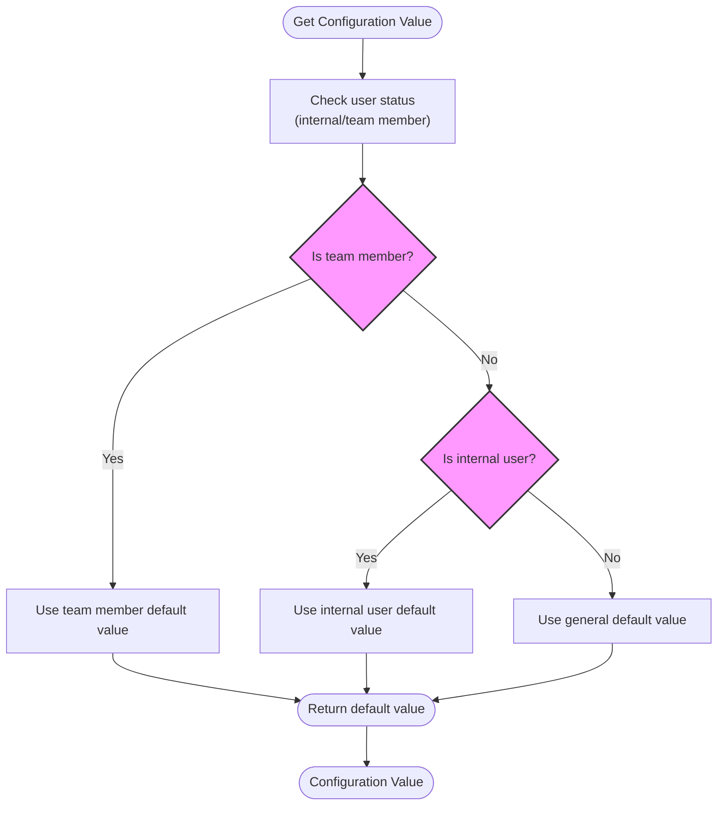
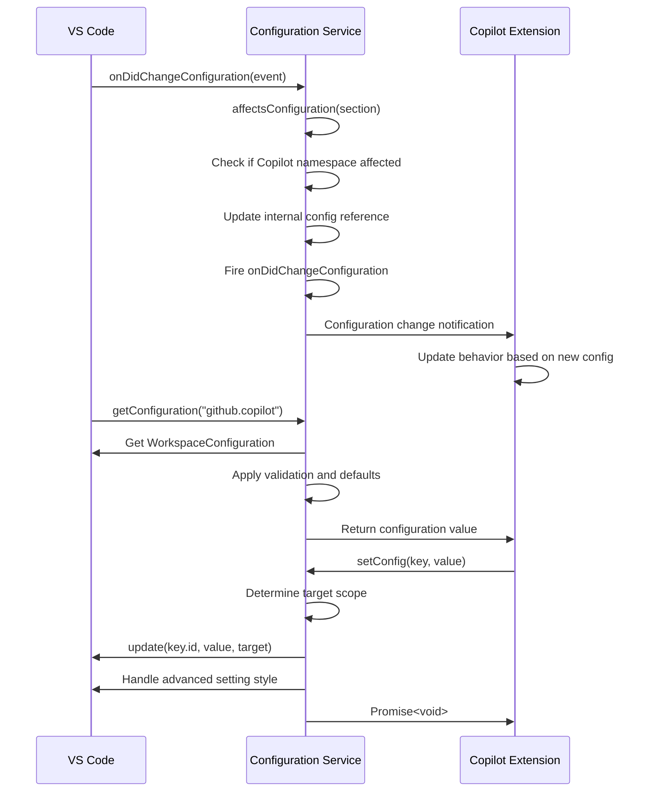
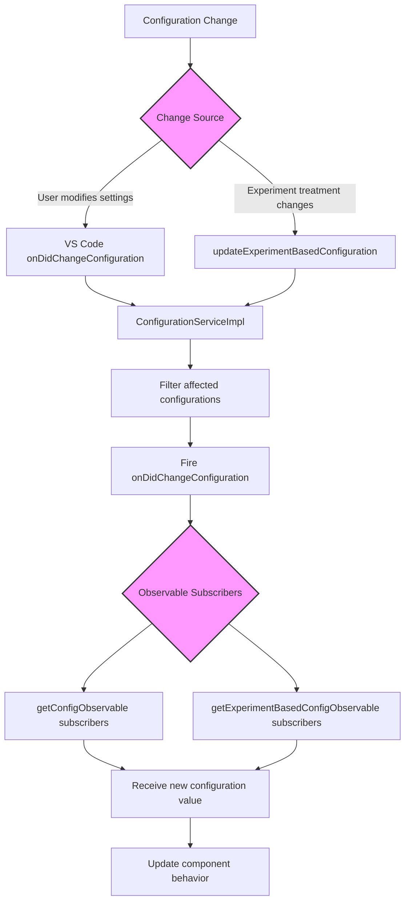
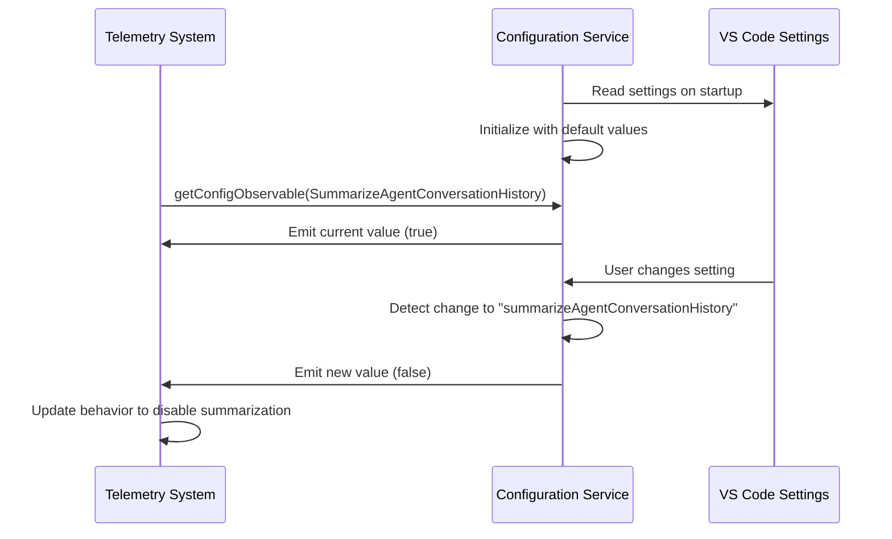
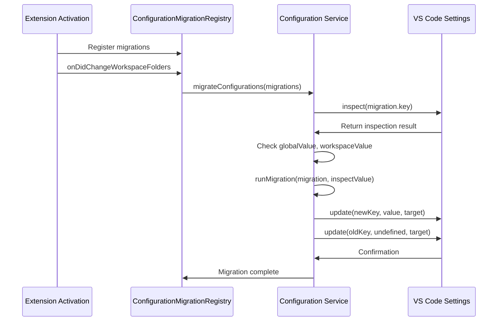
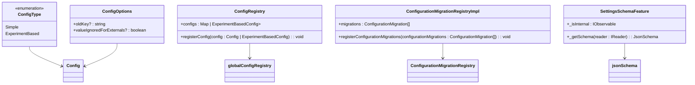

# Configuration Service

<cite>
**Referenced Files in This Document**   
- [configurationService.ts](file://src/platform/configuration/common/configurationService.ts)
- [configurationServiceImpl.ts](file://src/platform/configuration/vscode/configurationServiceImpl.ts)
- [validator.ts](file://src/platform/configuration/common/validator.ts)
- [jsonSchema.ts](file://src/platform/configuration/common/jsonSchema.ts)
- [configurationMigration.ts](file://src/extension/configuration/vscode-node/configurationMigration.ts)
- [settingsSchemaFeature.ts](file://src/extension/settingsSchema/vscode-node/settingsSchemaFeature.ts)
- [vscode.d.ts](file://src/extension/vscode.d.ts)
</cite>

## Table of Contents
1. [Introduction](#introduction)
2. [Configuration Service Interface](#configuration-service-interface)
3. [Configuration Schema and Validation](#configuration-schema-and-validation)
4. [Default Value Handling](#default-value-handling)
5. [VS Code Integration](#vs-code-integration)
6. [Configuration Change Propagation](#configuration-change-propagation)
7. [Feature Consumption of Configuration](#feature-consumption-of-configuration)
8. [Configuration Migration](#configuration-migration)
9. [Advanced Configuration Patterns](#advanced-configuration-patterns)
10. [Common Issues and Solutions](#common-issues-and-solutions)

## Introduction
The Configuration Service in the vscode-copilot-chat extension provides a comprehensive system for managing application settings, with support for default values, user overrides, experimentation, and secure handling of sensitive settings. This service acts as an abstraction layer over VS Code's native configuration system, providing enhanced functionality for the Copilot extension. The implementation follows a well-defined architecture that separates concerns between configuration definition, validation, storage, and consumption.

The service supports multiple configuration types including stable, preview, experimental, and advanced settings, each with different visibility and stability guarantees. It also provides mechanisms for configuration migration, schema validation, and dynamic updates when settings change. The design emphasizes type safety, validation, and proper handling of configuration inheritance across different scopes.

**Section sources**
- [configurationService.ts](file://src/platform/configuration/common/configurationService.ts#L1-L892)

## Configuration Service Interface
The Configuration Service exposes a well-defined interface through the `IConfigurationService` contract, which provides methods for retrieving, setting, and observing configuration values. The core methods include `getConfig<T>(key: Config<T>, scope?: ConfigurationScope): T` for retrieving configuration values with proper typing, and `getConfigObservable<T>(key: Config<T>): IObservable<T>` for creating reactive streams that update when configuration changes occur.

The service supports multiple configuration scopes including global (user), workspace, and workspace folder levels, following VS Code's configuration hierarchy. It also handles language-specific settings, allowing different values for different programming languages. The interface includes methods for inspecting configuration values across all scopes (`inspectConfig`), checking if a setting has been explicitly configured (`isConfigured`), and setting new values (`setConfig`).

For experimentation scenarios, the service provides `getExperimentBasedConfig` which retrieves values that may be influenced by A/B testing frameworks. This allows features to be gradually rolled out to users based on experimentation treatments while maintaining the ability to override via user settings.

```mermaid
classDiagram
class IConfigurationService {
+_serviceBrand : undefined
+getConfig(key : Config<T>, scope? : ConfigurationScope) : T
+getConfigObservable(key : Config<T>) : IObservable<T>
+inspectConfig(key : BaseConfig<T>, scope? : ConfigurationScope) : InspectConfigResult<T> | undefined
+isConfigured(key : BaseConfig<T>, scope? : ConfigurationScope) : boolean
+getNonExtensionConfig(configKey : string) : T | undefined
+setConfig(key : BaseConfig<T>, value : T) : Thenable<void>
+getExperimentBasedConfig(key : ExperimentBasedConfig<T>, experimentationService : IExperimentationService, scope? : ConfigurationScope) : T
+getExperimentBasedConfigObservable(key : ExperimentBasedConfig<T>, experimentationService : IExperimentationService) : IObservable<T>
+getConfigMixedWithDefaults(key : Config<T>) : T
+getDefaultValue(key : Config<T>) : T
+onDidChangeConfiguration : Event<ConfigurationChangeEvent>
+updateExperimentBasedConfiguration(treatments : string[]) : void
+dumpConfig() : { [key : string] : string }
}
class Config {
+id : string
+oldId? : string
+isPublic : boolean
+fullyQualifiedId : string
+fullyQualifiedOldId? : string
+advancedSubKey : string | undefined
+defaultValue : T | DefaultValueWithTeamValue<T> | DefaultValueWithTeamAndInternalValue<T>
+options? : ConfigOptions
+validator? : IValidator<T>
}
class ExperimentBasedConfig {
+configType : ConfigType.ExperimentBased
+experimentName : string | undefined
}
IConfigurationService <|-- AbstractConfigurationService
AbstractConfigurationService <|-- ConfigurationServiceImpl
Config <|-- ExperimentBasedConfig
```

**Diagram sources **
- [configurationService.ts](file://src/platform/configuration/common/configurationService.ts#L79-L163)
- [configurationService.ts](file://src/platform/configuration/common/configurationService.ts#L350-L394)

**Section sources**
- [configurationService.ts](file://src/platform/configuration/common/configurationService.ts#L79-L163)

## Configuration Schema and Validation
The Configuration Service implements a robust schema validation system that ensures configuration values adhere to expected types and constraints. The validation framework is built around the `IValidator<T>` interface, which defines a contract for validating configuration values and converting them to JSON Schema representations. The system provides built-in validators for primitive types including `vString()`, `vNumber()`, `vBoolean()`, as well as composite validators for objects, arrays, unions, and enums.

Configuration schemas are defined using a fluent API that allows for complex validation rules. For example, object validation is performed using `vObj<T>(properties: T)` which validates that an object contains the expected properties with appropriate types. Array validation is handled by `vArray<T>(validator: IValidator<T>)` which ensures all elements in an array conform to the specified validator. The system also supports union types through `vUnion<T extends IValidator<any>[]>(...validators: T)` which validates that a value matches at least one of the provided validators.

The validation system is tightly integrated with JSON Schema generation, allowing the service to automatically generate JSON Schema definitions for configuration properties. This enables IDE support such as IntelliSense and error highlighting in settings.json files. The `toSchema()` method on validators converts validation rules into standard JSON Schema format, which can be used by VS Code's settings editor.

```mermaid
classDiagram
class IValidator {
+validate(content : unknown) : { content : T; error : undefined } | { content : undefined; error : ValidationError }
+toSchema() : JsonSchema
+isRequired?() : boolean
}
class JsonSchema {
+$id? : string
+$schema? : string
+title? : string
+description? : string
+definitions? : { [name : string] : JsonSchema }
+enum? : unknown[]
+format? : string | Format
+if? : JsonSchema
+then? : JsonSchema
+else? : JsonSchema
+allOf? : JsonSchema[]
+anyOf? : JsonSchema[]
+oneOf? : JsonSchema[]
+not? : JsonSchema
}
class NumericJsonSchema {
+type : JsonSchemaType.Numeric | JsonSchemaType[]
+multipleOf? : number
+maximum? : number
+exclusiveMaximum? : boolean
+minimum? : number
+exclusiveMinimum? : boolean
}
class StringJsonSchema {
+type : typeof JsonSchemaType.string | JsonSchemaType[]
+maxLength? : number
+minLength? : number
+pattern? : string
}
class ArrayJsonSchema {
+type : typeof JsonSchemaType.array | JsonSchemaType[]
+items? : JsonSchema | JsonSchema[]
+additionalItems? : JsonSchema
+maxItems? : number
+minItems? : number
+uniqueItems? : boolean
+contains : JsonSchema
}
class ObjectJsonSchema {
+type : typeof JsonSchemaType.object | JsonSchemaType[]
+maxProperties? : number
+minProperties? : number
+required? : string[]
+properties? : { [name : string] : JsonSchema }
+patternProperties? : { [name : string] : JsonSchema }
+additionalProperties? : JsonSchema
+dependencies? : { [name : string] : JsonSchema | string[] }
}
IValidator <|-- TypeofValidator
JsonSchema <|-- NumericJsonSchema
JsonSchema <|-- StringJsonSchema
JsonSchema <|-- ArrayJsonSchema
JsonSchema <|-- ObjectJsonSchema
class vString {
+validate() : { content : string; error : undefined } | { content : undefined; error : ValidationError }
+toSchema() : JsonSchema
}
class vNumber {
+validate() : { content : number; error : undefined } | { content : undefined; error : ValidationError }
+toSchema() : JsonSchema
}
class vBoolean {
+validate() : { content : boolean; error : undefined } | { content : undefined; error : ValidationError }
+toSchema() : JsonSchema
}
class vObj {
+validate() : { content : any; error : undefined } | { content : undefined; error : ValidationError }
+toSchema() : JsonSchema
}
class vArray {
+validate() : { content : T[]; error : undefined } | { content : undefined; error : ValidationError }
+toSchema() : JsonSchema
}
IValidator <|-- vString
IValidator <|-- vNumber
IValidator <|-- vBoolean
IValidator <|-- vObj
IValidator <|-- vArray
```

**Diagram sources **
- [validator.ts](file://src/platform/configuration/common/validator.ts#L8-L292)
- [jsonSchema.ts](file://src/platform/configuration/common/jsonSchema.ts#L6-L139)

**Section sources**
- [validator.ts](file://src/platform/configuration/common/validator.ts#L8-L292)
- [jsonSchema.ts](file://src/platform/configuration/common/jsonSchema.ts#L6-L139)

## Default Value Handling
The Configuration Service implements a sophisticated default value system that supports different default values for internal users, team members, and external users. This is achieved through specialized default value types such as `DefaultValueWithTeamValue<T>` and `DefaultValueWithTeamAndInternalValue<T>`, which allow specifying different defaults for different user groups.

The default value resolution follows a specific hierarchy: team member defaults take precedence over internal user defaults, which in turn take precedence over general defaults. This allows the development team to use different default settings for testing and development purposes while maintaining appropriate defaults for external users. The system automatically detects the user's status (internal, team member) based on authentication tokens and selects the appropriate default value.

For object-valued settings, the service implements a merging strategy where user configuration is shallowly merged with default values, with user values taking precedence. This allows users to override specific properties of an object configuration while inheriting defaults for other properties. The merging is performed in `getConfigMixedWithDefaults<T>(key: Config<T>): T`, which combines default and user values appropriately.

The service also maintains a registry of configuration definitions (`globalConfigRegistry`) that stores metadata about all available settings, including their default values. This registry is populated at startup by reading the extension's package.json file and validating that default values in code match those in the package manifest.



**Diagram sources **
- [configurationService.ts](file://src/platform/configuration/common/configurationService.ts#L334-L338)
- [configurationService.ts](file://src/platform/configuration/common/configurationService.ts#L211-L223)

**Section sources**
- [configurationService.ts](file://src/platform/configuration/common/configurationService.ts#L334-L338)
- [configurationService.ts](file://src/platform/configuration/common/configurationService.ts#L211-L223)

## VS Code Integration
The Configuration Service integrates seamlessly with VS Code's native configuration system through the `ConfigurationServiceImpl` class, which acts as an adapter between the extension's configuration interface and VS Code's `WorkspaceConfiguration` API. This implementation handles the translation between the extension's configuration model and VS Code's settings storage format.

The service supports both flat and hierarchical styles for advanced settings. For settings under the "github.copilot.advanced" namespace, it can read values from either a flat structure (e.g., "github.copilot.advanced.debug.useElectronFetcher": false) or a nested object structure (e.g., "github.copilot.advanced": { "debug.useElectronFetcher": false }). When writing values, it prefers the nested object style to avoid conflicts, but will throw an error if a setting is already configured using the flat style to prevent accidental overwrites.

The integration includes proper handling of configuration change events, with the service listening to VS Code's `onDidChangeConfiguration` event and re-emitting it through its own `onDidChangeConfiguration` event. The event filtering ensures that only relevant configuration changes trigger updates, improving performance by avoiding unnecessary processing.

The service also implements a smart configuration target selection strategy in `_getTargetFromInspect` that determines where to write configuration values based on where they were previously set. This follows a "prefer-global" pattern where values are written to the same scope they were read from, but default to global scope if not previously configured, helping to maintain consistent settings across workspaces.



**Diagram sources **
- [configurationServiceImpl.ts](file://src/platform/configuration/vscode/configurationServiceImpl.ts#L22-L315)

**Section sources**
- [configurationServiceImpl.ts](file://src/platform/configuration/vscode/configurationServiceImpl.ts#L22-L315)

## Configuration Change Propagation
The Configuration Service implements a reactive system for propagating configuration changes throughout the application using observable patterns. When a configuration value changes, either through user modification or experimentation updates, the service emits events that can be observed by dependent components.

The core mechanism is the `getConfigObservable<T>(key: Config<T>): IObservable<T>` method, which returns an observable that emits the current configuration value and subsequent values whenever the configuration changes. This is implemented using `observableFromEventOpts` which connects the observable to the service's `onDidChangeConfiguration` event, filtering for changes that affect the specific configuration key.

For experimentation-based configurations, the service provides `updateExperimentBasedConfiguration(treatments: string[])` which is called by the experimentation system when treatment variables change. This method fires a simulated configuration change event that triggers updates to all observables watching experiment-based settings.

The propagation system includes optimizations to prevent unnecessary updates. The `observables` map in `AbstractConfigurationService` caches observable instances to avoid creating multiple observables for the same configuration key. The event filtering in `_getObservable_$show2FramesUp` ensures that observables only react to changes that actually affect their specific configuration key, reducing the performance impact of configuration changes.



**Diagram sources **
- [configurationService.ts](file://src/platform/configuration/common/configurationService.ts#L276-L301)
- [configurationServiceImpl.ts](file://src/platform/configuration/vscode/configurationServiceImpl.ts#L291-L313)

**Section sources**
- [configurationService.ts](file://src/platform/configuration/common/configurationService.ts#L276-L301)
- [configurationServiceImpl.ts](file://src/platform/configuration/vscode/configurationServiceImpl.ts#L291-L313)

## Feature Consumption of Configuration
Features throughout the vscode-copilot-chat extension consume configuration values through dependency injection, with the `IConfigurationService` registered as a service that can be injected into components. This pattern ensures that configuration access is centralized and testable, with components receiving the configuration service through constructor parameters.

A common pattern for consuming configuration is to use observables for dynamic updates. For example, the telemetry system uses configuration values to determine whether to include certain data in telemetry events:



The service is used extensively across various features:
- Telemetry systems use configuration to enable/disable specific telemetry collection
- Chat sessions use configuration to determine model selection and behavior
- Inline editing features use configuration to control debounce times and provider selection
- Authentication components use configuration to determine authentication provider and permissions

The consumption pattern typically follows these steps:
1. Inject `IConfigurationService` via dependency injection
2. Use `getConfig()` for static configuration values needed at initialization
3. Use `getConfigObservable()` for values that may change during runtime
4. Subscribe to observables to update component behavior when configuration changes

This approach ensures that features respond appropriately to configuration changes without requiring restarts or manual refreshes.

**Section sources**
- [chatParticipantTelemetry.ts](file://src/extension/prompt/node/chatParticipantTelemetry.ts#L539)
- [configurationService.ts](file://src/platform/configuration/common/configurationService.ts#L89)
- [configurationService.ts](file://src/platform/configuration/common/configurationService.ts#L97)

## Configuration Migration
The Configuration Service includes a robust migration system that allows for renaming configuration settings while maintaining backward compatibility. This is implemented through the `ConfigurationMigrationRegistry` which manages a collection of migration functions that transform old setting values to new locations.

Migration is particularly important for the Copilot extension as settings evolve during development. The system supports both simple renames and more complex transformations. When a setting is renamed, a migration function is registered that copies the value from the old key to the new key and removes the old key, ensuring users don't lose their custom settings.

The migration process is triggered automatically when the extension activates and when workspace folders change. It checks for the presence of old configuration values and applies the migration functions to update them. The system handles migrations at multiple scopes (global, workspace, workspace folder) to ensure consistent behavior across different configuration levels.

A key aspect of the migration system is its non-destructive nature - it copies values rather than moving them, allowing users to manually verify the migration before removing the old setting. The system also includes safeguards to prevent conflicts between flat and nested advanced setting styles during migration.



**Diagram sources **
- [configurationMigration.ts](file://src/extension/configuration/vscode-node/configurationMigration.ts#L1-L164)

**Section sources**
- [configurationMigration.ts](file://src/extension/configuration/vscode-node/configurationMigration.ts#L1-L164)

## Advanced Configuration Patterns
The Configuration Service implements several advanced patterns to support complex configuration scenarios. One key pattern is the support for experimentation-based configurations through the `ExperimentBasedConfig<T extends ExperimentBasedConfigType>` interface. This allows settings to be controlled by A/B testing frameworks, with values determined by experimentation treatments that can override both user settings and defaults.

Another advanced pattern is the handling of team-internal settings through `defineTeamInternalSetting`. These settings are restricted to internal users and team members, with different default values for each group. This enables the development team to test features with different configurations without affecting external users.

The service also implements a sophisticated system for advanced settings under the "github.copilot.advanced" namespace, supporting both flat and hierarchical access patterns. This dual-style support accommodates different user preferences while maintaining compatibility with VS Code's configuration schema requirements.

For secure handling of sensitive settings, the service includes mechanisms to filter out secret values when dumping configuration for debugging purposes. The `dumpConfig()` method specifically excludes properties named "secret_key" from the output, preventing accidental exposure of sensitive information.

The configuration definition system uses a registry pattern with `globalConfigRegistry` that collects all configuration definitions at startup. This enables features like the settings schema provider to generate JSON Schema for all available settings, improving the developer experience with proper IntelliSense and validation in settings.json files.



**Diagram sources **
- [configurationService.ts](file://src/platform/configuration/common/configurationService.ts#L396-L413)
- [configurationService.ts](file://src/platform/configuration/common/configurationService.ts#L457-L468)
- [settingsSchemaFeature.ts](file://src/extension/settingsSchema/vscode-node/settingsSchemaFeature.ts#L14-L56)

**Section sources**
- [configurationService.ts](file://src/platform/configuration/common/configurationService.ts#L396-L413)
- [configurationService.ts](file://src/platform/configuration/common/configurationService.ts#L457-L468)
- [settingsSchemaFeature.ts](file://src/extension/settingsSchema/vscode-node/settingsSchemaFeature.ts#L14-L56)

## Common Issues and Solutions
The Configuration Service addresses several common issues in configuration management through its design and implementation. One common issue is configuration inheritance and scope resolution, which is handled by following VS Code's well-defined hierarchy: default → global → workspace → workspace folder → language-specific values. The service correctly implements this precedence order in its `getConfig` method.

Another common issue is the handling of configuration changes during runtime. The service solves this through its observable pattern, allowing components to react to changes without polling or requiring restarts. The event filtering ensures that only relevant changes trigger updates, maintaining good performance.

For the issue of configuration migration when settings are renamed, the service provides a systematic migration framework that automatically updates old settings to new names while preserving user values. This prevents configuration loss during extension updates.

The service also addresses the challenge of maintaining consistency between package.json schema and code definitions through validation at startup. The `defineSetting` function verifies that default values in code match those in package.json, preventing discrepancies that could confuse users.

For team development, the service solves the issue of different default values for development versus production through the `DefaultValueWithTeamValue` and `DefaultValueWithTeamAndInternalValue` types, allowing team members to use different defaults for testing while maintaining appropriate defaults for external users.

Finally, the service addresses the issue of configuration discoverability through the `SettingsSchemaFeature`, which provides JSON Schema for internal users, enabling proper IntelliSense and validation in settings.json files for advanced settings that are not publicly documented.

**Section sources**
- [configurationService.ts](file://src/platform/configuration/common/configurationService.ts#L437-L448)
- [configurationServiceImpl.ts](file://src/platform/configuration/vscode/configurationServiceImpl.ts#L184-L193)
- [settingsSchemaFeature.ts](file://src/extension/settingsSchema/vscode-node/settingsSchemaFeature.ts#L34-L52)