# Service Layer

<cite>
**Referenced Files in This Document**   
- [authentication.ts](file://src/platform/authentication/common/authentication.ts)
- [configurationService.ts](file://src/platform/configuration/common/configurationService.ts)
- [telemetry.ts](file://src/platform/telemetry/common/telemetry.ts)
- [workspaceService.ts](file://src/platform/workspace/common/workspaceService.ts)
- [chatQuotaService.ts](file://src/platform/chat/common/chatQuotaService.ts)
- [interactionService.ts](file://src/platform/chat/common/interactionService.ts)
- [nullExperimentationService.ts](file://src/platform/telemetry/common/nullExperimentationService.ts)
- [fetcherService.ts](file://src/platform/networking/common/fetcherService.ts)
- [chatMLFetcher.ts](file://src/platform/chat/common/chatMLFetcher.ts)
- [chatLibMain.ts](file://src/lib/node/chatLibMain.ts)
- [services.ts](file://src/util/common/services.ts)
</cite>

## Table of Contents
1. [Introduction](#introduction)
2. [Service Architecture Overview](#service-architecture-overview)
3. [Core Service Interfaces](#core-service-interfaces)
4. [Dependency Injection System](#dependency-injection-system)
5. [Configuration Service](#configuration-service)
6. [Authentication Service](#authentication-service)
7. [Telemetry Service](#telemetry-service)
8. [Workspace Service](#workspace-service)
9. [Chat Session and Interaction Services](#chat-session-and-interaction-services)
10. [Service Lifecycle Management](#service-lifecycle-management)
11. [Error Handling and State Persistence](#error-handling-and-state-persistence)
12. [Feature Implementation Examples](#feature-implementation-examples)
13. [Common Issues and Solutions](#common-issues-and-solutions)

## Introduction
The service layer of the vscode-copilot-chat extension provides a comprehensive framework for managing core functionality including configuration, authentication, telemetry, workspace operations, and chat sessions. This document details the implementation of these services, their interfaces, dependencies, and integration through the dependency injection system. The service layer follows a modular architecture that enables extensibility and testability while maintaining separation of concerns across different functional domains.

## Service Architecture Overview

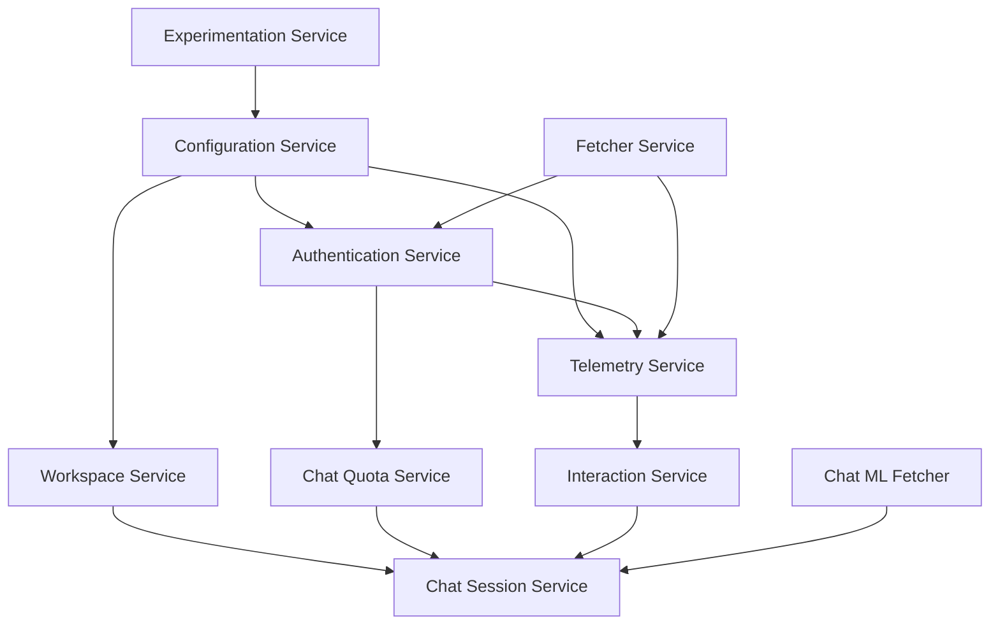

**Diagram sources**
- [authentication.ts](file://src/platform/authentication/common/authentication.ts)
- [configurationService.ts](file://src/platform/configuration/common/configurationService.ts)
- [telemetry.ts](file://src/platform/telemetry/common/telemetry.ts)
- [workspaceService.ts](file://src/platform/workspace/common/workspaceService.ts)
- [chatQuotaService.ts](file://src/platform/chat/common/chatQuotaService.ts)
- [interactionService.ts](file://src/platform/chat/common/interactionService.ts)

## Core Service Interfaces

The service layer is built around well-defined interfaces that establish contracts for functionality while enabling implementation flexibility. Each service interface extends the base service pattern with the `_serviceBrand` property to enable type safety in the dependency injection system.

```mermaid
classDiagram
class IConfigurationService {
+getConfig(key, scope) T
+getConfigObservable(key) IObservable~T~
+inspectConfig(key, scope) InspectConfigResult~T~
+isConfigured(key, scope) boolean
+getNonExtensionConfig(configKey) T | undefined
+setConfig(key, value) Thenable~void~
+getExperimentBasedConfig(key, experimentationService, scope) T
+getExperimentBasedConfigObservable(key, experimentationService) IObservable~T~
+getConfigMixedWithDefaults(key) T
+getDefaultValue(key) T
+onDidChangeConfiguration Event~ConfigurationChangeEvent~
+updateExperimentBasedConfiguration(treatments) void
+dumpConfig() { [key : string] : string }
}
class IAuthenticationService {
+isMinimalMode boolean
+onDidAuthenticationChange Event~void~
+onDidAccessTokenChange Event~void~
+anyGitHubSession AuthenticationSession | undefined
+getAnyGitHubSession(options) Promise~AuthenticationSession | undefined~
+permissiveGitHubSession AuthenticationSession | undefined
+getPermissiveGitHubSession(options) Promise~AuthenticationSession | undefined~
+copilotToken Omit~CopilotToken, 'token'~ | undefined
+speculativeDecodingEndpointToken string | undefined
+getCopilotToken(force) Promise~CopilotToken~
+resetCopilotToken(httpError) void
+onDidAdoAuthenticationChange Event~void~
+getAdoAccessTokenBase64(options) Promise~string | undefined~
}
class ITelemetryService {
+sendInternalMSFTTelemetryEvent(eventName, properties, measurements) void
+sendMSFTTelemetryEvent(eventName, properties, measurements) void
+sendMSFTTelemetryErrorEvent(eventName, properties, measurements) void
+sendGHTelemetryEvent(eventName, properties, measurements) void
+sendGHTelemetryErrorEvent(eventName, properties, measurements) void
+sendGHTelemetryException(maybeError, origin) void
+sendEnhancedGHTelemetryEvent(eventName, properties, measurements) void
+sendEnhancedGHTelemetryErrorEvent(eventName, properties, measurements) void
+sendTelemetryEvent(eventName, destination, properties, measurements) void
+sendTelemetryErrorEvent(eventName, destination, properties, measurements) void
+setSharedProperty(name, value) void
+setAdditionalExpAssignments(expAssignments) void
+postEvent(eventName, props) void
+sendEnhancedGHTelemetryEvent(eventName, properties, measurements) void
+sendEnhancedGHTelemetryErrorEvent(eventName, properties, measurements) void
}
class IWorkspaceService {
+textDocuments readonly TextDocument[]
+notebookDocuments readonly NotebookDocument[]
+onDidOpenTextDocument Event~TextDocument~
+onDidCloseTextDocument Event~TextDocument~
+onDidOpenNotebookDocument Event~NotebookDocument~
+onDidCloseNotebookDocument Event~NotebookDocument~
+onDidChangeTextDocument Event~TextDocumentChangeEvent~
+onDidChangeNotebookDocument Event~NotebookDocumentChangeEvent~
+onDidChangeWorkspaceFolders Event~WorkspaceFoldersChangeEvent~
+onDidChangeTextEditorSelection Event~TextEditorSelectionChangeEvent~
+openTextDocument(uri) Promise~TextDocument~
+fs FileSystem
+showTextDocument(document) Promise~void~
+openTextDocumentAndSnapshot(uri) Promise~TextDocumentSnapshot~
+openNotebookDocumentAndSnapshot(uri, format) Promise~NotebookDocumentSnapshot~
+openNotebookDocument(uri) Promise~NotebookDocument~
+openNotebookDocument(notebookType, content) Promise~NotebookDocument~
+getWorkspaceFolders() URI[]
+getWorkspaceFolder(resource) URI | undefined
+getWorkspaceFolderName(workspaceFolderUri) string
+showWorkspaceFolderPicker() Promise~WorkspaceFolder | undefined~
+asRelativePath(pathOrUri, includeWorkspaceFolder) string
+applyEdit(edit) Thenable~boolean~
+ensureWorkspaceIsFullyLoaded() Promise~void~
}
class IChatQuotaService {
+quotaExhausted boolean
+overagesEnabled boolean
+processQuotaHeaders(headers) void
+clearQuota() void
}
class IInteractionService {
+interactionId string
+startInteraction() void
}
IConfigurationService <|-- AbstractConfigurationService
IAuthenticationService <|-- BaseAuthenticationService
ITelemetryService <|-- IExperimentationTelemetry
IWorkspaceService <|-- AbstractWorkspaceService
IChatQuotaService <|-- ChatQuotaService
IInteractionService <|-- InteractionService
```

**Diagram sources**
- [configurationService.ts](file://src/platform/configuration/common/configurationService.ts)
- [authentication.ts](file://src/platform/authentication/common/authentication.ts)
- [telemetry.ts](file://src/platform/telemetry/common/telemetry.ts)
- [workspaceService.ts](file://src/platform/workspace/common/workspaceService.ts)
- [chatQuotaService.ts](file://src/platform/chat/common/chatQuotaService.ts)
- [interactionService.ts](file://src/platform/chat/common/interactionService.ts)

## Dependency Injection System

The service layer utilizes a dependency injection system based on the `InstantiationService` pattern, which manages service instantiation and dependency resolution. Services are registered with the service collection using service identifiers created through the `createServiceIdentifier` function.

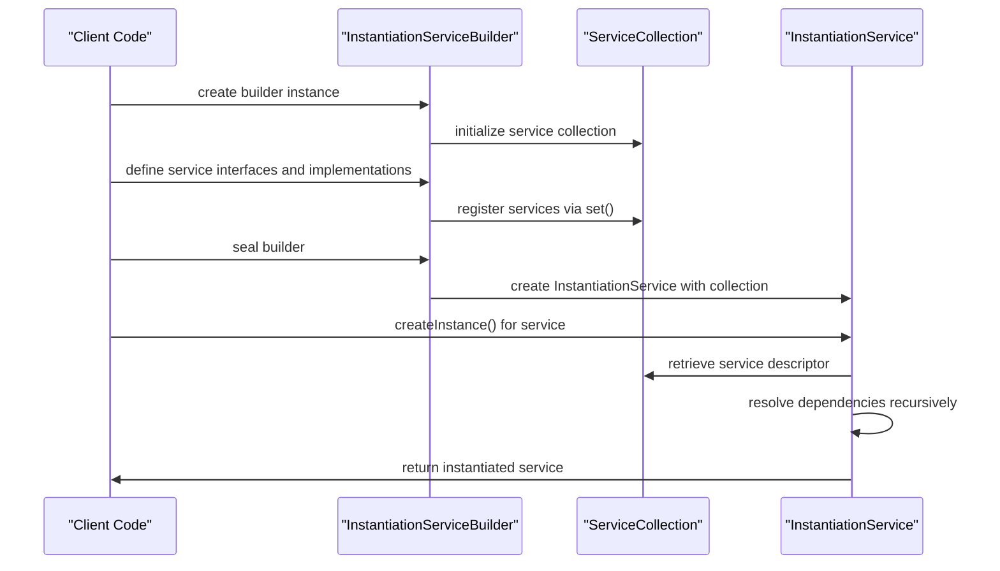

**Diagram sources**
- [services.ts](file://src/util/common/services.ts)
- [chatLibMain.ts](file://src/lib/node/chatLibMain.ts)

## Configuration Service

The configuration service provides a unified interface for accessing extension settings from various sources including user configuration, workspace settings, and experimentation variables. It supports both synchronous and observable access patterns for configuration values.

### Configuration Value Types
The configuration system supports different types of configuration values with specific handling patterns:

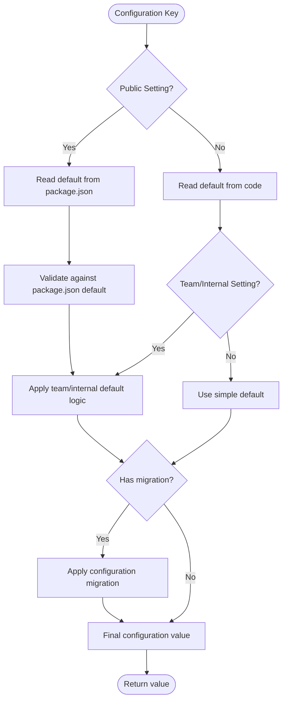

**Section sources**
- [configurationService.ts](file://src/platform/configuration/common/configurationService.ts)
- [defaultsOnlyConfigurationService.ts](file://src/platform/configuration/common/defaultsOnlyConfigurationService.ts)

## Authentication Service

The authentication service manages user authentication state and token management for GitHub and Azure DevOps services. It provides both minimal and permissive authentication modes with appropriate scope handling.

### Authentication Flow
The authentication service implements a multi-layered approach to token management and session handling:

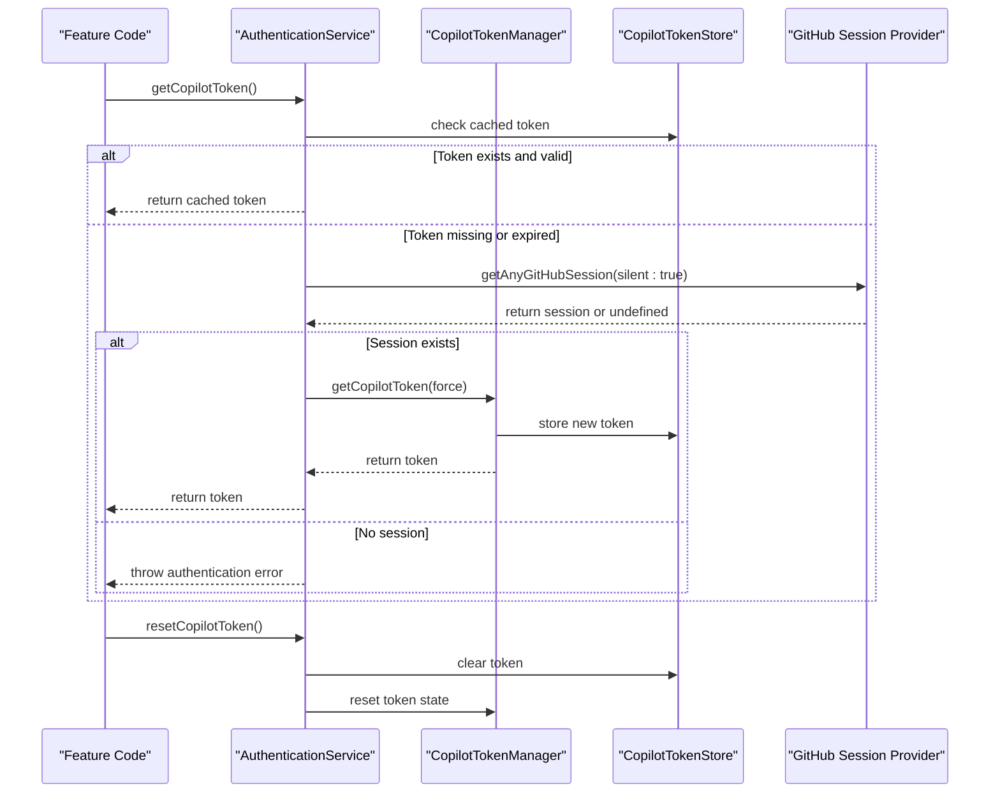

**Section sources**
- [authentication.ts](file://src/platform/authentication/common/authentication.ts)

## Telemetry Service

The telemetry service provides a comprehensive framework for collecting and reporting usage data, errors, and performance metrics to both Microsoft and GitHub endpoints. It supports multiple telemetry destinations with appropriate filtering and privacy controls.

### Telemetry Architecture
The telemetry service implements a multi-destination reporting system with configurable privacy settings:

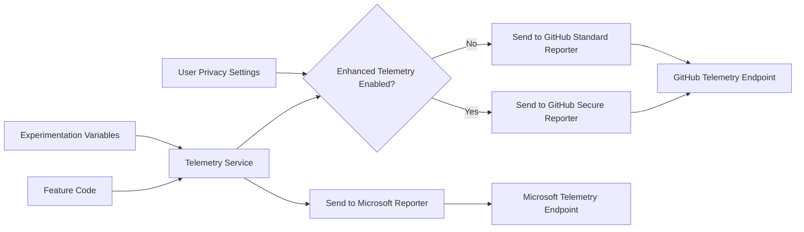

**Section sources**
- [telemetry.ts](file://src/platform/telemetry/common/telemetry.ts)
- [nullExperimentationService.ts](file://src/platform/telemetry/common/nullExperimentationService.ts)

## Workspace Service

The workspace service provides a unified interface for interacting with the user's workspace, including file operations, document management, and folder navigation. It abstracts the underlying VS Code workspace APIs while adding additional functionality specific to the Copilot extension.

### Workspace Operations
The workspace service supports various operations for managing workspace resources:

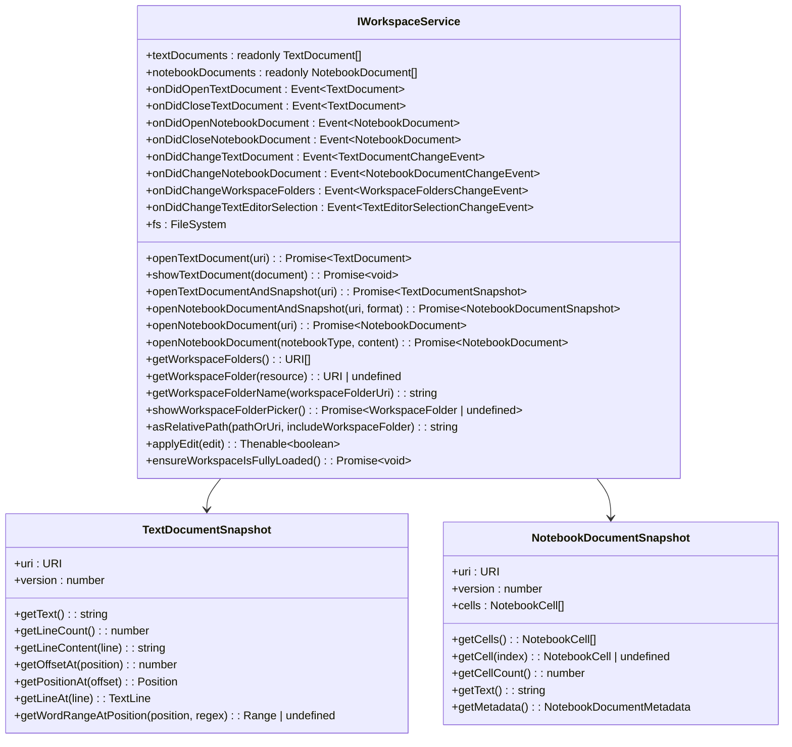

**Section sources**
- [workspaceService.ts](file://src/platform/workspace/common/workspaceService.ts)

## Chat Session and Interaction Services

The chat session and interaction services manage the lifecycle of chat interactions, including session state, quota management, and user interaction tracking.

### Chat Quota Management
The chat quota service monitors and enforces usage limits for chat interactions:

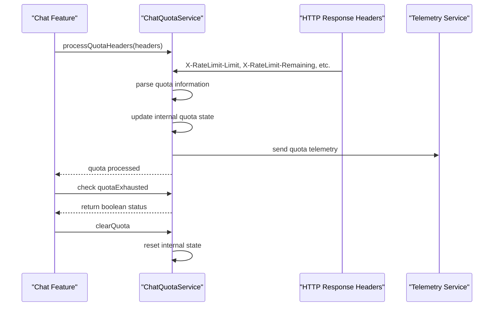

### Interaction Tracking
The interaction service provides a mechanism for grouping related chat operations:

```mermaid
flowchart TD
A[User starts chat] --> B[InteractionService.startInteraction()]
B --> C[Generate new interactionId]
C --> D[Feature uses interactionId for telemetry]
D --> E[All requests in interaction share same ID]
E --> F[User starts new chat]
F --> B
```

**Section sources**
- [chatQuotaService.ts](file://src/platform/chat/common/chatQuotaService.ts)
- [interactionService.ts](file://src/platform/chat/common/interactionService.ts)

## Service Lifecycle Management

The service layer implements a comprehensive lifecycle management system that handles service initialization, dependency resolution, and cleanup.

### Service Initialization Order
The dependency injection system ensures proper initialization order based on service dependencies:

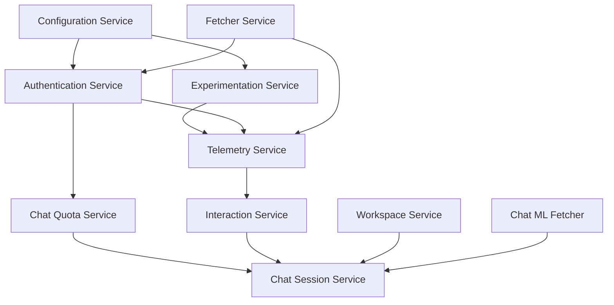

Services are initialized in dependency order, with configuration and authentication services typically being among the first to initialize, followed by telemetry and quota services, and finally the feature-specific services that depend on them.

**Section sources**
- [chatLibMain.ts](file://src/lib/node/chatLibMain.ts)

## Error Handling and State Persistence

The service layer implements robust error handling and state persistence mechanisms to ensure reliability and consistent user experience.

### Error Handling Strategy
The services follow a consistent error handling pattern that includes:

- Centralized error logging through the telemetry service
- Graceful degradation when services are unavailable
- Automatic retry mechanisms for transient failures
- Clear error messages for user-facing issues

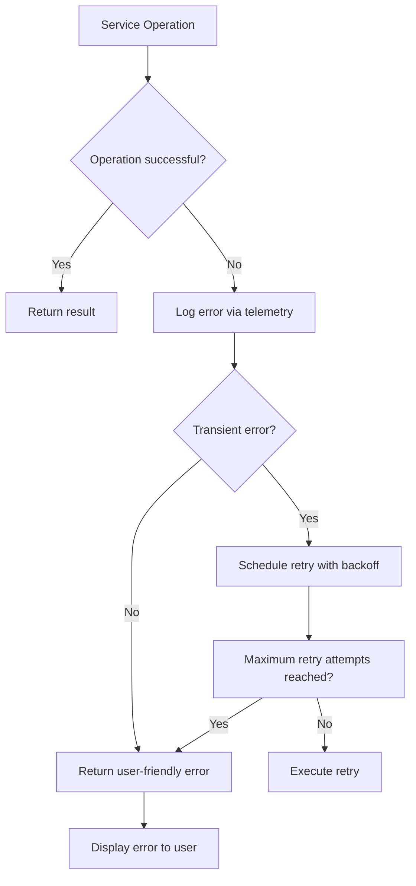

### State Persistence
State persistence is handled through a combination of in-memory caching and secure storage:

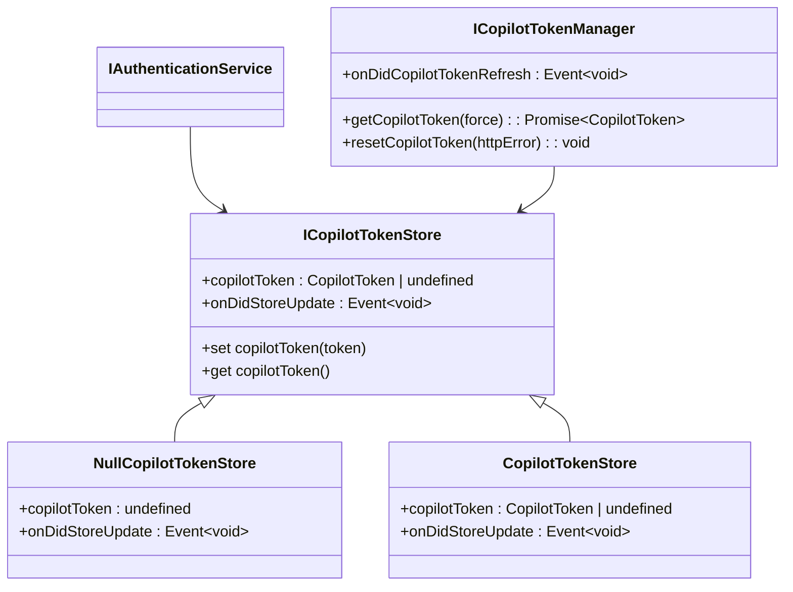

**Section sources**
- [authentication.ts](file://src/platform/authentication/common/authentication.ts)
- [telemetry.ts](file://src/platform/telemetry/common/telemetry.ts)

## Feature Implementation Examples

### Inline Editing Service Integration
The inline editing feature utilizes multiple services to provide code suggestions:

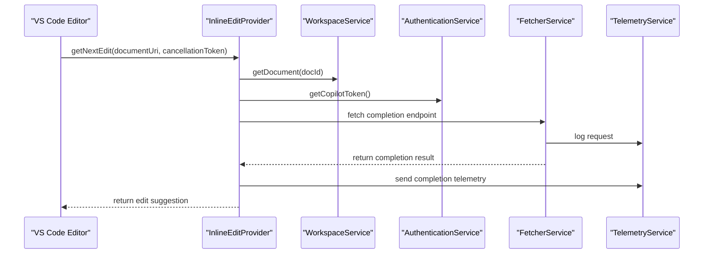

### Code Generation Service Integration
The code generation feature combines configuration, authentication, and telemetry services:

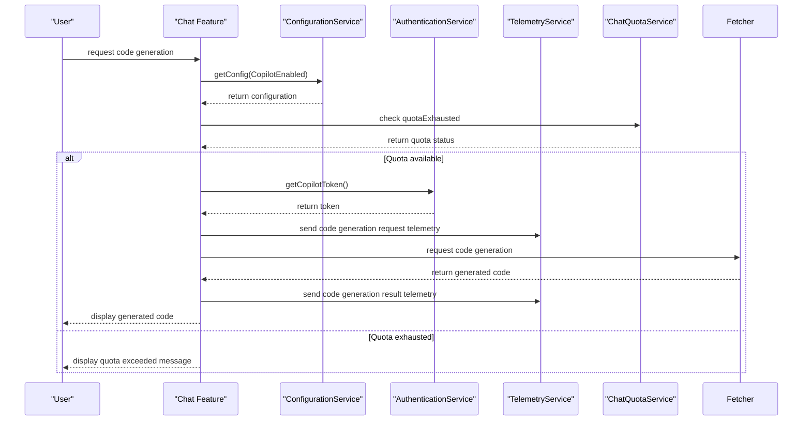

**Section sources**
- [chatLibMain.ts](file://src/lib/node/chatLibMain.ts)

## Common Issues and Solutions

### Service Initialization Order Issues
When services have circular dependencies or incorrect initialization order, the system may fail to start properly.

**Solution**: Use lazy initialization and the `waitForTreatmentVariables` pattern to defer service initialization until dependencies are ready.

```typescript
// Example from chatLibMain.ts
function setupServices(options: INESProviderOptions) {
    const builder = new InstantiationServiceBuilder();
    // Register services in dependency order
    builder.define(IConfigurationService, new SyncDescriptor(DefaultsOnlyConfigurationService));
    builder.define(IExperimentationService, new SyncDescriptor(SimpleExperimentationService, [options.waitForTreatmentVariables]));
    // ... other services
    return builder.seal();
}
```

### Authentication State Synchronization
Multiple components may need to react to authentication state changes.

**Solution**: Use the `onDidAuthenticationChange` event to notify all interested parties of authentication state changes.

```typescript
// Example pattern
this._authenticationService.onDidAuthenticationChange(() => {
    // Refresh token, update UI, etc.
    this.refreshAuthenticationState();
});
```

### Configuration Migration Challenges
When configuration keys change between versions, user settings may be lost.

**Solution**: Implement configuration migration registry to automatically migrate old settings to new keys.

```typescript
// Example from configurationService.ts
function migrateSetting(newKey: string, oldKey: string): void {
    ConfigurationMigrationRegistry.registerConfigurationMigrations([{
        key: `${CopilotConfigPrefix}.${oldKey}`,
        migrateFn: async (migrationValue: any) => {
            return [
                [`${CopilotConfigPrefix}.${newKey}`, { value: migrationValue }],
                [`${CopilotConfigPrefix}.${oldKey}`, { value: undefined }]
            ];
        }
    }]);
}
```

**Section sources**
- [configurationService.ts](file://src/platform/configuration/common/configurationService.ts)
- [chatLibMain.ts](file://src/lib/node/chatLibMain.ts)