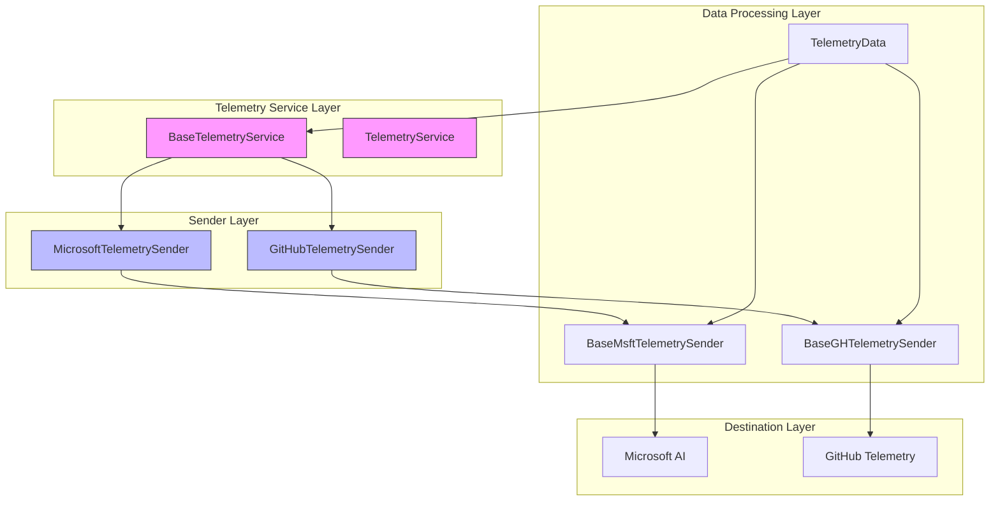
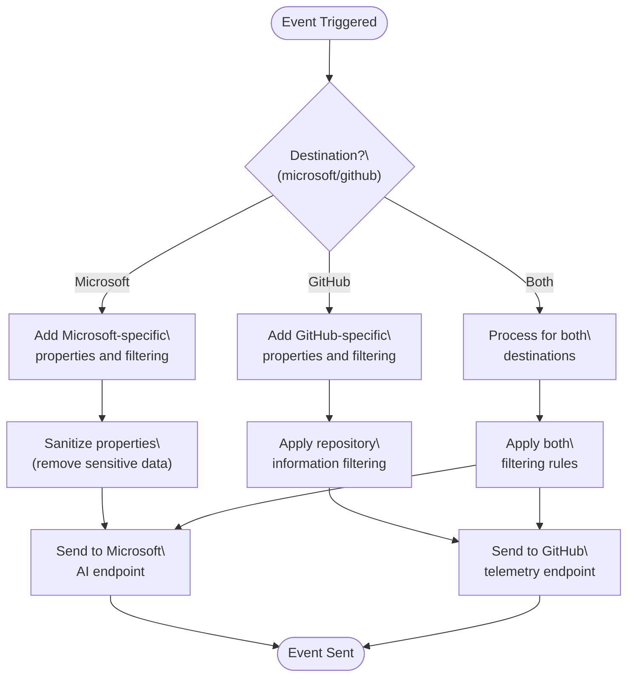
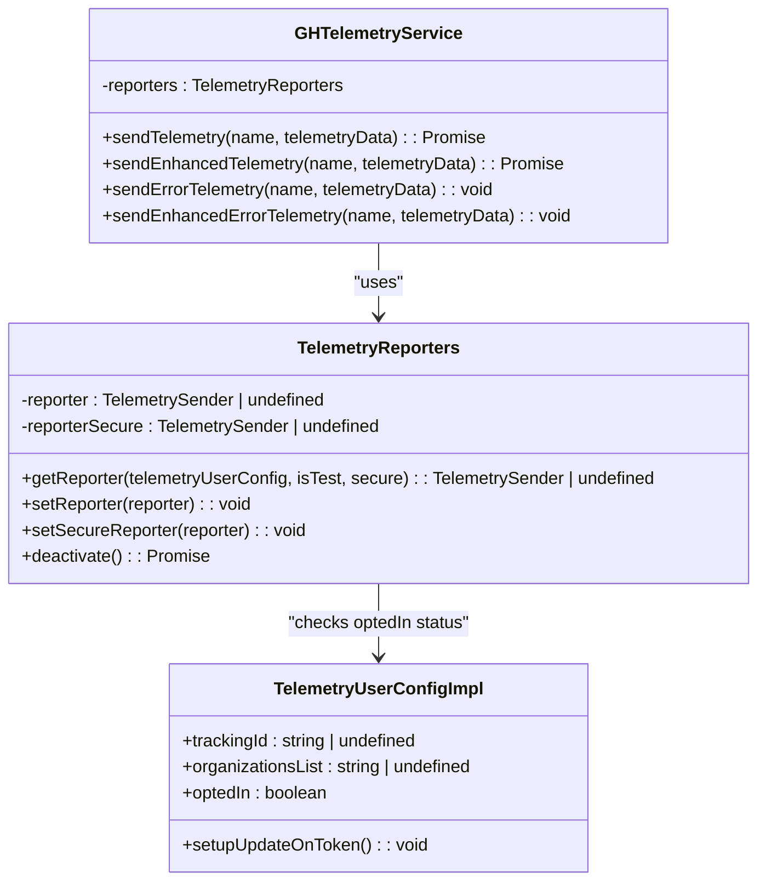
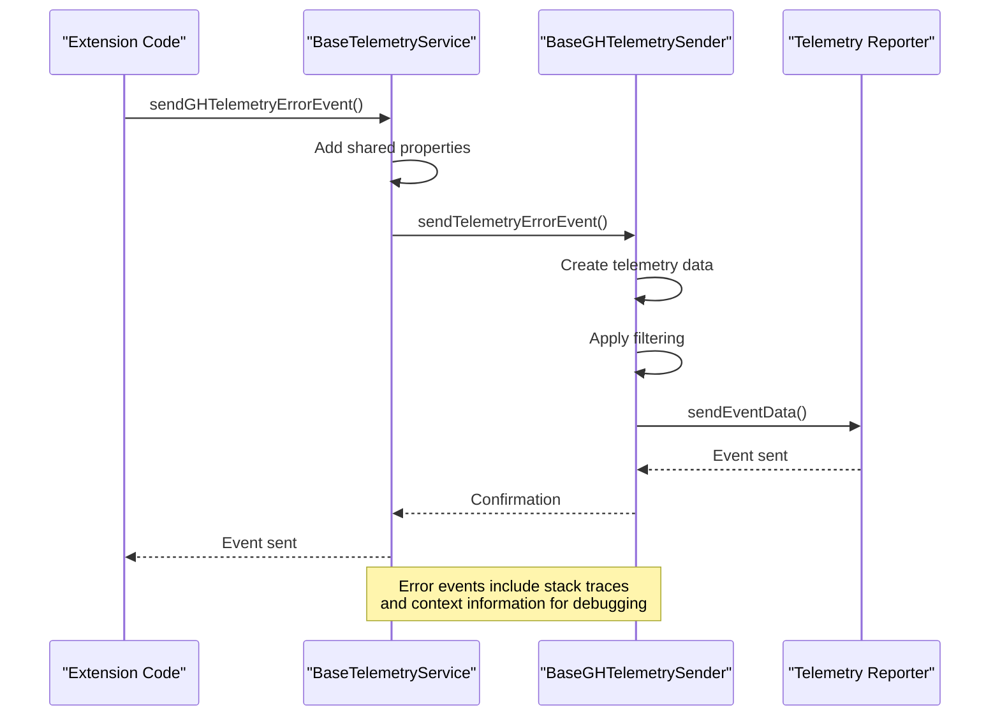
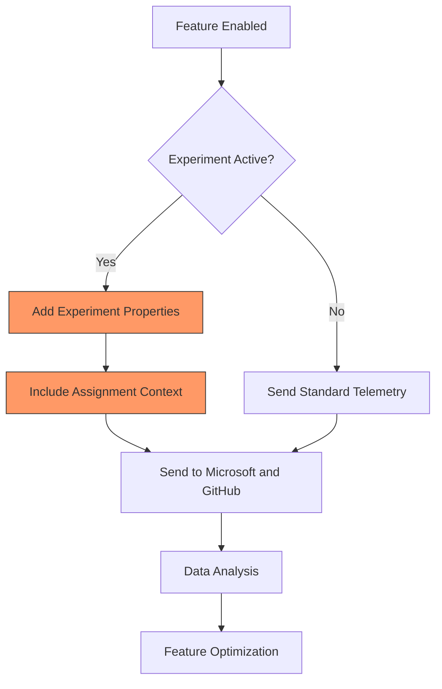
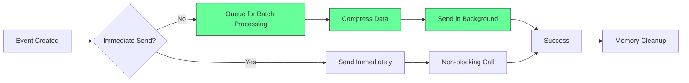

# Telemetry Service

<cite>
**Referenced Files in This Document**   
- [baseTelemetryService.ts](file://src/platform/telemetry/common/baseTelemetryService.ts)
- [telemetry.ts](file://src/platform/telemetry/common/telemetry.ts)
- [telemetryData.ts](file://src/platform/telemetry/common/telemetryData.ts)
- [ghTelemetryService.ts](file://src/platform/telemetry/common/ghTelemetryService.ts)
- [ghTelemetrySender.ts](file://src/platform/telemetry/common/ghTelemetrySender.ts)
- [msftTelemetrySender.ts](file://src/platform/telemetry/common/msftTelemetrySender.ts)
- [telemetryServiceImpl.ts](file://src/platform/telemetry/vscode-node/telemetryServiceImpl.ts)
- [githubTelemetrySender.ts](file://src/platform/telemetry/vscode-node/githubTelemetrySender.ts)
- [microsoftTelemetrySender.ts](file://src/platform/telemetry/vscode-node/microsoftTelemetrySender.ts)
- [lifecycleTelemetryContrib.ts](file://src/extension/telemetry/common/lifecycleTelemetryContrib.ts)
- [githubTelemetryForwardingContrib.ts](file://src/extension/telemetry/vscode/githubTelemetryForwardingContrib.ts)
</cite>

## Table of Contents
1. [Introduction](#introduction)
2. [Telemetry Architecture Overview](#telemetry-architecture-overview)
3. [Core Components](#core-components)
4. [Data Models and Event Structure](#data-models-and-event-structure)
5. [Event Categorization and Filtering](#event-categorization-and-filtering)
6. [Privacy Considerations](#privacy-considerations)
7. [Error Reporting and Exception Handling](#error-reporting-and-exception-handling)
8. [Experiment Tracking](#experiment-tracking)
9. [Performance Impact and Optimization](#performance-impact-and-optimization)
10. [Adding New Telemetry Events](#adding-new-telemetry-events)
11. [Conclusion](#conclusion)

## Introduction

The Telemetry Service in the vscode-copilot-chat extension is a comprehensive system designed to collect, process, and report user interaction data and feature usage metrics to both GitHub and Microsoft endpoints. This service enables the development team to understand user behavior, identify usage patterns, monitor feature adoption, and improve the overall user experience while maintaining strict privacy standards.

The telemetry system is built with a modular architecture that separates concerns between data collection, processing, and transmission. It supports multiple telemetry destinations with different privacy levels and provides mechanisms for filtering sensitive information. The service is designed to be extensible, allowing new events to be added while maintaining consistency in data collection and reporting.

**Section sources**
- [baseTelemetryService.ts](file://src/platform/telemetry/common/baseTelemetryService.ts#L1-L173)
- [telemetry.ts](file://src/platform/telemetry/common/telemetry.ts#L1-L217)

## Telemetry Architecture Overview

The telemetry architecture consists of multiple layers that work together to collect, process, and transmit telemetry data. The system is designed with separation of concerns, allowing for independent development and testing of different components.



**Diagram sources**
- [baseTelemetryService.ts](file://src/platform/telemetry/common/baseTelemetryService.ts#L12-L173)
- [telemetryServiceImpl.ts](file://src/platform/telemetry/vscode-node/telemetryServiceImpl.ts#L19-L68)
- [githubTelemetrySender.ts](file://src/platform/telemetry/vscode-node/githubTelemetrySender.ts#L16-L37)
- [microsoftTelemetrySender.ts](file://src/platform/telemetry/vscode-node/microsoftTelemetrySender.ts#L10-L30)

## Core Components

The telemetry system consists of several core components that work together to collect and transmit data. The main components include the BaseTelemetryService, which serves as the central interface for sending telemetry events, and specialized sender classes that handle transmission to different endpoints.

The BaseTelemetryService class implements the ITelemetryService interface and provides methods for sending telemetry events to both Microsoft and GitHub endpoints. It manages shared properties across events and handles the routing of events to the appropriate sender based on the destination.

The sender components (BaseMsftTelemetrySender and BaseGHTelemetrySender) are responsible for the actual transmission of telemetry data to their respective endpoints. These components handle authentication, data formatting, and error handling specific to each telemetry destination.

**Section sources**
- [baseTelemetryService.ts](file://src/platform/telemetry/common/baseTelemetryService.ts#L12-L173)
- [msftTelemetrySender.ts](file://src/platform/telemetry/common/msftTelemetrySender.ts#L17-L135)
- [ghTelemetrySender.ts](file://src/platform/telemetry/common/ghTelemetrySender.ts#L19-L133)

## Data Models and Event Structure

The telemetry system uses a structured data model to represent telemetry events. The core data structure is the TelemetryData class, which encapsulates event properties, measurements, and timing information.

```mermaid
classDiagram
class TelemetryData {
+properties : { [key : string] : string }
+measurements : { [key : string] : number | undefined }
+issuedTime : number
+displayedTime? : number
+createAndMarkAsIssued(properties?, measurements?) : TelemetryData
+extendedBy(properties?, measurements?) : TelemetryData
+markAsDisplayed() : void
+makeReadyForSending(configService, envService, telemetryConfig) : void
+sanitizeKeys() : void
}
class TelemetryEventProperties {
<<interface>>
readonly [key : string] : string | TelemetryTrustedValue<string> | undefined
}
class TelemetryEventMeasurements {
<<interface>>
readonly [key : string] : number | undefined
}
class TelemetryDestination {
github : boolean | { eventNamePrefix : string }
microsoft : boolean
}
TelemetryData --> TelemetryEventProperties : "uses"
TelemetryData --> TelemetryEventMeasurements : "uses"
BaseTelemetryService --> TelemetryDestination : "uses"
```

**Diagram sources**
- [telemetryData.ts](file://src/platform/telemetry/common/telemetryData.ts#L12-L208)
- [telemetry.ts](file://src/platform/telemetry/common/telemetry.ts#L13-L88)

The TelemetryData class provides several important methods for managing telemetry data:

- `createAndMarkAsIssued()`: Creates a new telemetry data object with the current timestamp
- `extendedBy()`: Creates a new telemetry data object that extends the current one with additional properties and measurements
- `markAsDisplayed()`: Records the time when the telemetry event was displayed to the user
- `makeReadyForSending()`: Prepares the telemetry data for transmission by adding environment and configuration information
- `sanitizeKeys()`: Processes property keys to ensure they meet telemetry system requirements

The system distinguishes between properties (string values) and measurements (numeric values), allowing for different types of data to be collected and analyzed. Properties typically contain categorical information like feature names or user settings, while measurements contain quantitative data like durations or counts.

## Event Categorization and Filtering

The telemetry service implements a sophisticated system for categorizing and filtering events based on their destination and sensitivity level. Events can be sent to Microsoft, GitHub, or both endpoints, with different filtering rules applied based on the destination.



**Diagram sources**
- [baseTelemetryService.ts](file://src/platform/telemetry/common/baseTelemetryService.ts#L58-L126)
- [ghTelemetryService.ts](file://src/platform/telemetry/common/ghTelemetryService.ts#L136-L243)

The system supports different types of telemetry events:

- **Standard telemetry events**: Basic usage data that can be disabled through VS Code's telemetry settings
- **Enhanced telemetry events**: Contain additional data such as user prompts and suggestions, which can be disabled through Copilot settings
- **Internal telemetry events**: For Microsoft internal use only, containing additional diagnostic information

The filtering system removes sensitive repository information from standard telemetry events while preserving it for enhanced telemetry when the user has opted in. This is implemented through the `maybeRemoveRepoInfoFromPropertiesHack()` method in the TelemetryData class, which selectively removes repository-related properties based on the security level of the telemetry event.

## Privacy Considerations

Privacy is a fundamental aspect of the telemetry system design. The service implements multiple layers of protection to ensure user data is handled appropriately and in compliance with privacy regulations.

The system uses a dual-reporter model for GitHub telemetry, with separate reporters for standard and enhanced telemetry:



**Diagram sources**
- [ghTelemetryService.ts](file://src/platform/telemetry/common/ghTelemetryService.ts#L16-L249)
- [telemetry.ts](file://src/platform/telemetry/common/telemetry.ts#L38-L78)

Key privacy features include:

1. **Opt-in for enhanced telemetry**: Users must explicitly opt in to share enhanced telemetry data containing prompts and suggestions
2. **Path redaction**: Sensitive file paths are redacted from telemetry data using the `redactPaths()` function
3. **Property sanitization**: Telemetry property keys are sanitized to remove dots and ensure compatibility with the telemetry system
4. **Repository information filtering**: Repository metadata is removed from standard telemetry events to protect user privacy
5. **Trusted values**: The TelemetryTrustedValue class allows specific properties to bypass default sanitization when necessary

The system also includes mechanisms to handle exceptions securely. When an exception occurs, a placeholder event is sent to standard telemetry, while the full error details are only sent to enhanced telemetry if the user has opted in to share this data.

## Error Reporting and Exception Handling

The telemetry service provides comprehensive error reporting capabilities that help identify and diagnose issues in the extension. The system distinguishes between regular telemetry events and error telemetry, with different handling for each type.



**Diagram sources**
- [baseTelemetryService.ts](file://src/platform/telemetry/common/baseTelemetryService.ts#L62-L64)
- [ghTelemetrySender.ts](file://src/platform/telemetry/common/ghTelemetrySender.ts#L70-L72)
- [msftTelemetrySender.ts](file://src/platform/telemetry/common/msftTelemetrySender.ts#L98-L107)

The error reporting system includes several specialized methods:

- `sendTelemetryErrorEvent()`: Sends an error event with properties and measurements
- `sendGHTelemetryException()`: Handles exceptions and sends appropriate telemetry based on opt-in status
- `sendInternalMSFTTelemetryEvent()`: Sends internal telemetry events for Microsoft staff

When an exception occurs, the system creates a placeholder event for standard telemetry with basic information about the error origin, while the full exception details are only sent to enhanced telemetry if the user has opted in. This approach balances the need for diagnostic information with user privacy concerns.

## Experiment Tracking

The telemetry service includes functionality for tracking experiments and A/B testing, allowing the development team to measure the impact of new features and changes. The system integrates with the experimentation service to collect data on feature usage and user behavior.



**Diagram sources**
- [baseTelemetryService.ts](file://src/platform/telemetry/common/baseTelemetryService.ts#L128-L146)
- [telemetry.ts](file://src/platform/telemetry/common/telemetry.ts#L25-L36)

Key experiment tracking features include:

- **Shared properties**: The `setSharedProperty()` method allows experiment assignments to be included in all telemetry events
- **Assignment context**: Experiment assignments are tracked in the `abexp.assignmentcontext` property
- **Feature querying**: The `query-expfeature` GDPR comment indicates when experiment features are queried
- **Cross-platform tracking**: Experiment data is sent to both Microsoft and GitHub endpoints for comprehensive analysis

The system uses the `setAdditionalExpAssignments()` method to update the experiment assignment context, ensuring that all subsequent telemetry events include the current experiment state. This allows for accurate measurement of feature impact across different user segments.

## Performance Impact and Optimization

The telemetry service is designed to minimize performance impact on the extension and user experience. Several optimization strategies are implemented to ensure telemetry collection does not affect responsiveness.



**Diagram sources**
- [ghTelemetryService.ts](file://src/platform/telemetry/common/ghTelemetryService.ts#L72-L80)
- [baseTelemetryService.ts](file://src/platform/telemetry/common/baseTelemetryService.ts#L54-L56)

Performance optimizations include:

1. **Asynchronous processing**: All telemetry operations are performed asynchronously to avoid blocking the main thread
2. **Promise tracking**: The `enablePromiseTracking()` method allows monitoring of pending telemetry operations
3. **Batch processing**: Events are sent in batches to reduce network overhead
4. **Memory management**: The system properly disposes of resources and cleans up after itself
5. **Error resilience**: Failed telemetry operations do not affect extension functionality

The service also implements property multiplexing to handle large property values. When a property exceeds the maximum length (8192 characters), it is split into multiple properties with numbered suffixes, allowing large data to be transmitted while staying within system limits.

## Adding New Telemetry Events

Adding new telemetry events to the system follows a standardized pattern that ensures consistency and proper handling. Developers should use the appropriate methods based on the event type and destination.

```mermaid
flowchart TD
A[Identify Event Type] --> B{Usage or Error?}
B --> |Usage| C[Choose Destination]
B --> |Error| D[Use Error Methods]
C --> E{Microsoft, GitHub, or Both?}
E --> |Microsoft| F[sendMSFTTelemetryEvent()]
E --> |GitHub| G[sendGHTelemetryEvent()]
E --> |Both| H[sendTelemetryEvent()]
D --> I[sendTelemetryErrorEvent()]
F --> J[Add Properties and Measurements]
G --> J
H --> J
I --> J
J --> K[Ensure Privacy Compliance]
K --> L[Add GDPR Comments]
L --> M[Event Added]
style F fill:#6af,stroke:#333
style G fill:#6af,stroke:#333
style H fill:#6af,stroke:#333
style I fill:#6af,stroke:#333
```

**Diagram sources**
- [baseTelemetryService.ts](file://src/platform/telemetry/common/baseTelemetryService.ts#L58-L126)
- [telemetry.ts](file://src/platform/telemetry/common/telemetry.ts#L99-L110)

When adding new telemetry events, follow these guidelines:

1. **Choose the appropriate method**:
   - `sendMSFTTelemetryEvent()`: For events sent only to Microsoft
   - `sendGHTelemetryEvent()`: For events sent only to GitHub
   - `sendTelemetryEvent()`: For events sent to both destinations
   - `sendTelemetryErrorEvent()`: For error events

2. **Include relevant properties and measurements**:
   - Use properties for categorical data (feature names, settings)
   - Use measurements for numerical data (durations, counts)

3. **Ensure privacy compliance**:
   - Avoid including sensitive information in standard telemetry
   - Use enhanced telemetry for detailed data when appropriate
   - Redact paths and other sensitive information

4. **Add GDPR comments**: Include appropriate GDPR comments for new events to ensure compliance

5. **Test thoroughly**: Verify that events are sent correctly and that privacy protections work as expected

## Conclusion

The Telemetry Service in the vscode-copilot-chat extension provides a robust, privacy-conscious system for collecting and analyzing user interaction data. The modular architecture separates concerns between data collection, processing, and transmission, making the system maintainable and extensible.

Key strengths of the telemetry system include:

- **Dual destination support**: Ability to send data to both Microsoft and GitHub endpoints
- **Privacy by design**: Comprehensive privacy protections including opt-in for enhanced data and automatic filtering of sensitive information
- **Flexible event categorization**: Support for different event types and destinations
- **Robust error reporting**: Comprehensive exception handling with appropriate privacy safeguards
- **Experiment tracking**: Integrated support for A/B testing and feature measurement
- **Performance optimization**: Asynchronous processing and other optimizations to minimize impact on user experience

The system strikes a balance between collecting valuable usage data to improve the product and respecting user privacy. By following the established patterns and guidelines, developers can add new telemetry events that provide insights while maintaining the trust of users.