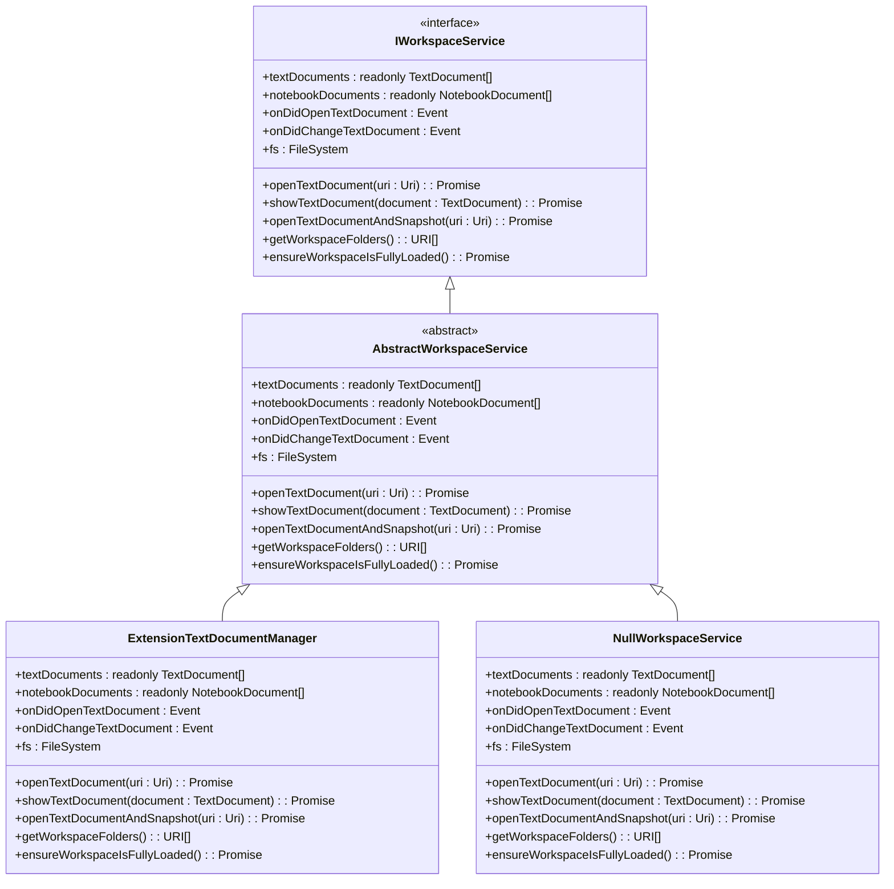
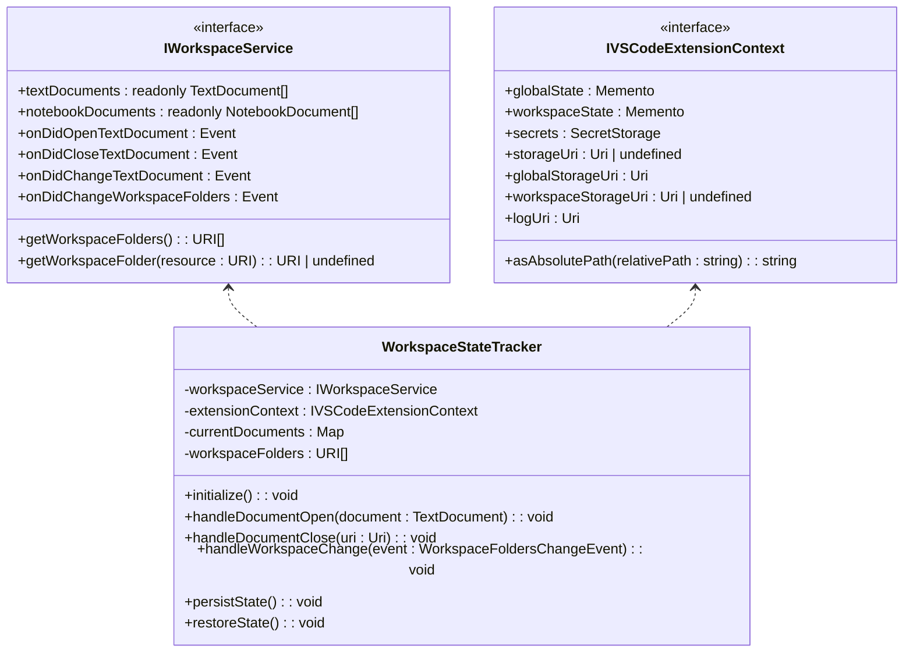
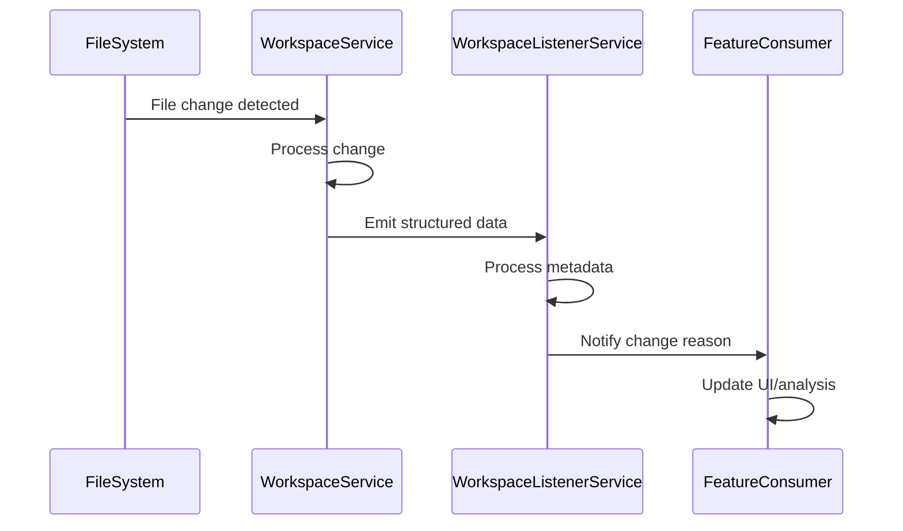
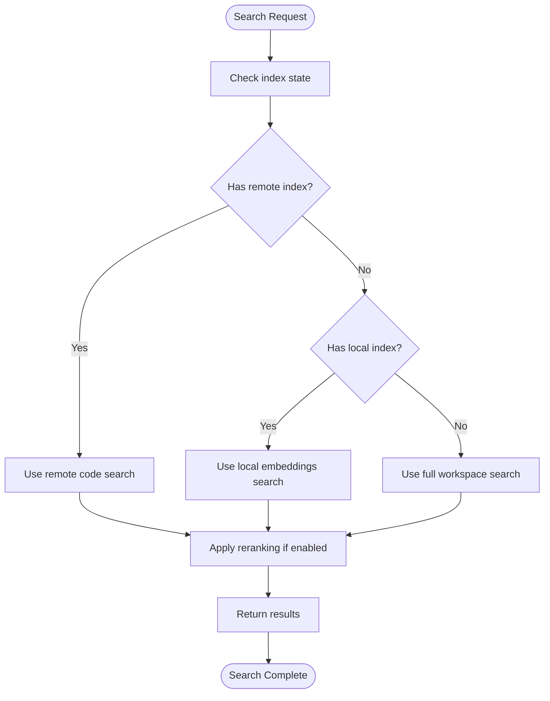
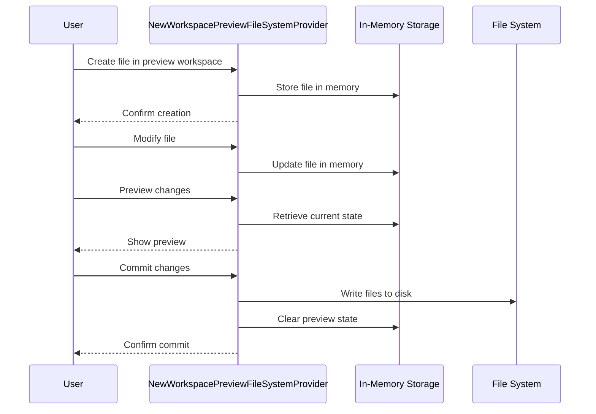
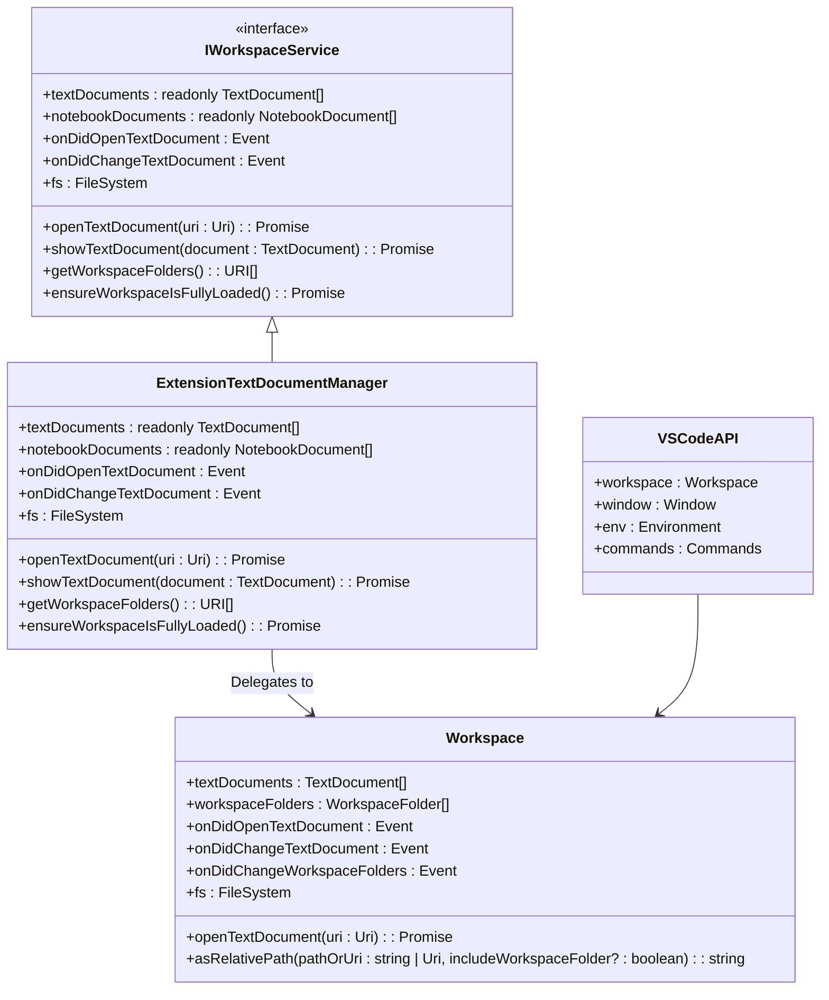

# Workspace Service

<cite>
**Referenced Files in This Document**   
- [workspaceService.ts](file://src/platform/workspace/common/workspaceService.ts)
- [workspaceServiceImpl.ts](file://src/platform/workspace/vscode/workspaceServiceImpl.ts)
- [fileSystemService.ts](file://src/platform/filesystem/common/fileSystemService.ts)
- [fileSystemServiceImpl.ts](file://src/platform/filesystem/vscode/fileSystemServiceImpl.ts)
- [workspaceChunkSearchService.ts](file://src/platform/workspaceChunkSearch/node/workspaceChunkSearchService.ts)
- [semanticSearchTextSearchProvider.ts](file://src/extension/workspaceSemanticSearch/node/semanticSearchTextSearchProvider.ts)
- [workspaceListenerService.ts](file://src/extension/workspaceRecorder/vscode-node/workspaceListenerService.ts)
- [workspaceRecorder.ts](file://src/extension/workspaceRecorder/vscode-node/workspaceRecorder.ts)
- [newWorkspacePreviewFileSystemProvider.ts](file://src/extension/intents/vscode-node/newWorkspacePreviewFileSystemProvider.ts)
</cite>

## Table of Contents
1. [Introduction](#introduction)
2. [Core Architecture](#core-architecture)
3. [File System Operations](#file-system-operations)
4. [Workspace State Tracking](#workspace-state-tracking)
5. [Change Monitoring and Event Handling](#change-monitoring-and-event-handling)
6. [Workspace Indexing and Search](#workspace-indexing-and-search)
7. [Performance Optimization](#performance-optimization)
8. [Virtual Workspace Support](#virtual-workspace-support)
9. [Integration with VS Code APIs](#integration-with-vs-code-apis)
10. [Common Issues and Solutions](#common-issues-and-solutions)

## Introduction

The Workspace Service in the vscode-copilot-chat extension provides a comprehensive abstraction layer for managing workspace operations, file system interactions, and state tracking. This service acts as a bridge between the extension's AI capabilities and the underlying VS Code workspace, enabling features like code search, inline editing, and context-aware suggestions. The service is designed with a modular architecture that separates concerns between workspace state management, file operations, and event handling, ensuring maintainability and extensibility.

The Workspace Service implements a service-oriented architecture with clear interfaces and dependency injection, allowing for easy testing and replacement of implementations. It provides both synchronous access to workspace state and asynchronous operations for file system interactions, ensuring responsiveness while maintaining data consistency. The service also includes sophisticated indexing and search capabilities that enable semantic code search across large repositories.

**Section sources**
- [workspaceService.ts](file://src/platform/workspace/common/workspaceService.ts#L1-L227)

## Core Architecture

The Workspace Service follows a layered architecture with clear separation between interface definitions, implementation, and integration points. At its core is the `IWorkspaceService` interface that defines the contract for workspace operations, implemented by the `ExtensionTextDocumentManager` class which integrates with VS Code's native workspace APIs.

The architecture employs the Abstract Factory pattern through the service identifier system, allowing for dependency injection and easy replacement of implementations. The `AbstractWorkspaceService` class provides common functionality that can be shared across different implementations, including the `NullWorkspaceService` used for testing scenarios.



**Diagram sources**
- [workspaceService.ts](file://src/platform/workspace/common/workspaceService.ts#L17-L227)
- [workspaceServiceImpl.ts](file://src/platform/workspace/vscode/workspaceServiceImpl.ts#L14-L113)

**Section sources**
- [workspaceService.ts](file://src/platform/workspace/common/workspaceService.ts#L1-L227)
- [workspaceServiceImpl.ts](file://src/platform/workspace/vscode/workspaceServiceImpl.ts#L1-L113)

## File System Operations

The Workspace Service provides comprehensive file system operations through the `IFileSystemService` interface, which abstracts VS Code's native file system API. This interface supports standard operations such as file reading, writing, directory creation, and file system watching, with additional methods for handling large files and ensuring write safety.

The service implements a layered approach to file system operations, with the `fileSystemServiceImpl.ts` providing the concrete implementation that delegates to VS Code's `workspace.fs` API. This abstraction allows for consistent error handling and additional functionality like file size limits and JSON parsing with caching.

```mermaid
classDiagram
class IFileSystemService {
<<interface>>
+stat(uri : Uri) : Promise<FileStat>
+readDirectory(uri : Uri) : Promise<[string, FileType][]>
+createDirectory(uri : Uri) : Promise<void>
+readFile(uri : Uri, disableLimit? : boolean) : Promise<Uint8Array>
+writeFile(uri : Uri, content : Uint8Array) : Promise<void>
+delete(uri : Uri, options? : { recursive? : boolean; useTrash? : boolean }) : Promise<void>
+rename(oldURI : Uri, newURI : Uri, options? : { overwrite? : boolean }) : Promise<void>
+copy(source : Uri, destination : Uri, options? : { overwrite? : boolean }) : Promise<void>
+isWritableFileSystem(scheme : string) : boolean
+createFileSystemWatcher(glob : string | RelativePattern) : FileSystemWatcher
}
class FileSystemServiceImpl {
+stat(uri : Uri) : Promise<FileStat>
+readDirectory(uri : Uri) : Promise<[string, FileType][]>
+createDirectory(uri : Uri) : Promise<void>
+readFile(uri : Uri, disableLimit? : boolean) : Promise<Uint8Array>
+writeFile(uri : Uri, content : Uint8Array) : Promise<void>
+delete(uri : Uri, options? : { recursive? : boolean; useTrash? : boolean }) : Promise<void>
+rename(oldURI : Uri, newURI : Uri, options? : { overwrite? : boolean }) : Promise<void>
+copy(source : Uri, destination : Uri, options? : { overwrite? : boolean }) : Promise<void>
+isWritableFileSystem(scheme : string) : boolean
+createFileSystemWatcher(glob : string | RelativePattern) : FileSystemWatcher
}
IFileSystemService <|-- FileSystemServiceImpl
```

The service also includes specialized file system providers for virtual workspaces, such as the `NewWorkspacePreviewFileSystemProvider`, which allows for previewing workspace changes before they are committed. This provider implements VS Code's `FileSystemProvider` interface and handles file operations in memory, enabling features like workspace creation previews.

**Diagram sources**
- [fileSystemService.ts](file://src/platform/filesystem/common/fileSystemService.ts#L17-L44)
- [fileSystemServiceImpl.ts](file://src/platform/filesystem/vscode/fileSystemServiceImpl.ts#L36-L55)

**Section sources**
- [fileSystemService.ts](file://src/platform/filesystem/common/fileSystemService.ts#L1-L44)
- [fileSystemServiceImpl.ts](file://src/platform/filesystem/vscode/fileSystemServiceImpl.ts#L1-L55)
- [newWorkspacePreviewFileSystemProvider.ts](file://src/extension/intents/vscode-node/newWorkspacePreviewFileSystemProvider.ts#L1-L34)

## Workspace State Tracking

The Workspace Service maintains comprehensive state tracking through multiple mechanisms, including document state, workspace folder state, and custom state persistence. The service provides real-time access to open text and notebook documents through observable properties and events, enabling reactive programming patterns.

State tracking is implemented through a combination of direct access to VS Code's workspace state and custom state management. The `IWorkspaceService` interface exposes properties like `textDocuments` and `notebookDocuments` that provide current snapshots of the workspace state, while events like `onDidChangeTextDocument` and `onDidChangeWorkspaceFolders` notify consumers of state changes.

For persistent state across sessions, the service integrates with VS Code's extension context through the `IVSCodeExtensionContext` interface. This allows the service to store and retrieve workspace-specific data, such as indexing preferences and search history, ensuring consistent behavior across editor restarts.



The service also includes specialized state tracking for workspace recording and editing operations, with classes like `workspaceRecorder.ts` that capture and persist workspace changes for features like edit history and code suggestions.

**Diagram sources**
- [workspaceService.ts](file://src/platform/workspace/common/workspaceService.ts#L19-L52)
- [workspaceServiceImpl.ts](file://src/platform/workspace/vscode/workspaceServiceImpl.ts#L24-L68)
- [workspaceRecorder.ts](file://src/extension/workspaceRecorder/vscode-node/workspaceRecorder.ts)

**Section sources**
- [workspaceService.ts](file://src/platform/workspace/common/workspaceService.ts#L1-L227)
- [workspaceServiceImpl.ts](file://src/platform/workspace/vscode/workspaceServiceImpl.ts#L1-L113)
- [workspaceRecorder.ts](file://src/extension/workspaceRecorder/vscode-node/workspaceRecorder.ts)

## Change Monitoring and Event Handling

The Workspace Service implements a robust change monitoring system that tracks file system changes, document modifications, and workspace configuration updates. This system is built on VS Code's event-driven architecture, leveraging the `Event` and `Emitter` patterns to provide real-time notifications of workspace changes.

The service exposes multiple event streams through the `IWorkspaceService` interface, including `onDidOpenTextDocument`, `onDidChangeTextDocument`, and `onDidChangeWorkspaceFolders`. These events enable consumers to react to workspace changes in real-time, supporting features like automatic code analysis and context-aware suggestions.

For more detailed change tracking, the service includes specialized listeners like the `WorkspacListenerService` in `workspaceListenerService.ts`, which captures structured data about document changes and edit reasons. This service uses VS Code's data channel API to receive structured logging data, enabling detailed analysis of user interactions and edit patterns.



The change monitoring system also includes debouncing and throttling mechanisms to prevent excessive event processing, particularly for high-frequency operations like typing. This ensures that the service remains responsive even during intensive editing sessions.

**Diagram sources**
- [workspaceService.ts](file://src/platform/workspace/common/workspaceService.ts#L23-L32)
- [workspaceListenerService.ts](file://src/extension/workspaceRecorder/vscode-node/workspaceListenerService.ts#L1-L68)

**Section sources**
- [workspaceService.ts](file://src/platform/workspace/common/workspaceService.ts#L1-L227)
- [workspaceListenerService.ts](file://src/extension/workspaceRecorder/vscode-node/workspaceListenerService.ts#L1-L68)

## Workspace Indexing and Search

The Workspace Service provides sophisticated indexing and search capabilities through the `IWorkspaceChunkSearchService` interface and its implementation in `workspaceChunkSearchService.ts`. This system enables semantic code search across large repositories by creating and maintaining multiple indexing strategies.

The search architecture supports multiple indexing strategies, including embeddings-based search, code search, TF-IDF, and full workspace search. These strategies are encapsulated in the `IWorkspaceChunkSearchStrategy` interface, allowing for flexible selection based on workspace characteristics and user preferences.


The search system integrates with VS Code's AI text search provider through the `SemanticSearchTextSearchProvider` class, enabling seamless integration with the editor's search functionality. This provider combines multiple search strategies and applies reranking to deliver the most relevant results.

**Diagram sources**
- [workspaceChunkSearchService.ts](file://src/platform/workspaceChunkSearch/node/workspaceChunkSearchService.ts#L76-L97)
- [workspaceChunkSearch.ts](file://src/platform/workspaceChunkSearch/common/workspaceChunkSearch.ts#L87-L114)
- [semanticSearchTextSearchProvider.ts](file://src/extension/workspaceSemanticSearch/node/semanticSearchTextSearchProvider.ts#L63-L677)

**Section sources**
- [workspaceChunkSearchService.ts](file://src/platform/workspaceChunkSearch/node/workspaceChunkSearchService.ts#L1-L868)
- [workspaceChunkSearch.ts](file://src/platform/workspaceChunkSearch/common/workspaceChunkSearch.ts#L1-L115)
- [semanticSearchTextSearchProvider.ts](file://src/extension/workspaceSemanticSearch/node/semanticSearchTextSearchProvider.ts#L1-L677)

## Performance Optimization

The Workspace Service implements several performance optimization strategies to ensure responsiveness with large repositories and complex operations. These optimizations include lazy loading, caching, and intelligent resource management.

One key optimization is the use of token-based budgeting in the search system, which limits the amount of data processed based on token counts rather than file counts. This prevents performance degradation when searching large files or repositories with many small files. The `MAX_CHUNK_TOKEN_COUNT` and `MAX_CHUNKS_RESULTS` constants in `workspaceContext.ts` define these limits.

The service also implements intelligent indexing strategies that adapt to workspace characteristics. The `hasFastSearch` method in `workspaceChunkSearchService.ts` determines whether fast search strategies are available based on the current indexing state, falling back to slower but more comprehensive strategies when necessary.



The service also includes timeout and cancellation mechanisms to prevent operations from blocking the UI thread. The `raceCancellationError` and `raceTimeout` utilities are used extensively to ensure that operations complete within acceptable timeframes.

**Diagram sources**
- [workspaceChunkSearchService.ts](file://src/platform/workspaceChunkSearch/node/workspaceChunkSearchService.ts#L317-L326)
- [semanticSearchTextSearchProvider.ts](file://src/extension/workspaceSemanticSearch/node/semanticSearchTextSearchProvider.ts#L128-L319)

**Section sources**
- [workspaceChunkSearchService.ts](file://src/platform/workspaceChunkSearch/node/workspaceChunkSearchService.ts#L1-L868)
- [semanticSearchTextSearchProvider.ts](file://src/extension/workspaceSemanticSearch/node/semanticSearchTextSearchProvider.ts#L1-L677)

## Virtual Workspace Support

The Workspace Service provides comprehensive support for virtual workspaces through specialized file system providers and state management. The `NewWorkspacePreviewFileSystemProvider` class implements VS Code's `FileSystemProvider` interface to enable previewing workspace changes before they are committed to disk.

Virtual workspace support is particularly important for features like workspace creation and refactoring, where users need to preview changes before applying them. The service handles virtual file operations in memory, maintaining a consistent state that can be inspected and modified without affecting the actual file system.

The `ensureWorkspaceIsFullyLoaded` method in `workspaceService.ts` handles the special case of virtual workspaces, ensuring that all workspace contents are downloaded before they are used. This is particularly important for remote repositories and GitHub-hosted workspaces.



The service also includes simulation capabilities for testing virtual workspace scenarios, with classes like `SimulationFileSystemAdaptor` that intercept file operations and route them to the appropriate storage mechanism.

**Diagram sources**
- [newWorkspacePreviewFileSystemProvider.ts](file://src/extension/intents/vscode-node/newWorkspacePreviewFileSystemProvider.ts#L1-L34)
- [workspaceServiceImpl.ts](file://src/platform/workspace/vscode/workspaceServiceImpl.ts#L89-L104)

**Section sources**
- [newWorkspacePreviewFileSystemProvider.ts](file://src/extension/intents/vscode-node/newWorkspacePreviewFileSystemProvider.ts#L1-L34)
- [workspaceServiceImpl.ts](file://src/platform/workspace/vscode/workspaceServiceImpl.ts#L1-L113)

## Integration with VS Code APIs

The Workspace Service integrates deeply with VS Code's extension APIs to provide seamless functionality. The service uses dependency injection through the `@ILogService`, `@IRemoteRepositoriesService`, and other decorators to access VS Code's built-in services.

The integration follows VS Code's extension development patterns, using the `IInstantiationService` for service creation and the `DisposableStore` for resource management. This ensures that the service follows best practices for extension development and integrates smoothly with the editor's lifecycle.



The service also integrates with VS Code's command system, using the `commands.executeCommand` method to interact with the editor's UI and functionality. This allows the service to trigger actions like showing workspace folder pickers and setting context keys.

**Diagram sources**
- [workspaceServiceImpl.ts](file://src/platform/workspace/vscode/workspaceServiceImpl.ts#L14-L113)
- [workspaceService.ts](file://src/platform/workspace/common/workspaceService.ts#L17-L227)

**Section sources**
- [workspaceServiceImpl.ts](file://src/platform/workspace/vscode/workspaceServiceImpl.ts#L1-L113)
- [workspaceService.ts](file://src/platform/workspace/common/workspaceService.ts#L1-L227)

## Common Issues and Solutions

The Workspace Service addresses several common issues that arise in large-scale workspace management and AI-assisted development. These include race conditions during file operations, performance bottlenecks with large repositories, and consistency issues across sessions.

One common issue is race conditions during file operations, particularly when multiple features attempt to modify the same file simultaneously. The service addresses this through careful event ordering and the use of VS Code's built-in workspace edit system, which ensures atomic operations.

For performance issues with large repositories, the service implements multiple optimization strategies, including:
- Token-based budgeting to limit data processing
- Multiple indexing strategies with fallback mechanisms
- Intelligent caching of file contents and search results
- Asynchronous operations with timeout and cancellation

Consistency issues across sessions are addressed through the use of persistent state storage in the extension context. The service stores indexing preferences, search history, and workspace configuration to ensure consistent behavior when the editor is restarted.

The service also includes comprehensive error handling and telemetry, with detailed logging and error reporting to help diagnose and resolve issues. The `telemetryService.sendMSFTTelemetryEvent` method is used extensively to track performance and usage patterns.

**Section sources**
- [workspaceChunkSearchService.ts](file://src/platform/workspaceChunkSearch/node/workspaceChunkSearchService.ts#L1-L868)
- [workspaceServiceImpl.ts](file://src/platform/workspace/vscode/workspaceServiceImpl.ts#L1-L113)
- [workspaceService.ts](file://src/platform/workspace/common/workspaceService.ts#L1-L227)