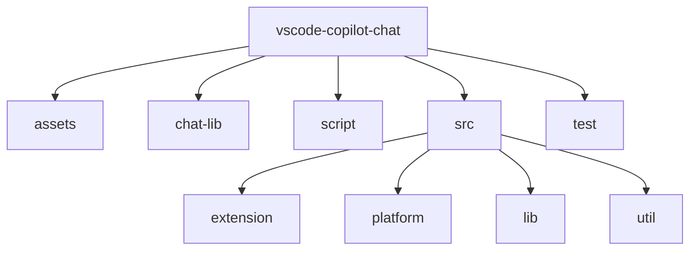
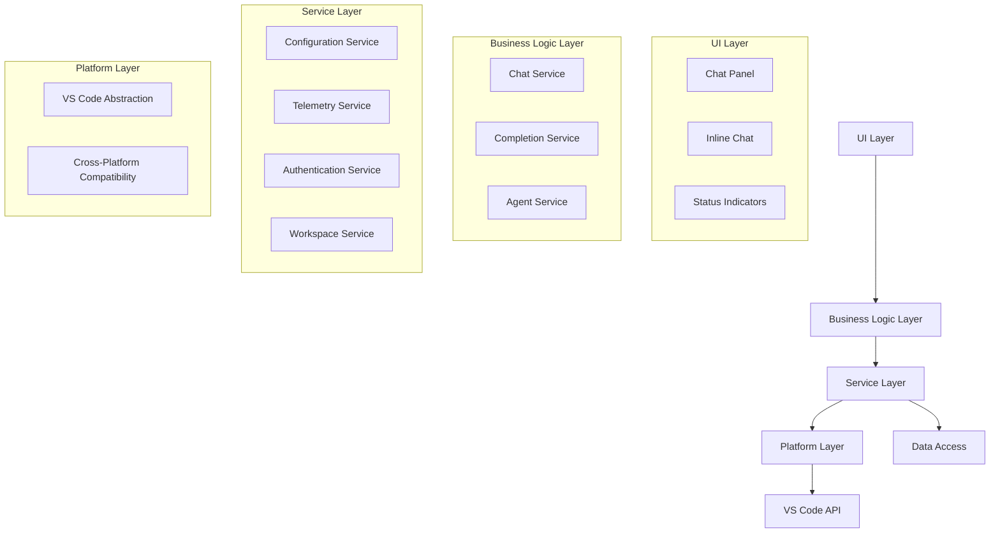
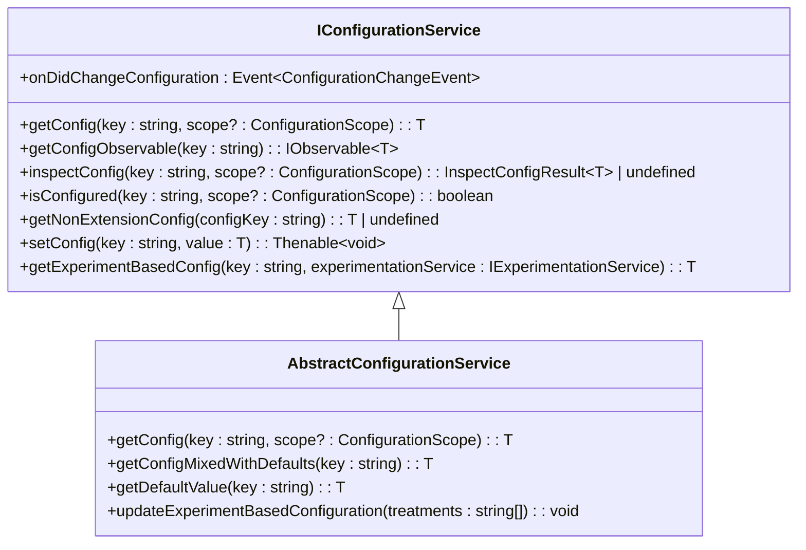
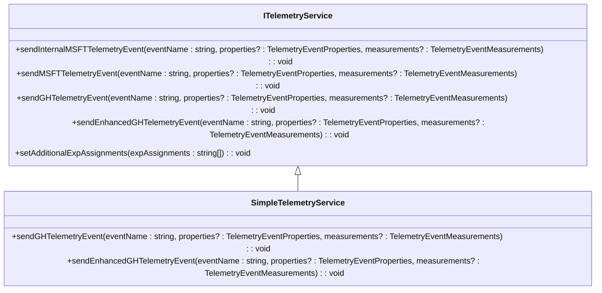
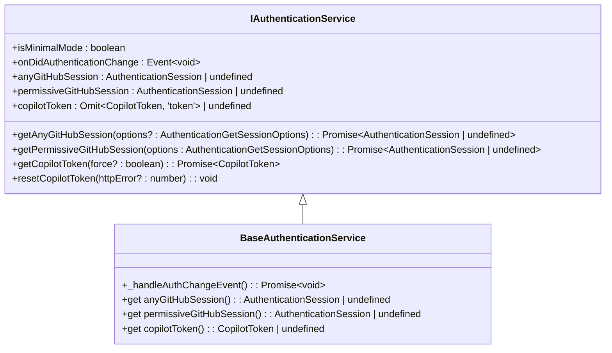
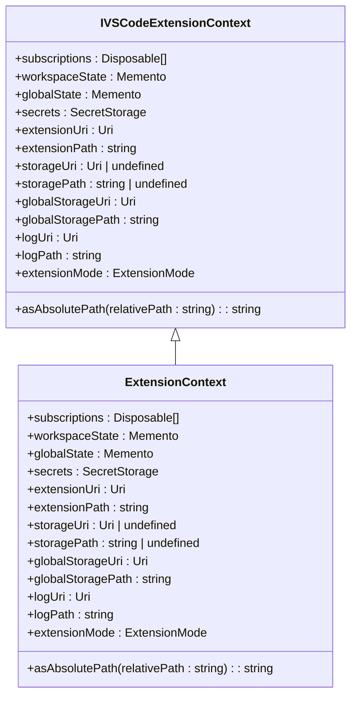

# Technical Implementation

<cite>
**Referenced Files in This Document**   
- [README.md](file://README.md)
- [package.json](file://package.json)
- [src/lib/node/chatLibMain.ts](file://src/lib/node/chatLibMain.ts)
- [src/platform/telemetry/common/telemetry.ts](file://src/platform/telemetry/common/telemetry.ts)
- [src/platform/configuration/common/configurationService.ts](file://src/platform/configuration/common/configurationService.ts)
- [src/platform/workspace/common/workspaceService.ts](file://src/platform/workspace/common/workspaceService.ts)
- [src/extension/extension/vscode-node/extension.ts](file://src/extension/extension/vscode-node/extension.ts)
- [src/platform/authentication/common/authentication.ts](file://src/platform/authentication/common/authentication.ts)
- [src/platform/chat/common/conversationOptions.ts](file://src/platform/chat/common/conversationOptions.ts)
- [src/platform/networking/common/fetcherService.ts](file://src/platform/networking/common/fetcherService.ts)
- [src/platform/extContext/common/extensionContext.ts](file://src/platform/extContext/common/extensionContext.ts)
</cite>

## Table of Contents
1. [Introduction](#introduction)
2. [Project Structure](#project-structure)
3. [Core Components](#core-components)
4. [Architecture Overview](#architecture-overview)
5. [Detailed Component Analysis](#detailed-component-analysis)
6. [Service Layer](#service-layer)
7. [Platform Layer](#platform-layer)
8. [UI Components](#ui-components)
9. [Technical Decisions](#technical-decisions)
10. [Extension and Modification](#extension-and-modification)
11. [Conclusion](#conclusion)

## Introduction
The vscode-copilot-chat extension provides AI-powered chat features integrated within Visual Studio Code, enabling developers to receive intelligent coding assistance through natural language interactions. This document details the technical implementation of the extension, focusing on its modular architecture, service layer, platform abstractions, UI components, and key technical decisions. The extension is designed with a clear separation of concerns between UI, business logic, and data access layers, leveraging dependency injection, event-driven communication, and state management patterns to ensure maintainability and extensibility.

## Project Structure
The project follows a well-organized directory structure that separates concerns and facilitates modular development. The core components are organized into distinct directories:

- **assets/**: Contains static assets such as agent definitions and prompts
- **chat-lib/**: Houses shared libraries and utilities for chat functionality
- **script/**: Contains build and utility scripts for development and testing
- **src/**: Main source code directory with the extension's core implementation
- **test/**: Comprehensive test suite covering various aspects of the extension

The src directory is further organized into:
- **extension/**: Main extension components and features
- **platform/**: Abstraction layer for VS Code API interactions
- **lib/**: Shared libraries and utilities
- **util/**: General utility functions and services

This structure enables clear separation between the extension's business logic, platform-specific implementations, and shared utilities, making the codebase more maintainable and easier to navigate.



**Diagram sources**
- [README.md](file://README.md#L1-L84)

## Core Components
The vscode-copilot-chat extension is built around several core components that work together to provide AI-powered coding assistance. The architecture follows a modular design with clear separation between UI, business logic, and data access layers. Key components include the chat interface, inline chat functionality, code completion services, and various AI-powered features like agent mode and next edit suggestions.

The extension leverages the VS Code extension API to integrate seamlessly with the editor, providing features such as chat panels, inline chat, and status indicators. The core functionality is organized around a service-oriented architecture where different services handle specific aspects of the extension's behavior, such as authentication, configuration management, telemetry, and workspace interactions.

**Section sources**
- [README.md](file://README.md#L1-L84)
- [package.json](file://package.json#L1-L800)

## Architecture Overview
The vscode-copilot-chat extension follows a layered architecture with clear separation of concerns between UI, business logic, and data access layers. The architecture is designed to be modular, extensible, and maintainable, leveraging dependency injection and event-driven communication patterns.

At the core of the architecture is a service layer that provides shared functionality across features, including configuration management, telemetry, authentication, and workspace services. The platform layer abstracts VS Code API interactions, providing cross-platform compatibility and a clean interface for the extension's business logic. The UI components are built on top of these layers, integrating with VS Code's interface through chat panels, inline chat, and status indicators.

The extension uses a dependency injection system to manage service instantiation and dependencies, promoting loose coupling and testability. Event-driven communication is used extensively to coordinate between components, with state management patterns ensuring consistent application state across the extension.



**Diagram sources**
- [src/lib/node/chatLibMain.ts](file://src/lib/node/chatLibMain.ts#L1-L834)
- [src/platform/telemetry/common/telemetry.ts](file://src/platform/telemetry/common/telemetry.ts#L1-L217)

## Detailed Component Analysis
This section provides an in-depth analysis of the key components that make up the vscode-copilot-chat extension, focusing on their implementation details, interactions, and responsibilities within the overall architecture.

### Service Layer Components
The service layer provides shared functionality across features, ensuring consistency and reusability throughout the extension. Key services include configuration management, telemetry, authentication, and workspace interactions.

#### Configuration Service
The configuration service manages extension settings and user preferences, providing a unified interface for accessing and modifying configuration values. It supports both simple and experiment-based configurations, allowing for feature flags and A/B testing.



**Diagram sources**
- [src/platform/configuration/common/configurationService.ts](file://src/platform/configuration/common/configurationService.ts#L1-L892)

#### Telemetry Service
The telemetry service handles collection and reporting of usage data and events, providing insights into extension usage and performance. It supports multiple telemetry destinations and integrates with both Microsoft and GitHub telemetry systems.



**Diagram sources**
- [src/platform/telemetry/common/telemetry.ts](file://src/platform/telemetry/common/telemetry.ts#L1-L217)

#### Authentication Service
The authentication service manages user authentication and token management, providing secure access to GitHub Copilot services. It handles both GitHub and enterprise authentication scenarios, supporting different permission modes and token refresh mechanisms.



**Diagram sources**
- [src/platform/authentication/common/authentication.ts](file://src/platform/authentication/common/authentication.ts#L1-L316)

## Service Layer
The service layer in the vscode-copilot-chat extension provides shared functionality across features, ensuring consistency and reusability throughout the application. This layer abstracts common operations and provides a clean interface for the business logic layer to interact with underlying systems and services.

### Configuration Management
The configuration service is responsible for managing extension settings and user preferences. It provides a comprehensive API for accessing configuration values, supporting both simple configurations and experiment-based configurations that enable feature flags and A/B testing. The service integrates with VS Code's configuration system while providing additional capabilities such as default value management, configuration migration, and experiment-based configuration resolution.

The configuration service uses a registry pattern to manage configuration definitions, allowing for centralized registration and validation of configuration keys. It supports various configuration scopes (global, workspace, workspace folder) and provides observable interfaces for reactive programming patterns. The service also handles configuration migration, automatically updating deprecated settings to their new equivalents.

### Telemetry and Analytics
The telemetry service collects and reports usage data and events, providing valuable insights into extension usage patterns and performance characteristics. It supports multiple telemetry destinations, including Microsoft internal telemetry and GitHub telemetry, with appropriate privacy controls and user consent mechanisms.

The service implements a flexible event system that supports both standard and enhanced telemetry events. Enhanced events can include additional context such as user prompts and suggestions, subject to user privacy settings. The telemetry service also integrates with experimentation systems, allowing for correlation of feature usage with experiment treatments.

### Workspace Services
The workspace service provides an abstraction layer for interacting with the user's workspace, including file system operations, document management, and workspace folder information. It encapsulates VS Code's workspace API while providing additional utilities for common operations such as relative path calculation and workspace folder resolution.

The service supports both text documents and notebook documents, providing a unified interface for document operations. It also includes functionality for workspace state management, ensuring that the extension can respond appropriately to workspace changes and maintain consistent state across sessions.

**Section sources**
- [src/platform/configuration/common/configurationService.ts](file://src/platform/configuration/common/configurationService.ts#L1-L892)
- [src/platform/telemetry/common/telemetry.ts](file://src/platform/telemetry/common/telemetry.ts#L1-L217)
- [src/platform/workspace/common/workspaceService.ts](file://src/platform/workspace/common/workspaceService.ts#L1-L227)

## Platform Layer
The platform layer in the vscode-copilot-chat extension provides abstractions for VS Code API interactions, ensuring cross-platform compatibility and a clean separation between the extension's business logic and the underlying editor platform. This layer is crucial for maintaining the extension's portability and adaptability across different VS Code environments and versions.

### VS Code API Abstraction
The platform layer implements a comprehensive set of interfaces that abstract the VS Code extension API, providing a stable contract for the extension's business logic. These abstractions cover various aspects of the editor functionality, including:

- **Authentication**: Abstracting the authentication API to support different authentication providers and permission modes
- **Configuration**: Providing a unified interface for configuration access and modification
- **Workspace**: Abstracting workspace operations such as file access, document management, and folder operations
- **Networking**: Abstracting HTTP requests and network operations with support for different fetch implementations
- **Logging**: Providing a consistent logging interface across different environments

The abstraction layer uses dependency injection to allow for different implementations based on the runtime environment (node.js, web worker, etc.). This enables the extension to run in various VS Code contexts while maintaining consistent behavior.

### Cross-Platform Compatibility
The platform layer ensures cross-platform compatibility by abstracting platform-specific differences and providing consistent behavior across different operating systems and VS Code versions. This is achieved through several mechanisms:

- **Environment Detection**: The layer detects the current runtime environment and selects appropriate implementations
- **Feature Detection**: It checks for the availability of specific VS Code API features and provides fallbacks when necessary
- **Version Compatibility**: The layer handles differences between VS Code versions, ensuring the extension works with the supported range of editor versions

The platform layer also includes utilities for common cross-platform operations such as path manipulation, file system access, and encoding handling, ensuring consistent behavior regardless of the underlying platform.

### Extension Context Management
The platform layer manages the extension context, providing access to VS Code's extension context API while adding additional functionality specific to the Copilot extension. This includes:

- **Service Registration**: Managing the registration and lifecycle of services used by the extension
- **Resource Management**: Handling the disposal of resources and cleanup of event listeners
- **State Persistence**: Providing mechanisms for persisting extension state across sessions

The extension context abstraction allows the business logic to access VS Code functionality without direct dependencies on the VS Code API, making the code more testable and maintainable.



**Diagram sources**
- [src/platform/extContext/common/extensionContext.ts](file://src/platform/extContext/common/extensionContext.ts#L1-L14)
- [src/extension/extension/vscode-node/extension.ts](file://src/extension/extension/vscode-node/extension.ts#L1-L44)

## UI Components
The UI components of the vscode-copilot-chat extension integrate seamlessly with VS Code's interface, providing intuitive and accessible chat functionality. The extension implements several UI elements that enhance the developer experience while maintaining consistency with VS Code's design principles.

### Chat Panel
The chat panel is the primary interface for interacting with GitHub Copilot, providing a dedicated space for natural language conversations about code. The panel integrates with VS Code's view container system, appearing as a sidebar or panel that can be easily accessed and managed by users.

The chat panel supports rich message formatting, including syntax-highlighted code blocks, inline references, and interactive elements. It also provides features such as conversation history, message threading, and context awareness, allowing users to maintain context across multiple interactions.

### Inline Chat
Inline chat enables users to initiate conversations directly within the code editor, providing contextual assistance without leaving their current workflow. When activated, inline chat displays a chat interface adjacent to the selected code, allowing users to ask questions or request modifications to specific code sections.

The inline chat functionality uses VS Code's decoration and hover APIs to provide a seamless integration with the editor. It supports features such as code selection context, inline suggestions, and direct code modifications, making it easy for users to apply AI-generated suggestions directly to their code.

### Status Indicators
The extension includes several status indicators that provide real-time feedback about the AI's state and availability. These include:

- **Status Bar Item**: A status indicator in VS Code's status bar showing the current connection status and authentication state
- **Progress Indicators**: Visual feedback during AI processing, indicating when responses are being generated
- **Error Indicators**: Notifications for authentication issues, connectivity problems, or service errors

These indicators help users understand the current state of the AI assistant and provide immediate feedback on the success or failure of their requests.

### User Interface Integration
The UI components are designed to integrate seamlessly with VS Code's interface, following the editor's design guidelines and user experience patterns. This includes:

- **Theme Support**: Full support for VS Code's light, dark, and high-contrast themes
- **Accessibility**: Implementation of accessibility features such as screen reader support and keyboard navigation
- **Localization**: Support for multiple languages through VS Code's localization system
- **Customization**: Options for users to customize the appearance and behavior of UI components

The integration ensures that the Copilot chat features feel like a natural part of the VS Code experience, rather than a separate tool or plugin.

**Section sources**
- [README.md](file://README.md#L1-L84)
- [package.json](file://package.json#L1-L800)

## Technical Decisions
The vscode-copilot-chat extension incorporates several key technical decisions that shape its architecture, performance, and maintainability. These decisions reflect careful consideration of the extension's requirements, constraints, and long-term goals.

### Dependency Injection
The extension uses a dependency injection (DI) system to manage service instantiation and dependencies. This pattern promotes loose coupling between components, making the codebase more modular, testable, and maintainable. The DI system is implemented using a service container that registers and resolves services based on their interfaces.

Key benefits of the DI approach include:
- **Testability**: Services can be easily mocked or replaced for unit testing
- **Flexibility**: Different implementations can be provided for the same interface based on context
- **Maintainability**: Dependencies are explicitly declared, making the code easier to understand and modify

The DI system is used throughout the extension, from the platform layer to the business logic components, ensuring consistent patterns across the codebase.

### Event-Driven Communication
The extension employs an event-driven communication pattern to coordinate between components and respond to changes in the application state. This approach uses VS Code's event system and custom event emitters to decouple components and enable reactive programming patterns.

Key aspects of the event-driven architecture include:
- **Event Emission**: Components emit events when their state changes or significant actions occur
- **Event Listening**: Other components subscribe to relevant events and respond appropriately
- **Event Propagation**: Events can be propagated through the component hierarchy to ensure proper handling

This pattern enables efficient communication between components without creating tight coupling, allowing for more flexible and scalable architecture.

### State Management
The extension implements a comprehensive state management system to maintain consistent application state across different components and sessions. This includes:

- **Local State**: Management of UI state and temporary data within components
- **Shared State**: Coordination of state between different parts of the extension
- **Persistent State**: Storage of user preferences and settings across sessions

The state management system uses observable patterns to ensure that components are automatically updated when state changes, reducing the need for manual state synchronization and improving performance.

### Performance Optimization
Several performance optimization techniques are employed to ensure the extension remains responsive and efficient:

- **Caching**: Strategic caching of frequently accessed data and computation results
- **Lazy Loading**: Deferred loading of non-essential components and resources
- **Throttling and Debouncing**: Rate limiting of expensive operations such as network requests
- **Web Workers**: Offloading intensive computations to background threads when possible

These optimizations help maintain a smooth user experience even when handling complex AI operations and large codebases.

**Section sources**
- [src/lib/node/chatLibMain.ts](file://src/lib/node/chatLibMain.ts#L1-L834)
- [src/platform/telemetry/common/telemetry.ts](file://src/platform/telemetry/common/telemetry.ts#L1-L217)
- [src/platform/configuration/common/configurationService.ts](file://src/platform/configuration/common/configurationService.ts#L1-L892)

## Extension and Modification
The vscode-copilot-chat extension is designed to be extensible and customizable, allowing developers to modify or enhance its functionality to meet specific needs. This section provides practical examples and guidance for extending or modifying the existing implementation.

### Adding New Features
To add new features to the extension, follow these steps:

1. **Define the Service Interface**: Create a new interface in the appropriate platform or service layer
2. **Implement the Service**: Provide an implementation of the interface, following existing patterns
3. **Register the Service**: Add the service to the dependency injection container
4. **Create UI Components**: Implement any necessary UI elements using VS Code's API
5. **Integrate with Existing Features**: Connect the new feature to existing components as needed

For example, to add a new chat participant:
```typescript
// 1. Define the service interface
interface ICustomChatParticipant {
    provideChatResponse(request: ChatRequest): Promise<ChatResponse>;
}

// 2. Implement the service
class CustomChatParticipant implements ICustomChatParticipant {
    async provideChatResponse(request: ChatRequest): Promise<ChatResponse> {
        // Implementation logic
    }
}

// 3. Register the service in the DI container
builder.define(ICustomChatParticipant, new SyncDescriptor(CustomChatParticipant));

// 4. Create UI components and integrate
```

### Modifying Configuration
The extension's behavior can be customized through configuration settings. To modify existing settings or add new ones:

1. **Define the Configuration Key**: Add the new setting to the configuration registry
2. **Update package.json**: Add the setting to the extension's contribution points
3. **Use the Setting**: Access the setting through the configuration service

Example of adding a new configuration setting:
```typescript
// In configurationService.ts
export namespace ConfigKey {
    export const CustomSetting = defineSetting<boolean>('custom.feature.enabled', ConfigType.Simple, false);
}

// Access the setting in code
const isEnabled = configurationService.getConfig(ConfigKey.CustomSetting);
```

### Customizing UI Components
UI components can be customized by modifying their implementation or adding new themes and styles. The extension follows VS Code's theming guidelines, allowing for consistent appearance across different editor themes.

To customize a UI component:
1. **Locate the Component**: Find the relevant source files for the component
2. **Modify the Implementation**: Update the code to change behavior or appearance
3. **Test the Changes**: Verify the changes work correctly across different themes and configurations

### Integrating with Other Extensions
The extension can be integrated with other VS Code extensions through VS Code's extension API. This allows for sharing functionality and creating more powerful development workflows.

To integrate with another extension:
1. **Check for API Availability**: Verify the target extension provides a public API
2. **Import the API**: Use VS Code's extension API to access the other extension
3. **Implement Integration**: Add code to use the other extension's functionality

Example of integrating with another extension:
```typescript
// Check if another extension is available
const otherExtension = vscode.extensions.getExtension('publisher.extension-name');
if (otherExtension) {
    const api = await otherExtension.activate();
    // Use the API
}
```

These examples demonstrate how the extension's modular design and clear architecture make it easy to extend and modify for specific use cases.

**Section sources**
- [src/platform/configuration/common/configurationService.ts](file://src/platform/configuration/common/configurationService.ts#L1-L892)
- [src/lib/node/chatLibMain.ts](file://src/lib/node/chatLibMain.ts#L1-L834)
- [src/platform/telemetry/common/telemetry.ts](file://src/platform/telemetry/common/telemetry.ts#L1-L217)

## Conclusion
The vscode-copilot-chat extension demonstrates a sophisticated and well-architected implementation of AI-powered coding assistance within Visual Studio Code. Through its modular design, clear separation of concerns, and thoughtful technical decisions, the extension provides a robust and extensible platform for developer productivity.

The architecture effectively balances the need for deep integration with VS Code's interface while maintaining a clean separation between UI, business logic, and data access layers. The service layer provides essential shared functionality, while the platform layer ensures cross-platform compatibility and abstracts VS Code API interactions.

Key technical decisions such as dependency injection, event-driven communication, and comprehensive state management contribute to the extension's maintainability and scalability. The UI components are thoughtfully designed to integrate seamlessly with VS Code's interface, providing intuitive and accessible chat functionality.

The extension's design also facilitates extension and modification, allowing developers to customize and enhance its functionality to meet specific needs. This extensibility, combined with the comprehensive documentation and clear architecture, makes the vscode-copilot-chat extension a powerful tool for AI-assisted development.

Overall, the technical implementation of the vscode-copilot-chat extension serves as an excellent example of modern VS Code extension development, demonstrating best practices in architecture, design, and user experience.