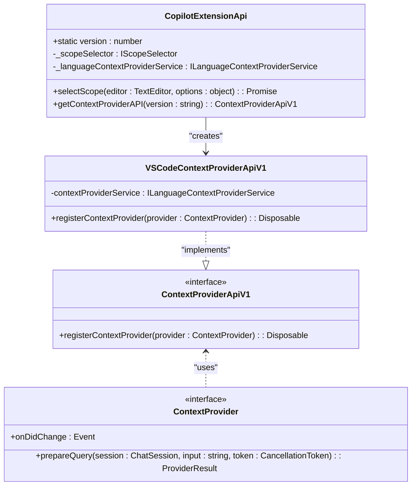
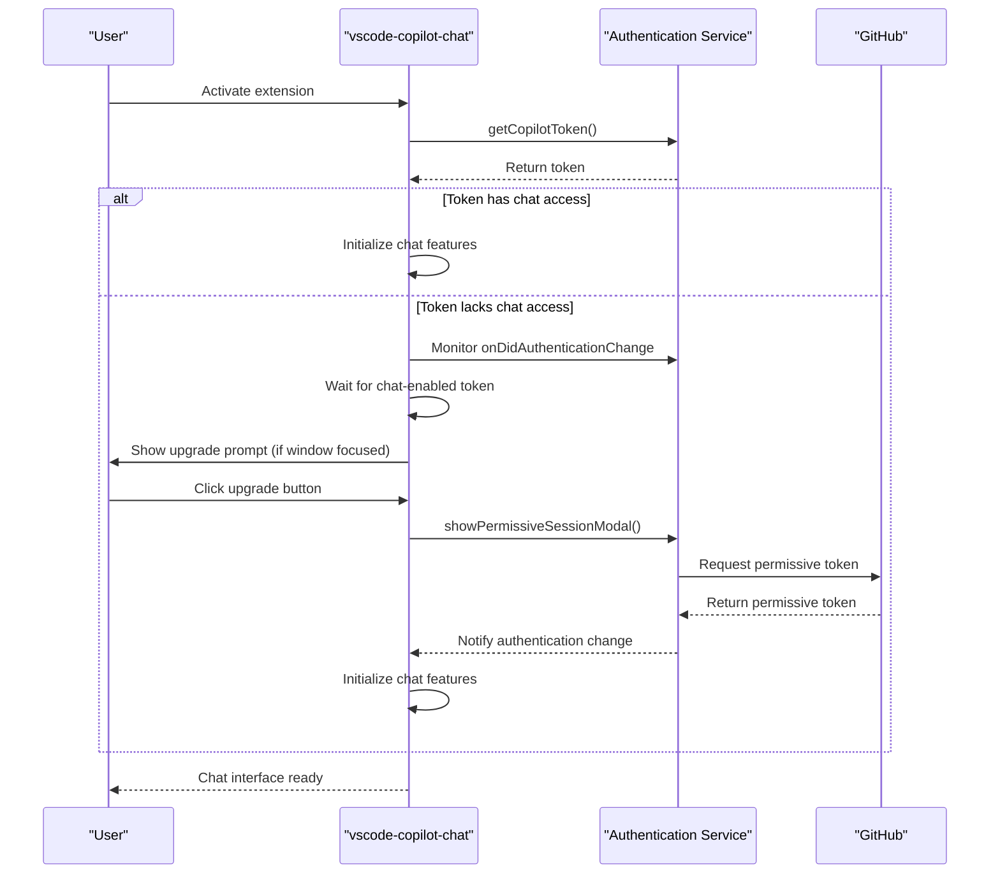

# Chat Interface

<cite>
**Referenced Files in This Document**   
- [extensionApi.ts](file://src/extension/api/vscode/extensionApi.ts)
- [vscodeContextProviderApi.ts](file://src/extension/api/vscode/vscodeContextProviderApi.ts)
- [copilotCloudSessionsProvider.ts](file://src/extension/chatSessions/vscode-node/copilotCloudSessionsProvider.ts)
- [claudeChatSessionParticipant.ts](file://src/extension/chatSessions/vscode-node/claudeChatSessionParticipant.ts)
- [conversationStore.ts](file://src/extension/conversationStore/node/conversationStore.ts)
- [authentication.contribution.ts](file://src/extension/authentication/vscode-node/authentication.contribution.ts)
- [conversationHistory.tsx](file://src/extension/prompts/node/panel/conversationHistory.tsx)
- [agentConversationHistory.tsx](file://src/extension/prompts/node/agent/agentConversationHistory.tsx)
- [summarizedConversationHistory.tsx](file://src/extension/prompts/node/agent/summarizedConversationHistory.tsx)
- [chatVariables.tsx](file://src/extension/prompts/node/panel/chatVariables.tsx)
</cite>

## Table of Contents
1. [Introduction](#introduction)
2. [Chat Participant Registration and Management](#chat-participant-registration-and-management)
3. [Conversation Features Implementation](#conversation-features-implementation)
4. [Extension API Interfaces](#extension-api-interfaces)
5. [Message Rendering and Interaction Patterns](#message-rendering-and-interaction-patterns)
6. [Authentication Integration](#authentication-integration)
7. [Context Provider Integration](#context-provider-integration)
8. [Telemetry System Integration](#telemetry-system-integration)
9. [Customization and Compatibility](#customization-and-compatibility)
10. [Conclusion](#conclusion)

## Introduction
The Chat Interface component of the vscode-copilot-chat extension provides a sophisticated system for integrating AI-powered chat capabilities within VS Code's user interface. This documentation details the architecture and implementation of the chat system, focusing on how chat participants are registered and managed, conversation features are implemented, and various extension APIs enable communication between the extension and VS Code's UI. The system supports multiple chat participants, including cloud-based agents and specialized AI models like Claude, while maintaining seamless integration with authentication, context providers, and telemetry systems.

## Chat Participant Registration and Management
The vscode-copilot-chat extension implements a comprehensive system for registering and managing chat participants within VS Code's chat UI. Chat participants are registered through the extension's contribution system, which allows for dynamic creation and management of different AI agents. The registration process involves creating chat participants with unique identifiers and request handlers that define their behavior.

The extension uses the `vscode.chat.createChatParticipant` API to register participants, providing a handler function that processes incoming chat requests. Each participant is associated with a specific ID that users can reference in the chat interface (e.g., via @mentions). The system supports both static and dynamic chat participants, with dynamic participants allowing for additional properties like name, publisher, and description to be defined at registration time.

Participants are managed through a combination of contribution factories and service implementations. The `vscodeNodeContributions` array in the extension's contribution system includes various chat-related features, ensuring that participants are properly initialized when the extension activates. The system also supports session-based participant management, where participants can be associated with specific chat sessions and maintain state across multiple interactions.

**Section sources**
- [copilotCloudSessionsProvider.ts](file://src/extension/chatSessions/vscode-node/copilotCloudSessionsProvider.ts#L122-L134)
- [claudeChatSessionParticipant.ts](file://src/extension/chatSessions/vscode-node/claudeChatSessionParticipant.ts#L12-L59)
- [extensionApi.ts](file://src/extension/api/vscode/extensionApi.ts#L13-L32)

## Conversation Features Implementation
The conversation system in vscode-copilot-chat implements a robust set of features for managing chat history, context, and state. The system maintains conversation history through the `ConversationStore` service, which uses an LRU (Least Recently Used) cache to store conversation data with a configurable capacity. This ensures efficient memory usage while preserving recent conversation context.

Conversation history is rendered using specialized React components that format user requests, assistant responses, and tool calls in a structured manner. The system supports different history rendering modes, including summarized views that condense previous interactions and detailed views that show the complete conversation timeline with all tool invocations and results.

The extension implements sophisticated context management through the `IBuildPromptContext` interface, which captures the current state of the conversation, including recent turns, tool call results, and any relevant workspace context. This context is used to generate appropriate prompts for AI models, ensuring that responses are relevant to the current conversation state.

**Section sources**
- [conversationStore.ts](file://src/extension/conversationStore/node/conversationStore.ts#L1-L40)
- [conversationHistory.tsx](file://src/extension/prompts/node/panel/conversationHistory.tsx#L1-L182)
- [agentConversationHistory.tsx](file://src/extension/prompts/node/agent/agentConversationHistory.tsx#L1-L83)
- [summarizedConversationHistory.tsx](file://src/extension/prompts/node/agent/summarizedConversationHistory.tsx#L229-L259)

## Extension API Interfaces
The vscode-copilot-chat extension exposes two key interfaces for communication between the extension and VS Code's UI: `extensionApi.ts` and `vscodeContextProviderApi.ts`. These interfaces serve as the primary integration points for external systems and provide controlled access to the extension's functionality.

The `CopilotExtensionApi` class in `extensionApi.ts` implements the main extension API, providing methods for scope selection and context provider access. It uses dependency injection to receive services like `IScopeSelector` and `ILanguageContextProviderService`, which it exposes through a versioned interface. The API follows a singleton pattern with a static version property, ensuring backward compatibility as the API evolves.

The `VSCodeContextProviderApiV1` class in `vscodeContextProviderApi.ts` provides access to context providers, which supply additional information to the AI models during conversation. It implements the `Copilot.ContextProviderApiV1` interface and allows extensions to register context providers that can contribute information to chat sessions. The registration method returns a `Disposable` object, enabling proper cleanup when context providers are no longer needed.

These interfaces follow a clear separation of concerns, with `extensionApi.ts` focusing on general extension functionality and `vscodeContextProviderApi.ts` specializing in context provider management. Both interfaces use TypeScript's module system to export their classes and interfaces, making them easily importable by other parts of the extension or external consumers.

**Diagram sources **
- [extensionApi.ts](file://src/extension/api/vscode/extensionApi.ts#L13-L32)
- [vscodeContextProviderApi.ts](file://src/extension/api/vscode/vscodeContextProviderApi.ts#L11-L22)

**Section sources**
- [extensionApi.ts](file://src/extension/api/vscode/extensionApi.ts#L13-L32)
- [vscodeContextProviderApi.ts](file://src/extension/api/vscode/vscodeContextProviderApi.ts#L11-L22)

## Message Rendering and Interaction Patterns
The message rendering system in vscode-copilot-chat implements a sophisticated set of patterns for displaying chat content and enabling user interactions. The system uses React-based components to render different types of messages, including user requests, assistant responses, tool calls, and system notifications.

Message rendering is handled through specialized components like `UserMessage`, `AssistantMessage`, and `ChatToolCalls`, which format content according to the conversation context. The system supports rich content rendering, including code blocks, file references, and interactive elements. Messages are organized in a chronological timeline with visual indicators for different message types and states.

The extension implements several interaction patterns to enhance the user experience:
- **Progressive rendering**: Messages are streamed to the UI as they are generated, providing immediate feedback
- **Interactive elements**: Responses can include buttons, links, and other interactive components that trigger actions
- **Context preservation**: Previous conversation context is maintained and referenced in subsequent responses
- **Error handling**: The system gracefully handles errors and provides informative feedback to users

The rendering system also supports different conversation modes, such as inline chat and panel chat, each with specialized rendering logic. For example, inline chat focuses on concise responses relevant to the current code context, while panel chat supports more extensive conversations with richer content.

**Section sources**
- [conversationHistory.tsx](file://src/extension/prompts/node/panel/conversationHistory.tsx#L1-L182)
- [agentConversationHistory.tsx](file://src/extension/prompts/node/agent/agentConversationHistory.tsx#L1-L83)
- [chatVariables.tsx](file://src/extension/prompts/node/panel/chatVariables.tsx#L120-L147)

## Authentication Integration
The authentication system in vscode-copilot-chat is implemented through the `authentication.contribution.ts` file, which provides a comprehensive solution for managing user authentication and authorization. The system uses a contribution-based architecture where the `AuthenticationContrib` class serves as the main entry point for authentication functionality.

The authentication process begins with token acquisition, where the system requests a Copilot token from the authentication service. The token is used to verify the user's identity and determine their access level. The system specifically checks for chat-enabled tokens, ensuring that users have the necessary permissions to use chat features.

When a user lacks sufficient permissions, the system prompts them to upgrade their authentication through a modal dialog. This is handled by the `AuthUpgradeAsk` class, which monitors authentication changes and displays the upgrade prompt when appropriate. The upgrade process requests a "permissive" GitHub session token, which grants the extension additional permissions needed for chat operations.

The authentication system integrates with VS Code's event system to respond to authentication changes. It listens for the `onDidAuthenticationChange` event and updates the UI accordingly. The system also handles edge cases like window focus changes, ensuring that authentication prompts are only displayed when the user is actively working in VS Code.

**Diagram sources **
- [authentication.contribution.ts](file://src/extension/authentication/vscode-node/authentication.contribution.ts#L1-L113)

**Section sources**
- [authentication.contribution.ts](file://src/extension/authentication/vscode-node/authentication.contribution.ts#L1-L113)

## Context Provider Integration
The context provider system in vscode-copilot-chat enables the extension to access and utilize additional information during chat sessions. Context providers are registered through the `VSCodeContextProviderApiV1` interface, which acts as a bridge between the extension and VS Code's context provider system.

Context providers supply relevant information to AI models based on the current conversation context. For example, a language context provider might supply information about the current programming language, file structure, or code patterns. The system supports multiple context providers, which can be registered for different purposes such as completions, diagnostics, or code analysis.

The integration follows a clear pattern where context providers are registered with specific targets (e.g., `ProviderTarget.Completions`) and return context items that are incorporated into the conversation. The system handles the lifecycle of context providers, including proper disposal when they are no longer needed.

Context providers enhance the quality of AI responses by providing relevant, up-to-date information about the user's workspace and coding context. This allows the AI to generate more accurate and contextually appropriate responses, improving the overall user experience.

**Section sources**
- [vscodeContextProviderApi.ts](file://src/extension/api/vscode/vscodeContextProviderApi.ts#L11-L22)
- [extensionApi.ts](file://src/extension/api/vscode/extensionApi.ts#L29-L31)

## Telemetry System Integration
The telemetry system in vscode-copilot-chat provides comprehensive monitoring and analytics capabilities for the chat interface. The system captures various events and metrics related to user interactions, performance, and system behavior, enabling continuous improvement of the extension.

Telemetry is implemented through the `ITelemetryService` interface, which provides methods for sending event data and error information. The system captures key metrics such as:
- Conversation start and end times
- User actions and interactions
- Response generation times
- Error occurrences and types
- Feature usage patterns

The telemetry system follows privacy best practices by allowing users to control data collection and ensuring that sensitive information is not captured. Events are anonymized and aggregated to protect user privacy while still providing valuable insights for development and optimization.

The system also supports diagnostic logging, which can be enabled for troubleshooting purposes. This provides detailed information about the extension's internal operations, helping developers identify and resolve issues.

**Section sources**
- [telemetry.ts](file://src/extension/prompt/node/telemetry.ts#L1-L22)
- [telemetry.spec.ts](file://src/extension/test/node/telemetry.spec.ts#L1-L27)

## Customization and Compatibility
The vscode-copilot-chat extension is designed with customization and compatibility in mind, following VS Code's design principles and extension guidelines. The system provides several mechanisms for customization while maintaining a consistent user experience.

Customization options include:
- Configurable chat participants with customizable names and descriptions
- Extensible context providers that can be added by other extensions
- Theme-compatible UI elements that adapt to the user's selected theme
- Localized strings that support multiple languages

The extension maintains compatibility with VS Code's design principles by:
- Following the standard chat UI patterns and conventions
- Using VS Code's native components and styling
- Respecting user preferences and settings
- Providing accessible interfaces for all users

The system also supports integration with other VS Code features, such as the command palette, status bar, and notification system. This ensures a seamless experience where the chat interface feels like a natural part of the editor rather than a separate, disconnected component.

**Section sources**
- [copilotCloudSessionsProvider.ts](file://src/extension/chatSessions/vscode-node/copilotCloudSessionsProvider.ts#L1-L800)
- [claudeChatSessionParticipant.ts](file://src/extension/chatSessions/vscode-node/claudeChatSessionParticipant.ts#L1-L59)

## Conclusion
The Chat Interface component of the vscode-copilot-chat extension provides a robust and extensible system for integrating AI-powered chat capabilities within VS Code. Through its well-designed architecture, the extension enables seamless communication between users and AI assistants while maintaining compatibility with VS Code's design principles.

The system's modular design, with clear separation between chat participants, context providers, and the core chat interface, allows for flexible customization and extension. The integration with authentication, telemetry, and other VS Code services ensures a secure, reliable, and user-friendly experience.

By following established patterns for chat participant registration, conversation management, and message rendering, the extension provides a consistent and intuitive interface that enhances developer productivity. The comprehensive API interfaces and extensibility points enable other extensions to build upon the chat system, creating a rich ecosystem of AI-powered development tools.