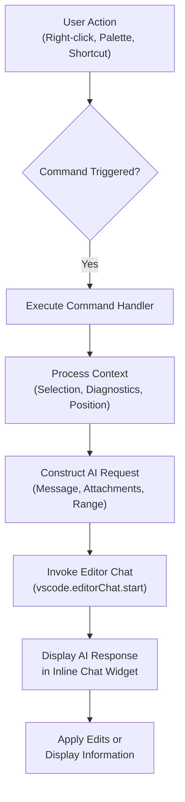
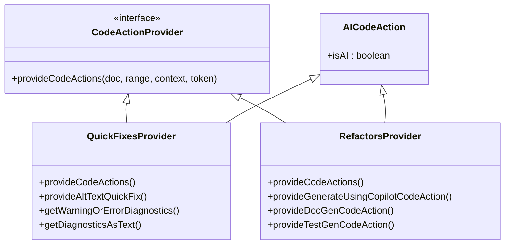
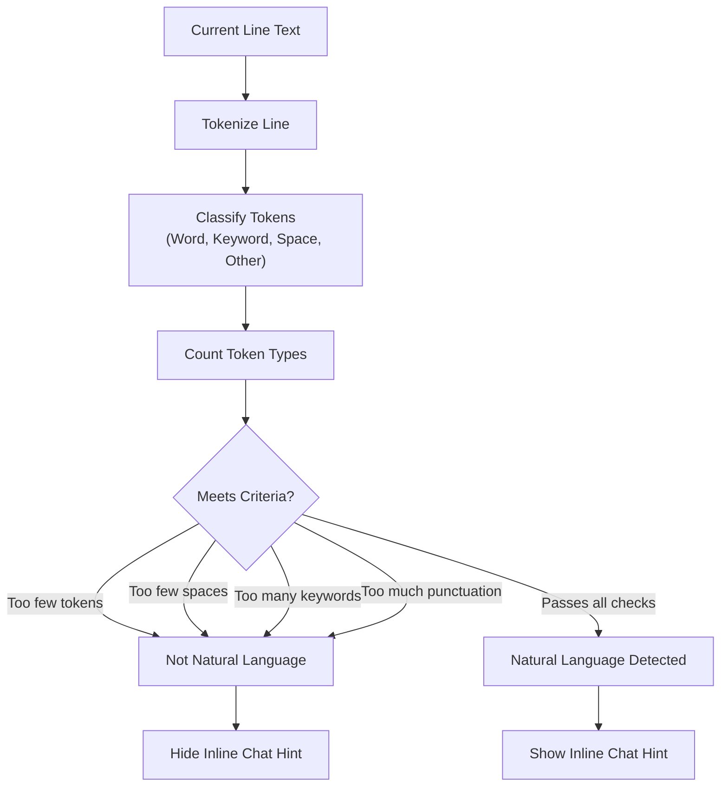
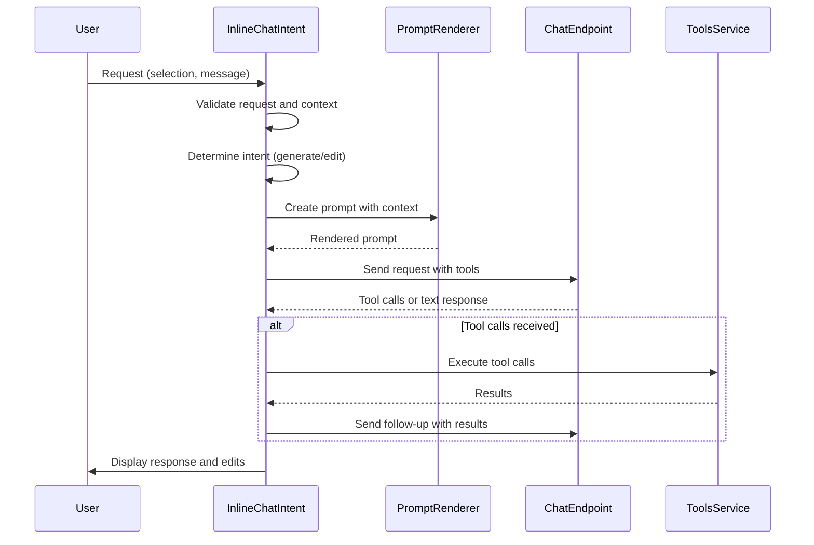
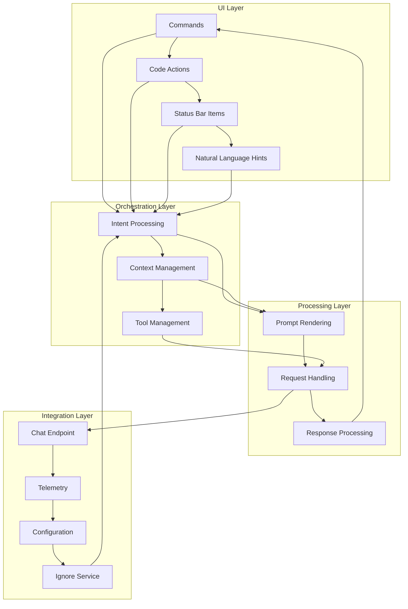

# Inline Chat

<cite>
**Referenced Files in This Document**   
- [inlineChatCommands.ts](file://src/extension/inlineChat/vscode-node/inlineChatCommands.ts)
- [naturalLanguageHint.ts](file://src/extension/inlineChat/vscode-node/naturalLanguageHint.ts)
- [inlineChatCodeActions.ts](file://src/extension/inlineChat/vscode-node/inlineChatCodeActions.ts)
- [inlineChatIntent.ts](file://src/extension/inlineChat/node/inlineChatIntent.ts)
- [inlineChatNotebookActions.ts](file://src/extension/inlineChat/vscode-node/inlineChatNotebookActions.ts)
- [inlineChatSelection.ts](file://src/extension/context/node/resolvers/inlineChatSelection.ts)
</cite>

## Table of Contents
1. [Introduction](#introduction)
2. [Core Components](#core-components)
3. [Inline Chat Commands](#inline-chat-commands)
4. [Code Actions Implementation](#code-actions-implementation)
5. [Natural Language Hints](#natural-language-hints)
6. [Context and Selection Handling](#context-and-selection-handling)
7. [Intent Processing Logic](#intent-processing-logic)
8. [Notebook Integration](#notebook-integration)
9. [Architecture Overview](#architecture-overview)
10. [Extending Inline Chat](#extending-inline-chat)

## Introduction
The Inline Chat feature provides contextual AI interactions directly within the code editor, enabling developers to access AI assistance without leaving their coding environment. This documentation details the implementation of inline chat commands, code actions, and natural language hints that appear in the editor gutter. The system leverages user selections and cursor positions to provide context-aware suggestions, creating a seamless integration between natural language queries and code manipulation. The feature supports various programming languages and integrates with both standard code files and notebook environments, offering a comprehensive AI-assisted development experience.

## Core Components
The Inline Chat system consists of several key components that work together to provide contextual AI interactions within the code editor. The core functionality is implemented through command registration, code action providers, natural language detection, and context-aware intent processing. The system uses a combination of frontend UI components and backend processing logic to deliver relevant suggestions based on the current code context. Key components include the command system that handles user interactions, code action providers that offer AI-powered suggestions in the editor, and natural language detection that determines when to show inline chat capabilities. The architecture is designed to be extensible, allowing for the addition of new intents and modification of existing behavior.

**Section sources**
- [inlineChatCommands.ts](file://src/extension/inlineChat/vscode-node/inlineChatCommands.ts#L1-L424)
- [inlineChatIntent.ts](file://src/extension/inlineChat/node/inlineChatIntent.ts#L1-L549)
- [naturalLanguageHint.ts](file://src/extension/inlineChat/vscode-node/naturalLanguageHint.ts#L1-L150)

## Inline Chat Commands
The inline chat command system is implemented in `inlineChatCommands.ts` and serves as the primary interface between user actions and AI functionality. The `registerInlineChatCommands` function initializes all available commands and registers them with the editor's command system. This function uses dependency injection to access various services such as instantiation, tab management, scope selection, ignore services, review services, logging, telemetry, extension context, configuration, and parser services.

The command system implements several key functions for different AI interactions:
- `doExplain`: Analyzes code selections or diagnostics and generates explanations
- `doGenerate`: Initiates code generation requests
- `doGenerateDocs`: Generates documentation for code elements
- `doGenerateTests`: Creates test cases for selected code
- `doFix`: Addresses code issues and errors
- `doGenerateAltText`: Creates alternative text descriptions for images

These commands are registered with specific identifiers following the pattern `github.copilot.chat.*` and are triggered by user actions such as right-click context menus, command palette entries, or keyboard shortcuts. The system also includes navigation commands for review comments, allowing users to apply, discard, or continue discussions about code suggestions.

**Diagram sources**
- [inlineChatCommands.ts](file://src/extension/inlineChat/vscode-node/inlineChatCommands.ts#L43-L326)

**Section sources**
- [inlineChatCommands.ts](file://src/extension/inlineChat/vscode-node/inlineChatCommands.ts#L1-L424)

## Code Actions Implementation
The code actions implementation provides AI-powered suggestions directly in the editor's light bulb menu and context menus. Implemented in `inlineChatCodeActions.ts`, this system uses two main classes: `QuickFixesProvider` and `RefactorsProvider`, both implementing the `vscode.CodeActionProvider` interface.

The `QuickFixesProvider` offers actions related to fixing and explaining code issues:
- **Fix Action**: Appears when diagnostics are present in the selection, allowing users to request AI assistance for resolving code issues
- **Explain Action**: Provides explanations for code or diagnostic messages
- **Review Action**: Enables code review functionality for selected code blocks
- **Alt Text Actions**: Generates or refines alternative text for images in markdown files

The `RefactorsProvider` offers higher-level code generation and modification capabilities:
- **Generate/Modify Action**: Appears based on selection state - "Generate" when the cursor is on an empty line, "Modify" when text is selected
- **Document Action**: Suggests documentation generation for code elements when the cursor is on an identifier
- **Generate Tests Action**: Offers test generation for functions or classes when the cursor is on a testable code element

Both providers check configuration settings and ignore rules before offering actions, ensuring they only appear when appropriate. The code actions use tree-sitter parsers to understand code structure, enabling context-aware suggestions that consider the semantic meaning of the code rather than just its text representation.

**Diagram sources**
- [inlineChatCodeActions.ts](file://src/extension/inlineChat/vscode-node/inlineChatCodeActions.ts#L33-L394)

**Section sources**
- [inlineChatCodeActions.ts](file://src/extension/inlineChat/vscode-node/inlineChatCodeActions.ts#L1-L394)

## Natural Language Hints
The natural language hint system, implemented in `naturalLanguageHint.ts`, determines when to show inline chat capabilities based on the content of the current line. This system analyzes the text at the cursor position to decide whether it appears to be natural language rather than code, helping to prevent unnecessary AI suggestions in purely code contexts.

The `LineCheck` namespace contains the core logic for this analysis:
- **Keyword Detection**: Maintains language-specific sets of programming language keywords for TypeScript, JavaScript, Python, Java, Go, C#, C++, Rust, Ruby, and a default set
- **Token Classification**: Classifies text into words, keywords, keyword prefixes, whitespace, and other characters
- **Natural Language Detection**: Uses heuristics to determine if a line is dominated by natural language rather than code

The detection algorithm works by:
1. Tokenizing the current line into words, keywords, whitespace, and other characters
2. Counting the occurrences of each token type
3. Applying several rules to determine if the line is natural language dominated:
   - Requiring at least 4 tokens and 2 whitespace segments
   - Ensuring keywords don't outnumber regular words
   - Preventing excessive punctuation relative to whitespace
   - Checking for keyword prefixes that might indicate incomplete code

This system enables the editor to show inline chat suggestions primarily when users are writing comments, documentation, or other natural language content, while minimizing distractions when users are focused on writing code.

**Diagram sources**
- [naturalLanguageHint.ts](file://src/extension/inlineChat/vscode-node/naturalLanguageHint.ts#L9-L148)

**Section sources**
- [naturalLanguageHint.ts](file://src/extension/inlineChat/vscode-node/naturalLanguageHint.ts#L1-L150)

## Context and Selection Handling
The context and selection handling system, implemented in `inlineChatSelection.ts`, manages how code context is gathered and processed for inline chat requests. This system ensures that AI suggestions are based on relevant code surrounding the user's selection, providing appropriate context while respecting token limits.

Key functions include:
- `getSelectionAndCodeAroundSelection`: Retrieves the selected code along with surrounding context, prioritizing lines above the selection and limiting context to 100 lines and one-third of the maximum token size
- `processCodeAroundSelection`: Iteratively adds lines above and below the selection in a 3:1 ratio (above:below) to maintain context balance
- `removeBodiesOutsideRange`: Removes function bodies outside the selection range, replacing them with placeholders to preserve code structure while reducing token usage
- `generateNotebookCellContext`: Handles context gathering for notebook environments, including cells above and below the current cell

The system uses `CodeContextRegion` objects to track code context, which include information about the language, lines of code, and completeness indicators. When processing selections that end at the beginning of a line, the system adjusts the range to exclude the end-of-line character, ensuring clean code blocks are presented to the AI model.

For notebook environments, the context system gathers information from adjacent cells, creating a comprehensive view of the coding environment. The system respects workspace boundaries and document schemes, ensuring it only processes relevant content.

**Section sources**
- [inlineChatSelection.ts](file://src/extension/context/node/resolvers/inlineChatSelection.ts#L1-L288)

## Intent Processing Logic
The intent processing logic, implemented in `inlineChatIntent.ts`, handles the core AI interaction flow for inline chat requests. The `InlineChatIntent` class implements the `IIntent` interface and manages the complete lifecycle of an inline chat session, from request handling to response processing and telemetry collection.

The intent processing follows a dual-path architecture:
- **Old World**: Uses the default intent request handler for backward compatibility
- **New World**: Implements advanced processing with tool calls and edit tracking

Key aspects of the intent processing:
- **Request Handling**: Validates that the file is not ignored and that the endpoint supports tool calls
- **Intent Selection**: Automatically determines the appropriate intent based on selection state (empty line = generate, multi-line selection = edit)
- **Tool Management**: Uses specific tools for code editing operations (ApplyPatch, EditFile, ReplaceString, MultiReplaceString)
- **Edit Tracking**: Monitors AI-generated edits and tracks their survival through subsequent code changes
- **Heuristic Application**: Uses selection ratio thresholds to determine when to use edit tools versus direct editing

The system implements a retry mechanism for failed edits, allowing up to five attempts before aborting. It also handles cancellation requests gracefully and collects comprehensive telemetry data for performance monitoring and improvement.

The intent processing integrates with the editor's chat system, using `PromptRenderer` to create appropriate prompts based on the context and request type. It supports both direct text generation and tool-based editing approaches, selecting the most appropriate method based on the code context and selection characteristics.

**Diagram sources**
- [inlineChatIntent.ts](file://src/extension/inlineChat/node/inlineChatIntent.ts#L64-L549)

**Section sources**
- [inlineChatIntent.ts](file://src/extension/inlineChat/node/inlineChatIntent.ts#L1-L549)

## Notebook Integration
The notebook integration, implemented in `inlineChatNotebookActions.ts`, extends inline chat capabilities to Jupyter notebooks and other notebook environments. The `NotebookExectionStatusBarItemProvider` class implements the `vscode.NotebookCellStatusBarItemProvider` interface to add AI assistance directly to notebook cell status bars.

Two primary use cases are supported:
- **Markdown Cell Generation**: When a markdown cell contains content, a "Generate code from markdown content" button appears, allowing users to convert natural language descriptions into executable code
- **Error Fixing**: When a code cell produces an error output, a "Fix using Copilot" button appears, enabling users to request AI assistance for resolving the error

The provider checks several conditions before showing suggestions:
- For markdown cells: Ensures the experimental `notebook.experimental.cellChat` setting is enabled and the cell is not empty
- For error fixing: Verifies that core quick fix contributions are not handling the error and that the error output contains valid error information

When activated, these actions create new cells with AI-generated content or provide fixes for existing code, maintaining the notebook's structure while enhancing productivity. The integration respects notebook-specific configurations and only activates when appropriate, preventing unnecessary suggestions in cells where they wouldn't be helpful.

**Section sources**
- [inlineChatNotebookActions.ts](file://src/extension/inlineChat/vscode-node/inlineChatNotebookActions.ts#L1-L111)

## Architecture Overview
The Inline Chat architecture consists of several interconnected components that work together to provide contextual AI assistance within the code editor. The system follows a modular design with clear separation of concerns between command handling, code action provision, natural language detection, context management, and intent processing.

The architecture can be understood as a layered system:
- **UI Layer**: Handles user interactions through commands, code actions, and status bar items
- **Orchestration Layer**: Manages the flow of requests and responses between components
- **Processing Layer**: Implements the core AI interaction logic and context handling
- **Integration Layer**: Connects with external services and editor features

The system uses dependency injection to manage service dependencies, promoting loose coupling and testability. Events and promises are used extensively for asynchronous operations, ensuring the UI remains responsive during AI processing.

**Diagram sources**
- [inlineChatCommands.ts](file://src/extension/inlineChat/vscode-node/inlineChatCommands.ts#L43-L326)
- [inlineChatIntent.ts](file://src/extension/inlineChat/node/inlineChatIntent.ts#L64-L549)
- [inlineChatCodeActions.ts](file://src/extension/inlineChat/vscode-node/inlineChatCodeActions.ts#L33-L394)

## Extending Inline Chat
Extending the Inline Chat functionality involves implementing new intents, modifying existing behavior, or adding support for additional file types and environments. The system is designed to be extensible through several mechanisms:

### Adding New Intents
To add a new intent:
1. Create a new class implementing the `IIntent` interface
2. Register the intent with the `IIntentService`
3. Implement the `handleRequest` method to process requests
4. Define appropriate command identifiers and user-facing text

### Modifying Code Actions
Custom code actions can be added by:
1. Creating a new class implementing `vscode.CodeActionProvider`
2. Registering the provider with `vscode.languages.registerCodeActionsProvider`
3. Implementing `provideCodeActions` to return appropriate actions based on context
4. Using the `AICodeAction` base class to ensure proper categorization

### Enhancing Context Handling
The context system can be extended by:
1. Modifying the `getSelectionAndCodeAroundSelection` function to include additional context types
2. Implementing new `CodeContextRegion` subclasses for specialized content
3. Adding support for additional file types in the token classification system

### Notebook Integration
Additional notebook capabilities can be added by:
1. Extending the `NotebookExectionStatusBarItemProvider` with new item types
2. Implementing custom cell metadata handlers
3. Adding support for additional notebook formats

The system's dependency injection architecture makes it easy to replace or extend existing components while maintaining compatibility with the overall system. Configuration options allow users to enable or disable specific features, and telemetry collection helps monitor the effectiveness of new extensions.

**Section sources**
- [inlineChatIntent.ts](file://src/extension/inlineChat/node/inlineChatIntent.ts#L64-L549)
- [inlineChatCodeActions.ts](file://src/extension/inlineChat/vscode-node/inlineChatCodeActions.ts#L33-L394)
- [inlineChatSelection.ts](file://src/extension/context/node/resolvers/inlineChatSelection.ts#L1-L288)
- [inlineChatNotebookActions.ts](file://src/extension/inlineChat/vscode-node/inlineChatNotebookActions.ts#L1-L111)