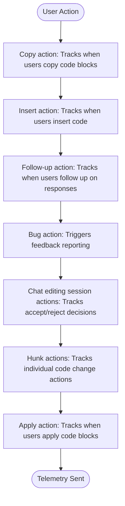
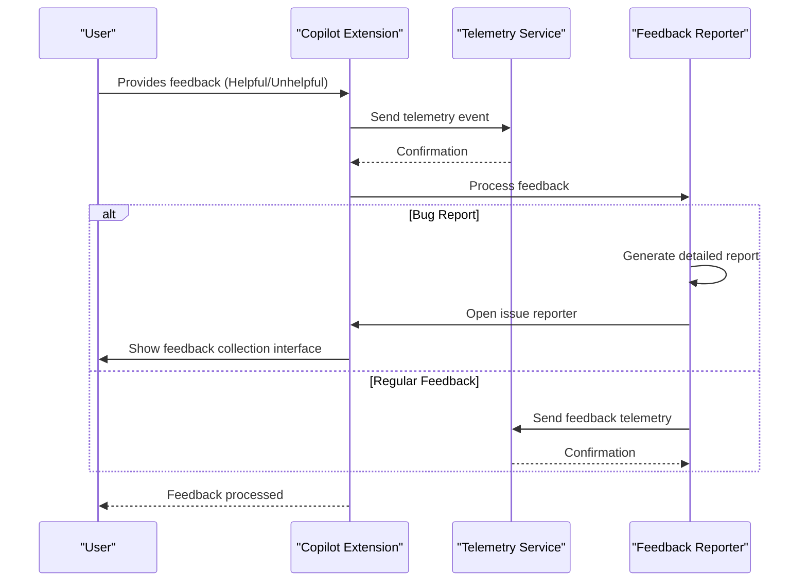
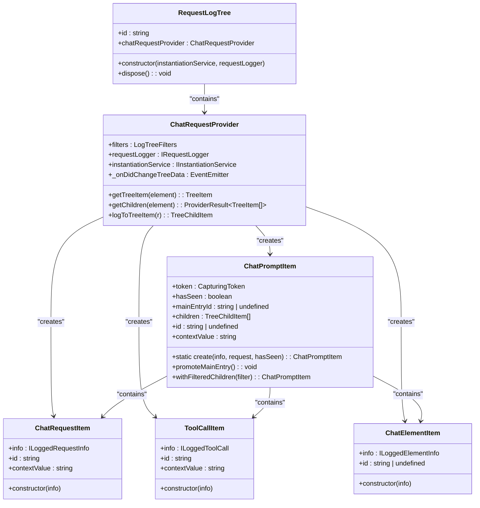
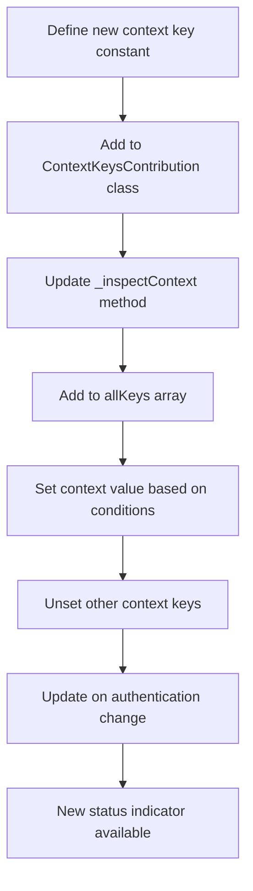
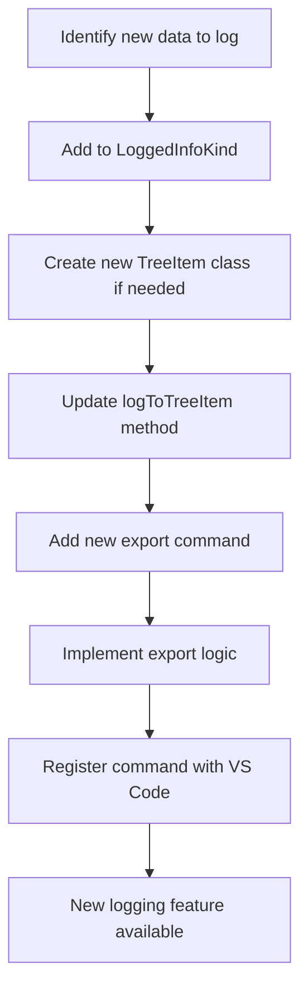
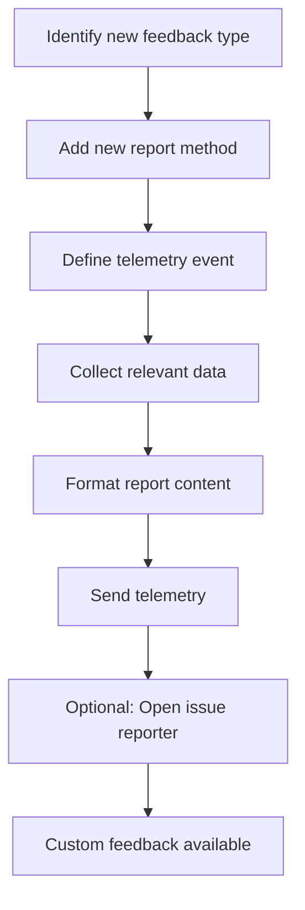

# Status Indicators

<cite>
**Referenced Files in This Document**   
- [userActions.ts](file://src/extension/conversation/vscode-node/userActions.ts)
- [contextKeys.contribution.ts](file://src/extension/contextKeys/vscode-node/contextKeys.contribution.ts)
- [requestLogTree.ts](file://src/extension/log/vscode-node/requestLogTree.ts)
- [feedbackReporter.ts](file://src/extension/conversation/vscode-node/feedbackReporter.ts)
</cite>

## Table of Contents
1. [Introduction](#introduction)
2. [Status Indicators Overview](#status-indicators-overview)
3. [User Actions Tracking](#user-actions-tracking)
4. [Feedback Reporting Mechanisms](#feedback-reporting-mechanisms)
5. [Request Logging Infrastructure](#request-logging-infrastructure)
6. [Context Keys for UI Control](#context-keys-for-ui-control)
7. [Adding and Customizing Status Indicators](#adding-and-customizing-status-indicators)
8. [State Management](#state-management)
9. [Conclusion](#conclusion)

## Introduction
The Status Indicators system in the VS Code Copilot extension provides visual feedback about the extension's state and activity. This documentation details how user interactions are tracked, how feedback is reported, the request logging infrastructure, and how context keys control UI visibility based on the extension's state.

## Status Indicators Overview
The Status Indicators system provides real-time feedback about the Copilot extension's state within VS Code. These indicators help users understand the current status of the extension, including authentication state, quota status, and debugging capabilities. The system uses various mechanisms to track user actions, log requests, and control UI elements based on the extension's state.

The indicators are implemented through multiple components that work together to provide comprehensive feedback about the extension's operation. These components include user action tracking, feedback reporting, request logging, and context key management.

## User Actions Tracking
The user actions tracking system is implemented in the `UserFeedbackService` class within the `userActions.ts` file. This service handles various user interactions with the Copilot extension and sends telemetry data to monitor usage patterns.

### Command Usage and Interaction Patterns
The system tracks several types of user actions through the `handleUserAction` method:



**Diagram sources**
- [userActions.ts](file://src/extension/conversation/vscode-node/userActions.ts#L51-L295)

The system captures detailed information about each action, including:
- Language ID of the current document
- Request ID for correlation
- Code block index
- Character and line counts
- Participant and command information
- Copy type (context menu or toolbar)
- Whether the insert was in a new file

This data is sent as telemetry events with specific properties and measurements that help understand user behavior and improve the extension.

**Section sources**
- [userActions.ts](file://src/extension/conversation/vscode-node/userActions.ts#L51-L295)

## Feedback Reporting Mechanisms
The feedback reporting system integrates with VS Code's notification system to collect and report user feedback about the Copilot extension's performance.

### Feedback Collection Process
When users provide feedback through the extension interface, the system captures this information and processes it accordingly:



**Diagram sources**
- [userActions.ts](file://src/extension/conversation/vscode-node/userActions.ts#L318-L364)
- [feedbackReporter.ts](file://src/extension/conversation/vscode-node/feedbackReporter.ts#L62-L151)

### Feedback Types
The system supports multiple types of feedback:

1. **Helpful/Unhelpful votes**: Users can vote on the quality of responses
2. **Bug reports**: Users can report issues with responses
3. **Accept/Reject actions**: For inline chat suggestions
4. **Copy/Insert actions**: Tracking how users interact with generated code

The feedback is processed by the `FeedbackReporter` class, which can generate detailed reports including:
- Intent information
- Context details (document, selection, language)
- Prompt messages
- Assistant responses
- Workspace state
- Tool usage

**Section sources**
- [userActions.ts](file://src/extension/conversation/vscode-node/userActions.ts#L318-L364)
- [feedbackReporter.ts](file://src/extension/conversation/vscode-node/feedbackReporter.ts#L62-L151)

## Request Logging Infrastructure
The request logging infrastructure, implemented in `requestLogTree.ts`, enables debugging and performance monitoring of the Copilot extension.

### Request Log Tree Structure
The system creates a hierarchical view of requests in the VS Code UI:



**Diagram sources**
- [requestLogTree.ts](file://src/extension/log/vscode-node/requestLogTree.ts#L33-L800)

### Logging Features
The request logging system provides several export capabilities:

- **Export individual log entries** as markdown files
- **Export prompt archives** as tar.gz files containing multiple entries
- **Export logs as JSON** for detailed analysis
- **Show raw request bodies** for debugging
- **View HTML content** in a browser

The system also includes a `RequestServer` class that serves HTML content for logged requests, allowing users to view rich content that cannot be rendered in the standard markdown viewer.

**Section sources**
- [requestLogTree.ts](file://src/extension/log/vscode-node/requestLogTree.ts#L33-L800)

## Context Keys for UI Control
The context keys system, implemented in `contextKeys.contribution.ts`, controls UI visibility based on the extension's state.

### Context Key Definitions
The system defines several context keys that reflect different states of the Copilot extension:

```mermaid
erDiagram
CONTEXT_KEYS {
string key PK
string value
string description
}
CONTEXT_KEYS ||--o{ WELCOME_VIEW : "has"
CONTEXT_KEYS ||--o{ DEBUG : "has"
CONTEXT_KEYS ||--o{ AUTHENTICATION : "has"
CONTEXT_KEYS ||--o{ FEATURES : "has"
WELCOME_VIEW {
string key PK
string description
}
DEBUG {
string key PK
string description
}
AUTHENTICATION {
string key PK
string description
}
FEATURES {
string key PK
string description
}
WELCOME_VIEW {
"github.copilot-chat.activated"
"github.copilot.offline"
"github.copilot.interactiveSession.individual.disabled"
"github.copilot.interactiveSession.individual.expired"
"github.copilot.interactiveSession.contactSupport"
"github.copilot.interactiveSession.enterprise.disabled"
"github.copilot.interactiveSession.chatDisabled"
}
DEBUG {
"github.copilot.chat.debug"
"github.copilot.chat.showLogView"
"github.copilot.debugReportFeedback"
}
AUTHENTICATION {
"github.copilot.auth.missingPermissiveSession"
}
FEATURES {
"github.copilot.chat.quotaExceeded"
"github.copilot.previewFeaturesDisabled"
}
```

**Diagram sources**
- [contextKeys.contribution.ts](file://src/extension/contextKeys/vscode-node/contextKeys.contribution.ts#L19-L39)

### Context Key Management
The `ContextKeysContribution` class manages these context keys by:

1. **Inspecting context** on startup and authentication changes
2. **Scheduling offline checks** when the window state changes
3. **Updating quota status** based on authentication token
4. **Controlling debug visibility** based on environment
5. **Monitoring extension dependencies** like the GitHub Pull Request extension

The system uses a combination of direct updates and event-driven updates to ensure context keys reflect the current state of the extension.

**Section sources**
- [contextKeys.contribution.ts](file://src/extension/contextKeys/vscode-node/contextKeys.contribution.ts#L42-L231)

## Adding and Customizing Status Indicators
To add new status indicators or customize existing ones, developers can follow these patterns:

### Creating New Context Keys
To add a new context key, define it in the appropriate location and update the `ContextKeysContribution` class:



### Extending Request Logging
To add new logging capabilities, extend the existing request logging infrastructure:



### Customizing Feedback Reporting
To customize feedback reporting, extend the `FeedbackReporter` class:



## State Management
The Status Indicators system maintains state across different extension features through several mechanisms:

### State Persistence
The system uses multiple approaches to maintain state:

- **Memory-based state**: For transient information like current request status
- **VS Code context**: For UI state that needs to persist across sessions
- **Global state**: For user preferences and settings
- **Event-driven updates**: For real-time state changes

### State Synchronization
The system ensures state consistency through:

- **Event listeners**: For authentication changes, window state changes, and extension changes
- **Scheduled checks**: For offline status and other periodic updates
- **Dependency injection**: For sharing state between components
- **Disposable pattern**: For proper cleanup of resources

The state management approach ensures that status indicators accurately reflect the current state of the extension and provide timely feedback to users.

## Conclusion
The Status Indicators system in the VS Code Copilot extension provides comprehensive visual feedback about the extension's state and activity. By tracking user actions, implementing robust feedback reporting, maintaining detailed request logs, and using context keys to control UI visibility, the system enhances the user experience and provides valuable insights for development and debugging.

The modular design allows for easy extension and customization, making it possible to add new indicators and adapt existing ones to meet evolving requirements. The integration with VS Code's notification system and telemetry infrastructure ensures that feedback is collected effectively and can be used to improve the extension over time.