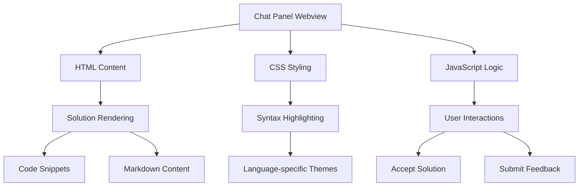
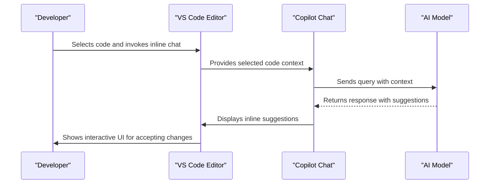
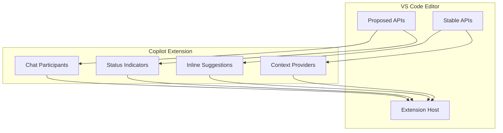
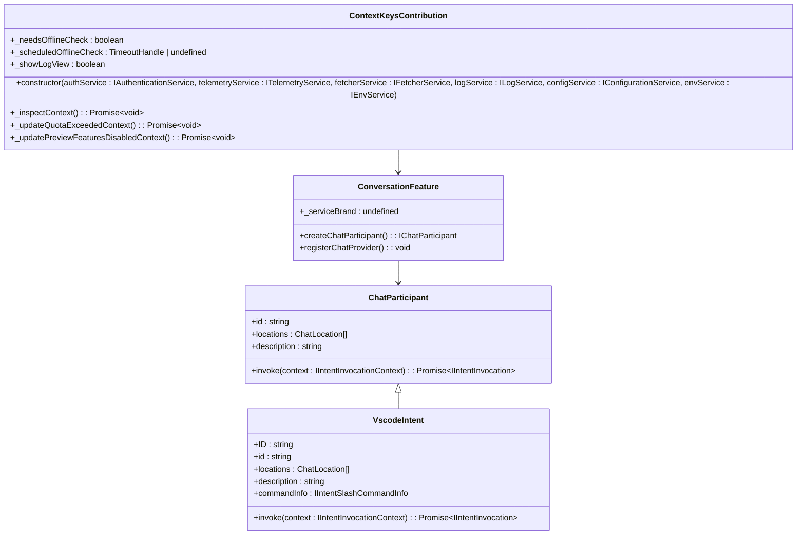
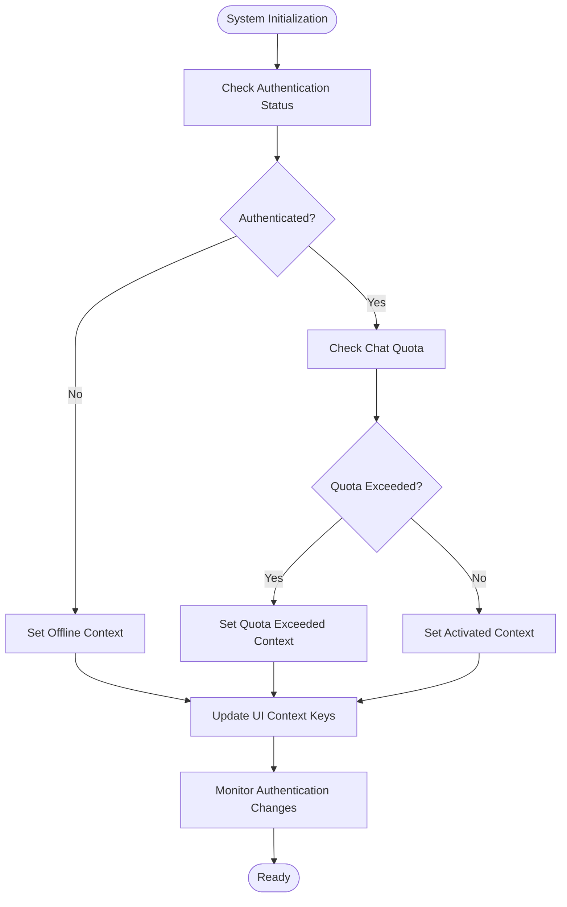
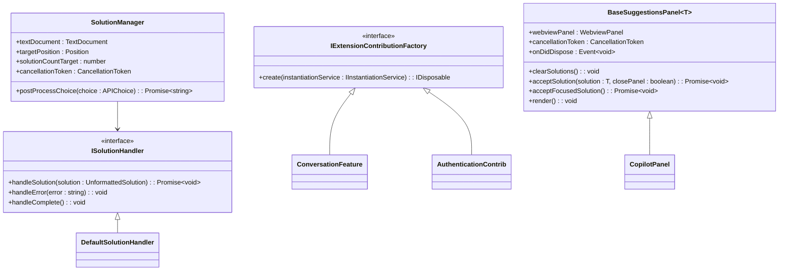

# UI Components

<cite>
**Referenced Files in This Document**   
- [package.json](file://package.json)
- [contextKeys.contribution.ts](file://src/extension/contextKeys/vscode-node/contextKeys.contribution.ts)
- [panel.ts](file://src/extension/completions-core/vscode-node/extension/src/lib/copilotPanel/panel.ts)
- [baseSuggestionsPanel.ts](file://src/extension/completions-core/vscode-node/extension/src/panelShared/baseSuggestionsPanel.ts)
- [contributions.ts](file://src/extension/extension/vscode-node/contributions.ts)
- [chatSessionService.ts](file://src/platform/chat/vscode/chatSessionService.ts)
- [vscode.proposed.chatParticipantAdditions.d.ts](file://src/extension/vscode.proposed.chatParticipantAdditions.d.ts)
- [vscode.proposed.chatStatusItem.d.ts](file://src/extension/vscode.proposed.chatStatusItem.d.ts)
</cite>

## Table of Contents
1. [Introduction](#introduction)
2. [Chat Interface Architecture](#chat-interface-architecture)
3. [Inline Chat Implementation](#inline-chat-implementation)
4. [Extension API and VS Code Integration](#extension-api-and-vs-code-integration)
5. [Chat Participants and Contribution Points](#chat-participants-and-contribution-points)
6. [Natural Language Hints and Status Indicators](#natural-language-hints-and-status-indicators)
7. [Creating and Extending UI Components](#creating-and-extending-ui-components)
8. [Conclusion](#conclusion)

## Introduction
The GitHub Copilot Chat extension provides an AI-powered chat interface integrated with VS Code's editor environment. This documentation details the architecture of the chat UI components, including the main chat panel, inline chat functionality, and integration points with VS Code's interface system. The extension leverages VS Code's proposed APIs to implement chat participants, status indicators, and contextual hints that enhance the developer experience.

**Section sources**
- [package.json](file://package.json#L1-L800)

## Chat Interface Architecture
The chat interface in the Copilot extension is built around a webview-based panel system that displays AI-generated responses and suggestions. The core architecture consists of several key components that work together to provide a seamless chat experience within VS Code.

The main chat panel is implemented using a webview that renders HTML content with syntax highlighting and interactive elements. This panel displays conversation history, code suggestions, and feedback mechanisms. The panel architecture is defined in the `baseSuggestionsPanel.ts` file, which provides a foundation for rendering solutions with proper formatting and interactivity.

**Diagram sources**
- [baseSuggestionsPanel.ts](file://src/extension/completions-core/vscode-node/extension/src/panelShared/baseSuggestionsPanel.ts#L1-L339)

The panel system uses a streaming architecture to display solutions as they are generated by the AI model. This allows users to see partial results quickly while the full response is still being processed. The `launchSolutions` function in `panel.ts` initiates the generation of a stream of solutions, handling the entire lifecycle from prompt setup to result rendering.

**Section sources**
- [panel.ts](file://src/extension/completions-core/vscode-node/extension/src/lib/copilotPanel/panel.ts#L1-L138)
- [baseSuggestionsPanel.ts](file://src/extension/completions-core/vscode-node/extension/src/panelShared/baseSuggestionsPanel.ts#L1-L339)

## Inline Chat Implementation
The inline chat functionality allows users to interact with Copilot directly within the context of their code editor. This feature is implemented through VS Code's chat participant API, which enables the extension to register as a chat provider that can respond to user queries in specific contexts.

The inline chat system uses a combination of language-specific context providers and code analysis tools to understand the current code context and provide relevant suggestions. When a user invokes inline chat, the system analyzes the surrounding code, extracts relevant context, and formulates a prompt that includes this context along with the user's query.

The implementation leverages VS Code's proposed chat APIs to create a seamless inline experience. The extension registers chat participants that can handle different types of queries, such as code explanations, bug fixes, and feature implementations. These participants are activated based on the current editor context and user intent.

**Diagram sources**
- [vscode.proposed.chatParticipantAdditions.d.ts](file://src/extension/vscode.proposed.chatParticipantAdditions.d.ts#L46-L95)
- [contributions.ts](file://src/extension/extension/vscode-node/contributions.ts#L1-L124)

## Extension API and VS Code Integration
The Copilot Chat extension integrates with VS Code through a comprehensive API system that defines the contract between the extension and the editor's UI components. This integration is primarily achieved through contribution points defined in the extension's `package.json` file and implemented in various contribution classes.

The extension uses VS Code's proposed APIs to access advanced chat features that are not yet part of the stable API surface. These proposed APIs include chat participant additions, chat editing capabilities, and chat status items that provide real-time feedback about the AI's state.

The `enabledApiProposals` field in `package.json` lists all the proposed APIs that the extension depends on, including `chatParticipantAdditions`, `chatEditing`, `chatStatusItem`, and `interactive`. These proposals enable the extension to implement rich UI features that would not be possible with the stable API alone.

**Diagram sources**
- [package.json](file://package.json#L91-L139)
- [vscode.proposed.chatStatusItem.d.ts](file://src/extension/vscode.proposed.chatStatusItem.d.ts#L1-L61)

**Section sources**
- [package.json](file://package.json#L91-L139)
- [vscode.proposed.chatStatusItem.d.ts](file://src/extension/vscode.proposed.chatStatusItem.d.ts#L1-L61)

## Chat Participants and Contribution Points
Chat participants are the core mechanism through which the Copilot extension integrates with VS Code's chat system. These participants are registered through contribution points in the extension's `package.json` file and implemented as classes that handle specific types of user queries.

The extension registers multiple chat participants for different use cases, including general coding assistance, test generation, debugging help, and documentation queries. Each participant is responsible for handling queries in its domain, generating appropriate responses, and presenting them in the chat UI.

The contribution system is organized in the `contributions.ts` file, which exports arrays of contribution factories that are instantiated when the extension activates. These contributions include authentication providers, chat quota management, context key providers, and various UI components.

**Diagram sources**
- [contributions.ts](file://src/extension/extension/vscode-node/contributions.ts#L1-L124)
- [contextKeys.contribution.ts](file://src/extension/contextKeys/vscode-node/contextKeys.contribution.ts#L1-L231)

**Section sources**
- [contributions.ts](file://src/extension/extension/vscode-node/contributions.ts#L1-L124)
- [contextKeys.contribution.ts](file://src/extension/contextKeys/vscode-node/contextKeys.contribution.ts#L1-L231)

## Natural Language Hints and Status Indicators
The Copilot extension provides several UI elements that offer natural language hints and status indicators to enhance the user experience. These include context-aware suggestions, progress indicators, and status messages that keep users informed about the AI's state and capabilities.

The status indicator system is implemented using VS Code's `chatStatusItem` API, which allows the extension to display real-time information in the chat interface. This includes indicators for authentication status, quota usage, and system readiness. The `ContextKeysContribution` class manages these status indicators by monitoring various system states and updating the corresponding context keys.

Natural language hints are provided through the chat participant system, which analyzes the current code context and offers relevant suggestions. These hints appear as inline suggestions, code completions, or chat responses depending on the context. The system uses language-specific analysis tools to understand the code structure and provide accurate, context-aware suggestions.

**Diagram sources**
- [contextKeys.contribution.ts](file://src/extension/contextKeys/vscode-node/contextKeys.contribution.ts#L1-L231)
- [vscode.proposed.chatStatusItem.d.ts](file://src/extension/vscode.proposed.chatStatusItem.d.ts#L1-L61)

**Section sources**
- [contextKeys.contribution.ts](file://src/extension/contextKeys/vscode-node/contextKeys.contribution.ts#L1-L231)

## Creating and Extending UI Components
Developers can create new UI components or extend existing ones in the Copilot Chat extension by following the established patterns and contribution system. This involves implementing new contribution classes, registering them in the appropriate contribution arrays, and defining the necessary contribution points in `package.json`.

To create a new chat participant, developers should implement the `IIntent` interface and register their participant in the `vscodeNodeChatContributions` array. The participant should define its supported locations, description, and invocation logic. The `VscodeIntent` class provides an example of how to implement a chat participant that responds to queries about VS Code itself.

For extending existing UI components, developers can leverage the existing panel architecture by creating subclasses of `BaseSuggestionsPanel` or implementing new solution handlers. These extensions can customize the rendering of suggestions, add new interaction patterns, or integrate with additional data sources.

The contribution system uses a factory pattern to instantiate components when needed. Developers should wrap their contribution classes with the `asContributionFactory` function to ensure proper instantiation. The `IExtensionContributionFactory` interface defines the contract for these factories, allowing the extension host to create instances with the necessary dependencies injected.

**Diagram sources**
- [contributions.ts](file://src/extension/extension/vscode-node/contributions.ts#L1-L124)
- [baseSuggestionsPanel.ts](file://src/extension/completions-core/vscode-node/extension/src/panelShared/baseSuggestionsPanel.ts#L1-L339)
- [panel.ts](file://src/extension/completions-core/vscode-node/extension/src/lib/copilotPanel/panel.ts#L1-L138)

**Section sources**
- [contributions.ts](file://src/extension/extension/vscode-node/contributions.ts#L1-L124)
- [baseSuggestionsPanel.ts](file://src/extension/completions-core/vscode-node/extension/src/panelShared/baseSuggestionsPanel.ts#L1-L339)

## Conclusion
The GitHub Copilot Chat extension provides a sophisticated UI architecture that integrates seamlessly with VS Code's interface. By leveraging proposed APIs and a modular contribution system, the extension delivers a rich set of features including chat panels, inline suggestions, and status indicators. The architecture is designed to be extensible, allowing developers to create new UI components and extend existing functionality through well-defined contribution points. This documentation provides a comprehensive overview of the UI components and their implementation, serving as a reference for developers looking to understand or extend the extension's capabilities.