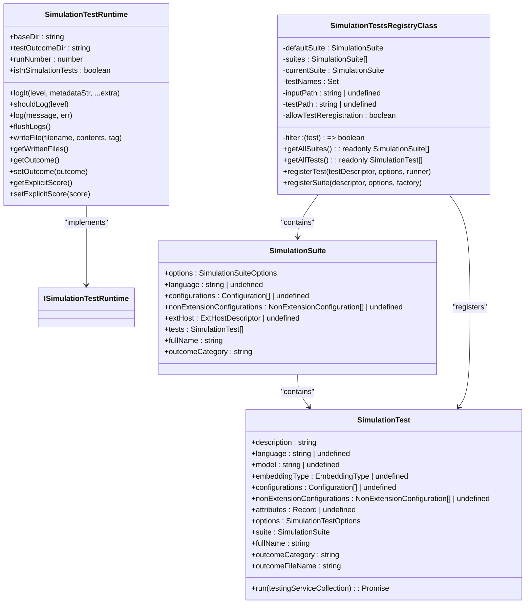
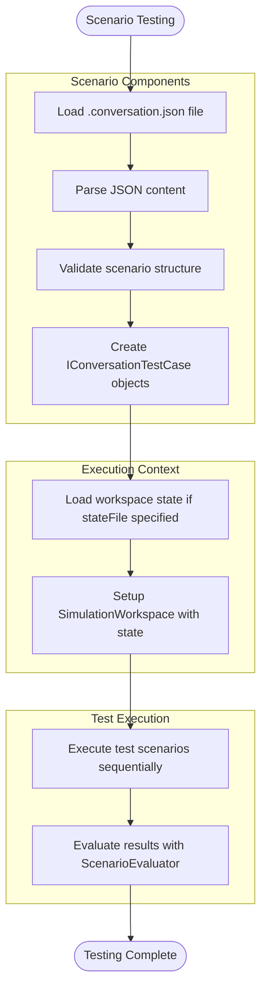
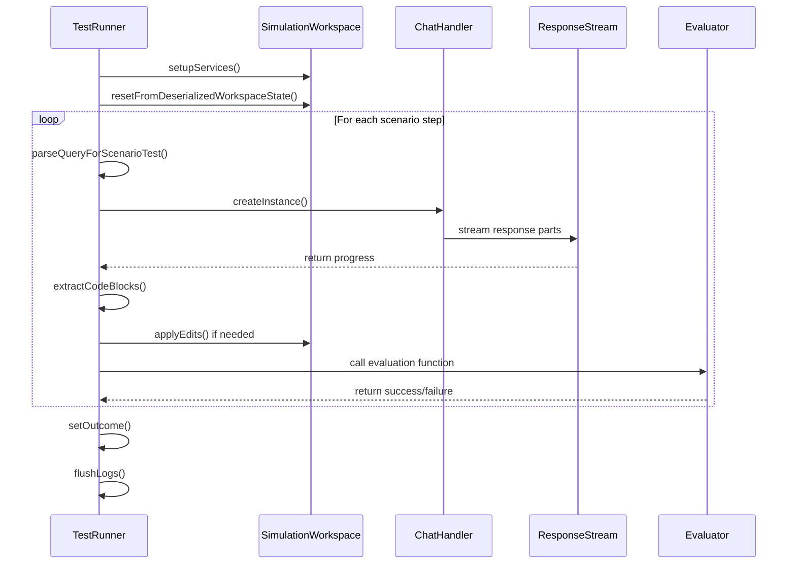
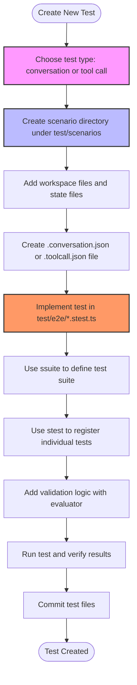

# End-to-End Testing

<cite>
**Referenced Files in This Document**   
- [stest.ts](file://test/base/stest.ts)
- [scenarioLoader.ts](file://test/e2e/scenarioLoader.ts)
- [scenarioTest.ts](file://test/e2e/scenarioTest.ts)
- [stestUtil.ts](file://test/simulation/stestUtil.ts)
- [sharedTypes.ts](file://test/simulation/shared/sharedTypes.ts)
- [types.ts](file://test/simulation/types.ts)
- [explain.stest.ts](file://test/e2e/explain.stest.ts)
- [edit.stest.ts](file://test/e2e/edit.stest.ts)
- [notebookTools.stest.ts](file://test/e2e/notebookTools.stest.ts)
- [pythonFix.stest.ts](file://test/e2e/pythonFix.stest.ts)
- [typescriptFix.stest.ts](file://test/e2e/typescriptFix.stest.ts)
- [testHelper.ts](file://test/e2e/testHelper.ts)
- [simulationTestProvider.ts](file://test/simulation/simulationTestProvider.ts)
</cite>

## Table of Contents
1. [Introduction](#introduction)
2. [Test Framework Architecture](#test-framework-architecture)
3. [Scenario-Based Testing Structure](#scenario-based-testing-structure)
4. [Test Execution Workflow](#test-execution-workflow)
5. [Language Context Testing](#language-context-testing)
6. [Complex Output Validation](#complex-output-validation)
7. [Creating New End-to-End Tests](#creating-new-end-to-end-tests)
8. [Test Management and Outcome Interpretation](#test-management-and-outcome-interpretation)

## Introduction
The end-to-end testing framework for the vscode-copilot-chat extension is designed to simulate real user interactions within a VS Code environment. This comprehensive testing system validates complete user workflows from initial input to final output, covering various scenarios such as code explanation, editing, test generation, and workspace operations. The framework employs scenario-based testing using predefined workspaces and conversation states to ensure consistent and reliable test execution across different language contexts including Python, TypeScript, C++, and others.

**Section sources**
- [stest.ts](file://test/base/stest.ts#L1-L641)
- [scenarioLoader.ts](file://test/e2e/scenarioLoader.ts#L1-L168)

## Test Framework Architecture
The end-to-end testing framework is built around a modular architecture that separates test definition, execution, and validation components. At its core, the framework uses a registry pattern implemented through the `SimulationTestsRegistryClass` to manage test suites and individual tests. Each test suite is defined with metadata including title, subtitle, location (inline, panel, external, or context), and optional language specification that can be inherited by individual tests within the suite.

The framework provides a set of utility functions such as `ssuite` and `stest` that serve as decorators for defining test suites and individual tests. These functions capture location information and register tests with the central registry, enabling organized test discovery and execution. The `SimulationTestRuntime` class implements the `ISimulationTestRuntime` interface, providing logging capabilities, file writing functionality, and outcome tracking for each test execution.



**Diagram sources **
- [stest.ts](file://test/base/stest.ts#L121-L641)

**Section sources**
- [stest.ts](file://test/base/stest.ts#L1-L641)

## Scenario-Based Testing Structure
The framework employs a scenario-based testing approach where test cases are defined in JSON files with the `.conversation.json` extension. These scenario files contain arrays of test cases that represent sequential interactions within a conversation. Each test case includes a question, optional state file reference, and additional metadata for validation.

The `fetchConversationScenarios` function in `scenarioLoader.ts` reads these JSON files and converts them into structured test scenarios. The framework supports both simple conversation scenarios and more complex tool call scenarios defined in `.toolcall.json` files. For each scenario, the framework can load a predefined workspace state from a `.state.json` file, allowing tests to start with specific file contents, editor states, and workspace configurations.

The scenario loader also supports dynamic test case generation by discovering scenario files in nested directories, enabling organized test categorization by feature or functionality. This structure allows for comprehensive testing of multi-turn conversations where the output of one interaction serves as context for subsequent interactions.



**Diagram sources **
- [scenarioLoader.ts](file://test/e2e/scenarioLoader.ts#L1-L168)

**Section sources**
- [scenarioLoader.ts](file://test/e2e/scenarioLoader.ts#L1-L168)

## Test Execution Workflow
The test execution workflow begins with the registration of test suites and individual tests through the `ssuite` and `stest` functions. When tests are executed, the framework creates a `SimulationWorkspace` instance that simulates the VS Code environment, including text editors, documents, and workspace folders. The `generateScenarioTestRunner` function creates a test execution function that processes each scenario step by step.

For each interaction in a scenario, the framework parses the query to extract participant names, commands, and variables using the `parseQueryForScenarioTest` function. It then creates a mock chat session using `ChatParticipantRequestHandler` and captures the response through a `SpyChatResponseStream`. The framework validates responses against expected outcomes using evaluator functions that can check for specific content, code patterns, or tool calls.

After receiving a response, the framework can apply code block changes to the simulated workspace using the `CodeMapper` service, which handles both single-file and multi-file edits. The test runtime captures all changes, logs, and intermediate states, storing them with appropriate tags for later analysis. The outcome of each test is recorded using the `setOutcome` method, with different outcome types for edits, conversational responses, or failures.



**Diagram sources **
- [scenarioTest.ts](file://test/e2e/scenarioTest.ts#L1-L256)
- [testHelper.ts](file://test/e2e/testHelper.ts#L1-L112)

**Section sources**
- [scenarioTest.ts](file://test/e2e/scenarioTest.ts#L1-L256)
- [testHelper.ts](file://test/e2e/testHelper.ts#L1-L112)

## Language Context Testing
The framework supports testing across multiple programming languages by allowing language specification at both the suite and individual test levels. When a language is specified in a test descriptor or inherited from its suite, it is used to configure the appropriate language context providers and diagnostic services. This enables validation of language-specific behaviors such as syntax highlighting, code completion, and error detection.

For language-specific testing, the framework can load language-appropriate workspace states and validate that responses contain correct syntax and idioms. For example, Python tests can verify that generated code follows PEP 8 guidelines, while TypeScript tests can ensure proper type annotations. The framework also supports testing language-specific tools such as linters (ESLint, Pylint, Pyright) and compilers (TSC, Roslyn) by configuring the appropriate diagnostic providers in the simulation environment.

The language context is also used to determine appropriate code block processing and editing strategies. Different languages may require different indentation rules, comment styles, and formatting options, all of which can be specified in the test configuration. This ensures that generated code is not only functionally correct but also adheres to language-specific conventions and best practices.

**Section sources**
- [stest.ts](file://test/base/stest.ts#L82-L95)
- [explain.stest.ts](file://test/e2e/explain.stest.ts#L1-L43)
- [pythonFix.stest.ts](file://test/e2e/pythonFix.stest.ts#L1-L31)
- [typescriptFix.stest.ts](file://test/e2e/typescriptFix.stest.ts#L1-L44)

## Complex Output Validation
The framework provides comprehensive validation capabilities for complex outputs including multi-file edits, notebook operations, and terminal interactions. For multi-file edits, the framework tracks changes across all modified files and validates that the complete set of changes achieves the desired outcome. The `IWorkspaceEditOutcome` type represents these complex edits, capturing the complete workspace state before and after the changes.

For notebook operations, the framework supports testing cell execution, cell editing, and notebook creation. The `notebookTools.stest.ts` file demonstrates how to validate tool calls for running notebook cells, editing notebook content, and creating new notebooks. The framework can verify that the correct cells are targeted, that code execution produces expected outputs, and that notebook structure is maintained appropriately.

Terminal interactions are validated by checking for the correct command execution and output. The framework can simulate terminal input and validate that the appropriate commands are generated and executed. For all complex outputs, the framework uses outcome validators that can perform deep structural analysis of the results, ensuring that not only the immediate output is correct but also that the overall user goal has been achieved.

```mermaid
classDiagram
class IOutcome {
<<interface>>
}
class IInlineEditOutcome {
+type : 'inlineEdit'
+appliedEdits : IInlineEdit[]
+originalFileContents : string
+fileContents : string
+initialDiagnostics : ResourceMap<Diagnostic[]>
+chatResponseMarkdown : string
+annotations : OutcomeAnnotation[]
}
class IWorkspaceEditOutcome {
+type : 'workspaceEdit'
+files : IFile[] | Array<{srcUri, post}>
+edits : WorkspaceEdit
+chatResponseMarkdown : string
+annotations : OutcomeAnnotation[]
}
class IConversationalOutcome {
+type : 'conversational'
+chatResponseMarkdown : string
+annotations : OutcomeAnnotation[]
}
class IErrorOutcome {
+type : 'error'
+errorDetails : ChatErrorDetails
+annotations : OutcomeAnnotation[]
}
class IEmptyOutcome {
+type : 'none'
+chatResponseMarkdown : string
+annotations : OutcomeAnnotation[]
}
IOutcome <|-- IInlineEditOutcome
IOutcome <|-- IWorkspaceEditOutcome
IOutcome <|-- IConversationalOutcome
IOutcome <|-- IErrorOutcome
IOutcome <|-- IEmptyOutcome
class OutcomeAnnotation {
+severity : 'info' | 'warning' | 'error'
+label : string
+message : string
}
class IInlineEdit {
+offset : number
+length : number
+range : {start, end}
+newText : string
}
IWorkspaceEditOutcome --> IFile : "contains"
IWorkspaceEditOutcome --> WorkspaceEdit : "references"
IInlineEditOutcome --> IInlineEdit : "contains"
IInlineEditOutcome --> ResourceMap : "references"
IConversationalOutcome --> OutcomeAnnotation : "contains"
IErrorOutcome --> ChatErrorDetails : "references"
IEmptyOutcome --> OutcomeAnnotation : "contains"
```

**Diagram sources **
- [types.ts](file://test/simulation/types.ts#L1-L136)

**Section sources**
- [types.ts](file://test/simulation/types.ts#L1-L136)
- [stestUtil.ts](file://test/simulation/stestUtil.ts#L1-L322)
- [notebookTools.stest.ts](file://test/e2e/notebookTools.stest.ts#L1-L231)

## Creating New End-to-End Tests
To create new end-to-end tests, developers should follow the established pattern of defining test suites with `ssuite` and individual tests with `stest`. Each test should be placed in an appropriate file within the `test/e2e` directory, following the naming convention of the feature being tested (e.g., `explain.stest.ts`, `edit.stest.ts`).

The first step is to create a scenario directory under `test/scenarios` containing the necessary workspace files and a `.conversation.json` file defining the test cases. Each test case should include a descriptive question, optional state file reference, and any additional metadata needed for validation. For more complex scenarios involving tool calls, a `.toolcall.json` file can be created instead.

When implementing the test logic, developers should use the `generateScenarioTestRunner` function to create a test execution function that includes appropriate validation logic. Evaluators should check for expected content, validate code quality, and ensure that the correct tools are called when appropriate. The framework provides various assertion utilities in `stestUtil.ts` to simplify common validation patterns.



**Section sources**
- [explain.stest.ts](file://test/e2e/explain.stest.ts#L1-L43)
- [edit.stest.ts](file://test/e2e/edit.stest.ts#L1-L42)
- [pythonFix.stest.ts](file://test/e2e/pythonFix.stest.ts#L1-L31)
- [stestUtil.ts](file://test/simulation/stestUtil.ts#L1-L322)

## Test Management and Outcome Interpretation
The framework provides comprehensive test management capabilities through its registry system and outcome tracking. Test outcomes are categorized into different types including 'edit', 'failed', and 'answer', each with specific data structures to capture relevant information. The outcome category is derived from the test suite name, subtitle, and location, enabling organized reporting and analysis.

Test results are written to output files with timestamps and run numbers, allowing for comparison across different test runs. The framework supports both explicit and implicit logging, with explicit logs capturing intentional debug messages and implicit logs recording framework-generated information. Various tags are used to categorize different types of output, such as `INLINE_INITIAL_DOC_TAG` for original file contents and `INLINE_CHANGED_DOC_TAG` for modified files.

The framework also supports optional tests and conditional test skipping through the `optional` and `skip` properties in test and suite descriptors. This allows for flexible test execution based on environment conditions or configuration settings. Test outcomes can include explicit scores between 0 and 1, enabling quantitative assessment of test quality beyond simple pass/fail criteria.

```mermaid
classDiagram
class SimulationTestOutcome {
<<interface>>
}
class EditOutcome {
+kind : 'edit'
+files : Array<{srcUri, post}> | string[]
+annotations : OutputAnnotation[]
}
class FailedOutcome {
+kind : 'failed'
+hitContentFilter : boolean
+error : string | undefined
+critical : boolean
+annotations : OutputAnnotation[]
}
class AnswerOutcome {
+kind : 'answer'
+content : string
+annotations : OutputAnnotation[]
}
SimulationTestOutcome <|-- EditOutcome
SimulationTestOutcome <|-- FailedOutcome
SimulationTestOutcome <|-- AnswerOutcome
class OutputAnnotation {
+severity : string
+label : string
+message : string
}
class SimulationTestOptions {
+optional : boolean
+skip(opts) : boolean
+location : ITestLocation
+conversationPath : string | undefined
+scenarioFolderPath : string
+stateFile : string
}
class SimulationSuiteOptions {
+optional : boolean
+skip(opts) : boolean
+location : ITestLocation
}
class RunOutput {
<<interface>>
}
class ITestRunEndOutput {
+type : 'testRunEnd'
+name : string
+runNumber : number
+duration : number
+pass : boolean
+explicitScore : number | undefined
+annotations : OutputAnnotation[]
+error : string
+writtenFiles : IWrittenFile[]
+averageRequestDuration : number | undefined
+requestCount : number | undefined
+hasCacheMiss : boolean | undefined
}
class IWrittenFile {
+relativePath : string
+tag : string
}
EditOutcome --> OutputAnnotation : "contains"
FailedOutcome --> OutputAnnotation : "contains"
AnswerOutcome --> OutputAnnotation : "contains"
ITestRunEndOutput --> OutputAnnotation : "contains"
ITestRunEndOutput --> IWrittenFile : "contains"
```

**Diagram sources **
- [sharedTypes.ts](file://test/simulation/shared/sharedTypes.ts#L1-L349)
- [stest.ts](file://test/base/stest.ts#L23-L30)

**Section sources**
- [sharedTypes.ts](file://test/simulation/shared/sharedTypes.ts#L1-L349)
- [stest.ts](file://test/base/stest.ts#L23-L30)
- [simulationTestProvider.ts](file://test/simulation/simulationTestProvider.ts#L1-L64)