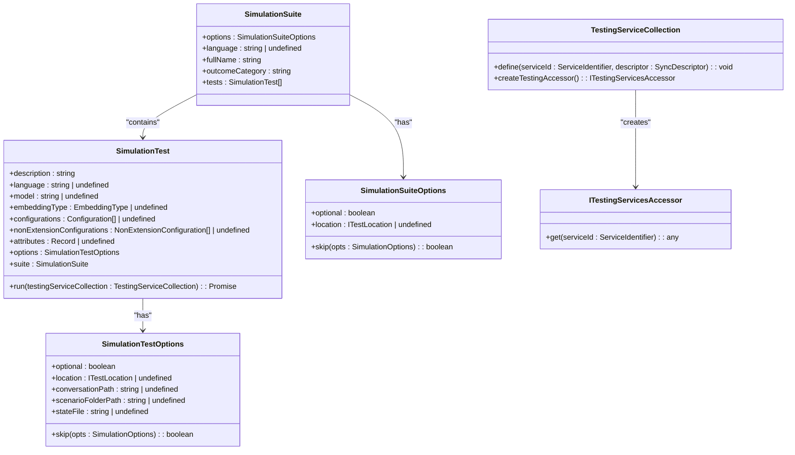
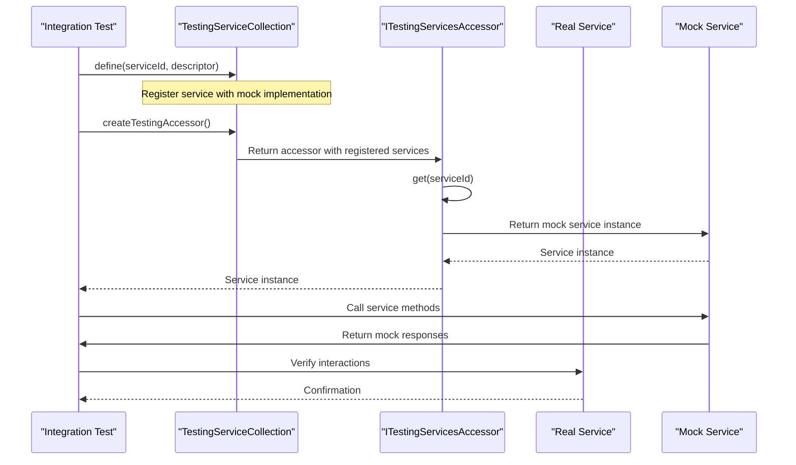
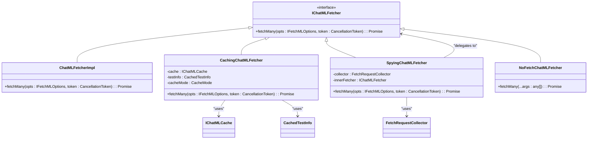
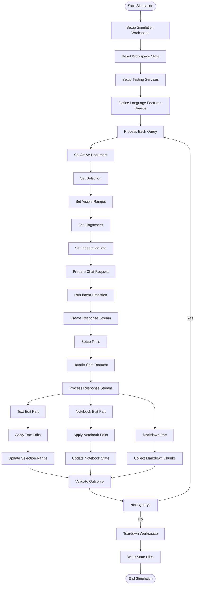
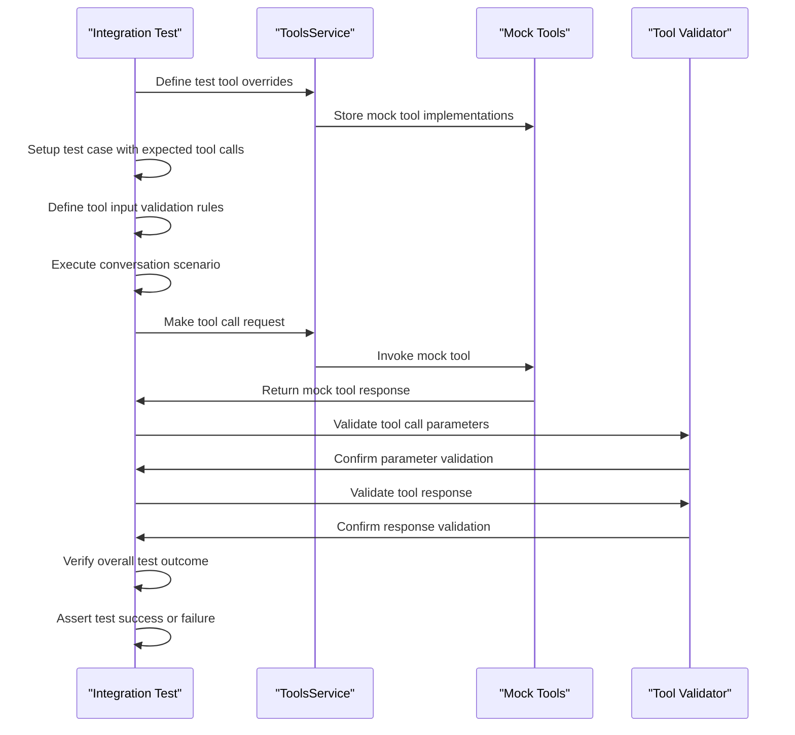
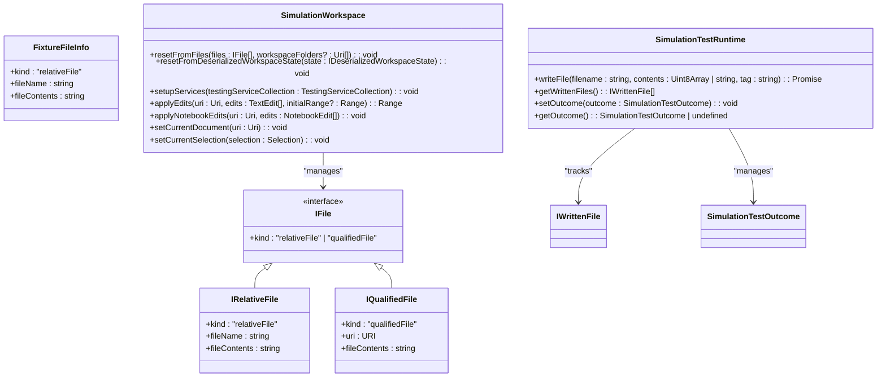
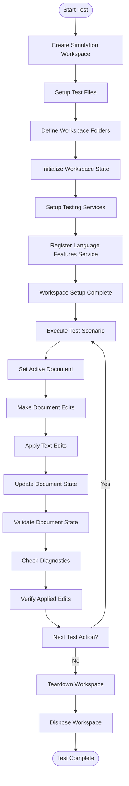
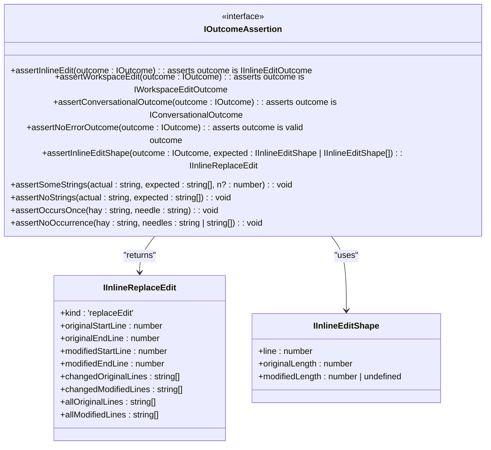
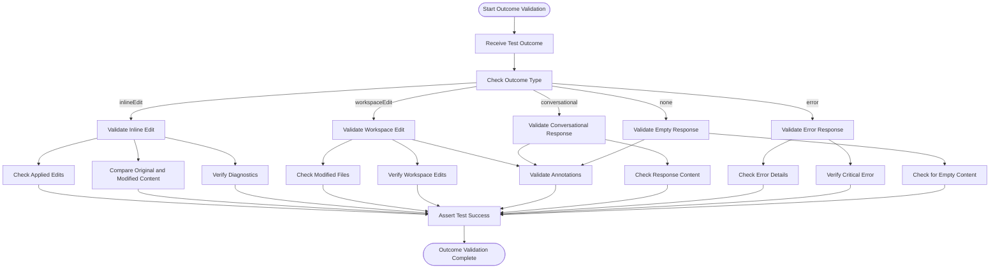

# Integration Testing

<cite>
**Referenced Files in This Document**   
- [cachingChatMLFetcher.ts](file://test/base/cachingChatMLFetcher.ts)
- [stest.ts](file://test/base/stest.ts)
- [simulationContext.ts](file://test/base/simulationContext.ts)
- [stestUtil.ts](file://test/simulation/stestUtil.ts)
- [simulationTestProvider.ts](file://test/simulation/simulationTestProvider.ts)
- [inlineChatSimulator.ts](file://test/simulation/inlineChatSimulator.ts)
- [types.ts](file://test/simulation/types.ts)
- [notebookEdits.stest.ts](file://test/simulation/notebookEdits.stest.ts)
- [e2e/scenarioTest.ts](file://test/e2e/scenarioTest.ts)
- [e2e/toolSimTest.ts](file://test/e2e/toolSimTest.ts)
- [extHostContext/simulationWorkspaceExtHost.ts](file://test/base/extHostContext/simulationWorkspaceExtHost.ts)
- [extHostContext/simulationExtHostToolsService.ts](file://test/base/extHostContext/simulationExtHostToolsService.ts)
</cite>

## Table of Contents
1. [Introduction](#introduction)
2. [Integration Test Framework](#integration-test-framework)
3. [Component Interaction Testing](#component-interaction-testing)
4. [Conversation State Management](#conversation-state-management)
5. [Tool Execution Testing](#tool-execution-testing)
6. [Test Fixture Management](#test-fixture-management)
7. [Outcome Verification](#outcome-verification)
8. [Conclusion](#conclusion)

## Introduction
The vscode-copilot-chat extension employs a comprehensive integration testing approach to validate the interaction between multiple components within controlled test environments. The testing framework focuses on feature integrations such as intent handling, tool execution, and conversation state management. Integration test suites combine services like chatMLFetcher, endpoint providers, and workspace services to validate complex workflows end-to-end through multiple layers. The framework uses simulated VS Code APIs and mocked external dependencies to validate component interactions while maintaining test isolation and reliability.

## Integration Test Framework

The integration testing framework in vscode-copilot-chat is built around a sophisticated test registry and execution system that manages test suites, configurations, and execution contexts. The framework provides a structured approach to defining and running integration tests that validate component interactions across service boundaries.



**Diagram sources**
- [stest.ts](file://test/base/stest.ts#L121-L278)
- [stest.ts](file://test/base/stest.ts#L32-L74)
- [stest.ts](file://test/base/stest.ts#L188-L208)

**Section sources**
- [stest.ts](file://test/base/stest.ts#L19-L641)

## Component Interaction Testing

The integration testing framework validates component interactions through a combination of service mocking, dependency injection, and controlled test environments. The framework uses a service collection pattern to register and resolve dependencies, allowing for easy substitution of real services with test doubles.

### Service Mocking and Dependency Injection

The framework employs dependency injection to manage service dependencies and enable mocking of external services. The `TestingServiceCollection` class serves as a container for service registrations, allowing tests to define custom implementations for specific services.



**Diagram sources**
- [stest.ts](file://test/base/stest.ts#L11-L12)
- [stest.ts](file://test/base/stest.ts#L512-L526)
- [simulationContext.ts](file://test/base/simulationContext.ts#L38)

### chatMLFetcher Integration Testing

The `chatMLFetcher` component is a critical integration point that handles communication with the language model API. The framework provides a caching and spying implementation that allows tests to validate API interactions while maintaining test performance through response caching.



**Diagram sources**
- [cachingChatMLFetcher.ts](file://test/base/cachingChatMLFetcher.ts#L106-L132)
- [cachingChatMLFetcher.ts](file://test/base/cachingChatMLFetcher.ts#L97-L98)
- [cachingChatMLFetcher.ts](file://test/base/cachingChatMLFetcher.ts#L96)
- [cachingChatMLFetcher.ts](file://test/base/cachingChatMLFetcher.ts#L97-L98)

## Conversation State Management

The integration testing framework includes comprehensive support for managing and validating conversation state across multiple interactions. The framework tracks conversation history, maintains context between turns, and validates state transitions throughout the conversation lifecycle.

### Conversation State Tracking

The framework uses a structured approach to track conversation state, including request history, response metadata, and outcome validation. The `simulateEditingScenario` function orchestrates the conversation flow and maintains state across multiple query-response cycles.



**Diagram sources**
- [inlineChatSimulator.ts](file://test/simulation/inlineChatSimulator.ts#L189-L702)
- [inlineChatSimulator.ts](file://test/simulation/inlineChatSimulator.ts#L203-L215)
- [inlineChatSimulator.ts](file://test/simulation/inlineChatSimulator.ts#L473-L474)

### Outcome Validation

The framework provides a comprehensive system for validating conversation outcomes, including inline edits, workspace edits, and conversational responses. The outcome validation system captures both successful responses and error conditions, providing detailed feedback for test failures.

```mermaid
classDiagram
class IOutcome {
<<interface>>
+type : 'inlineEdit' | 'workspaceEdit' | 'conversational' | 'error' | 'none'
+chatResponseMarkdown : string
+annotations : OutcomeAnnotation[]
}
class IInlineEditOutcome {
+type : 'inlineEdit'
+appliedEdits : IInlineEdit[]
+originalFileContents : string
+fileContents : string
+initialDiagnostics : ResourceMap<Diagnostic[]>
+chatResponseMarkdown : string
+annotations : OutcomeAnnotation[]
}
class IWorkspaceEditOutcome {
+type : 'workspaceEdit'
+files : IFile[] | Array<{ srcUri : string; post : string }>
+edits : WorkspaceEdit
+chatResponseMarkdown : string
+annotations : OutcomeAnnotation[]
}
class IConversationalOutcome {
+type : 'conversational'
+chatResponseMarkdown : string
+annotations : OutcomeAnnotation[]
}
class IErrorOutcome {
+type : 'error'
+errorDetails : ChatErrorDetails
+annotations : OutcomeAnnotation[]
}
class IEmptyOutcome {
+type : 'none'
+chatResponseMarkdown : string
+annotations : OutcomeAnnotation[]
}
class IInlineEdit {
+offset : number
+length : number
+range : Range
+newText : string
}
class OutcomeAnnotation {
+severity : 'info' | 'warning' | 'error'
+label : string
+message : string
}
IOutcome <|-- IInlineEditOutcome
IOutcome <|-- IWorkspaceEditOutcome
IOutcome <|-- IConversationalOutcome
IOutcome <|-- IErrorOutcome
IOutcome <|-- IEmptyOutcome
IInlineEditOutcome --> IInlineEdit : "contains"
IInlineEditOutcome --> ResourceMap : "references"
IWorkspaceEditOutcome --> IFile : "contains"
IWorkspaceEditOutcome --> WorkspaceEdit : "contains"
```

**Diagram sources**
- [types.ts](file://test/simulation/types.ts#L11-L54)
- [types.ts](file://test/simulation/types.ts#L52)
- [types.ts](file://test/simulation/types.ts#L11-L16)

## Tool Execution Testing

The integration testing framework includes specialized support for testing tool execution workflows, including tool call validation, input validation, and response handling. The framework provides utilities for testing complex tool interactions and validating expected tool behavior.

### Tool Testing Framework

The tool testing framework provides a structured approach to defining and validating tool execution scenarios. The framework includes utilities for setting up test cases, validating tool calls, and verifying tool execution outcomes.

```mermaid
classDiagram
class IToolCallExpectation {
+allowParallelToolCalls : boolean
+toolCallValidators : Partial<Record<ToolName, (toolCall : IParsedToolCall[]) => void | Promise<void>>>
}
class IParsedToolCall {
+name : string
+input : unknown
+id : string
}
class IConversationToolTestCase {
+name : string
+question : string
+expectedToolCalls : ToolName | { anyOf : ToolName[] }
+toolInputValues : Record<string, object | boolean | KeywordPredicate[]>
}
class ToolScenario {
+testCase : IConversationToolTestCase
}
class SimulationTestFunction {
<<interface>>
(testingServiceCollection : TestingServiceCollection) : Promise<unknown> | unknown
}
class SimulationExtHostToolsService {
+_overrides : Map<ToolName | string, { info : LanguageModelToolInformation; tool : ICopilotTool<any> }>
+addTestToolOverride(info : LanguageModelToolInformation, tool : LanguageModelTool<unknown>) : void
+invokeTool(name : string, options : LanguageModelToolInvocationOptions<unknown>, token : CancellationToken) : Promise<LanguageModelToolResult>
}
IToolCallExpectation --> IParsedToolCall : "validates"
IConversationToolTestCase --> IToolCallExpectation : "uses"
ToolScenario --> IConversationToolTestCase : "contains"
SimulationTestFunction --> ToolScenario : "executes"
SimulationExtHostToolsService --> IParsedToolCall : "handles"
```

**Diagram sources**
- [toolSimTest.ts](file://test/e2e/toolSimTest.ts#L32-L40)
- [toolSimTest.ts](file://test/e2e/toolSimTest.ts#L26-L30)
- [toolSimTest.ts](file://test/e2e/toolSimTest.ts#L146-L150)
- [extHostContext/simulationExtHostToolsService.ts](file://test/base/extHostContext/simulationExtHostToolsService.ts#L25-L152)

### Tool Execution Workflow

The tool execution testing framework follows a structured workflow for validating tool calls and responses. The framework sets up test environments, executes tool calls, and validates the outcomes against expected results.



**Diagram sources**
- [toolSimTest.ts](file://test/e2e/toolSimTest.ts#L41-L77)
- [toolSimTest.ts](file://test/e2e/toolSimTest.ts#L80-L141)
- [extHostContext/simulationExtHostToolsService.ts](file://test/base/extHostContext/simulationExtHostToolsService.ts#L75-L108)

## Test Fixture Management

The integration testing framework includes comprehensive support for managing test fixtures, including workspace setup, file management, and state preservation. The framework provides utilities for creating and managing test environments that accurately reflect real-world usage scenarios.

### Test Fixture Utilities

The framework provides a set of utilities for managing test fixtures, including file creation, workspace setup, and state serialization. These utilities enable tests to create complex test scenarios with minimal boilerplate code.



**Diagram sources**
- [stestUtil.ts](file://test/simulation/stestUtil.ts#L28-L48)
- [stestUtil.ts](file://test/simulation/stestUtil.ts#L20-L23)
- [inlineChatSimulator.ts](file://test/simulation/inlineChatSimulator.ts#L56-L65)
- [stest.ts](file://test/base/stest.ts#L528-L631)

### Workspace Simulation

The framework includes a sophisticated workspace simulation system that emulates VS Code's workspace functionality, including file management, editor state, and notebook operations. This system enables tests to validate complex workflows involving multiple files and editors.



**Diagram sources**
- [inlineChatSimulator.ts](file://test/simulation/inlineChatSimulator.ts#L56-L74)
- [inlineChatSimulator.ts](file://test/simulation/inlineChatSimulator.ts#L197-L203)
- [inlineChatSimulator.ts](file://test/simulation/inlineChatSimulator.ts#L400-L442)

## Outcome Verification

The integration testing framework includes a comprehensive system for verifying test outcomes, including response validation, error handling, and performance metrics. The framework provides utilities for asserting expected outcomes and diagnosing test failures.

### Outcome Assertion Utilities

The framework provides a set of assertion utilities for validating test outcomes, including inline edit validation, workspace edit verification, and conversational response checking. These utilities enable tests to make precise assertions about expected behavior.



**Diagram sources**
- [stestUtil.ts](file://test/simulation/stestUtil.ts#L140-L240)
- [stestUtil.ts](file://test/simulation/stestUtil.ts#L128-L138)
- [stestUtil.ts](file://test/simulation/stestUtil.ts#L198-L202)

### Outcome Validation Workflow

The framework follows a structured workflow for validating test outcomes, including response processing, assertion execution, and error reporting. This workflow ensures consistent and reliable outcome verification across all integration tests.



**Diagram sources**
- [types.ts](file://test/simulation/types.ts#L17-L54)
- [stestUtil.ts](file://test/simulation/stestUtil.ts#L140-L240)
- [inlineChatSimulator.ts](file://test/simulation/inlineChatSimulator.ts#L514-L585)

## Conclusion
The integration testing approach in the vscode-copilot-chat extension provides a comprehensive framework for validating component interactions within controlled test environments. The framework supports testing of complex workflows involving intent handling, tool execution, and conversation state management through a combination of service mocking, dependency injection, and structured test organization. By using simulated VS Code APIs and mocked external dependencies, the framework enables reliable end-to-end testing of multi-layer workflows while maintaining test isolation and performance. The comprehensive outcome verification system ensures that tests can precisely validate expected behavior and diagnose failures effectively.