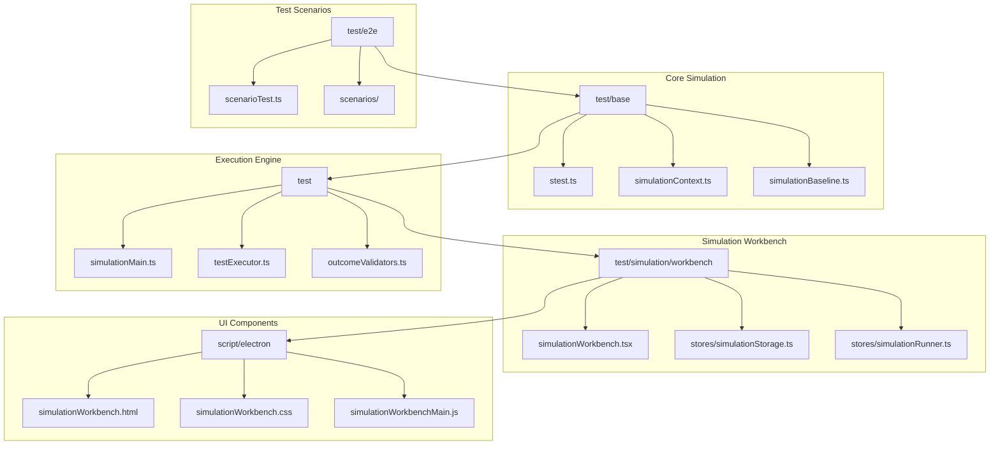
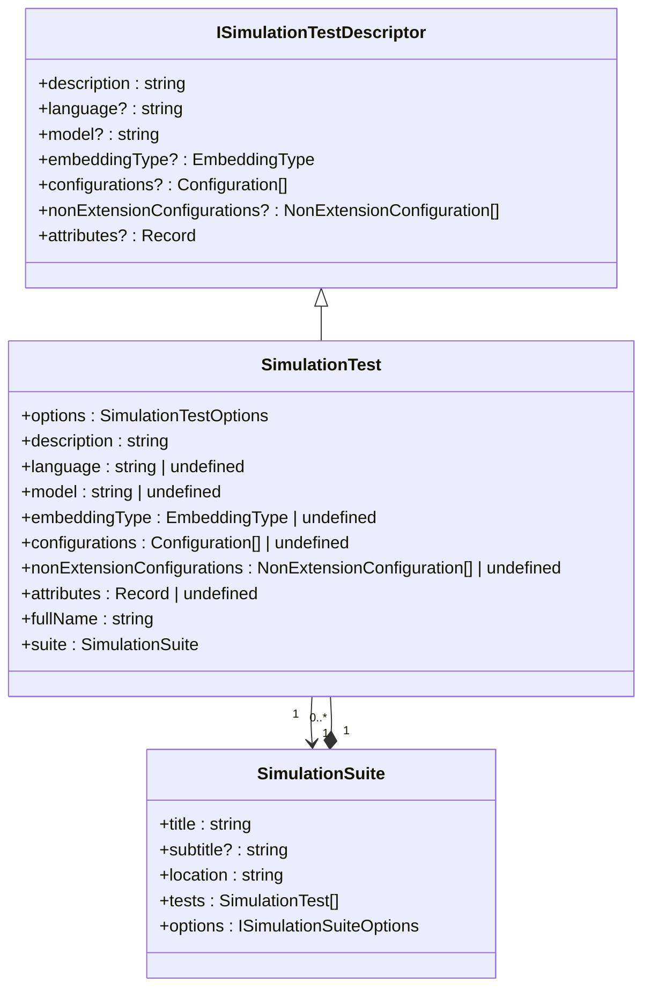
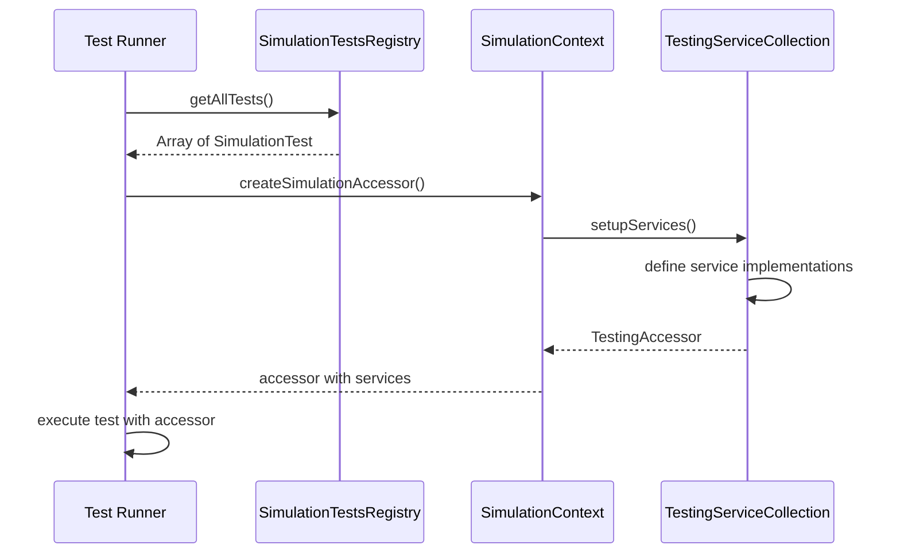
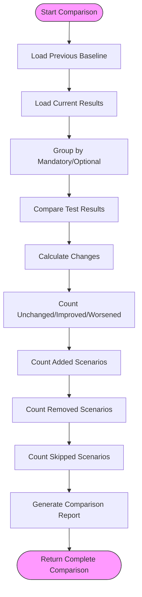
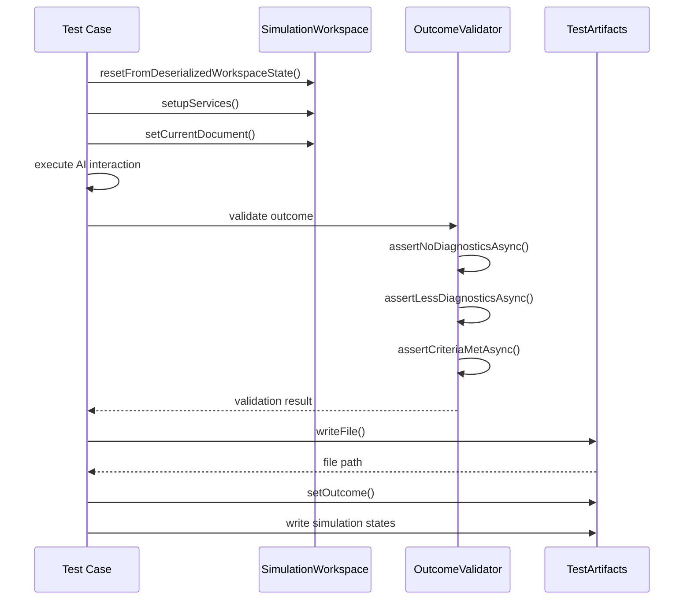
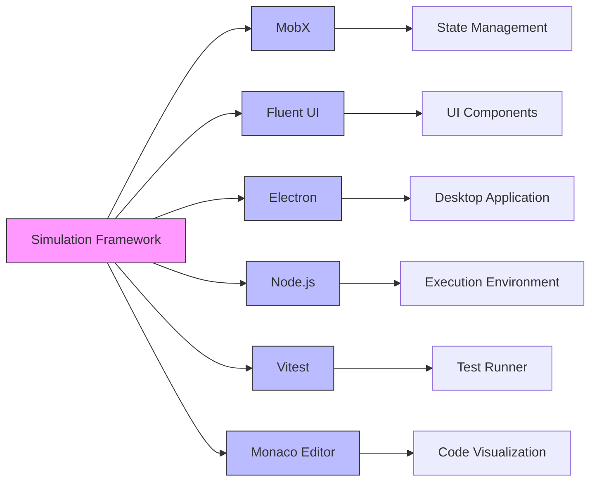

# Simulation Framework

<cite>
**Referenced Files in This Document**   
- [stest.ts](file://test/base/stest.ts)
- [simulationContext.ts](file://test/base/simulationContext.ts)
- [simulationBaseline.ts](file://test/base/simulationBaseline.ts)
- [simulationWorkbench.tsx](file://test/simulation/workbench/simulationWorkbench.tsx)
- [simulationStorage.ts](file://test/simulation/workbench/stores/simulationStorage.ts)
- [simulationRunner.ts](file://test/simulation/workbench/stores/simulationRunner.ts)
- [simulationMain.ts](file://test/simulationMain.ts)
- [testExecutor.ts](file://test/testExecutor.ts)
- [outcomeValidators.ts](file://test/simulation/outcomeValidators.ts)
- [testSnapshot.ts](file://test/simulation/testSnapshot.ts)
- [simulationWorkbench.html](file://script/electron/simulationWorkbench.html)
- [simulationWorkbench.css](file://script/electron/simulationWorkbench.css)
- [simulationWorkbenchMain.js](file://script/electron/simulationWorkbenchMain.js)
- [simulationTestProvider.ts](file://test/simulation/simulationTestProvider.ts)
- [types.ts](file://test/simulation/types.ts)
- [sharedTypes.ts](file://test/simulation/shared/sharedTypes.ts)
- [stestUtil.ts](file://test/simulation/stestUtil.ts)
- [testInformation.ts](file://test/simulation/testInformation.ts)
- [inlineChatSimulator.ts](file://test/simulation/inlineChatSimulator.ts)
- [codeMapper.stest.ts](file://test/codeMapper/codeMapper.stest.ts)
- [scenarioTest.ts](file://test/e2e/scenarioTest.ts)
</cite>

## Table of Contents
1. [Introduction](#introduction)
2. [Project Structure](#project-structure)
3. [Core Components](#core-components)
4. [Architecture Overview](#architecture-overview)
5. [Detailed Component Analysis](#detailed-component-analysis)
6. [Dependency Analysis](#dependency-analysis)
7. [Performance Considerations](#performance-considerations)
8. [Troubleshooting Guide](#troubleshooting-guide)
9. [Conclusion](#conclusion)

## Introduction
The simulation framework in the vscode-copilot-chat extension provides a comprehensive system for testing AI capabilities through reproducible scenarios. This framework enables developers to create controlled testing environments with predefined workspace states, conversation histories, and diagnostic information to validate AI behaviors consistently across test runs. The system supports complex AI interactions such as inline editing, code mapping, and multi-step tool usage validation through a sophisticated simulation workbench UI that facilitates visualization and debugging of test results. By leveraging baseline comparisons and outcome validation, the framework ensures consistent behavior across different test executions while managing test artifacts and integrating with continuous delivery pipelines.

## Project Structure
The simulation framework is organized across multiple directories within the vscode-copilot-chat repository, with key components distributed across test, script, and src directories. The core simulation functionality resides primarily in the test directory, with specialized components in the script/electron directory for the simulation workbench UI.



**Diagram sources**
- [stest.ts](file://test/base/stest.ts)
- [simulationWorkbench.tsx](file://test/simulation/workbench/simulationWorkbench.tsx)
- [simulationMain.ts](file://test/simulationMain.ts)
- [simulationWorkbench.html](file://script/electron/simulationWorkbench.html)

**Section sources**
- [stest.ts](file://test/base/stest.ts)
- [simulationWorkbench.tsx](file://test/simulation/workbench/simulationWorkbench.tsx)
- [simulationMain.ts](file://test/simulationMain.ts)
- [simulationWorkbench.html](file://script/electron/simulationWorkbench.html)

## Core Components
The simulation framework consists of several interconnected components that work together to create a comprehensive testing environment for AI capabilities. The core components include the simulation test registry, context management system, baseline comparison engine, and outcome validation system. These components enable the creation of reproducible test scenarios with predefined workspace states and conversation histories. The framework uses a service-based architecture where different components are registered and accessed through dependency injection, allowing for flexible configuration and extension of testing capabilities. The simulation context provides access to logging, file operations, and test outcome recording, while the baseline system enables comparison of current test results against historical performance metrics.

**Section sources**
- [stest.ts](file://test/base/stest.ts)
- [simulationContext.ts](file://test/base/simulationContext.ts)
- [simulationBaseline.ts](file://test/base/simulationBaseline.ts)
- [outcomeValidators.ts](file://test/simulation/outcomeValidators.ts)

## Architecture Overview
The simulation framework follows a layered architecture with clear separation between test definition, execution, and visualization components. At the core is the simulation test registry that manages test suites and individual test cases, providing filtering and execution capabilities. The execution engine processes test scenarios through a series of orchestrated steps, applying predefined workspace states and capturing AI responses. The outcome validation system verifies test results against expected outcomes using various assertion methods. The simulation workbench provides a UI layer for visualizing test results, comparing against baselines, and debugging failures. Communication between components occurs through well-defined interfaces and events, with the Electron-based workbench UI communicating with the Node.js execution engine via IPC.

```mermaid
graph TD
A[Test Definition] --> B[Test Execution]
B --> C[Outcome Validation]
C --> D[Baseline Comparison]
D --> E[Result Visualization]
A --> |stest API| B
B --> |SimulationContext| C
C --> |TestOutcome| D
D --> |ComparisonResult| E
F[Workspace State] --> B
G[Conversation History] --> B
H[Diagnostic Information] --> B
I[Simulation Workbench UI] < --> |IPC| J[Execution Engine]
J --> |File System| K[Test Artifacts]
style A fill:#f9f,stroke:#333
style B fill:#bbf,stroke:#333
style C fill:#f96,stroke:#333
style D fill:#6f9,stroke:#333
style E fill:#9f9,stroke:#333
```

**Diagram sources**
- [stest.ts](file://test/base/stest.ts)
- [simulationContext.ts](file://test/base/simulationContext.ts)
- [simulationBaseline.ts](file://test/base/simulationBaseline.ts)
- [simulationWorkbench.tsx](file://test/simulation/workbench/simulationWorkbench.tsx)
- [simulationMain.js](file://script/electron/simulationWorkbenchMain.js)

## Detailed Component Analysis

### Simulation Test Framework
The simulation test framework provides the foundation for defining and executing AI capability tests through a structured API. The framework uses a registry pattern to manage test suites and individual test cases, allowing for organized grouping and filtering of tests based on various criteria.

#### Test Definition and Registration


**Diagram sources**
- [stest.ts](file://test/base/stest.ts#L77-L512)

**Section sources**
- [stest.ts](file://test/base/stest.ts#L77-L512)

### Simulation Context Management
The simulation context system manages the state and services required for test execution, providing a consistent environment across test runs. This includes workspace state, configuration settings, and service dependencies.

#### Context Creation and Service Configuration


**Diagram sources**
- [stest.ts](file://test/base/stest.ts#L319-L410)
- [simulationContext.ts](file://test/base/simulationContext.ts#L192-L215)

**Section sources**
- [stest.ts](file://test/base/stest.ts#L319-L410)
- [simulationContext.ts](file://test/base/simulationContext.ts#L192-L215)

### Baseline Comparison System
The baseline comparison system enables consistent validation of AI behavior by comparing current test results against historical performance metrics. This system tracks test outcomes over time and identifies improvements, regressions, or unchanged behavior.

#### Baseline Comparison Logic


**Diagram sources**
- [simulationBaseline.ts](file://test/base/simulationBaseline.ts#L74-L233)

**Section sources**
- [simulationBaseline.ts](file://test/base/simulationBaseline.ts#L74-L233)

### Simulation Workbench UI
The simulation workbench provides a comprehensive user interface for visualizing and debugging test results. Built using Electron, the workbench combines a React-based frontend with a Node.js backend to deliver an interactive testing experience.

#### Workbench Architecture
```mermaid
graph TB
subgraph "Frontend (Electron Renderer)"
A[SimulationWorkbench.tsx] --> B[Stores]
B --> C[SimulationStorage]
B --> D[SimulationRunner]
B --> E[SimulationTestsProvider]
A --> F[Components]
F --> G[TestList]
F --> H[TestView]
F --> I[App]
end
subgraph "Backend (Electron Main)"
J[simulationWorkbenchMain.js] --> K[IPC Handlers]
K --> L[spawnProcess]
K --> M[killProcess]
K --> N[open-link]
K --> O[processArgv]
end
subgraph "Execution Engine"
P[simulationMain.ts] --> Q[Test Execution]
Q --> R[Result Collection]
end
A < --> |HTTP/IPC| J
J < --> |Child Process| P
style A fill:#f9f,stroke:#333
style J fill:#bbf,stroke:#333
style P fill:#6f9,stroke:#333
```

**Diagram sources**
- [simulationWorkbench.tsx](file://test/simulation/workbench/simulationWorkbench.tsx#L23-L44)
- [simulationWorkbenchMain.js](file://script/electron/simulationWorkbenchMain.js#L64-L106)
- [simulationMain.ts](file://test/simulationMain.ts#L288-L331)

**Section sources**
- [simulationWorkbench.tsx](file://test/simulation/workbench/simulationWorkbench.tsx#L23-L44)
- [simulationWorkbenchMain.js](file://script/electron/simulationWorkbenchMain.js#L64-L106)
- [simulationMain.ts](file://test/simulationMain.ts#L288-L331)

### Outcome Validation and Test Artifacts
The outcome validation system ensures that AI responses meet expected criteria through various assertion methods and validation techniques. This system also manages test artifacts, storing results for later analysis and comparison.

#### Outcome Validation Process


**Diagram sources**
- [scenarioTest.ts](file://test/e2e/scenarioTest.ts#L64-L73)
- [outcomeValidators.ts](file://test/simulation/outcomeValidators.ts#L65-L76)
- [stestUtil.ts](file://test/simulation/stestUtil.ts#L422-L458)

**Section sources**
- [scenarioTest.ts](file://test/e2e/scenarioTest.ts#L64-L73)
- [outcomeValidators.ts](file://test/simulation/outcomeValidators.ts#L65-L76)
- [stestUtil.ts](file://test/simulation/stestUtil.ts#L422-L458)

## Dependency Analysis
The simulation framework has a well-defined dependency structure with clear boundaries between components. The core dependencies include testing utilities, workspace simulation services, and visualization libraries.



**Diagram sources**
- [package.json](file://package.json)
- [simulationWorkbench.tsx](file://test/simulation/workbench/simulationWorkbench.tsx)
- [simulationWorkbenchMain.js](file://script/electron/simulationWorkbenchMain.js)

**Section sources**
- [package.json](file://package.json)
- [simulationWorkbench.tsx](file://test/simulation/workbench/simulationWorkbench.tsx)
- [simulationWorkbenchMain.js](file://script/electron/simulationWorkbenchMain.js)

## Performance Considerations
The simulation framework incorporates several performance optimizations to handle the computational demands of AI testing. These include caching mechanisms for expensive operations, parallel test execution, and efficient state management. The framework supports configurable test repetition through the nRuns parameter, allowing for statistical analysis of AI behavior consistency. Cache management options enable developers to control whether to use cached results, regenerate caches, or require cache hits, providing flexibility for different testing scenarios. The workbench UI implements virtualized rendering for large test result sets, ensuring responsive performance even with extensive test suites.

## Troubleshooting Guide
When encountering issues with the simulation framework, consider the following common problems and solutions:

1. **Test failures due to cache misses**: Verify cache configuration settings and ensure required cache layers are available. Use the --regenerate-cache flag to refresh cached data.

2. **Baseline comparison discrepancies**: Check that the same test parameters (model, language, configuration) are used when comparing against baselines. Verify that the baseline.json file is up to date.

3. **Simulation workbench UI not responding**: Ensure the Electron application has proper permissions and that the Node.js execution engine is running. Check the developer console for JavaScript errors.

4. **Authentication issues during testing**: Configure proper authentication tokens and verify endpoint access. Use the device code callback mechanism for interactive authentication when needed.

5. **Performance bottlenecks in test execution**: Adjust the parallelism settings and consider running subsets of tests. Monitor memory usage and heap snapshots to identify potential leaks.

**Section sources**
- [simulationMain.ts](file://test/simulationMain.ts#L288-L331)
- [testExecutor.ts](file://test/testExecutor.ts#L200-L231)
- [simulationWorkbenchMain.js](file://script/electron/simulationWorkbenchMain.js#L77-L103)

## Conclusion
The simulation framework in the vscode-copilot-chat extension provides a robust and comprehensive system for testing AI capabilities through reproducible scenarios. By combining a flexible test definition API, sophisticated context management, and a powerful visualization workbench, the framework enables thorough validation of AI behaviors across various scenarios. The integration of baseline comparisons and outcome validation ensures consistent behavior across test runs, while the management of test artifacts facilitates long-term analysis and improvement. The framework's architecture supports complex AI interactions such as inline editing, code mapping, and multi-step tool usage validation, making it an essential tool for developing and maintaining high-quality AI features in the extension.