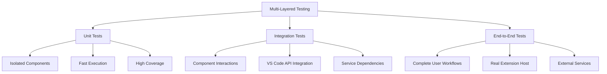
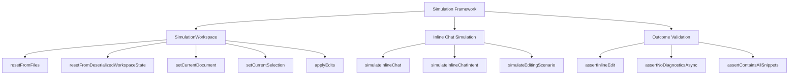
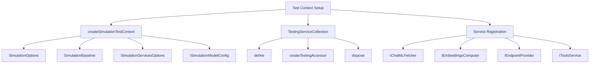
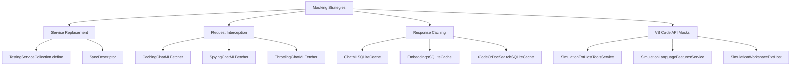
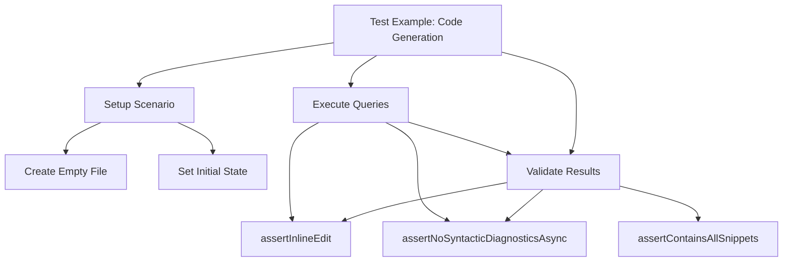
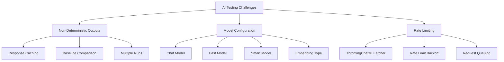
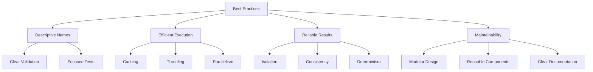
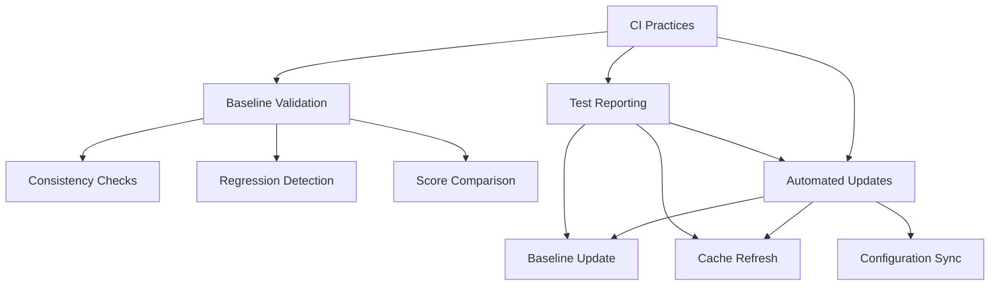

# Testing Framework

<cite>
**Referenced Files in This Document**   
- [simulationMain.ts](file://test/simulationMain.ts)
- [testExecutor.ts](file://test/testExecutor.ts)
- [stest.ts](file://test/base/stest.ts)
- [simulationContext.ts](file://test/base/simulationContext.ts)
- [simulationOptions.ts](file://test/base/simulationOptions.ts)
- [cachingChatMLFetcher.ts](file://test/base/cachingChatMLFetcher.ts)
- [throttlingChatMLFetcher.ts](file://test/base/throttlingChatMLFetcher.ts)
- [simulationTestProvider.ts](file://test/simulation/simulationTestProvider.ts)
- [inlineChatSimulator.ts](file://test/simulation/inlineChatSimulator.ts)
- [outcomeValidators.ts](file://test/simulation/outcomeValidators.ts)
- [inlineGenerateCode.stest.ts](file://test/inline/inlineGenerateCode.stest.ts)
- [extHostContext/simulationExtHostContext.ts](file://test/base/extHostContext/simulationExtHostContext.ts)
- [extHostContext/simulationWorkspaceExtHost.ts](file://test/base/extHostContext/simulationWorkspaceExtHost.ts)
- [simulationTests.ts](file://test/simulationTests.ts)
</cite>

## Table of Contents
1. [Introduction](#introduction)
2. [Test Organization and Structure](#test-organization-and-structure)
3. [Multi-Layered Testing Approach](#multi-layered-testing-approach)
4. [Simulation Framework for AI-Powered Features](#simulation-framework-for-ai-powered-features)
5. [Setup Patterns and Test Context](#setup-patterns-and-test-context)
6. [Mocking Strategies for VS Code APIs and External Services](#mocking-strategies-for-vs-code-apis-and-external-services)
7. [Practical Test Examples](#practical-test-examples)
8. [Testing Challenges for AI-Powered Extensions](#testing-challenges-for-ai-powered-extensions)
9. [Best Practices and Guidelines](#best-practices-and-guidelines)
10. [Continuous Integration Practices](#continuous-integration-practices)

## Introduction
The vscode-copilot-chat extension employs a comprehensive testing framework designed to validate its AI-powered features across multiple layers. This framework supports unit tests, integration tests, and end-to-end tests, with a particular focus on simulating real-world scenarios in a controlled environment. The testing infrastructure is built around a simulation framework that enables deterministic testing of non-deterministic AI behaviors by leveraging caching, throttling, and mocking strategies. The framework is designed to test key features such as chat interactions, code generation, and tool execution, while addressing the unique challenges of testing AI-powered extensions, including non-deterministic outputs and managing test data for AI models.

## Test Organization and Structure

The testing framework is organized into a hierarchical structure that categorizes tests by their scope and functionality. The primary organizational unit is the `SimulationSuite`, which groups related tests together based on their purpose, such as "generate", "fix", or "explain". Each suite contains multiple `SimulationTest` instances that represent individual test cases. Tests are further categorized by their location (inline, panel, or external) and programming language.

The framework uses a declarative approach to test registration through the `ssuite` and `stest` functions, which allow for easy organization and filtering of tests. The `simulationTests.ts` file serves as the entry point for the test suite, importing and registering all individual test files. This modular structure enables selective execution of tests based on various criteria, such as grep patterns or specific test files.

```mermaid
graph TD
A[Test Suite Organization] --> B[SimulationSuite]
B --> C[title: string]
B --> D[subtitle: string]
B --> E[location: 'inline' | 'panel' | 'external']
B --> F[language: string]
B --> G[tests: SimulationTest[]]
A --> H[SimulationTest]
H --> I[description: string]
H --> J[language: string]
H --> K[model: string]
H --> L[embeddingType: EmbeddingType]
H --> M[configurations: Configuration[]]
H --> N[nonExtensionConfigurations: NonExtensionConfiguration[]]
H --> O[attributes: Record<string, string | number>]
H --> P[options: ISimulationTestOptions]
H --> Q[runner: SimulationTestFunction]
```

**Diagram sources**
- [stest.ts](file://test/base/stest.ts#L212-L252)
- [stest.ts](file://test/base/stest.ts#L117-L136)

**Section sources**
- [stest.ts](file://test/base/stest.ts#L212-L287)
- [stest.ts](file://test/base/stest.ts#L117-L146)
- [simulationTests.ts](file://test/simulationTests.ts#L1-L62)

## Multi-Layered Testing Approach

The testing framework implements a multi-layered approach that includes unit tests, integration tests, and end-to-end tests, each serving a specific purpose in the validation process. Unit tests focus on isolated components and functions, ensuring that individual units of code work as expected. Integration tests verify the interaction between different components, particularly the integration between the extension and VS Code APIs. End-to-end tests simulate complete user workflows, testing the entire system from user input to final output.

The framework supports running tests in different modes, including local simulation and real extension host execution. The `inExtensionHost` flag in `SimulationOptions` determines whether tests run in a simulated environment or within a real VS Code extension host. This flexibility allows for both fast, isolated testing and comprehensive integration testing.



**Diagram sources**
- [simulationMain.ts](file://test/simulationMain.ts#L128-L199)
- [testExecutor.ts](file://test/testExecutor.ts#L136-L153)

**Section sources**
- [simulationMain.ts](file://test/simulationMain.ts#L128-L199)
- [testExecutor.ts](file://test/testExecutor.ts#L136-L153)
- [simulationOptions.ts](file://test/base/simulationOptions.ts#L72-L75)

## Simulation Framework for AI-Powered Features

The simulation framework is designed to enable testing of AI-powered features in controlled environments by providing a comprehensive set of tools for simulating user interactions, AI responses, and system behaviors. The core of the framework is the `simulateInlineChat` function, which simulates the entire inline chat workflow, from user query to AI response and code modification.

The framework uses a simulation workspace that mimics the VS Code workspace, allowing tests to create, modify, and interact with files and notebooks. The `SimulationWorkspace` class provides methods for setting up the workspace state, managing documents, and applying edits. This simulated environment enables deterministic testing of AI behaviors by controlling the input context and verifying the output results.



**Diagram sources**
- [inlineChatSimulator.ts](file://test/simulation/inlineChatSimulator.ts#L89-L106)
- [inlineChatSimulator.ts](file://test/simulation/inlineChatSimulator.ts#L190-L203)
- [outcomeValidators.ts](file://test/simulation/outcomeValidators.ts#L65-L75)

**Section sources**
- [inlineChatSimulator.ts](file://test/simulation/inlineChatSimulator.ts#L89-L106)
- [inlineChatSimulator.ts](file://test/simulation/inlineChatSimulator.ts#L190-L203)
- [outcomeValidators.ts](file://test/simulation/outcomeValidators.ts#L65-L75)

## Setup Patterns and Test Context

The testing framework employs consistent setup patterns to ensure that tests run in a predictable and isolated environment. Each test is executed within a `SimulationTestContext` that provides access to various services and utilities needed for testing. The context is created using the `createSimulationTestContext` function, which initializes the necessary services and configurations based on the test options.

The framework uses a service collection pattern to manage dependencies and provide mock implementations of external services. The `TestingServiceCollection` class allows for the registration of mock services that replace real implementations during testing. This pattern enables fine-grained control over the test environment and facilitates the mocking of VS Code APIs and external services.



**Diagram sources**
- [simulationMain.ts](file://test/simulationMain.ts#L534-L608)
- [testExecutor.ts](file://test/testExecutor.ts#L372-L430)

**Section sources**
- [simulationMain.ts](file://test/simulationMain.ts#L534-L608)
- [testExecutor.ts](file://test/testExecutor.ts#L372-L430)

## Mocking Strategies for VS Code APIs and External Services

The testing framework employs sophisticated mocking strategies to isolate the extension code from external dependencies and VS Code APIs. The framework uses a combination of service replacement, request interception, and response caching to create a controlled testing environment. The `CachingChatMLFetcher` class intercepts chat requests and either returns cached responses or forwards them to the real endpoint, depending on the test configuration.

For VS Code APIs, the framework provides mock implementations through the `SimulationExtHostToolsService` and other simulation services. These mocks allow tests to simulate user interactions, document changes, and other VS Code events without requiring a real VS Code instance. The framework also supports running tests in a real extension host by selectively replacing only specific services with mocks.



**Diagram sources**
- [cachingChatMLFetcher.ts](file://test/base/cachingChatMLFetcher.ts#L106-L257)
- [extHostContext/simulationExtHostContext.ts](file://test/base/extHostContext/simulationExtHostContext.ts#L34-L46)
- [extHostContext/simulationWorkspaceExtHost.ts](file://test/base/extHostContext/simulationWorkspaceExtHost.ts#L15-L36)

**Section sources**
- [cachingChatMLFetcher.ts](file://test/base/cachingChatMLFetcher.ts#L106-L257)
- [extHostContext/simulationExtHostContext.ts](file://test/base/extHostContext/simulationExtHostContext.ts#L34-L46)
- [extHostContext/simulationWorkspaceExtHost.ts](file://test/base/extHostContext/simulationWorkspaceExtHost.ts#L15-L36)

## Practical Test Examples

The testing framework includes numerous practical examples that demonstrate how to test key features of the vscode-copilot-chat extension. These examples cover a wide range of scenarios, from simple code generation to complex multi-file edits and tool execution. The tests are designed to be readable and maintainable, using descriptive names and clear validation logic.

One common pattern is the use of scenario-based testing, where a series of related queries are executed in sequence to simulate a complete user workflow. For example, the `inlineGenerateCode.stest.ts` file contains tests that simulate generating a function, modifying it, and adding documentation in a single workflow. These tests use the `simulateInlineChat` function to execute each query and validate the results using assertion functions.



**Diagram sources**
- [inlineGenerateCode.stest.ts](file://test/inline/inlineGenerateCode.stest.ts#L41-L87)
- [outcomeValidators.ts](file://test/simulation/outcomeValidators.ts#L23-L27)

**Section sources**
- [inlineGenerateCode.stest.ts](file://test/inline/inlineGenerateCode.stest.ts#L41-L87)
- [outcomeValidators.ts](file://test/simulation/outcomeValidators.ts#L23-L27)

## Testing Challenges for AI-Powered Extensions

Testing AI-powered extensions presents unique challenges that require specialized approaches and tools. One of the primary challenges is the non-deterministic nature of AI outputs, which can vary between runs even with identical inputs. The testing framework addresses this challenge through response caching, where AI responses are stored and reused in subsequent test runs to ensure consistency.

Another challenge is managing test data for AI models, particularly when testing different models or configurations. The framework supports model configuration through the `ISimulationModelConfig` interface, which allows tests to specify the chat model, fast model, smart model, and embedding type. This flexibility enables comprehensive testing across different AI models and configurations.



**Diagram sources**
- [simulationMain.ts](file://test/simulationMain.ts#L252-L263)
- [throttlingChatMLFetcher.ts](file://test/base/throttlingChatMLFetcher.ts#L23-L159)

**Section sources**
- [simulationMain.ts](file://test/simulationMain.ts#L252-L263)
- [throttlingChatMLFetcher.ts](file://test/base/throttlingChatMLFetcher.ts#L23-L159)

## Best Practices and Guidelines

The testing framework follows several best practices and guidelines to ensure high-quality, maintainable tests. One key practice is the use of descriptive test names and clear validation logic, which makes tests easy to understand and maintain. Tests should focus on specific behaviors and use targeted assertions to verify the expected outcomes.

Another important guideline is the use of caching and throttling to optimize test performance and avoid rate limiting. The framework provides options to disable caching for testing prompt changes, require caching for baseline updates, and throttle requests to avoid overwhelming external services. Tests should be designed to run efficiently and reliably, minimizing dependencies on external factors.



**Diagram sources**
- [simulationOptions.ts](file://test/base/simulationOptions.ts#L38-L41)
- [testExecutor.ts](file://test/testExecutor.ts#L160-L163)

**Section sources**
- [simulationOptions.ts](file://test/base/simulationOptions.ts#L38-L41)
- [testExecutor.ts](file://test/testExecutor.ts#L160-L163)

## Continuous Integration Practices

The testing framework integrates with continuous integration (CI) systems to ensure code quality and prevent regressions. The framework includes CI-specific options and validation rules that enforce test coverage requirements and baseline consistency. When running in CI mode, the framework performs additional checks to ensure that test results are consistent with the baseline and that no regressions have been introduced.

The CI process includes steps for updating the baseline, validating changes, and generating test reports. The framework supports generating CSV scorecards and JSON reports that can be used for analysis and visualization. These reports provide detailed information about test results, including pass/fail status, execution time, and usage statistics.



**Diagram sources**
- [simulationMain.ts](file://test/simulationMain.ts#L388-L394)
- [testExecutor.ts](file://test/testExecutor.ts#L342-L344)

**Section sources**
- [simulationMain.ts](file://test/simulationMain.ts#L388-L394)
- [testExecutor.ts](file://test/testExecutor.ts#L342-L344)