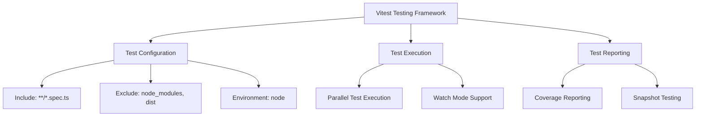
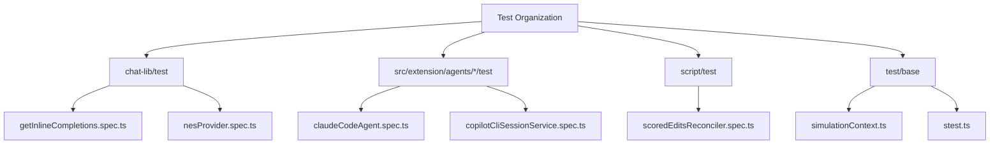
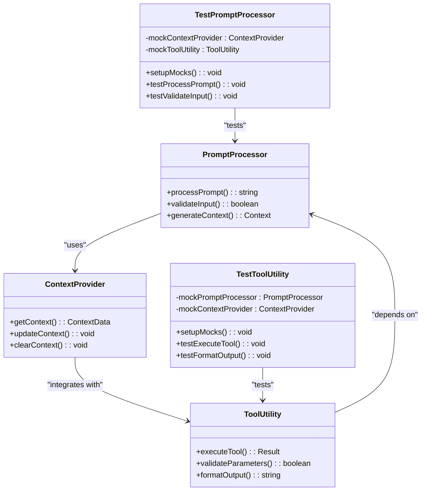
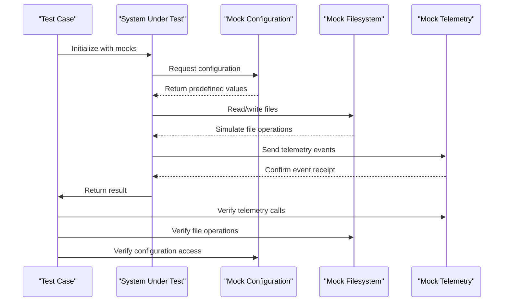
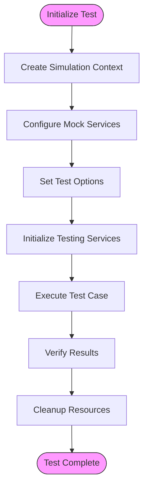
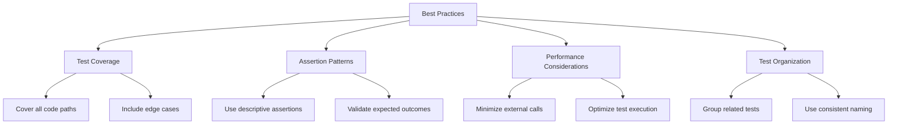
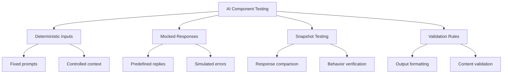
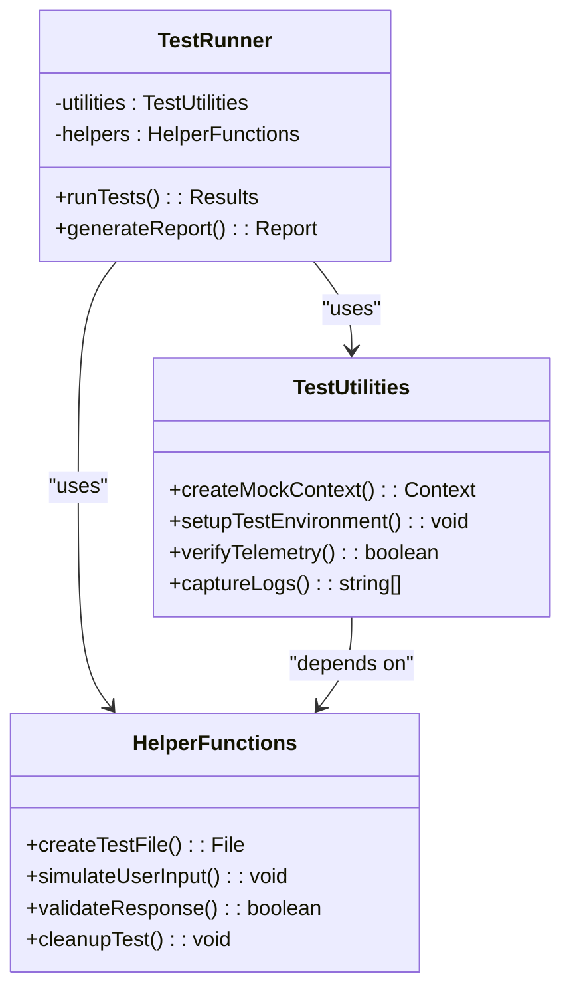

# Unit Testing

<cite>
**Referenced Files in This Document**   
- [vitest.config.ts](file://chat-lib/vitest.config.ts)
- [getInlineCompletions.spec.ts](file://chat-lib/test/getInlineCompletions.spec.ts)
- [nesProvider.spec.ts](file://chat-lib/test/nesProvider.spec.ts)
- [simpleExperimentationService.spec.ts](file://chat-lib/test/simpleExperimentationService.spec.ts)
- [simulationContext.ts](file://test/base/simulationContext.ts)
- [stest.ts](file://test/base/stest.ts)
- [services.ts](file://src/platform/test/node/services.ts)
- [scoredEditsReconciler.spec.ts](file://script/test/scoredEditsReconciler.spec.ts)
- [editFromPatchTests.ts](file://script/testGeneration/editFromPatchTests.ts)
</cite>

## Table of Contents
1. [Introduction](#introduction)
2. [Testing Framework Overview](#testing-framework-overview)
3. [Test Structure and Organization](#test-structure-and-organization)
4. [Testing Isolated Components](#testing-isolated-components)
5. [Mocking Strategies](#mocking-strategies)
6. [Test Environment Setup](#test-environment-setup)
7. [Best Practices for Unit Testing](#best-practices-for-unit-testing)
8. [Testing AI-Related Components](#testing-ai-related-components)
9. [Test Utilities and Helper Functions](#test-utilities-and-helper-functions)
10. [Conclusion](#conclusion)

## Introduction
The vscode-copilot-chat extension employs a comprehensive unit testing framework to ensure the reliability and correctness of its AI-powered features. This documentation provides an in-depth analysis of the testing infrastructure, focusing on the use of Vitest as the primary testing framework and detailing the patterns and practices used throughout the codebase. The testing strategy emphasizes isolation, determinism, and comprehensive coverage to validate the complex interactions between AI models, VS Code APIs, and user workflows.

## Testing Framework Overview

The vscode-copilot-chat extension utilizes Vitest as its primary testing framework, providing a modern and efficient environment for unit testing. The framework configuration is defined in the vitest.config.ts file, which specifies the test environment, file inclusion patterns, and global settings.

**Diagram sources**
- [vitest.config.ts](file://chat-lib/vitest.config.ts)

**Section sources**
- [vitest.config.ts](file://chat-lib/vitest.config.ts)

## Test Structure and Organization

The test files in the vscode-copilot-chat extension follow a consistent naming convention, using the .spec.ts suffix to identify test files. Tests are organized across multiple directories, with unit tests primarily located in test directories adjacent to their corresponding source files. The codebase contains various types of tests, including unit tests for isolated components and integration tests for complex workflows.

**Diagram sources**
- [getInlineCompletions.spec.ts](file://chat-lib/test/getInlineCompletions.spec.ts)
- [nesProvider.spec.ts](file://chat-lib/test/nesProvider.spec.ts)
- [scoredEditsReconciler.spec.ts](file://script/test/scoredEditsReconciler.spec.ts)
- [simulationContext.ts](file://test/base/simulationContext.ts)

**Section sources**
- [getInlineCompletions.spec.ts](file://chat-lib/test/getInlineCompletions.spec.ts)
- [nesProvider.spec.ts](file://chat-lib/test/nesProvider.spec.ts)
- [scoredEditsReconciler.spec.ts](file://script/test/scoredEditsReconciler.spec.ts)
- [editFromPatchTests.ts](file://script/testGeneration/editFromPatchTests.ts)

## Testing Isolated Components

The extension employs a modular approach to testing isolated components such as prompt processors, tool utilities, and context providers. Each component is tested in isolation with mocked dependencies to ensure focused and deterministic tests. The testing strategy emphasizes testing individual units of functionality without relying on external services or complex state.

**Diagram sources**
- [getInlineCompletions.spec.ts](file://chat-lib/test/getInlineCompletions.spec.ts)
- [nesProvider.spec.ts](file://chat-lib/test/nesProvider.spec.ts)

**Section sources**
- [getInlineCompletions.spec.ts](file://chat-lib/test/getInlineCompletions.spec.ts)
- [nesProvider.spec.ts](file://chat-lib/test/nesProvider.spec.ts)
- [simpleExperimentationService.spec.ts](file://chat-lib/test/simpleExperimentationService.spec.ts)

## Mocking Strategies

The testing framework employs comprehensive mocking strategies to isolate components and simulate various scenarios. Services such as configuration, filesystem, and telemetry are mocked to prevent external dependencies and enable controlled testing environments. The codebase uses Vitest's built-in mocking capabilities along with custom mock implementations to provide realistic test scenarios.

**Diagram sources**
- [getInlineCompletions.spec.ts](file://chat-lib/test/getInlineCompletions.spec.ts)
- [services.ts](file://src/platform/test/node/services.ts)

**Section sources**
- [getInlineCompletions.spec.ts](file://chat-lib/test/getInlineCompletions.spec.ts)
- [services.ts](file://src/platform/test/node/services.ts)

## Test Environment Setup

The test environment is configured using simulation context and extension context to provide a realistic testing environment while maintaining isolation. The simulationContext.ts file defines the infrastructure for creating test contexts with configurable services and dependencies. This approach allows tests to run in a controlled environment that simulates the actual extension runtime.

**Diagram sources**
- [simulationContext.ts](file://test/base/simulationContext.ts)
- [stest.ts](file://test/base/stest.ts)

**Section sources**
- [simulationContext.ts](file://test/base/simulationContext.ts)
- [stest.ts](file://test/base/stest.ts)

## Best Practices for Unit Testing

The vscode-copilot-chat extension follows several best practices for writing effective unit tests. These include maintaining high test coverage, using clear assertion patterns, and considering performance implications. Tests are designed to be deterministic, fast, and independent, ensuring reliable and efficient test execution.

**Diagram sources**
- [getInlineCompletions.spec.ts](file://chat-lib/test/getInlineCompletions.spec.ts)
- [nesProvider.spec.ts](file://chat-lib/test/nesProvider.spec.ts)

**Section sources**
- [getInlineCompletions.spec.ts](file://chat-lib/test/getInlineCompletions.spec.ts)
- [nesProvider.spec.ts](file://chat-lib/test/nesProvider.spec.ts)
- [simpleExperimentationService.spec.ts](file://chat-lib/test/simpleExperimentationService.spec.ts)

## Testing AI-Related Components

Testing AI-related components presents unique challenges due to their probabilistic nature and dependence on external models. The extension addresses these challenges by using deterministic inputs and outputs, mocking AI service responses, and employing snapshot testing to validate consistent behavior. This approach ensures that AI components can be tested reliably despite their inherent variability.

**Diagram sources**
- [getInlineCompletions.spec.ts](file://chat-lib/test/getInlineCompletions.spec.ts)
- [nesProvider.spec.ts](file://chat-lib/test/nesProvider.spec.ts)

**Section sources**
- [getInlineCompletions.spec.ts](file://chat-lib/test/getInlineCompletions.spec.ts)
- [nesProvider.spec.ts](file://chat-lib/test/nesProvider.spec.ts)

## Test Utilities and Helper Functions

The codebase includes a comprehensive set of test utilities and helper functions to streamline test development and maintenance. These utilities are organized in the base testing directory and provide common functionality for setting up test environments, creating mock objects, and verifying test results. The helper functions promote code reuse and consistency across tests.

**Diagram sources**
- [stest.ts](file://test/base/stest.ts)
- [services.ts](file://src/platform/test/node/services.ts)

**Section sources**
- [stest.ts](file://test/base/stest.ts)
- [services.ts](file://src/platform/test/node/services.ts)

## Conclusion
The unit testing framework for the vscode-copilot-chat extension demonstrates a comprehensive and well-structured approach to ensuring code quality and reliability. By leveraging Vitest as the primary testing framework and implementing robust testing patterns, the extension maintains high standards of software quality. The emphasis on isolated component testing, effective mocking strategies, and comprehensive test utilities enables the development team to confidently iterate on complex AI-powered features while maintaining stability and performance.