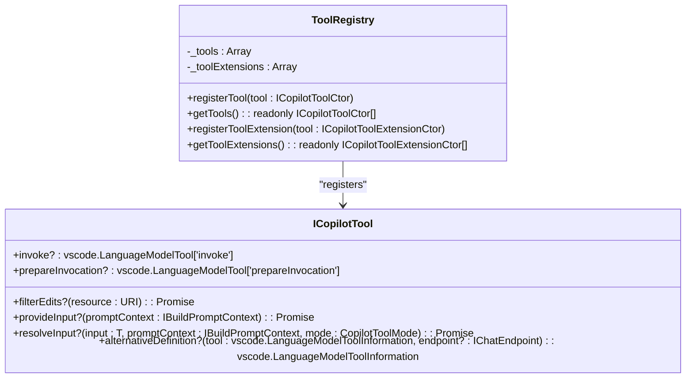
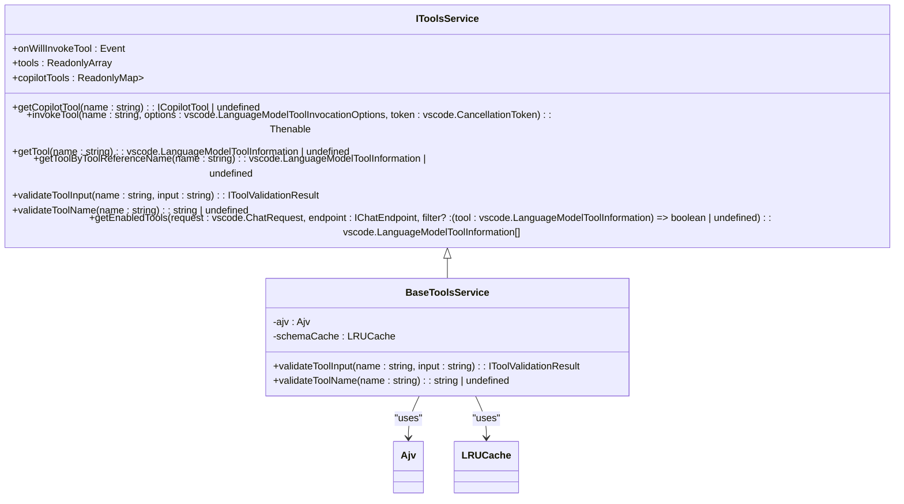
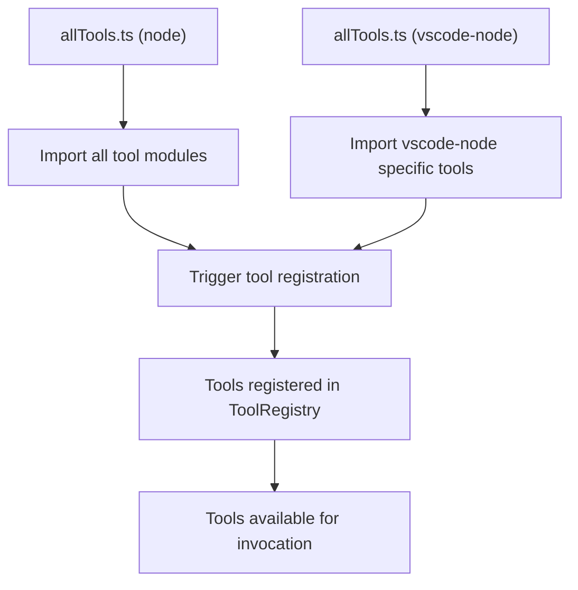
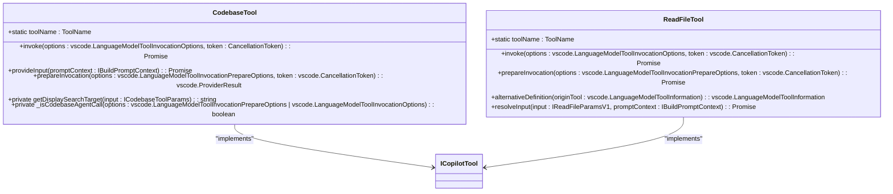
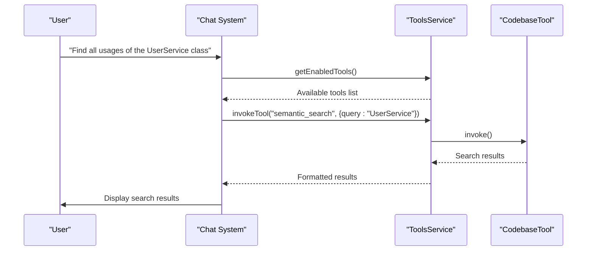
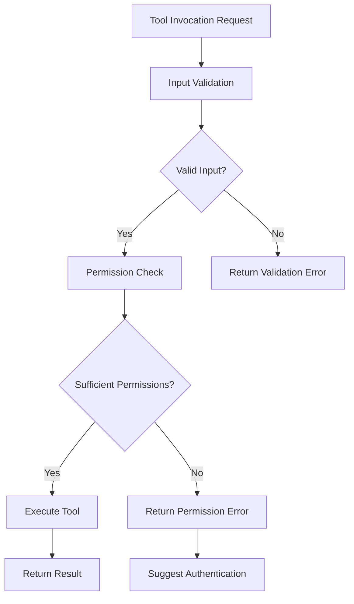
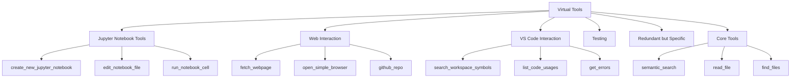
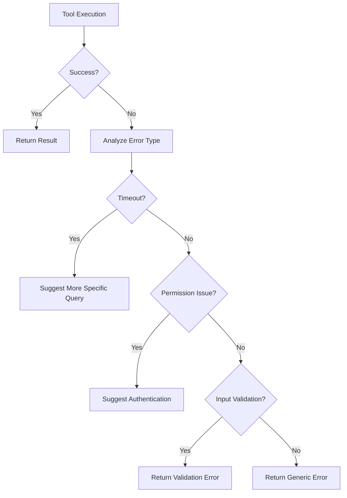

# Built-in Tools

<cite>
**Referenced Files in This Document**   
- [allTools.ts](file://src/extension/tools/node/allTools.ts)
- [allTools.ts](file://src/extension/tools/vscode-node/allTools.ts)
- [toolsRegistry.ts](file://src/extension/tools/common/toolsRegistry.ts)
- [toolsService.ts](file://src/extension/tools/common/toolsService.ts)
- [toolNames.ts](file://src/extension/tools/common/toolNames.ts)
- [codebaseTool.tsx](file://src/extension/tools/node/codebaseTool.tsx)
- [readFileTool.tsx](file://src/extension/tools/node/readFileTool.tsx)
- [findTextInFilesTool.tsx](file://src/extension/tools/node/findTextInFilesTool.tsx)
- [scmChangesTool.ts](file://src/extension/tools/node/scmChangesTool.ts)
- [virtualTool.ts](file://src/extension/tools/common/virtualTools/virtualTool.ts)
- [toolGrouping.ts](file://src/extension/tools/common/virtualTools/toolGrouping.ts)
</cite>

## Table of Contents
1. [Introduction](#introduction)
2. [Tool Categories and Functionality](#tool-categories-and-functionality)
3. [Tool Registration and Registry System](#tool-registration-and-registry-system)
4. [Implementation Patterns and Examples](#implementation-patterns-and-examples)
5. [Usage Scenarios and Parameters](#usage-scenarios-and-parameters)
6. [Security and Permissions](#security-and-permissions)
7. [Virtual Tools and Tool Grouping](#virtual-tools-and-tool-grouping)
8. [Common Issues and Error Handling](#common-issues-and-error-handling)
9. [Conclusion](#conclusion)

## Introduction
The built-in tools system in the vscode-copilot-chat extension provides a comprehensive set of capabilities that enable the AI assistant to interact with various aspects of the development environment. These tools serve as the bridge between natural language queries and concrete actions within the codebase, file system, version control, and GitHub ecosystem. The system is designed to enhance developer productivity by automating common tasks and providing intelligent assistance through a well-structured tool framework.

The tools are organized into logical categories based on their functionality, with each tool exposing a well-defined interface for invocation and parameter handling. The architecture supports both direct tool calls and more complex workflows involving multiple tool invocations. This documentation provides a detailed analysis of the tools system, covering its design, implementation, and usage patterns.

**Section sources**
- [toolNames.ts](file://src/extension/tools/common/toolNames.ts#L8-L251)

## Tool Categories and Functionality
The built-in tools are categorized into several major functional areas, each addressing specific development tasks and workflows. These categories include codebase operations, file system interactions, version control integration, and GitHub connectivity, providing comprehensive coverage of common development scenarios.

### Codebase Operations
Codebase operations tools enable semantic search and code understanding capabilities. The `CodebaseTool` (ToolName.Codebase) performs semantic search across the codebase, allowing the AI to find relevant code snippets and understand project structure. This tool can be scoped to specific directories and supports both full and partial context modes depending on the complexity of the request.

### File System Interactions
File system tools provide read and write capabilities for files and directories. Key tools in this category include:
- `ReadFileTool` (ToolName.ReadFile): Reads file contents with support for large files through offset and limit parameters
- `FindFilesTool` (ToolName.FindFiles): Searches for files matching specific patterns
- `ListDirectoryTool` (ToolName.ListDirectory): Lists directory contents
- `CreateFileTool` and `CreateDirectoryTool`: Create new files and directories

### Version Control Integration
Git integration tools enable interaction with the version control system. The `ScmChangesTool` (ToolName.GetScmChanges) retrieves information about changed files in the repository, including unstaged, staged, and merge conflicts. This allows the AI to understand the current state of the codebase and provide context-aware suggestions.

### GitHub Connectivity
GitHub tools facilitate interaction with GitHub repositories and services. The `GithubRepoTool` (ToolName.GithubRepo) enables operations related to GitHub repositories, while other tools support pull request management and code review workflows.

**Section sources**
- [toolNames.ts](file://src/extension/tools/common/toolNames.ts#L21-L251)
- [codebaseTool.tsx](file://src/extension/tools/node/codebaseTool.tsx#L30-L36)
- [readFileTool.tsx](file://src/extension/tools/node/readFileTool.tsx#L62-L66)
- [findTextInFilesTool.tsx](file://src/extension/tools/node/findTextInFilesTool.tsx#L30-L37)
- [scmChangesTool.ts](file://src/extension/tools/node/scmChangesTool.ts#L23-L26)

## Tool Registration and Registry System
The tools registry system is the central component that manages all available tools in the extension. It provides a structured way to register, discover, and invoke tools through a well-defined API.

### Tools Registry
The `ToolRegistry` class (defined in toolsRegistry.ts) serves as the central registry for all tools. It maintains two collections:
- `_tools`: Array of tool constructors that implement `ICopilotTool`
- `_toolExtensions`: Array of tool extension constructors that implement `ICopilotToolExtension`

Tools are registered using the `registerTool` method, which adds the tool constructor to the registry. The registry provides methods to retrieve all registered tools and extensions.



**Diagram sources**
- [toolsRegistry.ts](file://src/extension/tools/common/toolsRegistry.ts#L86-L105)

### Tools Service
The `IToolsService` interface provides the main API for interacting with tools. It offers methods to:
- Retrieve available tools
- Invoke tools by name
- Validate tool inputs
- Get enabled tools for a specific request

The service handles tool invocation, input validation, and error handling, serving as the primary interface between the chat system and the underlying tools.



**Diagram sources**
- [toolsService.ts](file://src/extension/tools/common/toolsService.ts#L47-L80)

## Implementation Patterns and Examples
The tools system follows consistent implementation patterns across different tool types, ensuring maintainability and predictability in behavior.

### AllTools.ts Aggregation
The `allTools.ts` files in both the node and vscode-node directories serve as aggregation points that import all tool implementations. This pattern ensures that all tools are registered when the module is loaded.



**Diagram sources**
- [allTools.ts](file://src/extension/tools/node/allTools.ts#L6-L41)
- [allTools.ts](file://src/extension/tools/vscode-node/allTools.ts#L8)

### Tool Implementation Structure
Each tool follows a consistent class structure with standardized methods:



**Diagram sources**
- [codebaseTool.tsx](file://src/extension/tools/node/codebaseTool.tsx#L38-L157)
- [readFileTool.tsx](file://src/extension/tools/node/readFileTool.tsx#L107-L239)

## Usage Scenarios and Parameters
The tools system supports various usage scenarios with well-defined parameter structures and expected outputs.

### Codebase Search
The `CodebaseTool` enables semantic search across the codebase with parameters:
- `query`: Search query string
- `includeFileStructure`: Whether to include file structure in results
- `scopedDirectories`: Directories to scope the search to

Usage scenario: Finding all instances of a specific function or pattern across the codebase.

### File Reading
The `ReadFileTool` reads file contents with parameters:
- `filePath`: Absolute path of the file to read
- `offset`: 1-based line number to start reading from
- `limit`: Maximum number of lines to read

The tool handles large files by truncating output at 2000 lines and supports chunked reading through offset and limit parameters.

### Git Change Detection
The `ScmChangesTool` detects changes in the repository with parameters:
- `repositoryPath`: Path to the repository
- `sourceControlState`: Array of states to include (unstaged, staged, merge-conflicts)

Usage scenario: Understanding the current state of changes before making recommendations or generating code.



**Diagram sources**
- [codebaseTool.tsx](file://src/extension/tools/node/codebaseTool.tsx#L47-L94)
- [toolsService.ts](file://src/extension/tools/common/toolsService.ts#L63-L72)

## Security and Permissions
The tools system incorporates several security considerations and permission requirements to ensure safe execution.

### Input Validation
All tool inputs are validated using JSON schema validation with Ajv. The validation process includes:
- Parsing JSON input
- Validating against the tool's input schema
- Handling nested JSON strings that should be objects
- Providing clear error messages for invalid inputs

### Permission Requirements
Certain tools require specific permissions or access rights:
- File system tools require read/write permissions to the relevant files and directories
- Git tools require access to the repository and git commands
- GitHub tools require authenticated GitHub sessions

The system checks for these permissions before tool execution and provides appropriate error handling when permissions are insufficient.

### Authentication
Tools that interact with external services like GitHub require proper authentication. The system checks for active GitHub sessions before allowing GitHub-related operations, falling back to alternative paths when authentication is not available.



**Diagram sources**
- [toolsService.ts](file://src/extension/tools/common/toolsService.ts#L180-L217)
- [codebaseTool.tsx](file://src/extension/tools/node/codebaseTool.tsx#L146-L153)

## Virtual Tools and Tool Grouping
The virtual tools system enhances discoverability and usability by organizing tools into logical groups.

### Virtual Tool Structure
Virtual tools are represented by the `VirtualTool` class, which creates hierarchical groupings of tools. Key features include:
- Name prefix `activate_` to distinguish virtual tools
- Support for expansion and collapse states
- Metadata tracking for usage patterns
- Hierarchical organization of tools

```mermaid
classDiagram
class VirtualTool {
+name : string
+description : string
+lastUsedOnTurn : number
+metadata : IVirtualToolMetadata
+contents : (LanguageModelToolInformation | VirtualTool)[]
+isExpanded : boolean
+cloneWithNewName(name : string) : VirtualTool
+copyStateFrom(other : VirtualTool)
+find(name : string) : {tool : VirtualTool | LanguageModelToolInformation, path : VirtualTool[]} | undefined
+getLowestExpandedTool() : VirtualTool | undefined
+all() : Iterable<LanguageModelToolInformation | VirtualTool>
+tools() : Iterable<LanguageModelToolInformation>
}
class IVirtualToolMetadata {
+wasEmbeddingsMatched? : boolean
+wasExpandedByDefault? : boolean
+canBeCollapsed? : boolean
+possiblePrefix? : string
}
VirtualTool --> IVirtualToolMetadata : "has"
```

**Diagram sources**
- [virtualTool.ts](file://src/extension/tools/common/virtualTools/virtualTool.ts#L18-L124)

### Tool Grouping
Tools are grouped into categories based on their functionality:
- Jupyter Notebook Tools
- Web Interaction
- VS Code Interaction
- Testing
- Redundant but Specific
- Core (ungrouped)

The `toolCategories` constant in toolNames.ts maps each tool to its category, enabling organized presentation and discovery. Core tools are not grouped and are expanded by default, while other categories can be collapsed to reduce clutter.



**Diagram sources**
- [toolNames.ts](file://src/extension/tools/common/toolNames.ts#L158-L225)
- [toolGrouping.ts](file://src/extension/tools/common/virtualTools/toolGrouping.ts)

## Common Issues and Error Handling
The tools system addresses several common issues that may arise during tool execution.

### Tool Timeouts
Some tools implement timeout mechanisms to prevent hanging operations. For example, the `FindTextInFilesTool` uses a 20-second timeout for search operations, providing a helpful message to guide the AI toward more specific search patterns if the timeout is reached.

### Permission Errors
When tools encounter permission issues, they return descriptive error messages rather than failing silently. For example, the `ScmChangesTool` returns a message indicating when a repository cannot be resolved due to permission or configuration issues.

### Large Result Sets
Tools handle large result sets through various strategies:
- Truncation with clear indicators (e.g., "File content truncated...")
- Pagination through offset and limit parameters
- Result caps (e.g., maximum 200 results for text search)
- Gradual loading with priority-based trimming

### Error Recovery
The system implements error recovery patterns such as:
- Trying alternative approaches when the primary method fails
- Providing fallback paths when authentication is not available
- Suggesting corrective actions in error messages
- Maintaining state across tool invocations for multi-step operations



**Section sources**
- [findTextInFilesTool.tsx](file://src/extension/tools/node/findTextInFilesTool.tsx#L75-L91)
- [scmChangesTool.ts](file://src/extension/tools/node/scmChangesTool.ts#L56-L61)
- [readFileTool.tsx](file://src/extension/tools/node/readFileTool.tsx#L278-L280)

## Conclusion
The built-in tools system in the vscode-copilot-chat extension provides a robust and extensible framework for AI-assisted development. By organizing tools into logical categories and providing a consistent registration and invocation system, the architecture enables seamless integration of various development capabilities. The use of virtual tools and grouping enhances discoverability and usability, while comprehensive error handling and security considerations ensure reliable operation. This system forms the foundation for intelligent code assistance, enabling the AI to perform complex tasks across the development environment while maintaining safety and predictability.