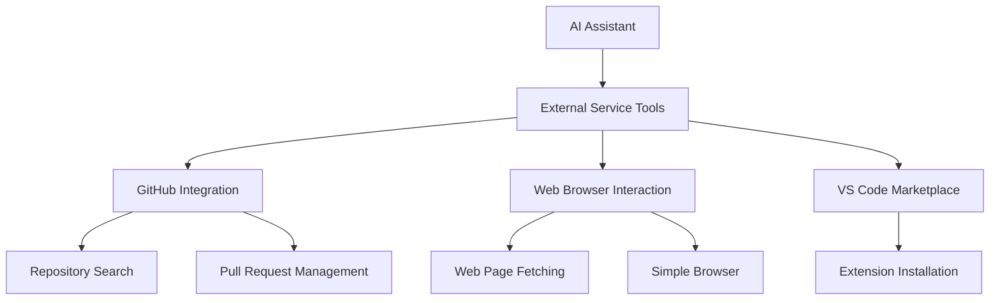
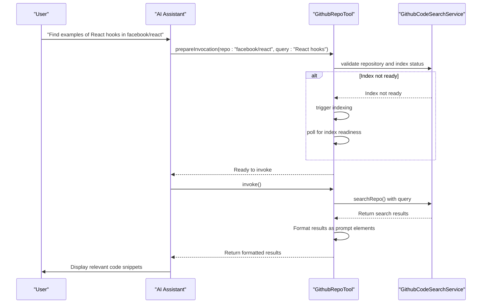
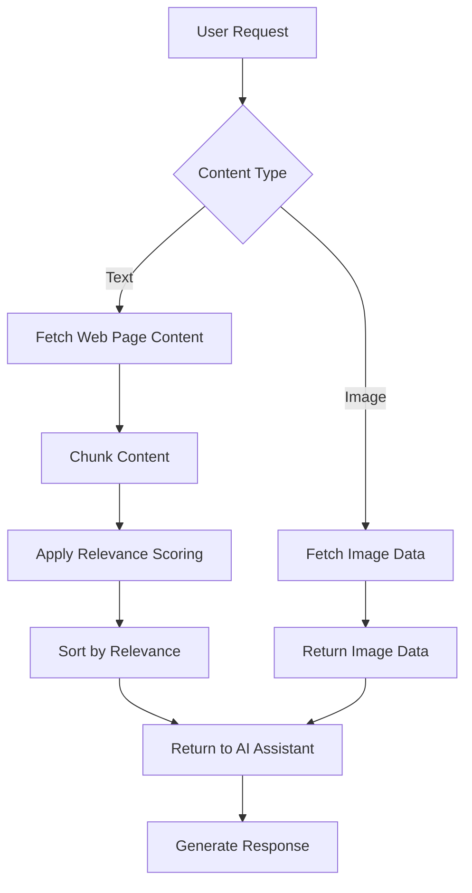
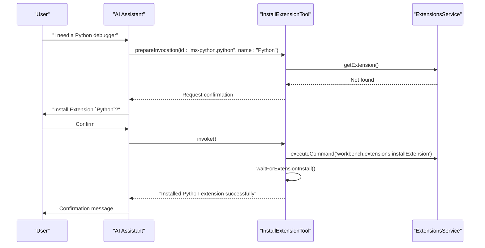
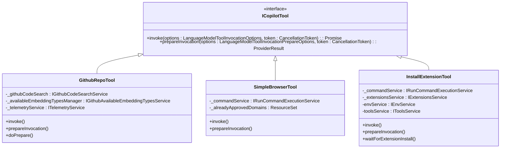
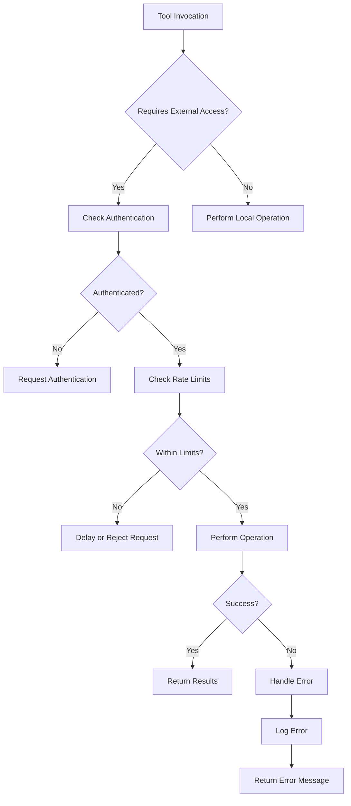

# External Service Tools

<cite>
**Referenced Files in This Document**   
- [githubRepoTool.tsx](file://src/extension/tools/node/githubRepoTool.tsx)
- [simpleBrowserTool.tsx](file://src/extension/tools/node/simpleBrowserTool.tsx)
- [fetchWebPageTool.tsx](file://src/extension/tools/vscode-node/fetchWebPageTool.tsx)
- [installExtensionTool.tsx](file://src/extension/tools/node/installExtensionTool.tsx)
- [toolNames.ts](file://src/extension/tools/common/toolNames.ts)
- [toolsRegistry.ts](file://src/extension/tools/common/toolsRegistry.ts)
- [pullRequestDescriptionPrompt.tsx](file://src/extension/prompts/node/github/pullRequestDescriptionPrompt.tsx)
</cite>

## Table of Contents
1. [Introduction](#introduction)
2. [External Service Tools Overview](#external-service-tools-overview)
3. [GitHub Repository Tool](#github-repository-tool)
4. [Web Browser Interaction Tools](#web-browser-interaction-tools)
5. [VS Code Marketplace Integration](#vs-code-marketplace-integration)
6. [Tool Implementation Patterns](#tool-implementation-patterns)
7. [Security and Authentication](#security-and-authentication)
8. [Usage Scenarios and Examples](#usage-scenarios-and-examples)
9. [Conclusion](#conclusion)

## Introduction

The vscode-copilot-chat extension provides a suite of external service tools that extend the AI assistant's capabilities beyond the local development environment. These tools enable interaction with cloud-based services such as GitHub, web browsers, and the VS Code extension marketplace, facilitating collaborative development, information retrieval, and environment configuration. This document details the implementation and functionality of these external service tools, focusing on their integration patterns, usage scenarios, and security considerations.

**Section sources**
- [githubRepoTool.tsx](file://src/extension/tools/node/githubRepoTool.tsx)
- [simpleBrowserTool.tsx](file://src/extension/tools/node/simpleBrowserTool.tsx)

## External Service Tools Overview

The external service tools in the vscode-copilot-chat extension are designed to bridge the gap between local development and cloud-based services. These tools are implemented as language model tools that can be invoked by the AI assistant to perform specific actions or retrieve information from external services.

The tools are categorized based on their functionality:
- **GitHub integration**: Tools for interacting with GitHub repositories and pull requests
- **Web browser interaction**: Tools for accessing web content and opening browser views
- **VS Code marketplace integration**: Tools for installing extensions and accessing marketplace functionality

These tools follow a consistent implementation pattern using the `ICopilotTool` interface and are registered with the `ToolRegistry` for discovery and invocation by the language model.

**Diagram sources**
- [githubRepoTool.tsx](file://src/extension/tools/node/githubRepoTool.tsx)
- [simpleBrowserTool.tsx](file://src/extension/tools/node/simpleBrowserTool.tsx)
- [installExtensionTool.tsx](file://src/extension/tools/node/installExtensionTool.tsx)

**Section sources**
- [toolNames.ts](file://src/extension/tools/common/toolNames.ts)
- [toolsRegistry.ts](file://src/extension/tools/common/toolsRegistry.ts)

## GitHub Repository Tool

The `GithubRepoTool` enables the AI assistant to search and retrieve code from GitHub repositories. This tool allows users to query external repositories for relevant code snippets, documentation, or implementation patterns that can inform local development.

### Functionality and Implementation

The `GithubRepoTool` implements the `ICopilotTool` interface with the following key features:

- **Repository identification**: Accepts repository identifiers in various formats (owner/repo, full URL)
- **Code search**: Performs semantic search across the repository using embedding-based indexing
- **Result formatting**: Returns search results in a structured format with prioritized chunks

The tool follows a two-phase invocation pattern with `prepareInvocation` and `invoke` methods. The preparation phase validates the repository and ensures the index is ready, while the invocation phase performs the actual search.

**Diagram sources**
- [githubRepoTool.tsx](file://src/extension/tools/node/githubRepoTool.tsx)

**Section sources**
- [githubRepoTool.tsx](file://src/extension/tools/node/githubRepoTool.tsx)
- [pullRequestDescriptionPrompt.tsx](file://src/extension/prompts/node/github/pullRequestDescriptionPrompt.tsx)

## Web Browser Interaction Tools

The extension provides two complementary tools for web browser interaction: `SimpleBrowserTool` and `FetchWebPageTool`. These tools enable the AI assistant to access web-based information and present it to the user in different formats.

### Simple Browser Tool

The `SimpleBrowserTool` opens a web page in a dedicated browser view within VS Code. This tool is designed for interactive exploration of web content.

**Key features:**
- Opens URLs in a secure browser context
- Requires user confirmation for untrusted domains
- Supports only HTTP and HTTPS schemes
- Maintains a cache of approved domains to reduce repeated confirmations

### Fetch Web Page Tool

The `FetchWebPageTool` retrieves and processes web page content for inclusion in the AI assistant's context. Unlike the simple browser, this tool extracts and indexes the content for semantic search.

**Key features:**
- Retrieves web page content programmatically
- Processes text content into searchable chunks
- Handles image content when supported by the model
- Applies relevance scoring to returned content
- Supports multiple URLs in a single request

**Diagram sources**
- [simpleBrowserTool.tsx](file://src/extension/tools/node/simpleBrowserTool.tsx)
- [fetchWebPageTool.tsx](file://src/extension/tools/vscode-node/fetchWebPageTool.tsx)

**Section sources**
- [simpleBrowserTool.tsx](file://src/extension/tools/node/simpleBrowserTool.tsx)
- [fetchWebPageTool.tsx](file://src/extension/tools/vscode-node/fetchWebPageTool.tsx)

## VS Code Marketplace Integration

The `InstallExtensionTool` provides integration with the VS Code extension marketplace, allowing the AI assistant to recommend and install extensions based on project requirements.

### Extension Installation Process

The tool follows a secure installation process that includes user confirmation and post-installation validation:

1. **Validation**: Checks if the extension is already installed
2. **Confirmation**: Presents installation details and requires user approval
3. **Installation**: Invokes the VS Code extension installation command
4. **Verification**: Waits for the extension to be fully loaded and registered

### Parameter Structure

The tool accepts the following parameters:
- `id`: The extension identifier in the format "publisher.extension"
- `name`: The display name of the extension for user interface purposes

### Expected Output

The tool returns a text-based result indicating the installation status:
- Success: "Installed {extension name} extension successfully"
- Already installed: "{extension name} extension is already installed"
- Failure: "Failed to install {extension name} extension"

**Diagram sources**
- [installExtensionTool.tsx](file://src/extension/tools/node/installExtensionTool.tsx)

**Section sources**
- [installExtensionTool.tsx](file://src/extension/tools/node/installExtensionTool.tsx)

## Tool Implementation Patterns

The external service tools follow consistent implementation patterns that ensure reliability, security, and usability.

### Common Architecture

All tools implement the `ICopilotTool` interface and are registered with the `ToolRegistry`. They follow the language model tool pattern with `invoke` and `prepareInvocation` methods.

**Diagram sources**
- [githubRepoTool.tsx](file://src/extension/tools/node/githubRepoTool.tsx)
- [simpleBrowserTool.tsx](file://src/extension/tools/node/simpleBrowserTool.tsx)
- [installExtensionTool.tsx](file://src/extension/tools/node/installExtensionTool.tsx)
- [toolsRegistry.ts](file://src/extension/tools/common/toolsRegistry.ts)

**Section sources**
- [toolsRegistry.ts](file://src/extension/tools/common/toolsRegistry.ts)
- [toolNames.ts](file://src/extension/tools/common/toolNames.ts)

## Security and Authentication

The external service tools implement several security measures to protect user data and prevent unauthorized access.

### Authentication Handling

The tools leverage VS Code's authentication framework and do not handle credentials directly. For GitHub operations, the extension relies on the user's existing GitHub authentication in VS Code.

### User Confirmation

All tools that perform external operations require explicit user confirmation:
- Web browser tools confirm navigation to untrusted domains
- Extension installation requires approval before proceeding
- GitHub repository access validates authentication status

### Rate Limiting and Error Handling

The tools implement appropriate error handling and respect service rate limits:
- GitHub repository tool polls for index readiness with exponential backoff
- Web page fetching handles network errors gracefully
- Extension installation includes timeout mechanisms

**Section sources**
- [githubRepoTool.tsx](file://src/extension/tools/node/githubRepoTool.tsx)
- [simpleBrowserTool.tsx](file://src/extension/tools/node/simpleBrowserTool.tsx)
- [installExtensionTool.tsx](file://src/extension/tools/node/installExtensionTool.tsx)

## Usage Scenarios and Examples

The external service tools enable a variety of practical scenarios that enhance the development workflow.

### GitHub Repository Search

**Scenario**: A developer wants to understand how a particular pattern is implemented in popular open-source projects.

**Workflow**:
1. User asks: "Show me how React handles state management in class components"
2. AI assistant uses `GithubRepoTool` to search the facebook/react repository
3. Tool retrieves relevant code snippets and returns them to the assistant
4. Assistant explains the pattern with concrete examples from the repository

### Web Documentation Access

**Scenario**: A developer needs to reference API documentation for a library.

**Workflow**:
1. User asks: "What are the options for configuring webpack?"
2. AI assistant uses `FetchWebPageTool` to retrieve the webpack configuration documentation
3. Tool extracts and prioritizes relevant sections
4. Assistant provides a summary with key configuration options

### Extension Recommendation and Installation

**Scenario**: A developer starts a new project and needs appropriate tooling.

**Workflow**:
1. User asks: "I'm starting a Python project, what extensions should I install?"
2. AI assistant analyzes the project and recommends the Python extension
3. Assistant uses `InstallExtensionTool` to install the recommended extension
4. Tool confirms installation and notifies the user

### Parameter Structures and Expected Outputs

| Tool | Parameters | Expected Output |
|------|-----------|----------------|
| GithubRepoTool | repo (string), query (string) | Search results with code snippets and references |
| SimpleBrowserTool | url (string) | Confirmation of browser opening |
| FetchWebPageTool | urls (string[]), query (string, optional) | Extracted content with relevance scoring |
| InstallExtensionTool | id (string), name (string) | Installation status message |

**Section sources**
- [githubRepoTool.tsx](file://src/extension/tools/node/githubRepoTool.tsx)
- [simpleBrowserTool.tsx](file://src/extension/tools/node/simpleBrowserTool.tsx)
- [fetchWebPageTool.tsx](file://src/extension/tools/vscode-node/fetchWebPageTool.tsx)
- [installExtensionTool.tsx](file://src/extension/tools/node/installExtensionTool.tsx)

## Conclusion

The external service tools in the vscode-copilot-chat extension significantly enhance the AI assistant's capabilities by connecting it to cloud-based services and collaborative platforms. These tools enable the assistant to retrieve information from GitHub repositories, access web-based documentation, and manage VS Code extensions, creating a more comprehensive development support system.

The tools follow consistent implementation patterns with proper security measures, including user confirmation and authentication handling. They extend the assistant's functionality beyond the local environment, allowing it to provide more informed and contextually relevant assistance.

By leveraging these external service tools, developers can access a wealth of information and functionality directly within their development environment, reducing context switching and improving productivity.