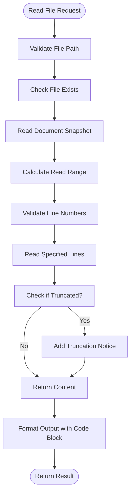
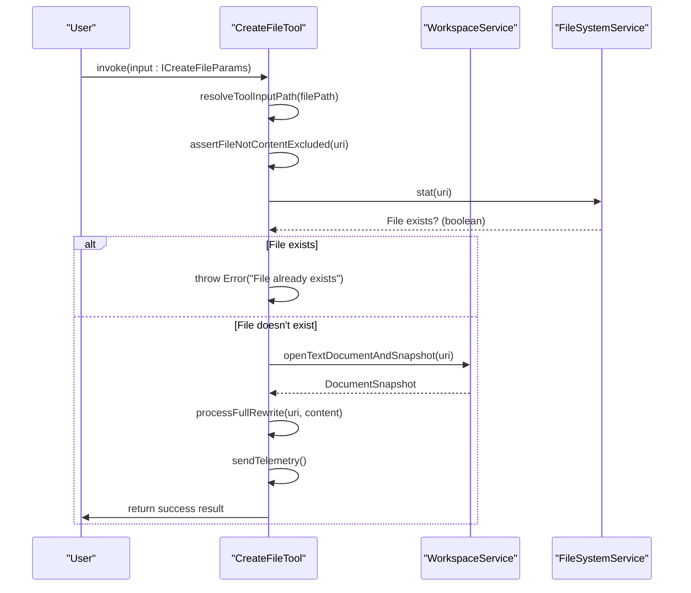
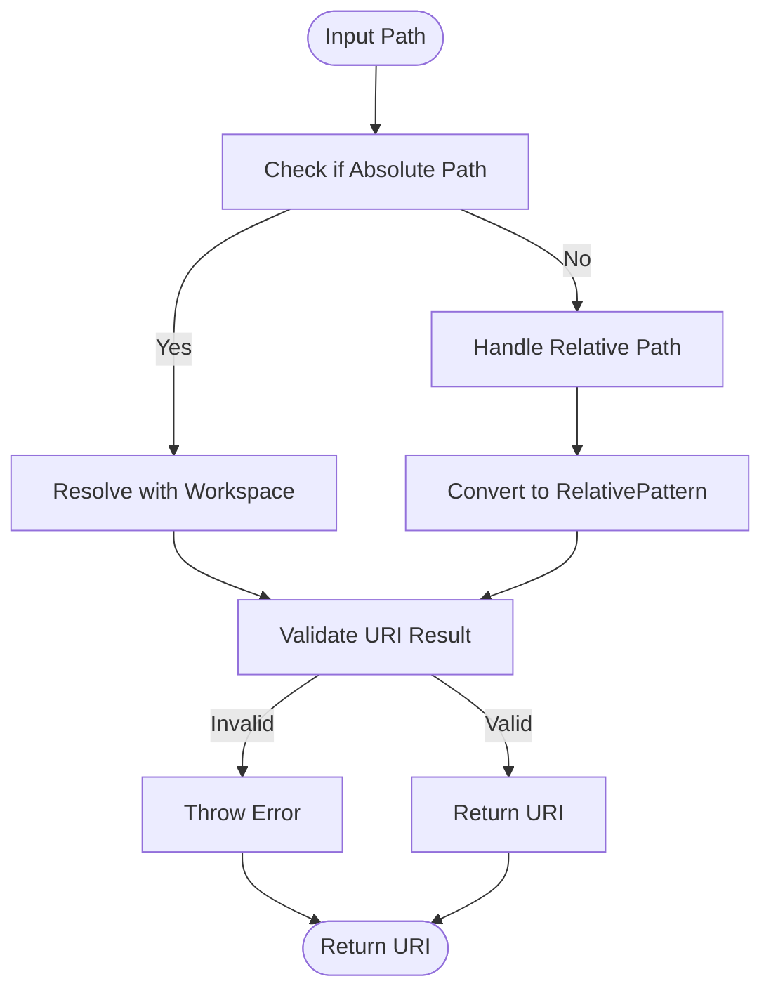
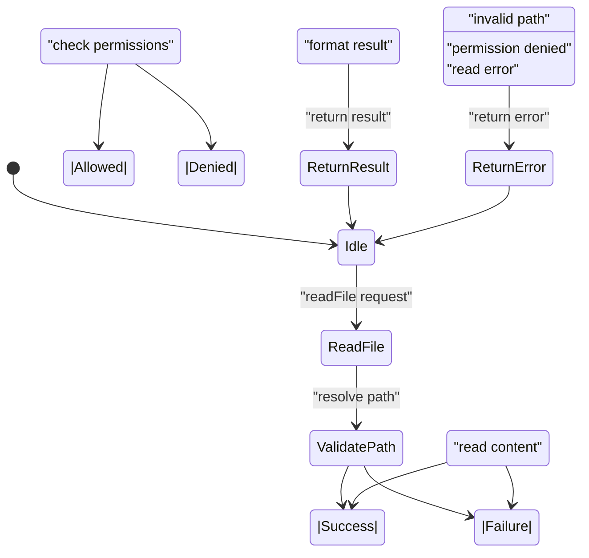

# File System Tools

<cite>
**Referenced Files in This Document**   
- [readFileTool.tsx](file://src/extension/tools/node/readFileTool.tsx)
- [createFileTool.tsx](file://src/extension/tools/node/createFileTool.tsx)
- [abstractReplaceStringTool.tsx](file://src/extension/tools/node/abstractReplaceStringTool.tsx)
- [replaceStringTool.tsx](file://src/extension/tools/node/replaceStringTool.tsx)
- [multiReplaceStringTool.tsx](file://src/extension/tools/node/multiReplaceStringTool.tsx)
- [toolUtils.ts](file://src/extension/tools/node/toolUtils.ts)
- [editFileToolUtils.tsx](file://src/extension/tools/node/editFileToolUtils.tsx)
- [fileSystemService.ts](file://src/platform/filesystem/common/fileSystemService.ts)
- [vscode.d.ts](file://src/extension/vscode.d.ts)
</cite>

## Table of Contents
1. [Introduction](#introduction)
2. [Core File System Tools](#core-file-system-tools)
3. [File Reading Operations](#file-reading-operations)
4. [File Creation Operations](#file-creation-operations)
5. [String Replacement Operations](#string-replacement-operations)
6. [Path Resolution and Encoding](#path-resolution-and-encoding)
7. [Error Handling and Security](#error-handling-and-security)
8. [Inheritance Pattern Analysis](#inheritance-pattern-analysis)
9. [Usage Scenarios and Examples](#usage-scenarios-and-examples)
10. [Conclusion](#conclusion)

## Introduction
The vscode-copilot-chat extension provides a comprehensive suite of file system tools that enable AI-powered interactions with the file system. These tools facilitate reading, creating, and modifying files and directories through natural language commands. The implementation follows a structured pattern with specialized tools for different operations, each adhering to consistent interfaces and error handling mechanisms. This documentation details the functionality, implementation patterns, and usage scenarios for these file system tools, with a focus on the readFileTool.tsx and createFileTool.tsx implementations.

## Core File System Tools
The file system tools in the vscode-copilot-chat extension are organized under the `src/extension/tools/node` directory and implement the `ICopilotTool` interface. These tools provide a bridge between natural language commands and file system operations, enabling the AI assistant to interact with the user's workspace. The core tools include:

- **ReadFileTool**: Reads file contents with support for partial reads and line ranges
- **CreateFileTool**: Creates new files with specified content
- **ReplaceStringTool**: Replaces text within existing files
- **MultiReplaceStringTool**: Performs multiple string replacements across files
- **ListDirTool**: Lists directory contents

These tools are registered with the `ToolRegistry` and are accessible through the language model interface. Each tool follows a consistent pattern of parameter validation, path resolution, operation execution, and result formatting.

**Section sources**
- [readFileTool.tsx](file://src/extension/tools/node/readFileTool.tsx#L1-L296)
- [createFileTool.tsx](file://src/extension/tools/node/createFileTool.tsx#L1-L201)
- [abstractReplaceStringTool.tsx](file://src/extension/tools/node/abstractReplaceStringTool.tsx#L1-L582)

## File Reading Operations
The ReadFileTool provides functionality for reading file contents with support for various parameters and error conditions. The tool implementation handles file encoding, path resolution, and large file scenarios through its parameter structure and processing logic.

### Parameter Structure and Functionality
The ReadFileTool supports two parameter versions:
- **IReadFileParamsV1**: Uses startLine and endLine parameters for specifying line ranges
- **IReadFileParamsV2**: Uses offset and limit parameters for chunked reading

The tool automatically handles file encoding through the underlying workspace service, which opens files with appropriate encoding detection. The implementation uses `TextDocumentSnapshot` and `NotebookDocumentSnapshot` to represent file contents, ensuring consistent handling of both text files and notebooks.

### Large File Handling
The tool implements a chunking mechanism for large files with a maximum of 2000 lines per read operation:


**Diagram sources**
- [readFileTool.tsx](file://src/extension/tools/node/readFileTool.tsx#L68-L105)
- [readFileTool.tsx](file://src/extension/tools/node/readFileTool.tsx#L242-L295)

### Error Conditions
The ReadFileTool handles several error conditions:
- **File not found**: Throws an error when the specified file does not exist
- **Invalid line numbers**: Validates that line numbers are within file bounds
- **Permission denied**: Respects workspace and file system permissions
- **Outside workspace**: Prevents reading files outside the workspace unless explicitly allowed

The tool uses the `assertFileOkForTool` function to validate file accessibility before reading, ensuring security and proper workspace boundaries.

**Section sources**
- [readFileTool.tsx](file://src/extension/tools/node/readFileTool.tsx#L123-L151)
- [toolUtils.ts](file://src/extension/tools/node/toolUtils.ts#L102-L116)

## File Creation Operations
The CreateFileTool enables the creation of new files with specified content, handling various edge cases and providing appropriate feedback to the user.

### Parameter Structure and Validation
The CreateFileTool accepts parameters through the `ICreateFileParams` interface:
- **filePath**: The absolute path where the file should be created
- **content**: Optional content to write to the file

The tool performs several validation steps:
1. Validates the file path using `resolveToolInputPath`
2. Checks if the file already exists
3. Validates that the content is provided when required
4. Ensures the file is not excluded by ignore rules

### Implementation Pattern
The CreateFileTool follows a consistent pattern for file creation:


**Diagram sources**
- [createFileTool.tsx](file://src/extension/tools/node/createFileTool.tsx#L61-L140)
- [createFileTool.tsx](file://src/extension/tools/node/createFileTool.tsx#L143-L153)

### Notebook Support
The CreateFileTool handles both regular text files and notebooks through conditional logic:
- For notebooks, it uses `processFullRewriteNewNotebook` to handle cell structure
- For text files, it uses `processFullRewrite` for direct content writing
- The tool detects notebook support through `notebookService.hasSupportedNotebooks(uri)`

This dual handling ensures proper creation of both file types while maintaining a consistent interface.

**Section sources**
- [createFileTool.tsx](file://src/extension/tools/node/createFileTool.tsx#L104-L114)
- [createFileTool.tsx](file://src/extension/tools/node/createFileTool.tsx#L115-L120)

## String Replacement Operations
The string replacement tools provide functionality for modifying existing file content through text replacement operations. These tools follow an inheritance pattern that enables consistent behavior across different replacement operations.

### AbstractReplaceStringTool Base Class
The `AbstractReplaceStringTool` serves as the base class for all string replacement operations, providing common functionality:
- Input extraction and validation
- Edit preparation and conflict detection
- Error handling and telemetry
- Result formatting and presentation

The abstract class defines the core interface that concrete implementations must follow, ensuring consistent behavior across different replacement operations.

```mermaid
classDiagram
class AbstractReplaceStringTool~T~ {
+_promptContext : IBuildPromptContext
+lastOperation : Promise~IPrepareEdit[]~
+invoke(options, token) : Promise~LanguageModelToolResult~
+prepareEdits(options, token) : Promise~IPrepareEdit[]~
+_prepareEdits(options, input, token) : Promise~IPrepareEdit[]~
+_errorConflictingEdits(results) : void
+_prepareEditsForFile(options, input, token) : Promise~IPrepareEdit~
+generateEdit(uri, document, options, input, didHealRef, token) : Promise~{edits, updatedFile}~
+applyAllEdits(options, edits, token) : Promise~LanguageModelToolResult~
+sendReplaceTelemetry(outcome, options, input, file, isNotebookDocument, didHeal) : void
+sendHealingTelemetry(options, healError, applicationError) : void
+modelForTelemetry(options) : Promise~string~
+modelObjectForTelemetry(options) : LanguageModelChat
+recordEditSuccess(options, success) : void
+resolveInput(input, promptContext) : Promise~T~
+prepareInvocation(options, token) : Promise~PreparedToolInvocation~
+generateConfirmationDetails(replaceInputs, urisNeedingConfirmation, options, token) : Promise~string~
}
class ReplaceStringTool {
+extractReplaceInputs(input) : IAbstractReplaceStringInput[]
+invoke(options, token) : Promise~LanguageModelToolResult~
+toolName() : ToolName
}
class MultiReplaceStringTool {
+extractReplaceInputs(input) : IAbstractReplaceStringInput[]
+invoke(options, token) : Promise~LanguageModelToolResult~
+toolName() : ToolName
}
AbstractReplaceStringTool <|-- ReplaceStringTool
AbstractReplaceStringTool <|-- MultiReplaceStringTool
```

**Diagram sources**
- [abstractReplaceStringTool.tsx](file://src/extension/tools/node/abstractReplaceStringTool.tsx#L63-L582)
- [replaceStringTool.tsx](file://src/extension/tools/node/replaceStringTool.tsx#L18-L41)
- [multiReplaceStringTool.tsx](file://src/extension/tools/node/multiReplaceStringTool.tsx#L20-L113)

### Concrete Implementations
The two concrete implementations of the abstract base class provide specialized functionality:

#### ReplaceStringTool
The `ReplaceStringTool` handles single file replacements with the `IReplaceStringToolParams` interface:
- **explanation**: Description of the replacement operation
- **filePath**: Target file path
- **oldString**: Text to be replaced
- **newString**: Replacement text

The tool extracts a single replacement operation from the input parameters and delegates to the base class for execution.

#### MultiReplaceStringTool
The `MultiReplaceStringTool` handles multiple replacements across files with the `IMultiReplaceStringToolParams` interface:
- **explanation**: Overall description of the replacement operations
- **replacements**: Array of individual replacement operations

The tool extracts multiple replacement operations and includes additional functionality for:
- Success/failure tracking across multiple operations
- Conflict detection between edits
- Merging of edits to the same file
- Telemetry for batch operations

**Section sources**
- [replaceStringTool.tsx](file://src/extension/tools/node/replaceStringTool.tsx#L11-L41)
- [multiReplaceStringTool.tsx](file://src/extension/tools/node/multiReplaceStringTool.tsx#L15-L152)

## Path Resolution and Encoding
The file system tools implement robust path resolution and encoding handling to ensure reliable file operations across different environments and file types.

### Path Resolution Mechanism
The tools use a consistent path resolution pattern through the `resolveToolInputPath` function:


The resolution process handles both absolute and relative paths, converting them to URI objects that can be used with the workspace and file system services. The implementation respects workspace boundaries and ensures that operations are performed on valid file system locations.

### Encoding Handling
The tools handle file encoding through the following mechanisms:
- **Automatic detection**: The workspace service automatically detects file encoding when opening documents
- **Consistent representation**: Text is represented using `TextDocumentSnapshot` which maintains encoding information
- **Line ending normalization**: The tools handle different line ending conventions (CRLF vs LF) appropriately
- **Character encoding**: UTF-8 is used as the default encoding for all operations

The implementation ensures that file content is read and written with the correct encoding, preserving special characters and maintaining file integrity.

**Section sources**
- [toolUtils.ts](file://src/extension/tools/node/toolUtils.ts#L84-L91)
- [readFileTool.tsx](file://src/extension/tools/node/readFileTool.tsx#L195-L198)
- [createFileTool.tsx](file://src/extension/tools/node/createFileTool.tsx#L83-L86)

## Error Handling and Security
The file system tools implement comprehensive error handling and security measures to protect user data and ensure reliable operation.

### Error Types and Handling
The tools handle various error conditions with specific error types:
- **FileNotFound**: When attempting to read or modify a non-existent file
- **FileExists**: When attempting to create a file that already exists
- **NoPermissions**: When lacking required permissions for an operation
- **InvalidPath**: When the file path is malformed or outside workspace
- **ContentExcluded**: When the file is configured to be ignored by Copilot

The error handling follows a consistent pattern:
1. Validate preconditions before operation
2. Catch and translate low-level errors to user-friendly messages
3. Provide specific guidance for resolving the issue
4. Include appropriate telemetry for monitoring

### Security Considerations
The tools implement several security measures:
- **Workspace boundaries**: Prevent operations on files outside the workspace
- **Ignore rules**: Respect .gitignore and other ignore configurations
- **Permission checks**: Verify user permissions before operations
- **Content validation**: Validate file content before processing
- **Path sanitization**: Sanitize file paths to prevent directory traversal

The `assertFileOkForTool` function serves as a central security check, ensuring that files are accessible and appropriate for tool operations.

### Permission Requirements
The file system operations require the following permissions:
- **Read access**: For reading file contents and directory listings
- **Write access**: For creating and modifying files
- **Execute access**: For running shell commands (in related tools)
- **Workspace access**: For accessing workspace configuration

The tools respect VS Code's permission model and will fail gracefully when insufficient permissions are available.



**Diagram sources**
- [vscode.d.ts](file://src/extension/vscode.d.ts#L9689-L9726)
- [toolUtils.ts](file://src/extension/tools/node/toolUtils.ts#L102-L116)
- [readFileTool.tsx](file://src/extension/tools/node/readFileTool.tsx#L126-L130)

## Inheritance Pattern Analysis
The inheritance pattern between `AbstractReplaceStringTool` and its concrete implementations enables consistent behavior across different replacement operations while allowing for specialized functionality.

### Base Class Responsibilities
The `AbstractReplaceStringTool` base class handles the following responsibilities:
- **Common functionality**: Provides shared methods for edit preparation, conflict detection, and result formatting
- **Error handling**: Implements consistent error handling and telemetry across all replacements
- **State management**: Manages the prompt context and operation caching
- **Security checks**: Performs file validation and permission checks
- **Telemetry**: Sends consistent telemetry events for all replacement operations

### Interface Contracts
The inheritance pattern defines clear interface contracts:
- **extractReplaceInputs**: Converts tool-specific input to the common `IAbstractReplaceStringInput` format
- **toolName**: Returns the specific tool name for identification
- **invoke**: Executes the replacement operation (can be overridden for specialized behavior)

These contracts ensure that all replacement tools follow a consistent pattern while allowing for implementation-specific variations.

### Benefits of the Pattern
The inheritance pattern provides several benefits:
- **Code reuse**: Common functionality is implemented once in the base class
- **Consistency**: All replacement operations follow the same error handling and telemetry patterns
- **Maintainability**: Changes to common behavior can be made in a single location
- **Extensibility**: New replacement tools can be added by extending the base class
- **Testability**: Common functionality can be tested at the base class level

The pattern exemplifies the Template Method design pattern, where the base class defines the overall algorithm structure while allowing subclasses to implement specific steps.

**Section sources**
- [abstractReplaceStringTool.tsx](file://src/extension/tools/node/abstractReplaceStringTool.tsx#L63-L582)
- [replaceStringTool.tsx](file://src/extension/tools/node/replaceStringTool.tsx#L18-L41)
- [multiReplaceStringTool.tsx](file://src/extension/tools/node/multiReplaceStringTool.tsx#L20-L113)

## Usage Scenarios and Examples
The file system tools support various usage scenarios that enable AI-powered file operations through natural language commands.

### Reading File Content
To read a file's contents, the AI can use the ReadFileTool with appropriate parameters:
```typescript
// Example usage pattern
const result = await toolsService.invokeTool(ToolName.ReadFile, {
  input: {
    filePath: "/src/main.ts",
    offset: 10,
    limit: 50
  }
});
```

This would read lines 10-60 from the specified file, handling large files through chunked reading.

### Creating New Files
To create a new file, the AI can use the CreateFileTool:
```typescript
// Example usage pattern
const result = await toolsService.invokeTool(ToolName.CreateFile, {
  input: {
    filePath: "/src/components/Header.tsx",
    content: "import React from 'react';\n\nexport function Header() {\n  return <header>My App</header>;\n}"
  }
});
```

The tool would create the specified file with the provided content, handling path resolution and workspace boundaries.

### Modifying Existing Files
For modifying existing files, the replacement tools can be used:
```typescript
// Single replacement
const result = await toolsService.invokeTool(ToolName.ReplaceString, {
  input: {
    explanation: "Update function name",
    filePath: "/src/utils/helpers.ts",
    oldString: "function oldName()",
    newString: "function newName()"
  }
});

// Multiple replacements
const result = await toolsService.invokeTool(ToolName.MultiReplaceString, {
  input: {
    explanation: "Update API endpoints",
    replacements: [
      {
        filePath: "/src/api/client.ts",
        oldString: "api.example.com/v1",
        newString: "api.example.com/v2"
      },
      {
        filePath: "/src/config.ts",
        oldString: "API_VERSION = 'v1'",
        newString: "API_VERSION = 'v2'"
      }
    ]
  }
});
```

These examples demonstrate how the tools can be used to perform various file operations through structured input parameters.

**Section sources**
- [readFileTool.tsx](file://src/extension/tools/node/readFileTool.tsx#L61-L151)
- [createFileTool.tsx](file://src/extension/tools/node/createFileTool.tsx#L61-L140)
- [replaceStringTool.tsx](file://src/extension/tools/node/replaceStringTool.tsx#L30-L37)
- [multiReplaceStringTool.tsx](file://src/extension/tools/node/multiReplaceStringTool.tsx#L31-L51)

## Conclusion
The file system tools in the vscode-copilot-chat extension provide a robust and secure interface for AI-powered file operations. Through a well-structured implementation with clear separation of concerns, these tools enable natural language interactions with the file system while maintaining reliability and security. The inheritance pattern between `AbstractReplaceStringTool` and its concrete implementations demonstrates effective code reuse and consistent behavior across different replacement operations. The tools handle various edge cases, including large files, encoding differences, and permission constraints, ensuring reliable operation in diverse environments. By following consistent patterns for parameter handling, error management, and telemetry, the tools provide a solid foundation for AI-assisted development workflows.