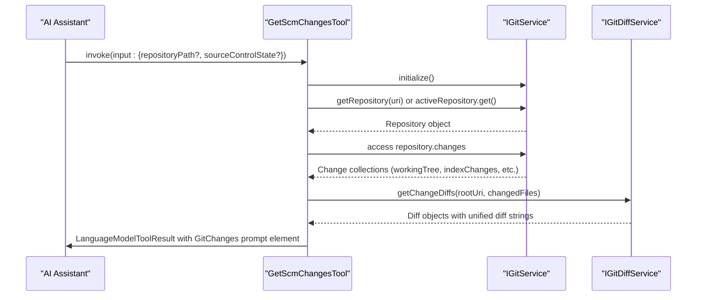
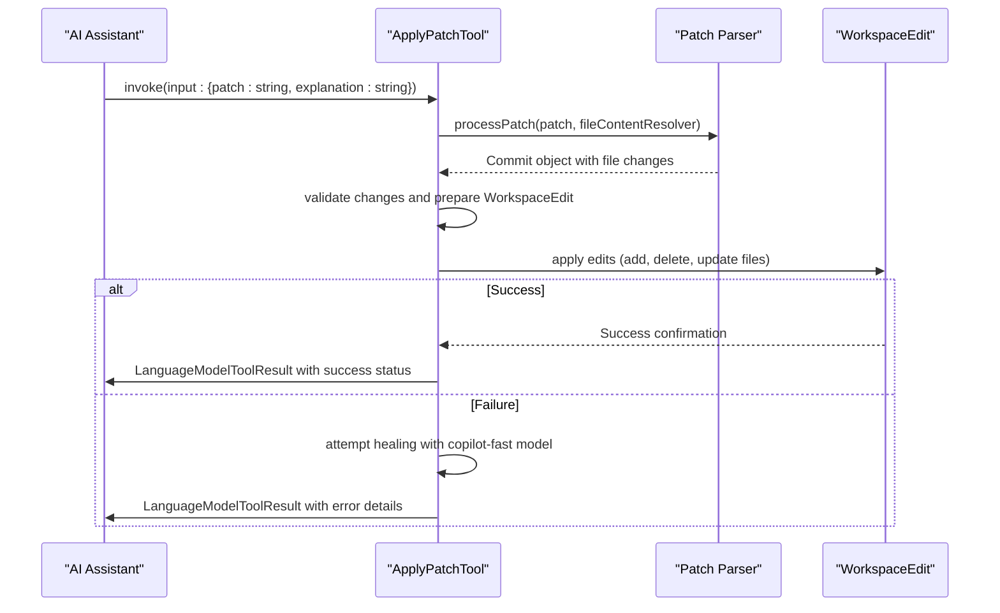
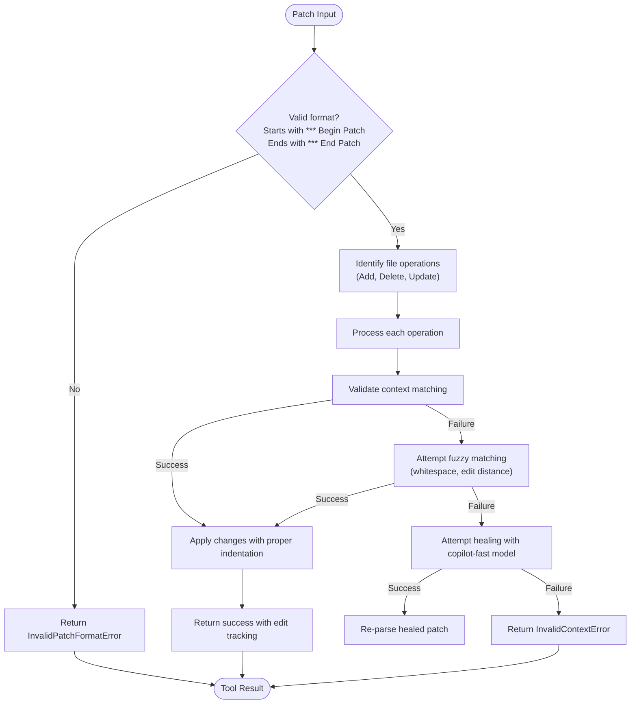
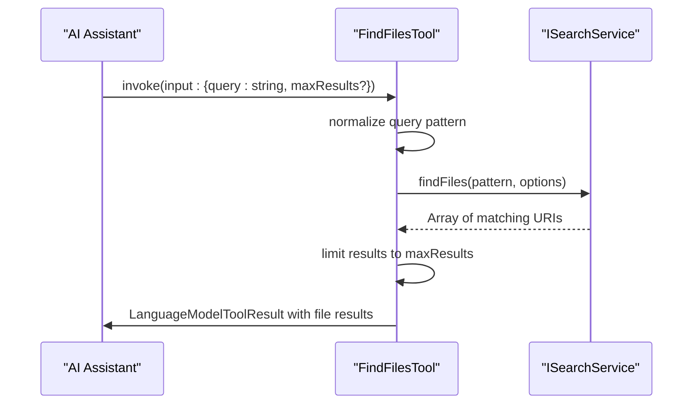
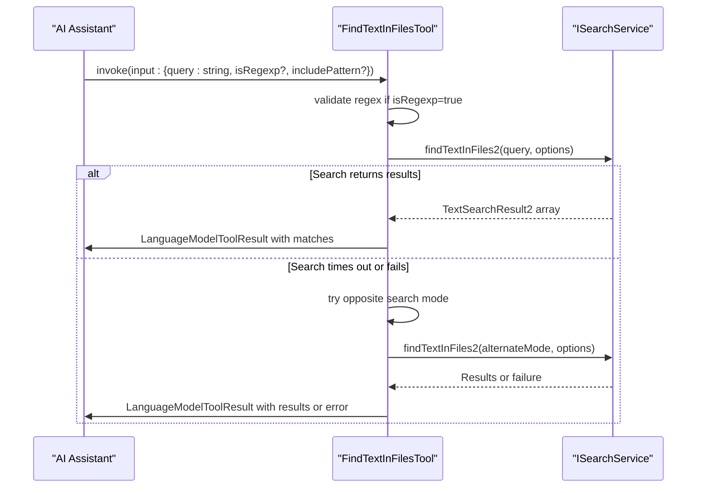
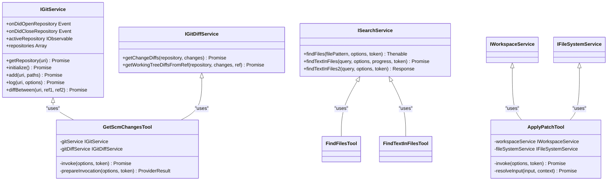
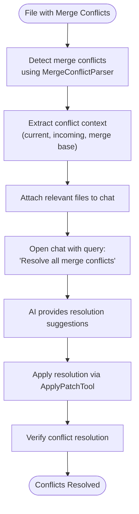
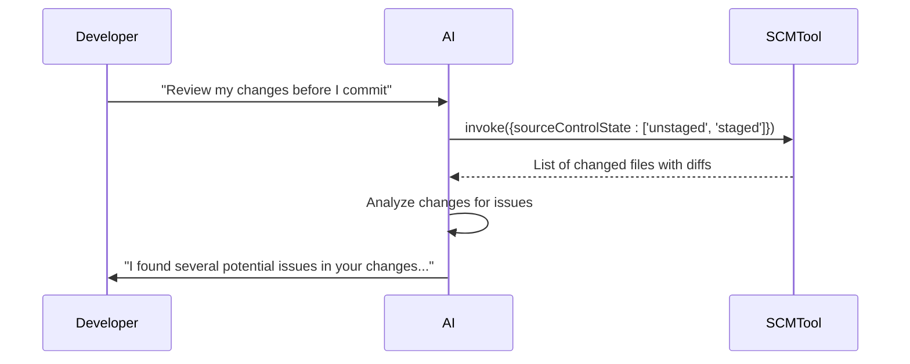
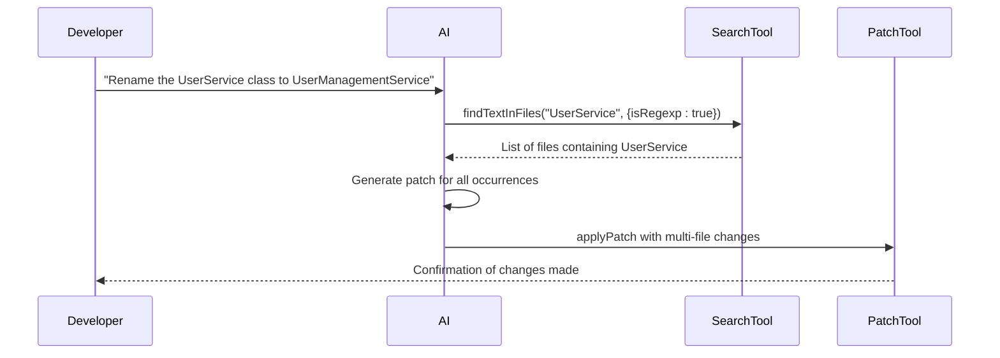
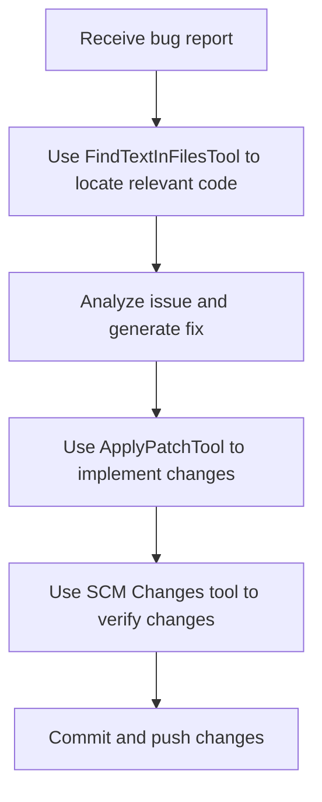

# Version Control Tools

<cite>
**Referenced Files in This Document**   
- [scmChangesTool.ts](file://src/extension/tools/node/scmChangesTool.ts)
- [applyPatchTool.tsx](file://src/extension/tools/node/applyPatchTool.tsx)
- [parser.ts](file://src/extension/tools/node/applyPatch/parser.ts)
- [parseApplyPatch.ts](file://src/extension/tools/node/applyPatch/parseApplyPatch.ts)
- [gitService.ts](file://src/platform/git/common/gitService.ts)
- [gitDiffService.ts](file://src/platform/git/common/gitDiffService.ts)
- [findFilesTool.tsx](file://src/extension/tools/node/findFilesTool.tsx)
- [findTextInFilesTool.tsx](file://src/extension/tools/node/findTextInFilesTool.tsx)
</cite>

## Table of Contents
1. [Introduction](#introduction)
2. [Core Version Control Tools](#core-version-control-tools)
3. [SCM Changes Tool](#scm-changes-tool)
4. [Apply Patch Tool](#apply-patch-tool)
5. [Patch Parsing and Validation](#patch-parsing-and-validation)
6. [File and Text Search Tools](#file-and-text-search-tools)
7. [Integration with VS Code SCM](#integration-with-vs-code-scm)
8. [Error Handling and Conflict Resolution](#error-handling-and-conflict-resolution)
9. [Usage Scenarios and Examples](#usage-scenarios-and-examples)
10. [Conclusion](#conclusion)

## Introduction
The vscode-copilot-chat extension provides a comprehensive suite of version control tools that enable AI-assisted code reviews, change management, and collaborative development. These tools integrate seamlessly with Git and other source control systems through VS Code's SCM provider, allowing the AI assistant to retrieve changes, apply patches, and search through version-controlled files. The tools are designed to facilitate intelligent code modifications while preserving the integrity of the version control workflow. By leveraging these tools, developers can automate common version control tasks, receive intelligent suggestions for code improvements, and resolve merge conflicts with AI assistance.

## Core Version Control Tools
The vscode-copilot-chat extension implements several key tools for version control operations, each designed to handle specific aspects of source code management. The primary tools include the SCM Changes tool for retrieving file modifications, the Apply Patch tool for implementing code changes, and search tools for locating files and text within the repository. These tools work together to provide a comprehensive version control interface that enables AI-assisted development workflows. The tools are registered in the ToolRegistry and can be invoked by the language model when appropriate for the user's request. They follow a consistent pattern of implementation with standardized parameter structures and output formats, ensuring predictable behavior across different version control operations.

**Section sources**
- [scmChangesTool.ts](file://src/extension/tools/node/scmChangesTool.ts#L28-L141)
- [applyPatchTool.tsx](file://src/extension/tools/node/applyPatchTool.tsx#L61-L669)
- [findFilesTool.tsx](file://src/extension/tools/node/findFilesTool.tsx#L30-L108)
- [findTextInFilesTool.tsx](file://src/extension/tools/node/findTextInFilesTool.tsx#L41-L236)

## SCM Changes Tool
The SCM Changes tool (GetScmChangesTool) retrieves information about file changes in a Git repository by interfacing with VS Code's SCM provider through the IGitService and IGitDiffService interfaces. This tool allows the AI assistant to understand the current state of changes in the repository, including staged, unstaged, and merge conflicts. The tool accepts parameters for specifying the repository path and the source control state to retrieve, enabling targeted queries for specific types of changes.

**Diagram sources**
- [scmChangesTool.ts](file://src/extension/tools/node/scmChangesTool.ts#L40-L105)

**Section sources**
- [scmChangesTool.ts](file://src/extension/tools/node/scmChangesTool.ts#L28-L141)

## Apply Patch Tool
The Apply Patch tool (ApplyPatchTool) enables the AI assistant to make code modifications by applying patches in a specialized format. This tool processes patch instructions that describe file operations such as adding, deleting, or updating files, and applies these changes to the workspace. The tool includes sophisticated error handling and healing mechanisms to address common issues with patch application, such as context mismatches or formatting errors.

The tool workflow involves:
1. Parsing the patch input to identify file operations
2. Validating the patch format and context
3. Applying changes to files with proper handling of line endings and indentation
4. Providing confirmation dialogs for user approval
5. Reporting success or failure with detailed error information

**Diagram sources**
- [applyPatchTool.tsx](file://src/extension/tools/node/applyPatchTool.tsx#L184-L435)

**Section sources**
- [applyPatchTool.tsx](file://src/extension/tools/node/applyPatchTool.tsx#L61-L669)

## Patch Parsing and Validation
The patch parsing system in vscode-copilot-chat implements a robust parser that converts the AI-generated patch format into executable file operations. The parser handles the specialized patch format that begins with "*** Begin Patch" and ends with "*** End Patch", processing file operations and hunks within this envelope. The parsing process includes multiple validation steps to ensure the patch can be safely applied.

Key aspects of the patch parsing system include:
- **Context matching**: The parser uses fuzzy matching to locate change contexts in files, allowing for minor discrepancies between the patch context and the actual file content
- **Error recovery**: When context matching fails, the parser attempts various recovery strategies, including ignoring whitespace differences and using edit-distance-based matching
- **Indentation handling**: The parser preserves proper indentation by analyzing the target file's indentation style and adjusting the patch content accordingly
- **Special character handling**: The parser normalizes explicit tab and newline characters in the patch to ensure proper rendering

**Diagram sources**
- [parser.ts](file://src/extension/tools/node/applyPatch/parser.ts#L164-L259)
- [parseApplyPatch.ts](file://src/extension/tools/node/applyPatch/parseApplyPatch.ts#L55-L123)

**Section sources**
- [parser.ts](file://src/extension/tools/node/applyPatch/parser.ts#L1-L800)
- [parseApplyPatch.ts](file://src/extension/tools/node/applyPatch/parseApplyPatch.ts#L1-L132)

## File and Text Search Tools
The extension provides two primary search tools for locating files and text within the repository: FindFilesTool and FindTextInFilesTool. These tools enable the AI assistant to discover relevant files and code snippets, supporting comprehensive code analysis and modification workflows.

### Find Files Tool
The FindFilesTool searches for files matching a glob pattern across the workspace. It accepts a query parameter that can be a simple filename, extension, or complex glob pattern. The tool normalizes the input pattern by ensuring it starts with "**/" for recursive search and handles various edge cases in pattern formatting.

**Diagram sources**
- [findFilesTool.tsx](file://src/extension/tools/node/findFilesTool.tsx#L40-L81)

### Find Text in Files Tool
The FindTextInFilesTool searches for text or regex patterns across files in the workspace. It supports both literal text search and regular expression search, with options to include or exclude ignored files. The tool handles cases where the initial search mode fails by automatically trying the alternative mode (regex vs literal).

**Diagram sources**
- [findTextInFilesTool.tsx](file://src/extension/tools/node/findTextInFilesTool.tsx#L52-L130)

**Section sources**
- [findFilesTool.tsx](file://src/extension/tools/node/findFilesTool.tsx#L30-L108)
- [findTextInFilesTool.tsx](file://src/extension/tools/node/findTextInFilesTool.tsx#L41-L236)

## Integration with VS Code SCM
The version control tools in vscode-copilot-chat integrate with VS Code's SCM provider through a layered architecture that abstracts the underlying Git operations. The integration is facilitated by service interfaces that provide a clean separation between the tool logic and the SCM implementation.

### Service Architecture
The integration relies on several key service interfaces:
- **IGitService**: Provides access to repository information, change tracking, and Git operations
- **IGitDiffService**: Handles the generation of diff information for file changes
- **ISearchService**: Manages file and text search operations across the workspace

**Diagram sources**
- [gitService.ts](file://src/platform/git/common/gitService.ts#L39-L67)
- [gitDiffService.ts](file://src/platform/git/common/gitDiffService.ts#L12-L17)

**Section sources**
- [gitService.ts](file://src/platform/git/common/gitService.ts#L1-L343)
- [gitDiffService.ts](file://src/platform/git/common/gitDiffService.ts#L1-L22)

## Error Handling and Conflict Resolution
The version control tools implement comprehensive error handling and conflict resolution strategies to ensure robust operation in various scenarios. These mechanisms address common challenges such as merge conflicts, file exclusions, and patch application failures.

### Merge Conflict Handling
The extension includes specialized functionality for handling merge conflicts through the MergeConflictServiceImpl class. When merge conflicts are detected in files, the tool can automatically open a chat session with relevant context, including the merge base and conflict ranges, to assist in resolution.

### Patch Application Challenges
The ApplyPatchTool addresses several common challenges in patch application:

1. **Line ending preservation**: The tool carefully preserves the original file's line ending style when applying changes, ensuring consistency across the codebase.

2. **Large diff handling**: For large diffs, the tool implements streaming processing and memory management to prevent performance issues.

3. **Context validation**: The parser validates that context lines in the patch match the actual file content, using fuzzy matching when exact matches fail.

4. **Healing mechanism**: When a patch fails to apply, the tool can invoke a smaller, faster model (copilot-fast) to "heal" the patch by correcting context mismatches or formatting issues.

**Section sources**
- [mergeConflictServiceImpl.ts](file://src/extension/git/vscode/mergeConflictServiceImpl.ts#L28-L108)
- [applyPatchTool.tsx](file://src/extension/tools/node/applyPatchTool.tsx#L448-L533)

## Usage Scenarios and Examples
The version control tools in vscode-copilot-chat enable various practical usage scenarios for AI-assisted development. These scenarios demonstrate how the tools can be leveraged to improve productivity and code quality.

### Code Review Assistance
During code reviews, the SCM Changes tool can retrieve all unstaged and staged changes, allowing the AI assistant to analyze the modifications and provide feedback on potential issues, suggest improvements, or explain the changes to team members.

### Automated Code Refactoring
The Apply Patch tool enables automated code refactoring across multiple files. The AI assistant can generate a comprehensive patch that updates function signatures, modifies imports, and adjusts calling code throughout the codebase.

### Issue Resolution Workflow
When addressing bugs or feature requests, the tools can work together to locate relevant code, make changes, and verify the results.

**Section sources**
- [scmChangesTool.ts](file://src/extension/tools/node/scmChangesTool.ts#L129-L138)
- [applyPatchTool.tsx](file://src/extension/tools/node/applyPatchTool.tsx#L593-L606)
- [findTextInFilesTool.tsx](file://src/extension/tools/node/findTextInFilesTool.tsx#L158-L182)

## Conclusion
The version control tools in the vscode-copilot-chat extension provide a powerful interface for AI-assisted development, enabling seamless integration with Git and other source control systems. By leveraging the SCM Changes tool, Apply Patch tool, and search utilities, developers can automate common version control tasks, receive intelligent code suggestions, and resolve issues more efficiently. The tools' robust error handling, context-aware patch application, and tight integration with VS Code's SCM provider make them valuable assets for modern development workflows. As AI-assisted development continues to evolve, these tools demonstrate how intelligent assistants can enhance code quality, accelerate development cycles, and improve collaboration among team members.