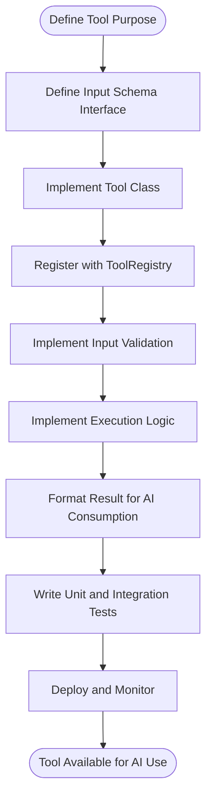
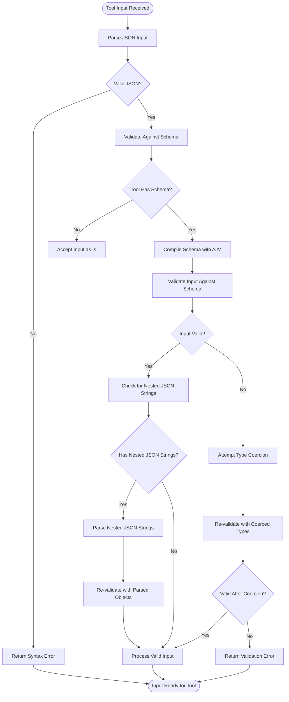
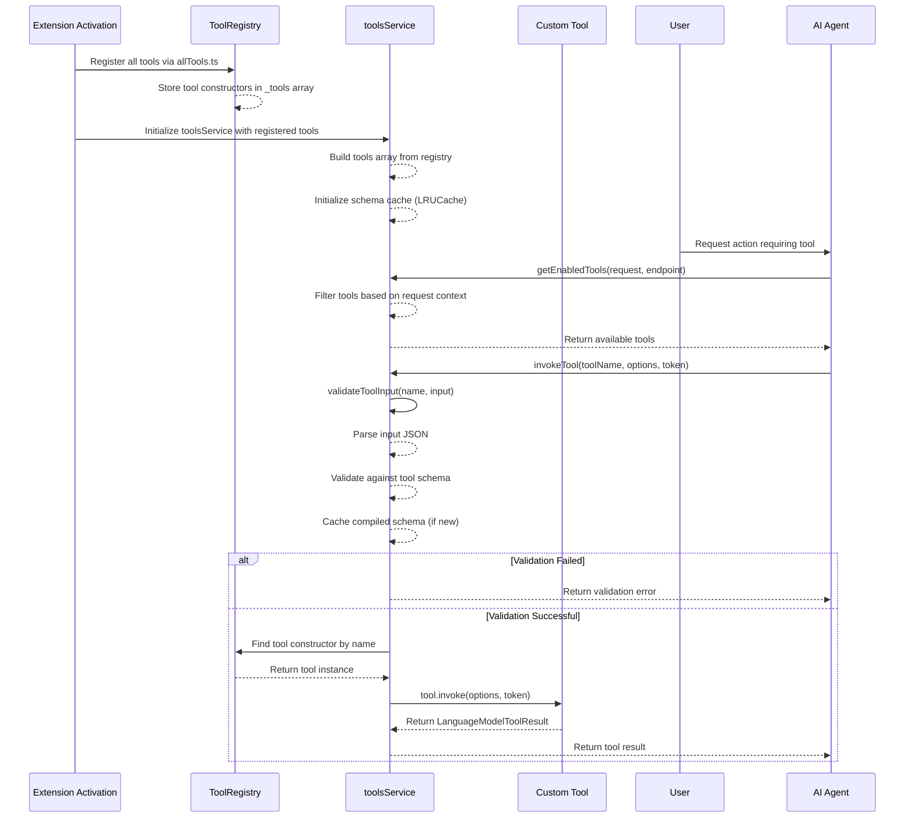
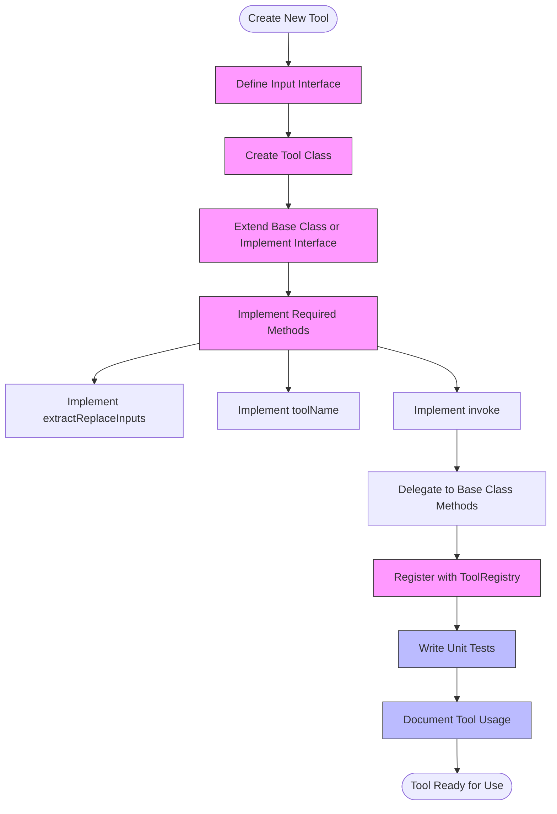
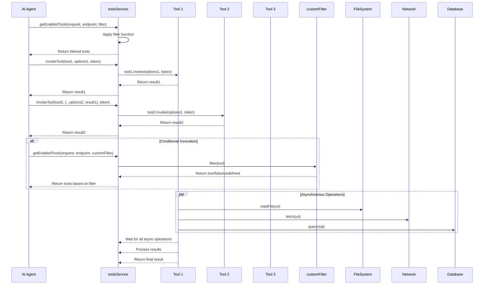
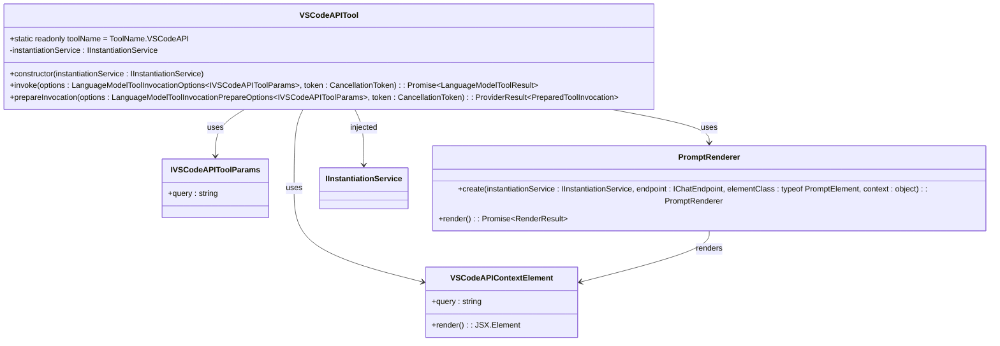
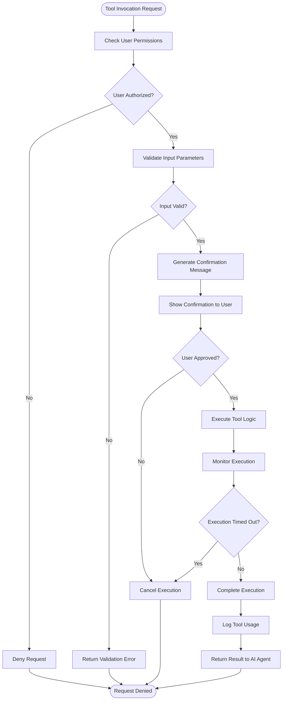
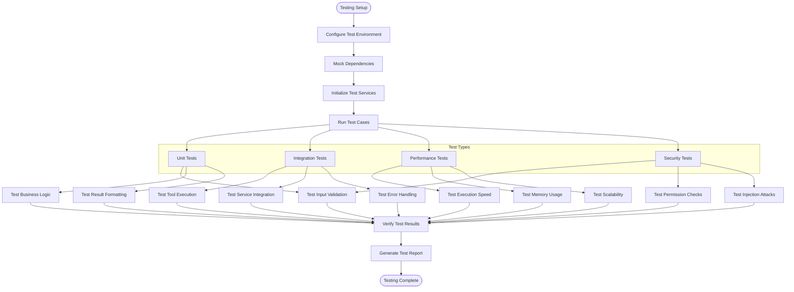

# Custom Tool Development

<cite>
**Referenced Files in This Document**   
- [toolsService.ts](file://src/extension/tools/common/toolsService.ts)
- [toolsRegistry.ts](file://src/extension/tools/common/toolsRegistry.ts)
- [abstractReplaceStringTool.tsx](file://src/extension/tools/node/abstractReplaceStringTool.tsx)
- [replaceStringTool.tsx](file://src/extension/tools/node/replaceStringTool.tsx)
- [multiReplaceStringTool.tsx](file://src/extension/tools/node/multiReplaceStringTool.tsx)
- [vscodeAPITool.ts](file://src/extension/tools/node/vscodeAPITool.ts)
- [toolNames.ts](file://src/extension/tools/common/toolNames.ts)
- [allTools.ts](file://src/extension/tools/node/allTools.ts)
- [toolService.spec.ts](file://src/extension/tools/common/test/toolService.spec.ts)
- [toolTestUtils.tsx](file://src/extension/tools/node/test/toolTestUtils.tsx)
</cite>

## Table of Contents
1. [Introduction](#introduction)
2. [Tool Development Lifecycle](#tool-development-lifecycle)
3. [Tool Schemas and Input Validation](#tool-schemas-and-input-validation)
4. [Core Tool Classes and Interfaces](#core-tool-classes-and-interfaces)
5. [Tool Registration and Discovery](#tool-registration-and-discovery)
6. [Creating a Custom Tool: Step-by-Step Example](#creating-a-custom-tool-step-by-step-example)
7. [Advanced Tool Patterns](#advanced-tool-patterns)
8. [VS Code API Integration](#vs-code-api-integration)
9. [Security and Permission Management](#security-and-permission-management)
10. [Testing and Debugging](#testing-and-debugging)
11. [Conclusion](#conclusion)

## Introduction

The vscode-copilot-chat extension provides a comprehensive framework for creating custom tools that extend the capabilities of AI-powered coding assistance. These tools enable the AI to interact with the development environment, perform code modifications, retrieve context, and execute various operations within VS Code. This documentation provides a detailed guide to developing custom tools, covering the complete lifecycle from schema definition to registration and execution.

The tool system is built on VS Code's Language Model API, allowing tools to be invoked by AI agents to accomplish specific tasks. Tools can range from simple file operations to complex interactions with external services or VS Code APIs. The framework provides robust infrastructure for input validation, error handling, and result formatting, ensuring reliable and secure tool execution.

**Section sources**
- [toolsService.ts](file://src/extension/tools/common/toolsService.ts#L1-L254)
- [toolsRegistry.ts](file://src/extension/tools/common/toolsRegistry.ts#L1-L106)

## Tool Development Lifecycle

The development lifecycle for custom tools in the vscode-copilot-chat extension follows a structured process that ensures consistency, reliability, and integration with the existing system. The lifecycle consists of several key phases: tool definition, implementation, registration, and execution.

The process begins with defining the tool's purpose and scope, followed by creating a TypeScript interface that specifies the input parameters. This interface serves as the contract between the AI model and the tool implementation. The tool is then implemented as a class that extends the appropriate base class or implements the required interfaces.

During implementation, developers focus on the core logic of the tool, including input validation, business logic execution, and result formatting. The tool must handle various edge cases and provide meaningful error messages. Once implemented, the tool is registered with the system through the ToolRegistry, making it discoverable and executable.

The execution phase involves the tool being invoked by the AI agent, with the toolsService coordinating the invocation, handling input validation, and managing the execution context. The tool processes the input, performs its designated operations, and returns a structured result that can be consumed by the AI agent.



**Diagram sources **
- [toolsService.ts](file://src/extension/tools/common/toolsService.ts#L155-L254)
- [toolsRegistry.ts](file://src/extension/tools/common/toolsRegistry.ts#L86-L105)

**Section sources**
- [toolsService.ts](file://src/extension/tools/common/toolsService.ts#L1-L254)
- [toolsRegistry.ts](file://src/extension/tools/common/toolsRegistry.ts#L1-L106)

## Tool Schemas and Input Validation

Tool schemas define the structure and constraints for the input parameters that a tool accepts. These schemas are implemented using TypeScript interfaces and are validated using JSON Schema validation through the AJV library. Proper schema definition is crucial for ensuring that tools receive well-formed input from AI models.

The input validation process is handled by the BaseToolsService class, which provides a validateToolInput method that checks both the syntactic correctness of the input JSON and its semantic validity against the tool's schema. The validation process includes several key steps: parsing the JSON input, checking for required properties, validating data types, and handling type coercion.

A notable feature of the validation system is its ability to handle nested JSON strings. When the AI model generates JSON that contains stringified JSON objects, the validation system automatically parses these nested strings into proper objects. This capability is essential for handling complex inputs that might be generated by language models.

The validation process also includes error recovery mechanisms. When validation fails due to type mismatches, the system attempts to coerce values to the expected types (e.g., converting string "42" to number 42). This type coercion is enabled through the AJV configuration with the coerceTypes option set to true.



**Diagram sources **
- [toolsService.ts](file://src/extension/tools/common/toolsService.ts#L180-L217)
- [toolService.spec.ts](file://src/extension/tools/common/test/toolService.spec.ts#L141-L232)

**Section sources**
- [toolsService.ts](file://src/extension/tools/common/toolsService.ts#L180-L217)
- [toolService.spec.ts](file://src/extension/tools/common/test/toolService.spec.ts#L141-L232)

## Core Tool Classes and Interfaces

The custom tool framework in vscode-copilot-chat is built around several key classes and interfaces that provide the foundation for tool development. Understanding these core components is essential for creating effective and well-integrated tools.

The primary interface is ICopilotTool<T>, which defines the contract for all custom tools. This interface extends the VS Code LanguageModelTool interface and adds additional capabilities specific to the Copilot extension. Tools implement this interface to provide the invoke method, which contains the core logic for tool execution, and optionally the prepareInvocation method for pre-execution processing.

The abstractReplaceStringTool.tsx provides a powerful base class for tools that perform text replacements in files. This abstract class implements common functionality for file editing operations, including input validation, edit preparation, conflict detection, and result formatting. It serves as the foundation for both the ReplaceStringTool and MultiReplaceStringTool, demonstrating the framework's support for inheritance and code reuse.

The BaseToolsService class is a critical component that manages the lifecycle of tool execution. It handles tool discovery, input validation, and invocation coordination. This service acts as the intermediary between the AI agent and the tool implementations, ensuring that tools are executed in a controlled and secure environment.

```mermaid
classDiagram
class ICopilotTool~T~ {
<<interface>>
+invoke(options : LanguageModelToolInvocationOptions~T~, token : CancellationToken) : Promise~LanguageModelToolResult~
+prepareInvocation?(options : LanguageModelToolInvocationPrepareOptions~T~, token : CancellationToken) : ProviderResult~PreparedToolInvocation~
+filterEdits?(resource : URI) : Promise~IEditFilterData | undefined~
+provideInput?(promptContext : IBuildPromptContext) : Promise~T | undefined~
+resolveInput?(input : T, promptContext : IBuildPromptContext, mode : CopilotToolMode) : Promise~T~
+alternativeDefinition?(tool : LanguageModelToolInformation, endpoint? : IChatEndpoint) : LanguageModelToolInformation
}
class AbstractReplaceStringTool~T~ {
<<abstract>>
+invoke(options : LanguageModelToolInvocationOptions~T~, token : CancellationToken) : Promise~LanguageModelToolResult~
+prepareEdits(options : LanguageModelToolInvocationOptions~T~ | LanguageModelToolInvocationPrepareOptions~T~, token : CancellationToken) : Promise~IPrepareEdit[]~
+applyAllEdits(options : LanguageModelToolInvocationOptions~T~, edits : IPrepareEdit[], token : CancellationToken) : Promise~LanguageModelToolResult~
+extractReplaceInputs(input : T) : IAbstractReplaceStringInput[]
+toolName() : ToolName
-_prepareEditsForFile(options : LanguageModelToolInvocationOptions~T~ | LanguageModelToolInvocationPrepareOptions~T~, input : IAbstractReplaceStringInput, token : CancellationToken) : Promise~IPrepareEdit~
-generateEdit(uri : URI, document : TextDocumentSnapshot | NotebookDocumentSnapshot, options : LanguageModelToolInvocationOptions~T~ | LanguageModelToolInvocationPrepareOptions~T~, input : IAbstractReplaceStringInput, didHealRef : { healed? : IAbstractReplaceStringInput }, token : CancellationToken) : Promise~{ edits : TextEdit[], updatedFile : string }~
-sendReplaceTelemetry(outcome : string, options : LanguageModelToolInvocationOptions~T~ | LanguageModelToolInvocationPrepareOptions~T~, input : IAbstractReplaceStringInput, file : string | undefined, isNotebookDocument : boolean | undefined, didHeal : boolean | undefined) : Promise~void~
}
class BaseToolsService {
<<abstract>>
+tools : ReadonlyArray~LanguageModelToolInformation~
+copilotTools : ReadonlyMap~ToolName, ICopilotTool~unknown~~
+onWillInvokeTool : Event~IOnWillInvokeToolEvent~
+validateToolInput(name : string, input : string) : IToolValidationResult
+validateToolName(name : string) : string | undefined
+getEnabledTools(request : ChatRequest, endpoint : IChatEndpoint, filter? : (tool : LanguageModelToolInformation) => boolean | undefined) : LanguageModelToolInformation[]
-ajv : Ajv
-schemaCache : LRUCache~ValidateFunction~
-didWarnAboutValidationError? : Set~string~
}
class ReplaceStringTool {
+static toolName = ToolName.ReplaceString
+invoke(options : LanguageModelToolInvocationOptions~IReplaceStringToolParams~, token : CancellationToken) : Promise~LanguageModelToolResult~
+extractReplaceInputs(input : IReplaceStringToolParams) : IAbstractReplaceStringInput[]
+toolName() : ToolName
}
class MultiReplaceStringTool {
+static toolName = ToolName.MultiReplaceString
+invoke(options : LanguageModelToolInvocationOptions~IMultiReplaceStringToolParams~, token : CancellationToken) : Promise~LanguageModelToolResult~
+extractReplaceInputs(input : IMultiReplaceStringToolParams) : IAbstractReplaceStringInput[]
+toolName() : ToolName
}
ICopilotTool~T~ <|.. AbstractReplaceStringTool~T~
AbstractReplaceStringTool~T~ <|-- ReplaceStringTool
AbstractReplaceStringTool~T~ <|-- MultiReplaceStringTool
BaseToolsService <|-- NullToolsService
BaseToolsService <|-- ToolsService
```

**Diagram sources **
- [abstractReplaceStringTool.tsx](file://src/extension/tools/node/abstractReplaceStringTool.tsx#L63-L582)
- [toolsService.ts](file://src/extension/tools/common/toolsService.ts#L155-L254)
- [toolsRegistry.ts](file://src/extension/tools/common/toolsRegistry.ts#L67-L70)

**Section sources**
- [abstractReplaceStringTool.tsx](file://src/extension/tools/node/abstractReplaceStringTool.tsx#L63-L582)
- [toolsService.ts](file://src/extension/tools/common/toolsService.ts#L155-L254)
- [toolsRegistry.ts](file://src/extension/tools/common/toolsRegistry.ts#L67-L70)

## Tool Registration and Discovery

The tool registration and discovery system in vscode-copilot-chat is centered around the ToolRegistry singleton, which maintains a collection of all available tools in the extension. This registry serves as the central repository for tool metadata and implementations, enabling the toolsService to discover and instantiate tools as needed.

Tools are registered with the system using the ToolRegistry.registerTool method, which accepts a constructor function for the tool class. This registration process occurs in the allTools.ts file, which imports all tool implementations and registers them with the registry. This approach ensures that all tools are available when the extension is loaded, without requiring dynamic discovery at runtime.

The toolsService plays a crucial role in tool discovery and execution. It maintains references to all registered tools and provides methods for retrieving tools by name, validating tool inputs, and invoking tools with specific parameters. The service also handles the lifecycle of tool execution, including input validation, error handling, and result formatting.

Tool discovery is optimized through the use of LRU (Least Recently Used) caching for schema compilation. When a tool is invoked, its input schema is compiled using AJV and cached for future use. This caching mechanism improves performance by avoiding repeated schema compilation for frequently used tools.



**Diagram sources **
- [toolsRegistry.ts](file://src/extension/tools/common/toolsRegistry.ts#L86-L105)
- [toolsService.ts](file://src/extension/tools/common/toolsService.ts#L155-L254)
- [allTools.ts](file://src/extension/tools/node/allTools.ts#L6-L42)

**Section sources**
- [toolsRegistry.ts](file://src/extension/tools/common/toolsRegistry.ts#L86-L105)
- [toolsService.ts](file://src/extension/tools/common/toolsService.ts#L155-L254)
- [allTools.ts](file://src/extension/tools/node/allTools.ts#L6-L42)

## Creating a Custom Tool: Step-by-Step Example

Creating a custom tool in the vscode-copilot-chat extension follows a systematic process that ensures proper integration with the existing framework. This section provides a step-by-step guide to creating a new tool, using the ReplaceStringTool as an example.

The first step is to define the tool's input interface, which specifies the parameters that the tool accepts. For the ReplaceStringTool, this interface (IReplaceStringToolParams) includes properties for the explanation, file path, old string, and new string. This interface serves as the contract between the AI model and the tool implementation.

Next, create a tool class that extends the appropriate base class. For file editing operations, the AbstractReplaceStringTool provides a robust foundation with built-in functionality for input validation, edit preparation, and result formatting. The tool class must implement the required abstract methods, including extractReplaceInputs and toolName.

The extractReplaceInputs method transforms the tool's input into a standardized format (IAbstractReplaceStringInput) that can be processed by the base class. For the ReplaceStringTool, this method simply maps the input properties to the standardized format. The toolName method returns the unique identifier for the tool from the ToolName enum.

The invoke method contains the core logic for tool execution. In this case, it delegates to the prepareEdits and applyAllEdits methods provided by the base class, which handle the actual file modification operations. This delegation pattern allows for code reuse and consistent error handling across different tool implementations.

Finally, register the tool with the system by adding it to the allTools.ts file and calling ToolRegistry.registerTool with the tool class constructor. This registration makes the tool discoverable and executable by the toolsService.



**Diagram sources **
- [replaceStringTool.tsx](file://src/extension/tools/node/replaceStringTool.tsx#L1-L41)
- [abstractReplaceStringTool.tsx](file://src/extension/tools/node/abstractReplaceStringTool.tsx#L63-L582)
- [toolsRegistry.ts](file://src/extension/tools/common/toolsRegistry.ts#L90-L92)

**Section sources**
- [replaceStringTool.tsx](file://src/extension/tools/node/replaceStringTool.tsx#L1-L41)
- [abstractReplaceStringTool.tsx](file://src/extension/tools/node/abstractReplaceStringTool.tsx#L63-L582)

## Advanced Tool Patterns

The vscode-copilot-chat extension supports several advanced patterns for tool development that enable more sophisticated functionality and better integration with the AI agent. These patterns include tool chaining, asynchronous execution, and conditional tool invocation.

Tool chaining allows multiple tools to be executed in sequence, with the output of one tool serving as the input to the next. This pattern is particularly useful for complex workflows that require multiple steps, such as code refactoring that involves finding references, making modifications, and updating tests. The framework supports tool chaining through the use of Promise-based asynchronous methods and careful state management.

Asynchronous execution is a fundamental aspect of the tool framework, as many operations (such as file I/O or network requests) are inherently asynchronous. Tools implement their logic using async/await syntax, allowing them to perform non-blocking operations while maintaining a clean and readable code structure. The framework handles the coordination of asynchronous operations, ensuring that tools complete their execution before returning results to the AI agent.

Conditional tool invocation enables tools to be selectively enabled or disabled based on the context of the request. The getEnabledTools method in the toolsService accepts a filter function that can explicitly enable or disable tools based on criteria such as the current workspace, user permissions, or model capabilities. This pattern allows for dynamic tool availability that adapts to the specific situation.



**Diagram sources **
- [toolsService.ts](file://src/extension/tools/common/toolsService.ts#L79-L80)
- [multiReplaceStringTool.tsx](file://src/extension/tools/node/multiReplaceStringTool.tsx#L31-L106)
- [abstractReplaceStringTool.tsx](file://src/extension/tools/node/abstractReplaceStringTool.tsx#L87-L88)

**Section sources**
- [toolsService.ts](file://src/extension/tools/common/toolsService.ts#L79-L80)
- [multiReplaceStringTool.tsx](file://src/extension/tools/node/multiReplaceStringTool.tsx#L31-L106)

## VS Code API Integration

Integrating with VS Code APIs is a powerful capability that allows custom tools to leverage the full functionality of the editor. The vscodeAPITool demonstrates how tools can access VS Code's extensive API surface to retrieve information, modify the editor state, and interact with various components.

The VSCodeAPITool implements the LanguageModelTool interface with a simple input schema that includes a query parameter. When invoked, the tool uses the renderPromptElementJSON function to generate a response that includes information from the VS Code API based on the query. This approach allows the AI agent to access VS Code's capabilities through natural language queries.

The tool integration pattern follows a consistent structure: define the input parameters, implement the invoke method to execute the API calls, and format the results in a way that is consumable by the AI agent. The tool can access various VS Code services through dependency injection, such as the IInstantiationService, which provides access to the extension's service container.

Security considerations are paramount when integrating with VS Code APIs, as these tools can potentially access sensitive information or modify the editor state. The framework includes permission management and user confirmation mechanisms to ensure that tools operate within appropriate boundaries.



**Diagram sources **
- [vscodeAPITool.ts](file://src/extension/tools/node/vscodeAPITool.ts#L1-L42)
- [context/node/resolvers/extensionApi.ts](file://src/extension/context/node/resolvers/extensionApi.ts)
- [prompts/node/base/promptRenderer.ts](file://src/extension/prompts/node/base/promptRenderer.ts)

**Section sources**
- [vscodeAPITool.ts](file://src/extension/tools/node/vscodeAPITool.ts#L1-L42)

## Security and Permission Management

Security and permission management are critical aspects of custom tool development in the vscode-copilot-chat extension. The framework implements multiple layers of protection to ensure that tools operate within appropriate boundaries and cannot perform unauthorized actions.

The primary security mechanism is input validation, which ensures that tools receive only properly formatted and authorized input. The validation process checks both the syntactic correctness of the input JSON and its semantic validity against the tool's schema. This prevents injection attacks and ensures that tools receive only the parameters they are designed to handle.

Permission management is implemented through a combination of tool categorization and user confirmation. Tools are categorized based on their capabilities and potential impact, with more powerful tools requiring explicit user approval before execution. The prepareInvocation method can be used to generate confirmation messages that describe the intended action, allowing users to review and approve tool execution.

The framework also includes telemetry and logging capabilities that track tool usage and detect potentially malicious behavior. These logs can be used for auditing and monitoring, helping to identify and prevent security incidents. Additionally, the use of cancellation tokens ensures that tool execution can be terminated if it exceeds expected time limits or resource usage.



**Diagram sources **
- [toolsService.ts](file://src/extension/tools/common/toolsService.ts#L180-L217)
- [vscodeAPITool.ts](file://src/extension/tools/node/vscodeAPITool.ts#L32-L37)
- [abstractReplaceStringTool.tsx](file://src/extension/tools/node/abstractReplaceStringTool.tsx#L533-L543)

**Section sources**
- [toolsService.ts](file://src/extension/tools/common/toolsService.ts#L180-L217)
- [vscodeAPITool.ts](file://src/extension/tools/node/vscodeAPITool.ts#L32-L37)

## Testing and Debugging

Testing and debugging are essential components of the custom tool development process, ensuring that tools function correctly and reliably in various scenarios. The vscode-copilot-chat extension provides a comprehensive testing framework that supports both unit tests and integration tests.

Unit tests focus on individual components of a tool, such as input validation, business logic, and result formatting. The toolService.spec.ts file demonstrates how to test the validation functionality of the toolsService, including tests for schema validation, type coercion, and nested JSON string handling. These tests use the Vitest testing framework and include mock implementations of dependencies like the TestLogService.

Integration tests verify that tools work correctly within the broader system context, including interaction with other components and services. The toolTestUtils.tsx file provides utilities for testing tool results, including the toolResultToString function that renders tool results as strings for comparison with snapshots. This approach allows for comprehensive testing of the output format and content.

Debugging tools can be performed using standard VS Code debugging capabilities, with breakpoints set in the tool implementation code. The framework's extensive logging and telemetry capabilities also provide valuable insights into tool execution, helping to identify and resolve issues.



**Diagram sources **
- [toolService.spec.ts](file://src/extension/tools/common/test/toolService.spec.ts#L1-L235)
- [toolTestUtils.tsx](file://src/extension/tools/node/test/toolTestUtils.tsx#L1-L32)
- [getErrorsTool.spec.tsx](file://src/extension/tools/node/test/getErrorsTool.spec.tsx#L188-L210)

**Section sources**
- [toolService.spec.ts](file://src/extension/tools/common/test/toolService.spec.ts#L1-L235)
- [toolTestUtils.tsx](file://src/extension/tools/node/test/toolTestUtils.tsx#L1-L32)

## Conclusion

The custom tool development framework in the vscode-copilot-chat extension provides a robust and flexible system for extending AI-powered coding assistance. By following the patterns and practices outlined in this documentation, developers can create powerful tools that enhance the capabilities of the AI agent and improve developer productivity.

The framework's modular architecture, with its clear separation of concerns between tool definition, implementation, registration, and execution, enables efficient development and maintenance of custom tools. The comprehensive input validation, error handling, and security mechanisms ensure that tools operate reliably and safely within the development environment.

As the ecosystem of custom tools grows, the potential for AI-assisted development expands significantly. By leveraging the VS Code API integration, tool chaining, and advanced patterns, developers can create sophisticated workflows that automate complex tasks and provide intelligent assistance throughout the development process.

The testing and debugging infrastructure ensures that tools maintain high quality and reliability, while the telemetry and logging capabilities provide valuable insights for continuous improvement. With this comprehensive framework, the vscode-copilot-chat extension empowers developers to create innovative tools that push the boundaries of what's possible in AI-assisted software development.

[No sources needed since this section summarizes without analyzing specific files]