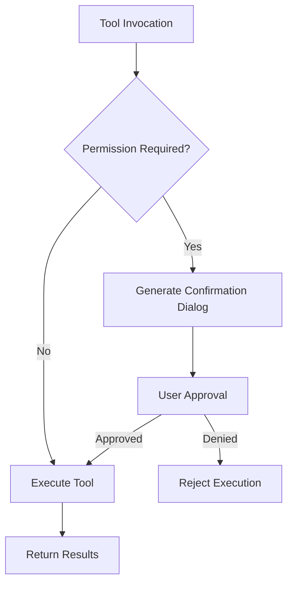
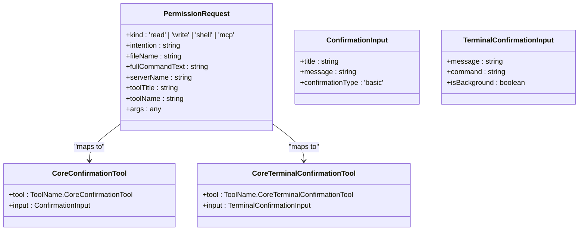
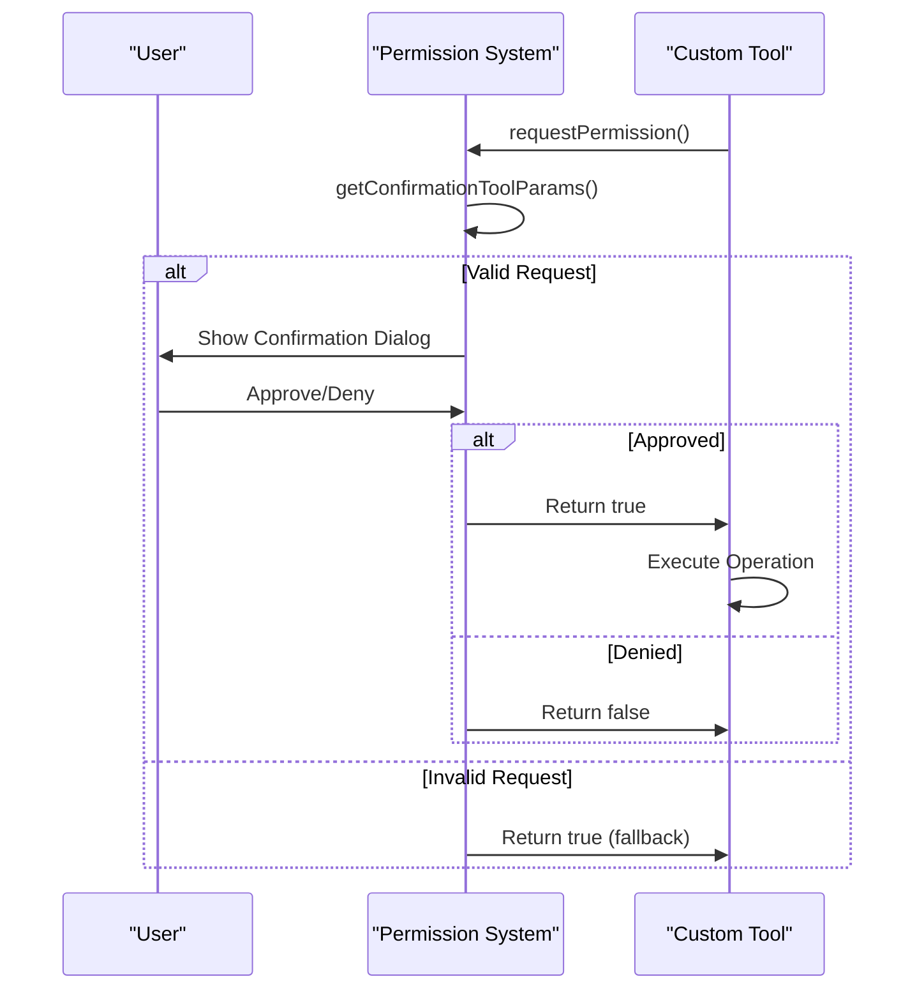
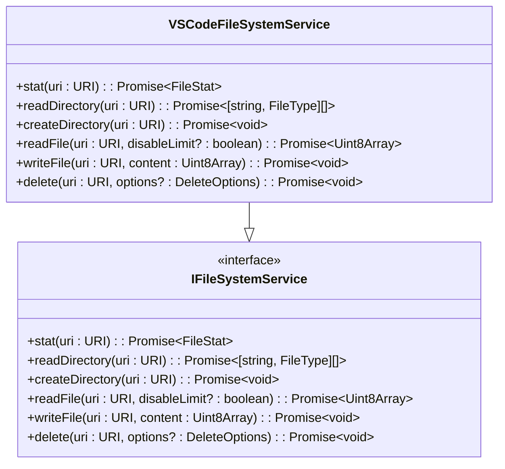
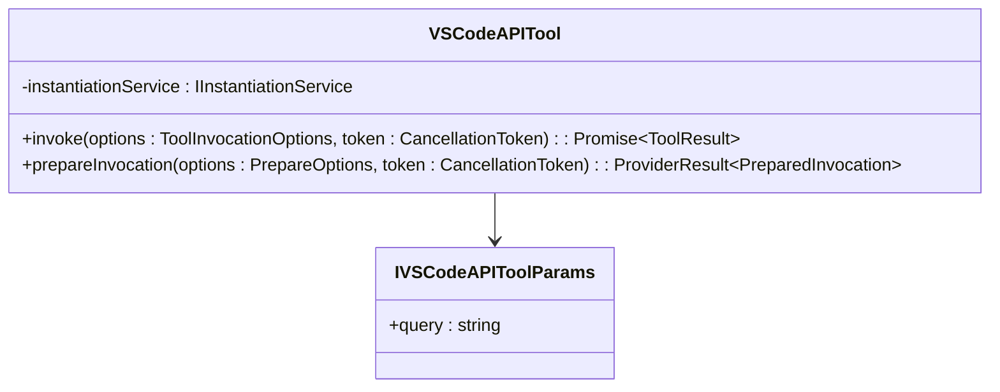
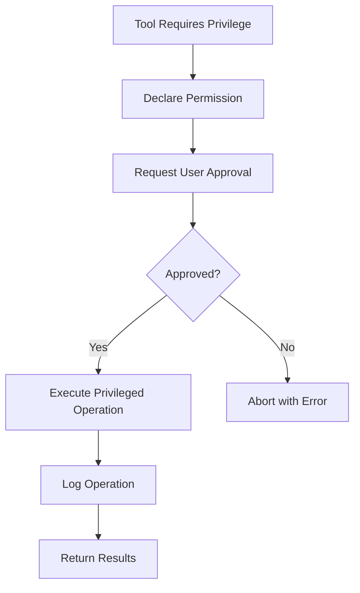
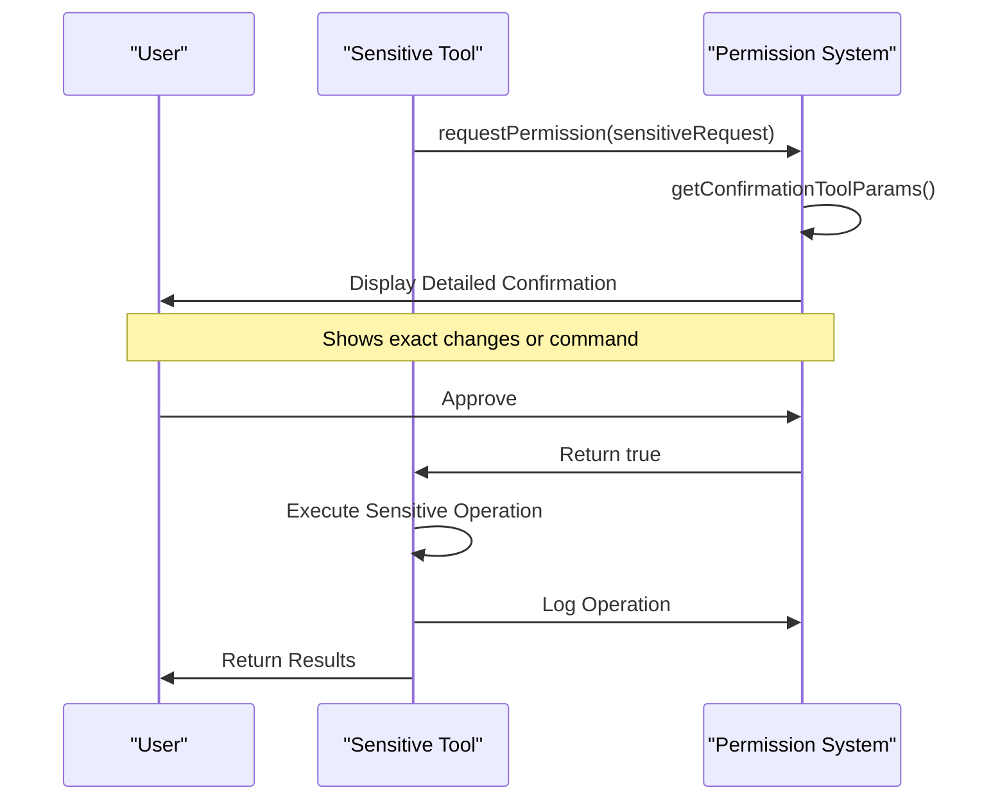
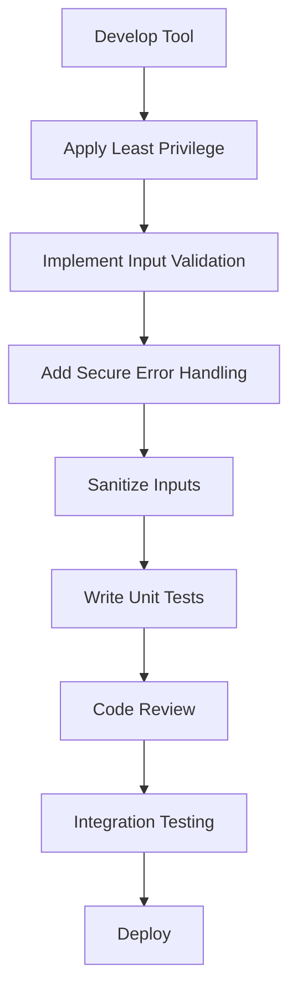
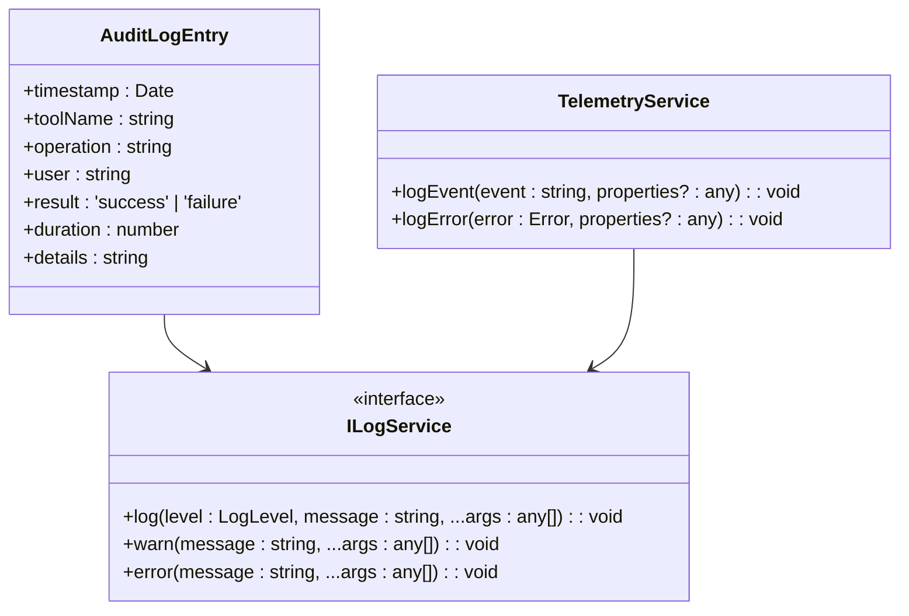

# Security and Permissions

<cite>
**Referenced Files in This Document**   
- [permissionHelpers.ts](file://src/extension/agents/copilotcli/node/permissionHelpers.ts)
- [toolsService.ts](file://src/extension/tools/common/toolsService.ts)
- [vscodeAPITool.ts](file://src/extension/tools/node/vscodeAPITool.ts)
- [fileSystemServiceImpl.ts](file://src/platform/filesystem/vscode/fileSystemServiceImpl.ts)
- [toolNames.ts](file://src/extension/tools/common/toolNames.ts)
</cite>

## Table of Contents
1. [Introduction](#introduction)
2. [Security Model for Tool Execution](#security-model-for-tool-execution)
3. [Permission Levels and User Consent](#permission-levels-and-user-consent)
4. [Permission Helpers Implementation](#permission-helpers-implementation)
5. [Security Implications of Tool Types](#security-implications-of-tool-types)
6. [Secure Tool Implementation Guidelines](#secure-tool-implementation-guidelines)
7. [Sensitive Operations and User Approval](#sensitive-operations-and-user-approval)
8. [Security Best Practices](#security-best-practices)
9. [Auditing and Logging](#auditing-and-logging)

## Introduction
The vscode-copilot-chat extension implements a comprehensive security model to govern the execution of custom tools within the VS Code environment. This document details the security architecture, focusing on permission management, user consent mechanisms, and secure implementation patterns for tools that interact with sensitive resources such as the file system, network, and VS Code APIs. The security model is designed to balance functionality with safety, ensuring that potentially impactful operations require explicit user approval while maintaining a smooth user experience.

**Section sources**
- [permissionHelpers.ts](file://src/extension/agents/copilotcli/node/permissionHelpers.ts#L1-L191)
- [toolsService.ts](file://src/extension/tools/common/toolsService.ts#L1-L254)

## Security Model for Tool Execution
The security model for tool execution in vscode-copilot-chat is built around a permission-based system that intercepts potentially sensitive operations and requires user confirmation before proceeding. The model leverages the Copilot CLI SDK's permission request mechanism, which allows tools to declare their intent and required permissions before execution.

When a tool requires access to sensitive resources, it triggers a permission request that is processed by the `requestPermission` function in the permission helpers module. This function evaluates the request type and presents an appropriate confirmation dialog to the user. The security model categorizes operations by their potential impact, with different handling for read operations, write operations, shell commands, and MCP (Model Control Protocol) tool calls.

The execution flow follows a strict pattern: tool invocation → permission check → user confirmation → execution. This ensures that no potentially harmful operation can proceed without explicit user approval. The model also incorporates input validation and schema checking through the Ajv validator to prevent malformed inputs from causing unexpected behavior.

**Diagram sources**
- [permissionHelpers.ts](file://src/extension/agents/copilotcli/node/permissionHelpers.ts#L34-L57)
- [toolsService.ts](file://src/extension/tools/common/toolsService.ts#L155-L254)

**Section sources**
- [permissionHelpers.ts](file://src/extension/agents/copilotcli/node/permissionHelpers.ts#L34-L191)
- [toolsService.ts](file://src/extension/tools/common/toolsService.ts#L1-L254)

## Permission Levels and User Consent
The permission system implements multiple levels of access control based on the sensitivity of the operation. These levels are determined by the `kind` property in the `PermissionRequest` object, which can be 'read', 'write', 'shell', or 'mcp'.

Read operations require the least stringent approval, typically presenting a simple confirmation dialog with the file path and purpose of access. Write operations, which modify files, trigger a more detailed review process that includes a diff preview of the proposed changes. Shell command execution requires explicit user approval with full visibility of the command to be executed, preventing hidden malicious commands.

User consent is obtained through dedicated confirmation tools that present the request in a clear, understandable format. The `CoreConfirmationTool` and `CoreTerminalConfirmationTool` are used to display permission requests, with the former handling file operations and the latter handling shell commands. The consent mechanism ensures that users can make informed decisions by providing context about the operation, including the affected files, command details, and potential impact.

**Diagram sources**
- [permissionHelpers.ts](file://src/extension/agents/copilotcli/node/permissionHelpers.ts#L16-L32)
- [toolNames.ts](file://src/extension/tools/common/toolNames.ts)

**Section sources**
- [permissionHelpers.ts](file://src/extension/agents/copilotcli/node/permissionHelpers.ts#L126-L178)

## Permission Helpers Implementation
The permission helpers module provides the core functionality for managing and validating tool permissions. The `requestPermission` function serves as the entry point for the permission system, taking a `PermissionRequest` object and returning a boolean indicating whether the user granted permission.

The implementation uses a pattern of mapping permission requests to appropriate confirmation tool parameters based on the request type. For shell commands (`kind: 'shell'`), it creates a `CoreTerminalConfirmationTool` with the command details. For file write operations (`kind: 'write'`), it generates a detailed confirmation with a diff preview of the changes. For MCP tool calls, it formats the request with the server name, tool title, and arguments in a structured JSON format.

The `getConfirmationToolParams` function is responsible for transforming raw permission requests into user-friendly confirmation dialogs. It handles various edge cases, such as falling back to default titles and messages when specific information is missing. The function also processes file edit requests by extracting affected URIs from the tool call and generating appropriate confirmation messages.

**Diagram sources**
- [permissionHelpers.ts](file://src/extension/agents/copilotcli/node/permissionHelpers.ts#L34-L191)

**Section sources**
- [permissionHelpers.ts](file://src/extension/agents/copilotcli/node/permissionHelpers.ts#L34-L191)

## Security Implications of Tool Types
Different tool types in the vscode-copilot-chat extension have varying security implications based on their capabilities and access levels. Understanding these implications is crucial for developing secure tools and maintaining a safe user environment.

### File System Tools
Tools that interact with the file system, such as file read and write operations, pose significant security risks if not properly controlled. The extension mitigates these risks through the `VSCodeFileSystemService` which wraps VS Code's workspace file system API with additional safety checks. The `assertReadFileSizeLimit` function prevents excessive file reads that could impact performance or consume excessive resources.

**Diagram sources**
- [fileSystemServiceImpl.ts](file://src/platform/filesystem/vscode/fileSystemServiceImpl.ts#L11-L38)

### Network Tools
Tools that make network requests must be carefully designed to prevent unauthorized data exfiltration or access to sensitive endpoints. The networking layer includes endpoint validation and logging to monitor all outgoing requests. Tools should implement proper error handling for network failures and timeouts to prevent denial of service conditions.

### VS Code API Tools
The `vscodeAPITool` provides access to VS Code's extension API, allowing tools to query information about the current environment. This tool is designed with security in mind, using a declarative approach where the query is explicitly specified in the input parameters. The tool only returns information and does not modify the VS Code state, reducing its potential impact.

**Diagram sources**
- [vscodeAPITool.ts](file://src/extension/tools/node/vscodeAPITool.ts#L16-L42)

**Section sources**
- [fileSystemServiceImpl.ts](file://src/platform/filesystem/vscode/fileSystemServiceImpl.ts#L1-L38)
- [vscodeAPITool.ts](file://src/extension/tools/node/vscodeAPITool.ts#L1-L42)

## Secure Tool Implementation Guidelines
Developing secure tools for the vscode-copilot-chat extension requires adherence to several key principles and implementation patterns. These guidelines help ensure that tools are both functional and safe for users.

### Input Validation
All tools must implement rigorous input validation to prevent injection attacks and malformed data processing. The extension uses Ajv for JSON schema validation, automatically checking tool inputs against defined schemas. Developers should define comprehensive schemas that specify required fields, data types, and value constraints.

When validation fails, the system attempts to recover by parsing JSON strings embedded in string fields, which helps handle cases where the language model outputs JSON as a string rather than an object. This recovery mechanism is implemented in the `ajvValidateForTool` function, which recursively processes nested JSON strings.

### Sandboxing
Tools should operate in a sandboxed environment with minimal privileges. The principle of least privilege applies: tools should only have access to the resources they absolutely need. The extension's dependency injection system helps enforce this by providing services only when explicitly requested.

### Privilege Escalation Patterns
When a tool requires elevated privileges, it should follow a clear escalation pattern:
1. Declare the required permission in the tool definition
2. Request user approval through the permission system
3. Execute the privileged operation only if approved
4. Log the operation for audit purposes

This pattern ensures that users are aware of and consent to any elevated operations, maintaining transparency and control.

**Diagram sources**
- [toolsService.ts](file://src/extension/tools/common/toolsService.ts#L113-L153)

**Section sources**
- [toolsService.ts](file://src/extension/tools/common/toolsService.ts#L113-L225)

## Sensitive Operations and User Approval
Certain operations in the vscode-copilot-chat extension are considered sensitive and require explicit user approval. These include file modifications, shell command execution, and installation of extensions.

The `installExtensionTool` is a prime example of a sensitive operation that requires user approval. When triggered, it presents a confirmation dialog showing the extension ID and publisher, allowing the user to verify they want to install the specified extension. The approval process follows the same pattern as other permission requests, using the `requestPermission` function to obtain user consent.

For file edit operations, the system provides a detailed preview of the changes using the `createEditConfirmation` function. This generates a unified diff format showing exactly what will be changed, allowing users to review the modifications before approval. The diff preview is particularly important for preventing unintended changes to critical files.

Shell command execution is treated with extreme caution, as it can potentially execute arbitrary code on the user's system. The `CoreTerminalConfirmationTool` displays the full command text and requires explicit user approval. Background commands are also clearly marked to distinguish them from interactive commands.

**Diagram sources**
- [permissionHelpers.ts](file://src/extension/agents/copilotcli/node/permissionHelpers.ts#L54-L57)
- [permissionHelpers.ts](file://src/extension/agents/copilotcli/node/permissionHelpers.ts#L59-L105)

**Section sources**
- [permissionHelpers.ts](file://src/extension/agents/copilotcli/node/permissionHelpers.ts#L54-L105)

## Security Best Practices
Implementing security best practices is essential for maintaining the integrity and safety of the vscode-copilot-chat extension. These practices should be followed by all tool developers to ensure a consistent security posture across the codebase.

### Principle of Least Privilege
Every tool should operate with the minimum privileges necessary to perform its function. This principle reduces the potential impact of security vulnerabilities and limits the damage that could be caused by malicious actors. Tools should not request access to resources they don't need, and should fail gracefully when access is denied.

### Secure Error Handling
Proper error handling is crucial for security. Tools should never expose sensitive information in error messages, and should provide meaningful but non-revealing feedback to users. The system should log detailed error information for debugging purposes, but only display sanitized messages to end users.

Error handling should also include appropriate timeouts and resource limits to prevent denial of service attacks. For example, file read operations should have size limits, and network requests should have timeout constraints.

### Input Sanitization
All inputs to tools should be thoroughly sanitized to prevent injection attacks. This includes validating data types, escaping special characters, and checking for malicious patterns. The extension's use of JSON schema validation provides a strong foundation for input sanitization, but additional checks may be necessary for specific use cases.

### Code Review and Testing
All security-critical code should undergo rigorous code review and testing. Unit tests should verify that permission checks work correctly and that tools behave appropriately when access is denied. Integration tests should validate the end-to-end security flow, ensuring that user approvals are properly obtained and enforced.

**Diagram sources**
- [toolsService.ts](file://src/extension/tools/common/toolsService.ts#L180-L217)

**Section sources**
- [toolsService.ts](file://src/extension/tools/common/toolsService.ts#L180-L225)

## Auditing and Logging
Auditing and logging are critical components of the security infrastructure in vscode-copilot-chat. The system maintains detailed logs of tool execution and permission requests to enable security monitoring and incident investigation.

The logging system captures key information about each tool invocation, including:
- Tool name and version
- Input parameters (sanitized)
- Timestamp of execution
- User who approved the operation
- Result of the operation (success/failure)
- Duration of execution

These logs are stored securely and are subject to access controls to prevent unauthorized viewing. The system also implements log rotation and retention policies to manage storage requirements while maintaining an adequate audit trail.

For sensitive operations, additional audit information is recorded, such as the specific files modified or network endpoints accessed. This detailed audit trail enables administrators to track potentially suspicious activity and investigate security incidents.

The extension also includes telemetry for monitoring tool usage patterns, which can help identify anomalous behavior that might indicate a security issue. However, this telemetry is designed to respect user privacy and does not collect personally identifiable information.

**Diagram sources**
- [toolsService.ts](file://src/extension/tools/common/toolsService.ts#L8-L9)
- [toolsService.ts](file://src/extension/tools/common/toolsService.ts#L175-L176)

**Section sources**
- [toolsService.ts](file://src/extension/tools/common/toolsService.ts#L174-L178)