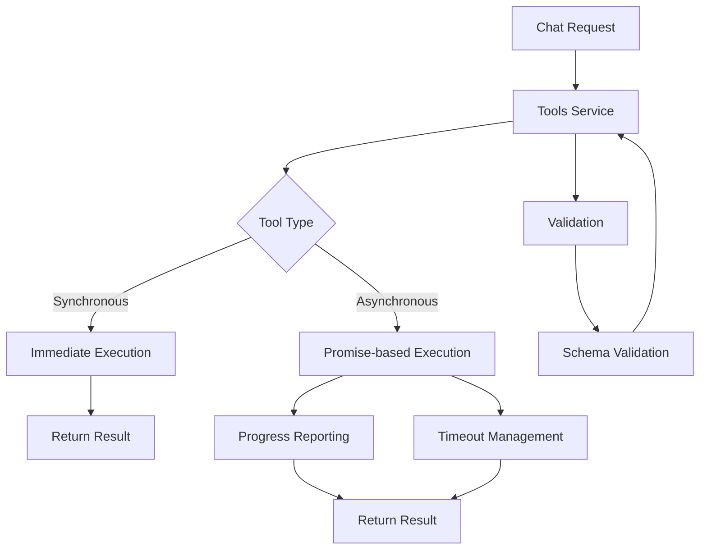
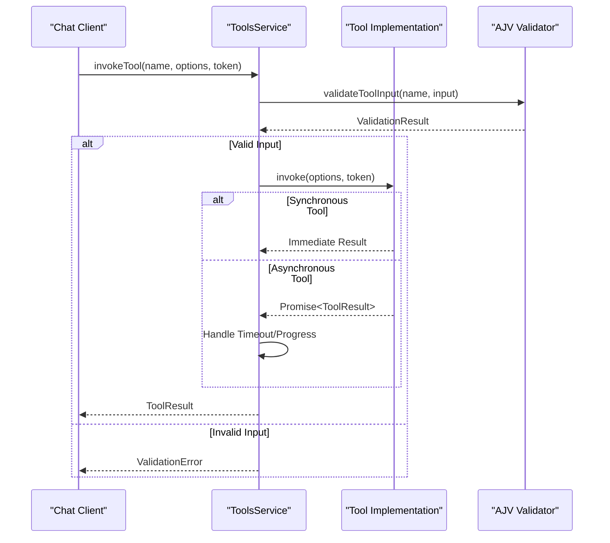
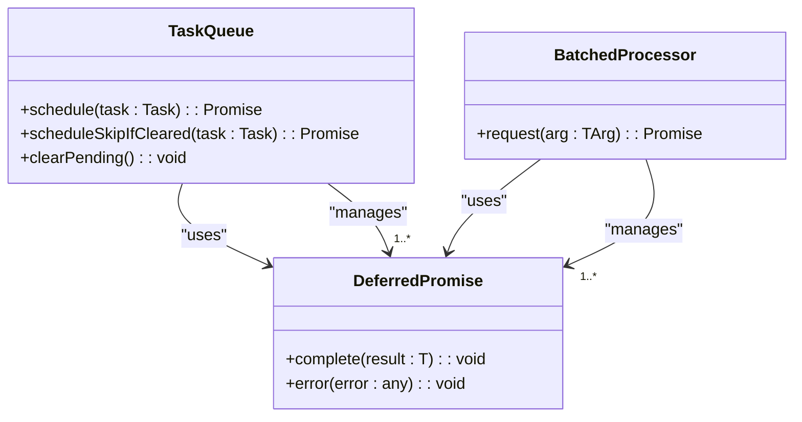

# Synchronous vs Asynchronous Tools

<cite>
**Referenced Files in This Document**   
- [toolsService.ts](file://src/extension/tools/common/toolsService.ts)
- [allTools.ts](file://src/extension/tools/node/allTools.ts)
- [toolsRegistry.ts](file://src/extension/tools/common/toolsRegistry.ts)
- [toolNames.ts](file://src/extension/tools/common/toolNames.ts)
- [async.ts](file://src/util/common/async.ts)
</cite>

## Table of Contents
1. [Introduction](#introduction)
2. [Architecture Overview](#architecture-overview)
3. [Synchronous vs Asynchronous Tool Patterns](#synchronous-vs-asynchronous-tool-patterns)
4. [Tools Service Execution Model](#tools-service-execution-model)
5. [Utility Functions for Asynchronous Operations](#utility-functions-for-asynchronous-operations)
6. [Implementation Examples](#implementation-examples)
7. [Choosing Between Synchronous and Asynchronous Patterns](#choosing-between-synchronous-and-asynchronous-patterns)
8. [Common Issues and Best Practices](#common-issues-and-best-practices)

## Introduction
The vscode-copilot-chat extension implements a sophisticated tool system that supports both synchronous and asynchronous operations. This document analyzes the architectural differences between these two patterns, focusing on how the toolsService handles immediate-result operations versus long-running operations through callbacks and promises. The analysis covers the execution model, timeout management, progress reporting, and utility functions that support asynchronous operations in the extension.

**Section sources**
- [toolsService.ts](file://src/extension/tools/common/toolsService.ts)
- [toolsRegistry.ts](file://src/extension/tools/common/toolsRegistry.ts)

## Architecture Overview
The tool system in vscode-copilot-chat is built around a service-oriented architecture where tools are registered and managed through a centralized toolsService. The architecture supports both synchronous operations for immediate results and asynchronous operations for long-running tasks. The system uses TypeScript interfaces and classes to define tool contracts, validation mechanisms, and execution patterns.

**Diagram sources **
- [toolsService.ts](file://src/extension/tools/common/toolsService.ts)
- [toolsRegistry.ts](file://src/extension/tools/common/toolsRegistry.ts)

**Section sources**
- [toolsService.ts](file://src/extension/tools/common/toolsService.ts)
- [toolsRegistry.ts](file://src/extension/tools/common/toolsRegistry.ts)

## Synchronous vs Asynchronous Tool Patterns
The vscode-copilot-chat extension distinguishes between synchronous and asynchronous tool implementations based on the nature of the operations they perform. Synchronous tools are designed for operations that return immediate results, such as simple file operations or data retrieval that completes quickly. These tools typically execute within a single function call and return their results directly.

Asynchronous tools, on the other hand, are designed for long-running operations such as code analysis, external API calls, or complex computations that may take significant time to complete. These tools leverage JavaScript's Promise-based asynchronous programming model, allowing them to handle operations without blocking the main execution thread. The toolsService is designed to handle both patterns seamlessly, providing appropriate execution contexts and error handling mechanisms for each.

The key architectural difference lies in how these tools are invoked and how their results are returned. Synchronous tools follow a direct call-return pattern, while asynchronous tools use callback functions or Promise chains to deliver results when operations complete. This distinction is crucial for maintaining responsiveness in the extension, especially when dealing with operations that might otherwise block the user interface.

**Section sources**
- [toolsService.ts](file://src/extension/tools/common/toolsService.ts)
- [toolsRegistry.ts](file://src/extension/tools/common/toolsRegistry.ts)
- [toolNames.ts](file://src/extension/tools/common/toolNames.ts)

## Tools Service Execution Model
The toolsService in vscode-copilot-chat implements a sophisticated execution model that handles both synchronous and asynchronous tools through a unified interface. The service acts as a central coordinator for tool invocation, providing consistent behavior across different tool types while accommodating their specific execution characteristics.

The execution model includes several key components: tool registration and discovery, input validation, invocation handling, and result processing. When a tool is invoked, the toolsService first validates the input against the tool's schema using AJV (Another JSON Validator). This validation process is synchronous and ensures that the input conforms to the expected structure before the tool is executed.

For asynchronous tools, the execution model incorporates timeout management to prevent operations from running indefinitely. The service uses cancellation tokens to allow for graceful termination of long-running operations when needed. Progress reporting is implemented through event emitters that notify subscribers about the status of ongoing operations, enabling real-time feedback to the user interface.

The service also handles error propagation consistently across both synchronous and asynchronous tools. When an error occurs, it is wrapped in a standardized format that includes contextual information, making it easier to diagnose issues and provide meaningful feedback to users.

**Diagram sources **
- [toolsService.ts](file://src/extension/tools/common/toolsService.ts)
- [toolsRegistry.ts](file://src/extension/tools/common/toolsRegistry.ts)

**Section sources**
- [toolsService.ts](file://src/extension/tools/common/toolsService.ts)
- [toolsRegistry.ts](file://src/extension/tools/common/toolsRegistry.ts)

## Utility Functions for Asynchronous Operations
The vscode-copilot-chat extension provides a set of utility functions in the async.ts file to manage asynchronous operations effectively. These utilities are designed to address common challenges in asynchronous programming, such as task queuing, batching, and race conditions.

The TaskQueue class implements a first-in-first-out processing model for asynchronous tasks, ensuring that operations are executed in the order they were scheduled. This is particularly useful for maintaining consistency when multiple tools are invoked in quick succession. The queue supports cancellation through the clearPending method, which rejects pending tasks with a CancellationError, allowing for clean termination of operations when needed.

The BatchedProcessor utility enables efficient handling of multiple similar requests by batching them together and processing them in a single operation after a specified waiting period. This reduces the overhead of individual requests and improves performance when dealing with high-frequency operations. The processor uses a timeout mechanism to accumulate requests and then processes them as a batch, returning individual promises for each request.

The raceFilter function provides a mechanism for handling multiple concurrent promises, resolving with the first result that passes a specified filter condition. This is useful in scenarios where multiple data sources are queried simultaneously, and the first valid result should be used. The function ensures that all promises are properly handled, either by resolving with a valid result or rejecting with an error if no valid result is found.

These utility functions form the foundation for robust asynchronous operations in the extension, providing developers with tools to implement efficient and reliable asynchronous patterns.

**Diagram sources **
- [async.ts](file://src/util/common/async.ts)

**Section sources**
- [async.ts](file://src/util/common/async.ts)

## Implementation Examples
The vscode-copilot-chat extension includes a variety of tool implementations that demonstrate both synchronous and asynchronous patterns. The allTools.ts files in the node and vscode-node directories serve as entry points that import and register individual tool implementations.

Synchronous tools in the extension typically include simple file operations such as reading files, listing directories, or retrieving basic workspace information. For example, the readFileTool and listDirTool are likely implemented as synchronous operations since they perform straightforward file system queries that return results quickly. These tools follow a direct invocation pattern where the result is returned immediately upon completion.

Asynchronous tools in the extension handle more complex operations that require significant processing time or external communication. Examples include the codebaseTool for semantic search, the fetchWebPageTool for retrieving web content, and the applyPatchTool for applying code changes. These tools leverage the Promise-based asynchronous model, allowing them to perform their operations without blocking the main thread.

The toolsRegistry.ts file defines the interfaces and registration mechanisms for both tool types, ensuring that they can be discovered and invoked consistently through the toolsService. The ICopilotTool interface extends the base tool definition with additional properties and methods that support both synchronous and asynchronous execution patterns.

The toolNames.ts file provides a comprehensive enumeration of all available tools, categorizing them by their functionality and implementation characteristics. This categorization helps in understanding which tools are likely to be synchronous versus asynchronous based on their purpose and expected execution time.

**Section sources**
- [allTools.ts](file://src/extension/tools/node/allTools.ts)
- [toolsRegistry.ts](file://src/extension/tools/common/toolsRegistry.ts)
- [toolNames.ts](file://src/extension/tools/common/toolNames.ts)

## Choosing Between Synchronous and Asynchronous Patterns
When implementing tools in the vscode-copilot-chat extension, developers must carefully consider whether to use a synchronous or asynchronous pattern based on several factors. The primary consideration is operation duration: operations that complete quickly (typically under 50ms) are suitable for synchronous implementation, while longer-running operations should be implemented asynchronously to maintain UI responsiveness.

User experience is another critical factor. Synchronous operations provide immediate feedback but can make the interface feel unresponsive if they take too long. Asynchronous operations allow for progress reporting and cancellation, providing a better user experience for long-running tasks. However, they add complexity to the implementation and require careful handling of edge cases such as cancellation and timeout.

Resource utilization is also important. Synchronous operations are simpler to implement and debug but can block the main thread, potentially affecting other extension functionality. Asynchronous operations allow for better resource utilization and can be optimized through techniques like batching and queuing, but they require more sophisticated error handling and state management.

For operations that involve external systems (API calls, network requests) or complex computations (code analysis, search operations), the asynchronous pattern is almost always preferred. For simple data retrieval or manipulation operations that are guaranteed to complete quickly, the synchronous pattern may be more appropriate due to its simplicity and predictability.

**Section sources**
- [toolsService.ts](file://src/extension/tools/common/toolsService.ts)
- [async.ts](file://src/util/common/async.ts)

## Common Issues and Best Practices
Implementing both synchronous and asynchronous tools in the vscode-copilot-chat extension presents several common challenges that developers should be aware of. Blocking operations are a primary concern with synchronous tools, as they can make the extension unresponsive if not carefully managed. To mitigate this, developers should ensure that synchronous operations are truly lightweight and complete quickly.

Race conditions can occur when multiple asynchronous operations access shared resources simultaneously. The extension's utility functions, particularly the TaskQueue, help prevent race conditions by ensuring that operations are processed sequentially. Developers should also use appropriate locking mechanisms or atomic operations when modifying shared state.

Timeout management is crucial for asynchronous operations to prevent them from running indefinitely. The toolsService incorporates timeout handling, but individual tool implementations should also include appropriate timeouts for external operations like network requests. This ensures that operations fail gracefully rather than hanging indefinitely.

Error handling consistency is important across both synchronous and asynchronous tools. All errors should be properly wrapped and include sufficient context for debugging. The extension's standardized error format helps maintain consistency and provides meaningful feedback to users.

Best practices include using the provided utility functions for common asynchronous patterns, implementing proper cancellation support through cancellation tokens, and providing clear progress feedback for long-running operations. Developers should also thoroughly test both success and failure paths for their tools, including edge cases like network failures and invalid inputs.

**Section sources**
- [toolsService.ts](file://src/extension/tools/common/toolsService.ts)
- [async.ts](file://src/util/common/async.ts)
- [toolsRegistry.ts](file://src/extension/tools/common/toolsRegistry.ts)