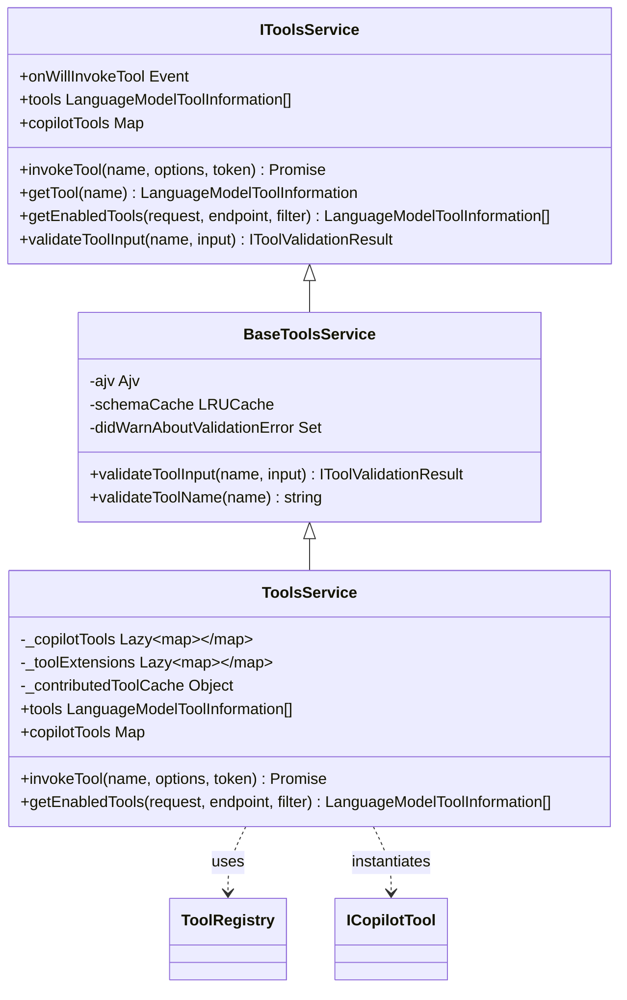
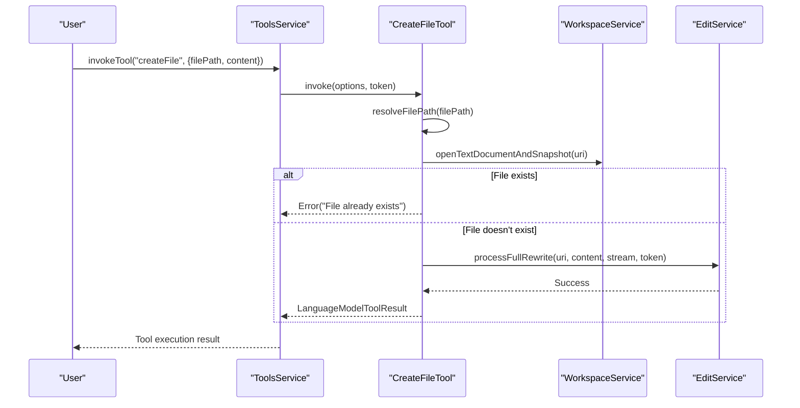
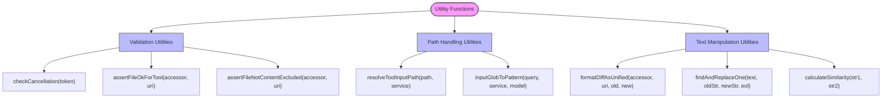
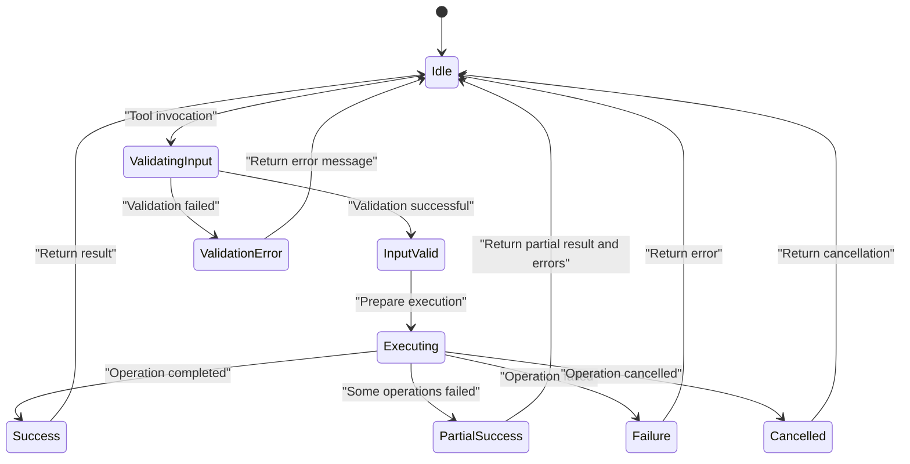

# Tool Composition Patterns

<cite>
**Referenced Files in This Document**   
- [toolsService.ts](file://src/extension/tools/common/toolsService.ts)
- [allTools.ts](file://src/extension/tools/node/allTools.ts)
- [toolUtils.ts](file://src/extension/tools/common/toolUtils.ts)
- [toolUtils.ts](file://src/extension/tools/node/toolUtils.ts)
- [toolsRegistry.ts](file://src/extension/tools/common/toolsRegistry.ts)
- [createFileTool.tsx](file://src/extension/tools/node/createFileTool.tsx)
- [editFileToolUtils.tsx](file://src/extension/tools/node/editFileToolUtils.tsx)
- [replaceStringTool.tsx](file://src/extension/tools/node/replaceStringTool.tsx)
- [multiReplaceStringTool.tsx](file://src/extension/tools/node/multiReplaceStringTool.tsx)
</cite>

## Table of Contents
1. [Introduction](#introduction)
2. [Tool Composition Fundamentals](#tool-composition-fundamentals)
3. [Tools Service Architecture](#tools-service-architecture)
4. [Composite Tool Implementation Patterns](#composite-tool-implementation-patterns)
5. [Utility Functions for Tool Composition](#utility-functions-for-tool-composition)
6. [Advanced Composition Patterns](#advanced-composition-patterns)
7. [Error Handling in Composed Workflows](#error-handling-in-composed-workflows)
8. [Best Practices for Composable Tool Design](#best-practices-for-composable-tool-design)
9. [Performance Considerations](#performance-considerations)

## Introduction
The vscode-copilot-chat extension implements a sophisticated tool composition system that enables complex workflows through the coordination of multiple tools. This document explores the patterns and mechanisms used to combine tools for accomplishing multi-step tasks, manage dependencies, and execute operations in sequence, parallel, or conditional arrangements. The system provides a robust framework for creating composite operations that appear as single, cohesive actions to users while orchestrating multiple underlying tool invocations.

## Tool Composition Fundamentals
The tool composition system in vscode-copilot-chat is built around the concept of combining multiple atomic tools into higher-order composite operations. This enables the extension to perform complex tasks that require multiple steps, such as creating a file and then adding content to it, or making coordinated changes across multiple files. The composition patterns are implemented through a combination of tool registration, service coordination, and utility functions that facilitate the chaining and sequencing of operations.

The foundation of tool composition lies in the tools registry and service architecture, which provides the infrastructure for managing tool dependencies and execution order. Tools are registered through the ToolRegistry, which maintains a collection of tool constructors that can be instantiated as needed. This registry pattern allows for dynamic discovery and composition of tools at runtime, enabling flexible workflows that can adapt to different contexts and requirements.

**Diagram sources**
- [toolsService.ts](file://src/extension/tools/common/toolsService.ts#L1-L254)
- [toolsRegistry.ts](file://src/extension/tools/common/toolsRegistry.ts#L1-L106)

**Section sources**
- [toolsService.ts](file://src/extension/tools/common/toolsService.ts#L1-L254)
- [toolsRegistry.ts](file://src/extension/tools/common/toolsRegistry.ts#L1-L106)

## Tools Service Architecture
The tools service architecture provides the core infrastructure for managing tool composition and execution. The IToolsService interface defines the contract for tool management, including methods for invoking tools, retrieving tool information, and validating tool inputs. The implementation follows a layered pattern with BaseToolsService providing common functionality and ToolsService extending it with VS Code-specific capabilities.

The service manages tool dependencies through a lazy initialization pattern, where tool instances are created only when needed. This is implemented using the Lazy class, which ensures that tools are instantiated on first access, reducing startup overhead and memory usage. The service also maintains a cache of contributed tools, which optimizes performance by avoiding redundant processing of tool information.

Tool execution order is managed through the getEnabledTools method, which applies filtering logic to determine which tools should be available for a given request. This method considers multiple factors, including explicit user preferences, tool picker selections, and model-specific requirements. The filtering process allows for conditional execution of tools based on context, enabling sophisticated composition patterns where certain tools are only available when specific conditions are met.

The service also handles tool validation through a schema-based approach using AJV (Another JSON Validator). Tool inputs are validated against JSON schemas defined for each tool, with automatic coercion of types and handling of nested JSON strings. This ensures that tool inputs are properly formatted before execution, reducing errors and improving reliability.

**Section sources**
- [toolsService.ts](file://src/extension/tools/common/toolsService.ts#L1-L254)
- [toolsService.ts](file://src/extension/tools/vscode-node/toolsService.ts#L1-L155)

## Composite Tool Implementation Patterns
The extension implements several patterns for creating composite tools that coordinate multiple operations. These patterns are demonstrated through specific tool implementations that show how atomic operations can be combined into more complex workflows.

One key pattern is the sequential composition of file operations, exemplified by the CreateFileTool. This tool coordinates the creation of a new file with the addition of initial content, effectively combining what would otherwise be two separate operations into a single atomic action. The tool first validates the file path and checks for existing files, then processes the content (potentially removing markdown comments), and finally invokes the appropriate edit service to create the file with the specified content.

**Diagram sources**
- [createFileTool.tsx](file://src/extension/tools/node/createFileTool.tsx#L1-L201)
- [editFileToolUtils.tsx](file://src/extension/tools/node/editFileToolUtils.tsx#L1-L800)

Another important pattern is the batch processing of multiple edits, implemented in the MultiReplaceStringTool. This tool accepts an array of replacement operations and processes them as a single coordinated action. It first prepares all edits, then merges successful edits to the same file to ensure they are applied in the correct order, and finally applies all changes in a single transaction. This pattern improves performance by reducing the number of separate edit operations and ensures consistency by treating multiple changes as an atomic unit.

The AbstractReplaceStringTool provides a reusable base class for string replacement operations, demonstrating the template method pattern. This abstract class defines the common workflow for string replacement (prepare edits, validate, apply), while allowing concrete implementations to specify the details of how replacement inputs are extracted from the tool parameters. This promotes code reuse and ensures consistent behavior across different string manipulation tools.

**Section sources**
- [createFileTool.tsx](file://src/extension/tools/node/createFileTool.tsx#L1-L201)
- [replaceStringTool.tsx](file://src/extension/tools/node/replaceStringTool.tsx#L1-L41)
- [multiReplaceStringTool.tsx](file://src/extension/tools/node/multiReplaceStringTool.tsx#L1-L152)
- [editFileToolUtils.tsx](file://src/extension/tools/node/editFileToolUtils.tsx#L1-L800)

## Utility Functions for Tool Composition
The tool composition system is supported by a collection of utility functions that facilitate common operations and error handling. These utilities are organized in the toolUtils modules and provide essential functionality for building robust composite tools.

Key utility functions include:

- **checkCancellation**: A helper that throws a CancellationError if the provided CancellationToken has been triggered, enabling responsive cancellation of long-running operations.
- **inputGlobToPattern**: Converts user input globs or file paths into VS Code glob patterns, with special handling for different language model families.
- **resolveToolInputPath**: Resolves a tool input path to a URI, throwing an error if the path is invalid.
- **assertFileOkForTool**: Validates that a file can be safely modified by a tool, checking workspace boundaries and ignore settings.
- **assertFileNotContentExcluded**: Ensures a file is not configured to be ignored by Copilot.

These utilities promote consistency across tools by providing standardized implementations of common validation and preparation tasks. They also handle edge cases and platform-specific considerations, such as path normalization and security checks.

The editFileToolUtils module contains specialized functions for text manipulation and diff generation. The formatDiffAsUnified function creates unified diff strings from text changes, providing visual feedback on proposed edits. The findAndReplaceOne function implements multiple matching strategies (exact, whitespace-flexible, fuzzy, and similarity-based) to locate text for replacement, increasing the robustness of edit operations in the face of formatting differences.

**Diagram sources**
- [toolUtils.ts](file://src/extension/tools/node/toolUtils.ts#L1-L126)
- [editFileToolUtils.tsx](file://src/extension/tools/node/editFileToolUtils.tsx#L1-L800)

**Section sources**
- [toolUtils.ts](file://src/extension/tools/common/toolUtils.ts#L1-L18)
- [toolUtils.ts](file://src/extension/tools/node/toolUtils.ts#L1-L126)
- [editFileToolUtils.tsx](file://src/extension/tools/node/editFileToolUtils.tsx#L1-L800)

## Advanced Composition Patterns
The extension implements several advanced composition patterns that enable sophisticated workflows and improve the reliability of tool execution.

One such pattern is transactional execution with rollback capabilities, demonstrated in the multi-file edit tools. When multiple files are modified in a single operation, the system tracks all changes and can revert them if an error occurs. This ensures that partial changes are not left in an inconsistent state. The MultiReplaceStringTool implements this by preparing all edits before applying any, then merging successful edits to minimize the number of separate operations.

Parallel execution is another advanced pattern used for independent operations. While the current implementation primarily uses sequential execution, the architecture supports parallel processing through the use of Promise-based asynchronous operations. Tools that operate on different files or resources could potentially execute in parallel, improving performance for batch operations.

Conditional execution is implemented through the tool filtering mechanism in getEnabledTools. This allows tools to be enabled or disabled based on context, such as the current model, user preferences, or the outcome of previous tool calls. The filtering process supports complex logic, including explicit enable/disable directives, tag-based rules, and extension installation status.

The system also supports tool chaining through the tool calling loop, where the output of one tool can influence the invocation of subsequent tools. This is facilitated by the tool reference system, which allows tools to be referenced in prompts and their outputs to be incorporated into subsequent requests. The prompt variable resolution service handles the substitution of tool references with their results, enabling dynamic composition of tool workflows.

**Section sources**
- [multiReplaceStringTool.tsx](file://src/extension/tools/node/multiReplaceStringTool.tsx#L1-L152)
- [toolsService.ts](file://src/extension/tools/vscode-node/toolsService.ts#L1-L155)
- [promptVariablesService.spec.ts](file://src/extension/prompt/vscode-node/test/promptVariablesService.spec.ts#L61-L74)

## Error Handling in Composed Workflows
The tool composition system implements comprehensive error handling strategies to ensure reliability and provide meaningful feedback to users. Errors are categorized and handled appropriately based on their type and origin.

Input validation errors are caught early through the schema validation system, with detailed error messages returned to the user. The validateToolInput method uses AJV to validate inputs against JSON schemas, automatically handling type coercion and nested JSON strings. When validation fails, the system provides specific error messages that help users correct their input.

Execution errors are handled through structured exception types that convey both the error message and a telemetry-friendly error kind. The EditError hierarchy includes specific error types for common scenarios such as NoMatchError, MultipleMatchesError, and NoChangeError. These specialized error types allow for targeted error handling and appropriate user feedback.

Cancellation is handled consistently across tools through the CancellationToken mechanism. The checkCancellation utility function ensures that long-running operations can be interrupted when requested, and the ToolCallCancelledError wraps cancellation exceptions with additional context.

For composite operations, the system implements partial failure handling. In batch operations like MultiReplaceStringTool, individual failures do not prevent the entire operation from completing. Instead, the tool tracks successes and failures separately, applies successful changes, and reports failures for user awareness. This approach maximizes the utility of composite operations even when some components fail.

**Diagram sources**
- [toolsService.ts](file://src/extension/tools/common/toolsService.ts#L1-L254)
- [editFileToolUtils.tsx](file://src/extension/tools/node/editFileToolUtils.tsx#L1-L800)

**Section sources**
- [toolsService.ts](file://src/extension/tools/common/toolsService.ts#L1-L254)
- [editFileToolUtils.tsx](file://src/extension/tools/node/editFileToolUtils.tsx#L1-L800)

## Best Practices for Composable Tool Design
Based on the implementation patterns in the vscode-copilot-chat extension, several best practices emerge for designing composable tools with clear interfaces and predictable behavior.

First, tools should have well-defined, narrow responsibilities. Each tool should perform a single, atomic operation that can be reliably composed with others. This follows the Unix philosophy of "do one thing well" and enables flexible composition patterns. The extension demonstrates this with separate tools for file creation, reading, and editing, rather than a single monolithic file tool.

Second, tools should provide clear, consistent interfaces through standardized input schemas and error reporting. The use of JSON schemas for input validation ensures that tools receive properly formatted data, while structured error types provide meaningful feedback. The extension's use of the IToolValidationResult union type (with IValidatedToolInput and IToolValidationError) provides a clear contract for validation outcomes.

Third, tools should be idempotent when possible, meaning that multiple invocations with the same parameters produce the same result. This property is essential for reliable composition, as it allows tools to be retried or re-executed without unintended side effects. The CreateFileTool demonstrates this by checking for existing files and failing with a clear error rather than overwriting.

Fourth, tools should provide appropriate feedback through both return values and side effects. The extension uses LanguageModelToolResult objects to return structured results, while also updating the UI through stream notifications (e.g., textEdit, notebookEdit). This dual approach ensures that both the language model and the user receive appropriate feedback.

Finally, tools should be designed with composition in mind from the beginning. This includes providing utility functions for common operations, using abstract base classes for related functionality, and ensuring that tools can be easily combined through standard patterns like chaining, batching, and conditional execution.

**Section sources**
- [toolsRegistry.ts](file://src/extension/tools/common/toolsRegistry.ts#L1-L106)
- [createFileTool.tsx](file://src/extension/tools/node/createFileTool.tsx#L1-L201)
- [multiReplaceStringTool.tsx](file://src/extension/tools/node/multiReplaceStringTool.tsx#L1-L152)

## Performance Considerations
The tool composition system incorporates several performance optimizations to ensure responsive operation and efficient resource usage.

Lazy initialization of tool instances reduces startup time and memory consumption by deferring object creation until first use. The Lazy class wraps the tool map in the ToolsService, ensuring that tools are only instantiated when actually needed for execution.

Caching is used extensively to avoid redundant operations. The BaseToolsService maintains an LRUCache of compiled JSON schemas, preventing the need to recompile schemas for frequently used tools. The ToolsService also caches processed tool information, avoiding repeated sorting and transformation of the contributed tools list.

Batching is employed to minimize the number of separate edit operations. The MultiReplaceStringTool merges successful edits to the same file, reducing the overhead of multiple separate edit invocations. This is particularly important for performance, as each edit operation may trigger UI updates and other side effects.

Asynchronous execution is used throughout the system to prevent blocking the main thread. All tool operations return Promises, allowing for non-blocking execution and enabling parallel processing where appropriate. The use of CancellationToken ensures that long-running operations can be cancelled efficiently.

The system also optimizes for common patterns through specialized implementations. For example, the inputGlobToPattern function includes a workaround for GPT-4.1's difficulty with glob patterns, appending '/**' automatically to improve success rates without requiring additional model processing.

**Section sources**
- [toolsService.ts](file://src/extension/tools/common/toolsService.ts#L1-L254)
- [toolsService.ts](file://src/extension/tools/vscode-node/toolsService.ts#L1-L155)
- [multiReplaceStringTool.tsx](file://src/extension/tools/node/multiReplaceStringTool.tsx#L1-L152)