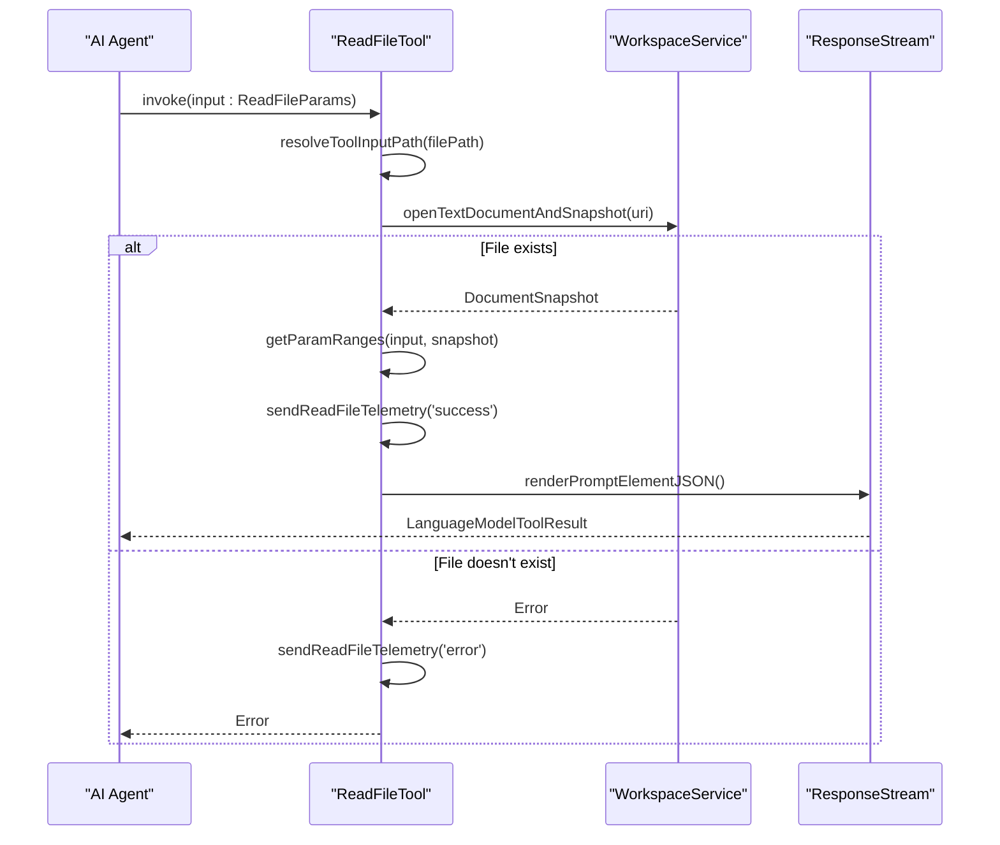
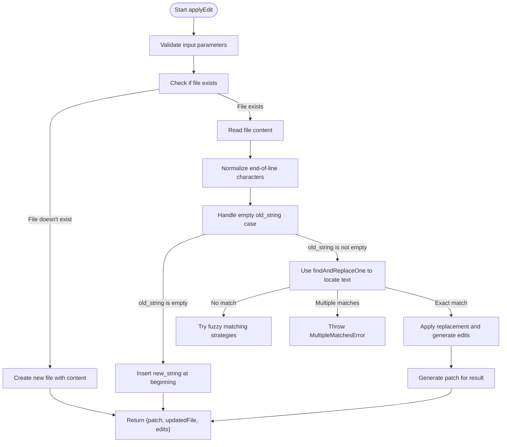
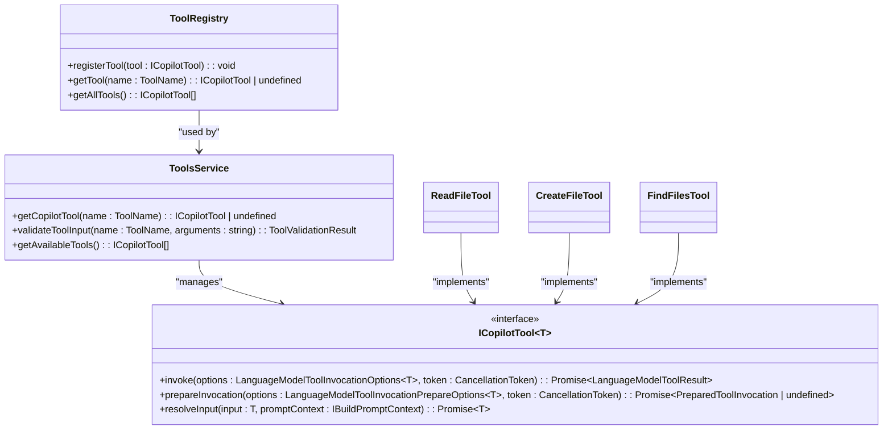

# Tool Implementation Patterns

<cite>
**Referenced Files in This Document**   
- [abstractReplaceStringTool.tsx](file://src/extension/tools/node/abstractReplaceStringTool.tsx)
- [editFileToolUtils.tsx](file://src/extension/tools/node/editFileToolUtils.tsx)
- [toolUtils.ts](file://src/extension/tools/common/toolUtils.ts)
- [replaceStringTool.tsx](file://src/extension/tools/node/replaceStringTool.tsx)
- [multiReplaceStringTool.tsx](file://src/extension/tools/node/multiReplaceStringTool.tsx)
- [readFileTool.tsx](file://src/extension/tools/node/readFileTool.tsx)
- [createFileTool.tsx](file://src/extension/tools/node/createFileTool.tsx)
- [findFilesTool.tsx](file://src/extension/tools/node/findFilesTool.tsx)
- [allTools.ts](file://src/extension/tools/node/allTools.ts)
</cite>

## Table of Contents
1. [Introduction](#introduction)
2. [Core Base Classes](#core-base-classes)
3. [Text Modification Tools](#text-modification-tools)
4. [File Operation Tools](#file-operation-tools)
5. [Utility Functions](#utility-functions)
6. [Advanced Tool Patterns](#advanced-tool-patterns)
7. [Error Handling and Validation](#error-handling-and-validation)
8. [Performance Considerations](#performance-considerations)

## Introduction
The vscode-copilot-chat extension implements a comprehensive tool system that enables AI agents to interact with the development environment through structured tool calls. This documentation details the implementation patterns for various tool types, focusing on the foundational abstractReplaceStringTool pattern for text modifications, utility functions for common operations, and advanced patterns for complex tool interactions. The system supports synchronous, asynchronous, and streaming operations while maintaining robust error handling and performance optimization.

## Core Base Classes

The tool implementation system in vscode-copilot-chat is built around a well-defined class hierarchy that provides common functionality and ensures consistent behavior across different tool types. The core base classes establish the foundation for tool execution, parameter handling, and result formatting.

**Section sources**
- [abstractReplaceStringTool.tsx](file://src/extension/tools/node/abstractReplaceStringTool.tsx#L63-L582)

## Text Modification Tools

### abstractReplaceStringTool Foundation
The `AbstractReplaceStringTool` serves as the foundational pattern for all text modification tools in the vscode-copilot-chat extension. This abstract base class implements the core functionality for replacing text in files, handling various edge cases, and providing consistent error reporting. It defines the interface for text replacement operations and provides common utilities for preparing and applying edits.

The class implements a caching mechanism for prepared edits to avoid redundant processing when the same input is processed multiple times. It also handles conflict detection between multiple edits to the same file, ensuring that overlapping changes are properly reported to prevent data corruption.

```mermaid
classDiagram
class AbstractReplaceStringTool~T~ {
+_promptContext : IBuildPromptContext
-lastOperation : {inputKey : string, operation : Promise~IPrepareEdit[]~}
+invoke(options : LanguageModelToolInvocationOptions~T~, token : CancellationToken) : Promise~LanguageModelToolResult~
+prepareEdits(options : LanguageModelToolInvocationOptions~T~ | LanguageModelToolInvocationPrepareOptions~T~, token : CancellationToken) : Promise~IPrepareEdit[]~
+applyAllEdits(options : LanguageModelToolInvocationOptions~T~, edits : IPrepareEdit[], token : CancellationToken) : Promise~LanguageModelToolResult~
+resolveInput(input : T, promptContext : IBuildPromptContext) : Promise~T~
+prepareInvocation(options : LanguageModelToolInvocationPrepareOptions~T~, token : CancellationToken) : Promise~PreparedToolInvocation~
#extractReplaceInputs(input : T) : IAbstractReplaceStringInput[]
#toolName() : ToolName
#generateEdit(uri : URI, document : TextDocumentSnapshot | NotebookDocumentSnapshot, options : LanguageModelToolInvocationOptions~T~ | LanguageModelToolInvocationPrepareOptions~T~, input : IAbstractReplaceStringInput, didHealRef : {healed? : IAbstractReplaceStringInput}, token : CancellationToken) : Promise~{edits : TextEdit[], updatedFile : string}~
#sendReplaceTelemetry(outcome : string, options : LanguageModelToolInvocationOptions~T~ | LanguageModelToolInvocationPrepareOptions~T~, input : IAbstractReplaceStringInput, file : string | undefined, isNotebookDocument : boolean | undefined, didHeal : boolean | undefined) : Promise~void~
}
class ReplaceStringTool {
+toolName : ToolName
#extractReplaceInputs(input : IReplaceStringToolParams) : IAbstractReplaceStringInput[]
#toolName() : ToolName
+invoke(options : LanguageModelToolInvocationOptions~IReplaceStringToolParams~, token : CancellationToken) : Promise~LanguageModelToolResult~
}
class MultiReplaceStringTool {
+toolName : ToolName
#extractReplaceInputs(input : IMultiReplaceStringToolParams) : IAbstractReplaceStringInput[]
}
AbstractReplaceStringTool~T~ <|-- ReplaceStringTool
AbstractReplaceStringTool~T~ <|-- MultiReplaceStringTool
AbstractReplaceStringTool~T~ --> IAbstractReplaceStringInput
AbstractReplaceStringTool~T~ --> IPrepareEdit
```

**Diagram sources **
- [abstractReplaceStringTool.tsx](file://src/extension/tools/node/abstractReplaceStringTool.tsx#L63-L582)
- [replaceStringTool.tsx](file://src/extension/tools/node/replaceStringTool.tsx#L18-L40)
- [multiReplaceStringTool.tsx](file://src/extension/tools/node/multiReplaceStringTool.tsx#L20-L29)

### ReplaceStringTool Implementation
The `ReplaceStringTool` is a concrete implementation of the `AbstractReplaceStringTool` that handles single-file text replacements. It defines the specific input parameters required for replacing text in a file, including the file path, the old string to be replaced, and the new string to insert. The tool extracts these parameters and converts them into the format expected by the base class.

This tool is registered with the `ToolRegistry` to make it available for use by AI agents. It implements the `extractReplaceInputs` method to transform its specific input type into the generic `IAbstractReplaceStringInput` format used by the base class, allowing the shared implementation to handle the actual text replacement logic.

**Section sources**
- [replaceStringTool.tsx](file://src/extension/tools/node/replaceStringTool.tsx#L1-L40)

### MultiReplaceStringTool Implementation
The `MultiReplaceStringTool` extends the `AbstractReplaceStringTool` to handle multiple file replacements in a single operation. It accepts an array of replacement operations, each specifying a file path, old string, and new string. This tool is particularly useful for making coordinated changes across multiple files, such as renaming a variable or updating a function signature across a codebase.

The tool implements the `extractReplaceInputs` method to flatten the array of replacements into individual `IAbstractReplaceStringInput` objects, which are then processed by the base class implementation. This allows the tool to leverage the same robust text replacement logic while supporting bulk operations.

**Section sources**
- [multiReplaceStringTool.tsx](file://src/extension/tools/node/multiReplaceStringTool.tsx#L1-L29)

## File Operation Tools

### readFileTool Implementation
The `ReadFileTool` enables AI agents to read the contents of files in the workspace. It supports both version 1 and version 2 of the input parameters, with version 2 introducing offset and limit parameters for reading large files in chunks. The tool validates that the requested file exists and is accessible before attempting to read it.

The implementation includes telemetry tracking to monitor usage patterns and performance. It also handles different file types, including regular text files and notebook documents, providing appropriate snapshots for each type. The tool truncates output at 2000 lines by default and can be called repeatedly with offset and limit parameters to read larger files incrementally.



**Diagram sources **
- [readFileTool.tsx](file://src/extension/tools/node/readFileTool.tsx#L107-L296)

### createFileTool Implementation
The `CreateFileTool` allows AI agents to create new files in the workspace. It validates that the target file does not already exist and that the file path is valid before proceeding with creation. The tool supports both regular text files and notebook documents, using different processing logic for each type.

For notebook documents, the tool uses the `processFullRewriteNewNotebook` function to create the notebook with the specified content. For regular text files, it uses the `processFullRewrite` function to create the file. The tool also handles code blocks within the content, extracting the actual code to be written to the file.

**Section sources**
- [createFileTool.tsx](file://src/extension/tools/node/createFileTool.tsx#L43-L201)

### findFilesTool Implementation
The `FindFilesTool` enables AI agents to search for files in the workspace using glob patterns. It integrates with the VS Code search service to perform efficient file searches and returns the results in a structured format. The tool supports limiting the number of results returned and handles cancellation and timeout scenarios gracefully.

The implementation includes input normalization to ensure that search queries are properly formatted as glob patterns. It also supports different model families, adjusting the search pattern format based on the capabilities of the underlying AI model.

**Section sources**
- [findFilesTool.tsx](file://src/extension/tools/node/findFilesTool.tsx#L30-L140)

## Utility Functions

### editFileToolUtils Functions
The `editFileToolUtils.tsx` file contains a collection of utility functions that support file editing operations across various tools. These functions provide common functionality for applying edits, formatting diffs, and handling error conditions.

The `applyEdit` function is a key utility that applies text edits to files using VS Code's workspace API. It handles various edge cases, such as creating new files, deleting content, and handling whitespace differences. The function uses multiple matching strategies to find the text to replace, including exact matching, whitespace-flexible matching, fuzzy matching, and similarity-based matching.



**Diagram sources **
- [editFileToolUtils.tsx](file://src/extension/tools/node/editFileToolUtils.tsx#L560-L682)

### Error Handling Utilities
The utility functions include a comprehensive error handling system with specific error classes for different failure modes. These include `EditError` as the base class, with derived classes such as `NoMatchError`, `MultipleMatchesError`, `NoChangeError`, and `ContentFormatError`. Each error type includes a `kindForTelemetry` property that enables detailed error tracking and analysis.

The error handling system provides informative messages that help users understand why an edit failed and how to correct the issue. For example, when a text replacement fails due to no matching content, the error message suggests making the search string more specific or checking for whitespace/formatting differences.

**Section sources**
- [editFileToolUtils.tsx](file://src/extension/tools/node/editFileToolUtils.tsx#L49-L89)

### Confirmation and Safety Utilities
The `editFileToolUtils` module includes functions for ensuring the safety of file operations. The `makeUriConfirmationChecker` function determines whether a file should require user confirmation before editing based on its location and sensitivity. Files outside the workspace, in system directories, or marked as sensitive require explicit user approval.

The `createEditConfirmation` function generates confirmation messages for potentially dangerous operations, providing detailed information about the files to be modified and the nature of the changes. This safety mechanism prevents accidental modifications to important system files or files outside the current project.

**Section sources**
- [editFileToolUtils.tsx](file://src/extension/tools/node/editFileToolUtils.tsx#L800-L921)

### toolUtils Functions
The `toolUtils.ts` file contains utility functions for common operations across different tools. The `formatUriForFileWidget` function converts URIs into formatted strings that can be displayed as file widgets in the UI. This function handles both simple URIs and location objects with range information, generating appropriate markdown links.

These utility functions are designed to be lightweight and focused, providing specific functionality that can be reused across multiple tool implementations. They follow a functional programming style, with pure functions that have no side effects and clear input/output contracts.

**Section sources**
- [toolUtils.ts](file://src/extension/tools/common/toolUtils.ts#L9-L17)

## Advanced Tool Patterns

### Tool Composition and Chaining
The vscode-copilot-chat extension supports advanced patterns for tool composition and chaining, allowing multiple tools to be used together to accomplish complex tasks. The `allTools.ts` file imports and registers all available tools, making them accessible to AI agents.

The system supports parallel tool execution, where multiple tools can be invoked simultaneously when appropriate. This is particularly useful for operations that are independent of each other, such as reading multiple files or performing searches across different scopes.



**Diagram sources **
- [allTools.ts](file://src/extension/tools/node/allTools.ts#L1-L42)
- [toolsRegistry.ts](file://src/extension/tools/common/toolsRegistry.ts)
- [toolsService.ts](file://src/extension/tools/common/toolsService.ts)

### Conditional Execution
The tool system supports conditional execution patterns, where the invocation of one tool depends on the results of another. This is implemented through the `prepareInvocation` method, which can perform preliminary checks and return early if certain conditions are not met.

For example, the `ReadFileTool` checks if the requested file exists and is accessible before proceeding with the read operation. If the file cannot be accessed, it throws an error that prevents the tool from being executed. This pattern ensures that tools only operate on valid inputs and prevents cascading failures.

**Section sources**
- [readFileTool.tsx](file://src/extension/tools/node/readFileTool.tsx#L153-L184)

## Error Handling and Validation

### Input Validation Patterns
The tool implementation system follows a consistent pattern for input validation, with validation occurring at multiple levels. The `resolveInput` method performs initial validation and preprocessing of input parameters, while the `invoke` method performs final validation before executing the tool's main logic.

Each tool validates its specific input parameters according to its requirements. For example, the `ReplaceStringTool` validates that the file path, old string, and new string are all provided and non-empty. The validation process includes type checking, format validation, and business rule validation to ensure that inputs are correct and complete.

### Result Formatting and Telemetry
All tools follow a consistent pattern for result formatting, using the `LanguageModelToolResult` class to encapsulate the output. This class supports multiple types of result parts, including text parts, prompt TSX parts, and reference parts, allowing tools to return rich, structured responses.

The system includes comprehensive telemetry tracking for all tool operations, capturing information about invocation success, failure reasons, execution time, and other metrics. This telemetry data is used to monitor tool usage, identify performance bottlenecks, and improve the overall reliability of the system.

**Section sources**
- [abstractReplaceStringTool.tsx](file://src/extension/tools/node/abstractReplaceStringTool.tsx#L349-L369)
- [readFileTool.tsx](file://src/extension/tools/node/readFileTool.tsx#L200-L231)

## Performance Considerations

### Caching and Optimization
The tool system implements several performance optimizations to reduce latency and improve responsiveness. The `AbstractReplaceStringTool` includes a caching mechanism for prepared edits, storing the results of expensive operations like file reading and text matching.

The system also uses lazy loading for tool implementations, only importing and initializing tools when they are first needed. This reduces the initial startup time and memory footprint of the extension. The `allTools.ts` file uses import statements to register tools without immediately instantiating them.

### Memory Management
Long-running tools implement proper memory management practices to prevent memory leaks. They use cancellation tokens to allow operations to be terminated when no longer needed, and they release resources promptly after completing their work.

The system handles large files efficiently by processing them in chunks and using streaming APIs where available. For example, the `ReadFileTool` can read large files incrementally using offset and limit parameters, preventing memory exhaustion when working with very large files.

**Section sources**
- [abstractReplaceStringTool.tsx](file://src/extension/tools/node/abstractReplaceStringTool.tsx#L66-L109)
- [readFileTool.tsx](file://src/extension/tools/node/readFileTool.tsx#L68-L95)