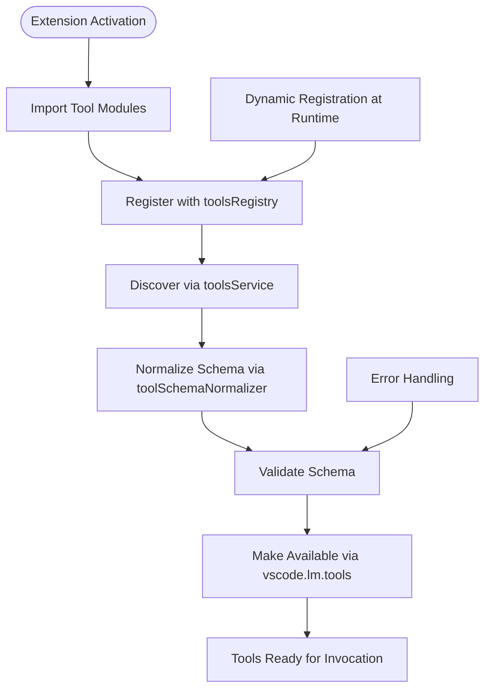
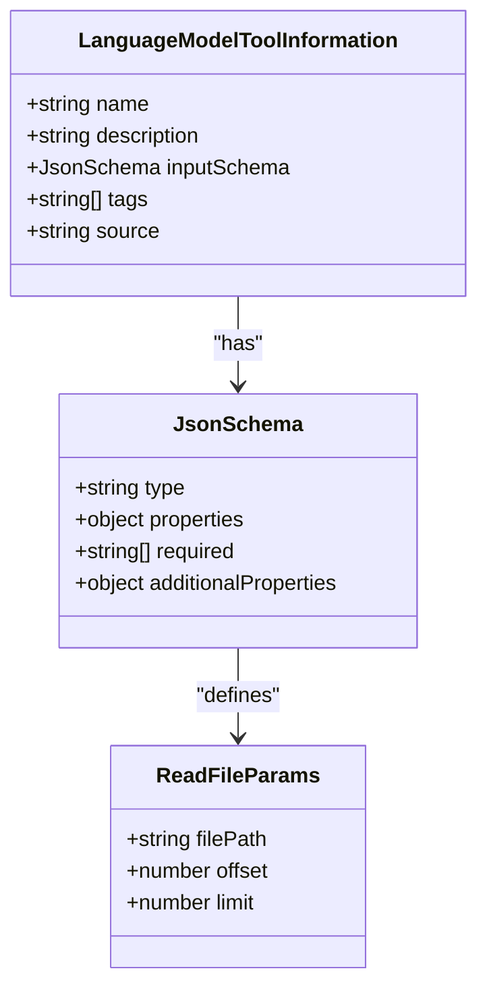
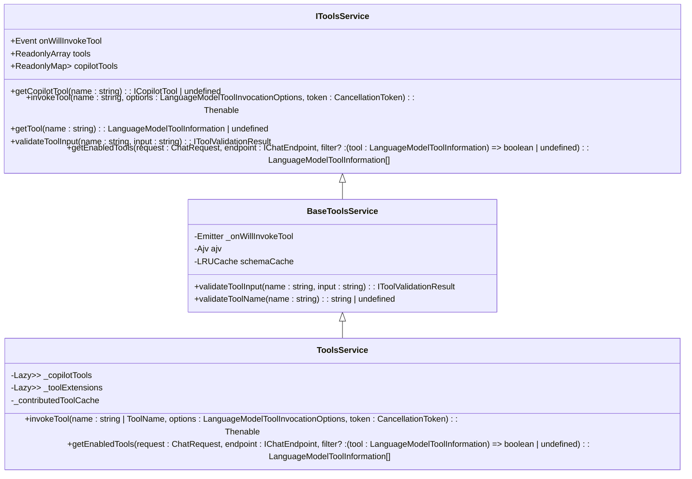
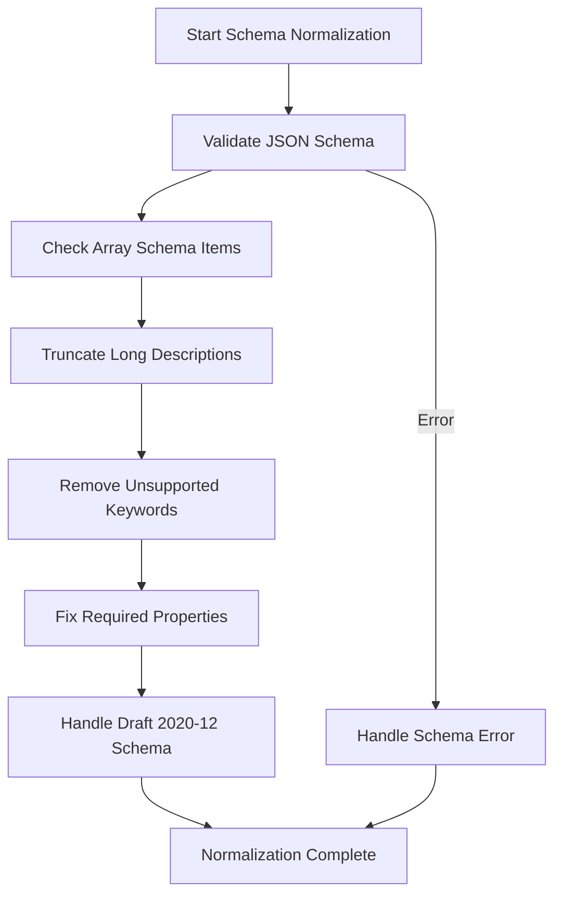
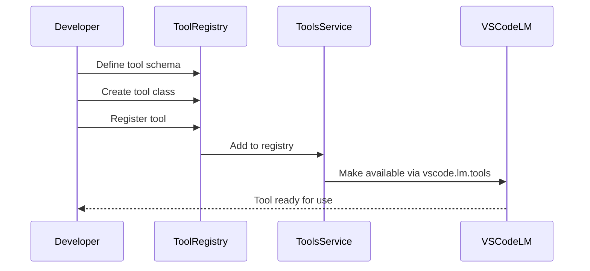
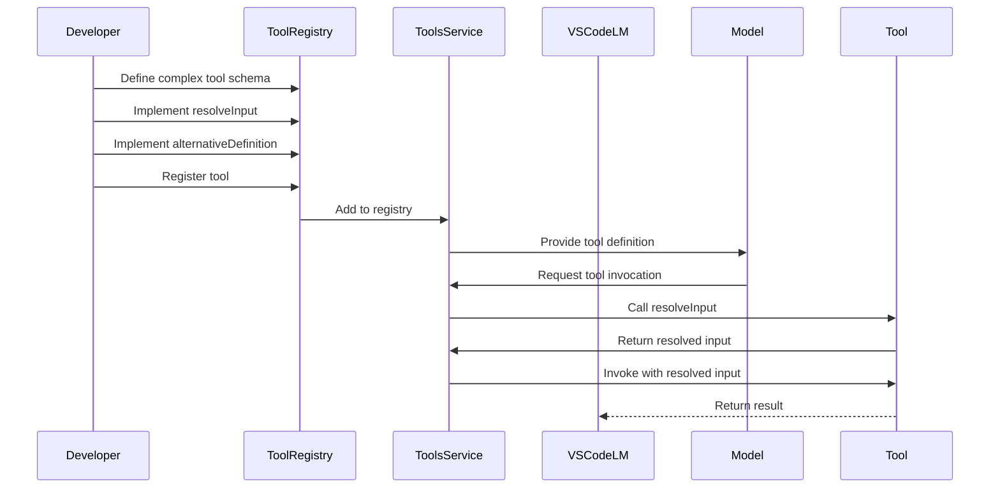
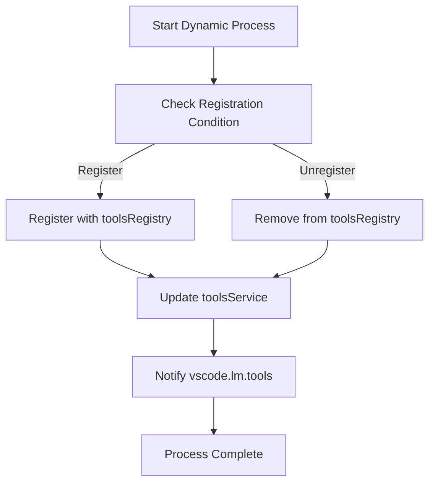
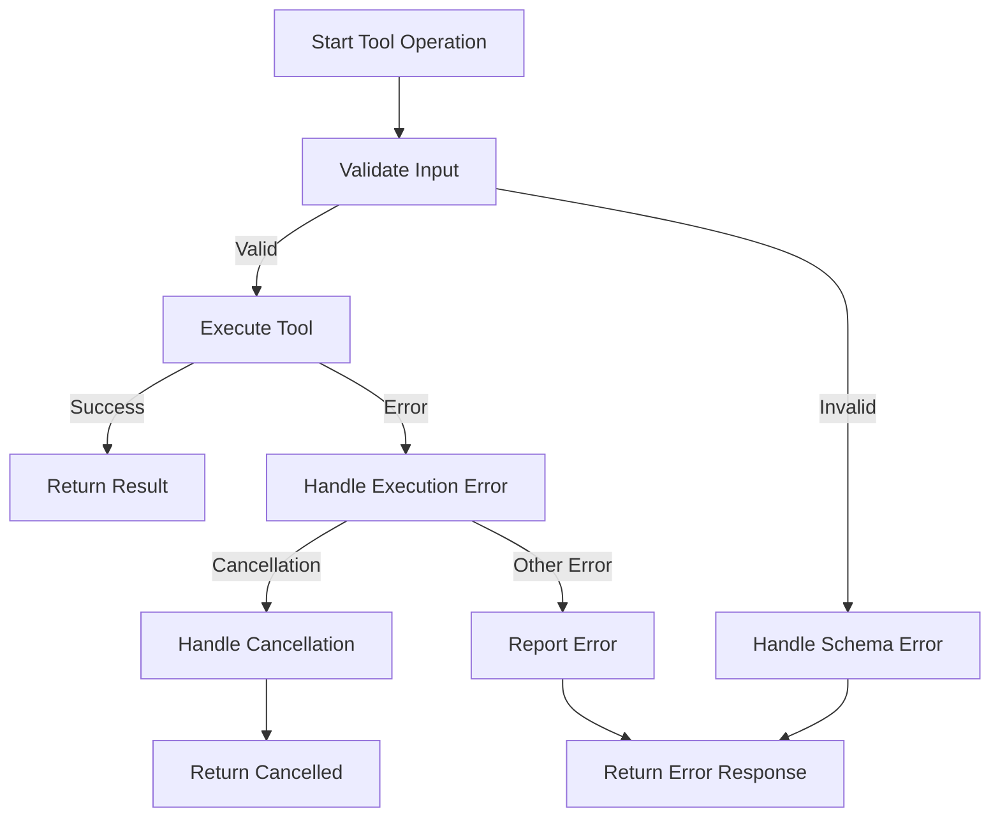
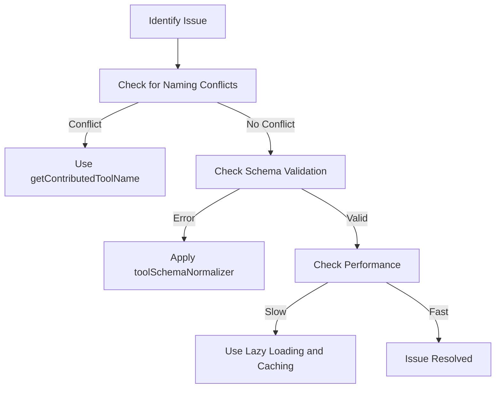
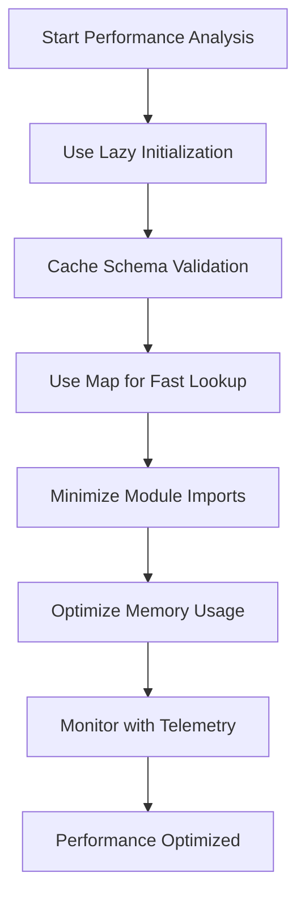

# Tool Registration

<cite>
**Referenced Files in This Document**   
- [toolsRegistry.ts](file://src/extension/tools/common/toolsRegistry.ts)
- [toolsService.ts](file://src/extension/tools/common/toolsService.ts)
- [toolsService.ts](file://src/extension/tools/vscode-node/toolsService.ts)
- [toolSchemaNormalizer.ts](file://src/extension/tools/common/toolSchemaNormalizer.ts)
- [toolNames.ts](file://src/extension/tools/common/toolNames.ts)
- [readFileTool.tsx](file://src/extension/tools/node/readFileTool.tsx)
- [findFilesTool.tsx](file://src/extension/tools/node/findFilesTool.tsx)
- [allTools.ts](file://src/extension/tools/node/allTools.ts)
- [tools.ts](file://src/extension/tools/vscode-node/tools.ts)
- [virtualTool.ts](file://src/extension/tools/common/virtualTools/virtualTool.ts)
</cite>

## Table of Contents
1. [Introduction](#introduction)
2. [Core Components](#core-components)
3. [Tool Registration Lifecycle](#tool-registration-lifecycle)
4. [Tool Schema Structure](#tool-schema-structure)
5. [Tools Service Architecture](#tools-service-architecture)
6. [Tool Schema Normalization](#tool-schema-normalization)
7. [Simple Tool Registration Example](#simple-tool-registration-example)
8. [Complex Tool Registration Example](#complex-tool-registration-example)
9. [Dynamic Tool Registration and Unregistration](#dynamic-tool-registration-and-unregistration)
10. [Error Handling in Tool Registration](#error-handling-in-tool-registration)
11. [Common Issues and Solutions](#common-issues-and-solutions)
12. [Performance Considerations](#performance-considerations)

## Introduction
The vscode-copilot-chat extension provides a comprehensive framework for registering and managing custom tools that can be invoked by language models. This documentation details the complete process of tool registration, from schema definition to runtime availability, with a focus on the toolsRegistry and toolsService components that form the core of the tool management system. The architecture enables both static and dynamic tool registration, with robust validation, normalization, and error handling mechanisms to ensure reliable tool operation.

## Core Components

The tool registration system in vscode-copilot-chat consists of several key components that work together to manage tool lifecycle, discovery, and execution. The toolsRegistry serves as the central repository for tool definitions, while the toolsService acts as the coordinator for tool discovery and invocation. The toolSchemaNormalizer ensures consistency across different tool implementations by normalizing schemas according to model-specific requirements. Together, these components provide a robust framework for extending the functionality of the Copilot chat system with custom tools.

**Section sources**
- [toolsRegistry.ts](file://src/extension/tools/common/toolsRegistry.ts#L6-105)
- [toolsService.ts](file://src/extension/tools/common/toolsService.ts#L1-254)
- [toolSchemaNormalizer.ts](file://src/extension/tools/common/toolSchemaNormalizer.ts#L1-241)

## Tool Registration Lifecycle

The tool registration lifecycle in vscode-copilot-chat begins with extension activation and proceeds through several stages to make tools available for use. During extension activation, tool modules are imported and registered with the toolsRegistry. The toolsService then discovers and instantiates these tools, making them available through the vscode.lm.tools API. Tools can be registered either statically during extension startup or dynamically at runtime. The registration process includes schema validation and normalization to ensure compatibility with the target language models.

**Diagram sources **
- [toolsRegistry.ts](file://src/extension/tools/common/toolsRegistry.ts#L86-105)
- [toolsService.ts](file://src/extension/tools/common/toolsService.ts#L155-254)
- [tools.ts](file://src/extension/tools/vscode-node/tools.ts#L19-60)

**Section sources**
- [toolsRegistry.ts](file://src/extension/tools/common/toolsRegistry.ts#L86-105)
- [toolsService.ts](file://src/extension/tools/common/toolsService.ts#L155-254)
- [tools.ts](file://src/extension/tools/vscode-node/tools.ts#L19-60)

## Tool Schema Structure

Tool schemas in vscode-copilot-chat follow a standardized structure that defines the tool's name, description, parameters, and return types. Each tool schema is defined as a vscode.LanguageModelToolInformation object with required properties including name, description, and inputSchema. The inputSchema follows JSON Schema specifications and defines the structure of the input parameters expected by the tool. Tools may also include optional properties such as tags for categorization and source information.

**Diagram sources **
- [readFileTool.tsx](file://src/extension/tools/node/readFileTool.tsx#L31-54)
- [findFilesTool.tsx](file://src/extension/tools/node/findFilesTool.tsx#L25-28)

**Section sources**
- [readFileTool.tsx](file://src/extension/tools/node/readFileTool.tsx#L31-54)
- [findFilesTool.tsx](file://src/extension/tools/node/findFilesTool.tsx#L25-28)

## Tools Service Architecture

The toolsService is the central coordinator for tool discovery and execution in the vscode-copilot-chat extension. It implements the IToolsService interface and provides methods for retrieving, invoking, and validating tools. The service maintains references to both the registered tools and their implementations, allowing for efficient tool lookup and execution. It also handles tool lifecycle events and provides hooks for monitoring tool invocation through the onWillInvokeTool event.

**Diagram sources **
- [toolsService.ts](file://src/extension/tools/common/toolsService.ts#L47-80)
- [toolsService.ts](file://src/extension/tools/vscode-node/toolsService.ts#L16-155)

**Section sources**
- [toolsService.ts](file://src/extension/tools/common/toolsService.ts#L47-80)
- [toolsService.ts](file://src/extension/tools/vscode-node/toolsService.ts#L16-155)

## Tool Schema Normalization

The toolSchemaNormalizer plays a critical role in ensuring tool schema compatibility across different language models. It applies a series of normalization rules to tool schemas to address model-specific constraints and limitations. The normalization process includes validating JSON Schema compliance, handling array schema items, truncating long descriptions, and removing unsupported schema keywords. This ensures that tool schemas work reliably across different models like GPT-4 and Claude, which have varying schema requirements.

**Diagram sources **
- [toolSchemaNormalizer.ts](file://src/extension/tools/common/toolSchemaNormalizer.ts#L22-241)

**Section sources**
- [toolSchemaNormalizer.ts](file://src/extension/tools/common/toolSchemaNormalizer.ts#L22-241)

## Simple Tool Registration Example

Registering a simple tool in vscode-copilot-chat involves defining the tool schema and implementation, then registering it with the toolsRegistry. The process begins with defining the tool's name, description, and input schema. Next, a class implementing the ICopilotTool interface is created with the required invoke and prepareInvocation methods. Finally, the tool is registered with the toolsRegistry using the registerTool method. This example demonstrates the registration of a basic file reading tool.

**Diagram sources **
- [readFileTool.tsx](file://src/extension/tools/node/readFileTool.tsx#L31-239)

**Section sources**
- [readFileTool.tsx](file://src/extension/tools/node/readFileTool.tsx#L31-239)

## Complex Tool Registration Example

Complex tool registration involves additional considerations such as parameter resolution, input validation, and alternative definitions. The findFiles tool demonstrates these advanced features, including the resolveInput method for modifying generated input parameters and the alternativeDefinition method for providing model-specific tool definitions. The tool also implements prepareInvocation to provide user feedback during tool execution. These features enable more sophisticated tool behavior and better integration with the language model system.

**Diagram sources **
- [findFilesTool.tsx](file://src/extension/tools/node/findFilesTool.tsx#L25-110)

**Section sources**
- [findFilesTool.tsx](file://src/extension/tools/node/findFilesTool.tsx#L25-110)

## Dynamic Tool Registration and Unregistration

The vscode-copilot-chat extension supports dynamic tool registration and unregistration at runtime, allowing for flexible tool management. Dynamic registration can occur when extensions are installed or when new capabilities are enabled. The toolsService automatically detects newly registered tools and makes them available through the vscode.lm.tools API. Unregistration follows a similar process, with tools being removed from the registry and no longer available for invocation. This dynamic capability enables scenarios such as installing an extension that contributes new tools to the system.

**Diagram sources **
- [toolsService.ts](file://src/extension/tools/vscode-node/toolsService.ts#L29-66)
- [tools.ts](file://src/extension/tools/vscode-node/tools.ts#L28-32)

**Section sources**
- [toolsService.ts](file://src/extension/tools/vscode-node/toolsService.ts#L29-66)
- [tools.ts](file://src/extension/tools/vscode-node/tools.ts#L28-32)

## Error Handling in Tool Registration

Proper error handling is essential for robust tool registration and operation. The system includes multiple layers of error handling, from schema validation to tool invocation. Schema validation errors are caught during the normalization process and reported with descriptive messages. Tool invocation errors are handled through try-catch blocks in the invoke method, with appropriate telemetry and error reporting. The system also includes specific error types like ToolCallCancelledError to handle cancellation scenarios gracefully.

**Diagram sources **
- [toolsService.ts](file://src/extension/tools/common/toolsService.ts#L180-217)
- [readFileTool.tsx](file://src/extension/tools/node/readFileTool.tsx#L147-150)

**Section sources**
- [toolsService.ts](file://src/extension/tools/common/toolsService.ts#L180-217)
- [readFileTool.tsx](file://src/extension/tools/node/readFileTool.tsx#L147-150)

## Common Issues and Solutions

Several common issues can arise during tool registration and usage. Naming conflicts can occur when multiple tools use the same name, which is resolved through the tool naming conventions and the getContributedToolName function. Schema validation errors often result from incorrect JSON Schema syntax or model-specific limitations, which are addressed by the toolSchemaNormalizer. Performance issues with large numbers of tools are mitigated through lazy loading and caching mechanisms in the toolsService.

**Diagram sources **
- [toolNames.ts](file://src/extension/tools/common/toolNames.ts#L133-149)
- [toolSchemaNormalizer.ts](file://src/extension/tools/common/toolSchemaNormalizer.ts#L22-241)
- [toolsService.ts](file://src/extension/tools/vscode-node/toolsService.ts#L19-27)

**Section sources**
- [toolNames.ts](file://src/extension/tools/common/toolNames.ts#L133-149)
- [toolSchemaNormalizer.ts](file://src/extension/tools/common/toolSchemaNormalizer.ts#L22-241)
- [toolsService.ts](file://src/extension/tools/vscode-node/toolsService.ts#L19-27)

## Performance Considerations

When registering large numbers of tools, several performance considerations must be addressed. The toolsService uses lazy initialization through the Lazy class to defer tool instantiation until needed, reducing startup time and memory usage. Schema validation results are cached using an LRUCache to avoid repeated compilation of the same schemas. The system also employs efficient data structures like Maps for fast tool lookup by name. These optimizations ensure that the tool system remains responsive even with hundreds of registered tools.

**Diagram sources **
- [toolsService.ts](file://src/extension/tools/vscode-node/toolsService.ts#L19-27)
- [toolsService.ts](file://src/extension/tools/common/toolsService.ts#L164-166)

**Section sources**
- [toolsService.ts](file://src/extension/tools/vscode-node/toolsService.ts#L19-27)
- [toolsService.ts](file://src/extension/tools/common/toolsService.ts#L164-166)