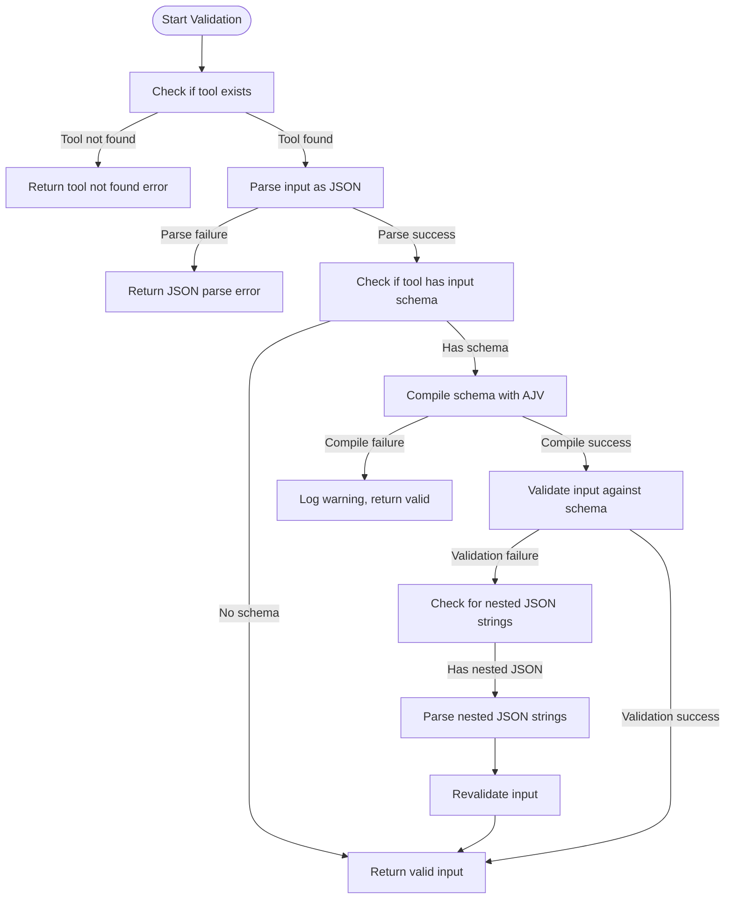
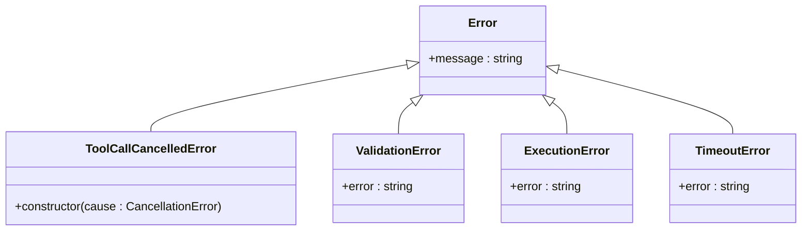
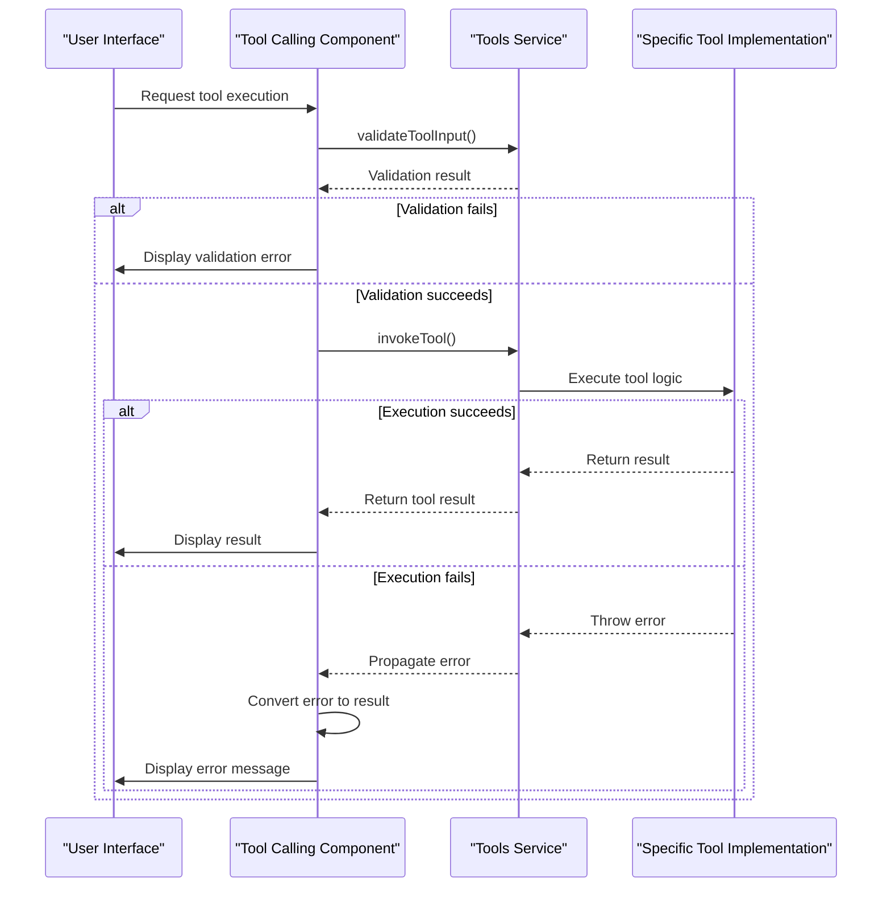
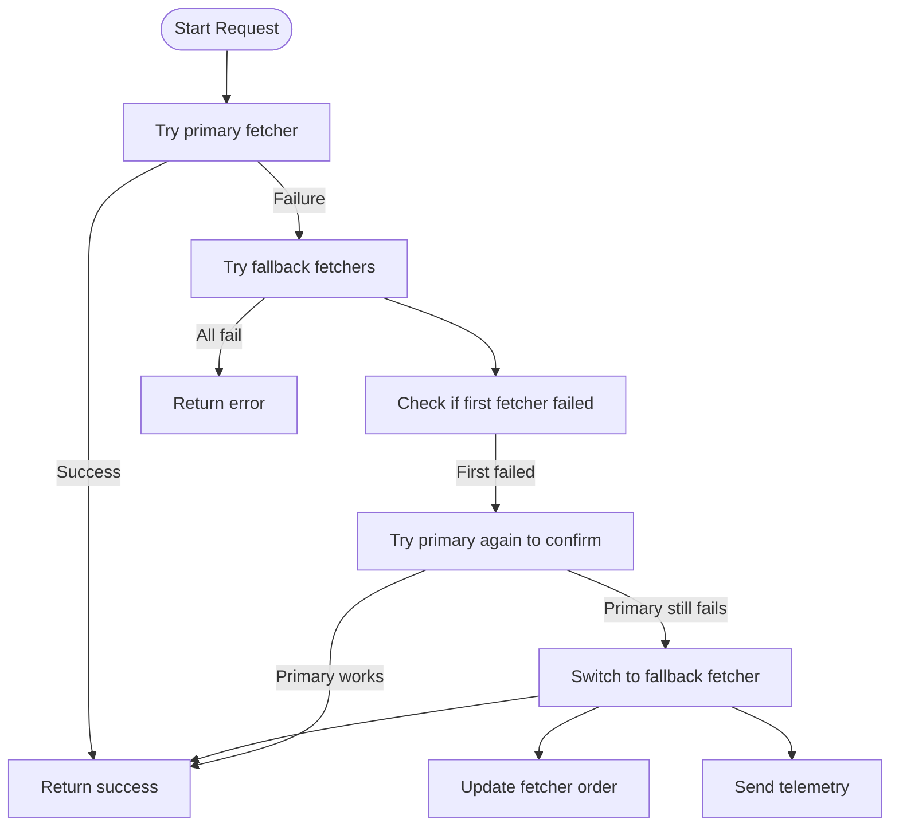

# Error Management

<cite>
**Referenced Files in This Document**   
- [toolsService.ts](file://src/extension/tools/common/toolsService.ts)
- [errors.ts](file://src/util/common/errors.ts)
- [fetcherFallback.ts](file://src/platform/networking/node/fetcherFallback.ts)
- [getErrorsTool.tsx](file://src/extension/tools/node/getErrorsTool.tsx)
- [findFilesTool.tsx](file://src/extension/tools/node/findFilesTool.tsx)
- [toolCalling.tsx](file://src/extension/prompts/node/panel/toolCalling.tsx)
- [diffAlgorithm.ts](file://src/util/vs/editor/common/diff/defaultLinesDiffComputer/algorithms/diffAlgorithm.ts)
</cite>

## Table of Contents
1. [Introduction](#introduction)
2. [Error Detection and Validation](#error-detection-and-validation)
3. [Error Classification](#error-classification)
4. [Error Propagation and Recovery](#error-propagation-and-recovery)
5. [Retry Mechanisms and Fallback Strategies](#retry-mechanisms-and-fallback-strategies)
6. [User-Facing Error Messages](#user-facing-error-messages)
7. [Logging and Monitoring](#logging-and-monitoring)
8. [Conclusion](#conclusion)

## Introduction
The vscode-copilot-chat extension implements a comprehensive error management system for its tool execution model. This document details the error handling strategy, covering error detection, classification, recovery mechanisms, and user communication. The system is designed to handle various error types including validation errors, execution errors, and timeout errors, while providing appropriate feedback and maintaining system reliability through retry mechanisms and fallback strategies.

**Section sources**
- [toolsService.ts](file://src/extension/tools/common/toolsService.ts#L1-L254)

## Error Detection and Validation
The tool execution model employs a robust validation system to detect errors before tool invocation. The `toolsService.ts` file contains the core validation logic that checks both the existence of requested tools and the validity of input parameters.

The validation process begins by verifying whether the requested tool exists in the system. If the tool is not found, an appropriate error message is returned indicating that the tool does not exist. For existing tools, the system performs JSON parsing validation on the input string. If the input cannot be parsed as valid JSON, a parsing error is generated with details about the parsing failure.

For tools with defined input schemas, the system uses the AJV JSON schema validator to validate the input against the schema. The validation process includes a special handling mechanism for nested JSON strings within the input, attempting to parse them as JSON objects when appropriate. This helps prevent validation errors when the model outputs JSON strings instead of objects.

**Diagram sources**
- [toolsService.ts](file://src/extension/tools/common/toolsService.ts#L180-L217)

**Section sources**
- [toolsService.ts](file://src/extension/tools/common/toolsService.ts#L180-L217)

## Error Classification
The system classifies errors into several distinct categories based on their origin and nature. The primary error types include validation errors, execution errors, timeout errors, and cancellation errors.

Validation errors occur when the input to a tool fails schema validation or when the requested tool does not exist. These errors are handled by the `validateToolInput` method in the `BaseToolsService` class, which returns structured error objects with descriptive messages.

Execution errors occur during the actual execution of a tool and can be caused by various factors such as file system errors, network issues, or internal application errors. These errors are typically thrown as exceptions during tool execution and are caught by the calling context.

Timeout errors are a specific type of execution error that occurs when a tool operation exceeds its allowed execution time. The system implements timeout mechanisms at multiple levels, including the diff algorithm timeout in `diffAlgorithm.ts` and the search timeout in `findFilesTool.tsx`.

Cancellation errors occur when a user cancels a tool operation or when the operation is cancelled due to other system constraints. The system defines a specific `ToolCallCancelledError` class that extends the base Error class and wraps cancellation errors from the VS Code API.

**Diagram sources**
- [toolsService.ts](file://src/extension/tools/common/toolsService.ts#L37-L41)
- [diffAlgorithm.ts](file://src/util/vs/editor/common/diff/defaultLinesDiffComputer/algorithms/diffAlgorithm.ts#L186-L210)

**Section sources**
- [toolsService.ts](file://src/extension/tools/common/toolsService.ts#L37-L41)
- [diffAlgorithm.ts](file://src/util/vs/editor/common/diff/defaultLinesDiffComputer/algorithms/diffAlgorithm.ts#L186-L210)

## Error Propagation and Recovery
The error propagation pattern in the tool execution model follows a structured approach from tool execution to the calling context. When a tool encounters an error during execution, it propagates the error to the calling context through exception handling mechanisms.

The `getErrorsTool.tsx` file demonstrates this pattern with its error handling in the `invoke` method. When attempting to open a document with diagnostics, the code wraps the operation in a try-catch block. If an error occurs, it is logged using the `logService.error` method, and the function returns undefined for that particular document rather than failing the entire operation. This approach allows partial success when some documents can be processed even if others fail.

The `toolCalling.tsx` file shows the higher-level error handling in the calling context. When invoking a tool, the code uses a try-catch block to capture any errors that occur during execution. The caught error is then converted to a tool result using the `toolCallErrorToResult` function, which determines whether the error represents a cancellation or a genuine error condition.

For recovery, the system implements several strategies. In cases where a single document operation fails, the system continues processing other documents rather than aborting the entire operation. This is evident in the `getDiagnostics` method of `getErrorsTool.tsx`, which processes multiple paths and continues with remaining paths even if some fail.

**Diagram sources**
- [getErrorsTool.tsx](file://src/extension/tools/node/getErrorsTool.tsx#L148-L217)
- [toolCalling.tsx](file://src/extension/prompts/node/panel/toolCalling.tsx#L226-L239)

**Section sources**
- [getErrorsTool.tsx](file://src/extension/tools/node/getErrorsTool.tsx#L148-L217)
- [toolCalling.tsx](file://src/extension/prompts/node/panel/toolCalling.tsx#L226-L239)

## Retry Mechanisms and Fallback Strategies
The system implements sophisticated retry mechanisms and fallback strategies to enhance reliability, particularly for network-dependent operations. The `fetcherFallback.ts` file contains the core implementation of the fallback strategy for network requests.

The `fetchWithFallbacks` function implements a retry mechanism that attempts to use multiple fetcher implementations when making HTTP requests. The system maintains a list of available fetchers and tries them in sequence when the primary fetcher fails. If a fallback fetcher succeeds, the system updates the fetcher order to use the successful fetcher as the primary for future requests.

The retry mechanism includes a confirmation step where, if the primary fetcher fails but a fallback succeeds, the system attempts to use the primary fetcher again to confirm its failure. If the primary fetcher still fails, the system switches to the fallback fetcher and sends telemetry about the switch.

For timeout-based operations, the system implements race conditions between multiple operations. The `workspaceChunkSearchService.ts` file shows an example where a main operation is raced against a fallback operation. If the main operation fails or times out, the system continues with the fallback operation while still allowing the main operation to complete in case it finishes before the fallback.

**Diagram sources**
- [fetcherFallback.ts](file://src/platform/networking/node/fetcherFallback.ts#L20-L85)

**Section sources**
- [fetcherFallback.ts](file://src/platform/networking/node/fetcherFallback.ts#L20-L85)

## User-Facing Error Messages
The system carefully crafts user-facing error messages to provide meaningful feedback while abstracting technical details. Error messages are designed to be informative without exposing internal implementation details or stack traces to end users.

In the `toolsService.ts` file, validation errors are formatted with a consistent prefix "ERROR: Your input to the tool was invalid" followed by specific details about the validation failure. This provides users with clear information about what went wrong with their input while maintaining a consistent error format.

The `getErrorsTool.tsx` file demonstrates how the system generates user-friendly messages based on the outcome of tool execution. When no problems are found, the tool displays "Checked [files], no problems found" rather than a generic success message. When problems are found, it provides the count of problems found and the files they were found in.

For timeout errors, the system provides actionable feedback. In `findFilesTool.tsx`, when a search times out, the error message suggests "try a more specific search pattern" to help users refine their query and avoid timeouts in the future.

The system also handles cancellation gracefully, distinguishing between user-initiated cancellations and other types of errors. This allows the UI to display appropriate messages based on whether the user intentionally cancelled the operation or if it failed due to an error.

**Section sources**
- [toolsService.ts](file://src/extension/tools/common/toolsService.ts#L152-L153)
- [getErrorsTool.tsx](file://src/extension/tools/node/getErrorsTool.tsx#L203-L214)
- [findFilesTool.tsx](file://src/extension/tools/node/findFilesTool.tsx#L63-L64)

## Logging and Monitoring
The error management system includes comprehensive logging and monitoring capabilities to diagnose tool execution failures and improve system reliability. The system uses a structured logging approach with different log levels for different types of information.

The `ILogService` interface is injected into components that need to log information, providing methods for different log levels including `info`, `debug`, `warn`, and `error`. This allows developers to categorize log messages by severity and filter them appropriately.

In `getErrorsTool.tsx`, the system logs errors when it fails to open a document with diagnostics using the `logService.error` method. This captures the error and a descriptive message, helping diagnose issues with document access. The system also logs information about fetcher performance in `fetcherFallback.ts`, recording when fetchers succeed or fail.

The system integrates with telemetry services to monitor error patterns across user sessions. In `fetcherFallback.ts`, when the system switches to a fallback fetcher, it sends a telemetry event with details about the switch, including the new fetcher being used and the fetchers that are known to be failing. This helps identify systemic issues with specific fetcher implementations.

The logging system also captures performance-related information, such as when operations succeed with or without JSON parsing, allowing developers to monitor the effectiveness of the fallback mechanisms.

**Section sources**
- [getErrorsTool.tsx](file://src/extension/tools/node/getErrorsTool.tsx#L178-L179)
- [fetcherFallback.ts](file://src/platform/networking/node/fetcherFallback.ts#L29-L57)

## Conclusion
The vscode-copilot-chat extension implements a comprehensive error management system for its tool execution model. The system features robust error detection through input validation, clear error classification into distinct categories, and structured error propagation from tool execution to the calling context.

The recovery mechanisms include partial success handling, where operations continue with remaining items even when some fail, and sophisticated retry mechanisms with fallback strategies for network operations. User-facing error messages are carefully crafted to provide meaningful feedback while abstracting technical details, and the system includes comprehensive logging and monitoring capabilities for diagnosing failures and improving reliability.

The error management approach demonstrates a balance between robustness and user experience, ensuring that the system can handle various error conditions gracefully while providing clear feedback to users and valuable diagnostic information to developers.