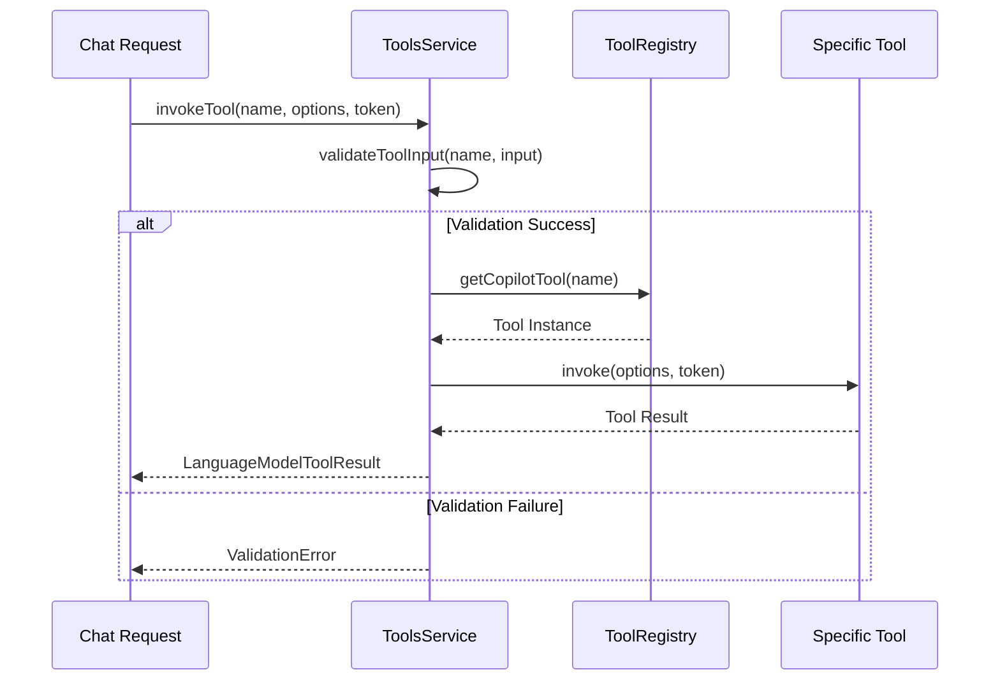
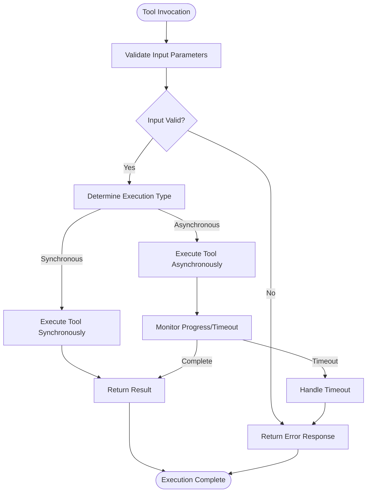
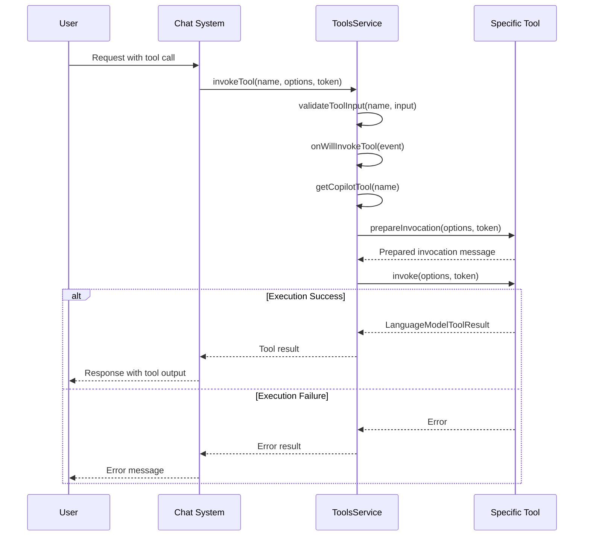
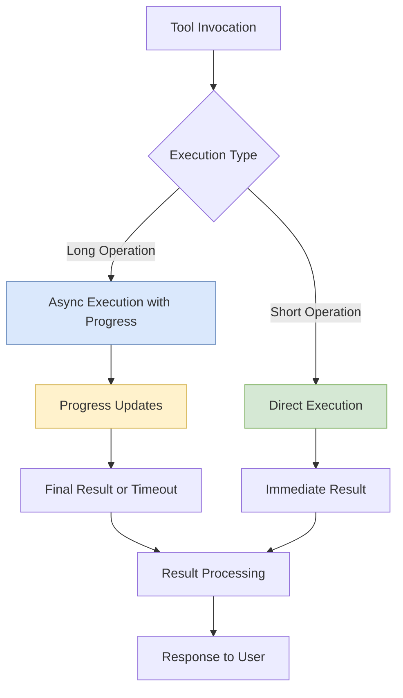
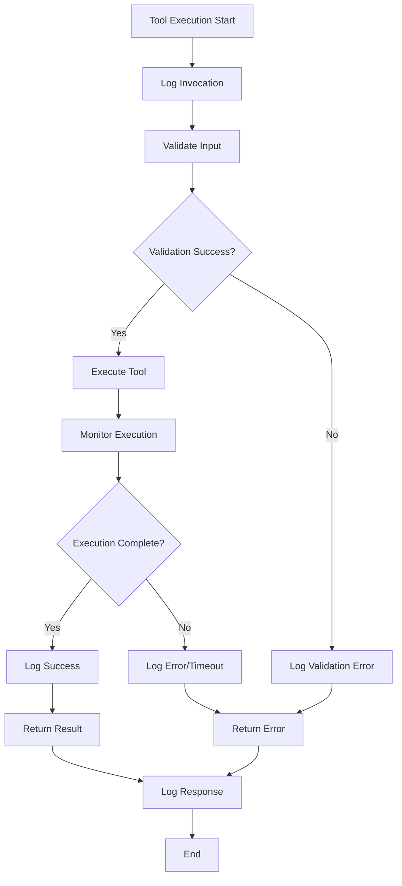

# Execution Lifecycle

<cite>
**Referenced Files in This Document**   
- [toolsService.ts](file://src/extension/tools/common/toolsService.ts)
- [toolsRegistry.ts](file://src/extension/tools/common/toolsRegistry.ts)
- [readFileTool.tsx](file://src/extension/tools/node/readFileTool.tsx)
- [findFilesTool.tsx](file://src/extension/tools/node/findFilesTool.tsx)
- [toolUtils.ts](file://src/extension/tools/common/toolUtils.ts)
- [copilotCLITools.spec.ts](file://src/extension/agents/copilotcli/common/test/copilotCLITools.spec.ts)
- [toolCallingLoop.ts](file://src/extension/intents/node/toolCallingLoop.ts)
- [async.ts](file://src/util/common/async.ts)
</cite>

## Table of Contents
1. [Introduction](#introduction)
2. [Tool Execution Pipeline](#tool-execution-pipeline)
3. [ToolsService Orchestration](#toolsservice-orchestration)
4. [Synchronous vs Asynchronous Execution](#synchronous-vs-asynchronous-execution)
5. [Execution Context Management](#execution-context-management)
6. [Method Call Sequence](#method-call-sequence)
7. [Performance Considerations](#performance-considerations)
8. [Debugging and Logging](#debugging-and-logging)
9. [Conclusion](#conclusion)

## Introduction
The vscode-copilot-chat extension implements a sophisticated tool execution lifecycle that enables AI-powered assistance through a structured pipeline of tool invocation, execution, and result processing. This document details the complete flow from tool invocation through initialization, execution, and completion, focusing on how the toolsService orchestrates the execution pipeline, manages execution context, and handles both synchronous and asynchronous execution patterns.

The tool execution system is designed to provide developers with intelligent assistance by allowing language models to invoke various tools that interact with the codebase, file system, and other development resources. The lifecycle is carefully orchestrated to maintain responsiveness while ensuring proper permission checks, context preparation, and result propagation.

**Section sources**
- [toolsService.ts](file://src/extension/tools/common/toolsService.ts#L1-L254)
- [toolsRegistry.ts](file://src/extension/tools/common/toolsRegistry.ts#L1-L106)

## Tool Execution Pipeline
The tool execution pipeline in vscode-copilot-chat follows a well-defined sequence of phases that ensure reliable and secure tool execution. The pipeline begins with tool invocation and progresses through initialization, execution, and completion, with proper error handling and result propagation at each stage.

The pipeline starts when a language model determines that a tool should be invoked to fulfill a user request. The toolsService receives the invocation request and initiates the execution process by validating the tool input against the tool's schema. This validation ensures that the input parameters are correctly formatted and符合 the expected structure before execution begins.

During initialization, the system prepares the execution context by gathering necessary resources and establishing connections to required services. This includes setting up cancellation tokens, preparing logging mechanisms, and ensuring that all dependencies are available. The initialization phase also performs permission checks to verify that the tool has the necessary access rights to perform its operations.

The execution phase is where the actual tool logic is carried out. Tools may perform various operations such as reading files, searching code, or executing commands. Throughout execution, the system maintains progress tracking and responds to cancellation requests when appropriate. The completion phase handles the results of execution, whether successful or failed, and propagates them back to the calling system.

**Section sources**
- [toolsService.ts](file://src/extension/tools/common/toolsService.ts#L180-L217)
- [readFileTool.tsx](file://src/extension/tools/node/readFileTool.tsx#L123-L151)
- [findFilesTool.tsx](file://src/extension/tools/node/findFilesTool.tsx#L40-L81)

## ToolsService Orchestration
The toolsService is the central orchestrator of the tool execution pipeline, responsible for managing the lifecycle of tool invocations and coordinating between different components of the system. It implements the IToolsService interface and provides methods for tool validation, invocation, and management of enabled tools.

The BaseToolsService class serves as the foundation for the toolsService implementation, providing common functionality such as input validation using AJV (Another JSON Schema Validator) and schema caching to improve performance. The validation process examines the tool input against the tool's defined schema, automatically handling cases where JSON strings are provided where objects are expected by attempting to parse and substitute them.

The toolsService maintains a cache of compiled validation schemas to avoid recompiling the same schema multiple times, improving performance for frequently used tools. It also implements a lazy loading mechanism for tool instances through the Lazy class, which defers instantiation until the tool is actually needed, reducing startup time and memory usage.

Orchestration includes managing the execution queue and ensuring that tools are invoked in the correct order. The service also handles the propagation of execution events, such as the willInvokeTool event, which allows other components to react to tool invocations. The getEnabledTools method determines which tools should be available for a given request based on various factors including user preferences, tool picker selections, and model-specific configurations.

**Diagram sources**
- [toolsService.ts](file://src/extension/tools/common/toolsService.ts#L155-L254)
- [toolsRegistry.ts](file://src/extension/tools/common/toolsRegistry.ts#L86-L105)

**Section sources**
- [toolsService.ts](file://src/extension/tools/common/toolsService.ts#L155-L254)
- [toolsRegistry.ts](file://src/extension/tools/common/toolsRegistry.ts#L86-L105)

## Synchronous vs Asynchronous Execution
The vscode-copilot-chat extension supports both synchronous and asynchronous tool execution patterns, allowing for flexibility in how tools interact with the system and respond to user requests. The choice between these patterns depends on the nature of the tool operation and performance requirements.

Synchronous execution is used for tools that can complete their operations quickly and deterministically. These tools return their results directly from the invoke method, allowing for immediate processing and response generation. Examples include simple file operations or quick searches that can be completed within a short timeframe. The synchronous pattern provides a straightforward execution flow where the tool invocation, execution, and result return happen in a single, uninterrupted sequence.

Asynchronous execution is employed for tools that may take longer to complete or need to perform operations that could benefit from parallel processing. These tools typically return promises that resolve when the operation is complete. The system handles asynchronous execution through proper promise chaining and error handling, ensuring that results are properly propagated even when operations take time to complete. The findFilesTool demonstrates asynchronous execution by using Promise.race to implement timeout functionality while searching for files.

The toolsService handles both execution patterns transparently, allowing the calling system to treat all tool invocations consistently regardless of their underlying execution model. This abstraction simplifies the integration of new tools and ensures a consistent user experience across different tool types.

**Diagram sources**
- [findFilesTool.tsx](file://src/extension/tools/node/findFilesTool.tsx#L59-L64)
- [toolsService.ts](file://src/extension/tools/common/toolsService.ts#L169-L170)

**Section sources**
- [findFilesTool.tsx](file://src/extension/tools/node/findFilesTool.tsx#L40-L81)
- [toolsService.ts](file://src/extension/tools/common/toolsService.ts#L169-L170)

## Execution Context Management
Execution context management is a critical aspect of the tool execution lifecycle, ensuring that tools have access to the necessary resources and state information throughout their execution. The system maintains context across different phases of execution, from initialization through completion, allowing for consistent behavior and proper error handling.

The execution context includes various components such as the current request information, model details, chat session data, and user preferences. This context is passed to tools through the invocation options and is used to customize tool behavior based on the specific request. For example, the readFileTool uses the context to determine tokenization options and model-specific behavior.

Context preservation is particularly important for tools that may be interrupted or need to resume execution. The system maintains state information such as partial results, progress indicators, and cancellation tokens to ensure that execution can be properly managed even in complex scenarios. The toolsService also maintains a pending map of tool invocations, which tracks the state of ongoing executions and allows for proper cleanup when requests are cancelled.

The context management system also handles the propagation of execution state between different components. When a tool completes successfully, its results are integrated into the overall response context and made available for subsequent processing. In cases of failure, error information is captured and included in the context to provide meaningful feedback to the user.

**Section sources**
- [readFileTool.tsx](file://src/extension/tools/node/readFileTool.tsx#L109-L121)
- [toolsService.ts](file://src/extension/tools/common/toolsService.ts#L158-L159)

## Method Call Sequence
The sequence of method calls during tool execution follows a well-defined pattern that ensures proper initialization, execution, and cleanup. This sequence begins with the invocation of a tool and progresses through validation, preparation, execution, and result processing.

The process starts when the toolsService receives an invokeTool request. The first method called is validateToolInput, which validates the input parameters against the tool's schema. If validation succeeds, the system proceeds to retrieve the tool instance from the ToolRegistry using getCopilotTool.

Next, the prepareInvocation method is called if implemented by the tool. This method allows tools to provide user-facing messages about the impending operation, such as "Reading file X" or "Searching for files matching Y". This provides immediate feedback to the user before the actual execution begins.

The core execution occurs in the invoke method, which contains the main logic of the tool. This method receives the invocation options and a cancellation token, allowing it to respond to cancellation requests. The invoke method returns a LanguageModelToolResult containing the output of the tool execution.

Throughout this sequence, various events are emitted to notify other components of the execution progress. The onWillInvokeTool event is fired before execution begins, allowing interested parties to react to the tool invocation. The system also handles the propagation of execution start and completion events, which are used to update the user interface and manage the overall conversation flow.

**Diagram sources**
- [toolsService.ts](file://src/extension/tools/common/toolsService.ts#L81-L83)
- [readFileTool.tsx](file://src/extension/tools/node/readFileTool.tsx#L123-L151)

**Section sources**
- [toolsService.ts](file://src/extension/tools/common/toolsService.ts#L81-L83)
- [readFileTool.tsx](file://src/extension/tools/node/readFileTool.tsx#L123-L151)

## Performance Considerations
The tool execution system incorporates several performance optimizations to ensure responsiveness and efficient resource utilization. These considerations address execution queuing, resource allocation, and the impact on chat responsiveness, which are critical for maintaining a smooth user experience.

Execution queuing is managed through the TaskQueue class, which processes tasks in the order they were scheduled. This ensures that tool executions are handled systematically and prevents resource contention. The queue implementation uses a deferred promise pattern to manage asynchronous operations, allowing for proper error handling and cancellation support.

Resource allocation is optimized through lazy loading of tool instances and caching of validation schemas. The Lazy class defers instantiation of tool instances until they are actually needed, reducing memory usage and startup time. The LRUCache is used to store compiled validation schemas, preventing the overhead of recompiling the same schema multiple times.

The system also implements timeout mechanisms for long-running operations to prevent indefinite blocking. The findFilesTool, for example, uses raceTimeoutAndCancellationError to limit search operations to 20 seconds, ensuring that the chat interface remains responsive even when searches might take longer to complete.

Impact on chat responsiveness is minimized through asynchronous execution patterns and proper progress reporting. Tools that may take longer to complete provide feedback through progress indicators, keeping users informed about the status of their requests. The system also supports cancellation of ongoing operations, allowing users to interrupt long-running tools if needed.

**Diagram sources**
- [async.ts](file://src/util/common/async.ts#L14-L87)
- [findFilesTool.tsx](file://src/extension/tools/node/findFilesTool.tsx#L59-L64)

**Section sources**
- [async.ts](file://src/util/common/async.ts#L14-L87)
- [findFilesTool.tsx](file://src/extension/tools/node/findFilesTool.tsx#L59-L64)

## Debugging and Logging
The tool execution system includes comprehensive debugging and logging capabilities to facilitate tracing the execution lifecycle and diagnosing issues. These capabilities provide visibility into the internal operations of the system and support effective troubleshooting.

Logging is implemented through the ILogService interface, which provides methods for recording informational messages, warnings, and errors. The system logs key events in the execution lifecycle, such as tool validation errors, execution starts and completions, and any exceptions that occur during processing. This logging helps developers understand the flow of execution and identify potential issues.

The copilotCLITools.spec.ts file contains test cases that demonstrate the expected behavior of the tool execution lifecycle, including success and failure scenarios. These tests verify that tool invocations are properly marked as complete and confirmed on success, and as error and unconfirmed when denied or failed. The test cases serve as documentation of the expected behavior and provide a foundation for debugging issues.

Debugging capabilities include the ability to trace method calls and inspect the state of the system at various points in the execution lifecycle. The system captures detailed information about tool invocations, including input parameters, execution times, and result outcomes. This information can be used to analyze performance bottlenecks and diagnose functional issues.

The logging system also supports structured logging with metadata, allowing for more sophisticated analysis of execution patterns and performance characteristics. This structured approach enables filtering and querying of log data to identify specific issues or trends in tool usage.

**Diagram sources**
- [copilotCLITools.spec.ts](file://src/extension/agents/copilotcli/common/test/copilotCLITools.spec.ts#L172-L194)
- [toolsService.ts](file://src/extension/tools/common/toolsService.ts#L204-L208)

**Section sources**
- [copilotCLITools.spec.ts](file://src/extension/agents/copilotcli/common/test/copilotCLITools.spec.ts#L172-L194)
- [toolsService.ts](file://src/extension/tools/common/toolsService.ts#L204-L208)

## Conclusion
The tool execution lifecycle in the vscode-copilot-chat extension is a sophisticated system that enables powerful AI-assisted development capabilities. Through the toolsService orchestration, the system provides a reliable and secure framework for executing various tools that interact with the codebase and development environment.

The execution pipeline follows a well-defined sequence from invocation through initialization, execution, and completion, with proper validation, context management, and error handling at each stage. The system supports both synchronous and asynchronous execution patterns, allowing for flexibility in how tools perform their operations while maintaining responsiveness.

Performance considerations are addressed through queuing mechanisms, resource optimization, and timeout handling, ensuring that the chat interface remains responsive even during complex operations. Comprehensive debugging and logging capabilities provide visibility into the execution lifecycle, supporting effective troubleshooting and analysis.

The architecture demonstrates a thoughtful balance between functionality and usability, providing developers with powerful assistance while maintaining control over tool execution and system resources. This robust foundation enables the extension to deliver valuable AI-powered features that enhance the development experience.