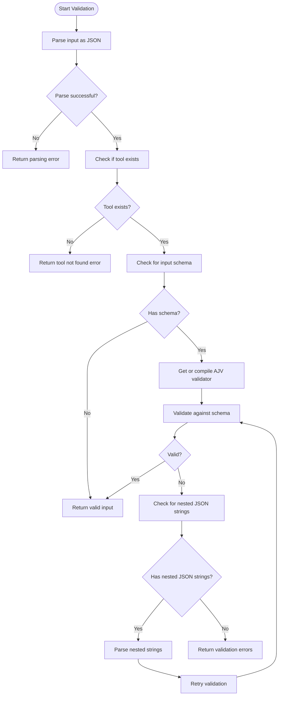
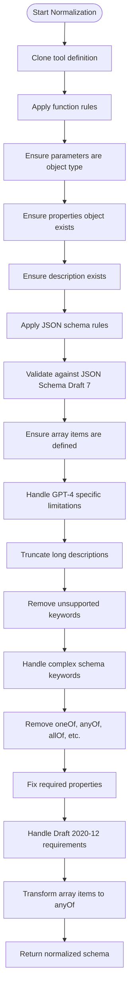
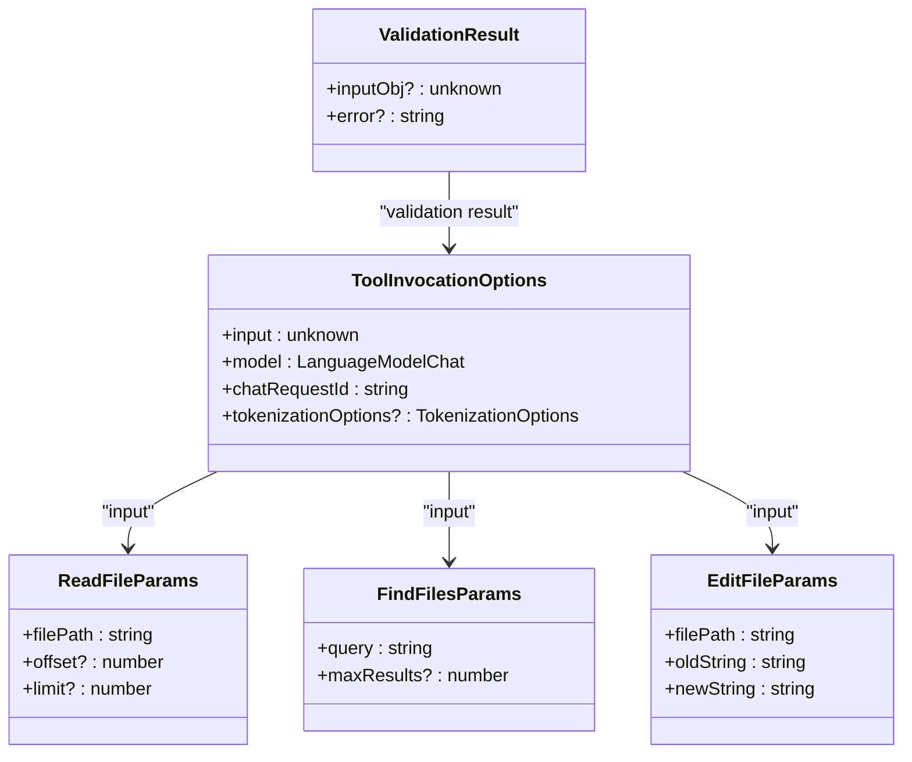
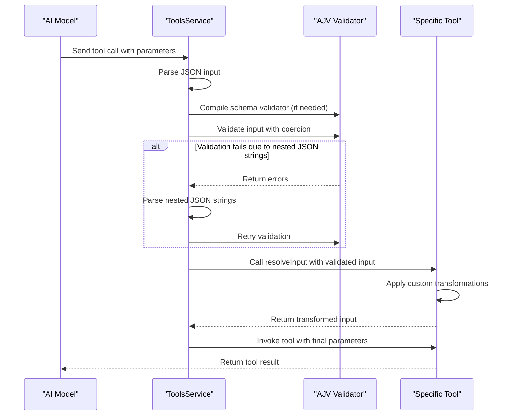
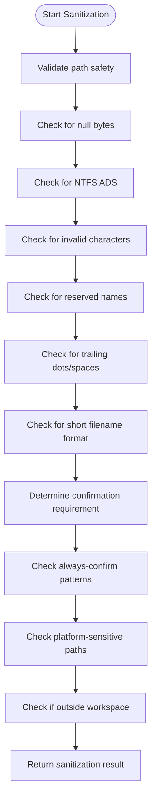
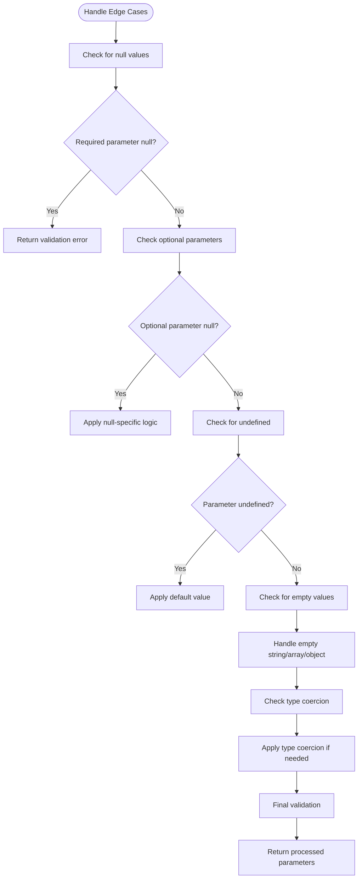

# Parameter Handling

<cite>
**Referenced Files in This Document**   
- [toolsService.ts](file://src/extension/tools/common/toolsService.ts)
- [toolSchemaNormalizer.ts](file://src/extension/tools/common/toolSchemaNormalizer.ts)
- [readFileTool.tsx](file://src/extension/tools/node/readFileTool.tsx)
- [findFilesTool.tsx](file://src/extension/tools/node/findFilesTool.tsx)
- [editFileToolUtils.tsx](file://src/extension/tools/node/editFileToolUtils.tsx)
- [toolsRegistry.ts](file://src/extension/tools/common/toolsRegistry.ts)
</cite>

## Table of Contents
1. [Introduction](#introduction)
2. [Parameter Validation Process](#parameter-validation-process)
3. [Schema Normalization](#schema-normalization)
4. [Complex Parameter Handling](#complex-parameter-handling)
5. [Parameter Transformation and Type Coercion](#parameter-transformation-and-type-coercion)
6. [Parameter Sanitization and Security](#parameter-sanitization-and-security)
7. [Edge Case Handling](#edge-case-handling)
8. [Best Practices and Common Pitfalls](#best-practices-and-common-pitfalls)

## Introduction
The vscode-copilot-chat extension implements a sophisticated parameter handling system for its tool execution model. This system ensures that parameters passed to tools are properly validated, transformed, and secured before execution. The parameter handling mechanism is designed to support various AI models with different schema requirements while maintaining security and reliability. This document details the complete parameter handling workflow, from initial validation through transformation to final execution.

**Section sources**
- [toolsService.ts](file://src/extension/tools/common/toolsService.ts#L1-L254)
- [toolSchemaNormalizer.ts](file://src/extension/tools/common/toolSchemaNormalizer.ts#L1-L241)

## Parameter Validation Process
The parameter validation process in the vscode-copilot-chat extension follows a structured approach to ensure input integrity. The validation begins with JSON parsing of the input string, followed by schema-based validation using the AJV library. The `validateToolInput` method in the `BaseToolsService` class orchestrates this process, first checking if the requested tool exists and then validating the input against the tool's schema definition.

When a tool invocation request is received, the system first attempts to parse the input as JSON. If parsing fails, an appropriate error message is returned. For valid JSON inputs, the system checks if the tool has a defined input schema. Tools without schemas accept any input, while tools with schemas undergo rigorous validation. The validation process uses a cached AJV validator instance for performance optimization, compiling and caching schema validators to avoid repeated compilation overhead.

The validation process includes special handling for nested JSON strings within parameters. When the system detects that a string value should actually be an object or array based on the schema, it attempts to parse the string as JSON and replace it with the parsed object. This recursive validation approach allows the system to handle cases where AI models output JSON strings instead of proper objects, which is a common occurrence in practice.

**Diagram sources **
- [toolsService.ts](file://src/extension/tools/common/toolsService.ts#L180-L217)

**Section sources**
- [toolsService.ts](file://src/extension/tools/common/toolsService.ts#L180-L217)
- [toolService.spec.ts](file://src/extension/tools/common/test/toolService.spec.ts#L72-L234)

## Schema Normalization
The extension implements a comprehensive schema normalization process to ensure compatibility across different AI models. The `normalizeToolSchema` function applies a series of rules to tool schemas to address model-specific limitations and requirements. This normalization is crucial for supporting multiple AI providers with varying schema interpretation capabilities.

The normalization process includes several key rules applied to both function definitions and JSON schemas. For function definitions, the system ensures that parameters are properly defined as objects with properties, and that descriptions are provided even if empty. For JSON schemas, the system validates against JSON Schema Draft 7 specifications and applies model-specific adjustments. For example, GPT-4 family models have specific limitations on description length and unsupported schema keywords, which are addressed during normalization.

The system also handles array schemas by ensuring they have defined items, and processes object schemas by removing required properties that are not defined in the properties object. For models following JSON Schema Draft 2020-12, the system transforms array items into anyOf constructs, as array items as arrays are not supported in this draft. The normalization process is extensible, allowing for additional rules to be added as new model requirements emerge.

**Diagram sources **
- [toolSchemaNormalizer.ts](file://src/extension/tools/common/toolSchemaNormalizer.ts#L22-L169)

**Section sources**
- [toolSchemaNormalizer.ts](file://src/extension/tools/common/toolSchemaNormalizer.ts#L22-L241)

## Complex Parameter Handling
The extension demonstrates sophisticated handling of complex parameters such as objects and arrays through various tool implementations. The system supports nested structures and provides mechanisms for serializing and deserializing complex data types. This capability is essential for tools that require structured input beyond simple scalar values.

The `readFileTool` implementation showcases complex parameter handling with its support for both version 1 and version 2 parameter formats. The tool accepts parameters that include file paths and optional offset and limit values for reading specific portions of files. The implementation includes logic to determine which parameter version is being used and processes accordingly. Similarly, the `findFilesTool` handles complex queries with optional maximum result limits, demonstrating how tools can manage optional parameters with default values.

For tools requiring even more complex data structures, the system supports nested objects and arrays through the schema validation process. The validation system can handle deeply nested structures and will attempt to parse JSON strings embedded within parameters when the schema indicates that an object or array is expected. This allows AI models to output JSON strings that are automatically converted to proper objects during validation, providing flexibility in how models generate tool calls.

**Diagram sources **
- [readFileTool.tsx](file://src/extension/tools/node/readFileTool.tsx#L56-L66)
- [findFilesTool.tsx](file://src/extension/tools/node/findFilesTool.tsx#L25-L28)
- [editFileToolUtils.tsx](file://src/extension/tools/node/editFileToolUtils.tsx#L560-L568)

**Section sources**
- [readFileTool.tsx](file://src/extension/tools/node/readFileTool.tsx#L31-L54)
- [findFilesTool.tsx](file://src/extension/tools/node/findFilesTool.tsx#L25-L28)
- [editFileToolUtils.tsx](file://src/extension/tools/node/editFileToolUtils.tsx#L37-L44)

## Parameter Transformation and Type Coercion
The parameter transformation and type coercion mechanisms in the vscode-copilot-chat extension ensure that input parameters are properly formatted for tool execution. The system leverages AJV's type coercion capabilities while also implementing custom transformation logic in specific tools. This dual approach provides both automatic type conversion and precise control over parameter processing.

The core transformation process occurs during schema validation, where AJV is configured with `coerceTypes: true` to automatically convert values between compatible types. For example, string representations of numbers are converted to numeric types when the schema expects a number. This automatic coercion reduces the likelihood of type-related errors while maintaining flexibility in how AI models generate tool calls.

Beyond automatic coercion, specific tools implement custom transformation logic in their `resolveInput` methods. The `findFilesTool` demonstrates this by normalizing query patterns, automatically prepending `**/` to queries that don't start with it and appending `**` to queries ending with a slash. This ensures consistent behavior regardless of how the AI model formats the query. The method also adjusts the maximum results based on the invocation mode, providing more results in full context mode than in partial context mode.

**Diagram sources **
- [toolsService.ts](file://src/extension/tools/common/toolsService.ts#L180-L217)
- [findFilesTool.tsx](file://src/extension/tools/node/findFilesTool.tsx#L90-L107)

**Section sources**
- [toolsService.ts](file://src/extension/tools/common/toolsService.ts#L164-L165)
- [findFilesTool.tsx](file://src/extension/tools/node/findFilesTool.tsx#L90-L107)

## Parameter Sanitization and Security
The extension implements comprehensive parameter sanitization and security measures to prevent malicious tool usage and protect the user's system. These measures include path validation, confirmation requirements for sensitive operations, and input sanitization to prevent code injection and other security vulnerabilities.

The `assertPathIsSafe` function in the `editFileToolUtils` module provides robust path validation, particularly for Windows systems. It checks for null bytes, NTFS alternate data streams, invalid characters, reserved device names, and other potentially dangerous path components. This validation prevents path traversal attacks and ensures that file operations occur only on legitimate files. The function also checks for trailing dots and spaces, which can cause issues on Windows systems.

For edit operations, the system implements a confirmation mechanism based on file patterns and locations. Certain file types, such as VS Code configuration files, always require confirmation before editing. The system also requires confirmation for files in sensitive locations like user home directories, application data folders, and system directories. This multi-layered approach balances usability with security, allowing routine edits while protecting critical system files.

**Diagram sources **
- [editFileToolUtils.tsx](file://src/extension/tools/node/editFileToolUtils.tsx#L730-L785)

**Section sources**
- [editFileToolUtils.tsx](file://src/extension/tools/node/editFileToolUtils.tsx#L730-L800)

## Edge Case Handling
The parameter handling system in vscode-copilot-chat includes robust mechanisms for handling various edge cases, ensuring reliable operation under diverse conditions. These mechanisms address null values, optional parameters, default value handling, and other scenarios that commonly arise in tool execution.

The system handles null values through careful schema design and validation logic. Required parameters are explicitly marked in schemas, and the validation process ensures they are present and not null. For optional parameters, the system accepts null values but may apply additional validation based on the specific tool's requirements. The `readFileTool` demonstrates this by accepting null or undefined values for optional parameters like offset and limit, defaulting to reading from the beginning of the file when these values are not provided.

Optional parameters are handled through schema definitions that specify which properties are required and which are optional. The system distinguishes between parameters that are omitted entirely and those explicitly set to null or undefined. This distinction allows tools to implement different behaviors based on whether a parameter was intentionally set to a null value or simply not provided. Default values are typically handled within the tool implementation rather than at the validation level, giving tools flexibility in how they interpret missing parameters.

**Diagram sources **
- [readFileTool.tsx](file://src/extension/tools/node/readFileTool.tsx#L86-L98)
- [toolsService.ts](file://src/extension/tools/common/toolsService.ts#L115-L117)

**Section sources**
- [readFileTool.tsx](file://src/extension/tools/node/readFileTool.tsx#L86-L105)
- [toolsService.ts](file://src/extension/tools/common/toolsService.ts#L115-L117)

## Best Practices and Common Pitfalls
Based on the analysis of the vscode-copilot-chat extension's parameter handling system, several best practices emerge for designing effective tool parameter schemas and avoiding common pitfalls. These practices ensure reliable, secure, and user-friendly tool execution while accommodating the limitations of various AI models.

Key best practices include defining comprehensive JSON schemas for all tools, even when not strictly required. Complete schemas enable better validation, improve AI model understanding of tool capabilities, and provide clearer documentation. Required fields should be explicitly marked in schemas, and descriptions should be provided for all parameters to guide AI model usage. For complex parameters, consider supporting both simple and advanced usage patterns, as demonstrated by the `readFileTool`'s support for multiple parameter versions.

Common pitfalls to avoid include relying solely on runtime validation without schema definitions, which limits the system's ability to catch errors early. Another pitfall is not handling nested JSON strings properly, which can lead to validation failures when AI models output JSON strings instead of objects. Security vulnerabilities can arise from insufficient path validation and confirmation requirements, particularly for file system operations. Finally, failing to handle edge cases like null values, empty strings, and type coercion can lead to unreliable tool behavior.

The extension's approach of combining automatic validation with custom transformation logic in the `resolveInput` method provides a balanced solution that leverages both standardized validation and tool-specific intelligence. This hybrid approach allows for consistent error handling while accommodating the unique requirements of different tools.

**Section sources**
- [toolSchemaNormalizer.ts](file://src/extension/tools/common/toolSchemaNormalizer.ts#L22-L241)
- [toolsRegistry.ts](file://src/extension/tools/common/toolsRegistry.ts#L29-L64)
- [readFileTool.tsx](file://src/extension/tools/node/readFileTool.tsx#L31-L54)
- [findFilesTool.tsx](file://src/extension/tools/node/findFilesTool.tsx#L25-L28)