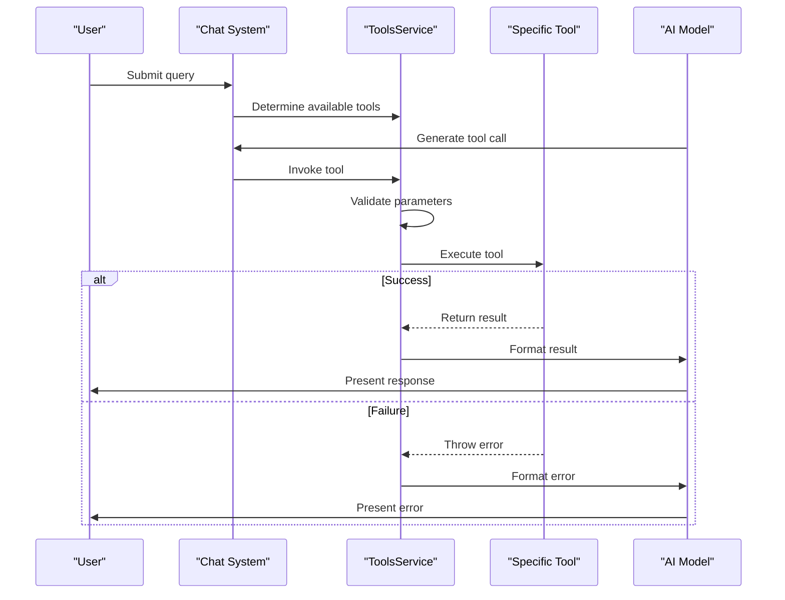
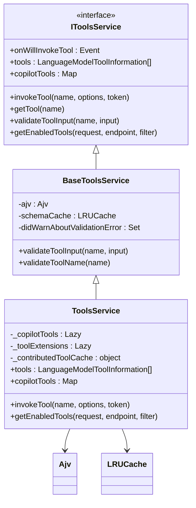
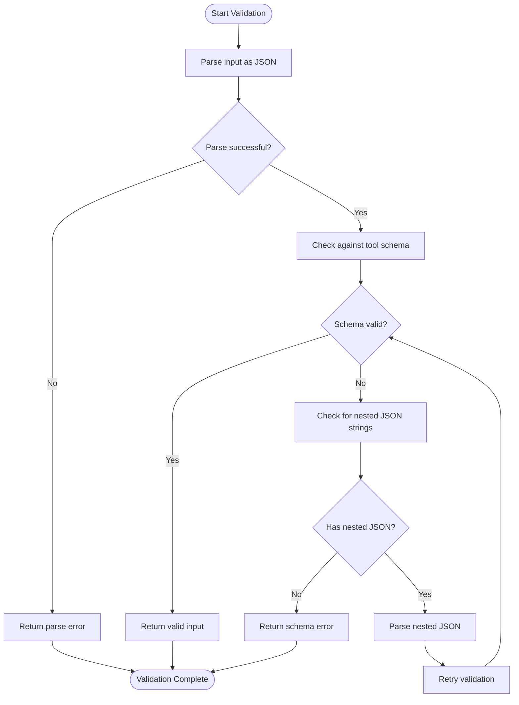
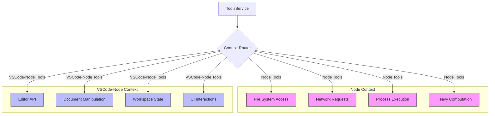
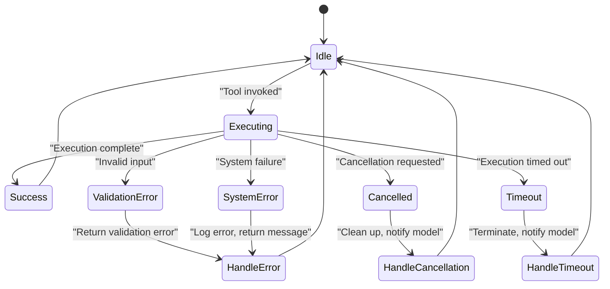
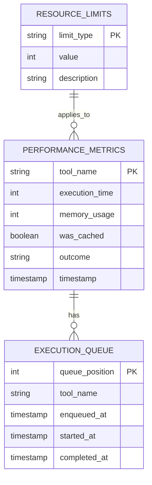
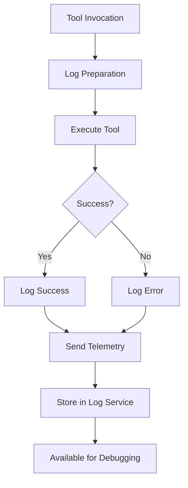

# Tool Execution Model

<cite>
**Referenced Files in This Document**   
- [toolsService.ts](file://src/extension/tools/common/toolsService.ts)
- [toolsRegistry.ts](file://src/extension/tools/common/toolsRegistry.ts)
- [toolNames.ts](file://src/extension/tools/common/toolNames.ts)
- [toolSchemaNormalizer.ts](file://src/extension/tools/common/toolSchemaNormalizer.ts)
- [toolUtils.ts](file://src/extension/tools/node/toolUtils.ts)
- [readFileTool.tsx](file://src/extension/tools/node/readFileTool.tsx)
- [fetchWebPageTool.tsx](file://src/extension/tools/vscode-node/fetchWebPageTool.tsx)
- [tools.ts](file://src/extension/tools/vscode-node/tools.ts)
- [toolCallingLoop.ts](file://src/extension/intents/node/toolCallingLoop.ts)
- [racePromise.ts](file://src/util/common/racePromise.ts)
</cite>

## Table of Contents
1. [Introduction](#introduction)
2. [Tool Execution Lifecycle](#tool-execution-lifecycle)
3. [ToolsService Orchestration](#toolsservice-orchestration)
4. [Parameter Validation and Transformation](#parameter-validation-and-transformation)
5. [Execution Contexts: Node vs VSCode-Node](#execution-contexts-node-vs-vscode-node)
6. [Error Handling and Cancellation](#error-handling-and-cancellation)
7. [Performance Considerations](#performance-considerations)
8. [Debugging and Logging](#debugging-and-logging)
9. [Conclusion](#conclusion)

## Introduction
The tool execution model in the vscode-copilot-chat extension provides a comprehensive framework for AI-assisted development tasks. This system enables the AI model to interact with the development environment through a series of well-defined tools that can read files, search code, execute commands, and perform various other operations. The model is designed to handle complex workflows while maintaining responsiveness and reliability. The architecture separates concerns between tool definition, execution orchestration, and result processing, creating a flexible system that can adapt to different execution contexts and model requirements.

**Section sources**
- [toolsService.ts](file://src/extension/tools/common/toolsService.ts#L1-L254)
- [toolsRegistry.ts](file://src/extension/tools/common/toolsRegistry.ts#L1-L106)

## Tool Execution Lifecycle
The tool execution lifecycle in the vscode-copilot-chat extension follows a structured process from invocation through result handling. When a user initiates a chat request, the system determines which tools are available and enabled for the current context. The AI model may then generate tool calls as part of its response, specifying which tools to invoke and with what parameters. The ToolsService orchestrates this process by validating the tool call, preparing the execution context, invoking the tool, and processing the results.

The lifecycle begins with tool invocation, where the system receives a request to execute a specific tool with given parameters. Before execution, the system performs validation to ensure the tool exists and the input parameters conform to the expected schema. Once validated, the tool is executed in the appropriate context (node or vscode-node), with proper error handling and cancellation support. The results are then formatted and returned to the AI model in a structured format that can be incorporated into the conversation.

**Diagram sources**
- [toolsService.ts](file://src/extension/tools/common/toolsService.ts#L155-L254)
- [toolCallingLoop.ts](file://src/extension/intents/node/toolCallingLoop.ts#L1-L200)

**Section sources**
- [toolsService.ts](file://src/extension/tools/common/toolsService.ts#L63-L80)
- [toolCallingLoop.ts](file://src/extension/intents/node/toolCallingLoop.ts#L176-L200)

## ToolsService Orchestration
The ToolsService is the central orchestrator of tool execution in the vscode-copilot-chat extension, responsible for managing the entire tool lifecycle. It implements the IToolsService interface and extends BaseToolsService, providing a consistent API for tool registration, discovery, and execution. The service maintains references to all registered tools and handles the coordination between the AI model and individual tool implementations.

The ToolsService operates through several key methods: `invokeTool` executes a tool with the given parameters, `validateToolInput` ensures input conforms to the tool's schema, and `getEnabledTools` determines which tools should be available for a given request. The service also emits events like `onWillInvokeTool` to notify listeners of impending tool executions, enabling logging and monitoring capabilities.

**Diagram sources**
- [toolsService.ts](file://src/extension/tools/common/toolsService.ts#L47-L254)
- [toolsRegistry.ts](file://src/extension/tools/common/toolsRegistry.ts#L67-L85)

**Section sources**
- [toolsService.ts](file://src/extension/tools/common/toolsService.ts#L155-L254)
- [toolsRegistry.ts](file://src/extension/tools/common/toolsRegistry.ts#L67-L85)

## Parameter Validation and Transformation
The parameter validation and transformation process ensures that tool inputs are correctly formatted and valid before execution. This process begins with JSON parsing of the input string, followed by schema validation using AJV (Another JSON Schema Validator). The system employs a sophisticated validation mechanism that can handle complex scenarios, including nested JSON strings within string fields.

When validating tool input, the system first attempts to parse the input as JSON. If parsing fails, an error is returned unless the input is empty. For valid JSON input, the system checks against the tool's input schema, which is compiled and cached for performance. A unique feature of the validation process is its ability to detect when a string field contains JSON that should be parsed as an object or array. If validation fails due to type mismatches, the system attempts to parse string values as JSON and retry validation.

**Diagram sources**
- [toolsService.ts](file://src/extension/tools/common/toolsService.ts#L113-L153)
- [toolSchemaNormalizer.ts](file://src/extension/tools/common/toolSchemaNormalizer.ts#L22-L241)

**Section sources**
- [toolsService.ts](file://src/extension/tools/common/toolsService.ts#L180-L217)
- [toolSchemaNormalizer.ts](file://src/extension/tools/common/toolSchemaNormalizer.ts#L22-L241)

## Execution Contexts: Node vs VSCode-Node
The vscode-copilot-chat extension supports two primary execution contexts: node and vscode-node, each serving different purposes in the tool execution model. The node context is used for tools that require access to lower-level system resources or perform computationally intensive operations, while the vscode-node context is used for tools that interact directly with the VS Code editor API.

The architectural separation between these contexts allows for better security and performance isolation. Node-context tools run in a separate process with access to file system operations, network requests, and other system-level capabilities. VSCode-node tools, on the other hand, run in the extension host process and have direct access to VS Code's API for manipulating the editor interface, documents, and workspace state.

**Diagram sources**
- [tools.ts](file://src/extension/tools/vscode-node/tools.ts#L1-L61)
- [readFileTool.tsx](file://src/extension/tools/node/readFileTool.tsx#L1-L296)

**Section sources**
- [tools.ts](file://src/extension/tools/vscode-node/tools.ts#L1-L61)
- [readFileTool.tsx](file://src/extension/tools/node/readFileTool.tsx#L1-L296)

## Error Handling and Cancellation
The tool execution model implements comprehensive error handling and cancellation support to ensure reliability and responsiveness. Errors are categorized and handled appropriately, with specific error types for different failure modes. The system uses structured error objects that include descriptive messages and error codes, making it easier to diagnose issues and provide meaningful feedback to users.

Cancellation is a critical aspect of the tool execution model, allowing users to stop long-running operations. The system integrates with VS Code's CancellationToken mechanism, enabling both user-initiated and timeout-based cancellations. When a tool execution is cancelled, it throws a ToolCallCancelledError, which propagates through the system and is handled gracefully by the AI model.

**Diagram sources**
- [toolsService.ts](file://src/extension/tools/common/toolsService.ts#L37-L41)
- [racePromise.ts](file://src/util/common/racePromise.ts#L21-L45)

**Section sources**
- [toolsService.ts](file://src/extension/tools/common/toolsService.ts#L37-L41)
- [racePromise.ts](file://src/util/common/racePromise.ts#L21-L45)

## Performance Considerations
The tool execution model incorporates several performance optimizations to maintain chat responsiveness and efficient resource utilization. These include execution queuing, resource limits, and various caching mechanisms. The system is designed to handle multiple tool calls efficiently while preventing resource exhaustion and ensuring fair usage.

One key performance feature is the use of LRU (Least Recently Used) caching for compiled JSON schemas, reducing the overhead of schema validation across multiple tool invocations. The system also implements timeout mechanisms to prevent long-running operations from blocking the chat interface. Additionally, the tool calling loop enforces limits on the number of consecutive tool calls to prevent infinite loops and excessive resource consumption.

**Diagram sources**
- [toolsService.ts](file://src/extension/tools/common/toolsService.ts#L166-L167)
- [toolCallingLoop.ts](file://src/extension/intents/node/toolCallingLoop.ts#L44-L47)

**Section sources**
- [toolsService.ts](file://src/extension/tools/common/toolsService.ts#L166-L167)
- [toolCallingLoop.ts](file://src/extension/intents/node/toolCallingLoop.ts#L176-L189)

## Debugging and Logging
The tool execution model includes comprehensive debugging and logging capabilities to facilitate troubleshooting and system monitoring. The system generates detailed logs for each tool execution, including input parameters, execution duration, and output results. These logs are structured to support both real-time monitoring and post-execution analysis.

Logging is implemented through the ILogService interface, which provides methods for tracing, warning, and error logging. The system logs key events such as tool preparation, invocation, and completion, allowing developers to trace the execution flow and identify performance bottlenecks or errors. Additionally, the system supports telemetry events that capture usage patterns and performance metrics for analysis.

**Diagram sources**
- [toolCallingLoop.ts](file://src/extension/intents/node/toolCallingLoop.ts#L619-L652)
- [readFileTool.tsx](file://src/extension/tools/node/readFileTool.tsx#L200-L231)

**Section sources**
- [toolCallingLoop.ts](file://src/extension/intents/node/toolCallingLoop.ts#L619-L652)
- [readFileTool.tsx](file://src/extension/tools/node/readFileTool.tsx#L200-L231)

## Conclusion
The tool execution model in the vscode-copilot-chat extension provides a robust framework for AI-assisted development, enabling seamless interaction between the AI model and the development environment. Through a well-structured lifecycle, comprehensive validation, and careful orchestration by the ToolsService, the system ensures reliable and secure tool execution. The separation between node and vscode-node contexts allows for appropriate access levels while maintaining performance and security.

The model's sophisticated error handling, cancellation support, and performance optimizations ensure a responsive user experience even during complex operations. Detailed logging and debugging capabilities make it easier to troubleshoot issues and optimize performance. As the system continues to evolve, these foundational elements provide a solid base for adding new tools and capabilities while maintaining stability and reliability.