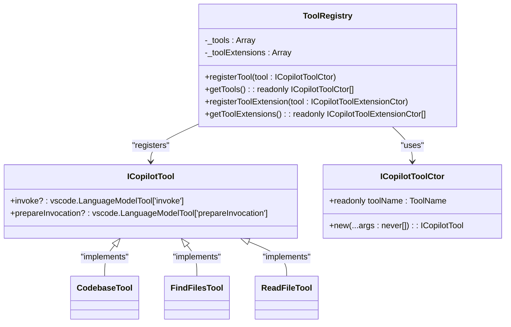
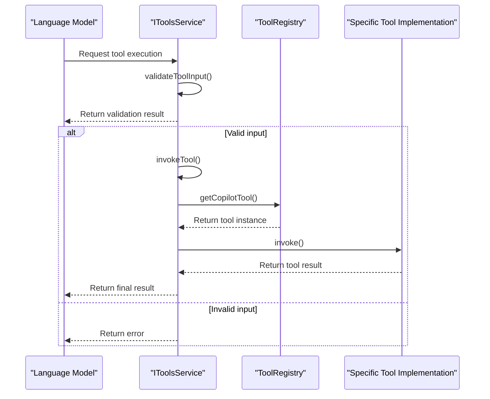
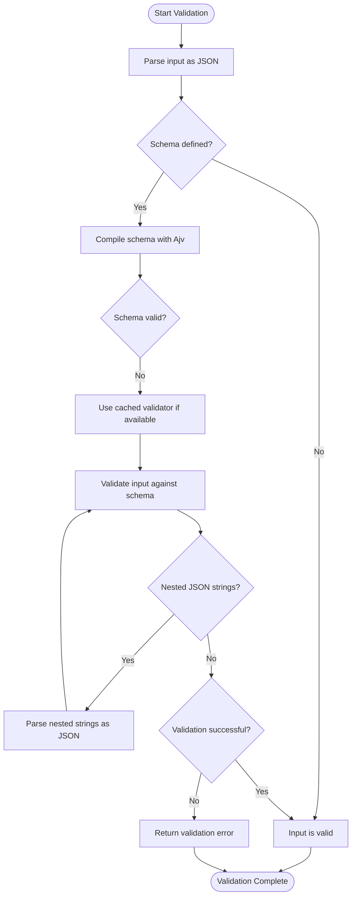
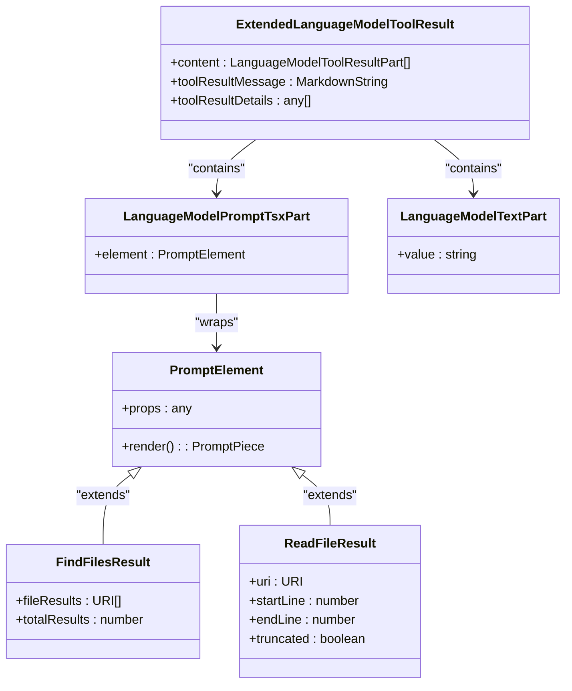
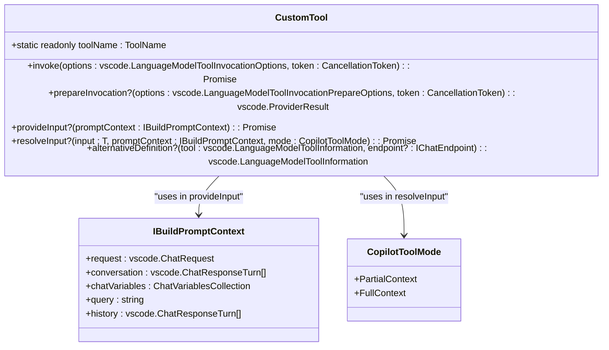
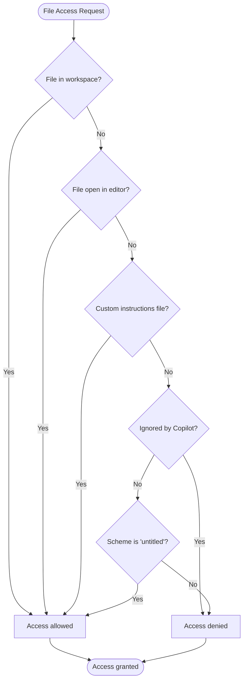
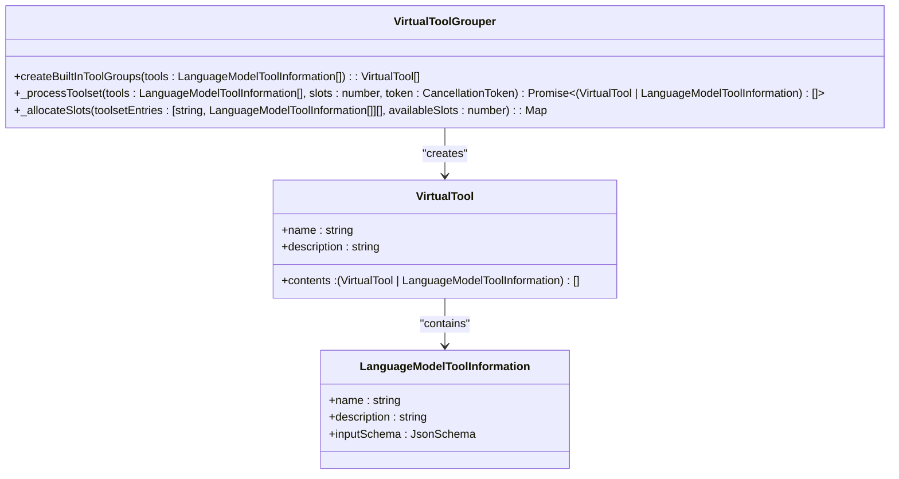

# Tool Integration

<cite>
**Referenced Files in This Document**   
- [toolsRegistry.ts](file://src/extension/tools/common/toolsRegistry.ts)
- [toolsService.ts](file://src/extension/tools/common/toolsService.ts)
- [allTools.ts](file://src/extension/tools/node/allTools.ts)
- [codebaseTool.tsx](file://src/extension/tools/node/codebaseTool.tsx)
- [findFilesTool.tsx](file://src/extension/tools/node/findFilesTool.tsx)
- [readFileTool.tsx](file://src/extension/tools/node/readFileTool.tsx)
- [scmChangesTool.ts](file://src/extension/tools/node/scmChangesTool.ts)
- [toolUtils.ts](file://src/extension/tools/common/toolUtils.ts)
- [toolUtils.ts](file://src/extension/tools/node/toolUtils.ts)
- [toolSchemaNormalizer.ts](file://src/extension/tools/common/toolSchemaNormalizer.ts)
- [virtualToolGrouper.ts](file://src/extension/tools/common/virtualTools/virtualToolGrouper.ts)
- [toolCalling.tsx](file://src/extension/prompts/node/panel/toolCalling.tsx)
- [toolSimTest.ts](file://test/e2e/toolSimTest.ts)
</cite>

## Table of Contents
1. [Introduction](#introduction)
2. [Tool Registration and Discovery](#tool-registration-and-discovery)
3. [Tool Execution Model](#tool-execution-model)
4. [Parameter Handling and Validation](#parameter-handling-and-validation)
5. [Result Processing](#result-processing)
6. [Built-in Tool Implementations](#built-in-tool-implementations)
7. [Custom Tool Development](#custom-tool-development)
8. [Security and Permission Management](#security-and-permission-management)
9. [Extending the Tool System](#extending-the-tool-system)
10. [Common Issues and Solutions](#common-issues-and-solutions)

## Introduction
The vscode-copilot-chat extension features a comprehensive tool integration framework that enables the AI assistant to interact with various VS Code capabilities and external systems. This framework provides a structured approach for registering, discovering, and executing tools that extend the functionality of the Copilot experience. The system supports both built-in tools provided by the extension and custom tools that can be developed by third parties. The tool integration framework is designed to be extensible, secure, and efficient, allowing for seamless interaction between the language model and various development environment capabilities.

## Tool Registration and Discovery

The tool integration framework in vscode-copilot-chat follows a centralized registration pattern using the `ToolRegistry` singleton. Tools are registered through a static registry that maintains references to all available tools in the system. The registration process involves creating tool classes that implement specific interfaces and then registering them with the central registry.

The `ToolRegistry` class provides methods for registering tools and retrieving them. It maintains two separate collections: one for core tool implementations (`_tools`) and another for tool extensions (`_toolExtensions`). This separation allows for a modular architecture where base functionality can be extended without modifying the core tool implementations.

**Diagram sources**
- [toolsRegistry.ts](file://src/extension/tools/common/toolsRegistry.ts#L86-L105)
- [codebaseTool.tsx](file://src/extension/tools/node/codebaseTool.tsx#L38-L157)
- [findFilesTool.tsx](file://src/extension/tools/node/findFilesTool.tsx#L30-L109)
- [readFileTool.tsx](file://src/extension/tools/node/readFileTool.tsx#L107-L237)

The discovery mechanism is implemented through the `IToolsService` interface, which provides methods for retrieving tools by name and getting all enabled tools for a specific request. The service maintains a map of tool names to their implementations, allowing for efficient lookup during tool invocation. The `getEnabledTools` method filters tools based on the current request context and endpoint, ensuring that only appropriate tools are available for use.

**Section sources**
- [toolsRegistry.ts](file://src/extension/tools/common/toolsRegistry.ts#L86-L105)
- [toolsService.ts](file://src/extension/tools/common/toolsService.ts#L47-L80)

## Tool Execution Model

The tool execution model in vscode-copilot-chat follows a structured process that begins with tool invocation and ends with result processing. The execution flow is managed by the `IToolsService` implementation, which coordinates the invocation of registered tools based on requests from the language model.

When a tool call is initiated, the system first validates the tool input using JSON schema validation. The `validateToolInput` method in `BaseToolsService` parses the input string and validates it against the tool's defined schema using the Ajv validator. If the input is valid, the tool is invoked through the `invokeTool` method, which delegates to the specific tool implementation.

**Diagram sources**
- [toolsService.ts](file://src/extension/tools/common/toolsService.ts#L180-L217)
- [toolCalling.tsx](file://src/extension/prompts/node/panel/toolCalling.tsx#L173-L245)
- [toolSimTest.ts](file://test/e2e/toolSimTest.ts#L101-L141)

The execution model includes several key features:
- **Cancellation support**: Tools can be cancelled via the provided `CancellationToken`, allowing users to interrupt long-running operations.
- **Error handling**: The framework includes comprehensive error handling, with specific error types like `ToolCallCancelledError` for cancellation scenarios.
- **Telemetry**: The system captures telemetry data for tool invocations, including success rates, error types, and performance metrics.

Each tool implementation follows a consistent pattern where the `invoke` method contains the core logic for executing the tool's functionality. The method receives invocation options that include the input parameters, tokenization options, and cancellation token.

**Section sources**
- [toolsService.ts](file://src/extension/tools/common/toolsService.ts#L155-L254)
- [toolCalling.tsx](file://src/extension/prompts/node/panel/toolCalling.tsx#L173-L245)

## Parameter Handling and Validation

The tool integration framework implements a robust parameter handling and validation system to ensure that tool inputs are properly formatted and meet the required criteria. The validation process is based on JSON Schema, which defines the structure and constraints for each tool's input parameters.

The `validateToolInput` method in `BaseToolsService` performs several validation steps:
1. It first checks if the tool exists in the registry
2. It attempts to parse the input string as JSON
3. It validates the parsed object against the tool's input schema using Ajv
4. It handles special cases like nested JSON strings that should be parsed as objects

**Diagram sources**
- [toolsService.ts](file://src/extension/tools/common/toolsService.ts#L180-L217)
- [toolSchemaNormalizer.ts](file://src/extension/tools/common/toolSchemaNormalizer.ts#L22-L241)

The framework also includes schema normalization capabilities through the `normalizeToolSchema` function. This function addresses model-specific limitations by modifying tool schemas to comply with the requirements of different language models. For example, it handles cases where certain JSON Schema keywords are not supported by specific models like GPT-4.

Parameter resolution is another key aspect of the parameter handling system. Some tools implement the `resolveInput` method, which allows them to modify or enhance the input parameters before execution. This is particularly useful for adapting to different execution modes (partial vs. full context) or applying default values.

**Section sources**
- [toolsService.ts](file://src/extension/tools/common/toolsService.ts#L180-L217)
- [toolSchemaNormalizer.ts](file://src/extension/tools/common/toolSchemaNormalizer.ts#L22-L241)
- [findFilesTool.tsx](file://src/extension/tools/node/findFilesTool.tsx#L89-L107)

## Result Processing

The result processing system in the tool integration framework is designed to handle various types of tool outputs and present them in a format that can be effectively used by the language model. The framework supports multiple result types, including text content, structured data, and rich media elements.

Tool results are encapsulated in the `ExtendedLanguageModelToolResult` class, which can contain multiple parts of different types. The most common part types include:
- `LanguageModelPromptTsxPart`: For rendering React-like components in the result
- `LanguageModelTextPart`: For plain text content
- `LanguageModelToolResult`: For nested tool results

**Diagram sources**
- [codebaseTool.tsx](file://src/extension/tools/node/codebaseTool.tsx#L82-L94)
- [findFilesTool.tsx](file://src/extension/tools/node/findFilesTool.tsx#L71-L80)
- [readFileTool.tsx](file://src/extension/tools/node/readFileTool.tsx#L131-L146)

The result processing pipeline includes several key components:
- **Prompt element rendering**: Tools can return React-like components that are rendered to produce the final output. The `renderPromptElementJSON` function handles the rendering process, converting components to a JSON representation that can be consumed by the UI.
- **Reference handling**: Results can include references to files, locations, or other resources. These references are preserved in the result and can be used for navigation or further processing.
- **Message formatting**: Tools can provide custom messages that describe the result in natural language, making it easier for the language model to understand and communicate the outcome.

The framework also supports progressive result loading through the `prepareInvocation` method, which allows tools to provide feedback before full execution. This method can return a `PreparedToolInvocation` object with an `invocationMessage` that describes what the tool will do, improving the user experience by providing immediate feedback.

**Section sources**
- [codebaseTool.tsx](file://src/extension/tools/node/codebaseTool.tsx#L82-L94)
- [findFilesTool.tsx](file://src/extension/tools/node/findFilesTool.tsx#L71-L80)
- [readFileTool.tsx](file://src/extension/tools/node/readFileTool.tsx#L131-L146)

## Built-in Tool Implementations

The vscode-copilot-chat extension includes several built-in tools that provide essential functionality for interacting with the development environment. These tools are implemented as classes that extend the `ICopilotTool` interface and are registered with the `ToolRegistry`.

### Codebase Tool
The `CodebaseTool` provides functionality for searching and retrieving information from the entire codebase. It supports queries with optional scoping to specific directories and can return structured results with file references. The tool integrates with the workspace context system to provide relevant information based on the current project structure.

**Section sources**
- [codebaseTool.tsx](file://src/extension/tools/node/codebaseTool.tsx#L38-L157)

### Find Files Tool
The `FindFilesTool` enables searching for files that match a specific pattern. It uses the VS Code search service to find files and returns results with metadata about the total number of matches. The tool includes input resolution logic that enhances the search pattern by adding wildcards when appropriate.

**Section sources**
- [findFilesTool.tsx](file://src/extension/tools/node/findFilesTool.tsx#L30-L109)

### Read File Tool
The `ReadFileTool` allows reading the contents of files with support for reading specific ranges of lines. It includes versioning support with different parameter schemas (v1 and v2) and can handle both text files and notebook documents. The tool implements the `alternativeDefinition` method to provide different tool descriptions based on configuration.

**Section sources**
- [readFileTool.tsx](file://src/extension/tools/node/readFileTool.tsx#L107-L237)

### SCM Changes Tool
The `GetScmChangesTool` retrieves information about changes in the source control system, including unstaged, staged, and merge conflicts. It integrates with the Git service to access repository information and can be scoped to specific repositories. The tool provides detailed diff information that can be used to understand code changes.

**Section sources**
- [scmChangesTool.ts](file://src/extension/tools/node/scmChangesTool.ts#L28-L141)

All built-in tools are registered in the `allTools.ts` file, which imports each tool module to ensure they are instantiated and registered with the `ToolRegistry`. This approach ensures that all tools are available when the extension is loaded.

**Section sources**
- [allTools.ts](file://src/extension/tools/node/allTools.ts#L6-L41)

## Custom Tool Development

Developing custom tools for the vscode-copilot-chat extension follows a standardized pattern that ensures consistency and compatibility with the existing framework. Custom tools should implement the `ICopilotTool` interface and follow the registration process used by built-in tools.

To create a custom tool, developers should:
1. Define a tool class that implements `ICopilotTool<T>` where T is the input parameter type
2. Implement the required methods (`invoke`, and optionally `prepareInvocation`, `provideInput`, `resolveInput`, and `alternativeDefinition`)
3. Register the tool with the `ToolRegistry` using the `registerTool` method

The input parameters for a tool should be defined as an interface with appropriate TypeScript types. The tool's schema is typically defined as part of the tool registration or through the `alternativeDefinition` method. This schema is used for input validation and helps the language model understand how to format requests for the tool.

**Diagram sources**
- [toolsRegistry.ts](file://src/extension/tools/common/toolsRegistry.ts#L29-L64)
- [codebaseTool.tsx](file://src/extension/tools/node/codebaseTool.tsx#L38-L157)

Best practices for custom tool development include:
- Using dependency injection for service access
- Implementing proper error handling and cancellation support
- Providing clear and concise tool descriptions
- Including comprehensive input validation
- Using telemetry to monitor tool usage and performance

The framework supports several extension points that allow custom tools to integrate deeply with the system:
- `provideInput`: Allows the tool to programmatically provide input instead of relying on model-generated input
- `resolveInput`: Enables the tool to modify or enhance input parameters before execution
- `alternativeDefinition`: Permits dynamic modification of the tool's definition based on the current endpoint or configuration

**Section sources**
- [toolsRegistry.ts](file://src/extension/tools/common/toolsRegistry.ts#L29-L64)
- [codebaseTool.tsx](file://src/extension/tools/node/codebaseTool.tsx#L116-L119)
- [findFilesTool.tsx](file://src/extension/tools/node/findFilesTool.tsx#L89-L107)
- [readFileTool.tsx](file://src/extension/tools/node/readFileTool.tsx#L186-L191)

## Security and Permission Management

The tool integration framework incorporates several security measures to protect users and their data when executing tools. These measures include input validation, file access restrictions, and permission controls.

The framework validates all tool inputs against defined JSON schemas to prevent injection attacks and ensure data integrity. The `validateToolInput` method uses Ajv to validate inputs, and the `toolSchemaNormalizer` ensures that tool schemas comply with model-specific requirements, preventing potential security issues from malformed schemas.

File access is restricted through the `assertFileOkForTool` function, which checks whether a file can be accessed by a tool. This function verifies that files are either within the workspace, open in an editor, or explicitly allowed through custom instructions. It also checks against ignore patterns to prevent access to sensitive files.

**Diagram sources**
- [toolUtils.ts](file://src/extension/tools/node/toolUtils.ts#L102-L116)
- [toolUtils.ts](file://src/extension/tools/node/toolUtils.ts#L118-L125)

The framework also includes cancellation support through `CancellationToken`, allowing users to interrupt potentially harmful or long-running operations. Tools are expected to check the cancellation token regularly and throw a `CancellationError` when requested.

Permission management is handled through the tool registration and discovery system. The `getEnabledTools` method filters tools based on the current request context and endpoint, ensuring that only authorized tools are available for use. This prevents unauthorized access to sensitive functionality.

**Section sources**
- [toolUtils.ts](file://src/extension/tools/node/toolUtils.ts#L102-L125)
- [toolsService.ts](file://src/extension/tools/common/toolsService.ts#L79-L80)

## Extending the Tool System

The tool integration framework is designed to be extensible, allowing developers to add new capabilities to the vscode-copilot-chat extension. The extension points provided by the framework enable various types of enhancements.

To extend the tool system, developers can:
1. Create new tool implementations following the standard pattern
2. Extend existing tools using the `ICopilotToolExtension` interface
3. Modify tool behavior through the `alternativeDefinition` method
4. Implement custom tool grouping logic

The virtual tools system provides a mechanism for creating higher-level abstractions that group multiple tools together. The `virtualToolGrouper` implements logic for grouping tools based on predicted usage, allowing for more efficient tool selection and presentation.

**Diagram sources**
- [virtualToolGrouper.ts](file://src/extension/tools/common/virtualTools/virtualToolGrouper.ts#L80-L128)

The framework also supports dynamic tool configuration through experimentation and feature flags. The `alternativeDefinition` method allows tools to modify their behavior based on experimental configurations, enabling gradual rollout of new features.

When extending the tool system, developers should consider:
- Performance implications of new tools
- User experience and discoverability
- Compatibility with existing tools and workflows
- Security and permission requirements
- Telemetry and monitoring needs

**Section sources**
- [virtualToolGrouper.ts](file://src/extension/tools/common/virtualTools/virtualToolGrouper.ts#L80-L128)
- [readFileTool.tsx](file://src/extension/tools/node/readFileTool.tsx#L186-L191)

## Common Issues and Solutions

Several common issues can arise when working with the tool integration framework, and understanding these can help in troubleshooting and development.

### Input Validation Errors
One common issue is input validation failures, which occur when the language model generates input that doesn't match the tool's schema. This can be addressed by:
- Ensuring the tool's input schema is comprehensive and accurate
- Implementing the `resolveInput` method to handle common input variations
- Using the `alternativeDefinition` method to provide more flexible schemas for specific models

### File Access Restrictions
Tools may fail when attempting to access files outside the workspace or ignored files. Solutions include:
- Educating users to open relevant files in the editor
- Using the custom instructions feature for external files
- Implementing proper error handling with clear messages

### Performance Issues
Long-running tools can impact user experience. Mitigation strategies include:
- Implementing proper cancellation support
- Using timeouts for external operations
- Optimizing queries and data retrieval
- Providing progress feedback through `prepareInvocation`

### Schema Compatibility Problems
Different language models may have varying requirements for tool schemas. The `toolSchemaNormalizer` helps address these issues by:
- Truncating long descriptions to fit model limits
- Removing unsupported schema keywords
- Ensuring proper schema structure
- Normalizing array and object definitions

Developers should also be aware of the tool call limits and rate limiting that may be imposed by the system or external services. Implementing retry logic with exponential backoff and proper error handling can help mitigate these issues.

**Section sources**
- [toolsService.ts](file://src/extension/tools/common/toolsService.ts#L180-L217)
- [toolSchemaNormalizer.ts](file://src/extension/tools/common/toolSchemaNormalizer.ts#L22-L241)
- [toolUtils.ts](file://src/extension/tools/node/toolUtils.ts#L102-L125)